## 002 (д) Оператор нулевого слияния (Nullish) ES11

И тут у нас представлен код, который изменяет размер элемента.
Как мы видим, перед нами встаёт проблема: нам нужно проработать ситуацию, когда значение пользователь не передал. Чтобы быстро решить проблему с тем, что нам нужно заменить отсутствующее значение на значение по умолчанию, можно внутрь `${}` поместить быструю проверку, которая будет срабатывать в том случае, если переданное значение будет иметь: `null`, `undefined`, `0`, `null`, `NaN`.

Сейчас мы можем не передать неверное значение или не передавать его, но встаёт другая проблема: а если нам нужно передать 0?

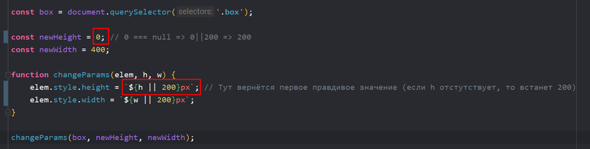

В ==JS== есть оператор ==Nullish==, который возвращает результат в любом случае, кроме `null` и `undefined`

То есть, если `username` существует, то выведем `User`, в противном случае, то, что идёт дальше. И только в последнем случае `username` существует, поэтому выводится он (его значение)

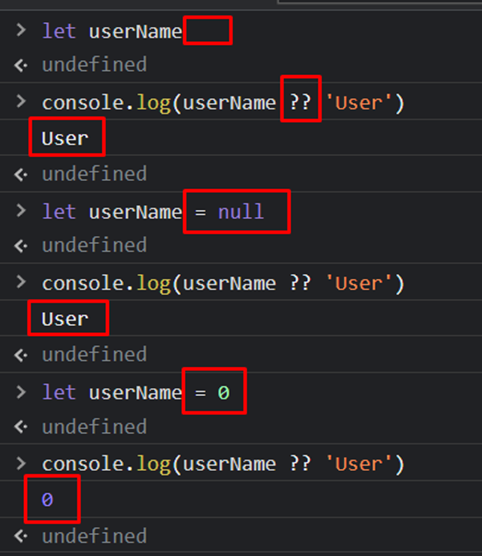

И тут мы уже поправили логику программы. Теперь она может принять в себя `0` и выдать нужный результат. Так же можно использовать данный оператор в математических операциях

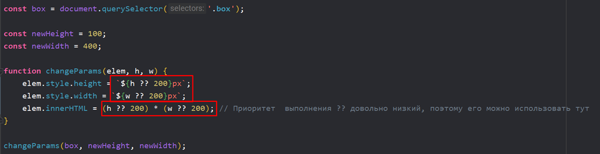

Нулиш операторы нельзя использовать вместе с логическими операторами

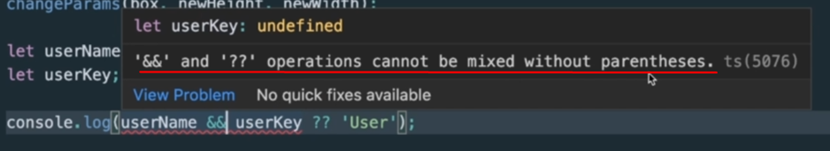

## 003 (д) Оператор опциональной цепочки (.) ES11

Оператор опциональной цепочки проверяет значение слева от него. Если оно имеет значение `null` или `undefined`, то выполнение после оператора останавливается.

В данном случае, нам нужно вывести контент блока, если тот существует. Чтобы сделать это обычным способом, нам нужно использовать конструкцию с `if` (потому что без проверки выпадет ошибка). Но можно сократить её и просто поставить `?.` после этого блока, проверяя его

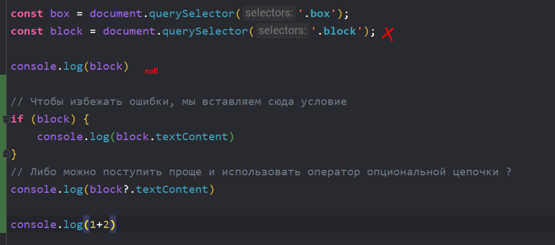

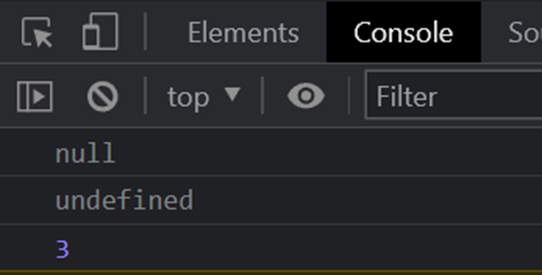

Однако проверка не работает на присвоение значения

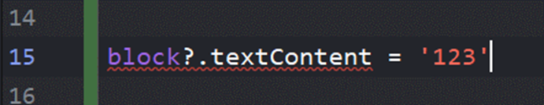

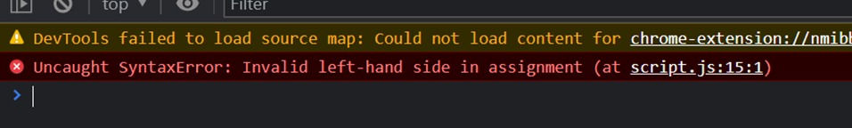

Пример реального использования такого оператора. К нам пришло много огромных объектов от сервера и нужно всех их обработать. Нам нужно достать по элементу из каждого объекта, коих тысячи (а ведь в каком-то из них может и не быть нужной вложенности). Чтобы проверить наличие объекта для вывода и чтобы ничего не поломалось, мы должны прописать огромное условие на наличие каждой вложенности в объекте.

Мы можем избежать насилия наших мозгов и просто вставить оператор `?.` там, где мы не уверены в наличии объекта в принципе (а он мог и не прийти)

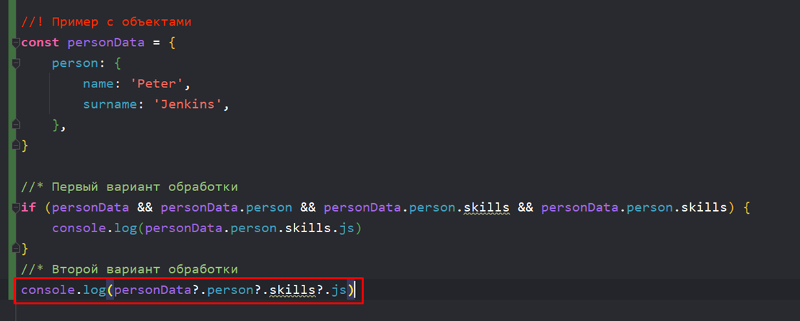

Однако стоит отметить, что оператор нужно ставить только там, где предполагается ошибка. Дело в том, что сайт может начать ломаться, а найти проблему будет, благодаря операторам, сложно

Так же можно проверять наличие определённых методов через полное написание `?.`. Использовать его стоит только для проверки потенциально несуществующих функций (хотя ==WebStorm== явно укажет на существование функции в проекте)

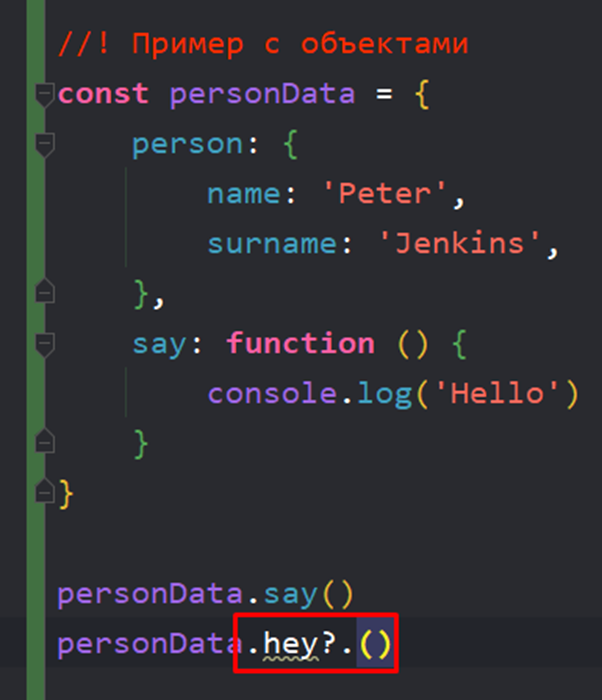

## 004 (д) Живые коллекции и полезные методы

В консоли мы видим коллекции, которые были созданы благодаря `querySelector` и `getElementByClassName`

```JS
const boxesQuery = document.querySelectorAll('.box');
const boxesGet = document.getElementByClassName('box');

console.log(boxesQuery);
console.log(boxesGet);
console.log(document.body.children);
```

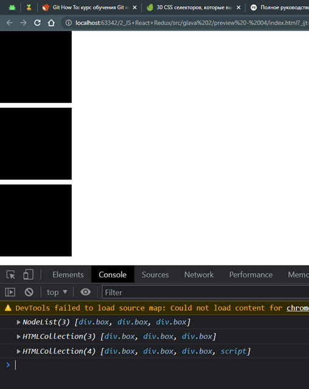

И сейчас перед нами встаёт разница между живыми коллекциями и статическими.

Современный способ обращения к объектам представляет из себя статическую коллекцию, которая статично хранит в себе состояние DOM-дерева. Старый способ обращения к объектам отображает текущее состояние DOM-дерева

```JS
const boxesQuery = document.querySelectorAll('.box');
const boxesGet = document.getElementByClassName('box');

boxesQuery[0].remove();
boxesGet[0].remove();

console.log(boxesQuery);
console.log(boxesGet);
console.log(document.body.children);
```

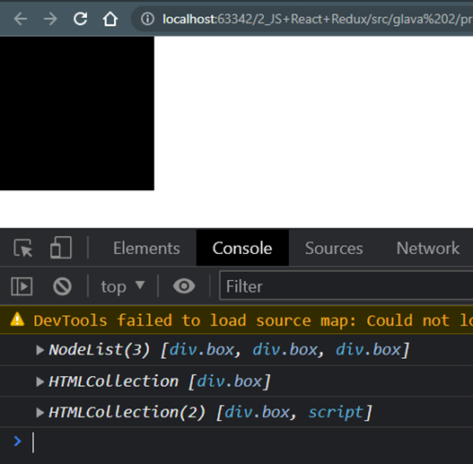

И встаёт иногда такая потребность, чтобы следить за состоянием DOM-дерева в течение его жизни. Мы можем сделать массив из данной коллекции, но тут уже встаёт проблема: массив – это уже статичный объект и следить за DOM-деревом не получится

```JS
// генерируем массив из псевдомассива элементов страницы
console.log(Array.from(boxesGet));
```

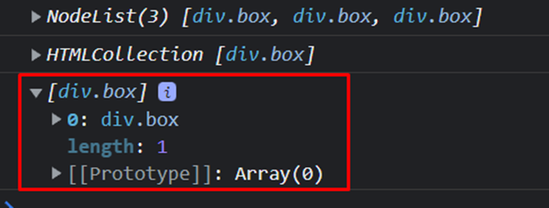

Тут мы добавляем дополнительно пять боксов через цикл

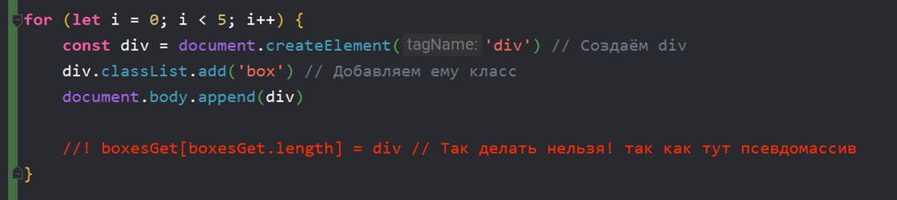

И тут представлены два метода, которые можно применять на псевдомассивах.

1. `matches()` – принимает в себя селектор и при его нахождении в объекте возвращает `true`
2. `closest()` – принимает в себя класс и выводит ближайший родительский элемент с таким классом.

Мы имеем структуру: `wrapper > innerWrapper > box`. И при поиске враппера выведется вся эта структура

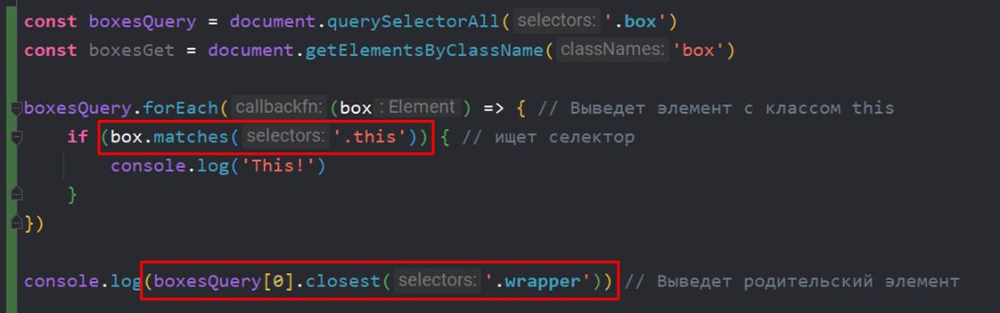

## 005 (д) Тип данных Symbol

Символы используются для создания уникального идентификатора – они уникальны и неизменяемы

В качестве ключа у нас всегда используется строка. Мы можем записать её как в кавычках, так и без. Кроме **строк** свойствами объектов могут быть ещё и **символы** – _и только эти два типа данных_

```JS
const person = {
	'name': 'Alexey'
};
```

Символы – это всегда уникальные идентификаторы (даже если есть идентификаторы с одинаковыми значениями). По точечной записи обратиться к ним нельзя. Создать через `new` – не получится

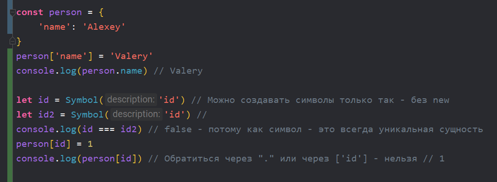

Символы позволяют создать скрытые при обычном доступе свойства, которые не показываются при переборе объекта

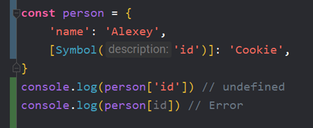

Получаем значение ключа:

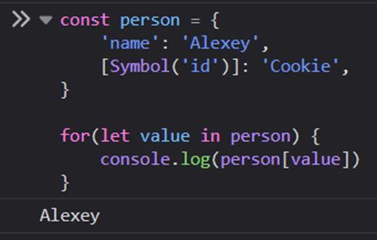

Получаем сам ключ:

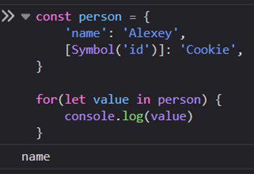

Мы можем написать отдельный метод через `this[]`, чтобы получить символ из объекта

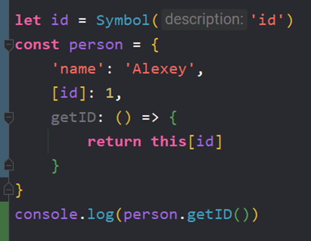

И так же есть отдельный метод, который позволяет получить массив символов из объекта

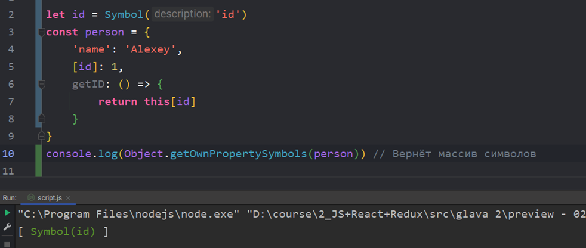

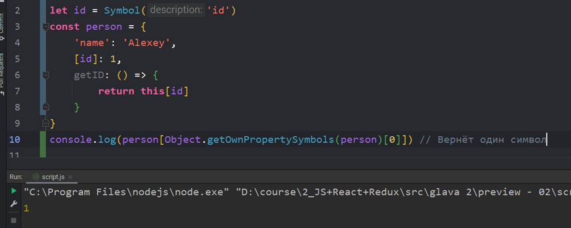

Основная причина создания символов – это защита данных. Символы исключают возможность перезаписи нужных данных в объекте. Когда в проекте огромное количество строк кода и множество библиотек, то сложно будет уследить за тем, не будут ли перезаписаны нужные нам данные

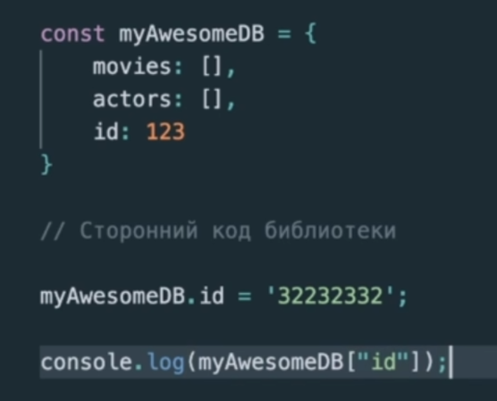

Тут мы записываем ключ `id` в объект, но не меняем при этом символ `id`

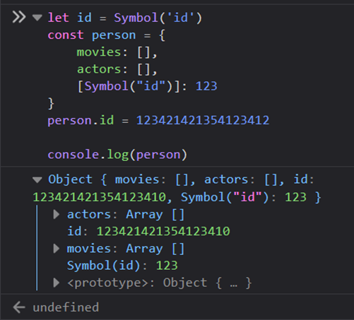

Когда мы формируем символ через синтаксис `Symbol.for(‘id’)`, то у нас формируется глобальный реестр символов и теперь это описание не будет уникальным

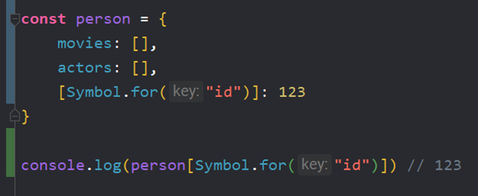

Есть и обратный метод, который получает ИЗ глобального реестра значение

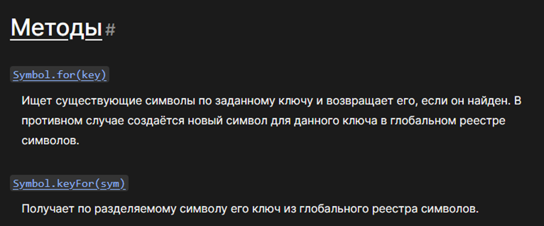

## 006 (д) Дескрипторы свойств и полезные методы объектов

Дескрипторы определяют как работают свойства. Ещё они называются флагами:

- `writable(true)` – свойство можно изменить. `False` – свойство только для чтения
- `enumerable(true)` – свойство будет перечисляться в циклах
- `configurable(true)` – свойство можно удалить, а его атрибуты можно будет изменить

Для всех создаваемых свойств они всегда имеют значение `true`

Через метод отображения дескрипторов `getOwnPropertyDescriptor` ОДНОГО свойства (есть метод `getOwnPropertyDescriptors`, который выводит дескрипторы для нескольких свойств) можно отобразить ключ-значение и его дескрипторы

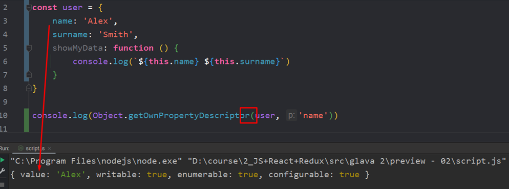

Через `defineProperty()` мы можем поменять значение флага

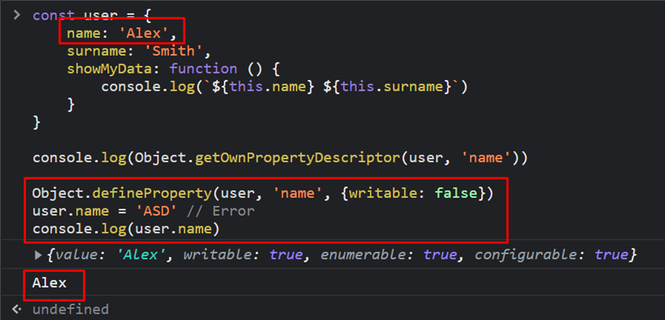

Если мы создадим свойство через `defineProperty()`, то по умолчанию все флаги будут иметь значение `false`

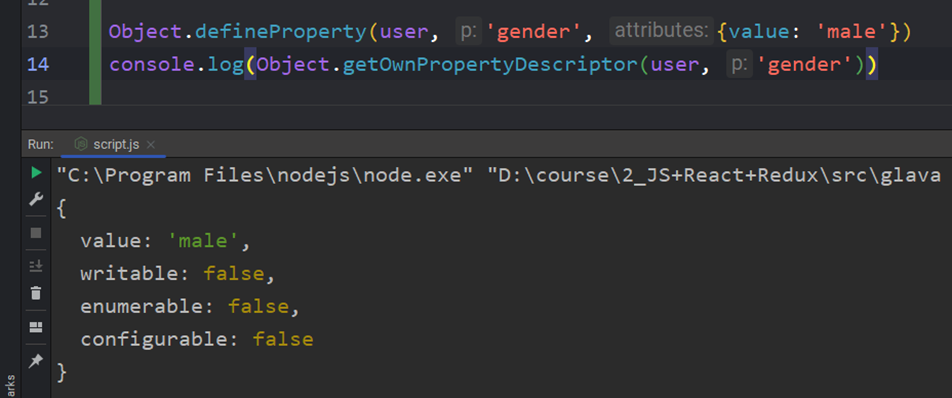

И тут мы запретили изменение значения свойства объекта

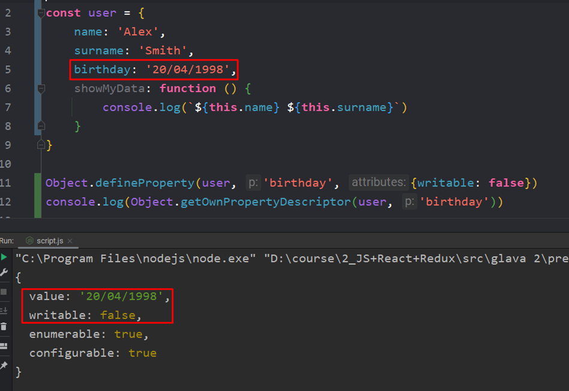

А тут мы создали это свойство через промпт и оно сразу имеет все значения в `false`

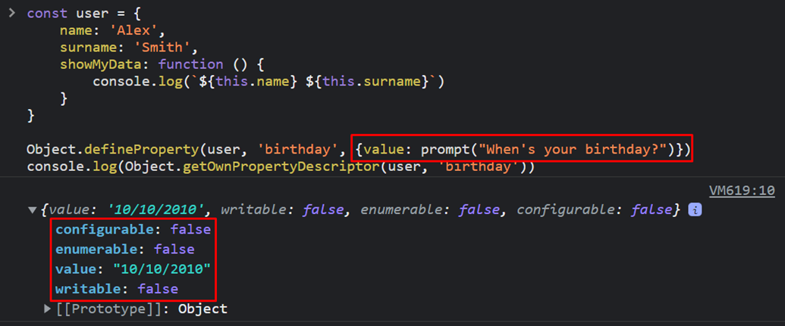

И так же можно прописать нужные флаги отдельно при создании свойства

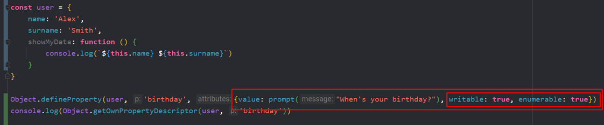

И тут уже показан пример как скрыть метод в объекте через `defineProperty()`

После того, как свойство было установлено, оно уже не будет реагировать на данный метод и поменять его буде невозможно. Поставить так флаг – это дорога в один конец

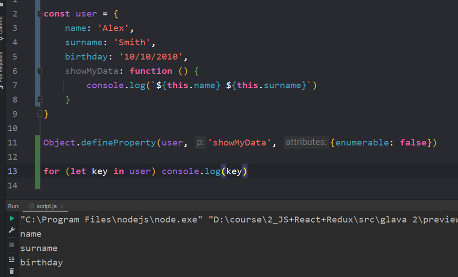

Через `defineProperties()` мы можем поменять флаги сразу для нескольких значений объекта

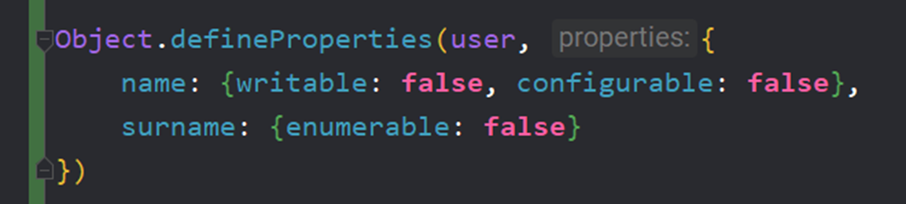

И так же стоит отметить и символы. Даже при положительных значениях флагов они работают ровно так же, как и при отрицательных. Они не отображаются при переборе и им нельзя придать другое значение

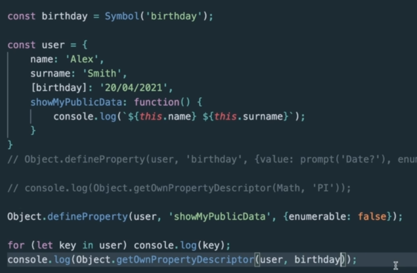

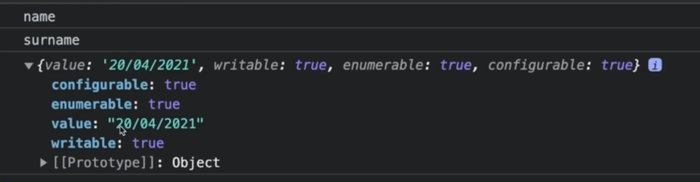

И вот все методы объектов, которые по-хорошему нужно знать

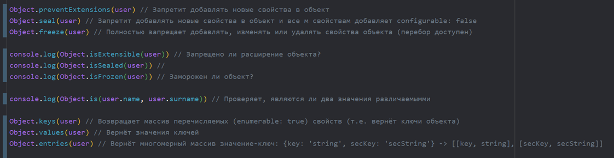

## 007 () Итерируемые конструкции

Кратко повторим конструкцию `for-in`. Она проходится по всем элементам объекта (массива). Однако его главная проблема в том, что он может проходиться не по порядку

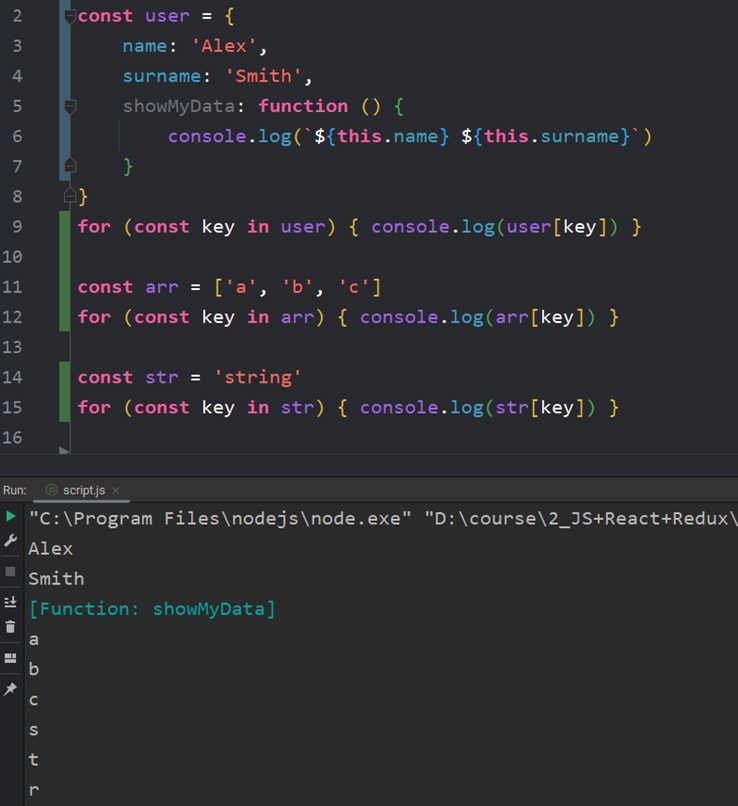

Когда мы говорим уже про конструкцию `for-of`, то она сразу уже выдаёт значение. Однако может выдать значение только итерируемого объекта. То есть перебрать массив или строку через `for-of` - возможно, а уже при переборе объекта выйдет ошибка, так как объект – это неитерируемая единица.

Основной плюс `for-of` заключается в том, что он выведет все значения из массива именно в том порядке, в котором они записаны.

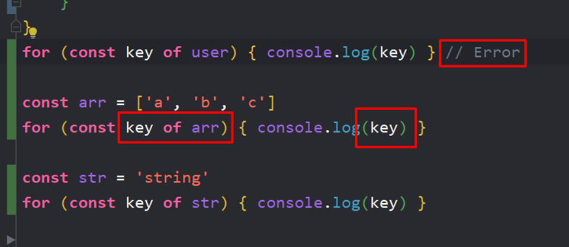

И тут опять же можно увидеть, что `for-of` перебирает только те значения, которые являются собственными (проверить можно через `hasOwnProperty()`)

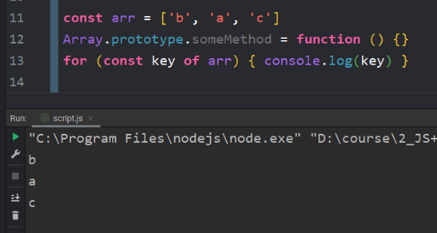

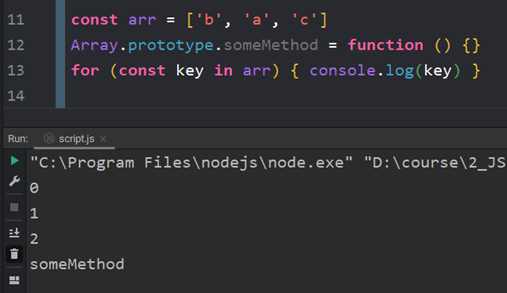

Грубо говоря, итерируемые объекты – это те структуры, которые хранят в себе символ-итератор

Итератор – это метод, который возвращает объект с методом `next()`

Чтобы перебрать объект, нужно ему добавить итератор самостоятельно

Когда мы используем `for-of`, то он вызывает этот прописанный метод (на скрине) 1 раз и этот метод должен нам вернуть итератор (а именно объект с методом `next()`). И дальше `for-of` будет работать с тем объектом, который вернулся из этого метода.

Внутри метода находится само отображение выполнения возврата значения и само значение

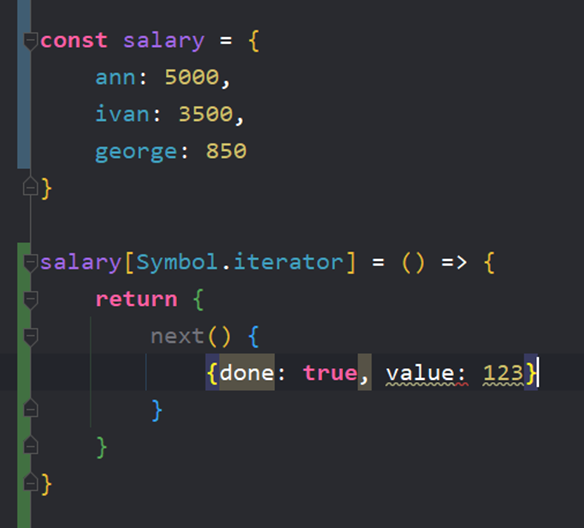

И тут уже более подробно опишем:

Мы имеем объект `salary`. После него мы создаём через символ наш итератор. Итератор хранит в себе функцию. Функция возвращает объект, внутри которого имеется несколько свойств и метод `next()`.

Метод `next()` в себе имеет определённую логику – тут мы остановим выполнение цикла только тогда, когда внутри объекта первое свойство будет иметь значение больше, чем последнее.

Цикл будет продолжаться, пока возвращаемый `done` будет иметь значение `false`. Чтобы передать значение в следующий цикл, нужно передать его через `value`. Останавливается цикл через `done: true`

Тут ещё нужно отметить, что функция должна иметь вид: `function(){}`. Стрелочная работать не будет

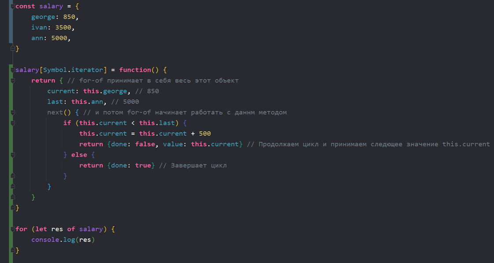

И вот через `for-of` наконец-то мы можем перебрать объект. Однако перебор будет выполнять определённую логику

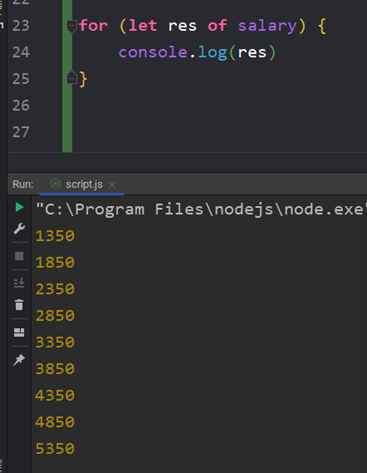

Так же такой итератор можно вызывать и вручную. Мы можем присвоить итератор в переменную и так как это метод, то его можно вызвать сразу через `()`

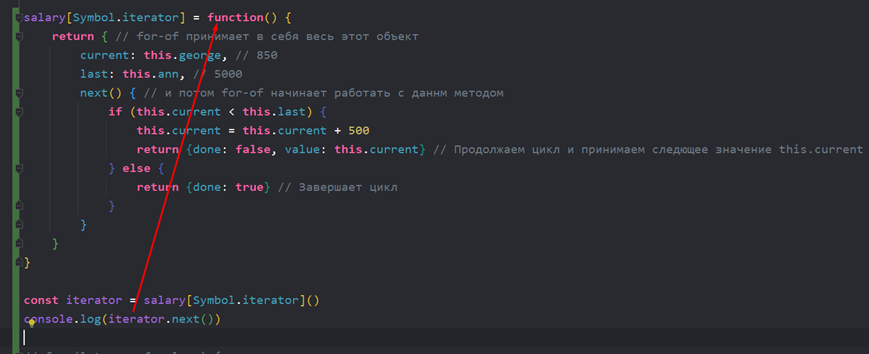

## 008 () Map

Тут хочется пояснить, что в качестве ключа объекта всегда используется строка. Даже если мы напишем число, то оно переведётся в строку. Однако, если вставить `{}` объект, то мы получим ошибку

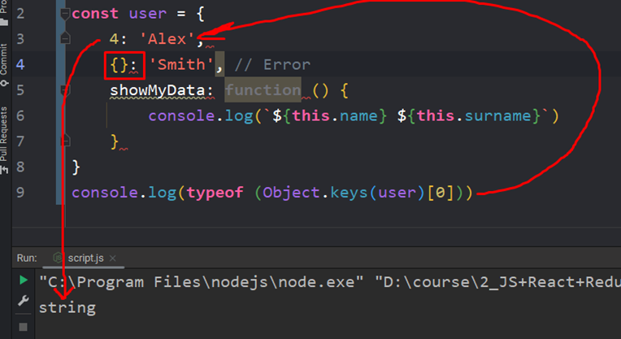

`Map` – это специфический тип данных, который выглядит как объект, но по-сути может представлять из себя и массив, и строку, и число и любой другой тип данных

Тут можно увидеть, как `map` используется для создания объекта, у которого в качестве ключа используется объект

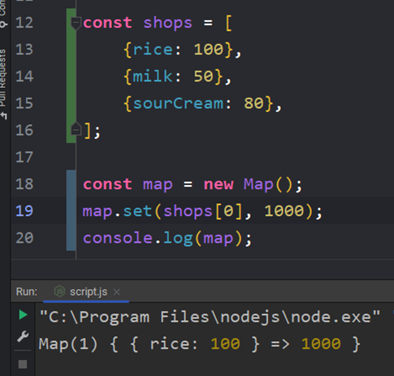

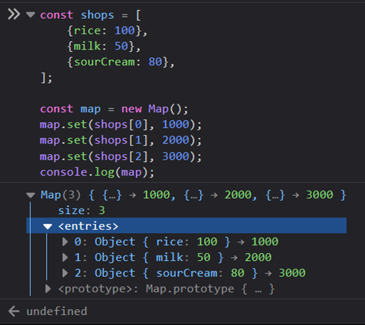

Так же можно сократить запись, если записывать через цепочку либо можно делать присваивание через цикл

Однако самым рациональным методом будет присваивать значения через цикл из массива или определённой базы данных, которая может к нам подгрузиться

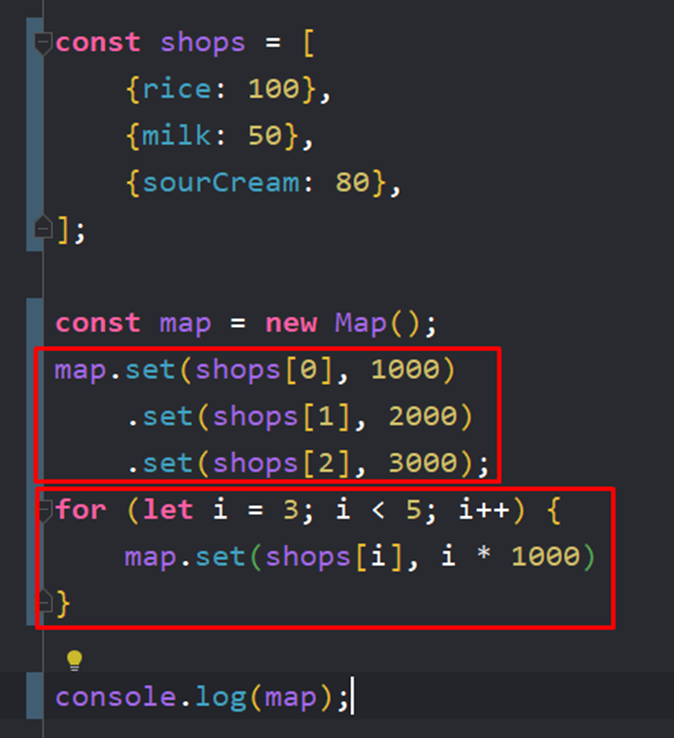

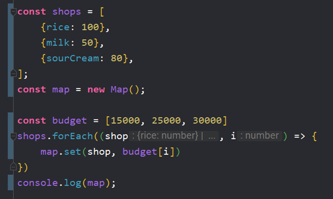

Так же мы имеем метод `get()`, который позволяет получить map-значение из массива

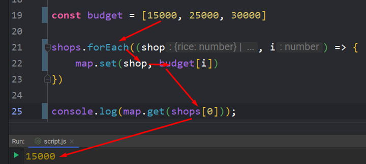

Метод `has()` проверяет наличие значения в мапе

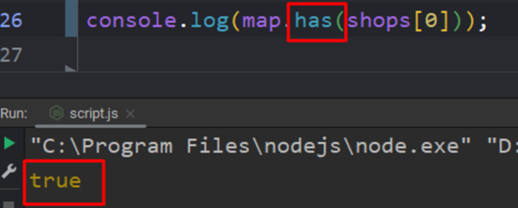

И вот несколько методов для работы с нашей картой

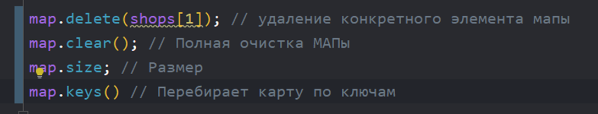

`Map` по сути своей представляет из себя массив массивов. Это можно было определить через `[entries]` в консоли браузера. Начальные данные через конструктор можно задать так:

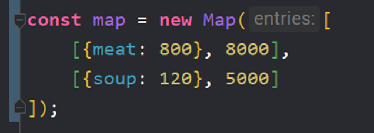

Ну и через перебор можно вывести ключи из нашей карты

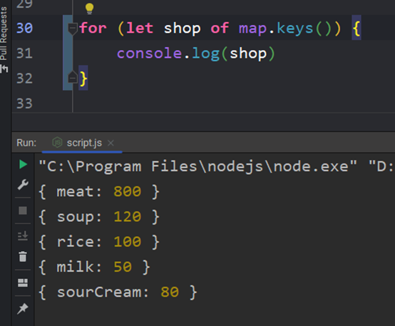

Тут представлен код, который в массив закинет ключи ключей объектов карты. Тут мы берём через метод `keys()` ключи из карты и внутри `push()` (закидывания элемента в массив) мы вычленяем из объекта - бывшего ключа (который до этого был ключом элемента карты) ключ

Коротко: `keys()` -> берёт ключи из карты, `Object.keys()` -> берёт ключ объекта (который является ключом карты)

Получается такое получение ключей

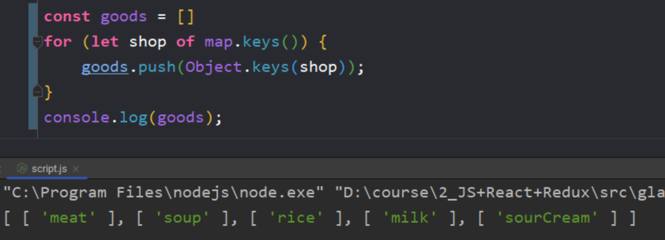

Сейчас мы получаем вторую часть от элементов карты – значения. Получаем их просто перебирая `Map` через метод `values()`, который возвращает значения

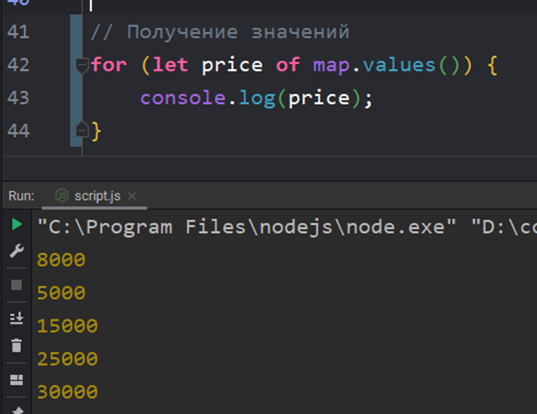

Тут мы получаем сами значения, записанные в карту

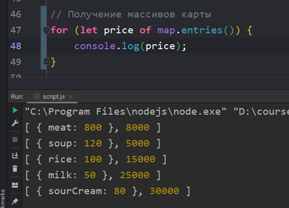

Так же можно произвести отдельно получение значений объекта-ключа и значения через деструктуризацию массива (карта – хранит каждое значение в виде массива)

Нужно отметить, что метод `entries()` возвращает как-раз таки массивы

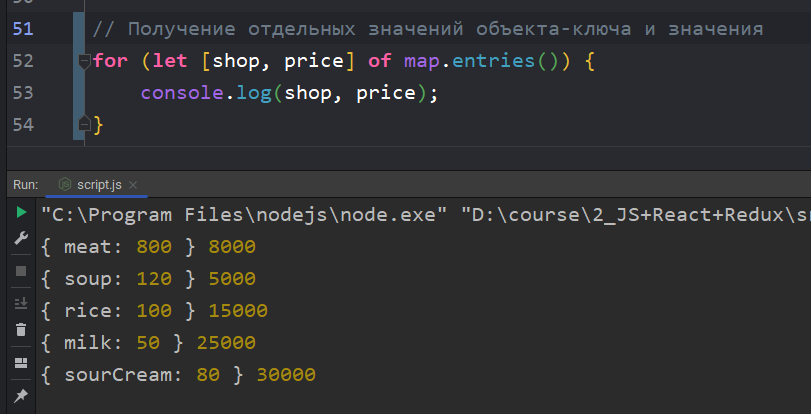

Ну и самый рекомендуемый способ перебора – через встроенный метод `forEach`. В его колбэк-функцию передаётся значение, ключ и сама карта (к ней вполне можно обратиться)

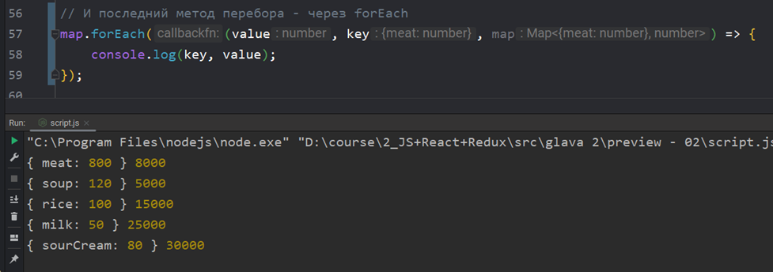

Перевод объекта в карту

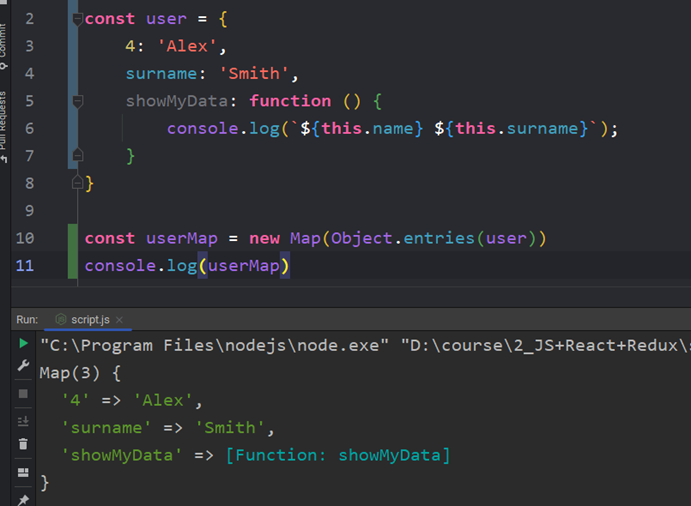

Перевод карты в объект

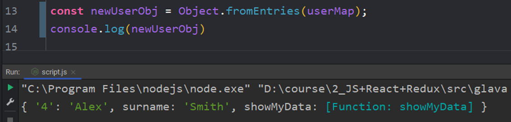

> [!info] Все особенности `Map()`:
>
> 1.  У карт ключами могут быть любые типы данных: строки, массивы, объекты, функции, числа (В объектах только строки)
> 2.  Карты добавляют новые значения всегда в конец и всегда в них соблюдается порядок (В объектах могут добавляться куда угодно)
> 3.  В картах при создании нет никаких наследуемых свойств через прототип (В объектах могут быть)
> 4.  Карты легко перебирать
> 5.  Размеры карты легко получить (`size()`)

## 009 () Set

Это массив, где каждое значение встречается только один раз

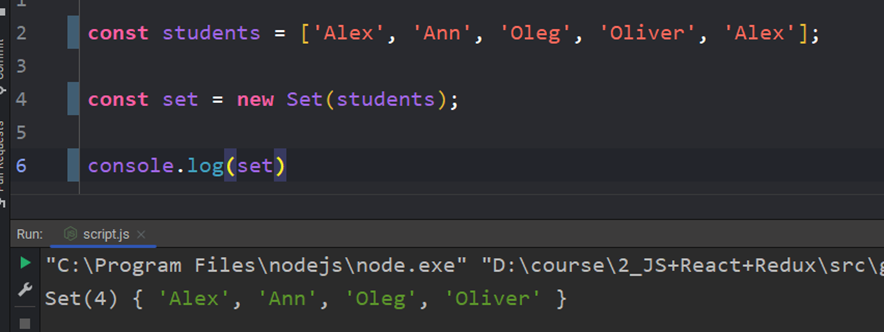

И так же мы можем добавить новые значения в такой массив

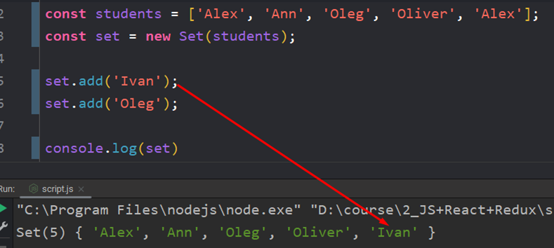

Ну и так же нам доступна ещё и цепочная запись через точку

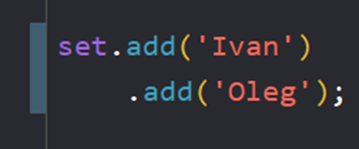

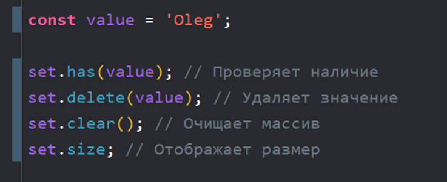

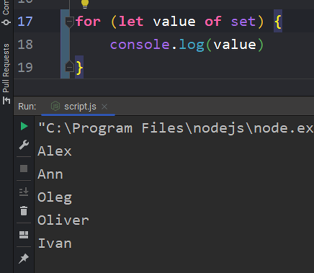

И второй способ – перебор через `forEach()`. Его особенность заключается в том, что у нас нет ключей в таком массиве и поэтому в качестве второго аргумента передаётся это же значение, но снова. Последний аргумент – сам сет

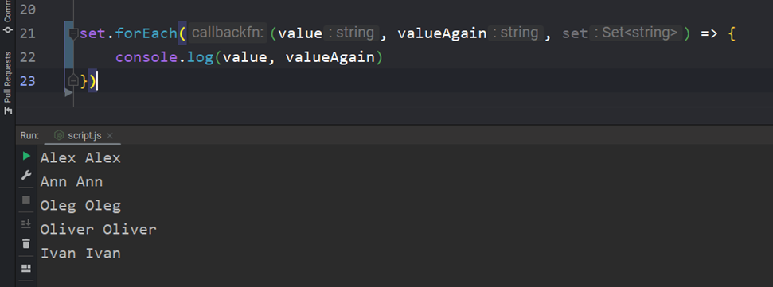

Ну и у нас так же есть методы, присущие структуре Map. Методы `keys()` и `entries()` созданы для обратной совместимости с `Map`

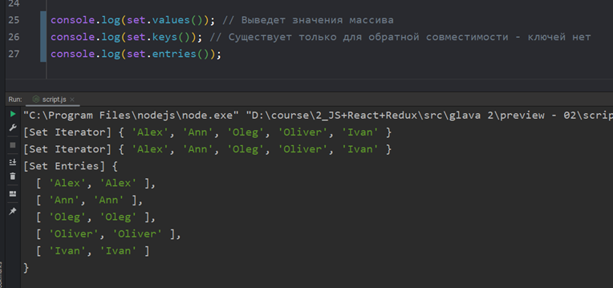

В практическом применении `Set` используют для быстрой фильтрации массивов. Писать фильтр самому – это долго и неэффективно. Сет изначально хорошо оптимизирован и будет работать быстрее, чем самописный фильтр

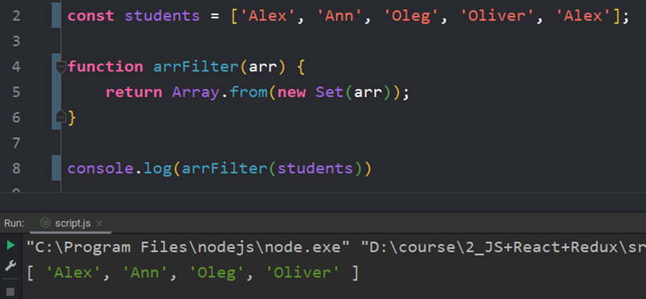

## 010 () BigInt

Таким способом мы можем вывести максимальное число в интеджере. Иногда появляются ситуации, когда нам нужно использовать числа больше (например, при работе в банках)

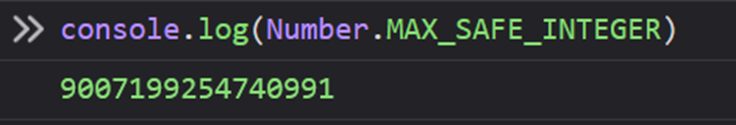

И для этого уже используется тип данных `BigInt`. Его можно написать двумя способами:

1. Через `n` на конце
2. Через метод `BigInt`. Этот метод может принимать как число, так и строку

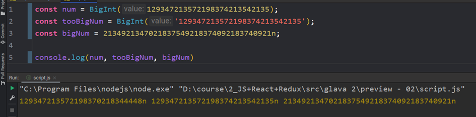

Большие числа нельзя складывать с обычными и нельзя использовать внутри методов `Math` – это два их самых основных ограничения. Так же они работают почти со всеми унарными операторами (кроме `+`). Обычные операции с двумя большими числами – работают. При делении друг на друга большие числа округляются в меньшую сторону

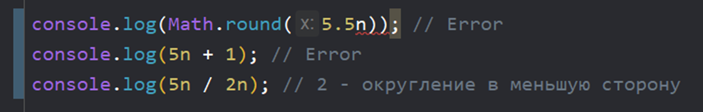

К операциям сравнения большие числа относятся нормально и их можно сравнить даже с обычными числами

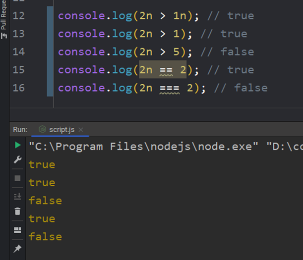

Чтобы сложить большие и обычные числа можно воспользоваться таким синтаксисом:

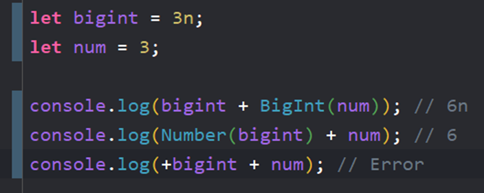

> [!info] И самое важное:
>
> - `BigInt` нужно использовать только тогда, когда это реально необходимо. Потому что при переводе большого числа в обычное, все не входящие в диапазон цифры – отпадут.
> - Например, число `21342134721934721347921389421893231` откинет значения до `2134213472193472`

## 011 Дополнительные ссылки

002 -https://developer.mozilla.org/ru/docs/Web/JavaScript/Reference/Operators/Nullish_coalescing_operator

003 -https://developer.mozilla.org/ru/docs/Web/JavaScript/Reference/Operators/Optional_chaining

004 -

https://drive.google.com/file/d/1TCuJlE6AYEXD9NjW9XinMsZ-1zxHBDAG/view?usp=sharing

005 -

https://tc39.es/ecma262/#sec-well-known-symbols

006 Object.keys-

https://developer.mozilla.org/ru/docs/Web/JavaScript/Reference/Global_Objects/Object/keys

006 Object.values-

https://developer.mozilla.org/ru/docs/Web/JavaScript/Reference/Global_Objects/Object/values

006 Object.entries-

https://developer.mozilla.org/ru/docs/Web/JavaScript/Reference/Global_Objects/Object/entries

007 The-Essential-Guide-to-JavaScript-Iterators - https://www.javascripttutorial.net/es6/javascript-iterator/

007 hasOwnProperty - https://developer.mozilla.org/ru/docs/Web/JavaScript/Reference/Global_Objects/Object/hasOwnProperty

007 for.in-versus-for.of - https://bitsofco.de/for-in-vs-for-of/

007 for-of - https://developer.mozilla.org/ru/docs/Web/JavaScript/Reference/Statements/for...of

007 How-to-iterate-over-a-JavaScript-object - https://stackoverflow.com/questions/14379274/how-to-iterate-over-a-javascript-object

008 - https://developer.mozilla.org/en-US/docs/Web/JavaScript/Reference/Global_Objects/Map

009 find - https://developer.mozilla.org/ru/docs/Web/JavaScript/Reference/Global_Objects/Array/find

009 - https://developer.mozilla.org/ru/docs/Web/JavaScript/Reference/Global_Objects/Set

010 - https://developer.mozilla.org/ru/docs/Web/JavaScript/Reference/Global_Objects/BigInt
