#Profiling #React

Сегодня поговорим об измерении производительности рендеринга React-компонентов с использованием API React Profiler. Ещё мы будем оценивать взаимодействия с компонентом, применяя новый экспериментальный API Interaction Tracing. Кроме того, мы воспользуемся API User Timing для проведения собственных измерений.

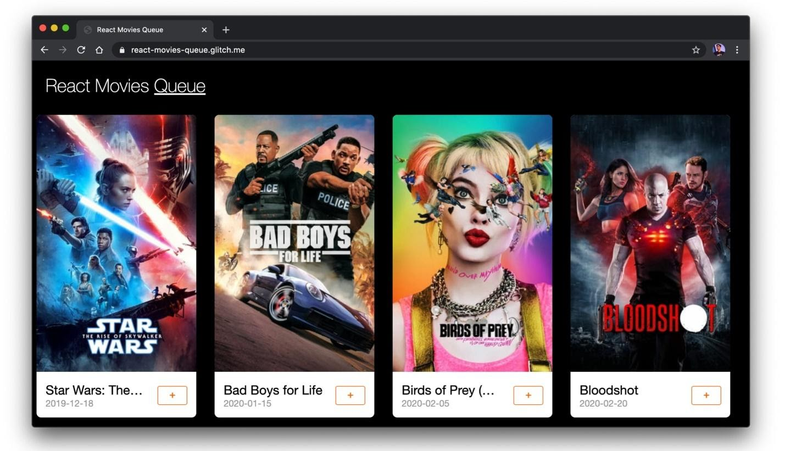

## API React Profiler

[API React Profiler](https://reactjs.org/docs/profiler.html) предназначен для оценки скорости работы рендеринга и помогает выявлять узкие места производительности приложений.

```JSX
import React, { Fragment, unstable_Profiler as Profiler} from "react";
```

Компонент `Profiler` принимает коллбэк `onRender` в виде свойства. Он вызывается каждый раз, когда компонент в профилируемом дереве фиксирует обновление.

```JSX
const Movies = ({ movies, addToQueue }) => (
  <Fragment>
    <Profiler id="Movies" onRender={callback}>
```

Давайте, в тестовых целях, попробуем измерить время, необходимое на рендеринг частей компонента `Movies`. Вот как это выглядит.

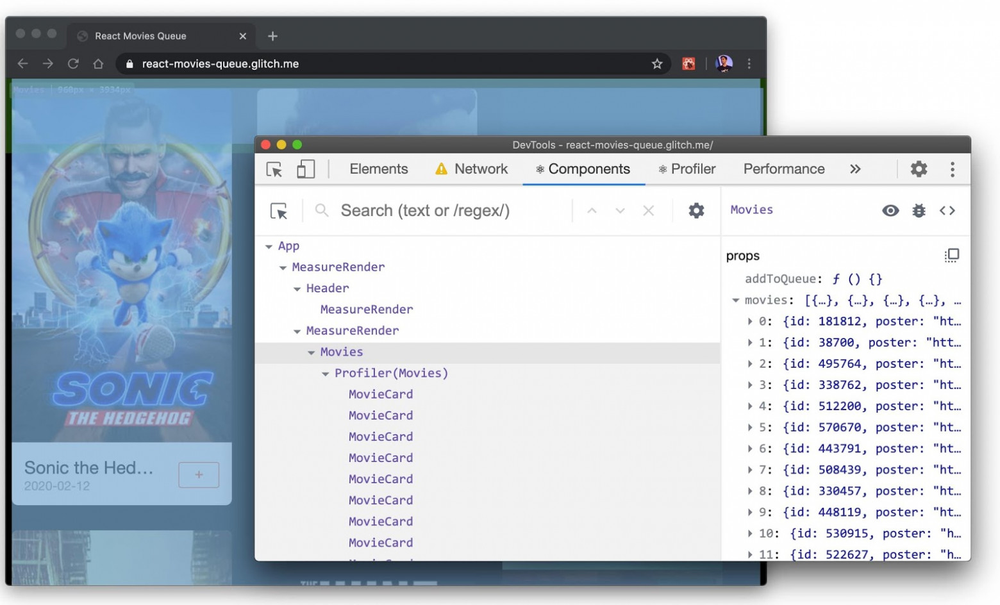

Коллбэк `onRender` принимает параметры, которые описывают то, что рендерится, и время, необходимое на рендеринг. Сюда входит следующее:

- `id`: Свойство `id` из дерева компонента `Profiler`, для которого было зафиксировано изменение.
- `phase`: или `mount` (если дерево было смонтировано), или `update` (если дерево было повторно отрендерено).
- `actualDuration`: время, затраченное на рендеринг зафиксированного обновления.
- `baseDuration`: предполагаемое время рендеринга всего поддерева без кеширования.
- `startTime`: время, когда React начал рендерить это обновление.
- `commitTime`: время, когда когда React зафиксировал это обновление.
- `interactions`: множество «взаимодействий» для данного обновления.

```JSX
const callback = (id, phase, actualTime, baseTime, startTime, commitTime) => {
    console.log(`${id}'s ${phase} phase:`);
    console.log(`Actual time: ${actualTime}`);
    console.log(`Base time: ${baseTime}`);
    console.log(`Start time: ${startTime}`);
    console.log(`Commit time: ${commitTime}`);
}
```

Загрузим страницу и перейдём в консоль инструментов разработчика Chrome. Там мы должны увидеть следующее.

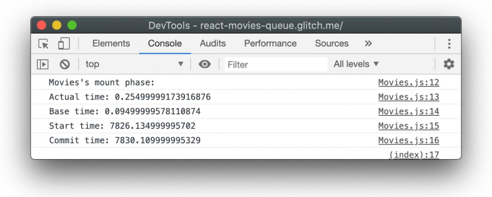

Мы, кроме того, можем открыть инструменты разработчика React, перейти на закладку `Profiler` и визуализировать сведения о времени рендеринга компонентов. Ниже показана визуализация этого времени в виде flame-графика.


Мне, кроме того, нравится использовать тут режим просмотра `Ranked`, где приводится упорядоченное представление данных. В результате компоненты, на рендеринг которых уходит больше всего времени, оказываются в верхней части списка.

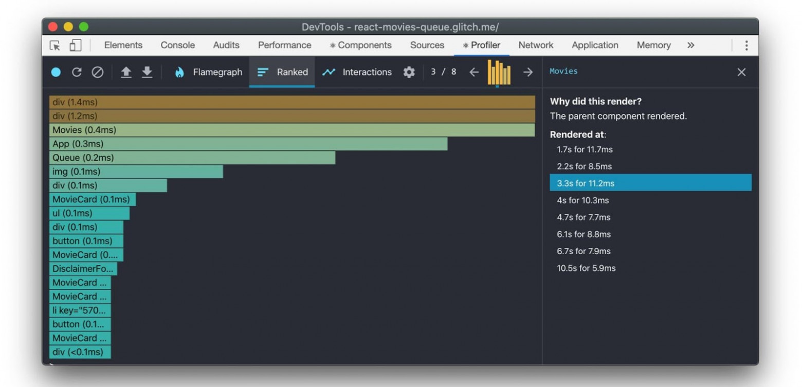

Кроме того, для проведения измерений в разных частях приложения можно воспользоваться несколькими компонентами `Profiler`:

```JSX
import React, { Fragment, unstable_Profiler as Profiler} from "react";

render(
  <App>
    <Profiler id="Header" onRender={callback}>
      <Header {...props} />
    </Profiler>
    <Profiler id="Movies" onRender={callback}>
      <Movies {...props} />
    </Profiler>
  </App>
);
```

А как проанализировать взаимодействия пользователей с компонентами?

## API Interaction Tracing

Хорошо бы иметь возможность отслеживать взаимодействия пользователя с интерфейсом приложения (вроде щелчков по элементам). Это позволит находить ответы на интересные вопросы вроде такого: «Сколько времени понадобилось на обновление DOM после щелчка по этой кнопке?». К нашему счастью, в React есть экспериментальная поддержка анализа взаимодействий пользователя с приложением с использованием API Interaction Tracing из нового пакета [scheduler](https://www.npmjs.com/package/scheduler). Документацию по нему можно почитать [здесь](https://www.npmjs.com/package/scheduler).

Сведения о взаимодействиях пользователя и приложения снабжают описаниями (например — «Пользователь щёлкнул по кнопке Добавить в корзину») и отметками времени. Кроме того, при настройке анализа взаимодействий используются коллбэки, в которых выполняются действия, соответствующие тому или иному взаимодействию.

В нашем приложении есть кнопка `Add Movie To Queue`, на которой выводится значок `+`. Она служит для добавления фильмов в очередь просмотра.

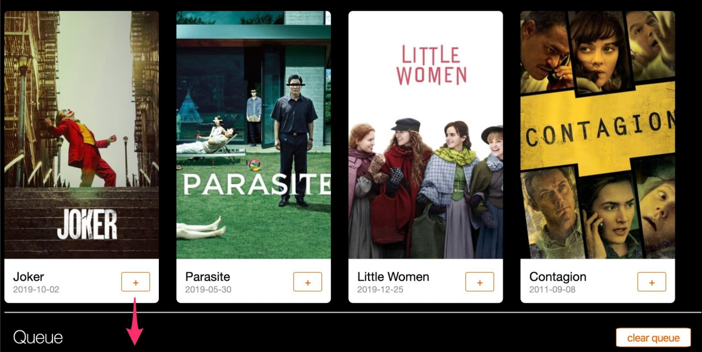

Вот пример кода, отслеживающего обновления состояния для этого взаимодействия пользователя с приложением:

```JSX
import { unstable_Profiler as Profiler } from "react";
import { render } from "react-dom";
import { unstable_trace as trace } from "scheduler/tracing";

class MyComponent extends Component {
  addMovieButtonClick = event => {
    trace("Add To Movies Queue click", performance.now(), () => {
      this.setState({ itemAddedToQueue: true });
    });
  };
}
```

Мы можем записать сведения об этом взаимодействии и узнать о его длительности, обратившись к инструментам разработчика React.

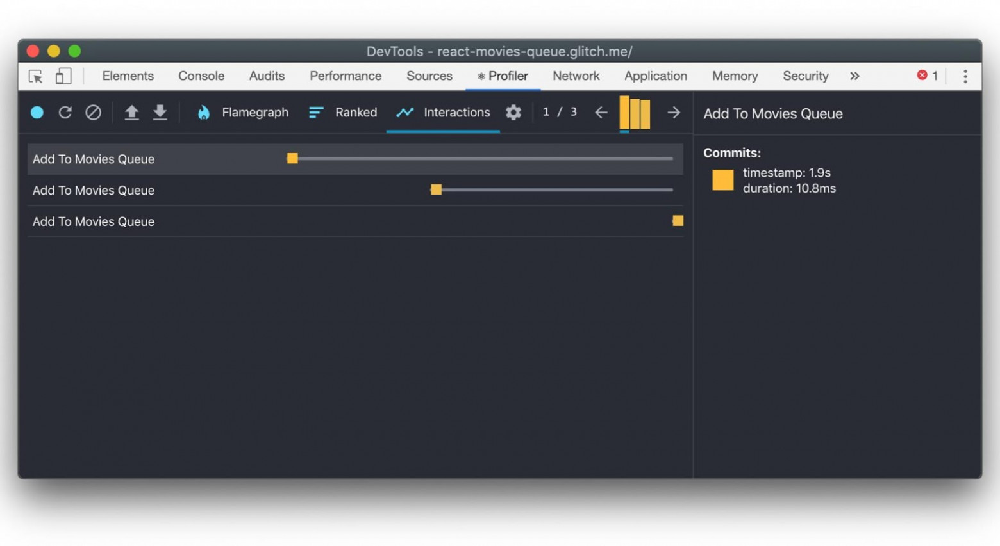

С помощью API Interaction Tracing можно, кроме того, собрать сведения о первом рендеринге компонента:

```JSX
import { unstable_trace as trace } from "scheduler/tracing";

trace("initial render", performance.now(), () => {
   ReactDom.render(<App />, document.getElementById("app"));
});
```

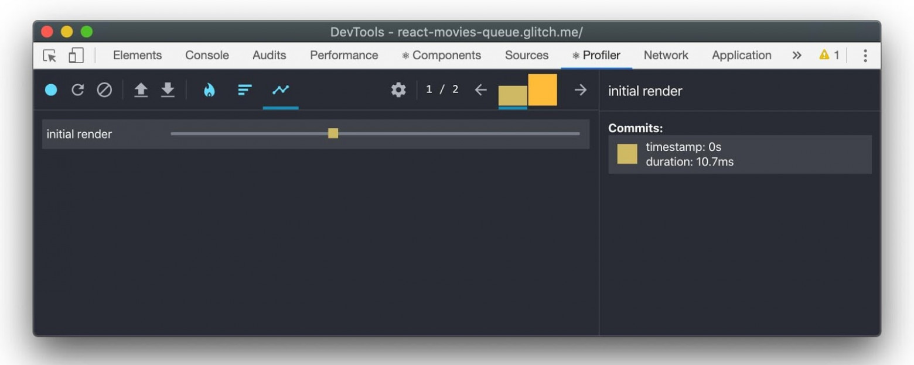

Автор API приводит и другие [примеры](https://gist.github.com/bvaughn/8de925562903afd2e7a12554adcdda16) его использования. Например, иллюстрирующие профилирование асинхронных задач.

## Puppeteer

Для автоматизации тестирования взаимодействия пользователя с элементами приложения интересным может показаться применение [Puppeteer](https://developers.google.com/web/tools/puppeteer). Это — Node.js-библиотека, которая даёт доступ к высокоуровневому API, предназначенному для управления браузером Chrome без пользовательского интерфейса с использованием протокола DevTools.

При использовании Puppeteer в распоряжении разработчика оказываются вспомогательные [методы](https://pptr.dev/#?product=Puppeteer&version=v2.1.1&show=api-tracingstartoptions) `tracing.start()` и `tracing.stop()`, предназначенные для сбора показателей производительности DevTools. Ниже показан пример использования этих механизмов для сбора данных о том, что происходит при щелчке по интересующей нас кнопке.

```JSX
const puppeteer = require('puppeteer');

(async () => {
  const browser = await puppeteer.launch();
  const page = await browser.newPage();
  const navigationPromise = page.waitForNavigation();
  await page.goto('https://react-movies-queue.glitch.me/')
  await page.setViewport({ width: 1276, height: 689 });
  await navigationPromise;

  const addMovieToQueueBtn = 'li:nth-child(3) > .card > .card__info > div > .button';
  await page.waitForSelector(addMovieToQueueBtn);

  // Запуск профилирования...
  await page.tracing.start({ path: 'profile.json' });
  // Щелчок по кнопке
  await page.click(addMovieToQueueBtn);
  // Остановка профилирования
  await page.tracing.stop();

  await browser.close();
})()
```

Теперь, загрузив файл `profile.json` в панель `Performance` инструментов разработчика, мы можем видеть то, вызов каких функций инициировало нажатие на кнопку.

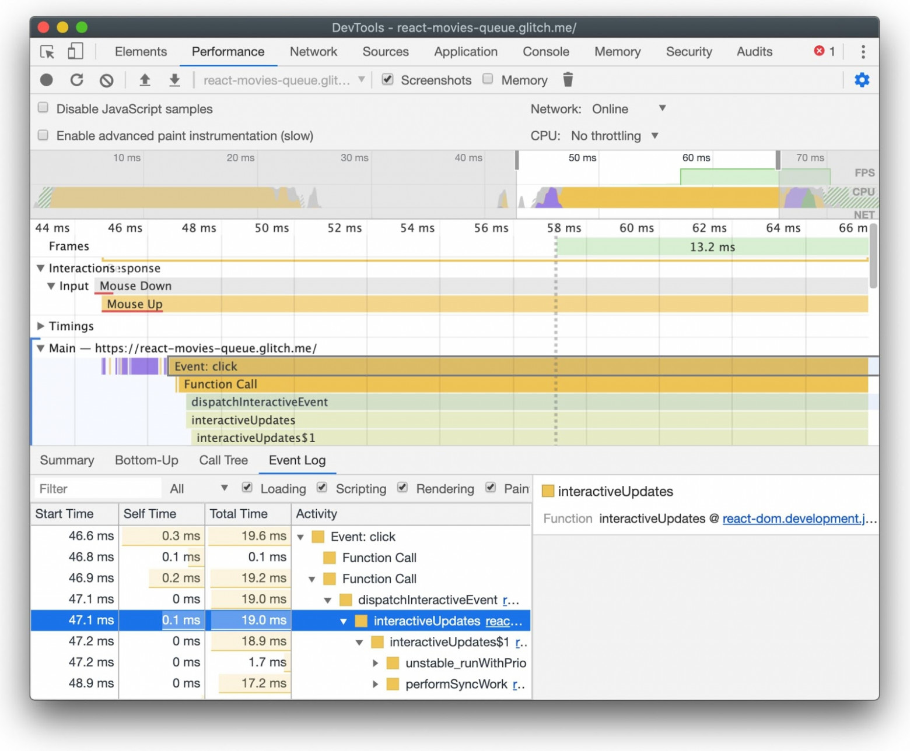

Если вам интересна тема анализа производительности компонентов — взгляните на [этот](https://calendar.perfplanet.com/2019/javascript-component-level-cpu-costs/) материал.

## API User Timing

[API User Timing](https://developer.mozilla.org/en-US/docs/Web/API/User_Timing_API) позволяет разработчику создавать собственные метрики производительности, используя высокоточные отметки времени. Метод `window.performance.mark()` создаёт отметку времени, которой назначается имя. Метод `window.performance.measure()` позволяет узнать время, прошедшее между двумя измерениями.

```JSX
// Запись времени перед началом задачи
performance.mark('Movies:updateStart');
// Решение задачи

// Запись времени после окончания задачи
performance.mark('Movies:updateEnd');

// Нахождение разницы между временем начала и окончания задачи
performance.measure('moviesRender', 'Movies:updateStart', 'Movies:updateEnd');
```

Профилируя React-приложением с использованием закладки `Performance` инструментов разработчика Chrome, можно найти раздел `Timing`, заполненный временными показателями, касающимися React-компонентов. React, во время рендеринга, умеет публиковать эти сведения с использованием API User Timing.

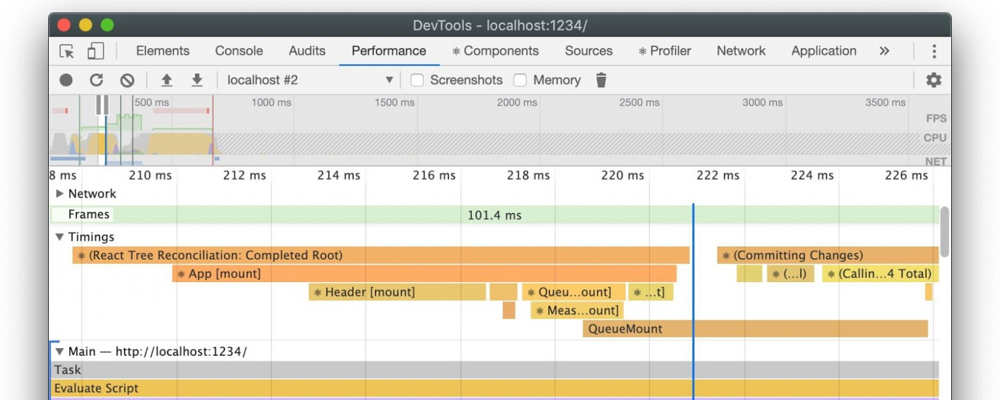

Обратите внимание на то, что из DEV-сборок React убирают API User Timings, заменяя его на API React Profiler, который предоставляет более точные отметки времени. Возможно, в будущем поддержку этого API вернут, сделав это для тех браузеров, которые поддерживают спецификацию User Timing Level 3. 

В интернете вам могут попасться React-сайты, которые используют API User Timing для определения собственных метрик. Сюда, например, входит метрика Reddit `Time to first post title visible` и метрика Spotify `Time to playback ready`.

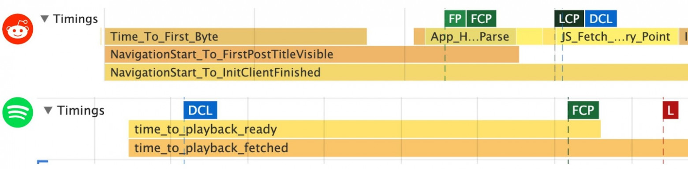

Показатели метрик, созданных средствами API User Timing, удобно [выводятся](https://web.dev/user-timings/) в панели [Lighthouse](https://developers.google.com/web/tools/lighthouse/) инструментов разработчика Chrome.

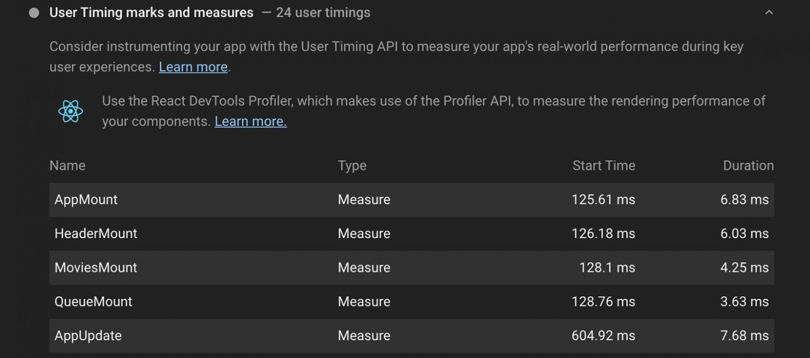

Например, в состав свежих версий [Next.js](https://nextjs.org/) [включены](https://github.com/zeit/next.js/pull/8069) пользовательские метрики и механизмы измерения множества различных событий. В том числе — следующих:

- `Next.js-hydration`: время, необходимое для приведения заранее отрендеренной разметки в рабочее состояние.
- `Next.js-nav-to-render`: время от начала навигации до начала рендеринга.

Все эти измерения выводятся в области `Timings`.

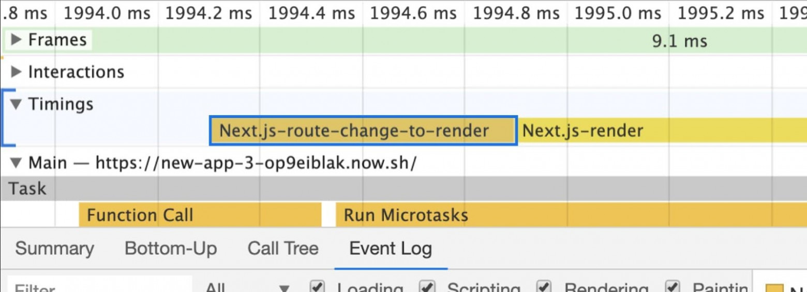

## Инструменты разработчика и Lighthouse

Напоминаю, что Lighthouse и панель `Performance` инструментов разработчика Chrome можно использовать для глубокого анализа процесса загрузки и производительности React-приложений. Здесь можно найти метрики, особенно сильно влияющие на восприятие страниц пользователями.

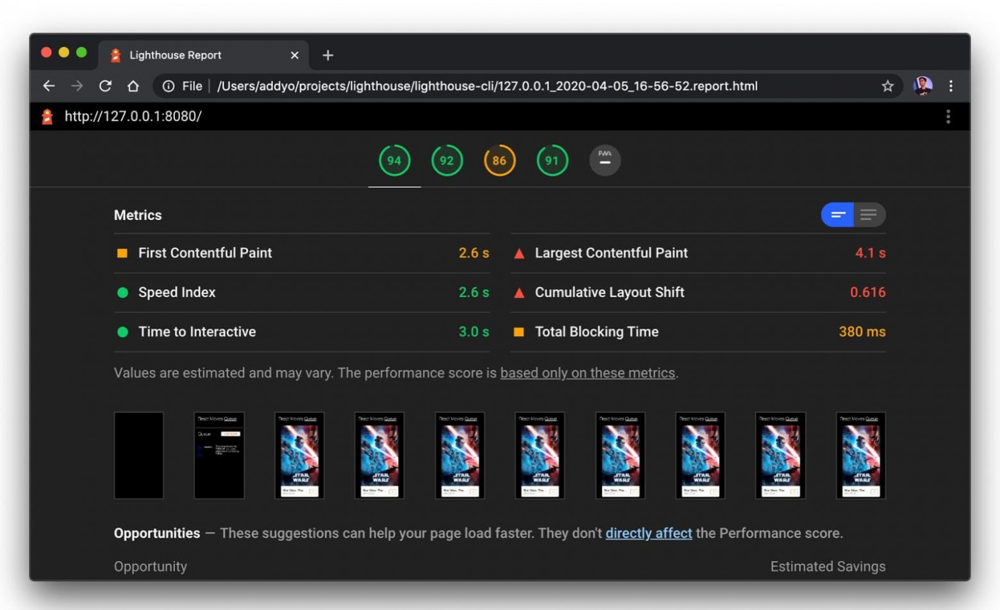

Тем, кто работает с React, может понравиться то, что в их распоряжении окажутся новые метрики — вроде показателя [Total Blocking Time](https://web.dev/tbt/) (TBT), который даёт сведения о том, сколько времени страница пребывает в неинтерактивном режиме до того момента, когда она сможет надёжно работать в интерактивном режиме ([Time to Interactive](https://web.dev/tti/)). Вот — показатели TBT («до» и «после») для приложения, в котором применяется экспериментальный конкурентный режим, использование которого помогает приложению адаптироваться к особенностям среды, в которой оно выполняется.

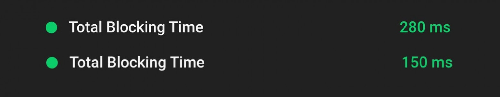

Эти инструменты полезны при анализе узких мест производительности приложения, таких, как [задачи](https://web.dev/long-tasks-devtools/), на выполнение которых уходит много времени, откладывающие переход приложения в интерактивный режим. Например, это может относиться к анализу скорости реакции приложения на нажатия кнопок.

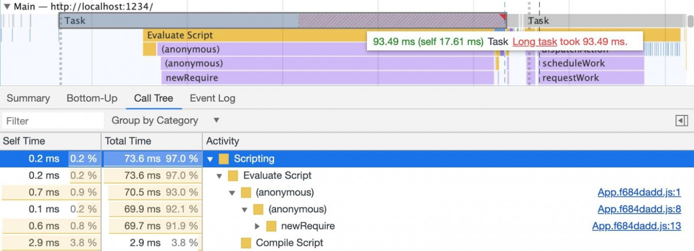

Lighthouse, кроме того, даёт React-разработчикам массу специфических советов по множеству вопросов. Ниже показан результат анализа в [Lighthouse 6.0](https://github.com/GoogleChrome/lighthouse/releases). Здесь открыт раздел [Remove unused JavaScript](https://web.dev/remove-unused-code/), в котором сообщается о неиспользуемом JavaScript-коде, загружаемом в приложение, который может быть импортирован с использованием `React.lazy()`.

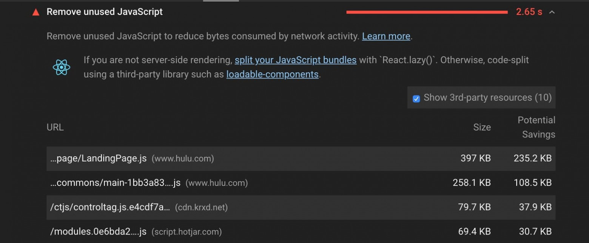

Приложения всегда полезно проверять на аппаратном обеспечении, которое, вероятнее всего, имеется у его конечных пользователей. Я часто полагаюсь в подобных вопросах на [Webpagetest](https://webpagetest.org/easy) и на данные [RUM](https://web.dev/user-centric-performance-metrics/#in-the-field) и [CrUX](https://web.dev/chrome-ux-report/), которые позволяют мне получать более полные сведения о производительности приложений.
