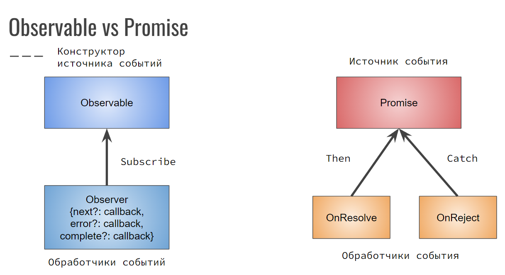
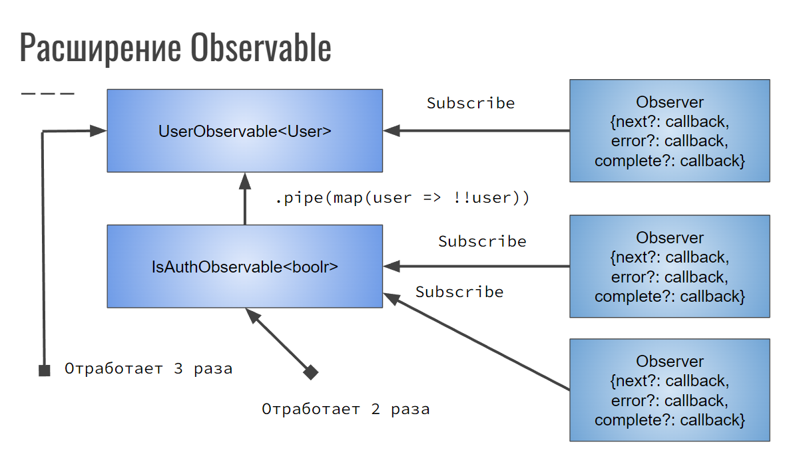
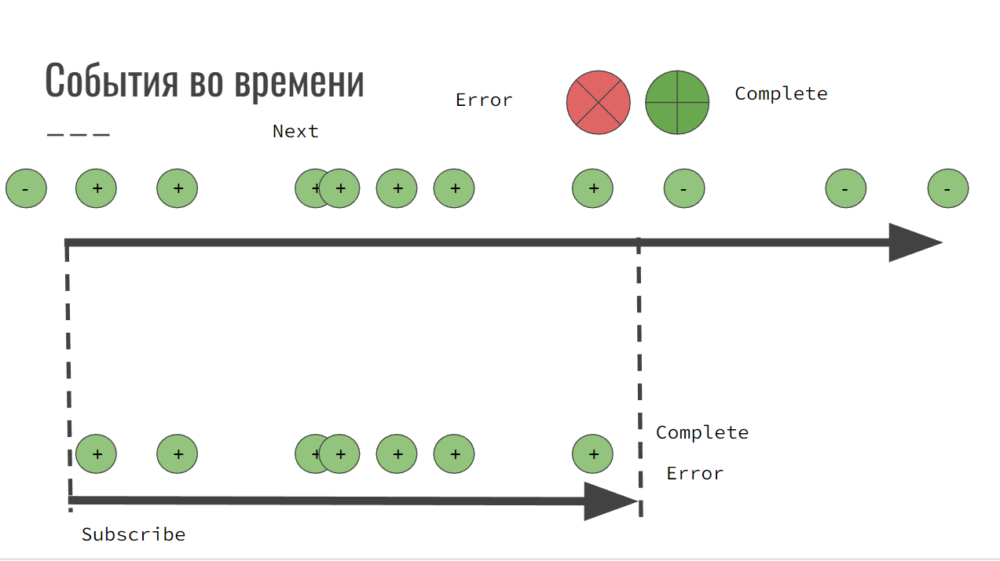
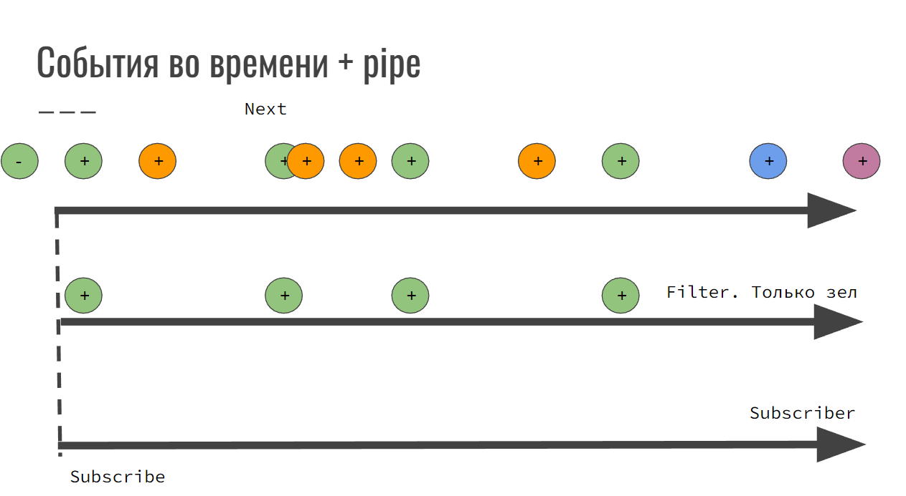
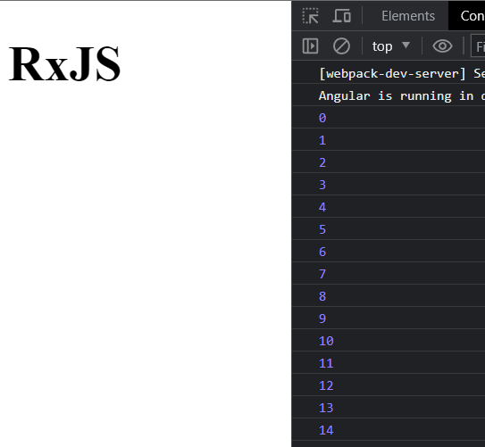
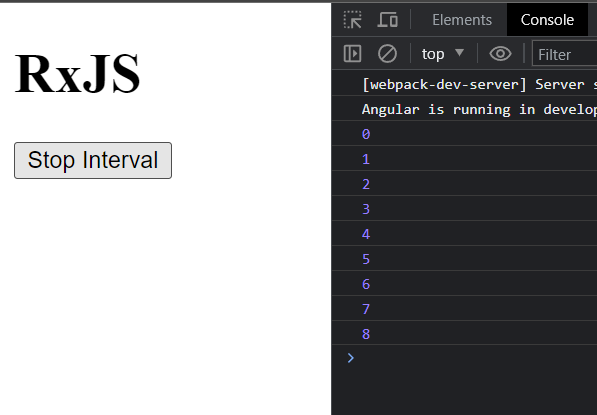
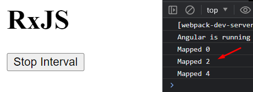
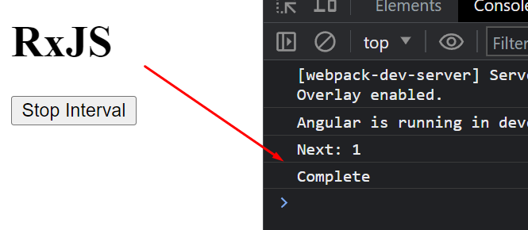
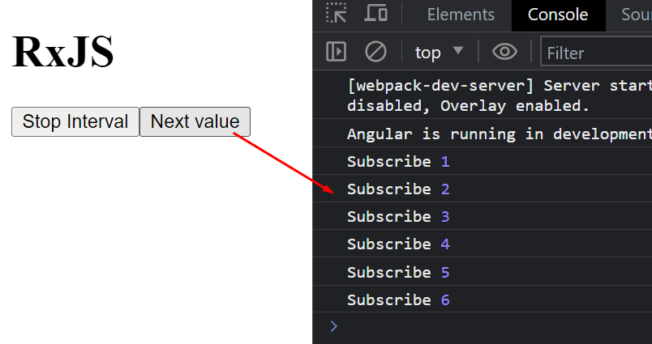

#RxJS #Реактивность

## RxJs Теория: Observable, Observer, Subscription, Pipe

==Observable== - конструктор источника событий
==Observer== - слушатель событий, создает источник событий путем подписки

Такой подход подразумевает под собой создание конструктора событий ==Observable==, на который подписываются слушатели событий. В свою очередь, сами слушатели событий

==Promise== уже сам является источником события. Он вызван и может выдать либо ошибку, либо успешный результат. Так же на него можно подписаться с помощью `then`, если будет успех или `reject`, если вылезет ошибка



У нас в приложении есть три Observable, которые вызываются, когда срабатывает Observer. Так же Observable могут вызывать друг друга через `pipe`, чтобы вызваться друг за другом



Мы вызываем события у обзёрвера ровно до тех пор, пока он не закончит выполнение операции ошибкой или выполнением запроса. Дальше уже события не будут доходить до обзёрвера.

`Observer.next` - метод для получения следующего события
`Observer.error` - метод обработки ошибки источника событий
`Observer.complete` - метод для выполнения действий на закрытии источника событий



Pipe - процесс расширения конструктора источника события
Pipe получает операторы - чистые функции

В качестве пайпа, мы можем задать тот же фильтр, который будет отсеивать невалидные запросы на сервер



## 1. Как работает RxJS

Основной идеей работы RxJS является подписка на определённые события и реагирование на них.

Конкретно в примере мы создаём подписку, которая триггерит подписанные на неё функции раз в секунду.

Через `subscribe` мы подписываемся на эмиттер события и выполняем код раз в определённое время.

```TS
import { Component } from '@angular/core';
import { interval } from 'rxjs';

@Component({
	selector: 'app-root',
	templateUrl: './app.component.html',
	styleUrls: ['./app.component.scss'],
})
export class AppComponent {
	constructor() {
		const intervalStream$ = interval(1000);

		intervalStream$.subscribe((value) => {
			console.log(value);
		});
	}
}
```



## 2. Оптимизация стримов

Если мы никак не будем контролировать и отключать стримы, то у нас они будут постоянно активны и постоянно копиться. Прошлый пример будет работать постоянно, пока страница активна.

Чтобы исправить данную проблему, мы можем сохранить объект стрима в поле с типом `Subscription`, чтобы иметь возможность отписаться от стрима через `unsubscribe()`

```TS
import { Component } from '@angular/core';
import { interval, Subscription } from 'rxjs';

@Component({
	selector: 'app-root',
	templateUrl: './app.component.html',
	styleUrls: ['./app.component.scss'],
})
export class AppComponent {
	sub: Subscription;

	constructor() {
		const intervalStream$ = interval(1000);

		this.sub = intervalStream$.subscribe((value) => {
			console.log(value);
		});
	}

	stop() {
		this.sub.unsubscribe();
	}
}
```

Кнопка будет вызывать срабатывание метода остановки интервала

```HTML
<div class='container'>
	<h1>RxJS</h1>
	<button class='btn' (click)='stop()'>Stop Interval</button>
</div>
```

И теперь кнопка останавливает интервал



## 3. Как использовать операторы

В RxJS присутствует огромное множество операторов, которые могут разными способами обрабатывать данные и сам стрим

Чейн `pipe()` принимает в себя операторы, которые и будут работать над нашими данными

Конкретно в данном примере в пайп попадает два оператора, из которых:

- `filter` - фильтрует проходящие дальше данные
- `map` - видоизменяет данные

```TS
import { Component } from '@angular/core';
import { interval, Subscription } from 'rxjs';
import { map, filter } from 'rxjs/operators';

@Component({
	selector: 'app-root',
	templateUrl: './app.component.html',
	styleUrls: ['./app.component.scss'],
})
export class AppComponent {
	sub: Subscription;

	constructor() {
		const intervalStream$ = interval(1000);

		this.sub = intervalStream$
			.pipe(
				filter((value) => value % 2 === 0),
				map((value) => `Mapped ${value}`),
			)
			.subscribe((value) => {
				console.log(value);
			});
	}

	stop() {
		this.sub.unsubscribe();
	}
}
```

И теперь у нас выходят в консоль только чётные замапленные данные



## 4. Создание своего стрима

Мы можем создать свой стрим с помощью класса `Observable`. Внутрь него мы передаём определённую функцию, внутри которой мы можем определять поведение потока

Конкретно мы имеем три метода:

- `next` - триггерит срабатывание первого коллбека внутри `subscribe`
- `complete` - показывает, что запрос выполнен (и триггерит третий коллбэка)
- `error` - вызывает ошибку внутри обзёрвера (и триггерит второй коллбэка)

Так же метод `subscribe()` у стрима принимает три функции, которые выполняются по вызову одного из трёх состояний внутри обзервера

```TS
import { Component } from '@angular/core';
import { Subscription, Observable } from 'rxjs';

@Component({
	selector: 'app-root',
	templateUrl: './app.component.html',
	styleUrls: ['./app.component.scss'],
})
export class AppComponent {
	sub: Subscription;

	constructor() {
		const stream$ = new Observable((observer) => {
			setTimeout(() => {
				observer.next(1);
			}, 1500);

			setTimeout(() => {
				observer.complete();
			}, 1900);

			setTimeout(() => {
				observer.error('Something went wrong');
			}, 2000);

			setTimeout(() => {
				observer.next(2);
			}, 2500);
		});

		this.sub = stream$.subscribe(
			(value) => console.log(`Next: ${value}`), // next
			(error) => console.log(`Error: ${error}`), // error
			() => console.log('Complete'), // complete
		);
	}

	stop() {
		this.sub.unsubscribe();
	}
}
```



## 5. Как работает Subject

Класс `Subject` позволяет создать стрим, которому можно протипизировать принимаемое значение и описать выполняемую операцию над данным аргументом

С помощью метода `next` мы триггерим срабатывание коллбэка

```TS
import { Component } from '@angular/core';
import { Subscription, Subject } from 'rxjs';

@Component({
	selector: 'app-root',
	templateUrl: './app.component.html',
	styleUrls: ['./app.component.scss'],
})
export class AppComponent {
	sub: Subscription;
	stream$: Subject<number> = new Subject<number>();
	counter: number = 0;

	constructor() {
		this.sub = this.stream$.subscribe((value) => {
			console.log('Subscribe', value);
		});
	}

	stop() {
		this.sub.unsubscribe();
	}

	next() {
		this.counter += 1;
		this.stream$.next(this.counter);
	}
}
```

Вызываем метод

```HTML
<div class='container'>
	<h1>RxJS</h1>
	<button class='btn' (click)='stop()'>Stop Interval</button>
	<button class='btn btn-danger' (click)='next()'>Next value</button>
</div>
```

И теперь мы можем триггерить функцию, которая будет вызваться по сабскрайбу


