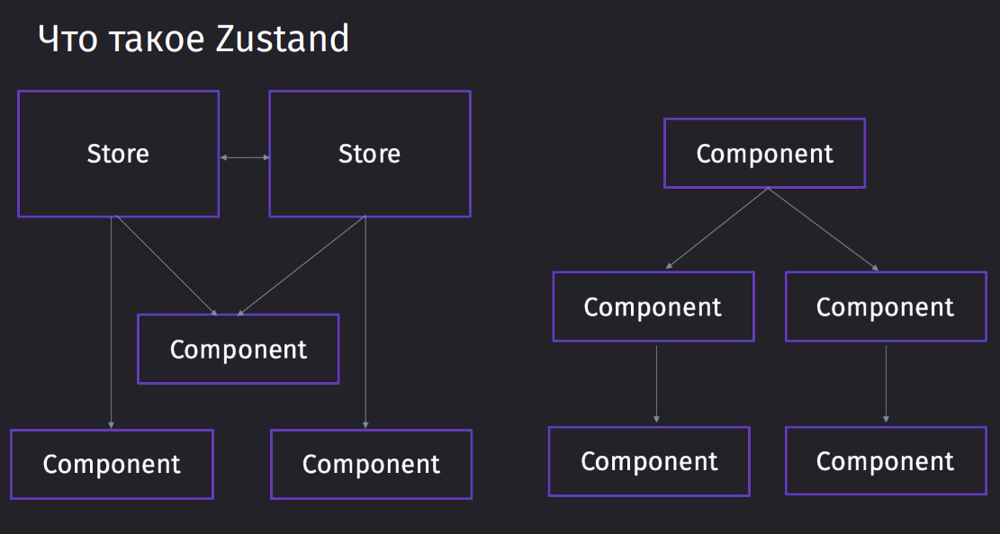

---
tags:
    - zustand
    - react
---

## Введение

Zustand - это стейт-менеджер, в котором под каждую новую сущность создаётся отдельный стор, что сплиттит код и облегчает начальный бандл



---

## Старт проекта

```bash
npm create vite@latest .
npm i antd zustand react-router-dom
```

---

## Основы работы

### Slice

Создание слайса выглядит следующим образом:

`model / counterSlice.ts`

```ts
import { create, StateCreator } from 'zustand';

// тип
type counterState = {
	counter: number;
};

// функция-инициализатор / слайс
const counterSlice: StateCreator<counterState> = () => ({
	counter: 0,
});

// хук для использования стора
export const useCounterStore = create<counterState>(counterSlice);
```

### Получение данных из state

Чтобы использовать данные из стейта, мы импортируем наш хук и вставляем из него данные в компонент

`App.tsx`

```TSX
import "./App.css";
import { useCounterStore } from "./model/counterStore";

function App() {
  const { counter } = useCounterStore();

  return (
    <div className="wrapper">
      <span>{counter}</span>
    </div>
  );
}

export default App;
```

### Использование actions

Экшены - это функции для изменения состояний в Store.

Всю логику работы с данными (получение из API, отправка запросов) рекомендуется выносить в Store.

Описываются экшены достаточно просто - это функции, которые кладутся в одно место со значениями стора.

Чтобы модифицировать состояние в Store, Zustand провайдит методы `get` и `set`, которые позволяют получить актуальные значения из стора и заменить нужные значения

`model / counterSlice.ts`

```TS
import { create, StateCreator } from "zustand";

// отдельно поля стора
type counterState = {
  counter: number;
};

// отдельно экшены, которые провайдит стор
type counterActions = {
  increment: () => void;
  decrement: () => void;
};

// слайс, в котором мы задали начальное значение
const counterSlice: StateCreator<counterState & counterActions> = (
  // параметры получения и установки нового значения
  set,
  get
) => ({
  // начальное значение
  counter: 0,
  // изменение значения
  decrement: () => {
    // получаем значение из стора
    const { counter } = get();
    // устанавливаем новое значение
    set({ counter: counter - 1 });
  },
  increment: () => {
    const { counter } = get();
    set({ counter: counter + 1 });
  },
});

export const useCounterStore = create<counterState & counterActions>(
  counterSlice
);
```

И теперь тут мы просто получаем наши экшены вместе со значением в сторе. Применяются они без посредников - в виде функций-прослоек.

`App.tsx`

```TSX
import "./App.css";
import { useCounterStore } from "./model/counterStore";

function App() {
  const { counter, decrement, increment } = useCounterStore();

  return (
    <div className="wrapper">
      <button onClick={increment}>+</button>
      <span>{counter}</span>
      <button onClick={decrement}>-</button>
    </div>
  );
}

export default App;
```

### Использование вне компонента

Иногда перед нами может появиться такая ситуация, когда нам нужно использовать стор-значения вне компонента и менять его данные так же извне. Для этого мы можем сделать отдельный хелпер, который внутри себя будет выполнять операции над стором

Извне мы можем получить доступ к изменению состояния с помощью получения стейта выделенного стора `useCounterStore.getState()`

`model / counterSlice.ts

```TSX
import { create, StateCreator } from "zustand";

type counterState = {
  counter: number;
};

type counterActions = {
  increment: () => void;
  decrement: () => void;
  // +
  incrementByAmount: (value: number) => void;
};

const initialState: counterState = {
  counter: 0,
};

const counterSlice: StateCreator<counterState & counterActions> = (
  set,
  get
) => ({
  counter: initialState.counter,
  decrement: () => {
    const { counter } = get();
    set({ counter: counter - 1 });
  },
  increment: () => {
    const { counter } = get();
    set({ counter: counter + 1 });
  },
  // +
  incrementByAmount: (value: number) => {
    const { counter } = get();
    set({ counter: counter + value });
  },
});

export const useCounterStore = create<counterState & counterActions>(
  (...args) => ({
    ...counterSlice(...args),
  })
);

// + отдельно выносим экшен изменения значения в функцию
export const incrementByAmount = (value: number) => {
  useCounterStore.getState().incrementByAmount(value);
};

// + и отдельно выносим функцию для получения определённого значчения
export const getCounter = () => useCounterStore.getState().counter;
```

Далее в отдельной функции получаем наше значение и выполняем любые логические операции, которые нам понадобятся

`helpers / addTen.ts`

```TS
import { getCounter, incrementByAmount } from "../model/counterStore";

export const addTen = () => {
  const counter = getCounter();

  console.log(counter);

  if (counter >= 0) {
    incrementByAmount(10);
  } else {
    incrementByAmount(-10);
  }
};
```

И теперь можем в любой части приложения выполнить этот код, который мы вынесли в отдельный участок приложения

`App.tsx`

```TSX
import "./App.css";
import { addTen } from "./helpers/addTen";
import { useCounterStore } from "./model/counterStore";

function App() {
  const { counter, decrement, increment } = useCounterStore();

  return (
    <div className="wrapper">
      <button onClick={increment}>+</button>
      <span>{counter}</span>
      <button onClick={decrement}>-</button>
      <button onClick={addTen}>add 10</button>
    </div>
  );
}

export default App;
```

### Отладка

В реальных проектах часто приходится работать с большим количеством сторов и экшенов. Для отладки кода размерным методом является использование консоли или дебаггера.

Отладка в Zustand происходит за счёт использования ReduxDevtools, который работают очень костыльно и требуют дополнительного бойлерплейта, чтобы подтянуться к ним

Сейчас у нас представлен код маленького todo-листа

- В изменение состояния `set` мы должны будем добавить небольшой бойлерплейт с кастомными логами на изменение состояния, которые полетят в devtools.
- в функции создания слайса, нам нужно будет его инстанциировать с кастомным `set` и `get`, полученным из `devtools`

`model / todoStore.ts`
```TS
import { create, StateCreator } from "zustand";
import { devtools } from "zustand/middleware";

type ToDoType = {
  title: string;
  isCompleted: boolean;
};

type ToDoState = {
  todos: ToDoType[];
};

type ToDoActions = {
  addTodo: (title: string) => void;
  changeIsCompleted: (index: number) => void;
};

const toDoSlice: StateCreator<
  ToDoState & ToDoActions,
  // тут уже мы должны описать middlewares (MW), которые мы используем
  // первый параметр - типы devtools, второй - принимаемые параметры MW
  [["zustand/devtools", never]]
> = (set, get) => ({
  todos: [],
  addTodo: (title: string) => {
    const { todos } = get();

    set(
	  // выполняем изменение состояния
      { todos: [...todos, { title, isCompleted: false }] },
      // replace flag
      false,
      // по такому имени произойдёт лог действия в devtools
      `add ${title}`
    );
  },
  changeIsCompleted: (index: number) => {
    const { todos } = get();
    const newTodos = [
      ...todos.slice(0, index),
      { ...todos[index], isCompleted: !todos[index].isCompleted },
      ...todos.slice(index + 1),
    ];
    set(
      {
        todos: newTodos,
      },
      false,
      `changeStatus of ${todos[index].title} to ${!todos[index].isCompleted}`
    );
  },
});

// вызов происходит через карирование, поэтому нам нужно сначала вызвать Store, а потом в следующем вызове передать нужные значения
export const useToDoStore = create<ToDoState & ToDoActions>()(
  devtools((...args) => ({
    ...toDoSlice(...args),
  }))
);

export const markAsCompleted = (index: number) => {
  const todos = useToDoStore.getState().todos;
  useToDoStore.setState(
    {
      todos: [
        ...todos.slice(0, index),
        { ...todos[index], isCompleted: !todos[index].isCompleted },
        ...todos.slice(index + 1),
      ],
    },
    false,
    `chengeStatus of ${todos[index].title} to ${!todos[index].isCompleted}`
  );
};
```

> [!note] Replace Flag
> В Zustand позволяет **полностью заменить старое состояние новым объектом**, отбросив любые поля, которые были в предыдущем состоянии, но не являются частью нового.
>
> По умолчанию при обновлении состояния в Zustand (как и в React на компонентах) происходит слияние нового состояния с существующим. Изменяются только обновлённые поля, остальное состояние остаётся неизменным.

Небольшой интерфейс для тудушек

`App.tsx`

```TSX
import "./App.css";
import { Card, Checkbox, Input } from "antd";
import { markAsCompleted, useToDoStore } from "./model/todoStore";
import { useState } from "react";

function App() {
  const { todos, addTodo } = useToDoStore();
  const [value, setValue] = useState<string>("");

  return (
    <div className="wrapper">
      <Input
        style={{ width: 300 }}
        onChange={(e) => setValue(e.target.value)}
        value={value}
        onKeyDown={(e) => {
          if (e.key === "Enter") {
            addTodo(value);
            setValue("");
          }
        }}
      />
      {todos.map((todo, index) => (
        <Card className="card" key={todo.title}>
          <Checkbox
            checked={todo.isCompleted}
            onChange={() => markAsCompleted(index)}
          />
          <span>{todo.title}</span>
        </Card>
      ))}
    </div>
  );
}

export default App;
```

И примерно так будет выглядеть интерфейс мини-приложения с Zustand


---

## Асинхронные операции

### Асинхронные операции + Запрос на сервер

1. **Проблема Размещения Асинхронных Операций в Компонентах:**
    - Размещение запросов к API и других асинхронных операций в компонентах размазывает логику обработки данных по всему приложению.
    - Это увеличивает сложность компонентов и делает код труднее для понимания.
2. **Преимущества Использования Store:**
    - Централизация асинхронных операций в Store упрощает управление состоянием и взаимодействие с API.
    - Обеспечивает возможность переиспользования логики запросов без дублирования кода.
    - Содействует поддержанию компонентов максимально простыми и фокусированными на представлении.
3. **Преимущества Zustand как State Manager:**
    - Несмотря на простоту и легкость, Zustand предоставляет мощные возможности для управления состоянием.
    - Помогает в оптимизации и предотвращении ненужных ререндеров.

#### Подготовка:

1. **Очистка проекта**: Удаление неактуальных элементов.
2. **Создание структуры**:
    - `coffeeStore.ts` в папке models для описания стора.
    - `coffeeTypes.ts` в папке types для типизации работы с API.
    - **URL для API**: [`https://purpleschool.ru/coffee-api`](https://purpleschool.ru/coffee-api).

#### Создание Компонентов:

1. **Разметка**:
    - Переменная для хранения списка напитков.
    - Элементы UI: контейнер и карточки напитков (с информацией о напитке, рейтингом, изображением, и кнопкой покупки).
2. **Стилизация**:
    - Определены стили для контейнера и карточек.

#### Настройка Store (Zustand):

1. **Данные и Экшены**:
    - State для списка напитков.
    - Экшен `getCoffeeList` для получения списка напитков.
2. **Создание слайса**:
    - Использование `StateCreator` для создания слайса.
    - Конфигурация middleware (DevTools).
3. **Асинхронный запрос**:
    - Асинхронная функция в экшене для загрузки данных из API.
    - Обработка ошибок и обновление состояния с полученными данными.

#### Работа с Компонентами:

1. **Получение и отображение данных**:
    - Удаление заглушек, использование хука для доступа к состоянию.
    - Запрос данных при первой загрузке с помощью `useEffect`.

Опишем типы, с которыми мы можем отправить запрос на наш сервер

`types / coffeTypes.ts`

```TS
export enum CoffeeTypeEnum {
  cappuccino = "cappuccino",
  latte = "latte",
  macchiato = "macchiato",
  americano = "americano",
}

export type CoffeeQueryParams = {
  text?: string;
  type?: CoffeeTypeEnum;
};

export type CoffeeType = {
  id: number;
  name: string;
  subTitle: string;
  type: CoffeeTypeEnum;
  price: number;
  image: string;
  description: string;
  rating: number;
};
```

Далее мы можем прямо в слайсе описать асинхронную функцию, в рамках которой мы будем совершать запрос. Для совершения запроса нам достаточно будет воспользоваться `axios`

Дополнительно, для уменьшения количества ререндеров, мы можем воспользоваться `AbortController`, из которого signal передадим в axios и сможем отменить текущий запрос в том случае, если мы его отправим заново

> Запросили (1) -> Запрашиваем заново (2) -> Отменяем первый запрос (1) -> Отправляем новый запрос (2)

`model / coffeeStore.ts`

```TS
import { create, StateCreator } from "zustand";
import { CoffeeQueryParams, CoffeeType } from "../types/coffeTypes";
import axios, { AxiosError } from "axios";
import { devtools } from "zustand/middleware";

const BASE_URL = "https://purpleschool.ru/coffee-api/";

type CoffeeState = {
  coffeeList?: CoffeeType[];
  controller?: AbortController;
};

type CoffeeActions = {
  getCoffeeList: (params?: CoffeeQueryParams) => void;
};

const coffeeSlice: StateCreator<
  CoffeeActions & CoffeeState,
  [["zustand/devtools", never]]
> = (set, get) => ({
  coffeeList: undefined,
  controller: undefined,

  getCoffeeList: async (params?: CoffeeQueryParams) => {
	// получаем контроллер, под который мы подвязываем запрос
    const { controller } = get();

	// если контроллер есть, то мы отменяем запрос
    if (controller) {
      controller.abort();
    }

	// создаём контроллер, которым мы сможем отменить совершение запроса в axios и сохраняем его в стейте, чтобы иметь к нему доступ
    const newController = new AbortController();
    set({ controller: newController });
    const { signal } = newController;

    try {
	  // совершаем запрос и передаём внутрь него signal из контроллера
      const { data } = await axios.get<CoffeeType[]>(BASE_URL, {
        params,
        signal,
      });
      // сохраняем данные в стейт
      set({ coffeeList: data }, false, "setCoffeeListWithSearch");
    } catch (error) {
	  // проверяем axios на завершение запроса
      if (axios.isCancel(error)) return;

	  // либо выкидываем лог с ошибкой
      if (error instanceof AxiosError) {
        console.log(error);
      }
    }
  },
});

export const useCoffeeStore = create<CoffeeActions & CoffeeState>()(
  devtools(coffeeSlice)
);
```

И в самом компоненте нам останется сделать не так уж и много - добавить функцию для запроса и вызывать её во время поиска по сайту и во время инициализации компонента. Весь список данных мы храним в самом слайсе, который ререндерит компонент только во время обновления данных.

`App.tsx`

```TSX
import "./App.css";
import { Button, Card, Input, Rate, Tag } from "antd";
import { useCoffeeStore } from "./model/coffeeStore";
import { useEffect, useState } from "react";
import { ShoppingCartOutlined } from "@ant-design/icons";

function App() {
  const { getCoffeeList, coffeeList } = useCoffeeStore();
  const [text, setText] = useState<string>("");

  const handleSearch = (text: string) => {
    setText(text);
    getCoffeeList({ text });
  };

  useEffect(() => {
    getCoffeeList();
    // eslint-disable-next-line react-hooks/exhaustive-deps
  }, []);

  return (
    <div className="wrapper">
      <Input
        placeholder="Search"
        value={text}
        onChange={(e) => handleSearch(e.target.value)}
      />
      {coffeeList && (
        <div className="cardsContainer">
          {coffeeList.map((coffee) => (
            <Card
              hoverable
              key={coffee.id}
              cover={}
              actions={[
                <Button icon={<ShoppingCartOutlined />} key={coffee.name}>
                  {coffee.price}
                </Button>,
              ]}
            >
              <Card.Meta title={coffee.name} description={coffee.subTitle} />
              <Tag style={{ marginTop: "24px" }} color="purple">
                {coffee.type}
              </Tag>
              <Rate
                defaultValue={coffee.rating}
                disabled
                allowHalf
                style={{ marginTop: "24px" }}
              />
            </Card>
          ))}
        </div>
      )}
    </div>
  );
}

export default App;
```

### Persist

Некоторые данные можно сохранять персонально в `localStorage`, чтобы не терять их во время перезагрузки страницы.

Для решения этой проблемы в Zustand есть middleware `persist`, который позволяет сохранить значения в различные сторы браузера. В себя он принимает первым параметром наш слайс, а вторым объект с именем `name` и функцией `partialize`, в которой мы определим какую часть стора мы хотим персистить

`model / counterStore.ts`

```TS
import { create, StateCreator } from "zustand";
import { persist } from "zustand/middleware";

type counterState = {
  counter: number;
  persistedCounter: number;
};

type counterActions = {
  increment: () => void;
  decrement: () => void;
  incrementByAmount: (value: number) => void;
};

const initialState: counterState = {
  counter: 0,
  persistedCounter: 0,
};

const counterSlice: StateCreator<
  counterState & counterActions,
  [["zustand/persist", unknown]]
> = (set, get) => ({
  counter: initialState.counter,
  persistedCounter: initialState.persistedCounter,

  decrement: () => {
    const { counter, persistedCounter } = get();
    set({ counter: counter - 1, persistedCounter: persistedCounter - 1 });
  },

  increment: () => {
    const { counter, persistedCounter } = get();
    set({ counter: counter + 1, persistedCounter: persistedCounter + 1 });
  },

  incrementByAmount: (value: number) => {
    const { counter } = get();
    set({ counter: counter + value });
  },
});

export const useCounterStore = create<counterState & counterActions>()(
  persist((...args) => ({ ...counterSlice(...args) }), {
    // имя стора
    name: "counterStore",
    // определяем, какую часть стора нам нужно персистить
    partialize: (state) => ({ persistedCounter: state.persistedCounter }),
  })
);

export const incrementByAmount = (value: number) => {
  useCounterStore.getState().incrementByAmount(value);
};

export const getCounter = () => useCounterStore.getState().counter;
```

Создаём простой counter

`App.tsx`

```TSX
import "./App.css";
import { Button, Card, Input, Rate, Tag } from "antd";
import { useCoffeeStore } from "./model/coffeeStore";
import { useEffect, useState } from "react";
import { ShoppingCartOutlined } from "@ant-design/icons";
import { useCounterStore } from "./model/counterStore";
import { addTen } from "./helpers/addTen";

function App() {
  const { counter, decrement, increment, persistedCounter } = useCounterStore();

  return (
    <div className="wrapper">
      <button onClick={decrement}>-</button>
      <span>{counter}</span>
      <span>{persistedCounter}</span>
      <button onClick={increment}>+</button>
    </div>
  );
}

export default App;
```

И при перезагрузке страницы мы не потеряем наш счётчик


### Reset состояния

Для сброса состояния стейта, потребуется кастомизировать дефолтный `create` таким образом, чтобы он каждый раз создавал функцию для сброса и записывал её в глобальную мапу со всеми функциями сброса состояния

`src/helpers/create.ts`

```TS
import { create as _create } from "zustand";
import type { StateCreator } from "zustand";

// создаём новый set для функций сброса состояний по всем сторам
const resetStoreFnSet = new Set<() => void>();

// создаём функцию, которая будет вызывать сброс состояния по всем сторам
export const resetAllStores = () => {
  resetStoreFnSet.forEach((resetFn) => {
    resetFn();
  });
};

// кастомный create
export const create = (<T>() => {
  return (stateCreator: StateCreator<T>) => {
	// получаем сгенерированный стор
    const store = _create(stateCreator);
    // получаем начльное состояние стора на момент создания
    const initialState = store.getInitialState();
    // создаём функцию, которая будет возвращать начальное состояние стора и replace flag ставим в true, чтобы полностью заменить объект в сторе
    const resetState = () => {
      store.setState(initialState, true);
    };
    // далее эту функцию для сброса состояния записываем в мапу со всеми функциями сброса
    resetStoreFnSet.add(resetState);
    return store;
  };
}) as typeof _create;
```

И теперь тут используем наш кастомный `create`, в который добавим так же состояние action `reset`, в которое передадим `initialState` с начальным состоянием

`src/model/counterStore.ts`

```TS
import { StateCreator } from "zustand";
import { persist } from "zustand/middleware";
import { create } from "../helpers/create";

type counterState = {
  counter: number;
  persistedCounter: number;
};

type counterActions = {
  increment: () => void;
  decrement: () => void;
  incrementByAmount: (value: number) => void;
  reset: () => void;
};

const initialState: counterState = {
  counter: 0,
  persistedCounter: 0,
};

const counterSlice: StateCreator<
  counterState & counterActions,
  [["zustand/persist", unknown]]
> = (set, get) => ({
  counter: initialState.counter,
  persistedCounter: initialState.persistedCounter,
  decrement: () => {
    const { counter, persistedCounter } = get();
    set({ counter: counter - 1, persistedCounter: persistedCounter - 1 });
  },
  increment: () => {
    const { counter, persistedCounter } = get();
    set({ counter: counter + 1, persistedCounter: persistedCounter + 1 });
  },
  incrementByAmount: (value: number) => {
    const { counter } = get();
    set({ counter: counter + value });
  },
  reset: () => {
    set(initialState);
  },
});

export const useCounterStore = create<counterState & counterActions>()(
  persist((...args) => ({ ...counterSlice(...args) }), {
    name: "counterStore",
    partialize: (state) => ({ persistedCounter: state.persistedCounter }),
  })
);

export const incrementByAmount = (value: number) => {
  useCounterStore.getState().incrementByAmount(value);
};

export const getCounter = () => useCounterStore.getState().counter;
```

И добавляем кнопку сброса состояния

`App.tsx`

```TSX
import "./App.css";
import { Button, Card, Input, Rate, Tag } from "antd";
import { useCoffeeStore } from "./model/coffeeStore";
import { useEffect, useState } from "react";
import { ShoppingCartOutlined } from "@ant-design/icons";
import { useCounterStore } from "./model/counterStore";
import { addTen } from "./helpers/addTen";
import { resetAllStores } from "./helpers/create";
import { useToDoStore } from "./model/todoStore";

function App() {
  const { getCoffeeList, coffeeList } = useCoffeeStore();
  const [text, setText] = useState<string>("");

  const handleSearch = (text: string) => {
    setText(text);
    getCoffeeList({ text });
  };

  useEffect(() => {
    getCoffeeList();
    // eslint-disable-next-line react-hooks/exhaustive-deps
  }, []);

  const { counter, decrement, increment, persistedCounter } = useCounterStore();
  const { addTodo, todos } = useToDoStore();

  return (
    <div className="wrapper">
      <button onClick={decrement}>-</button>
      <span>{counter}</span>
      <span>{persistedCounter}</span>
      <button onClick={increment}>+</button>
      <button onClick={resetAllStores}>reset</button>
      <hr />
      <button onClick={() => addTodo("some")}>addTodo</button>
      {todos && todos.map((todo) => <div key={todo.title}>{todo.title}</div>)}
    </div>
  );
}

export default App;
```

### Сохранение состояния

Добавляем типизацию к нашим товарам. Размер кофе, отдельный айтем и заказ.

`src/types/coffeTypes.ts`

```TS
export enum CoffeeTypeEnum {
  cappuccino = "cappuccino",
  latte = "latte",
  macchiato = "macchiato",
  americano = "americano",
}

export type CoffeeQueryParams = {
  text?: string;
  type?: CoffeeTypeEnum;
};

export enum CoffeSizeEnum {
  S = "S",
  M = "M",
  L = "L",
}

export type CoffeItem = {
  id: number;
  name: string;
  size: CoffeSizeEnum;
  quantity: number;
};
export type OrderCoffeeReq = {
  address: string;
  orderItems: CoffeItem[];
};

export type OrderCoffeeRes = {
  message: string;
  success: boolean;
};

export type CoffeeType = {
  id: number;
  name: string;
  subTitle: string;
  type: CoffeeTypeEnum;
  price: number;
  image: string;
  description: string;
  rating: number;
};
```

Модифицируем стор и добавляем в него заказ кофе `orderCoffee`, добавление в корзину `addToCart`, задание адреса `setAddress`, очистку корзины `clearCart` и добавляем `persist` в наш стор

`src/model/coffeeStore.ts`

```TS
import { create, StateCreator } from "zustand";
import {
  CoffeeQueryParams,
  CoffeeType,
  CoffeItem,
  CoffeSizeEnum,
  OrderCoffeeReq,
  OrderCoffeeRes,
} from "../types/coffeTypes";
import axios, { AxiosError } from "axios";
import { devtools, persist } from "zustand/middleware";

const BASE_URL = "https://purpleschool.ru/coffee-api/";

type CoffeeState = {
  coffeeList?: CoffeeType[];
  controller?: AbortController;
  cart?: CoffeItem[];
  address?: string;
};

type CoffeeActions = {
  setAddress: (address: string) => void;
  getCoffeeList: (params?: CoffeeQueryParams) => void;
  addToCart: (item: CoffeeType) => void;
  orderCoffee: () => void;
  clearCart: () => void;
};

const coffeeSlice: StateCreator<
  CoffeeActions & CoffeeState,
  [["zustand/devtools", never], ["zustand/persist", unknown]]
> = (set, get) => ({
  coffeeList: undefined,
  controller: undefined,
  cart: undefined,
  address: undefined,

  clearCart: () => set({ cart: undefined }),

  setAddress: (address) => set({ address }),

  addToCart: (item) => {
    const { cart } = get();
    const preparedItem: CoffeItem = {
      id: item.id,
      name: `${item.name} ${item.subTitle}`,
      quantity: 1,
      size: CoffeSizeEnum.M,
    };
    set({ cart: cart ? [...cart, preparedItem] : [preparedItem] });
  },

  orderCoffee: async () => {
    const { cart, address } = get();
    const order: OrderCoffeeReq = {
      address: address!,
      orderItems: cart!,
    };
    try {
      const { data } = await axios.post<OrderCoffeeRes>(
        BASE_URL + "order",
        order
      );
      if (data.success) {
        alert(data.message);
        get().clearCart();
      }
    } catch (error) {
      if (error instanceof AxiosError) {
        console.log(error);
      }
    }
  },

  getCoffeeList: async (params?: CoffeeQueryParams) => {
    const { controller } = get();

    if (controller) {
      controller.abort();
    }

    const newController = new AbortController();
    set({ controller: newController });
    const { signal } = newController;

    try {
      const { data } = await axios.get<CoffeeType[]>(BASE_URL, {
        params,
        signal,
      });
      set({ coffeeList: data }, false, "setCoffeeListWithSearch");
    } catch (error) {
      if (axios.isCancel(error)) return;

      if (error instanceof AxiosError) {
        console.log(error);
      }
    }
  },
});

export const useCoffeeStore = create<CoffeeActions & CoffeeState>()(
  devtools(
    persist(coffeeSlice, {
      name: "coffeeStore",
      partialize: (state) => ({ cart: state.cart, address: state.address }),
    }),
    {
      name: "coffeeStore",
    }
  )
);
```

И довёрстываем раздел с нашей корзиной

`src/App.tsx`

```TSX
import "./App.css";
import { Button, Card, Input, Rate, Tag } from "antd";
import { useCoffeeStore } from "./model/coffeeStore";
import { useEffect, useState } from "react";
import { ShoppingCartOutlined } from "@ant-design/icons";

function App() {
  const {
    getCoffeeList,
    coffeeList,
    cart,
    addToCart,
    orderCoffee,
    setAddress,
    address,
    clearCart,
  } = useCoffeeStore();
  const [text, setText] = useState<string>("");
  const handleSearch = (text: string) => {
    setText(text);
    getCoffeeList({ text });
  };
  useEffect(() => {
    getCoffeeList();
    // eslint-disable-next-line react-hooks/exhaustive-deps
  }, []);

  return (
    <div className="wrapper">
      <Input
        placeholder="Search"
        value={text}
        onChange={(e) => handleSearch(e.target.value)}
      />
      <div className="container">
        {coffeeList ? (
          <div className="cardsContainer">
            {coffeeList.map((coffee) => (
              <Card
                hoverable
                key={coffee.id}
                cover={}
                actions={[
                  <Button
                    icon={<ShoppingCartOutlined />}
                    key={coffee.name}
                    onClick={() => addToCart(coffee)}
                  >
                    {coffee.price}
                  </Button>,
                ]}
              >
                <Card.Meta title={coffee.name} description={coffee.subTitle} />
                <Tag style={{ marginTop: "24px" }} color="purple">
                  {coffee.type}
                </Tag>
                <Rate
                  defaultValue={coffee.rating}
                  disabled
                  allowHalf
                  style={{ marginTop: "24px" }}
                />
              </Card>
            ))}
          </div>
        ) : (
          <span>По запросу не нашлось ни одного напитка</span>
        )}

        <aside className="sider">
          <h1>Cart</h1>
          {cart ? (
            <>
              {cart.map((item) => (
                <span key={item.id}>{item.name}</span>
              ))}
              <Input
                placeholder="Adress"
                value={address}
                onChange={(e) => setAddress(e.target.value)}
              />
              <Button onClick={orderCoffee} disabled={!address} type="primary">
                Order coffee
              </Button>
              <Button onClick={clearCart}>Clear cart</Button>
            </>
          ) : (
            <span>Your cart is empty</span>
          )}
        </aside>
      </div>
    </div>
  );
}

export default App;
```


---

## Продвинутые техники

### Подписки на стор + Улучшенный стор в URL

Мы столкнулись с проблемой, когда при вводе данных пользователя они теряются при перезагрузке. Чтобы решить эту проблему, мы можем вынести параметр запроса в url

Первое, что нам нужно сделать - это добавить `react-router-dom` в приложение, чтобы иметь доступ к `window` из хуков

`src/main.tsx`

```TSX
import React from "react";
import ReactDOM from "react-dom/client";
import App from "./App.tsx";
import "./index.css";
import { BrowserRouter } from "react-router-dom";

ReactDOM.createRoot(document.getElementById("root")!).render(
  <React.StrictMode>
    <BrowserRouter>
      <App />
    </BrowserRouter>
  </React.StrictMode>
);
```

Далее подписаться на изменение url-параметров с помощью `useSearchParams`. С помощью него мы сможем получать актуальные url-параметры.

`src/helpers/useUrlStorage.tsx`

```TSX
import { useEffect } from "react";
import { useSearchParams } from "react-router-dom";

export const useUrlParamsStore = <T extends Record<string, string>>(
  params: T,
  setParams: (params: T) => void
) => {
  const [queryParams, setQueryParams] = useSearchParams();

  const setParamsFromUrl = () => {
    const paramsFromUrl: Partial<T> = Object.keys(params).reduce((acc, key) => {
      const value = queryParams.get(key);
      if (typeof value === "string") {
        acc[key as keyof T] = value as T[keyof T];
      }
      return acc;
    }, {} as Partial<T>);
    if (paramsFromUrl) {
      setParams(paramsFromUrl as T);
    }
  };

  useEffect(setParamsFromUrl, [queryParams]);

  useEffect(() => {
    const newQueryParams = new URLSearchParams();
    params.text && newQueryParams.set("text", params.text);
    setQueryParams(newQueryParams);
  }, [params]);
};
```

Далее нам нужно будет создать здесь кастомный Slice с экшенами, которые будут использоваться в `persist`. Это нам нужно, чтобы хранить значения не в `localStorage`, а в url-параметрах

`src/helpers/hashStorage.tsx`

```TS
import { StateStorage } from "zustand/middleware";

export const hashStorage: StateStorage = {
  getItem: (key): string => {
    const searchParams = new URLSearchParams(location.hash.slice(1));
    const storedValue = searchParams.get(key) ?? "";
    return JSON.parse(storedValue);
  },
  setItem: (key, newValue): void => {
    const searchParams = new URLSearchParams(location.hash.slice(1));
    searchParams.set(key, JSON.stringify(newValue));
    location.hash = searchParams.toString();
  },
  removeItem: (key): void => {
    const searchParams = new URLSearchParams(location.hash.slice(1));
    searchParams.delete(key);
    location.hash = searchParams.toString();
  },
};
```

Далее реализуем отдельный стор для поиска. Тут мы будем использовать метод подписки. К действиям в сторе можно подписаться через метод `subscribe`, который предоставляет инстанс стора.

Так же при создании нового persist стора мы передаём туда `createJSONStorage` наш кастомный стор, через который он будет работать с URL-параметрами

`src/model/searchStore.ts`

```TS
import { StateCreator, create } from "zustand";
import { createJSONStorage, devtools, persist } from "zustand/middleware";
import { getCoffeeList } from "./coffeeStore";
import { hashStorage } from "./helpers/hashStorage";

type SearchState = {
  text: string;
};

type SearchActions = {
  setText: (text: string) => void;
};

const initialState = {
  text: "",
};

// сохраняем состояние текста и провайдим метод для изменения текста
const searchSlice: StateCreator<
  SearchState & SearchActions,
  [["zustand/devtools", never], ["zustand/persist", unknown]]
> = (set) => ({
  text: initialState.text,
  setText: (text: string) => set({ text }, false, "setText"),
});

export const useSearchStore = create<SearchState & SearchActions>()(
  devtools(
    persist(searchSlice, {
      name: "searchStore",
      // передаём сюда кастомный стор с URL-параметрами
      storage: createJSONStorage(() => hashStorage),
      version: undefined,
    }),
    { name: "searchStore" }
  )
);

// совершаем подписку на стор
useSearchStore.subscribe((state, prev) => {
  console.log(state.text);

  // если прошлое состояние текста не равно текущему, то совершаем запрос заново
  if (state.text !== prev.text) {
    getCoffeeList({ text: state.text });
  }
});
```

И теперь модифицируем наш корневой компонент, чтобы для поиска он использовал URL-параметры

`src / App.tsx`

```TSX
import "../App.css";
import { Button, Card, Input, Rate, Tag } from "antd";
import { useCoffeeStore } from "./model/coffeeStore";
import { ShoppingCartOutlined } from "@ant-design/icons";

import { useUrlParamsStore } from "./helpers/useUrlStorage";

function App() {
  const {
    params,
    setParams,
    coffeeList,
    cart,
    addToCart,
    orderCoffee,
    setAddress,
    address,
    clearCart,
  } = useCoffeeStore();

  // заносим новое состояние поиска
  const handleSearch = (text: string) => {
    setParams({ text });
  };

  // инициализируем стор
  useUrlParamsStore(params, setParams);

  return (
    <div className="wrapper">
      <a href="/about">About</a>
      <Input
        placeholder="Search"
        value={params?.text}
        onChange={(e) => handleSearch(e.target.value)}
      />
      <div className="container">
        {coffeeList ? (
          <div className="cardsContainer">
            {coffeeList.map((coffee) => (
              <Card
                hoverable
                key={coffee.id}
                cover={}
                actions={[
                  <Button
                    icon={<ShoppingCartOutlined />}
                    key={coffee.name}
                    onClick={() => addToCart(coffee)}
                  >
                    {coffee.price}
                  </Button>,
                ]}
              >
                <Card.Meta title={coffee.name} description={coffee.subTitle} />
                <Tag style={{ marginTop: "24px" }} color="purple">
                  {coffee.type}
                </Tag>
                <Rate
                  defaultValue={coffee.rating}
                  disabled
                  allowHalf
                  style={{ marginTop: "24px" }}
                />
              </Card>
            ))}
          </div>
        ) : (
          <span>По запросу не нашлось ни одного напитка</span>
        )}

        <aside className="sider">
          <h1>Cart</h1>
          {cart ? (
            <>
              {cart.map((item) => (
                <span key={item.id}>{item.name}</span>
              ))}
              <Input
                placeholder="Adress"
                value={address}
                onChange={(e) => setAddress(e.target.value)}
              />
              <Button onClick={orderCoffee} disabled={!address} type="primary">
                Order coffee
              </Button>
              <Button onClick={clearCart}>Clear cart</Button>
            </>
          ) : (
            <span>Your cart is empty</span>
          )}
        </aside>
      </div>
    </div>
  );
}

export default App;
```

### Slice паттерн + кастомные хранилища

Slice паттерн предполагает, что мы будем делить нашу логику на slice и относить к отдельным компонентам

`src/model/storeTypes.ts`

```TS
import { CoffeItem, CoffeeQueryParams, CoffeeType } from "../types/coffeTypes";

export type CoffeeCartState = {
  cart?: CoffeItem[];
  address?: string;
};

export type CoffeeCartActions = {
  setAddress: (address: string) => void;
  addToCart: (item: CoffeeType) => void;
  orderCoffee: () => void;
  clearCart: () => void;
};

export type CoffeeListState = {
  coffeeList?: CoffeeType[];
  controller?: AbortController;
  params: CoffeeQueryParams;
};

export type CoffeeListActions = {
  getCoffeeList: (params?: CoffeeQueryParams) => void;
  setParams: (params?: CoffeeQueryParams) => void;
};
```

Отдельно выносим слайс по работе с корзиной

`src/model/cartSlice.ts`

```TS
import { StateCreator } from "zustand";
import {
  CoffeeCartActions,
  CoffeeCartState,
  CoffeeListActions,
  CoffeeListState,
} from "./storeTypes";
import {
  CoffeItem,
  CoffeSizeEnum,
  OrderCoffeeReq,
  OrderCoffeeRes,
} from "../types/coffeTypes";
import axios, { AxiosError } from "axios";
import { BASE_URL } from "../api/baseUrl";

export const cartSlice: StateCreator<
  CoffeeListActions & CoffeeListState & CoffeeCartActions & CoffeeCartState,
  [["zustand/devtools", never], ["zustand/persist", unknown]],
  [["zustand/devtools", never], ["zustand/persist", unknown]],
  CoffeeCartState & CoffeeCartActions
> = (set, get) => ({
  cart: undefined,
  address: undefined,

  clearCart: () => set({ cart: undefined }),

  setAddress: (address) => set({ address }),

  addToCart: (item) => {
    const { cart } = get();
    const preparedItem: CoffeItem = {
      id: item.id,
      name: `${item.name} ${item.subTitle}`,
      quantity: 1,
      size: CoffeSizeEnum.M,
    };
    set({ cart: cart ? [...cart, preparedItem] : [preparedItem] });
  },

  orderCoffee: async () => {
    const { cart, address } = get();
    const order: OrderCoffeeReq = {
      address: address!,
      orderItems: cart!,
    };
    try {
      const { data } = await axios.post<OrderCoffeeRes>(
        BASE_URL + "order",
        order
      );
      if (data.success) {
        alert(data.message);
        get().clearCart();
      }
    } catch (error) {
      if (error instanceof AxiosError) {
        console.log(error);
      }
    }
  },
});
```

Выносим отдельно слайс со списком объектов

`src/model/listSlice.ts`

```TS
import { StateCreator } from "zustand";
import {
  CoffeeCartActions,
  CoffeeCartState,
  CoffeeListActions,
  CoffeeListState,
} from "./storeTypes";
import { CoffeeQueryParams, CoffeeType } from "../types/coffeTypes";
import axios, { AxiosError } from "axios";
import { BASE_URL } from "../api/baseUrl";

export const listSlice: StateCreator<
  CoffeeListActions & CoffeeListState & CoffeeCartActions & CoffeeCartState,
  [["zustand/devtools", never], ["zustand/persist", unknown]],
  [["zustand/devtools", never]],
  CoffeeListActions & CoffeeListState
> = (set, get) => ({
  coffeeList: undefined,
  controller: undefined,
  params: { text: undefined, type: undefined },

  setParams: (params) => {
    const { getCoffeeList } = get();
    set({ params: { ...get().params, ...params } }), getCoffeeList(params);
  },

  getCoffeeList: async (params?: CoffeeQueryParams) => {
    const { controller } = get();

    if (controller) {
      controller.abort();
    }

    const newController = new AbortController();
    set({ controller: newController });
    const { signal } = newController;

    try {
      const { data } = await axios.get<CoffeeType[]>(BASE_URL, {
        params,
        signal,
      });
      set({ coffeeList: data }, false, "setCoffeeListWithSearch");
    } catch (error) {
      if (axios.isCancel(error)) return;

      if (error instanceof AxiosError) {
        console.log(error);
      }
    }
  },
});
```

Теперь в основное хранилище мы можем импортировать два других слайса и объединить их внутри `persist`

`src/model/coffeeStore.ts`

```TS
import { create } from "zustand";
import { CoffeeQueryParams } from "../types/coffeTypes";

import { devtools, persist } from "zustand/middleware";

import {
  CoffeeCartActions,
  CoffeeCartState,
  CoffeeListActions,
  CoffeeListState,
} from "./storeTypes";
import { listSlice } from "./listSlice";
import { cartSlice } from "./cartSlice";

export const useCoffeeStore = create<
  CoffeeListActions & CoffeeListState & CoffeeCartActions & CoffeeCartState
>()(
  devtools(
    persist((...args) => ({ ...listSlice(...args), ...cartSlice(...args) }), {
      name: "coffeeStore",
      partialize: (state) => ({ cart: state.cart, address: state.address }),
    }),
    {
      name: "coffeeStore",
    }
  )
);

// получение списка кофе по параметрам
export const getCoffeeList = (params?: CoffeeQueryParams) =>
  useCoffeeStore.getState().getCoffeeList(params);
```

Делим приложение на страницы

`src/App.tsx`

```TSX
import { Route, Routes } from "react-router-dom";
import { OrderPage } from "./pages/OrderPage";
import { AboutPage } from "./pages/AboutPage";

function App() {
  return (
    <Routes>
      <Route path="/" element={<OrderPage />} />
      <Route path="about" element={<AboutPage />} />
    </Routes>
  );
}

export default App;
```

### Предотвращение рендеров

Предотвращение ререндеров в приложении будет происходить за счёт разделения компонентов и за счёт сравнения стейта и изменений в нём с помощью `useShallow`

Этот хук позволяет писать мемоизированные селекторы. В нём стоит возвращать только нужные даннные из стора, которые могут изменяться внешними компонентами. Это помогает избежать большого количества перерисовок. Так же этот хук требует возвращения из него данных в массиве, но можно вернуть и один элемент вне массива.

Создадим селекторы для получения данных из стора. Это удобно, чтобы не писать свои команды каждый раз и использовать их вместе с параметрами.

`src/model/coffeeStore.ts`

```TS
export const addToCart = (item: CoffeeType) =>
  useCoffeeStore.getState().addToCart(item);

export const orderCoffee = () => useCoffeeStore.getState().orderCoffee();

export const setAddress = (address: string) =>
  useCoffeeStore.getState().setAddress(address);

export const clearCart = () => useCoffeeStore.getState().clearCart();

export const setParams = (params: CoffeeQueryParams) =>
  useCoffeeStore.getState().setParams(params);
```

Вынесем отдельно поиск

`src/components/SearchInput.tsx`

```TSX
import { Input } from "antd";
import { setParams, useCoffeeStore } from "../model/coffeeStore";
import { useUrlParamsStore } from "../helpers/useUrlStorage";

export const SearchInput = () => {
  const [params] = useCoffeeStore((state) => [state.params]);
  useUrlParamsStore();

  return (
    <Input
      placeholder="Search"
      value={params?.text}
      onChange={(e) => setParams({ text: e.target.value })}
    />
  );
};
```

Так же вынесем отдельно список. Тут уже его можно запихнуть внутрь `useShallow`, потому что данные постоянно обновляются и меняются извне другими компонентами приложения.

`src/components/CoffeeList.tsx`

```TSX
import { useShallow } from "zustand/react/shallow";
import { useCoffeeStore } from "../model/coffeeStore";
import { CoffeeCard } from "./CoffeeCard";
import "../App.css";

export const CoffeList = () => {
  const [coffeeList] = useCoffeeStore(
    useShallow((state) => [state.coffeeList])
  );

  return (
    <>
      {coffeeList ? (
        <div className="cardsContainer">
          {coffeeList.map((coffee) => (
            <CoffeeCard key={coffee.id} coffee={coffee} />
          ))}
        </div>
      ) : (
        <span>По запросу не нашлось ни одного напитка</span>
      )}
    </>
  );
};
```

Карточка кофе будет извне принимать этот объект

`src/components/CoffeeCard.tsx`

```TSX
import { Button, Card, Rate, Tag } from "antd";
import { CoffeeType } from "../types/coffeTypes";
import { ShoppingCartOutlined } from "@ant-design/icons";
import { addToCart } from "../model/coffeeStore";
import "../App.css";

export const CoffeeCard = ({ coffee }: { coffee: CoffeeType }) => {

  return (
    <Card
      className="card"
      hoverable
      key={coffee.id}
      cover={}
      actions={[
        <Button
          icon={<ShoppingCartOutlined />}
          key={coffee.name}
          onClick={() => addToCart(coffee)}
        >
          {coffee.price}
        </Button>,
      ]}
    >
      <Card.Meta title={coffee.name} description={coffee.subTitle} />
      <Tag style={{ marginTop: "24px" }} color="purple">
        {coffee.type}
      </Tag>
      <Rate
        defaultValue={coffee.rating}
        disabled
        allowHalf
        style={{ marginTop: "24px" }}
      />
    </Card>
  );
};
```

Корзина так же меняется извне, поэтому используем `useShallow`

`src/components/Cart.tsx`

```TSX
import { useCoffeeStore } from "../model/coffeeStore";
import { useShallow } from "zustand/react/shallow";

export const Cart = () => {
  const [cart] = useCoffeeStore(useShallow((state) => [state.cart]));

  return (
    <>
      {cart ? (
        <>
          {cart.map((item) => (
            <span key={item.id}>{item.name}</span>
          ))}
        </>
      ) : (
        <span>Your cart is empty</span>
      )}
    </>
  );
};
```

Так же выносим действия по корзине

`src/components/CartActions.tsx`

```TSX
import { Button, Input } from "antd";
import {
  clearCart,
  orderCoffee,
  setAddress,
  useCoffeeStore,
} from "../model/coffeeStore";
import { useShallow } from "zustand/react/shallow";

export const CartActions = () => {
  const [address] = useCoffeeStore(useShallow((state) => [state.address]));

  return (
    <>
      <Input
        placeholder="Adress"
        value={address}
        onChange={(e) => setAddress(e.target.value)}
      />
      <Button onClick={orderCoffee} disabled={!address} type="primary">
        Order coffee
      </Button>
      <Button onClick={clearCart}>Clear cart</Button>
    </>
  );
};
```

И саму корзину

`src/components/Cart.tsx`

```TSX
import { useCoffeeStore } from "../model/coffeeStore";
import { useShallow } from "zustand/react/shallow";

export const Cart = () => {
  const [cart] = useCoffeeStore(useShallow((state) => [state.cart]));

  return cart
	  ? (
		<>
			{cart.map((item) => (
				<span key={item.id}>{item.name}</span>
			))}
		</>
	  ) : (
		<span>Your cart is empty</span>
	  )
};
```

И объединяем всё в одном месте

`src/App.tsx`

```TSX
import "../App.css";
import { SearchInput } from "./components/SearchInput";
import { CoffeList } from "./components/CoffeeList";
import { Cart } from "./components/Cart";
import { CartActions } from "./components/CartActions";

function App() {
  return (
    <div className="wrapper">
      <a href="/about">About</a>
      <SearchInput />
      <div className="container">
        <CoffeList />
        <aside className="sider">
          <h1>Cart</h1>
          <Cart />
          <CartActions />
        </aside>
      </div>
    </div>
  );
}

export default App;
```

### Финал проекта

В сторе нам нужно в методе `setParams` добавить инвалидацию запрошенного списка по изменению состояния в параметрах. То есть мы туда всегда будем передавать актуальные параметры и делать новый запрос списка.

`src/model/listSlice.ts`

```TS
import { StateCreator } from "zustand";
import {
  CoffeeCartActions,
  CoffeeCartState,
  CoffeeListActions,
  CoffeeListState,
} from "./storeTypes";
import { CoffeeQueryParams, CoffeeType } from "../types/coffeTypes";
import axios, { AxiosError } from "axios";
import { BASE_URL } from "../api/baseUrl";

export const listSlice: StateCreator<
  CoffeeListActions & CoffeeListState & CoffeeCartActions & CoffeeCartState,
  [["zustand/devtools", never], ["zustand/persist", unknown]],
  [["zustand/devtools", never]],
  CoffeeListActions & CoffeeListState
> = (set, get) => ({
  coffeeList: undefined,
  controller: undefined,
  params: { text: undefined, type: undefined },

  setParams: (params) => {
    const { getCoffeeList } = get();
    set({ params: { ...get().params, ...params } });
    getCoffeeList(get().params); // <-- Актуализируем параметры запроса
  },

  getCoffeeList: async (params?: CoffeeQueryParams) => {
    const { controller } = get();

    if (controller) {
      controller.abort();
    }

    const newController = new AbortController();
    set({ controller: newController });
    const { signal } = newController;

    try {
      const { data } = await axios.get<CoffeeType[]>(BASE_URL, {
        params,
        signal,
      });
      set({ coffeeList: data }, false, "setCoffeeListWithSearch");
    } catch (error) {
      if (axios.isCancel(error)) return;

      if (error instanceof AxiosError) {
        console.log(error);
      }
    }
  },
});
```

Далее нам нужно реализовать список кофе и актуализировать список параметров

`src/components/CategoryPicker.tsx`

```TSX
import { Button } from "antd";
import { CoffeeTypeEnum } from "../types/coffeTypes";
import { setParams, useCoffeeStore } from "../model/coffeeStore";
import { useShallow } from "zustand/react/shallow";

export const CategoryPicker = () => {
  const [params] = useCoffeeStore(useShallow((state) => [state.params]));

  return (
    <div>
      {Object.keys(CoffeeTypeEnum).map((key) => (
        <Button
          key={key}
          danger={params.type === key}
          onClick={() =>
            setParams({
              type: CoffeeTypeEnum[key as keyof typeof CoffeeTypeEnum],
            })
          }
        >
          {key}
        </Button>
      ))}
    </div>
  );
};
```

А в конце просто останется добавить компонент в корень

`src/App.tsx`

```TSX
 <CategoryPicker />
```

### Работа с TanStack Query

TanStack Query - это мощная библиотека для контроля запросов на клиентской части приложения. Она принимает, инвалидирует и кэширует запросы.

Добавляем клиент ReactQuery и ReactQueryDevtools для диагностики отправляемых запросов в тулзе

`main.tsx`

```TSX
import React from "react";
import ReactDOM from "react-dom/client";
import App from "./App.tsx";
import "./index.css";
import { BrowserRouter } from "react-router-dom";
import { QueryClient, QueryClientProvider } from "@tanstack/react-query";
import { ReactQueryDevtools } from "@tanstack/react-query-devtools";

const queryClient = new QueryClient();

ReactDOM.createRoot(document.getElementById("root")!).render(
  <React.StrictMode>
    <BrowserRouter>
      <QueryClientProvider client={queryClient}>
        <ReactQueryDevtools initialIsOpen={true} />
        <App />
      </QueryClientProvider>
    </BrowserRouter>
  </React.StrictMode>
);
```

Далее нам нужно реализовать хук, который обернёт в себя запрос из Zustand с помощью `useQuery` и вернёт нужные нам поля (сами данные + состояния запроса по типу `isLoading`, `isError`, `isSuccess`)

`helpers / useCustomQuery.ts`

```TS
import { useQuery } from "@tanstack/react-query";
import { getCoffeeList } from "../model/coffeeStore";

import { CoffeeQueryParams } from "../types/coffeTypes";

export const useCustomQuery = (params: CoffeeQueryParams) => {
  const { status, isLoading } = useQuery({
    queryKey: ["params", params],
    queryFn: () => getCoffeeList(params),
  });

  return { status, isLoading };
};
```

Только для того, чтобы RQ смог вернуть и закэшировать наш запрос, нужно, чтобы функция возвращала данные, а не сохраняла их просто в стор. Тут мы переделали функцию `getCoffeeList`, чтобы она возвращала `data`

`model / listSlice.ts`

```TS
import { StateCreator } from "zustand";
import {
  CoffeeCartActions,
  CoffeeCartState,
  CoffeeListActions,
  CoffeeListState,
} from "./storeTypes";
import { CoffeeQueryParams, CoffeeType } from "../types/coffeTypes";
import axios from "axios";
import { BASE_URL } from "../api/CoreApi";

export const listSlice: StateCreator<
  CoffeeListActions & CoffeeListState & CoffeeCartActions & CoffeeCartState,
  [["zustand/devtools", never], ["zustand/persist", unknown]],
  [["zustand/devtools", never]],
  CoffeeListActions & CoffeeListState
> = (set, get) => ({
  coffeeList: undefined,
  controller: undefined,
  params: { text: undefined, type: undefined },

  setParams: (params) => {
    set({ params: { ...get().params, ...params } });
  },

  getCoffeeList: async (params?: CoffeeQueryParams) => {
    const { controller } = get();

    if (controller) {
      controller.abort();
    }

    const newController = new AbortController();
    set({ controller: newController });
    const { signal } = newController;
    const { data } = await axios.get<CoffeeType[]>(BASE_URL, {
      params,
      signal,
    });
    set({ coffeeList: data });
    return data;
  },
});
```

И поменяли тип возврата на `Promise` от типа кофе

`model/storeTypes.ts`

```TS
import { CoffeItem, CoffeeQueryParams, CoffeeType } from "../types/coffeTypes";

export type CoffeeCartState = {
  cart?: CoffeItem[];
  address?: string;
};

export type CoffeeCartActions = {
  setAddress: (address: string) => void;
  addToCart: (item: CoffeeType) => void;
  orderCoffee: () => void;
  clearCart: () => void;
};

export type CoffeeListState = {
  coffeeList?: CoffeeType[];
  controller?: AbortController;
  params: CoffeeQueryParams;
};

export type CoffeeListActions = {
  getCoffeeList: (params?: CoffeeQueryParams) => Promise<CoffeeType[]>;
  setParams: (params?: CoffeeQueryParams) => void;
};
```

Далее нам нужно подключить наш хук `useCustomQuery` в инпуте поиска, который будет подтягивать данные через RQ

`components / SearchInput.tsx`

```TSX
import { Input } from "antd";
import { setParams, useCoffeeStore } from "../model/coffeeStore";
import { useUrlParamsStore } from "../helpers/useUrlStorage";

import { useShallow } from "zustand/react/shallow";

import { useCustomQuery } from "../helpers/useCustomQuery";

export const SearchInput = () => {
  const [params] = useCoffeeStore(useShallow((s) => [s.params]));

  useUrlParamsStore(params, setParams);
  useCustomQuery(params);

  return (
    <Input
      placeholder="Search"
      value={params?.text}
      onChange={(e) => setParams({ text: e.target.value })}
    />
  );
};
```

`src/helpers/useUrlStorage.tsx`

```TSX
import { useEffect } from "react";
import { useSearchParams } from "react-router-dom";

export const useUrlParamsStore = <T extends Record<string, string>>(
  params: T,
  setParams: (params: T) => void
) => {
  const [queryParams, setQueryParams] = useSearchParams();

  const setParamsFromUrl = () => {
    const paramsFromUrl: Partial<T> = Object.keys(params).reduce((acc, key) => {
      const value = queryParams.get(key);
      if (typeof value === "string") {
        acc[key as keyof T] = value as T[keyof T];
      }
      return acc;
    }, {} as Partial<T>);
    if (paramsFromUrl) {
      setParams(paramsFromUrl as T);
    }
  };

  useEffect(setParamsFromUrl, [queryParams]);

  useEffect(() => {
    const newQueryParams = new URLSearchParams();
    Object.keys(params).forEach((key) => {
      const value = params[key];
      if (value) {
        newQueryParams.set(key, value);
      }
    });
    setQueryParams(newQueryParams);
  }, [params]);
};
```

### Immer middleware

Что мы хотим сделать? Нам нужно выводить один и тот же напиток не друг за другом, а считать их количество и выводить его сбоку, чтобы не раздувать слишком сильно список.

В этом деле, чтобы не мутировать объекты в нашем сторе, мы можем воспользоваться прослойкой в виде _immer_, который позволяет не мутировать объекты, но задавать им новые значения просто указывая целевое поле для изменения.

Устанавливаем _immer_

```bash
npm i immer
```

Дополняем наш `persist` небольшой конфигурацией `immer`

`model/coffeeStore.ts`

```TS
import { create } from "zustand";
import { CoffeeQueryParams, CoffeeType } from "../types/coffeTypes";

import { devtools, persist } from "zustand/middleware";

import {
  CoffeeCartActions,
  CoffeeCartState,
  CoffeeListActions,
  CoffeeListState,
} from "./storeTypes";
import { listSlice } from "./listSlice";
import { cartSlice } from "./cartSlice";
import { immer } from "zustand/middleware/immer";

export const useCoffeeStore = create<
  CoffeeListActions & CoffeeListState & CoffeeCartActions & CoffeeCartState
>()(
  devtools(
    persist(
      // Просто оборачиваем стейты в immer
      immer((...args) => ({ ...listSlice(...args), ...cartSlice(...args) })),
      {
        name: "coffeeStore",
        partialize: (state) => ({ cart: state.cart, address: state.address }),
      }
    ),
    {
      name: "coffeeStore",
    }
  )
);

export const getCoffeeList = (params?: CoffeeQueryParams) =>
  useCoffeeStore.getState().getCoffeeList(params);

export const addToCart = (item: CoffeeType) =>
  useCoffeeStore.getState().addToCart(item);

export const orderCoffee = () => useCoffeeStore.getState().orderCoffee();

export const setAddress = (address: string) =>
  useCoffeeStore.getState().setAddress(address);

export const clearCart = () => useCoffeeStore.getState().clearCart();

export const setParams = (params: CoffeeQueryParams) =>
  useCoffeeStore.getState().setParams(params);
```

И теперь нам нужно будет заменить код в функции `set`, вставив туда `produce` из _immer_. Теперь мы можем себе позволить не деструктуризировать проект, а сразу мутировать то, что нам прилетает.

В общем работа выглядит следующим образом: мы получаем в `produce` определённый `draft` нашего состояния, который мы изменяем. Потом `immer` подставит этот draft в наш стейт. Вторым аргументом мы получаем немутированные данные в state для изменения нашего черновика, который пойдёт в стор.

Так же в `StateCreator` нужно передать дополнительное обозначение типа `["zustand/immer", unknown]`

`src/model/cartSlice.ts`

```TS
import { StateCreator } from "zustand";
import {
  CoffeeCartActions,
  CoffeeCartState,
  CoffeeListActions,
  CoffeeListState,
} from "./storeTypes";
import {
  CoffeItem,
  CoffeSizeEnum,
  OrderCoffeeReq,
  OrderCoffeeRes,
} from "../types/coffeTypes";
import axios, { AxiosError } from "axios";
import { BASE_URL } from "../api/CoreApi";
import { produce } from "immer";

export const cartSlice: StateCreator<
  CoffeeListActions & CoffeeListState & CoffeeCartActions & CoffeeCartState,
  [
    ["zustand/devtools", never],
    ["zustand/persist", unknown],
    ["zustand/immer", unknown]
  ],
  [
    ["zustand/devtools", never],
    ["zustand/persist", unknown],
    ["zustand/immer", unknown]
  ],
  CoffeeCartState & CoffeeCartActions
> = (set, get) => ({
  cart: undefined,
  address: undefined,

  clearCart: () => set({ cart: undefined }),

  setAddress: (address) => set({ address }),

  addToCart: (item) => {
    const preparedItem: CoffeItem = {
      id: item.id,
      name: `${item.name} ${item.subTitle}`,
      quantity: 1,
      size: CoffeSizeEnum.M,
    };

    set(
      // Используем produce
      produce<CoffeeCartState>((draft) => {
        if (!draft.cart) draft.cart = [];

        const itemIndex = draft.cart.findIndex(
          (cartItem) => cartItem.id === preparedItem.id
        );

        if (itemIndex !== -1) {
          draft.cart[itemIndex].quantity += 1;
          return;
        }

        draft.cart.push(preparedItem);
      })
    );
  },

  orderCoffee: async () => {
    const { cart, address } = get();
    const order: OrderCoffeeReq = {
      address: address!,
      orderItems: cart!,
    };
    try {
      const { data } = await axios.post<OrderCoffeeRes>(
        BASE_URL + "order",
        order
      );
      if (data.success) {
        alert(data.message);
        get().clearCart();
      }
    } catch (error) {
      if (error instanceof AxiosError) {
        console.log(error);
      }
    }
  },
});
```

Выведем количество кофе в корзине

`src/components/Cart.tsx`

```TSX
import { useCoffeeStore } from "../model/coffeeStore";
import { useShallow } from "zustand/react/shallow";

export const Cart = () => {
  const [cart] = useCoffeeStore(useShallow((state) => [state.cart]));

  return (
    <>
      {cart ? (
        <>
          {cart.map((item, index) => (
            <span key={item.id + index + item.name}>{`${item.name}${
              item.quantity > 1 ? ` x ${item.quantity}` : ""
            }`}</span>
          ))}
        </>
      ) : (
        <span>Your cart is empty</span>
      )}
    </>
  );
};
```
