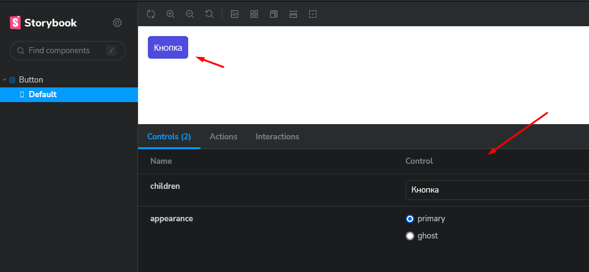
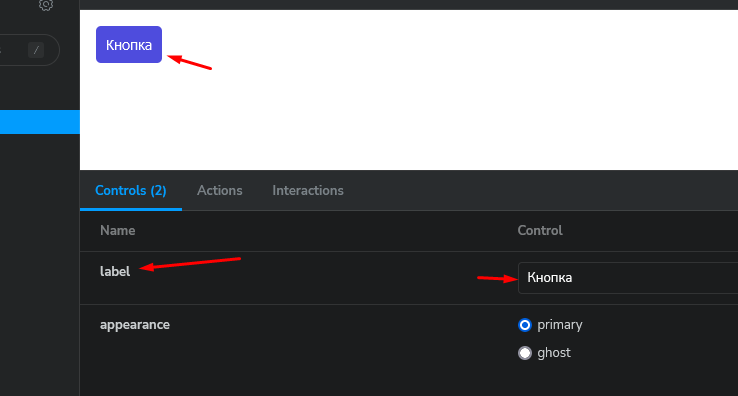
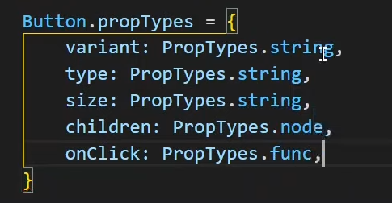

Для начала развернём проект реакта и добавим в него кнопку с описанием принимаемых ею пропсов

`components > Button > Button.tsx`

```TSX
import React from 'react'
import { ButtonProps } from './Button.props'
import './Button.css';
import cn from 'classnames';

export const Button = ({ appearance = 'primary', children, className, ...props }: ButtonProps) => {
    return (
		<button
			className={cn('button', className, {
				['primary']: appearance == 'primary',
				['ghost']: appearance == 'ghost',
			})}
			{...props}
		>
			{children}
		</button>
	);
}
```

`components > Button > Button.props.ts`

```TS
import { ButtonHTMLAttributes, DetailedHTMLProps, ReactNode } from 'react';

export interface ButtonProps
	extends DetailedHTMLProps<ButtonHTMLAttributes<HTMLButtonElement>, HTMLButtonElement> {
	children: ReactNode;
	appearance?: 'primary' | 'ghost';
}
```

Для установки сторибука понадобится в проекте ввести данную команду:

```bash
npx sb init
```

После установки, у нас появится скрипт для запуска сторибука

`package.json`

```JSON
"scripts": {
	"start": "react-scripts start",
	"build": "react-scripts build",
	"test": "react-scripts test",
	"eject": "react-scripts eject",
	"sb": "storybook dev -p 6006",
	"build-storybook": "storybook build"
},
```

Так же сформируются два файла конфигурации, которые будут отвечать за то, какие файлы будут и по каким параметрам определяться как источники историй для сторибука

`.storybook > main.ts`

```TS
import type { StorybookConfig } from "@storybook/react-webpack5";

const config: StorybookConfig = {
  stories: ["../src/**/*.mdx", "../src/**/*.stories.@(js|jsx|ts|tsx)"],
  addons: [
    "@storybook/addon-links",
    "@storybook/addon-essentials",
    "@storybook/preset-create-react-app",
    "@storybook/addon-interactions",
  ],
  framework: {
    name: "@storybook/react-webpack5",
    options: {},
  },
  docs: {
    autodocs: "tag",
  },
  staticDirs: ["..\\public"],
};

export default config;
```

Сохраняет настройки лейаута

`.storybook > preview.ts`

```TS
import type { Preview } from "@storybook/react";

const preview: Preview = {
  parameters: {
    actions: { argTypesRegex: "^on[A-Z].*" },
    controls: {
      matchers: {
        color: /(background|color)$/i,
        date: /Date$/,
      },
    },
  },
};

export default preview;
```

И уже только сейчас в папке, где у нас располагается элемент, мы можем реализовать страницу сторибука с элементом

`Button.stories.js`

```TSX
import { Button } from "./Button";

export default {
    // заголовок компонента Папка (необязательно) - Компонент
    title: 'UI/Button',
    // сам компонент
    component: Button
}

// сам компонент, который будет выводиться на экран
export const DefaultButton = () => <Button>Кнопка</Button>
```


Но более правильным добавлением элемента в сторисы будет считаться добавление его через темплейт, что позволит нам динамически менять значение параметров компонентов прямо в сторибуке

`Button.stories.js`

```JS
import { Button } from './Button';

export default {
	title: 'Button',
	component: Button,
};

// создаём шаблон для занесения в него пропсов
const Template = (arg) => <Button {...arg} />;

// дальше привязываем контекст шаблона
export const Default = Template.bind({});

// дальше передаём дефолтные аргументы в кнопку
Default.args = {
	children: 'Кнопка',
	appearance: 'primary',
};
```

И тут мы видим конкретные типы пропсов, которые мы можем выбрать. Это работает благодаря тому, что TS описал интерфейс принимаемых пропсов компонентом



Так же мы можем создать несколько вариантов наших компонентов, чтобы не менять пропсы вручную

`Button.stories.js

```JS
import { Button } from './Button';

export default {
	title: 'Button',
	component: Button,
};

const Template = (arg) => <Button {...arg} />;

export const Primary = Template.bind({});

Primary.args = {
	children: 'Кнопка',
	appearance: 'primary',
};

export const Ghost = Template.bind({});

Ghost.args = {
	children: 'Кнопка',
	appearance: 'ghost',
};
```


Но! Если мы пишем проект без TS, то типы возможных аргументов мы можем прописать самостоятельно через задание для каждого параметра своих свойств внутри свойства `argTypes`

```JS
import { Button } from './Button';

export default {
	title: 'Button',
	component: Button,
	// типы аргументов компонента
	argTypes: {
		// аргумент оформления
		appearance: {
			type: 'string', // тип аргумента
			description: 'Вариант внешнего вида кнопки', // описание
			defaultValue: 'primary', // дефолтное значение
			options: ['primary', 'ghost'], // возможные опции
			control: { // способ переключения опций
				type: 'radio',
			},
		},
		children: {
			type: 'string',
			name: 'label', // имя в сторибуке
			defaultValue: 'Кнопка',
		},
	},
};

const Template = (arg) => <Button {...arg} />;

export const Primary = Template.bind({});

Primary.args = {
	children: 'Кнопка',
	appearance: 'primary',
};

export const Ghost = Template.bind({});

Ghost.args = {
	children: 'Кнопка',
	appearance: 'ghost',
};
```



> [!info] Но так же мы можем сделать проверку типов с помощью #PropTypes внутри самого компонента, что так же позволит заменить функционал интерфейса для отображения пропсов в сторибуке
> 
> 
