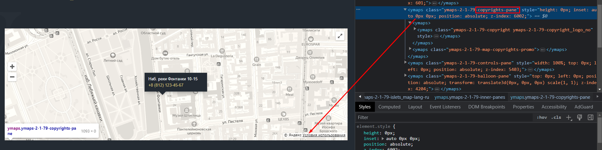
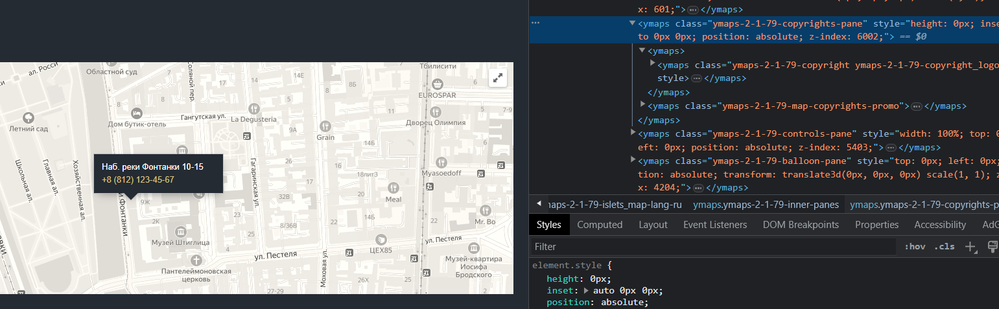

Если нам нужно применить стили на динамический класс, у которого есть фиксированное только одно название



То мы можем воспользоваться такой конструкцией, которая применяет стили на класс, который содержит в названии данную конструкцию

```SCSS
// по умолчанию скрываем элементы
[class*='copyrights-pane'] {
	/* display: none !important; */
	opacity: 0;
	transition: opacity 0.2s ease-in;
}

// отображаем при наведении
.map:hover [class*='copyrights-pane'] {
	opacity: 1;
}
```

И теперь стили применены



