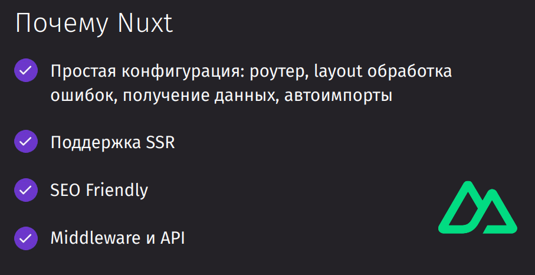
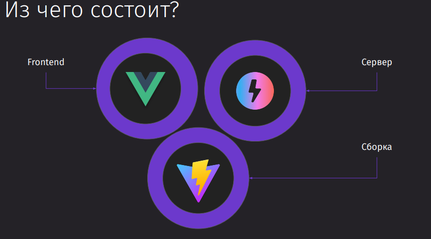

---
## Введение

- Nuxt — Vue-фреймворк, расширяющий возможности Vue.
- Предлагает простую настройку сервер-сайт рендеринга, роутинга и управления состояниями.
- Поддерживает SEO-френдли приложения и Universal Rendering из коробки.

- Объединение функций: роутеры, лейауты, обработка ошибок, автоимпорты.
- Возможности бэкэнда через Nitro на Node.js.
- Быстрая настройка и высокая производительность с использованием Vite.

---
## Структура проекта

---
## Роутинг

---
## Layout

---
## SSR

---
## Стилизация и анимация

---
## Получение данных

---
## Работа с состоянием

---
## Авторизация

---
## SEO и Metadata

---
## Server endpoints

