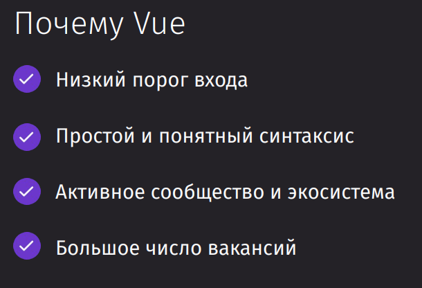
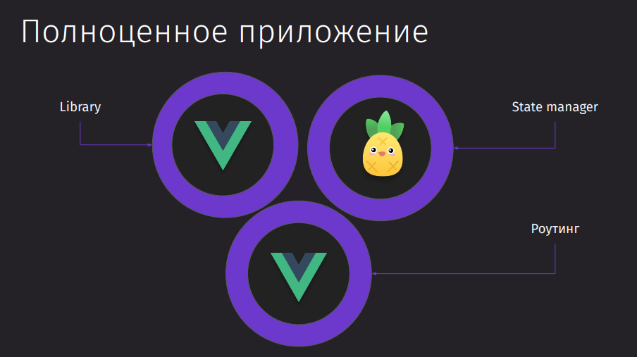
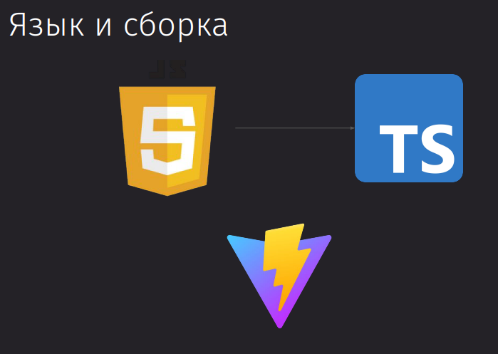
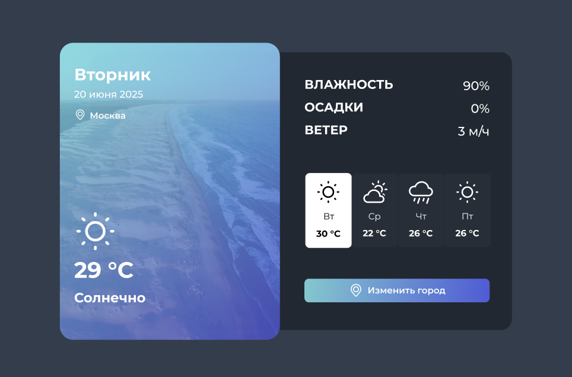
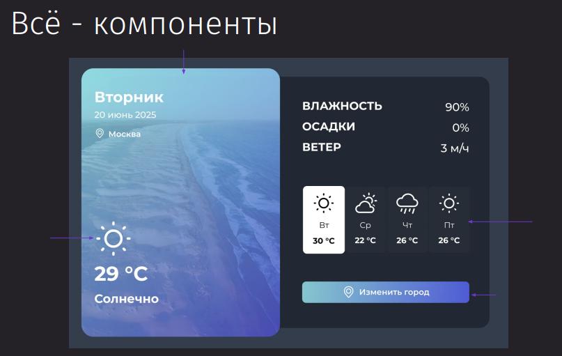
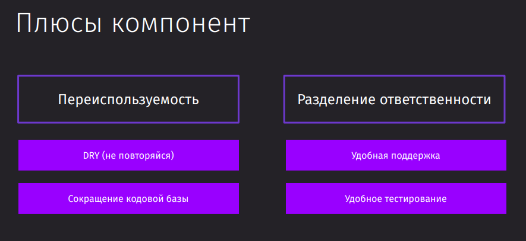

---
tags:
  - vue
  - pinia
---

---
## Введение

Vue - это фреймворк для написания клиентских приложений. 

- Он крайне прост и имеет низкий порог входа.
- Имеет чистый синтаксис за счёт хранения всего в одном файле

---
## Основы

---
## Компоненты

### Проект

Будет разрабатываться интерфейс прогноза погоды

### Что такое компоненты

**1. Определение и Значение:**

- Компоненты — это строительные блоки для создания сложных и интерактивных интерфейсов.
- Используются во всех современных фронт-энд фреймворках, таких как Vue, React и другие.

**2. Аналогия:**

- Компоненты можно сравнить с деталями конструктора Lego — каждая деталь (компонент) вносит свой вклад в создание целого приложения.

**3. Примеры компонентов:**

- Корневой компонент приложения.
- Компоненты, отображающие данные, например, компонент «левый панель», который показывает погоду.
- Компоненты интерфейса, такие как кнопки или карточки.

**4. Преимущества использования компонентов:**

- **Переиспользуемость:** Возможность использовать один и тот же компонент в разных частях приложения, что экономит время и сокращает кодовую базу.
- **Разделение ответственности:** Каждый компонент выполняет отдельную задачу, что облегчает поддержание и тестирование приложения.

**5. Переиспользуемость:**

- Принцип DRY (Do Not Repeat Yourself) — избегание повторения кода путем использования компонента везде, где это необходимо.

**6. Разделение ответственности:**

- Каждый компонент имеет свою зону ответственности и свои задачи, например, реакцию на клики.
- Удобство в поддержке — изменение дизайна компонента в одном месте автоматически обновляет его во всем приложении.

**7. Удобство тестирования:**

- Компоненты изолированы, что облегчает проверку их состояния и параметров.

---
## Свойства и события

---
## Реактивность

---
## Шаблонные модели

---
## Жизненный цикл

---
## Custom directive и Provide Inject

---
## Переход на TS

---
## Pinia

---
## Vue Router

---
## Авторизация

---
## Встроенные компоненты

