#Adaptive

### 6.2 Какие существуют типы верстки

Есть 4 варианта вёрстки:

- Фиксированная - без адаптива только на ПК
- Отзывчивая (резиновая) - адаптив определяется сугубо размером экрана (например, ширина блока = 40% от экрана)
- Адаптивная вёрстка – вёрстка страницы меняется по достижению определённой ширины страницы

Совмещение адаптивной и отзывчивой вёрстки – наличие как отзыва на уменьшение страницы, так и перестройки по достижению определённого уменьшения экрана (например, строка поиска может уменьшаться какое-то время (отзывчивость), а при достижении ширины в 1200 пикселей, сайт начнёт перестраиваться под планшеты (адаптивность))

### 6.3 Как работает мета тег viewport

Данный метатег за нас подсчитывает количество пикселей на дюйм на мобильных девайсах и без адаптива позволяет автоматически призумить изображение на мобильнике

Данный тег изобрела компания apple, чтобы было проще зумировать изображение страницы на разных телефонах

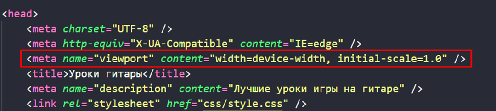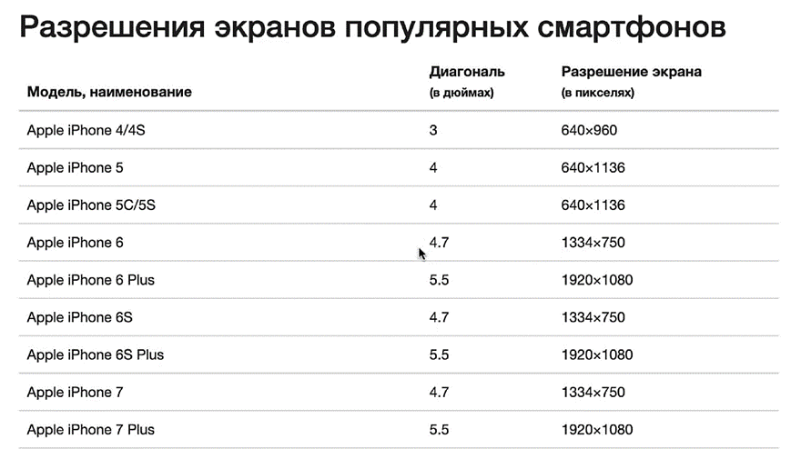

### 6.4 Под какие размеры нужно адаптировать сайт

Примерно под такие основные размеры страниц нужно делать наш адаптив

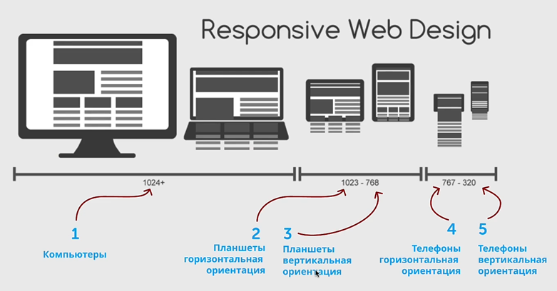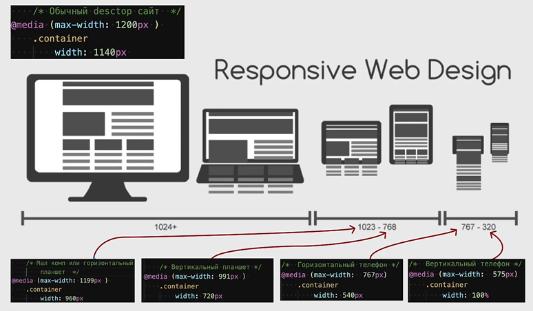

### 6.5 Адаптация под планшетную версию ч.1

Проверка адаптива применяется в этой версии

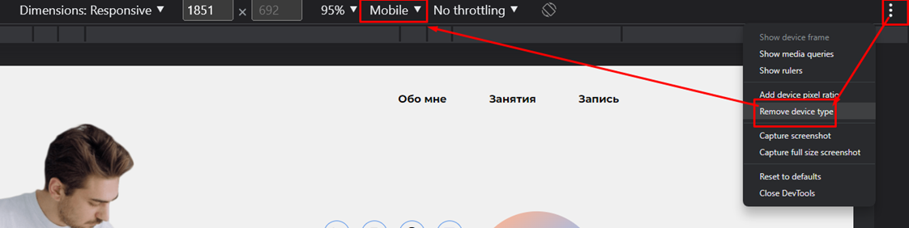

В документа со свойствами в конце начинаем прописывать адаптив для нашего сайта. После того, как мы прописали размеры для контейнера, нам нужно приступать к адаптиву самого контента (это лучше делать на минимальном граничащем размере)

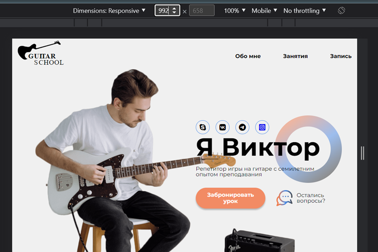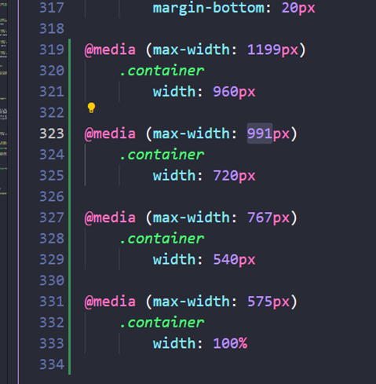 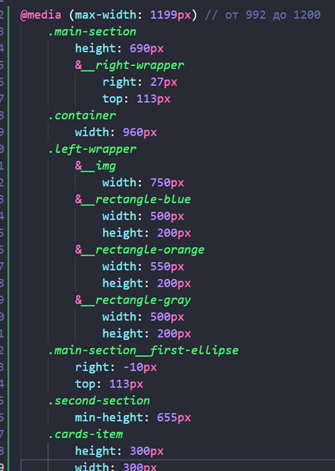

### 6.6 Практика Адаптируйте сайт под следующую версию

Так же данная функция позволяет сделать подгонку размера под наши медиазапросы в CSS

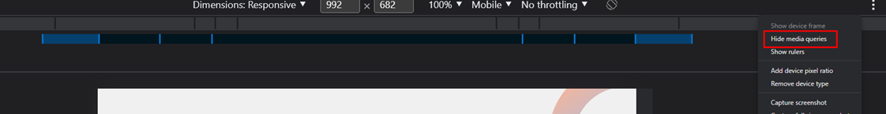

### 6.7 Пример преподавателя. Адаптация следующей версии под планшет

Для того, чтобы убрать элемент из кода с помощью CSS, можно воспользоваться:  `display:none`

В данном конкретном случае мне уже не нужен был левый блок с одним тайтлом и его можно было спокойно убрать

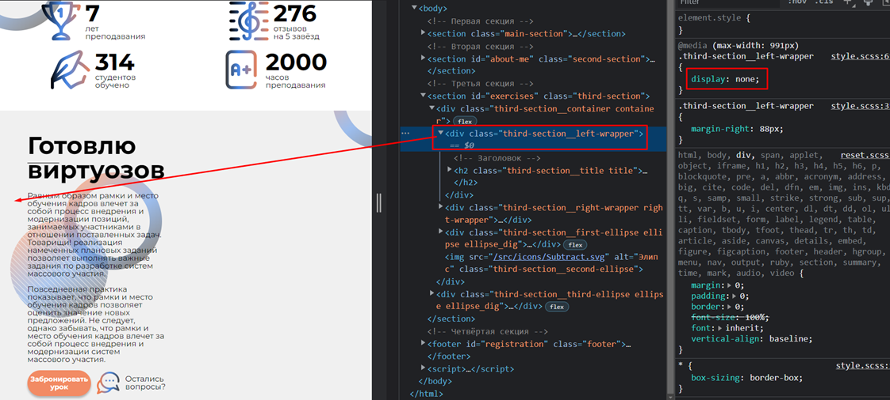

### 6.8 Как работают единицы измерения EMREM VHVW

Тут хочется отметить, что для создания кнопки можно и не задавать размер. Можно просто прописать паддинги и они уже будут отталкиваться от текста внутри кнопки, что создаст растягиваемый размер

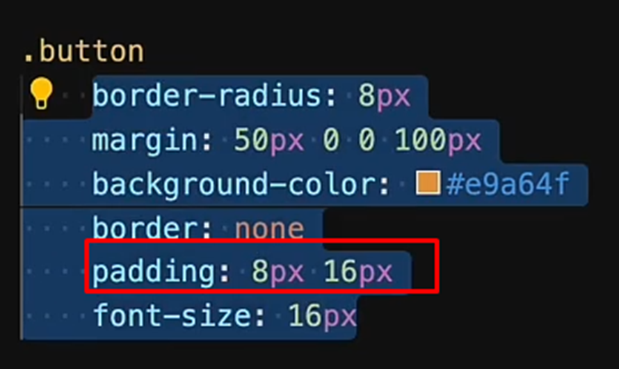

И в чём же преимущество `em`? Как видно из кода выше, наши кнопки имеют одинаковый паддинг, но только разный размер шрифта. Перед нами встаёт задача сделать кнопки по пропорциям – одинаковыми. И тут приходит на помощь единица измерения «`em`». Она имеет размер одинаковый с размером шрифта элемента (по умолчанию 16)

До:

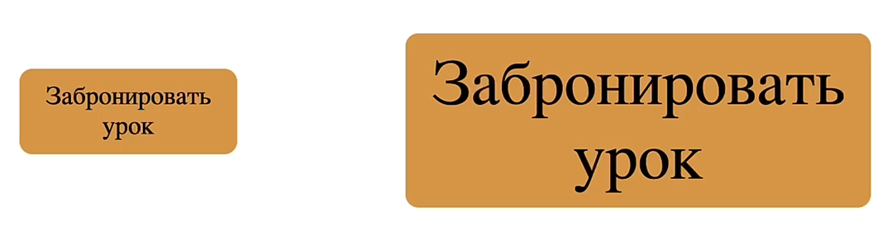

Тут мы уже выставляем паддинги через em и теперь они будут подстраиваться относительно ширины шрифта нашего элемента, а то есть: у маленькой кнопки размер шрифта 16 – паддинги будут автоматически 8 и 16 пикселей, у большой кнопки шрифт 40 – паддинги автоматически подстроятся под 20 и 40 пикселей

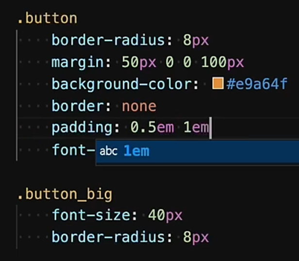

После. Мы получили абсолютно идентичные кнопки в плане пропорций, что позволило нам не высчитывать размеры кнопок по-отдельности. Так же можно применять em и к остальным значениям (например, скругление кнопки)

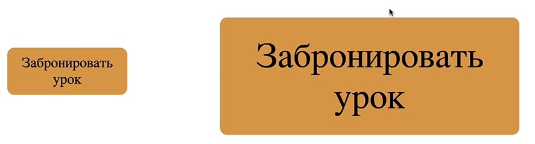

Так же можно применять `em` для создания отступов, но это менее удобный вариант

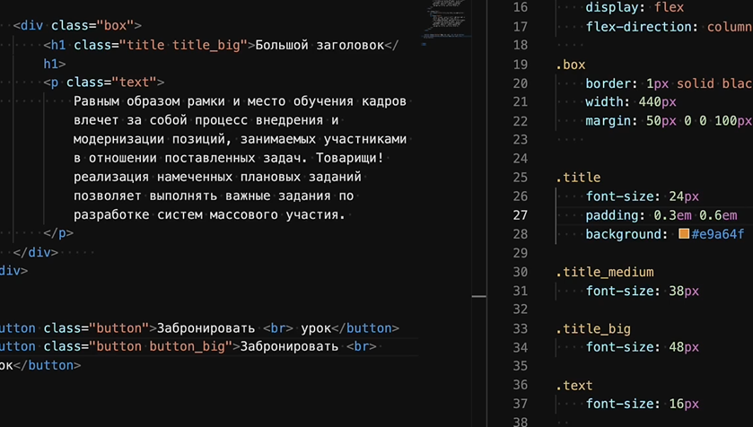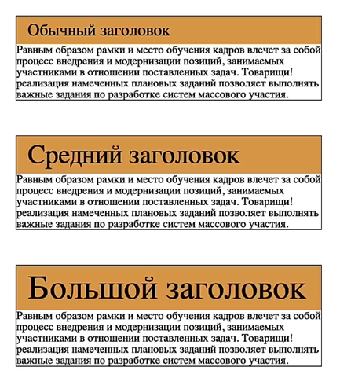
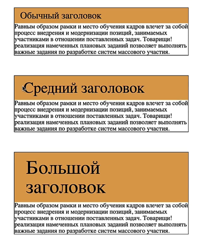

Уже для создания отступов можно использовать единицу «`rem`». Она тоже хранит в себе значение в пикселях, но хранит стандартный размер шрифта для данного элемента (тут `rem` статично – 16 пикселей)

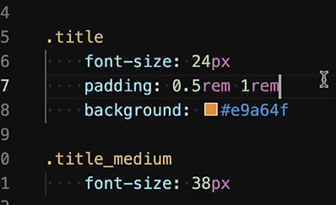 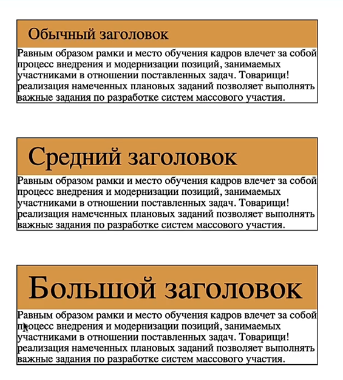

И далее пойдёт тоже крайне важные и полезные `vh` (`viewhight`) и vw (`viewwidth`). Они работают как % от размера экрана пользователя. Используются чаще, например, для создания полноэкранного режима окна.

Чаще используется `viewhight`, так как он задаёт размер элемента во всю ширину экрана и подгоняет элемент так, чтобы он всегда занимал выделенное ему данным свойством место (например, то же изображение может обрезаться с разных сторон). `VW` может дополнительно создать полосу прокрутки вбок, что может быть неудобно и поэтому вместо него используют «`width:100%`»

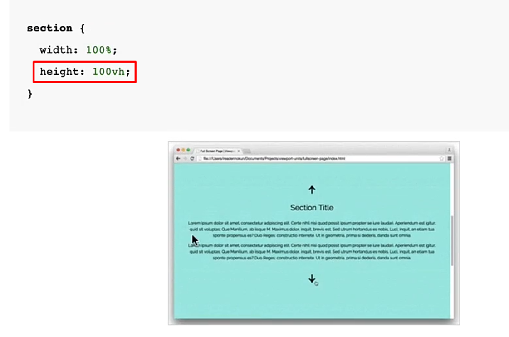

[https://learn.javascript.ru/css-units](https://learn.javascript.ru/css-units)
[https://front-end.su/2015/10/07/viewport-units-vs-percent/](https://front-end.su/2015/10/07/viewport-units-vs-percent/)

### 6.9 Свойство transition. Создаем гамбургер для мобильной версии сайт

Первым делом, нам нужно в самом верху добавить сам гамбургер, который будет заменять нам менюшку

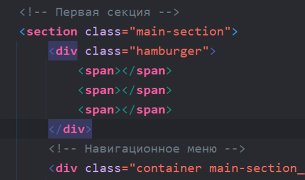

Дальше через `display: none` скрываем старое меню. Стилизируем гамбургер и превращаем все спаны в блоки (это нужно, чтобы в принципе пользователь мог попасть по нему) и даём высоту блоку их родителя.

Так же тут прописан транзишн – он определяет время перехода между начальным видом элемента и конечным

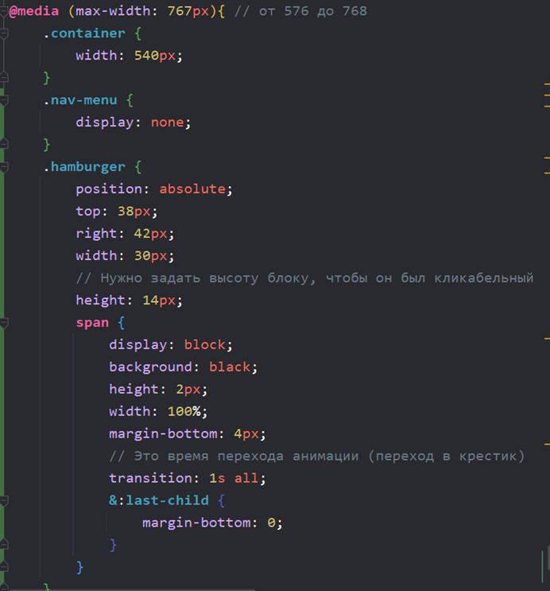 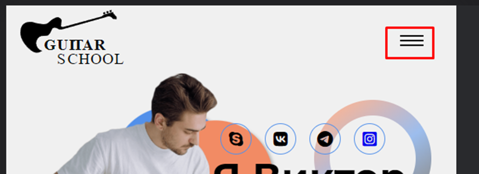

И далее мы создаём стилизированный класс, который будет превращать наш гамбургер в крестик. Этот класс мы будем вызывать через JS

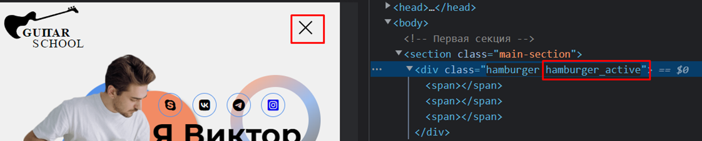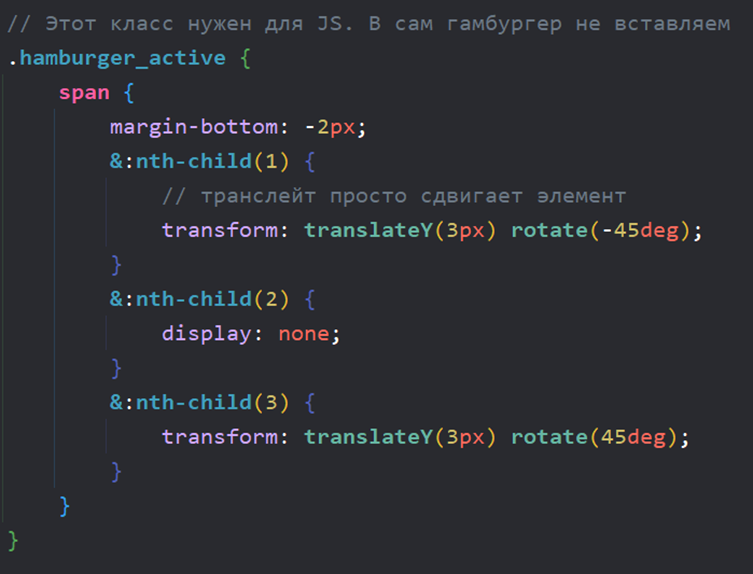

### 6.10 Создаем гамбургер для мобильной версии сайта ч.2

Ну и правим наш блок с навигацией. Дисплей с нона меняем на блочный (`right` ставим на «`-100%`», чтобы скрыть его на момент отсутствия), позиционирование фиксированное, чтобы при прокрутке оставался всегда на месте, индекс ставим наивысший (выше только у гамбургера, который скроет меню), ширину в `50%` от экрана пользователя и высоту на 100% от пользовательского экрана. Конечным параметром будет переход. Наш список внутри навигационного меню отцентрируем по середине и выставим в колонку

При активации наш нав-меню должен принять стоковое положение в позиции 0 справа

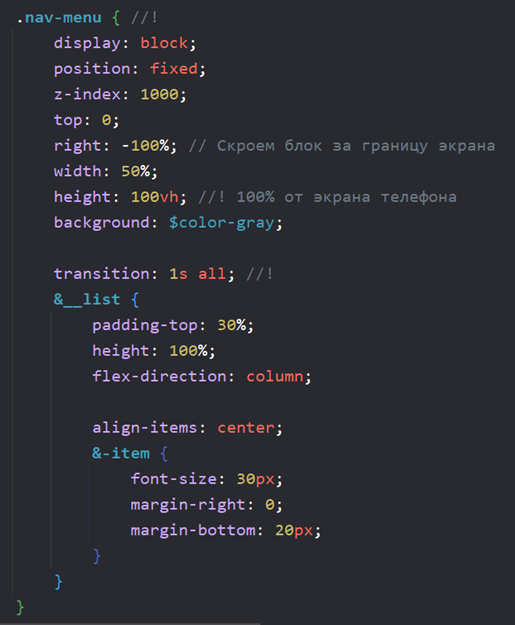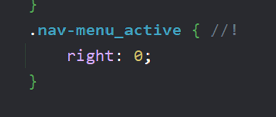 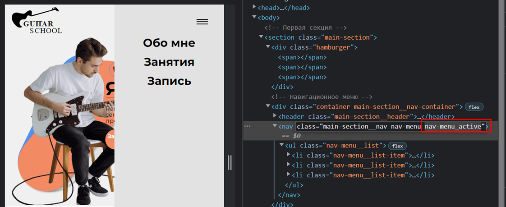

### 6.11 Знакомство с JS. Создаем гамбургер для мобильной версии сайта ч.3

Теперь заветная анимация работает прекрасно через добавление классов в теги посредством JS и `toggle()`

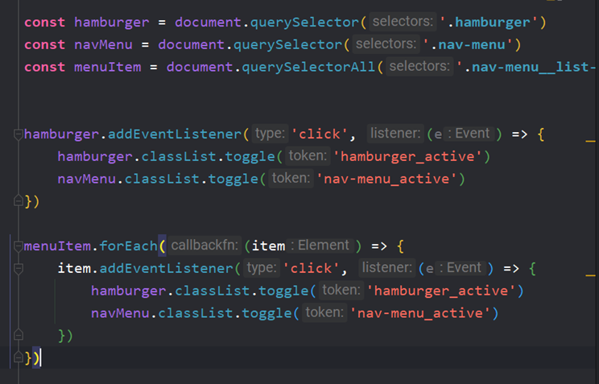 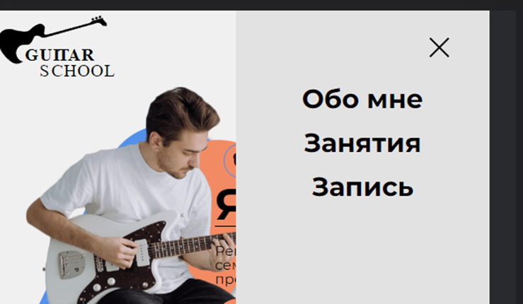

### 6.12 Speed test готового сайта

Можно проверить загруженный в интернет сайт через PageSpeed от Google

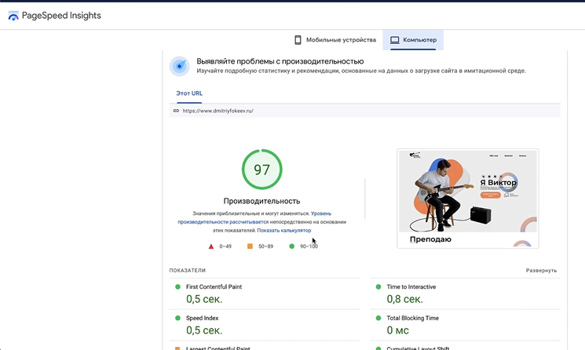

А можно обратиться к ==Lighthouse== внутри девтулза

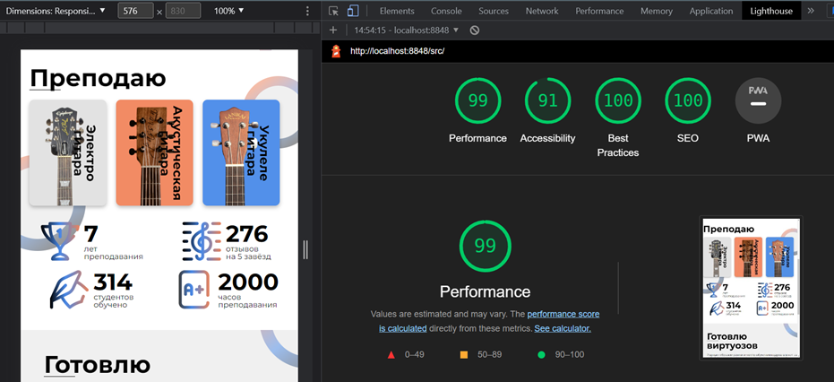

Основная проблема заключается в мобильных устройствах, которые можно оптимизировать очень долго. И данный сервис нам подскажет, что мы можем оптимизировать на мобильных устройствах.

Например, можно сжать изображения, чтобы избавиться от многих проблем

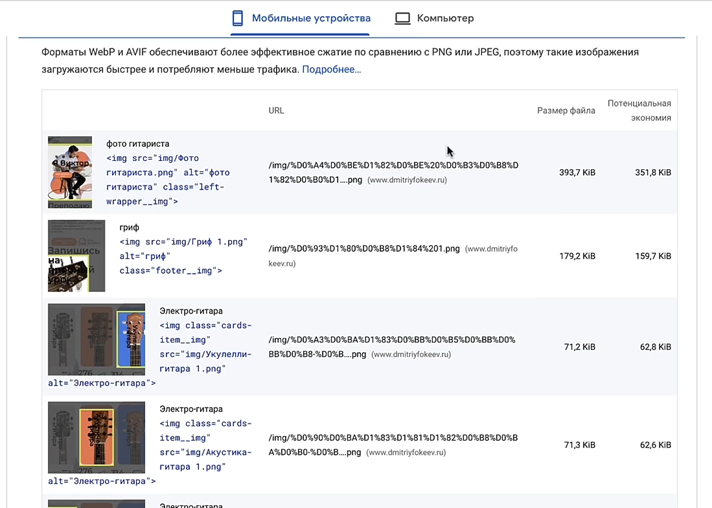

Если гугл будет предлагать увеличить период кэширования до 365 дней, то оно меняется на нашем хостинге (нужно учитывать свободное пространство на хостинге). Однако кеширование обычно оставляют на 8 дней

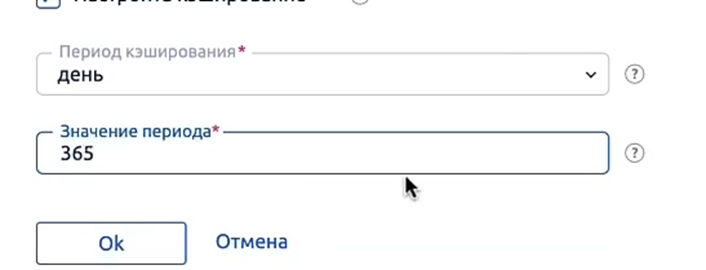

Так же рекомендуется, чтобы избежать проблему невидимых шрифтов, использовать `font-display: swap;`, который отобразит до загрузки основных шрифтов стандартные

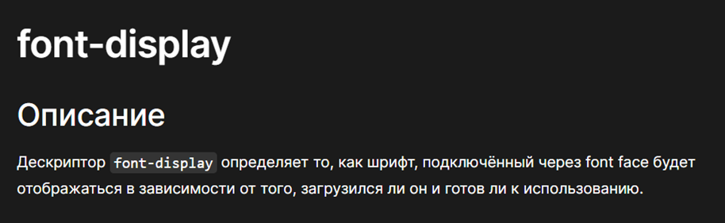

Так же рекомендуется минимизировать конечный CSS файл, чтобы он был более ёмким. Такую задачу обычно выполняют компиляторы препроцессоров

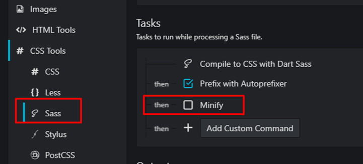 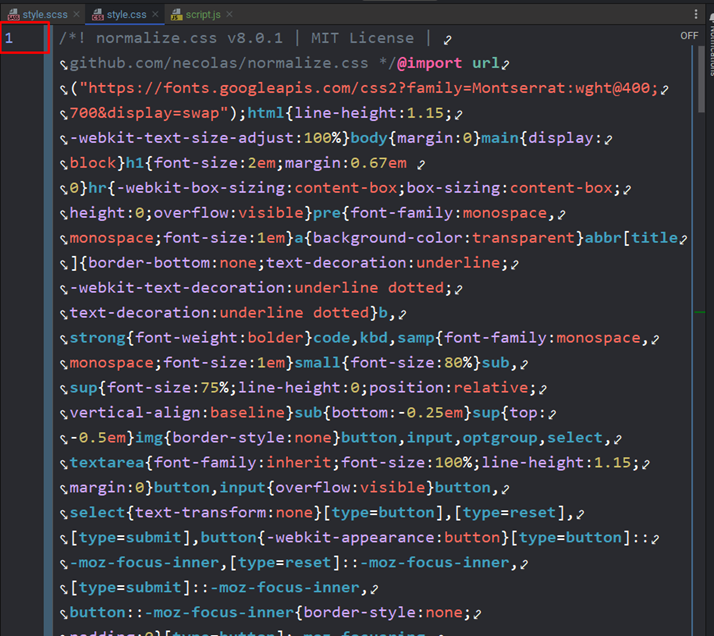

Теперь можно спокойно выкладывать сайт на хостинг. Версия на отправку (с сжатыми изображениям и оптимизацией) кладётся в папку «`dist`»

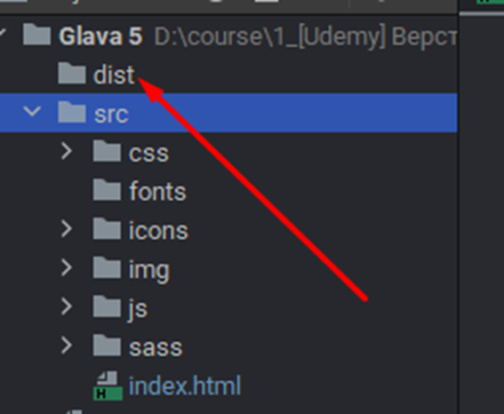
