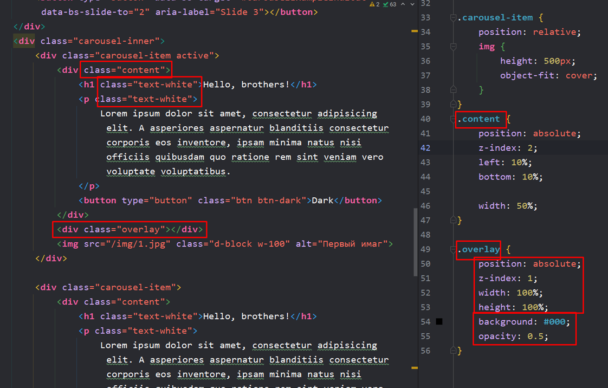

#Bootstrap

### 7.2 Что такое bootstrap

Bootstrap – это CSS библиотека, которая хранит в себе огромное количество элементов, позволяющих быстро создавать элементы на странице. Его можно использовать как средставо для полного создания визуала на странице. Можно использовать только часть от нег и менять его элементы. Можно просто взять слайдер и всё остальное на странице верстать своими силами

### 7.3 Как подключить bootstrap в свой проект

Можно подключить бутстрап через удалённые ссылки (скрипт + линк на CSS)

Так же мы можем быстро добавлять целые компоненты bootstrap, которые работают с ранее вставленными скриптами и линками

Ну и никто не мешает менять уже скопированные блоки со стилями. Очень важный момент – свои стили нужно вставить ниже подключенных стилей бутстрапа, чтобы они имели более высокий приоритет

Так же мы можем скачать сам бутстрап с официального сайта. Нам даётся вариант подключать только нужные нам блоки

### 7.4 Какие настройки содержит в себе bootstrap

Во-первых, хочется отметить, что бутстрап уже изначально имеет правильный бокс-сайзинг

Во-вторых, у него свой единый «`reboot.css`», который заменяет «`reset.css`» и «`normalize.css`»

 

### 7.5 Как задавать свои стили в bootstrap

Задавать свои стили для бутстрапа можно через файлик CSS, как уже говорилось ранее, но рекомендуется использовать встроенное изменение стилей в теги HTML. Это позволяет стилизовать код быстрее

На официальном сайте есть достаточно непростая инструкция по работе с отступами между элементами. Минимальный отступ `0.25rem`, максимальный – `3rem`. И далее приведены аббревиатуры модификаторов тегов

Пример использования:

### 7.6 Свойство Object-fit и как создать слайдер в bootstrap

Как всегда, бутстрап-элементы мы находим в документации и выбираем нужные

И если мы захотим задать размер нашим изображениям в слайдере, то увидим дапнную картину сплющивания:

И тут на помощь к нам приходит свойство `object-fit`, которое подгоняет размер элемента под определённую ему высоту разными способами

И теперь, когда мы добавили для изображения нашей карусели свойство `object-fit: cover`, наши изображения перестали сплющиваться

Однако, хочется отметить, что для подгонки изображений будет более правильным вариантом поместить его в див и для самого дива прописать `background: url(…) center/cover`, чтобы выравнивать изображения

### 7.7 Как модифицировать слайдер в bootstrap

Ну и тут представлен очередной пример быстрой работы с применением bootstrap.

Первым делом мы добавили отдельный класс с контентом, в который мы расположим текст и кнопку. Сам контент располжим внутри айтема слайдера и зафиксируем его абсолютно.

Кнопку мы достали из документации по бутстрапу. Класс с цветами для текста тоже достали там же

Оверлей у нас служит для затемнения изображения на слайдере. Айтему слайдера зададим релативное положение (чтобы оверлей раполагался относительно родителя). Самому оверлею зададим абсолютное положение с шириной и высотой в 100%, так же нужно задать цвет оверлею и непрозрачность

 

### 7.8 Как менять цвета в bootstrap

В быстром доступе в бутстрапе всего несколько цветов кнопок

Остальные же цвета забиты в качестве переменных и их нужно подключать локально через импорт. Однако такой подход – это лишняя трата времени, так как цвета можно задать и через CSS

Однако хочется сказать, что бутстрап позволяет задать кнопки на любой вкус и цвет и можно найти нужный для себя вариант из представленного списка на любой компонент

 

### 7.9 Как изменить скорость слайдера в bootstrap

И далее нужно упомянуть про модификацию элементов бутстрапа через атрибуты. В конце каждой страницы компонентов находятся атрибуты, которые можно применить на компоненте, чтобы модифицировать его поведение.

Например, тут нужно применить `data-bs-опция=”значение”`, чтобы задать другое поведение для слайдера

И, например, таким кодом мы уменьшили интервал между сменой слайда до одной секунды

### 7.10 Типичные ошибки и проблемы с работой в bootstrap

Тут дана только одна рекомендация – если что-то не работает, то нужно проверять всё по английской версии сайта. Русский сайт даёт примерный перевод документации, а уже оригинал более достоверен по классам и атрибутам

### 7.11 Как менять компоненты bootstrap. Меняем иконки на слайдере

Первый вариант. На сайте бутстрапа, на главной, можно найти и скачать иконку в svg формате. Далее просто вставляем её в код вместо спана, который находится внутри кнопки

  

Второй способ. Это подключение через тег `svg`

 

Третий способ. Подключение через CDN иконочного шрифта. Он настраивается как текст

 

### 7.12 Система сеток bootstrap. Bootstrap-grid

Самая главная фишка, по которой используют бутстрап – это сетка. Как можно увидеть на макете – все наши элементы располагаются относительно колонок, которые мы прописали

И в эту систему сеток включен зарезервированный класс `container`. В бутстрапе он уже заранее прописан и отвечает за медиазапросы на сужение ширины колонок. Данный контейнер работает как тот, что описывали раньше самостоятельно.

- Есть еще «container-fluid», который имеет ширину всего окна (и имеет только паддинги по 12 пикселей по сторонам)
  

И далее идёт ещё один важный класс «row». Он выстраивает внутрилежащие объекты в ряд. Если не будет хватать места на экране, то роу просто перенесёт этот элемент на новую строку

И сейчас идёт имбовая система сеток. Для того, чтобы она работала, нужно размещать её элементы внутрь боксов «`container`» > «`row`» >. Вызывается изменение размера через класс «col-количествоСтолбцов». Чтобы изменения вступили в силу так же нужно убрать размеры в ширину с самих элементов, которые мы меняем

Тут мы навесили ширину 4-6-2. И как мы видим, тут не видно отступов между элементами. По сути отступы есть, но они не работают на блоки

Чтобы исправить ситуацию, нужно поместить элементы в бокс и присвоить `col-` именно этим контейнерам, а не самим элементам

 

Бутстрап использует 12-иколоночную систему с отступами по 30 пикселей

И тут нужно упомянуть, что бутстрап является ==mobile-first== библиотекой (верстается мобильная версия, а потом уже адаптируется десктопная). То есть наименования классов идут от самых маленьких к самым большим размерам. Однако даже мобильные стили работают на более десктопных форматах, поэтому можно меньше волноваться о сложностях адаптива

Тут я написал, что при минимальном размере один элемент будет занимать 12 колонок, при среднем - 6, а при максимальном - 4

- «offset-числоКолонок» создаёт отступы между элементами
   

И если мы встречаем такой элемент, который малым достаёт следующую колонку, то мы ему должны отдать и эту колонку. Текст лежит в 5 колонках – располагаем на пяти

### 7.13 Как решать задачи возникающие в процессе верстки

Чтобы решить любую задачу на сайте, можно воспользоваться готовыми ответами в интернете, коих пруд пруди. И теперь живи с этой информацией как жил до этого…

Тут показано как сделать [плавную прокрутку](https://smartlanding.biz/skript-plavnoj-prokrutki.html)
