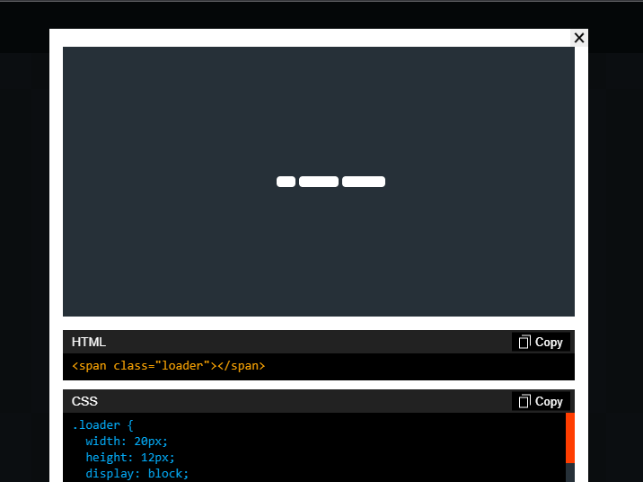
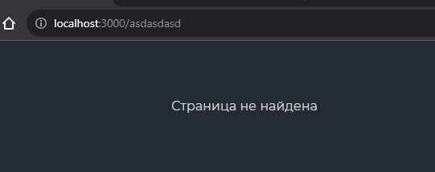
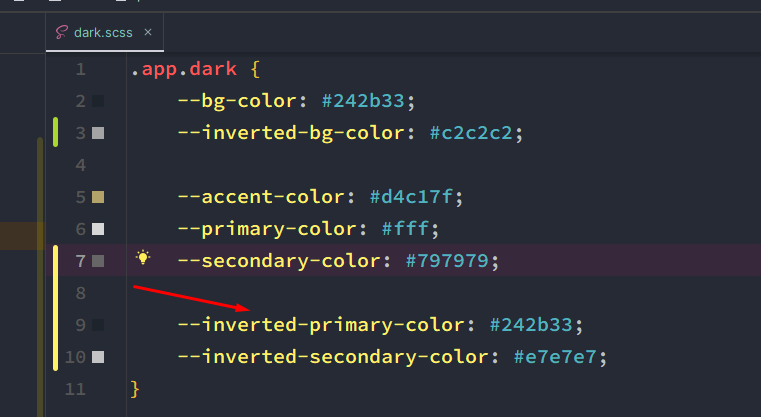
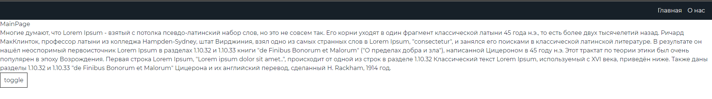
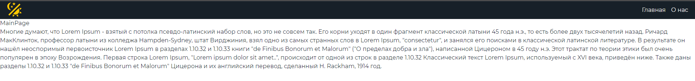
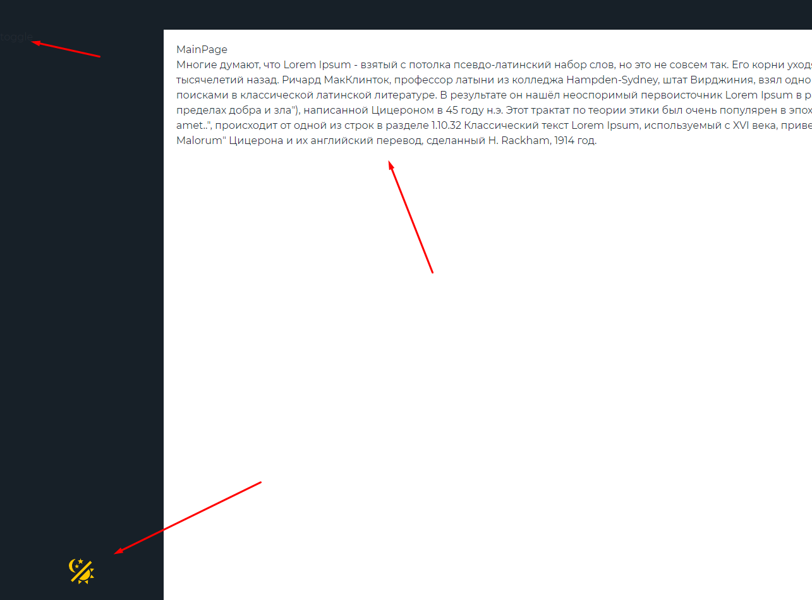
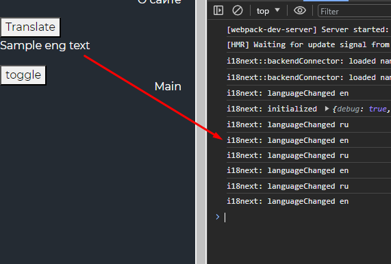
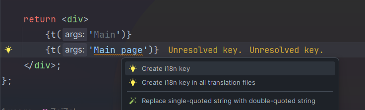
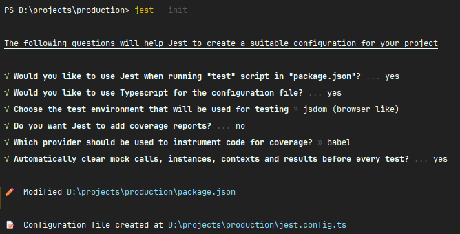
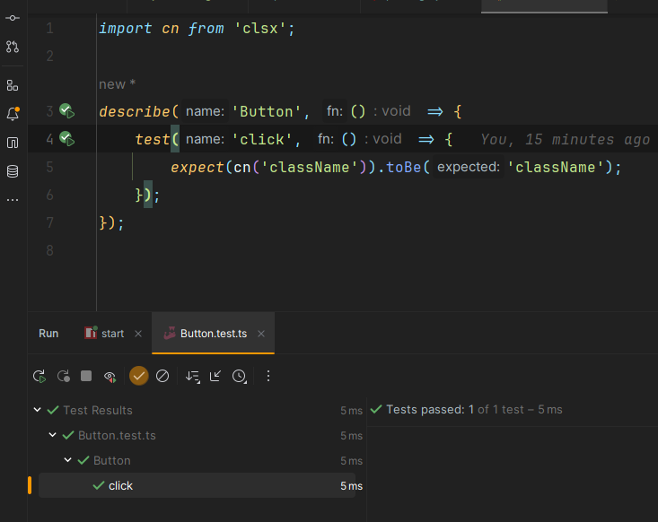

### 11 AppRouter. Конфиг для роутера

Сейчас нужно реализовать конфиг для нашего будущего роутера

Первым делом нужно определить пути, которые будут доступны в нашем приложении

`src / app / providers / router / model / const / appRoutes.const.ts`
```TSX
export enum AppRoutes {  
    MAIN = 'main',  
    ABOUT = 'about',  
    LOGIN = 'login',  
    FORBIDDEN = 'forbidden',  
    NOT_FOUND = 'not_found',  
}
```

Далее нужно написать пути, которые будут использоваться в самом роутере

`src / shared / const / paths.const.ts`
```TS
export const getRouteMain = () => '/';
export const getRouteLogin = () => '/login';
export const getRouteAbout = () => '/about';
export const getRouteForbidden = () => '/forbidden';
export const getRouteNotFound = () => '*';
```

Далее нужно расширить пропсы, которые будут описывать роутер. Конкретно мы добавим свойство, которое будет отвечать за доступность роута неавторизованному пользователю (сама авторизация будет реализована за счёт перехватчика состояния авторизации в будущей заметке (для этого будет использоваться `RequireAuth`))

`src/app/providers/router/model/types/routes.type.ts`
```TS
import { RouteProps } from 'react-router-dom';  
  
export type AppRouteProps = RouteProps & { authOnly: boolean };
```

Далее нужно написать сам конфиг, который будет содержать все нужные пропсы для роута приложения

`src > shared > config > routeConfig > routeConfig.tsx`
```TSX
import React from 'react';  
import { AppRouteProps } from '../model/types';  
import { AppRoutes } from '../model/const';  
/* pages */  
import { MainPageAsync } from '@/pages/MainPage';  
import { AboutPageAsync } from '@/pages/AboutPage';  
import { LoginPageAsync } from '@/pages/LoginPage';  
import { ForbiddenPageAsync } from '@/pages/ForbiddenPage';  
import { NotFoundPageAsync } from '@/pages/NotFoundPage';  
/* route const */  
import {  
    /* data */  
    getRouteMain,  
    getRouteAbout,  
    /* auth */  
    getRouteLogin,  
    /* service */  
    getRouteForbidden,  
    getRouteNotFound,  
} from '@/shared/const';  
  
/* тут мы храним все роуты приложения */  
export const routeConfig: Record<AppRoutes, AppRouteProps> = {  
    [AppRoutes.MAIN]: {  
       path: getRouteMain(),  
       element: <MainPageAsync />,  
       authOnly: true,  
    },  
    [AppRoutes.ABOUT]: {  
       path: getRouteAbout(),  
       element: <AboutPageAsync />,  
       authOnly: true,  
    },  
    [AppRoutes.LOGIN]: {  
       path: getRouteLogin(),  
       element: <LoginPageAsync />,  
       authOnly: true,  
    },  
    [AppRoutes.FORBIDDEN]: {  
       path: getRouteForbidden(),  
       element: <ForbiddenPageAsync />,  
       authOnly: true,  
    },  
    [AppRoutes.NOT_FOUND]: {  
       path: getRouteNotFound(),  
       element: <NotFoundPageAsync />,  
       authOnly: true,  
    },  
};
```

Далее нужно реализовать отдельный провайдер с роутером, который будет генерировать массив роутов приложения

`src > app > providers > router > ui > AppRouter.tsx`
```TSX
import React, { Suspense } from 'react';  
import { Route, Routes } from 'react-router-dom';  
import { routeConfig } from '@/app/providers/router/config/routeConfig';  
import { Loader } from '@/shared/ui';  
  
export const AppRouter = () => {  
	return (  
	  <Routes>  
		 {Object.values(routeConfig).map(({ element, path }) => (  
			<Route                   key={path}  
			   path={path}  
			   element={  
				  <Suspense fallback={<Loader />}>  
					 <div className='page-wrapper'>{element}</div>  
				  </Suspense>  
			   }  
			/>  
		 ))}  
	  </Routes>  
    );  
};
```

Так же в саспенс бал добавлен лоадер, который будет показываться при загрузке страницы.

Сам лоадер взят [отсюда](https://cssloaders.github.io/)



Экспортируем роутер

`src > app > providers > router > index.ts`
```TS
export { AppRouter } from './ui/AppRouter';
```

И просто используем роуты в корневом файле

`src > app > App.tsx`
```TSX
export const App = () => {
	const { toggleTheme, theme } = useTheme();

	return (
		<div className={classNames('app', {}, [theme])}>
			<button className={'button'} onClick={toggleTheme}>
				toggle
			</button>
			<Link to={'/'}>Главная</Link>
			<Link to={'/about'}>О нас</Link>
			<AppRouter />
		</div>
	);
};
```

React-Router определяет роут `*` как любое другое значение, что позволит нам определить страницу `NotFound`



>[!info] Итоги
> - Был реализован конфиг для роутов
> - Были обработаны несуществующие маршруты (`NotFoundPage` - `*`)
> - В будущем будет реализован `RequireAuth.tsx`, который будет отлавливать неавторизованного пользователя и бросать его на страницу логина

### 12 Navbar. Шаблоны для разработки. Первый UI Kit компонент

В перечислении будут храниться названия стилей, которые будут применяться на ссылку. 

Сами пропсы будут расширяться от пропсов ссылки 

`src > shared > ui > AppLink > AppLink.props.ts`
```TS
import { LinkProps } from 'react-router-dom';
import { ReactNode } from 'react';

export enum AppLinkTheme {
	PRIMARY = 'primary',
	SECONDARY = 'secondary',
}

export interface IAppLinkProps extends LinkProps {
	children: ReactNode;
	theme?: AppLinkTheme;
}
```

Компонент ссылки выглядит следующим образом и располагается в папке `shared`, так как он не имеет никакой бизнес-логики

`src > shared > ui > AppLink > AppLink.tsx`
```TSX
import React, { ReactNode } from 'react';
import { classNames } from 'shared/lib/classNames/classNames';
import styles from './AppLink.module.scss';
import { Link, LinkProps } from 'react-router-dom';
import { AppLinkTheme, IAppLinkProps } from 'shared/ui/AppLink/AppLink.props';

export const AppLink = ({
	theme = AppLinkTheme.PRIMARY,
	to,
	children,
	className,
	...props
}: IAppLinkProps) => {
	return (
		<Link
			to={to}
			className={classNames(styles.appLink, {}, [className, styles[theme]])}
			{...props}
		>
			{children}
		</Link>
	);
};
```

Стили, которые позволяют менять цвета ссылок

`src > shared > ui > AppLink > AppLink.module.scss`
```SCSS
.applink {
	color: var(--primary-color);
}

.primary {
	color: var(--primary-color);
}

.secondary {
	color: var(--secondary-color);
}
```

Пропсы навбара

`src > widgets > Navbar > ui > Navbar.props.ts`
```TS
import { DetailedHTMLProps, HTMLAttributes } from 'react';

export interface INavbarProps
	extends DetailedHTMLProps<HTMLAttributes<HTMLDivElement>, HTMLDivElement> {}
```

`Navbar` использует ссылки `AppLink`

`src > widgets > Navbar > ui > Navbar.tsx`
```TSX
import React from 'react';
import { INavbarProps } from 'widgets/Navbar/ui/Navbar.props';
import { classNames } from 'shared/lib/classNames/classNames';
import styles from './Navbar.module.scss';
import { AppLink } from 'shared/ui/AppLink/AppLink';
import { AppLinkTheme } from 'shared/ui/AppLink/AppLink.props';

export const Navbar = ({ className }: INavbarProps) => {
	return (
		<nav className={classNames(styles.navbar, {}, [className])}>
			<div className={styles.navbar__links}>
				<AppLink theme={AppLinkTheme.SECONDARY} to={'/'}>
					Главная
				</AppLink>
				<AppLink theme={AppLinkTheme.SECONDARY} to={'/about'}>
					О нас
				</AppLink>
			</div>
		</nav>
	);
};
```

Стили навигационного меню

`src > widgets > Navbar > ui > Navbar.module.scss`
```SCSS
.navbar {
	display: flex;
	align-items: center;

	width: 100%;
	height: var(--navbar-height);

	padding: 20px;

	background: var(--inverted-bg-color);

	&__links {
		display: flex;
		gap: 15px;
		
		margin-left: auto;
	}
}
```

Подключаем навигационное меню к приложению

`src > app > App.tsx`
```TSX
export const App = () => {
	const { toggleTheme, theme } = useTheme();

	return (
		<div className={classNames('app', {}, [theme])}>
			<Navbar className={'navbar'} />
			<AppRouter />
			<button className={'button'} onClick={toggleTheme}>
				toggle
			</button>
		</div>
	);
};
```

Добавляем инвертированные цвета в глобальные стили цветов



И навбар так же теперь меняет цвета на противоположные



### 13 Svg loader. File loader. Button UI kit

Пакет для подключения SVG в приложение

```bash
npm install @svgr/webpack --save-dev
```

Пакет для подключения изображений и файлов в приложение

```bash
npm install file-loader --save-dev
```

В лоадеры нужно добавить правила для svg и файлов остальных изображений

`config > build > buildLoaders.ts`
```TS
export function buildLoaders({ isDev }: BuildOptions): RuleSetRule[] {
	// так как порядок некоторых лоадеров важен, то важные лоадеры можно выносить в отдельные переменные
	const typescriptLoader = {
		test: /\.tsx?$/,
		use: 'ts-loader',
		exclude: /node_modules/,
	};

	// лоадер для SVG изображений
	const svgLoader = {
		test: /\.svg$/,
		use: ['@svgr/webpack'],
	};

	// лоадер для добавления изображений в проект
	const fileLoader = {
		test: /\.(png|jpe?g|gif)$/i,
		use: [
			{
				loader: 'file-loader',
			},
		],
	};

	const stylesLoader = {
		test: /\.s[ac]ss$/i,
		use: [
			// в зависимости от режима разработки будет применяться разный лоадер
			isDev ? 'style-loader' : MiniCssExtractPlugin.loader,
			// так же лоадеры можно передавать в виде объектов, если нужно к ним добавить опции
			{
				loader: 'css-loader',
				options: {
					// включаем поддержку модулей у лоадера
					modules: {
						// включаем модульные стили (классы с именами asdWQSsaQ) только если они содержат в названии module
						auto: (resPath: string) => !!resPath.includes('.module.'),
						localIdentName: isDev
							? '[path][name]__[local]--[hash:base64:8]'
							: '[hash:base64:8]',
					},
				},
			},
			'sass-loader',
		],
	};

	return [typescriptLoader, stylesLoader, svgLoader, fileLoader];
}
```

Так же нужно добавить типы для подключаемых файлов 

`src > app > types > global.d.ts`
```TS
declare module '*.svg' {
	const content: React.FunctionComponent<React.SVGAttributes<SVGElement>>;
	export default content;
}

declare module '*.png';
declare module '*.jpg';
declare module '*.jpeg';
```

Кастомный компонент кнопки

`src > shared > ui > Button > Button.tsx`
```TSX
import React, { FC } from 'react';
import { classNames } from 'shared/lib/classNames/classNames';
import styles from './Button.module.scss';
import { IButtonProps } from 'shared/ui/Button/Button.props';

export const Button: FC<IButtonProps> = ({ theme, className, children, ...props }) => {
	return (
		<button className={classNames(styles.button, {}, [className, styles[theme]])} {...props}>
			{children}
		</button>
	);
};
```
`src > shared > ui > Button > Button.props.ts`
```TS
import { ButtonHTMLAttributes, DetailedHTMLProps, ReactNode } from 'react';

export enum ThemeButton {
	CLEAR = 'clear',
}

export interface IButtonProps
	extends DetailedHTMLProps<ButtonHTMLAttributes<HTMLButtonElement>, HTMLButtonElement> {
	children: ReactNode;
	theme?: ThemeButton;
}
```
`src > shared > ui > Button > Button.module.scss`
```SCSS
.button {
	cursor: pointer;
}

.clear {
	padding: 0;
	margin: 0;
	border: none;
	background: none;
}
```

Кастомный компонент переключателя темы

`src > widgets > ThemeSwitcher > ui > ThemeSwitcher.tsx`
```TSX
export const ThemeSwitcher: FC<IThemeSwitcherProps> = ({ className }) => {
	const { toggleTheme, theme } = useTheme();

	return (
		<Button
			theme={ThemeButton.CLEAR}
			className={classNames(styles.button, {}, [className])}
			onClick={toggleTheme}
		>
			{theme === Theme.LIGHT ? <LightIcon /> : <DarkIcon />}
		</Button>
	);
};
```
`src > widgets > ThemeSwitcher > ui > ThemeSwitcher.props.ts`
```TS
import { ButtonHTMLAttributes, DetailedHTMLProps } from 'react';

export interface IThemeSwitcherProps
	extends DetailedHTMLProps<ButtonHTMLAttributes<HTMLButtonElement>, HTMLButtonElement> {}
```
`src > widgets > ThemeSwitcher > index.ts`
```TS
export { ThemeSwitcher } from './ui/ThemeSwitcher';
```

Добавляем компонент переключения тем в навигационное меню

`src > widgets > Navbar > ui > Navbar.tsx`
```TSX
export const Navbar = ({ className }: INavbarProps) => {
	return (
		<nav className={classNames(styles.navbar, {}, [className])}>
			<ThemeSwitcher />
			<div className={styles.navbar__links}>
				<AppLink theme={AppLinkTheme.SECONDARY} to={'/'}>
					Главная
				</AppLink>
				<AppLink theme={AppLinkTheme.SECONDARY} to={'/about'}>
					О нас
				</AppLink>
			</div>
		</nav>
	);
};
```

И теперь так чисто выглядит корневой компонент приложения

`src > app > App.tsx`
```TSX
export const App = () => {
	const { theme } = useTheme();

	return (
		<div className={classNames('app', {}, [theme])}>
			<Navbar className={'navbar'} />
			<AppRouter />
		</div>
	);
};
```



### 14 Sidebar. Layout приложения Метка

Добавляем компонент сайдбара и перемещаем в него кнопку смены темы. Так же анимируем скрытие сайдбара через накладываемый стиль коллапса

`src > widgets > Sidebar > ui > Sidebar > Sidebar.tsx`
```TSX
import React, { useState } from 'react';
import { classNames } from 'shared/lib/classNames/classNames';
import styles from './Sidebar.module.scss';
import { ISidebarProps } from './Sidebar.props';
import { ThemeSwitcher } from 'widgets/ThemeSwitcher';

export const Sidebar = ({ className }: ISidebarProps) => {
	const [collapsed, setCollapsed] = useState<boolean>(false);

	const onToggle = () => setCollapsed((prev) => !prev);

	return (
		<div className={classNames(styles.sidebar, { [styles.collapsed]: collapsed }, [className])}>
			<button onClick={onToggle}>toggle</button>
			<div className={styles.switchers}>
				<ThemeSwitcher />
				{/* LanguageSwitcher */}
			</div>
		</div>
	);
};
```
`src > widgets > Sidebar > ui > Sidebar > Sidebar.props.ts`
```TS
import { DetailedHTMLProps, HTMLAttributes } from 'react';

export interface ISidebarProps
	extends DetailedHTMLProps<HTMLAttributes<HTMLDivElement>, HTMLDivElement> {}
```
`src > widgets > Sidebar > ui > Sidebar > Sidebar.module.scss`
```SCSS
.sidebar {
	position: relative;

	height: calc(100vh - var(--navbar-height));
	width: var(--sidebar-width);

	background: var(--inverted-bg-color);

	transition: all .3s ease;
}

.collapsed {
	width: var(--sidebar-width-collpased);
}

.switchers {
	position: absolute;
	bottom: 29px;

	display: flex;
	justify-content: center;

	width: 100%;
}
```
`src > widgets > Sidebar > index.ts`
```TS
export { Sidebar } from './ui/Sidebar/Sidebar';
```

В роутере приложения элемент нужно обернуть во враппер страницы, который имеет свойство `flex-grow`, чтобы он занимал полностью размер своей флекс-колонки

`src > app > providers > router > ui > AppRouter.tsx
```TSX
export const AppRouter = () => {
	return (
		<Suspense fallback={<div>Loading...</div>}>
			<Routes>
				{Object.values(routeConfig).map(({ path, element }) => (
					<Route
						key={path}
						path={path}
						element={
							<Suspense fallback={<div>Loading...</div>}>
								<div className={'page-wrapper'}>{element}</div>
							</Suspense>
						}
					/>
				))}
			</Routes>
		</Suspense>
	);
};
```

Добавляем переменные размеров сайдбара

`src > app > variables > global.scss`
```SCSS
:root {
	--font-family-main: Montserrat, Roboto, sans-serif;

	--font-size-m: 16px;
	--font-line-m: 24px;
	--font-m: var(--font-size-m) / var(--font-line-m) var(--font-family-main);

	--font-size-l: 24px;
	--font-line-l: 32px;
	--font-l: var(--font-size-l) / var(--font-line-l) var(--font-family-main);

	--navbar-height: 50px;
	--sidebar-width: 300px;
	--sidebar-width-collpased: 80px;
}
```

Добавляем стили для отображения сайдбара и деления страницы на 2 части

`src > app > index.scss`
```SCSS
.content-page {
	display: flex;
}

.page-wrapper {
	flex-grow: 1;

	width: 100%;

	padding: 20px;
}
```



### 15 i18n Интернационализация. Define plugin. Плагин для переводов

Первым делом нужно установить зависимости интернационализатора

```bash
npm install react-i18next i18next --save
```

Далее нам нужно прокинуть в приложение глобальную переменную. Сделать мы это можем через Webpack. Сделать мы можем это с помощью `DefinePlugin` плагина, который предоставляет вебпак.

Конкретно нам понадобится переменная `__IS_DEV__`, которая будет отвечать за наличие режим разработки, который определяется из вебпака

`build > config > buildPlugins.ts`
```TS
export const buildPlugins = ({ paths, isDev }: BuildOptions): WebpackPluginInstance[] => {
	return [
		// то плагин, который будет показывать прогресс сборки
		new ProgressPlugin(),
		// это плагин, который будет добавлять самостоятельно скрипт в наш index.html
		new HTMLWebpackPlugin({
			// указываем путь до базового шаблона той вёрстки, которая нужна в нашем проекте
			template: paths.html,
		}),
		// этот плагин будет отвечать за отделение чанков с css от файлов JS
		new MiniCssExtractPlugin({
			filename: 'css/[name].[contenthash:8].css',
			chunkFilename: 'css/[name].[contenthash:8].css',
		}),
		// этот плагин позволяет прокидывать глобальные переменные в приложение
		new DefinePlugin({
			__IS_DEV__: JSON.stringify(isDev),
			__API__: JSON.stringify('https://' /* api_path */),
		}),
	];
};
```

Далее нужно объявить эти переменные глобально для ТС

`app > types > global.d.ts`
```TS
declare const __IS_DEV__: boolean;
declare const __API__: string;
```

Далее нужно написать конфиг для интернационализатора. Сам конфиг представляет из себя декодер языка, поддержку реакта и подгрузку языков с сервера по запросу пользователя на смену языка

`shared > config > i18n > i18n.ts`
```TS
import i18n from 'i18next';
import { initReactI18next } from 'react-i18next';

import Backend from 'i18next-http-backend';
import LanguageDetector from 'i18next-browser-languagedetector';

i18n.use(Backend)
	.use(LanguageDetector)
	.use(initReactI18next)
	.init({
		fallbackLng: 'ru',
		debug: __IS_DEV__,

		interpolation: {
			escapeValue: false,
		},
	});

export default i18n;
```

Далее нужно глобально поместить `i18n` в корень приложения (помещаем сам файл полностью) и обернуть всю динамику в `Suspense`, так как переводы будут подгружаться чанками

`index.tsx`
```TSX
import '@/shared/config/i18n/i18n';

const root = createRoot(document.getElementById('root') as HTMLElement);

if (!root) {
	throw new Error('В приложение не вмонтирован root div !!');
}

root.render(
	<BrowserRouter>
		<ThemeProvider>
			<StrictMode>
				<Suspense fallback={<Skeleton />}>
					<App />
				</Suspense>
			</StrictMode>
		</ThemeProvider>
	</BrowserRouter>,
);
```

Далее нам нужно создать переводы для приложения и указать ключ, по которому можно добраться до текста и значение

`public > locales > ru > translation.json`
```JSON
{
	"translate": "Перевод",
	"Sample": "Пример русского текста"
}
```
`public > locales > en > translation.json`
```JSON
{
	"translate": "Translate",
	"Sample": "Sample eng text"
}
```

Сейчас нам остаётся только реализовать смену языка из приложения таким вот кодом:

```TSX
const App = () => {
	const { theme } = useTheme();

	const { t, i18n } = useTranslation();

	const handleToggleLanguage = () => {
		i18n.changeLanguage(i18n.language === 'ru' ? 'en' : 'ru');
	};

	return (
		<div className={cn('app', theme)}>
			<Navbar />
			<div>
				{/* тут нам нужно указать ключи нужных нам значений */}
				<button onClick={handleToggleLanguage}>{t('translate')}</button>
				<p>{t('Sample')}</p>
			</div>
			<div className='content-page'>
				<Sidebar />
				<AppRouter />
			</div>
		</div>
	);
};
```

И сейчас у нас меняется язык и работает перевод



Но при каждой смене языка, пользователь будет грузить абсолютно весь перевод, который у нас находится в файле `translation.json`. Чтобы избежать этой проблемы, нам нужно создать отдельный файл с переводами 

`public > locales > ru > about.json`
```JSON
{
	"About": "О приложении"
}
```
`public > locales > en > about.json`
```JSON
{
    "About": "About Page"
}
```

И указать пространство имён, которое будет использоваться для переводов на странице.

```TSX
const AboutPage = () => {
	const { t } = useTranslation('about');

	return (
		<div>
			<div className={'about'}>{t('About')}</div>
		</div>
	);
};
```

Так же благодаря плагину `i18n support` мы можем отслеживать отсутствующие ключи и добавлять перевод в интересующие нас файлы



### 16 Webpack hot module replacement

Далее нам нужно будет добавить горячее замещение модулей в вебпаке. А именно, мы добавим замещение как React-кода, так и CSS-изменений

Нужно установить отдельный плагин, который поддерживает горячее замещение компонентов системы

```bash
npm install -D @pmmmwh/react-refresh-webpack-plugin react-refresh
```

Далее нужно включить хот-релоад в дев-сервере

`config > build > buildDevServer.ts`
```TS
import { BuildOptions } from './types/config';  
import { Configuration as DevServerConfiguration } from 'webpack-dev-server';  
  
export function buildDevServer(options: BuildOptions): DevServerConfiguration {  
    return {  
        port: options.port, // порт  
        // open: true, // автоматически будет открывать страницу в браузере        // данная команда позволяет проксиовать запросы через index страницу, чтобы при обновлении страницы не выпадала ошибка        historyApiFallback: true,  
        // данный параметр используется для горяей замены модулей  
        hot: true  
    };  
}
```

И так же нужно добавить два плагина `HotModuleReplacementPlugin`, который идёт в пакете с webpack и `ReactRefreshWebpackPlugin`, который установили отдельно. 

Теперь замещение пакетов происходит в реальном времени

`config > build > buildPlugins.ts`
```TS
import { WebpackPluginInstance, ProgressPlugin, DefinePlugin, HotModuleReplacementPlugin } from 'webpack';  
import HTMLWebpackPlugin from 'html-webpack-plugin';  
import MiniCssExtractPlugin from 'mini-css-extract-plugin';  
import ReactRefreshWebpackPlugin from '@pmmmwh/react-refresh-webpack-plugin';  
import { BuildOptions } from './types/config';  
  
export const buildPlugins = ({ paths, isDev }: BuildOptions): WebpackPluginInstance[] => {  
    const plugins = [  
       // то плагин, который будет показывать прогресс сборки  
       new ProgressPlugin(),  
       // это плагин, который будет добавлять самостоятельно скрипт в наш index.html  
       new HTMLWebpackPlugin({  
          // указываем путь до базового шаблона той вёрстки, которая нужна в нашем проекте  
          template: paths.html,  
       }),  
       // этот плагин будет отвечать за отделение чанков с css от файлов JS  
       new MiniCssExtractPlugin({  
          filename: 'css/[name].[contenthash:8].css',  
          chunkFilename: 'css/[name].[contenthash:8].css',  
       }),  
       // этот плагин позволяет прокидывать глобальные переменные в приложение  
       new DefinePlugin({  
          __IS_DEV__: JSON.stringify(isDev),  
          __API__: JSON.stringify('https://' /* api_path */),  
       }),  
    ];  
  
    if (isDev) {  
       plugins.push(  
          // данный плагин уже нужен для рефреша реакт-компонентов  
          new ReactRefreshWebpackPlugin(),  
       );  
       plugins.push(  
          // данный плагин отвечает за горячую замену модулей без перезагрузки приложения  
          new HotModuleReplacementPlugin(),  
       );  
    }  
  
    return plugins;  
};
```

### 17 Babel. Extract plugin [optional]

Сейчас нам нужно установить `babel-plugin-i18next-extract`, чтобы экстрактить переводы в отдельные файлы по языкам 

Так же мы установили `@babel/preset-env` нужно установить пакет который включает преобразование js для новых стандартов ES

```bash
npm install --save-dev babel-loader @babel/core @babel/preset-env babel-plugin-i18next-extract
```

Далее добавляем такой конфиг, который уже включает в себя все установленные плагины

`buildLoaders.ts`
```TS
/* лоадер, который позволит использовать бейбел */  
const babelLoader = {  
    test: /\.(js|jsx|tsx)$/,  
    exclude: /node_modules/,  
    use: {  
       loader: 'babel-loader',  
       options: {  
          presets: ['@babel/preset-env'],  
          plugins: [  
             [  
                'i18next-extract',  
                {  
                   locales: ['ru', 'en'],  
                   keyAsDefaultValue: true,  
                },  
             ],  
          ],  
       },  
    },  
};  
  
/*  
* typescriptLoader должен идти после babelLoader  
* */  
return [fileLoader, svgLoader, babelLoader, typescriptLoader, stylesLoader];
```

>[!note] По поводу лоадера для React
> Если бы мы не использовали typescriptLoader и писали проект на JS, то нам бы пришлось устанавливать `babel/preset-react`, чтобы поднимать наш проект

Далее нам нужно настроить плагины

`babel.config.json`
```JSON
{  
    "presets": ["@babel/preset-env"],  
    "plugins": [  
       "i18next-extract"  
    ]  
}
```

### 18 Настраиваем EsLint. Исправляем ошибки

Можно легко и быстро настроить `eslint` через инит-функцию для него:

```bash
npm init @eslint/config
```

Так же дополнительно можно установить некоторые правила

Последнее правило будет подсвечивать те места где текст получается не из `i18n`, а просто вписан

```bash
npm install --save-dev eslint eslint-plugin-unicorn eslint-plugin-i18next
```

И так уже выглядит начальный конфиг

`.eslint.cjs`
```JS
module.exports = {  
    root: true,  
    parser: '@typescript-eslint/parser',  
    env: {  
       'browser': true,  
       'es2021': true,  
    },  
    settings: {  
       react: {  
          version: 'detect',  
       },  
    },  
    /* расширения конфига */  
    extends: [  
       'eslint:recommended',  
       'plugin:@typescript-eslint/recommended',  
       'plugin:react/recommended',  
       'prettier',  
       "plugin:i18next/recommended"  
    ],  
    overrides: [  
       {  
          'env': {  
             'node': true,  
          },  
          'files': [  
             '.eslintrc.{js,cjs}',  
          ],  
          'parserOptions': {  
             'sourceType': 'script',  
          },  
       },  
    ],  
    /* опции для парсера */  
    'parserOptions': {  
       'ecmaVersion': 'latest',  
       'sourceType': 'module',  
    },  
    /* объявление глобальных переменных, которые доступны во всём приложении */  
    globals: {  
       __API__: true,  
       __IS_DEV__: true,  
    },  
    /* подключение внешних плагинов */  
    'plugins': [  
       "unicorn",  
       'import',  
       'react',  
       'i18next',  
       'react-hooks',  
       'jsx-a11y',  
       '@typescript-eslint',  
    ],  
    /* настройка правил  */  
    'rules': {  
	    /*  
		* проверяет максимальную длину строки    
		* если комментарий, то игнорирует    
		*  */    
		'max-len': ['error', { code: 100, ignoreComments: true }],
		'no-undef': 'warn',  
		/* 
		* нельзя использовать объявленные ранее имена 
		* (даже внутри другого скоупа)
		* */  
		'no-shadow': 'warn',  
		/* неиспользуемые переменные запрещены */  
		'no-unused-vars': 'warn',  
		'no-underscore-dangle': 'off',  
		'react/prop-types': 0,  
		'react/jsx-props-no-spreading': 'warn',  
		'react/function-component-definition': 'off',  
		'import/no-unresolved': 'off',  
		'react-hooks/rules-of-hooks': 'error',  
		/* запрещает просто вводить текст в JSX - можно только через перевод */  
		"i18next/no-literal-string": ['error', { markupOnly: true }],  
		/* неиспользуемые переменные запрещены (TS) */  
		'@typescript-eslint/no-unused-vars': 'warn'  
    },  
};
```

И так же можно добавить скрипт,  который будет прогоняться при каждом запуске

`package.json`
```JSON
"lint": "eslint \"src/**/*.{js,ts,jsx,tsx}\" --quiet"
```

### 19 Stylelint. Plugin for i18next

Далее нам нужно установить линтер для проверки стилей

```bash
npm install --save-dev stylelint stylelint-config-standard stylelint-config-standard-scss stylelint-scss
```

Конфигурация:

`.stylelintrc`
```JSON
{  
    "extends": ["stylelint-config-standard", "stylelint-config-standard-scss"],  
    "plugins": ["stylelint-scss"],  
    "rules": {  
       "selector-class-pattern": null,  
       "property-no-unknown": null,  
       "no-invalid-double-slash-comments": null,  
       "no-descending-specificity": null,  
       "font-family-no-duplicate-names": null,  
       "function-no-unknown": null,  
       "block-no-empty": null  
    }  
}
```

Скрипт линтера

`package.json`
```JSON
"stylelint": "stylelint \"**/*.scss\" --fix",
```

### 20 Тестовая среда. Настраиваем Jest. Пишем первый тест Метка

Устанавливаем 
- jest
- типы к нему
- поддержка тайпскрипта
- окружение браузера

```bash
npm install --save-dev jest @types/jest @babel/preset-typescript jest-environment-jsdom
jest --init
```



Тут мы добавляем jest в eslint, чтобы линтер не ругался на не импортированные файлы  

`.eslintrc.js`
```JS
env: {
	browser: true,
	es2021: true,
	jest: true,
},
```

Далее нужно добавить обработку тайпскрипта, чтобы джест мог читать абсолютные импорты и работал с типами

`.babel.config.js`
```JS
module.exports = {
	presets: ['@babel/preset-env', '@babel/preset-typescript'],
};
```

Прогонка тестов


