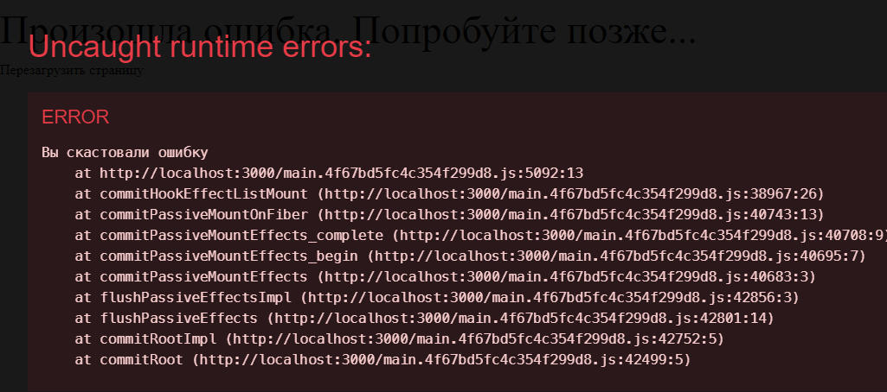
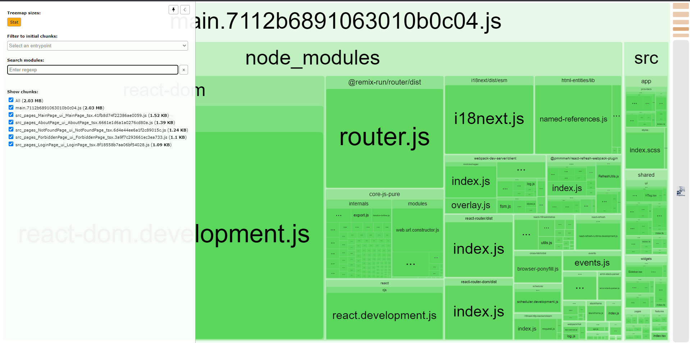
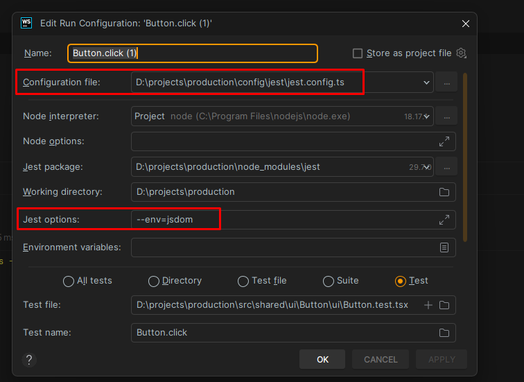
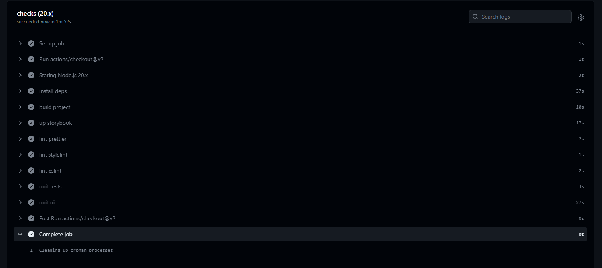
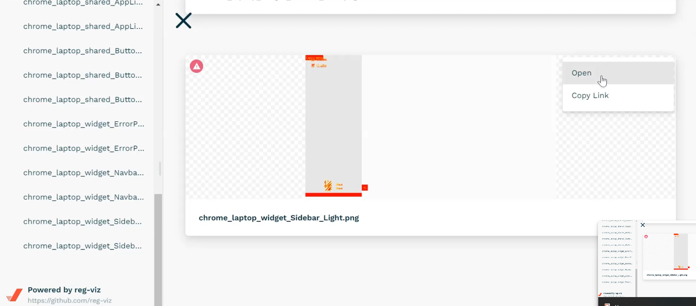

---
tags:
    - '#ErrorBoundary'
    - '#BundleAnalyzer'
    - '#ReactTestingLibrary'
    - '#Storybook'
    - '#Loki'
    - '#CI'
    - '#Screenshot'
---

## 22 ErrorBoundary. Обработка React ошибок

В React обработка ошибок происходит за счёт классового компонента ErrorBoundary, который отображает экран ошибки при возникновении любой ошибки в приложении

Сам компонент выглядит следующим образом. Нужно сказать, что в `componentDidCatch` можно поместить отправку ошибок пользователя на сервер.

Так же нужно упомянуть, что при получении ошибки мы будем выводить заранее определённую страницу с ошибкой. Эту страницу с ошибкой нужно обернуть в `Suspense`

`src / app / providers / ErrorBoundary / ui / ErrorBoundary.tsx`

```TSX
import React, { ErrorInfo, ReactNode, Suspense } from 'react';
import { ErrorPage } from '@/widgets/ErrorPage';
import { Skeleton } from '@/widgets/Skeleton';

/* пропсы компонента */
interface ErrorBoundaryProps {
	children: ReactNode;
}

/* стейт компонента */
interface ErrorBoundaryState {
	hasError: boolean;
}

export class ErrorBoundary extends React.Component<ErrorBoundaryProps, ErrorBoundaryState> {
	constructor(props: ErrorBoundaryProps) {
		super(props);
		this.state = { hasError: false };
	}

	static getDerivedStateFromError(error: Error) {
		return { hasError: true };
	}

	componentDidCatch(error: Error, errorInfo: ErrorInfo) {
		/* todo реализовать сервис для логирования ошибок на странице */
		console.log(error, errorInfo);
	}

	render() {
		const { hasError } = this.state;
		const { children } = this.props;

		if (hasError) {
			return (
				<Suspense fallback={<Skeleton />}>
					<ErrorPage />
				</Suspense>
			);
		}

		return children;
	}
}
```

Далее так уже будет выглядеть страница с ошибкой

`src / widgets / ErrorPage / ui / ErrorPage.tsx`

```TSX
import React from 'react';
import styles from './ErrorPage.module.scss';
import { useTranslation } from 'react-i18next';
import { Button, HTag, HTagType } from '@/shared/ui';
import { TRANSLATIONS_API } from '@/shared/const';

export const ErrorPage = () => {
	const { t } = useTranslation(TRANSLATIONS_API.error.translate);

	const handleReloadPage = () => {
		location.reload();
	};

	return (
		<div className={styles.error}>
			<HTag tag={HTagType.H1}>{t(TRANSLATIONS_API.error.components.error_page_title)}</HTag>
			<Button onClick={handleReloadPage}>
				{t(TRANSLATIONS_API.error.components.error_page_button)}
			</Button>
		</div>
	);
};
```

И всё приложение так же нужно обернуть в `ErrorBoundary`

`src / index.tsx`

```TSX
root.render(
	<BrowserRouter>
		<ErrorBoundary>
			<ThemeProvider>
				<StrictMode>
					<Suspense fallback={<Skeleton />}>
						<App />
					</Suspense>
				</StrictMode>
			</ThemeProvider>
		</ErrorBoundary>
	</BrowserRouter>,
);
```

Ну и так же можно заранее реализовать компонент кнопки ошибки, который будет выводить нам кастомную ошибку на странице

`src / app / providers / ErrorBoundary / ui / ErrorButton.tsx`

```TSX
import React, { useEffect, useState } from 'react';
import { Button } from '@/shared/ui';
import { useTranslation } from 'react-i18next';
import { TRANSLATIONS_API } from '@/shared/const';

export const ErrorButton = () => {
	const { t } = useTranslation(TRANSLATIONS_API.error.translate);

	const [error, setError] = useState<boolean>(false);

	const handleCastError = () => setError((prevState) => !prevState);

	useEffect(() => {
		if (error) {
			throw new Error(t(TRANSLATIONS_API.error.components.error_bug_message));
		}
	}, [error]);

	return (
		<Button onClick={handleCastError}>{t(TRANSLATIONS_API.error.components.error_bug)}</Button>
	);
};
```



## 23 Анализ размера банда. BundleAnalyzer

Первым делом нужно установить зависимости

```bash
npm install --save-dev webpack-bundle-analyzer @types/webpack-bundle-analyzer
```

Далее нам нужно будет добавить плагин для анализа бандла в билд

`config / build / buildPlugins.ts`

```TS
import { BundleAnalyzerPlugin } from 'webpack-bundle-analyzer';

const plugins = [
    // то плагин, который будет показывать прогресс сборки
    new ProgressPlugin(),
    // это плагин, который будет добавлять самостоятельно скрипт в наш index.html
    new HTMLWebpackPlugin({
       // указываем путь до базового шаблона той вёрстки, которая нужна в нашем проекте
       template: paths.html,
    }),
    // этот плагин будет отвечать за отделение чанков с css от файлов JS
    new MiniCssExtractPlugin({
       filename: 'css/[name].[contenthash:8].css',
       chunkFilename: 'css/[name].[contenthash:8].css',
    }),
    // этот плагин позволяет прокидывать глобальные переменные в приложение
    new DefinePlugin({
       __IS_DEV__: JSON.stringify(isDev),
       __API__: JSON.stringify('https://' /* api_path */),
    }),
    /* данный плагин анализирует размеры собираемых пакетов */
	new BundleAnalyzerPlugin({
	    /*
	    * отключаем автоматические открытие анализатора
	    * он будет открываться по ссылке из терминала    * */
	    * openAnalyzer: false,
	}),
];
```



## 24 React Testing Library. Тесты на компоненты метка

Чтобы подготовить тесты в приложении, нужно установить следующие зависимости

```bash
npm install --save-dev
	jest
	@testing-library/react
	@testing-library/jest-dom
	@babel/preset-react
	identity-obj-proxy
	regenerator-runtime
```

Далее нам нужно создать такой сетап файл, который будет импортировать данные зависимости во все тесты

`config / jest / jest.setup.ts`

```TS
/* виртуальный дом, который будет собираться в тестах */
import '@testing-library/jest-dom';
/* рантайм для работы джеста с асинхронностью */
import 'regenerator-runtime/runtime';
```

И так же нужно реализовать заглушку, которая будет вставляться вместо svg изображений

`config / jest / jestEmptyComponent.tsx`

```TSX
import React from 'react';

const jestEmptyComponent = function () {
	return <div />;
};

export default jestEmptyComponent;
```

Собираем такой конфиг джеста:

`config / jest / jest.config.ts`

```TS
import type { Config } from 'jest';

const config: Config = {
    /* устанавливаем сюда глобальные переменные */
    globals: {
       __IS_DEV__: true,
       __API__: '/test/api',
       __PROJECT__: 'jest',
    },
    /* очищаем моковые данные */
    clearMocks: true,
    /*
     * корневая точка     * мы её настраиваем так как     * */    rootDir: '../../',
    modulePaths: ['<rootDir>src'],
    /* разворачиваемся в браузере */
    testEnvironment: 'jsdom',
    /* настройки для запуска тестов с ипользованием
     * - абсолютных импортов     * - стилей     * */    moduleNameMapper: {
       /* эта настройка нужна для поддержки абсолютных импортов */
       '^@/(.*)$': '<rootDir>/src/$1',
       '\\.s?css$': 'identity-obj-proxy',
       /* чтобы работали svg, их нужно заменить на моковый компонент */
       '\\.(svg|png|jpg)': '<rootDir>/config/jest/jestEmptyComponent.tsx',
    },
    moduleDirectories: ['node_modules', '<rootDir>/'],
    /* эту директорию не трогаем */
    coveragePathIgnorePatterns: ['\\\\node_modules\\\\'],
    /* доступные расширения файлов */
    moduleFileExtensions: ['js', 'jsx', 'ts', 'tsx', 'json', 'node'],
    /* регулярка, по которой находим файлы с тестами */
    testMatch: ['<rootDir>src/**/*(*.)@(spec|test).[tj]s?(x)'],
    /* тут мы определяем путь до файла с сетапмами джеста */
    setupFilesAfterEnv: ['<rootDir>config/jest/jest.setup.ts'],
    /* тут настроен репорт для проходок тестов */
    reporters: [
       'default',
       [
          'jest-html-reporters',
          {
             publicPath: '<rootDir>/reports/unit',
             filename: 'report.html',
             // openReport: true,
             inlineSource: true,
          },
       ],
    ],
};

export default config;
```

В тс конфиг добавляем путь до сетапа джеста, который будет прокидываться в джест-тесты. Вместе с сетапом нужно будет добавить и все остальные ts-файлы, так как в них не будут работать обычные неабсолютные импорты

`tsconfig.json`

```JSON
"include": [
	"./config/jest/setupTests.ts",
	"./src/**/*.ts",
	"./src/**/*.tsx"
],
```

В бейбел добавляем пресет для работы реакта в тестах

`babel.config.js`

```JS
module.exports = {
	presets: [
		'@babel/preset-env',
		'@babel/preset-typescript',
		['@babel/preset-react', { runtime: 'automatic' }],
	],
};
```

Ну и так же нужно отключить для определённых файлов правила. Конкретно тут стоит начать с того, что можно отключить правила тех же переводов для тестов

`.eslintrc.cjs`

```JS
overrides: [
	{
		'env': {
			'node': true,
		},
		'files': [
			'.eslintrc.{js,cjs}',
			'**/src/**/*.test.{ts,tsx}',
		],
		'parserOptions': {
			'sourceType': 'script',
		},
		rules: {
			'i18next/no-literal-string': 'off',
		},
	},
],
```

Далее нужно написать конфиг `i18n` для тестов

`src / shared / config / i18n / i18n.tests.ts`

```TS
import i18n from 'i18next';
import { initReactI18next } from 'react-i18next';

i18n.use(initReactI18next).init({
	lng: 'ru',
	fallbackLng: 'ru',
	debug: false,
	resources: { ru: { translations: {} } },
});

export default i18n;
```

Далее подготовим хелпер-провайдер, в который будем оборачивать компоненты для тестирования. Этот хелпер уже будет иметь моковый браузер-роутер, редакс-стейт, провайдер переводов и темы

`src / shared / lib / tests / testRenderComponent.tsx`

```TSX
import { ReducersMapObject } from '@reduxjs/toolkit';
import { render } from '@testing-library/react';
import React, { ReactNode } from 'react';
import { I18nextProvider } from 'react-i18next';
import { MemoryRouter } from 'react-router-dom';
import { StoreProvider } from '@/app/providers/StoreProvider';
import { Theme, ThemeProvider } from '@/app/providers/ThemeProvider';
import i18n from '../../config/i18n/i18n.tests';
import { IDivAttributes } from '../types/baseProps.type';
import { StateSchema } from '../types/state.schema';

/** необязательные опции, которые нужны для запуска провайдеров тестов */
export interface IRenderOptions {
    route: string;
    initialState: DeepPartial<StateSchema>;
    asyncReducers: DeepPartial<ReducersMapObject<StateSchema>>;
    theme: Theme;
}

export interface ITestRenderProviderProps extends IDivAttributes, DeepPartial<IRenderOptions> {}

/** провайдер для рендера компонентов из тестов */
export const TestRenderProvider = ({
    children,
    route = '/',
    theme = Theme.LIGHT,
    asyncReducers,
    initialState,
}: ITestRenderProviderProps) => {
    return (
       <MemoryRouter initialEntries={[route]}>
          <StoreProvider initialState={initialState} asyncReducers={asyncReducers}>
             <I18nextProvider i18n={i18n}>
                <ThemeProvider initialTheme={theme}>{children}</ThemeProvider>
             </I18nextProvider>
          </StoreProvider>
       </MemoryRouter>
    );
};

/** функция рендера компонентов тестов */
export function testComponent(component: ReactNode, options?: IRenderOptions) {
    return render(<TestRenderProvider {...options}>{component}</TestRenderProvider>);
}
```

Для тестирования самих компонентов нужно будет им навесить `data-testid` атрибуты

```TSX
export const Sidebar = ({ className }: ISidebarProps) => {
	const { t } = useTranslation('ui');
	const [collapsed, setCollapsed] = useState<boolean>(false);

	const onToggle = () => setCollapsed((prev) => !prev);

	return (
		<div
			data-testid={'sidebar'}
			className={cn(styles.sidebar, className, { [styles.collapsed]: collapsed })}
		>
			<button data-testid={'sidebar-toggle'} onClick={onToggle}>
				{t('toggle')}
			</button>
			<div className={styles.switchers}>
				<ThemeSwitcher />
				<LanguageSwitcher />
			</div>
		</div>
	);
};
```

И пишем самый простой тест для проверки работы тестов

`src / shared / ui / Button / ui / Button.test.tsx`

```TSX
import { render, screen } from '@testing-library/react';
import { Button, EButtonType } from '@/shared/ui';

describe('Button', () => {
    test('button text', () => {
       render(<Button>TEST</Button>);
       expect(screen.getByText('TEST')).toBeInTheDocument();
    });

    test('button classname', () => {
       render(<Button appearance={EButtonType.PRIMARY}>TEST</Button>);
       expect(screen.getByText('TEST')).toHaveClass('button appearance__primary size__m');
    });
});
```

И вот так уже выглядит сам тестовый сьют, который включает в себя обёртку для приложений с переводами, браузером, редаксом и остальными провайдерами

`src / widgets / Sidebar / ui / Sidebar.test.tsx`

```TSX
import { fireEvent, screen } from '@testing-library/react';
import { Sidebar } from '@/widgets/Sidebar';
import { testComponent } from '@/shared/lib';

describe('Sidebar', () => {
    /** проверяем, отрендерен ли сайдбар */
    test('render sidebar', () => {
       /* компоненты, которые используют перевод нужно обернуть в хок withTranslation или обернуть в провайдер, как тут */
       testComponent(<Sidebar />);
       expect(screen.getByTestId('sidebar')).toBeInTheDocument();
    });

    /** проверяем, свёрнут ли сайдбар */
    test('toggle sidebar', () => {
       testComponent(<Sidebar />);
       const toggleBtn = screen.getByTestId('sidebar-toggle');
       const sidebar = screen.getByTestId('sidebar');
       fireEvent.click(toggleBtn);
       expect(sidebar).toHaveClass('collapsed');
    });
});
```

> [!note] Так же нужно упомянуть, чтобы тесты прогонялись внутри вебшторма, нужно так же настроить его раннер тестов
> 

## 25 Настраиваем Storybook. Декораторы. Стори кейсы на компоненты

Мы можем вручную установить множество пакетов

```bash
npm i
	@storybook/addon-actions
	@storybook/addon-essentials
	@storybook/addon-interactions
	@storybook/addon-links
	@storybook/react
	@storybook/react-webpack5
	@storybook/testing-library
	storybook-addon-mock
	storybook-addon-themes
```

Или просто запустить установщик:

```bash
npx sb init --builder webpack5
```

Если у нас уже в проекте есть старый сторибук, то можно будет запустить данную команду и сторибук обновится

```bash
npx storybook@next automigrate
```

Далее нам нужно будет сконфигурировать

`config / storybook / main.ts`

```TS
import { Configuration, DefinePlugin, RuleSetRule } from 'webpack';
import path from 'path';
import { buildStyleLoader } from '../build/loader/style.loader';
import { buildFileLoader } from '../build/loader/file.loader';

/*
 * конфиг был прогнан через команду:
 * npx storybook@next automigrate
 * */
const config = {
	stories: ['../../src/**/*.stories.@(js|jsx|ts|tsx)'],
	addons: [
		'@storybook/addon-links',
		'@storybook/addon-essentials',
		'@storybook/addon-interactions',
		'storybook-addon-mock',
		'storybook-addon-themes',
	],
	framework: {
		name: '@storybook/react-webpack5',
		options: {},
	},
	core: {},
	docs: {
		autodocs: true,
	},
	webpackFinal: async (config: Configuration) => {
		const paths = {
			build: '',
			html: '',
			entry: '',
			src: path.resolve(__dirname, '..', '..', 'src'),
			locales: '',
			buildLocales: '',
		};
		config!.resolve!.modules!.push(paths.src);
		config!.resolve!.extensions!.push('.ts', '.tsx');
		config!.resolve!.alias = {
			...config!.resolve!.alias,
			'@': paths.src,
		};

		/* если в каком-либо правиле есть svg, то мы вернём старый объект и заэксклюдим svg в правиле */
		config!.module!.rules = config!.module!.rules!.map(
			// @ts-ignore
			(rule: RuleSetRule) => {
				if (/svg/.test(rule.test as string)) {
					return { ...rule, exclude: /\.svg$/i };
				}

				return rule;
			},
		);

		config!.module!.rules.push(buildStyleLoader(true));
		config!.module!.rules.push(buildFileLoader());

		config!.plugins!.push(
			new DefinePlugin({
				__IS_DEV__: JSON.stringify(true),
				__API__: JSON.stringify('https://testapi.ru'),
				__PROJECT__: JSON.stringify('storybook'),
			}),
		);

		return config;
	},
};

export default config;
```

Далее нам нужно написать декораторы, которые будут обогащать наши вложенные компоненты сторибука

`src / shared / lib / storybook / decorators / Router.decorator.tsx`

```TSX
import { StoryFn } from '@storybook/react';
import { BrowserRouter } from 'react-router-dom';

export const withRouterDecorator = (StoryComponent: StoryFn) => (
	<BrowserRouter>
		<StoryComponent />
	</BrowserRouter>
);
```

`src / shared / lib / storybook / decorators / Style.decorator.tsx`

```TSX
import { StoryFn } from '@storybook/react';
import '../../../../app/styles/index.scss';

export const withStyleDecorator = (Story: StoryFn) => <Story />;
```

`src / shared / lib / storybook / decorators / Suspense.decorator.tsx`

```TSX
import { StoryFn } from '@storybook/react';
import { Suspense } from 'react';

export const withSuspenseDecorator = (StoryComponent: StoryFn) => (
    <Suspense>
       <StoryComponent />
    </Suspense>
);
```

`src / shared / lib / storybook / decorators / Theme.decorator.tsx`

```TSX
import { StoryFn } from '@storybook/react';
import { Theme, ThemeProvider } from '../../../../app/providers/ThemeProvider';

export const withThemeDecorator = (theme: Theme) => (StoryComponent: StoryFn) => (
    <ThemeProvider>
       <div className={`app ${theme}`}>
          <StoryComponent />
       </div>
    </ThemeProvider>
);
```

Так же мы можем настроить то превью, которое будет находиться у нас во вьюпорту при отображении компонента

`config / storybook / preview.tsx`

```TS
import { Theme } from '../../src/app/providers/ThemeProvider';
import {
	withRouterDecorator,
	withStyleDecorator,
	withSuspenseDecorator,
	withThemeDecorator,
} from '../../src/shared/lib';

export const parameters = {
	actions: { argTypesRegex: '^on[A-Z].*' },
	controls: {
		matchers: {
			color: /(background|color)$/i,
			date: /Date$/,
		},
	},
	layout: 'centered',
	themes: {
		default: Theme.LIGHT,
		list: [
			{ name: Theme.LIGHT, class: Theme.LIGHT, color: '#aeaeae' },
			{ name: Theme.DARK, class: Theme.DARK, color: '#2a2a2a' },
		],
	},
	/* сюда вставляем декораторы */
	decorators: [
		withStyleDecorator,
		withSuspenseDecorator,
		withRouterDecorator,
		withThemeDecorator(Theme.DARK),
	],
};
```

И так же можно написать общий декоратор, в который можно обернуть отдельные компоненты

`src / shared / lib / storybook / withDecorators.tsx`

```TSX
import { StoryFn } from '@storybook/react';
import { BrowserRouter } from 'react-router-dom';
import React, { Suspense } from 'react';
import { Theme, ThemeProvider } from '@/app/providers/ThemeProvider';

export const withDecorators =
    (theme: Theme = Theme.LIGHT) =>
    (StoryComponent: StoryFn) => (
       <BrowserRouter>
          <Suspense>
             <ThemeProvider>
                <div className={`app ${theme}`}>
                   <StoryComponent />
                </div>
             </ThemeProvider>
          </Suspense>
       </BrowserRouter>
    );
```

И далее нам нужно будет написать сторис-кейсы, которые будут отображать наши компоненты

`src / shared / ui / Button / ui / Button.stories.ts`

```TSX
import { Meta, StoryObj } from '@storybook/react';
import { Button } from './Button';
import { EButtonType } from '../model';
import { withDecorators } from '@/shared/lib';
import { Theme } from '@/app/providers/ThemeProvider';

const meta: Meta<typeof Button> = {
    title: 'Components/UI/Button',
    component: Button,
    /* а сюда уже можно будет добавить декораторы */
    decorators: [withDecorators(Theme.LIGHT)],
};
export default meta;

type Story = StoryObj<typeof Button>;

export const Primary: Story = {
    render: (args) => <Button {...args} />,
    args: {
       children: 'Кнопка основная',
       appearance: EButtonType.PRIMARY,
    },
};
```

Так же стоит упомянуть, что стоит оставлять JSDoc комментарии для компонента и его пропсов

`src / shared / ui / Button / ui / Button.tsx`

```TSX
/** Основная кнопка приложения */
export const Button: FC<IButtonProps> = ({
    className,
    children,
    appearance = EButtonType.PRIMARY,
    size = 'm',
    ...props
}: IButtonProps) => {
    return (
       <button
          className={cn(
             styles.button,
             className,
             styles[`appearance__${appearance}`],
             styles[`size__${size}`],
          )}
          {...props}
       >          {children}
       </button>
    );
};
```

`src / shared / ui / Button / ui / Button.props.ts`

```TSX
import { EButtonType } from '../model';
import { ButtonProps } from '@/shared/lib';

export interface IButtonProps extends ButtonProps {
    /** Тема кнопки */
    appearance?: EButtonType;
    /** Размер кнопки */
    size: 's' | 'm' | 'l';
}
```

И далее запускаем сторибук данными командами

`package.json`

```JSON
"storybook": "storybook dev -p 6006 -c ./config/storybook"
"storybook:build": "storybook build -c ./config/storybook"
```

## 26 Скриншотные тесты. Loki. Регрессионное UI тестирование

Первым делом нужно установить локи и указать ему путь до сторибука

```bash
npm i -D loki
npx loki init --config ./config/storybook/
```

После чего в пакейдже появится такая конфигурация

`package.json`

```JSON
"loki": {
    "configurations": {
       "chrome.laptop": {
          "target": "chrome.docker",
          "width": 1366,
          "height": 768,
          "deviceScaleFactor": 1,
          "mobile": false
       },
       "chrome.iphone7": {
          "target": "chrome.docker",
          "preset": "iPhone 7"
       }
    }
}
```

Сразу забиндим старт тестов и аппрув изменний в тестировании (первая команда прогонит тексты, а вторая подтвердит, что все отличия нам подходят в проекте нам подходят)

`package.json`

```JSON
"test:ui": "npx loki test",
"test:ui:ok": "npx loki approve",
```

Далее нужно запустить сторибук (на основе которого и будут прогоняться скриншот-тесты локи) и докер (в котором поднимется браузер), и можно будет стартануть локи-тексты

```bash
npm run storybook
npm run test:ui
```

Теперь в папке `current` будут находиться скриншоты того ui, который мы прогнали в первый раз. Если ui изменится в каком-либо компоненте, то тест упадёт с ошибкой в определённом компоненте и скриншоты изменений попадут в папку `differences`.

## 27 CI pipeline. Автоматизация прогона тестов метка

Перед тем, как сделать коммит, нам нужно прогнать нужные проверки на нашем компьютере и для этого нужно будет husky

```bash
npm i -D husky
```

Далее нужно добавить две команды:

- Установка хаски для триггера перед коммитом
- Запуск локи на статичном билде сторибука

`package.json`

```JSON
"prepare": "husky install",
"test:ui:ci": "npx loki --requireReference --reactUri file:./storybook-static",
```

Далее нужно будет в хаски добавить линтеры, которые будут прогоняться перед коммитом

`.husky / pre-commit`

```bash
#!/usr/bin/env sh
. "$(dirname -- "$0")/_/husky.sh"

npm run lint:fix:all
npm run test:unit
npm run storybook:build
npm run test:ui:ci
```

И далее нужно будет добавить Github Actions, которые уже будут прогоняться на серверах гитхаба.
Тут нужно будет сделать джоб `checks`, который будет выполнять определённую последовательность действий.

Так как для работы локи нужно поднять сторибук, то перед запуском CI Loki, нужно будет сбилдить сторибук

Так же нужно будет прописать условие `if: always()`, которое заставит прогонять полностью все тесты даже тогда, когда у нас что-то в последовательности упало

`.github / workflows / main.yml`

```YML
name: building project

on:
  push:
    branches: [ main ]
  pull_request:
    branches: [ main ]

jobs:
  # Джоб проверки проекта
  checks:
    runs-on: ubuntu-latest
    strategy:
      matrix:
        node-version: [ 20.x ]
    steps:
      - uses: actions/checkout@v2
      - name: Staring Node.js ${{ matrix.node-version }}
        uses: actions/setup-node@v1
        with:
          node-version: ${{ matrix.node-version }}
      - name: install deps
        run: npm i
      - name: build project
        run: npm run build:prod
      - name: up storybook
        run: npm run storybook:build
        if: always()
      - name: lint stylelint
        run: npm run lint:stylelint:fix
        if: always()
      - name: lint eslint
        run: npm run lint:eslint:fix
        if: always()
      - name: unit tests
        run: npm run test:unit
        if: always()
      - name: unit ui
        run: npm run test:ui:ci
        if: always()
```



## 28 UI Screenshot test report

Первым делом нам нужно установить пакет, который генерирует сайт из json

```bash
npm i -D reg-cli
```

Далее нам нужно будет триггерить скрипт, который соберёт все локи скриншоты в json-файл. А уже тот собранный `json` будет переведён через `reg-cli` в `index.html`, который уже и можно будет открыть в браузере

`scripts / generate-visual-json-report.js`

```JS
const { readdir, writeFile } = require('fs');
const { join: joinPath, relative } = require('path');
const { promisify } = require('util');

const asyncReaddir = promisify(readdir);
const writeFileAsync = promisify(writeFile);

/** путь до локи скришотов */
const lokiDir = joinPath(__dirname, '..', '.loki');
/** текущие скришоты */
const actualDir = joinPath(lokiDir, 'current');
/** референсы скришотов */
const expectedDir = joinPath(lokiDir, 'reference');
/** отличия между скриншотами */
const diffDir = joinPath(lokiDir, 'difference');

(async function main() {
    const diffs = await asyncReaddir(diffDir);

    await writeFileAsync(
       joinPath(lokiDir, 'report.json'),
       JSON.stringify({
          newItems: [],
          deletedItems: [],
          passedItems: [],
          failedItems: diffs,
          expectedItems: diffs,
          actualItems: diffs,
          diffItems: diffs,
          actualDir: relative(lokiDir, actualDir),
          expectedDir: relative(lokiDir, expectedDir),
          diffDir: relative(lokiDir, diffDir),
       }),
    );
})();
```

Далее нам нужно будет собрать `test:ui:report` репорт по тестам локи

`package.json`

```JSON
"test:ui": "npx loki test",
"test:ui:approve": "npx loki approve",
"test:ui:ci": "npx loki --requireReference --reactUri file:./storybook-static",
"test:ui:json": "node scripts/generate-visual-json-report.js",
"test:ui:html": "reg-cli --from .loki/report.json --report .loki/report.html",
"test:ui:report": "npm run test:ui:json && npm run test:ui:html",
```


