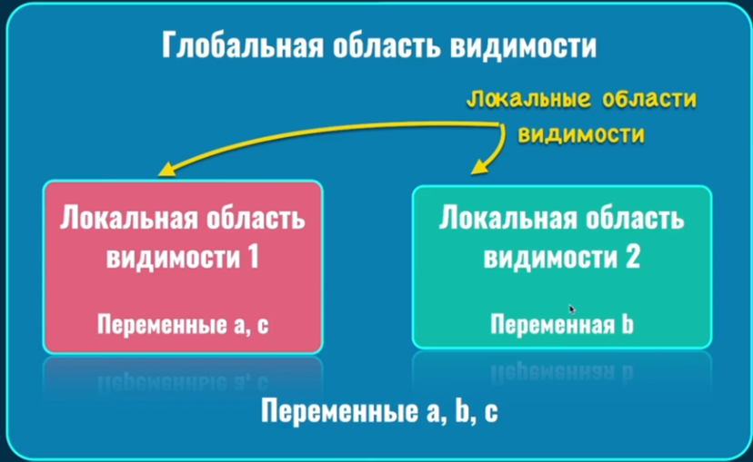
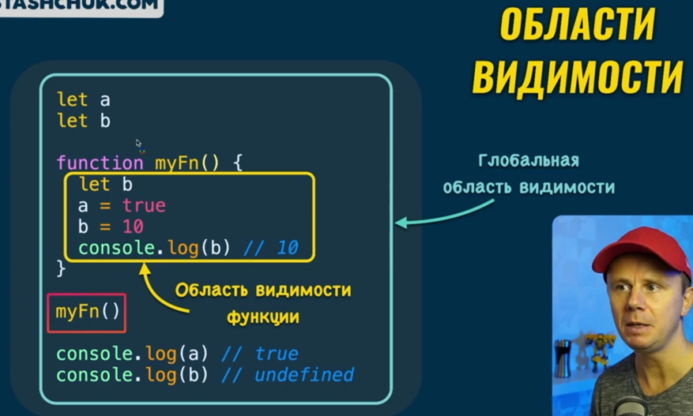
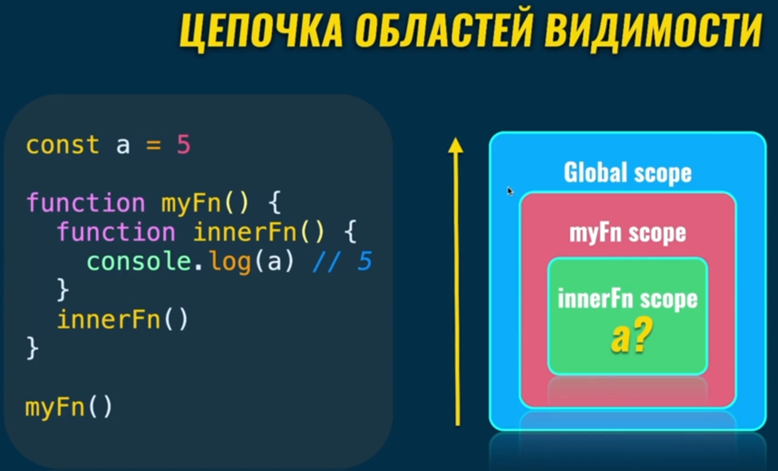
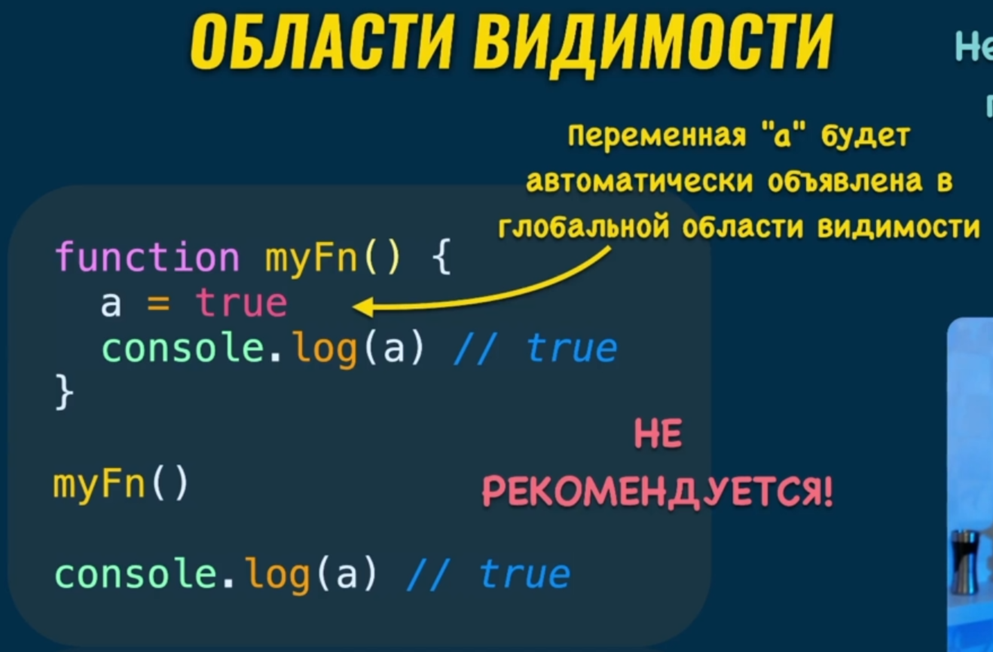
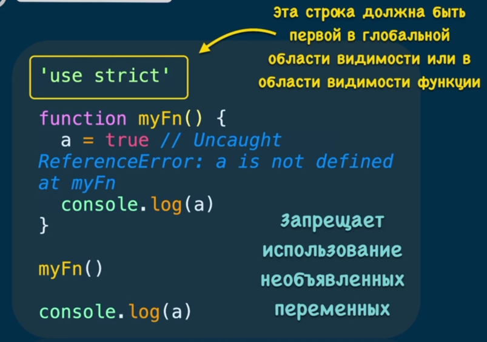

### 001 Области видимости

Определяет область действия переменной

То есть, что здесь происходит:

В глобальной области видимости мы создаём две переменные: a и b. Внутри функции мы создаём **только переменную b**. Присваиваем обоим переменным значения. Внутри функции мы обращаемся к внутренней переменной **b**, так как мы создали её и она имеется внутри. А уже при обращении к переменной **a**, мы связываемся с переменной, которая обозначена за функцией, так как внутри функции этой переменной нет. Как итог, мы поменяли значение глобальной переменной **a**, так как её нет в функции и локальной **b** (так как мы обозначили её внутри)

### 002 Цепочка областей видимости

Если описывать кратко, то в данном случае, при выполнении каждой внутренней функции, JS проверял наличие переменной в его области видимости. Сначала поиск переменной шёл внутри `innerFn`, потом внутри `myFn` и потом уже в глобальной области видимости

Так же если написать `innerFn` вне `myFn`, то выйдет ошибка, потому что внутренняя функция существует только внутри области видимости нашей внешней функции.

И так же наша внешняя функция вернёт нам `undefined` (так как отсутствует инструкция `return`)

### 003 Жизненный цикл переменных

Представление и сравнение жизненного цикла переменных «a» и «b». Тут нужно отметить, что внутри области видимости переменная имеет приоритет над переменной во внешней области видимости. Это так же может приносить проблемы разработчикам и поэтому внутри функций стоит всегда создавать новые переменные, чтобы не менять значения во внешней области видимости

### 004 Типы областей видимости

Есть три области видимости: глобальная, внутри функции, внутри блока (например, внутри функций, циклов и так далее)

И тут встаёт такая проблема: если мы не объявили переменную до её использования внутри внутренней области видимости, то эта переменная автоматически создастся

Однако нужно соблюдать основные правила работы с переменными

### 005 Строгий режим

Строгий режим следит более строго за надлежащим написанием кода в JS. Этот режим не позволит создать переменную без её объявления. Такую строку вставляют либо в начало кода, либо непосредственно в функцию, где нужно соблюдать осторожность

