### 001 Циклы

Циклы в первую очередь позволяют автоматизировать повторяющиеся действия

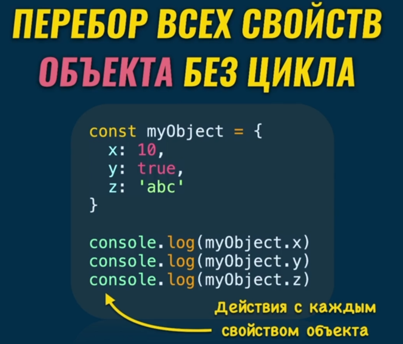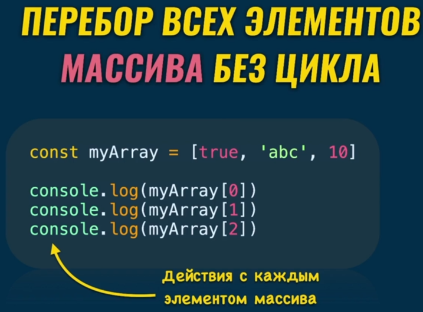
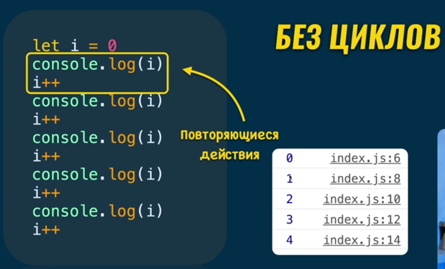

Циклы – это инструкции. В JS имеется 5 основных видов циклов

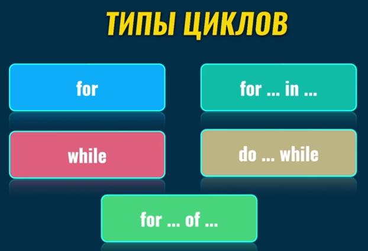

### 002 Цикл for

Синтаксис инструкции цикла `for()`

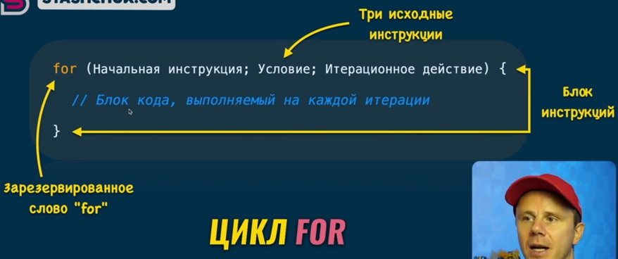

Первое значение массива инициализирует переменную, которая должна отвечать за счёт итераций. Второе значение определяет условие, когда цикл закончится. Третья операция определяет изменение счётчика после каждой итерации

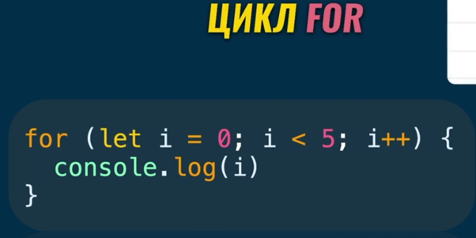

### 003 Для перебора массивов не нужен for

В отличие от других языков, нам не рекомендуется использовать цикл `for()` для перебора массива

Пример перебора массива с помощью цикла `for()`

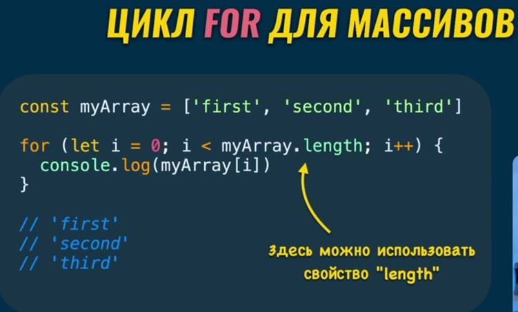

А вот пример перебора массива с помощью функции высшего порядка (встроенной в прототип объекта массива). `forEach()` позволяет просто перебрать элементы массива и сразу предоставляет доступ как к самим элементам, так и к индексам

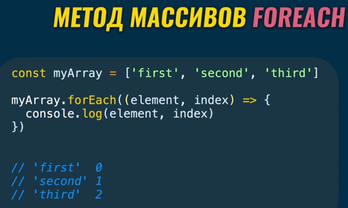
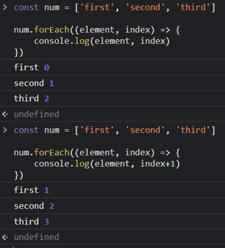

### 004 Цикл `while`

Выполняет цикл столько раз, пока условие `true` (самый простой способ создать бесконечный цикл)

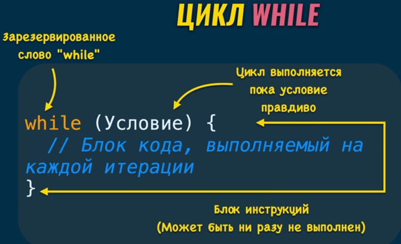

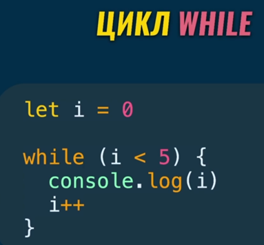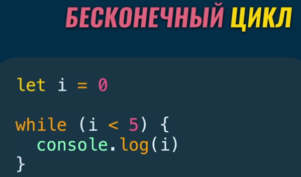

### 005 Цикл `do while`

Данный цикл выполняет вложенный в него блок кода хотя бы один раз и уже потом проверит значение

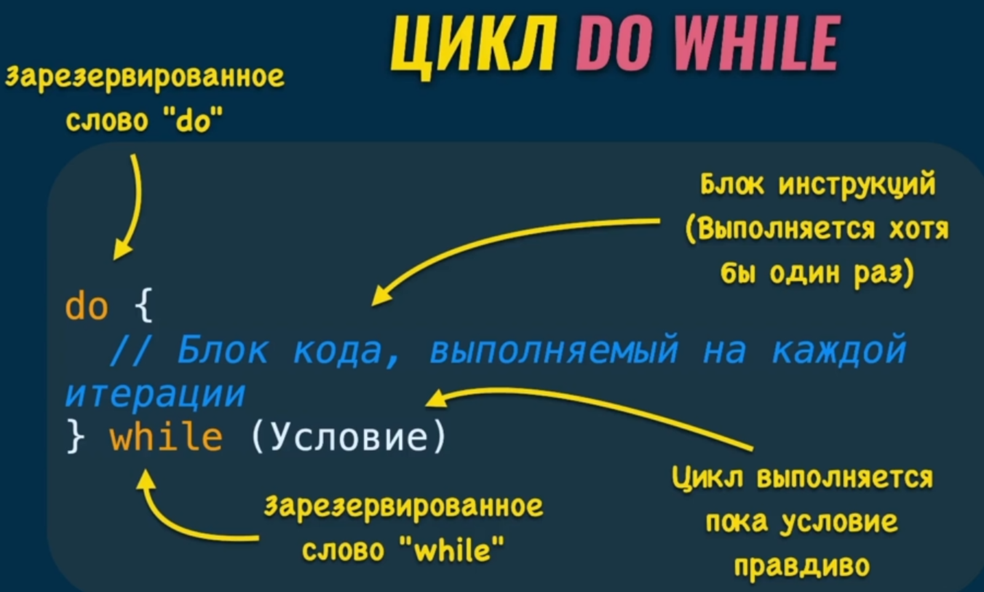

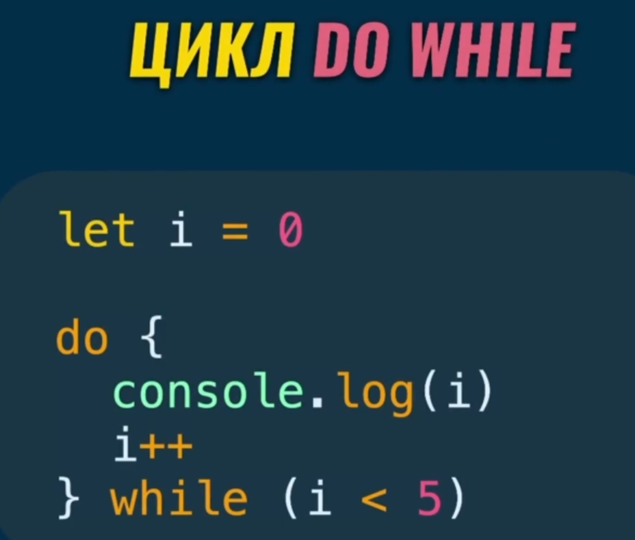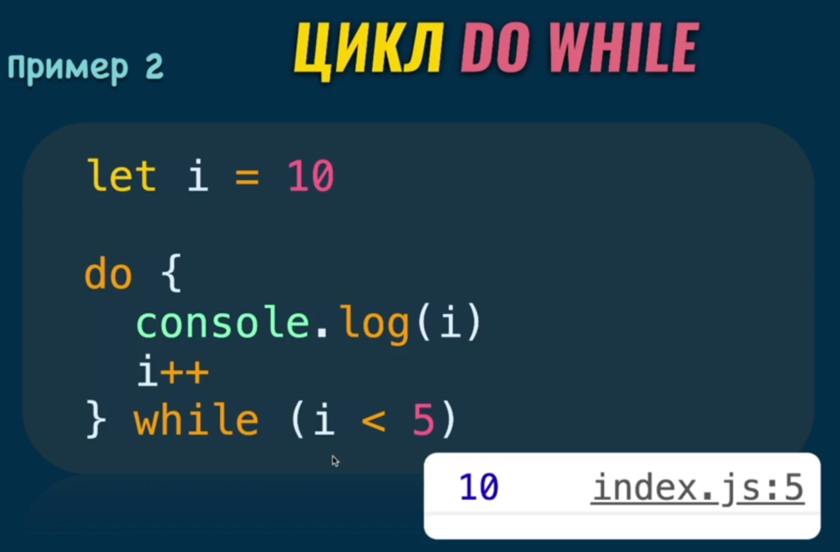

### 006 Цикл `for in`

Данный цикл выполняет итерацию действий для каждого отдельного элемента объекта (свойства объекта, элемента массива)

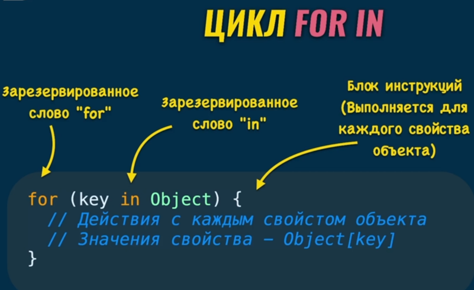

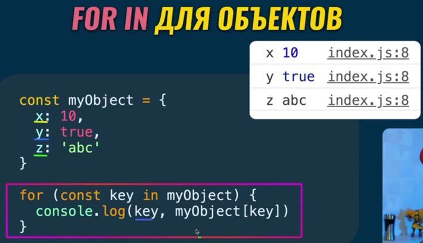

### 007 Методы `keys` и `values` для объектов

Так же `forEach()` можно использовать и для объектов. Чтобы воспользоваться данной функцией, нужно привести свойства к виду массива через `Object.keys(myObject)`. И дальше мы уже будем использовать обращение к колбэк функции к индексу (`key`) и свойству в объекте (`myObject[key]`)

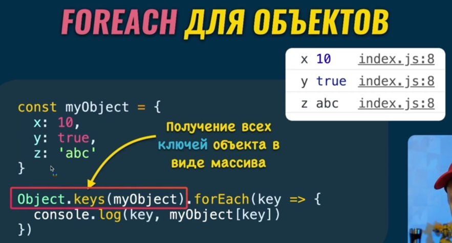

Так же можно перебирать сразу значения объекта (`values`)

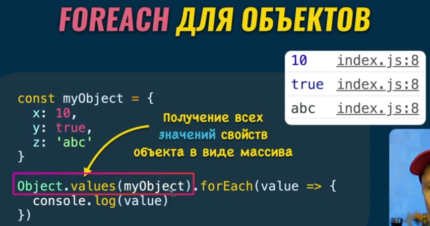

И тут мы видим, что возвращают данные методы (`{}` обозначает под собой создание объекта, поэтому можно вписать его прямо внутрь данного метода)

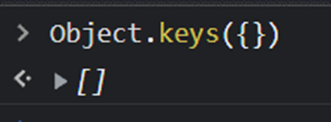
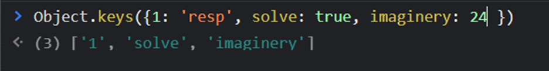
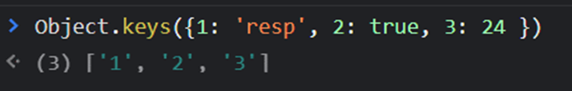
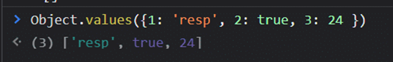

### 008 Цикл `for in` для массивов

Данная конструкция позволяет сделать то же самое, что и `forEach`, но в другом синтаксисе. Не рекомендуется её использовать при переборе массивов (потому как лучше использовать её для объектов)

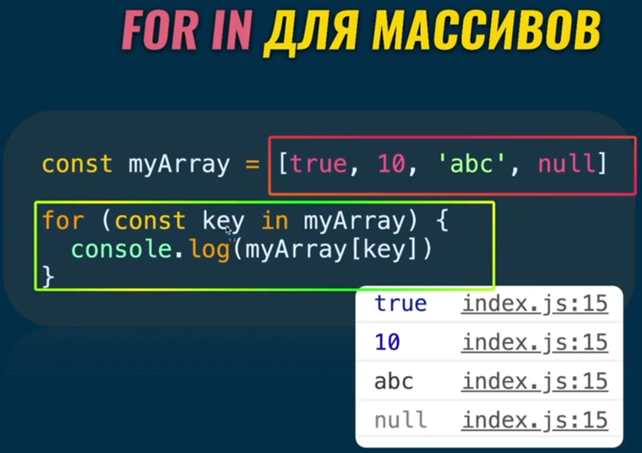

### 009 Цикл `for of`

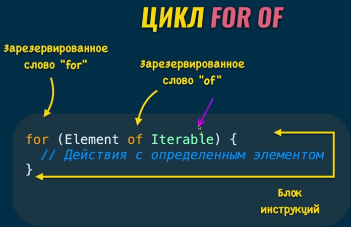

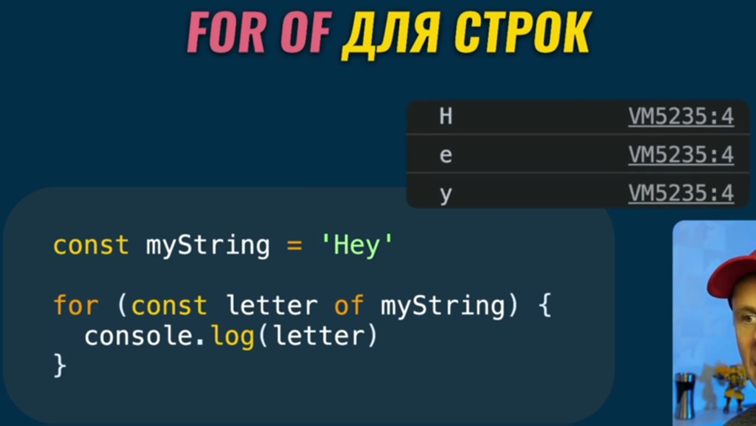

Метод перебора с `forEach` наиболее приоритетный и использовать стоит его

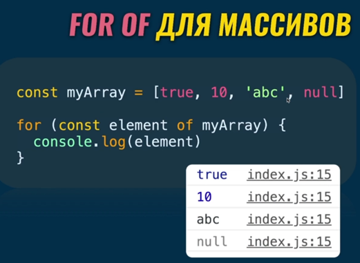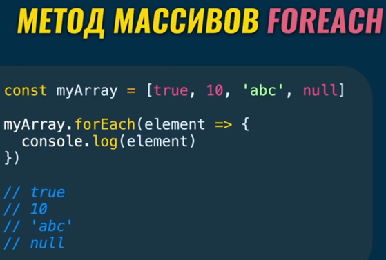

Но `for-of` нельзя использовать для объектов. Дело в том, что в объектах порядок свойств не важен, поэтому данный цикл не поймёт, как итерировать данный тип

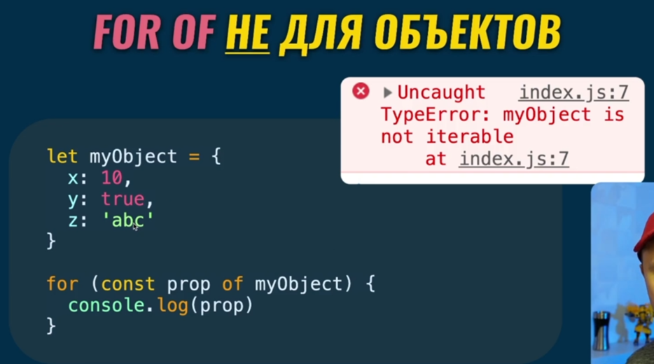
