## 001 Шрифты и цвета

Создаём какой-нибудь контент на странице 

`index.tsx`
```TSX
export default function Home(): JSX.Element {
	return (
		<div>
			<p> Какой-то текст </p>
		</div>
	);
}
```

Подключаем шрифты в наше приложение через основную страницу

`_app.tsx`
```TSX
import '../styles/globals.css';
import type { AppProps } from 'next/app';
import React from 'react';
import Head from 'next/head';

export default function App({ Component, pageProps }: AppProps): JSX.Element {
	return (
		<>
			<Head>
				<title>Second Page</title>
				<link key={2} rel="icon" href="/favicon2.ico" />

				{/* подключем шрифты из гугла */}

				<link rel="preconnect" href="https://fonts.googleapis.com" />
				<link rel="preconnect" href="https://fonts.gstatic.com" />
				<link
					href="https://fonts.googleapis.com/css2?family=Noto+Sans:wght@300;400;500;700&display=swap"
					rel="stylesheet"
				/>
			</Head>
			<Component {...pageProps} />
		</>
	);
}
```

И тут уже создаём переменные в нашем базовом ==CSS== и через `var()` эти переменные используем

`global.css`
```CSS
/* тут мы будем хранить все переменные*/
:root {
	--black: #3b434e;
	--white: #ebebeb;
	--background: #f5f6f8;
	--primary: #7653fc;
	--red: #fc836d;
	--green: #1dc37e;
	--light-green: #c8f8e4;
	--font-family: "Noto Sans", sans-serif;
}

html,
body {
	padding: 0;
	margin: 0;
	/* используем кастомный цвет */
	color: var(--black);
	background: var(--background);

	/* меняем шрифт */
	font-family: var(--font-family);
}

a {
	color: inherit;
	text-decoration: none;
}

* {
	box-sizing: border-box;
}
```

## 002 Первый компонент

==Компонент== - это функция, которая на вход в себя принимает какие-либо параметры (пропсы, дефолтные пропсы или не принимает ничего вообще) и возвращает на выходе JSX-элемент

- Компоненты кидаем в отдельную папку `components` в корне проекта
- Под каждый компонент создаём отдельную папку
- Стили стоит выносить внутри документа таким образом: `имя_модуля.module.css`
- Так же стоит отдельно выносить пропсы: `имя_модуля.props.ts`

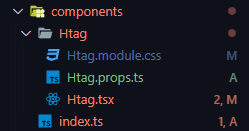

Заранее определим, какой компонент нам нужен:
- Он должен генерировать в зависимости от значения пропса `tag` определённый тег от `h1` до `h3`
- Он должен выводить вложенное внутрь него значение

И первым делом, мы определим интерфейс передаваемых пропсов в наш компонент. Он на вход получает `tag` от `h1` до `h6` (с запасом). 
Для данных, которые вкладываются между тегами (то есть, в нашем случае, выводимый на страницу текст) в `React` предусмотрен тип `ReactNode`, который типизирует `children` элемент

`components > Htag > Htag.props.ts`
```TS
import { ReactNode } from 'react';

export interface IHtagProps {
	tag: 'h1' | 'h2' | 'h3' | 'h4' | 'h5' | 'h6';
	children: ReactNode;
}
```

Далее нужно заранее установить `sass`

```bash
npm i sass
```

Пропишем заранее стили для разных тегов текста на странице. Так как тут будет использоваться модульная система стилей, то нужно будет после названия стилей прописать `.module`, который определит файл стилей как модульные стили 

`components > Htag > Htag.module.scss`
```SCSS
.h1 {
	margin: 0;
	font-weight: 500;
	font-size: 26px;
	line-height: 35px;
}

.h2 {
	margin: 0;
	font-weight: 500;
	font-size: 22px;
	line-height: 30px;
}

.h3 {
	margin: 0;
	font-weight: 600;
	font-size: 20px;
	line-height: 27px;
}
```

Далее мы пишем сам компонент оглавления `Htag`, который в себя принимает пропсы по интерфейсу. 
Первый вариант рендера нужного нам тега: прописать отдельно условия для каждого рендера

`components > Htag > Htag.tsx`
```TSX
import { IHtagProps } from './Htag.props';
import styles from './Htag.module.scss';

export const Htag = ({ tag, children }: IHtagProps): JSX.Element => {
	return (
		<>
			{tag == 'h1' && <h1>{children}</h1>}
			{tag == 'h2' && <h2>{children}</h2>}
			{tag == 'h3' && <h3>{children}</h3>}
		</>
	);
};
```

Ну и второй вариант через `switch-case`. Его преймущество заключается в том, что он проще читается.

Так же для использования стилей из отдельного файла используется модульная система, что позволяет обратиться к стилям в удобном формате `имя_импорта.имя_класса` => `styles.h1`

`Htag.tsx`
```TSX
import { IHtagProps } from './Htag.props';
import styles from './Htag.module.scss';

export const Htag = ({ tag, children }: IHtagProps): JSX.Element => {
	switch (tag) {
		case 'h1':
			return <h1 className={styles.h1}>{children}</h1>;
		case 'h2':
			return <h2 className={styles.h2}>{children}</h2>;
		case 'h3':
			return <h3 className={styles.h3}>{children}</h3>;
		default:
			return <></>;
	}
};
```

Далее идёт очень важный трюк: мы можем экспортировать внутри `index.ts` компоненты, чтобы сократить путь для доступа к ним из других компонентов

`components > index.ts`
```TS
export * from './Htag/Htag';
```

И вот так выглядит сам импорт элемента на основной странице и  его использование

`pages > index.tsx`
```TSX
import { Htag } from '../components';

export default function Home(): JSX.Element {
	return (
		<>
			<Htag tag="h1">Какой-то текст</Htag>
		</>
	);
}
```

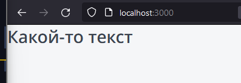

## 003 Update - Библиотека classnames

Установка

```bash
npm i classnames
```

Импорт

```js
import cn from 'classnames';
```

Использование: 
Данный модуль позволяет по условию подключать классы к нужным нам объектам

```JS
cn('foo', 'bar'); // => 'foo bar'
cn('foo', { bar: true }); // => 'foo bar'
cn({ 'foo-bar': true }); // => 'foo-bar'
cn({ 'foo-bar': false }); // => ''
cn({ foo: true }, { bar: true }); // => 'foo bar'
cn({ foo: true, bar: true }); // => 'foo bar'

// lots of arguments of various types
cn('foo', { bar: true, duck: false }, 'baz', { quux: true }); // => 'foo bar baz quux'

// other falsy values are just ignored
cn(null, false, 'bar', undefined, 0, 1, { baz: null }, ''); // => 'bar 1'
```

## 004 Classnames

Структура:

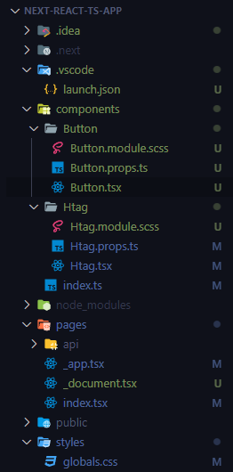

Первым делом добавим несколько переменных стилей внутрь глобального `CSS`

`global.css`
```CSS
:root {
	--black: #3b434e;
	--white: #ebebeb;
	--gray-light: #ebebeb;
	--gray-light-hover: #c5c5c5;
	--gray-light-active: #8f8f8f;
	--background: #f5f6f8;
	--primary: #7653fc;
	--primary-hover: #5c37ee;
	--primary-active: #3d24a1;
	--red: #fc836d;
	--green: #1dc37e;
	--light-green: #c8f8e4;
	--font-family: 'Noto Sans', sans-serif;
}
```

Далее реализуем модульные стили для отдельных видов кнопок

`components > Button > Button.module.scss`
```SCSS
.button {
	display: inline-block;

	box-sizing: border-box;
	padding: 10px;

	cursor: pointer;
	outline: none;
	text-align: center;
	border: none;
	border-radius: 5px;

	font-size: 14px;
	transition: all 0.1s;
}

.primary {
	color: var(--white);
	background-color: var(--primary);

	&:hover {
		background-color: var(--primary-hover);
	}

	&:active {
		background-color: var(--primary-active);
	}
}

.ghost {
	color: var(--black);
	background-color: none;
	border: 1px solid var(--gray-light);

	&:hover {
		background-color: var(--gray-light-hover);
	}

	&:active {
		background-color: var(--gray-light-active);
	}
}
```

Далее укажем какие пропсы должны попадать в наш компонент

`components > Button > Button.props.ts`
```TS
import { ReactNode } from 'react';

export interface IButtonProps {
	children: ReactNode;
	appearance: 'primary' | 'ghost';
}
```

Сейчас уже реализуем кнопку с использованием модульных стилей и динамического добавления класса в зависимости от переданного пропса (с использованием модуля `classnames`)

`components > Button > Button.tsx`
```TSX
import React from 'react';
import { IButtonProps } from './Button.props';
import styles from './Button.module.scss';
import cn from 'classnames';

export const Button = ({ appearance, children }: IButtonProps) => {
	return (
		<button
			className={cn(styles.button, {
				[styles.primary]: appearance == 'primary',
				[styles.ghost]: appearance == 'ghost',
			})}
		>
			{children}
		</button>
	);
};
```

Добавляем модуль на экспорт

`components > index.ts`
```TS
export * from './Htag/Htag';
export * from './Button/Button';
```

И выводим кнопку на страницу

`pages > index.tsx`
```TSX
import { Button, Htag } from '../components';

export default function Home(): JSX.Element {
	return (
		<>
			<Htag tag="h1">Какой-то текст</Htag>
			<Button appearance="primary">Основная кнопка</Button>
			<Button appearance="ghost">Призрачная кнопка</Button>
		</>
	);
}
```

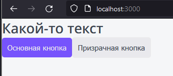

## 005 HTMLProps

Однако после наших действий с добавлением определённых пропсов под компонент кнопки, наша кнопка не имеет возможности получать другие пропсы (по типу `onClick` для привязки функции)

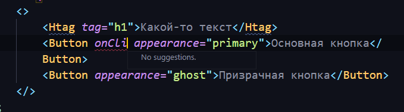

Первым делом, чтобы исправить данную ситуацию, нужно заэкстендить интерфейс кнопки стандартными атрибутами, которые принимает в себя кнопка внутри `HTML`  

`components > Button > Button.props.ts`
```TS
import { ButtonHTMLAttributes, DetailedHTMLProps, ReactNode } from 'react';

export interface IButtonProps
	extends DetailedHTMLProps<ButtonHTMLAttributes<HTMLButtonElement>, HTMLButtonElement> {
	children: ReactNode;
	appearance: 'primary' | 'ghost';
}
```

Далее нам нужно прокинуть актуальные для нас `HTML-пропсы` явно, а остальные прокинуть через деструктуризацию

`components > Button > Button.tsx`
```JSX
export const Button = ({ appearance, children, className, ...props }: IButtonProps) => {
	return (
		<button
			className={cn(styles.button, className, {
				[styles.primary]: appearance == 'primary',
				[styles.ghost]: appearance == 'ghost',
			})}
			{...props}
		>
			{children}
		</button>
	);
};
```

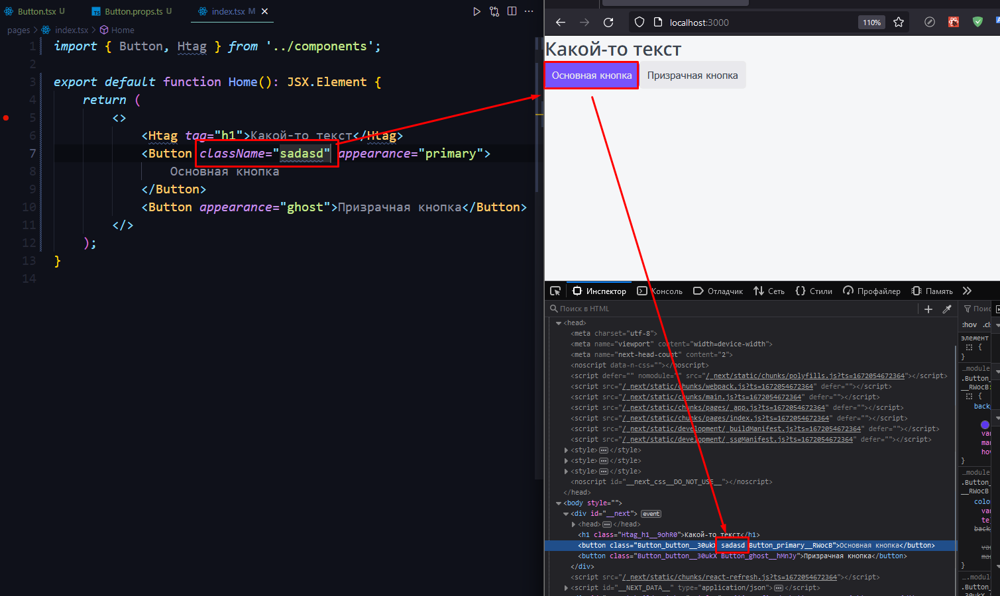

## 006 Updated - Детали HTMLprops

Первым делом, основные типы под все наши атрибуты, которые могут нам пригодиться при типизации `React`, мы можем найти в тайпах к реакту

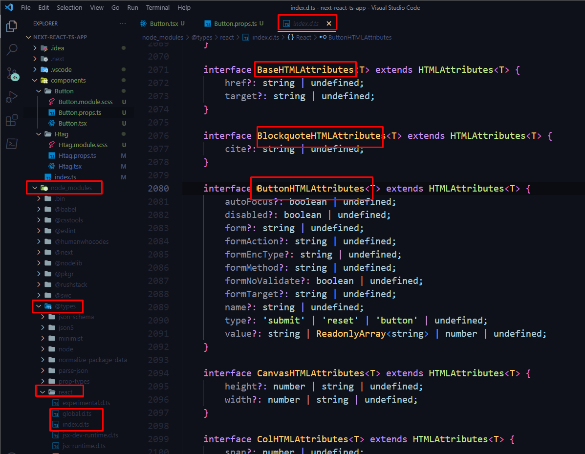

А тут уже представлены интерфейсы всех основных атрибутов `HTML`, которые мы можем прописать. Все эти интерфейсы заполняются благодря подключаемой в `tsconfig` библиотеке `lib`, которая в нём уже присутствует при использовании фреймворка `nextjs`

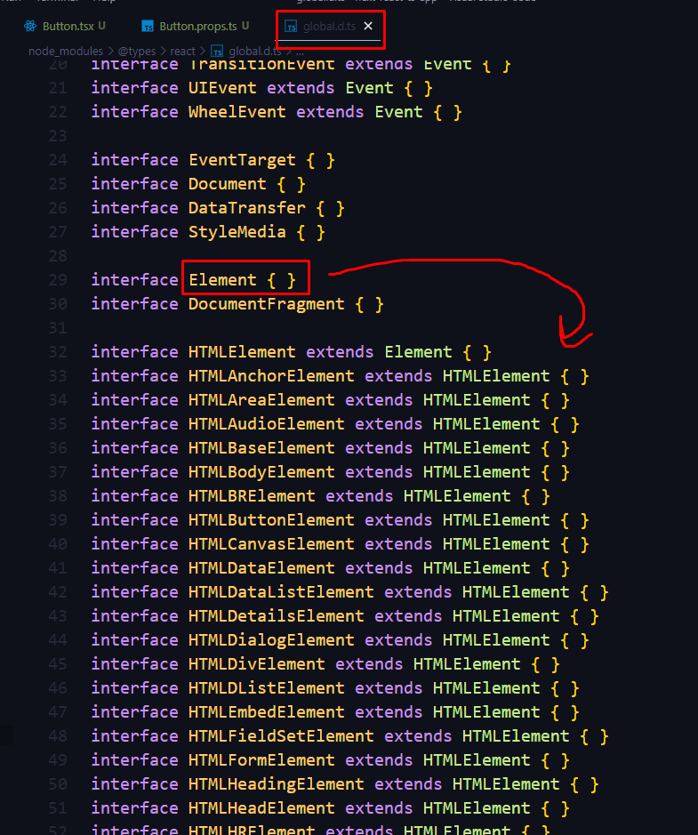

Для типизации можно просто вставлять интерфейсы под каждый элемент, который мы используем. Если у данного элемента нет специализированных под него атрибутов, то нам достаточно будет просто добавить для него `HTMLAttributes`, а не искать под него его специализированный интерфейс

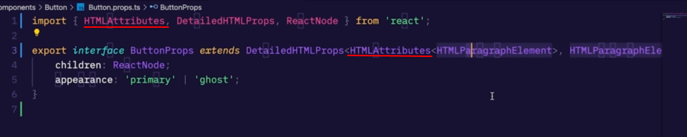

## 008 Работа с svg

Структура:

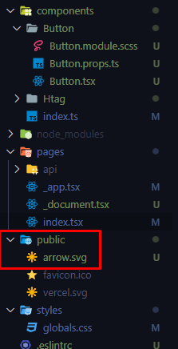

Нужно добавить свойство `arrow`, которое будет определять положение стрелки относительно самой себя в пространстве

`components > Button > Button.props.ts`
```TS
import { ButtonHTMLAttributes, DetailedHTMLProps, ReactNode } from 'react';

export interface IButtonProps
	extends DetailedHTMLProps<ButtonHTMLAttributes<HTMLButtonElement>, HTMLButtonElement> {
	children: ReactNode;
	appearance: 'primary' | 'ghost';
	arrow?: 'right' | 'down' | 'none';
}
```

Так же нам предварительно стоит удалить свойство `fill` в конце `svg` иконки и заменить его тем, что находится вначале, чтобы иметь возможность иметь цвета из `css`

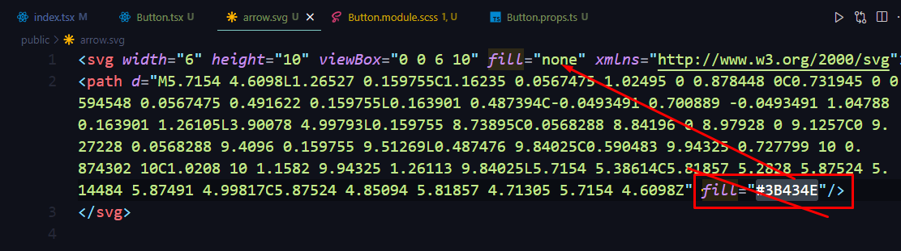

Дальше нужно добавить стили для трансформации и цвета иконки

`components > Button > Button.module.scss`
```SCSS
.primary svg,
.ghost:active svg {
	fill: var(--white);
}

.arrow {
	display: inline-block;

	margin-left: 10px;
}

.right {
}

.down {
	transition: all 0.2s;
	transform: rotate(90deg);
}
```

Далее определяем логику наличия иконки на странице. Если мы передали `arrow` отличное от дефолтного значения (`none`), то будет появляться стрелка в нужном нам направлении, которое мы определили через стили.
Нужно ещё отдельно сказать, что в пути изображения указан путь `/arrow.svg` - тут иконка располагается в папке `public`, доступ к которой можно получить так **из всего проекта**

`components > Button > Button.tsx`
```TSX
import React from 'react';
import { IButtonProps } from './Button.props';
import styles from './Button.module.scss';
import cn from 'classnames';

export const Button = ({
	appearance,
	children,
	arrow = 'none',
	className,
	...props
}: IButtonProps) => {
	return (
		<button
			className={cn(styles.button, className, {
				[styles.primary]: appearance == 'primary',
				[styles.ghost]: appearance == 'ghost',
			})}
			{...props}
		>
			{children}
			{arrow != 'none' && (
				<span
					className={cn(styles.arrow, {
						[styles.down]: arrow == 'down',
					})}
				>
					
				</span>
			)}
		</button>
	);
};

```

Далее остаётся только прописать на странице поворот стрелки для кнопки

`pages > index.tsx`
```TSX
export default function Home(): JSX.Element {
	return (
		<>
			<Htag tag="h1">Какой-то текст</Htag>
			<Button appearance="primary" arrow="right">
				Основная кнопка
			</Button>
			<Button appearance="ghost" arrow="down">
				Призрачная кнопка
			</Button>
		</>
	);
}
```

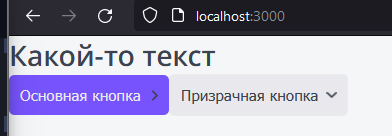

## 011 Упражнение - Компонент p

Тут опишем интерфейс принимаемых пропсов

`Paragraph.props.ts`
```TS
import { HTMLAttributes, DetailedHTMLProps, ReactNode } from 'react';

export interface IParagraphProps
	extends DetailedHTMLProps<HTMLAttributes<HTMLParagraphElement>, HTMLParagraphElement> {
	children: ReactNode;
	size?: 's' | 'm' | 'l';
}
```

Компонент параграфа: в зависимости от полученного значения размера, подставляется разный класс со своими значениями размера шрифта

`Paragraph.tsx`
```TSX
import { IParagraphProps } from './Paragraph.props';
import cn from 'classnames';
import styles from './Paragraph.module.scss';

export const Paragraph = ({ size = 'm', children, className, ...props }: IParagraphProps) => {
	return (
		<p
			className={cn(styles.p, className, {
				[styles.s]: size == 's',
				[styles.m]: size == 'm',
				[styles.l]: size == 'l',
			})}
			{...props}
		>
			{children}
		</p>
	);
};
```

Тут уже описаны стили для разных размеров шрифтов

`Paragraph.module.scss`
```SCSS
.p {
	margin: 0;
}

.s {
	font-size: 14px;
	line-height: 24px;
}

.m {
	font-size: 16px;
	line-height: 24px;
}

.l {
	font-size: 18px;
	line-height: 29px;
}
```


Передаём компонент дальше

`index.ts`
```TS
export * from './Htag/Htag';
export * from './Button/Button';
export * from './Paragraph/Paragraph';
```

И используем компонент кнопки

`index.tsx`
```TSX
import { IParagraphProps } from './Paragraph.props';
import cn from 'classnames';
import styles from './Paragraph.module.scss';

export default function Home(): JSX.Element {
	return (
		<>
			<Htag tag="h1">Какой-то текст</Htag>
			<Button appearance="primary" arrow="right">
				Основная кнопка
			</Button>
			<Button appearance="ghost" arrow="down">
				Призрачная кнопка
			</Button>
			<Paragraph size="l">БОЛЬШОЙ: Текста очень много</Paragraph>
			<Paragraph size="m">СРЕДНИЙ: Текста очень много</Paragraph>
			<Paragraph size="s">МАЛЕНЬКИЙ: Текста очень много</Paragraph>
		</>
	);
}
```

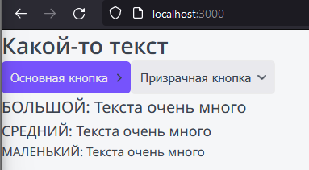

## 012 Компонент тэга

Далее нам нужно реализовать теги нашего сайта:

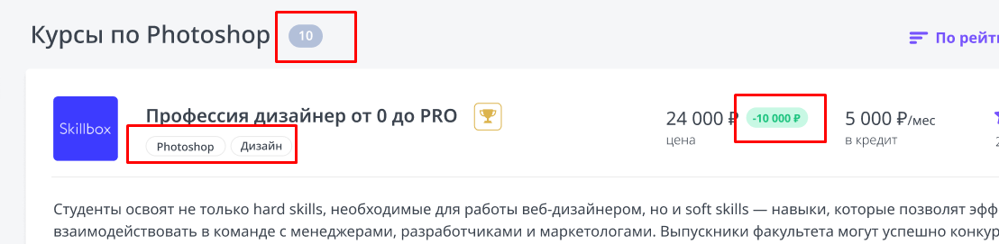
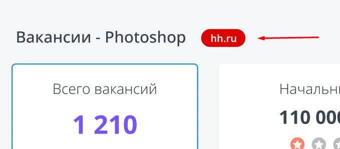
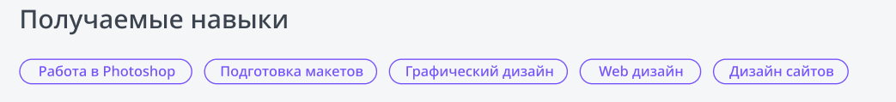

`Tag.module.scss`
```SCSS
.tag {
	display: inline-block;

	box-sizing: border-box;
	margin-right: 5px;
	border-radius: 20px;
}

.s {
	padding: 5px 10px;

	font-size: 12px;
	line-height: 12px;
}

.m {
	padding: 5px 10px;

	font-size: 14px;
	line-height: 14px;
}

.ghost {
	border: 1px solid var(--gray-light);
}

.primary {
	color: var(--primary);
	border: 1px solid var(--primary);
	background: none;
}

.grey {
	color: var(--white);
	background: #b3c0d9;

	font-weight: bold;
}

.red {
	color: var(--white);
	background: #de0000;

	font-weight: bold;
}

.green {
	color: var(--green);
	background: var(--light-green);

	font-weight: bold;
}
```

`Tag.props.ts`
```TS
import { DetailedHTMLProps, HTMLAttributes, ReactNode } from 'react';

export interface ITagProps
	extends DetailedHTMLProps<HTMLAttributes<HTMLDivElement>, HTMLDivElement> {
	children: ReactNode;
	size?: 's' | 'm';
	color?: 'ghost' | 'primary' | 'grey' | 'red' | 'green';
	href?: string;
}
```

Особенность реализации даного компонет состоит в том, что для вывода текста тега используется тернарный оператор. Если ссылка имеется (мы её передали в компонент), то мы выводим ссылку - если не передали, то выводим обычный текст. 

`Tag.tsx`
```TSX
import React from 'react';
import { ITagProps } from './Tag.props';
import styles from './Tag.module.scss';
import cn from 'classnames';
import Link from 'next/link';

export const Tag = ({
	children,
	className,
	href,
	color = 'ghost',
	size = 's',
	...props
}: ITagProps) => {
	return (
		<div
			className={cn(styles.tag, className, {
				[styles.s]: size == 's',
				[styles.m]: size == 'm',
				[styles.ghost]: color == 'ghost',
				[styles.primary]: color == 'primary',
				[styles.grey]: color == 'grey',
				[styles.green]: color == 'green',
				[styles.red]: color == 'red',
			})}
			{...props}
		>
			{
				href 
					? <Link href={`${href}`}>{children}</Link> 
					: <>{children}</>
			}
		</div>
	);
};
```

`index.ts`
```TS
export * from './Htag/Htag';
export * from './Button/Button';
export * from './Paragraph/Paragraph';
export * from './Tag/Tag';
```

`index.tsx`
```TSX
import { Button, Htag, Paragraph, Tag } from '../components';

export default function Home(): JSX.Element {
	return (
		<>
			<Htag tag="h1">Какой-то текст</Htag>
			<Button appearance="primary" arrow="right">
				Основная кнопка
			</Button>
			<Button appearance="ghost" arrow="down">
				Призрачная кнопка
			</Button>
			<Paragraph size="l">БОЛЬШОЙ: Текста очень много</Paragraph>
			<Paragraph size="m">СРЕДНИЙ: Текста очень много</Paragraph>
			<Paragraph size="s">МАЛЕНЬКИЙ: Текста очень много</Paragraph>
			<Tag color="green" size="m">
				-10000
			</Tag>
			<Tag size="m" color="primary" href="www.google.com">
				Google
			</Tag>
		</>
	);
}
```

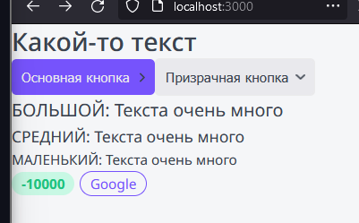

