#React #ReactHooks 

## 001 Введение в хуки

Хуки - это функции, которые позволяют заменить функционал реакта в классах для использования внутри функциональных компонентов

Хуки появились в версии ==16.8== 

Пока не существует хуков, реализующих методы жизненного цикла `getSnapshotBeforeUpdate`, `getDerivedStateFromError` и `componentDidCatch`.

2 правила использования хуков:
- Хуки можно вызывать только на верхнем уровне - нельзя использовать внутри циклов, условий и вложенных функций
- Хуки стоит вызывать только из функциональных компонентов реакта (исключение только одно - это пользовательские хуки)


## 002 useState

И далее представим два компонента, которые будут рендерить одну и ту же картинку, но будут иметь два разных подхода реализации: функциональный и классовый

Для построения функционального компонента нужно уже будет писать все состояния используя хуки. Конкретно в данном случае пригодится `useState()`

`useState()` - это хук, который отвечает за управлением состояниями в приложении. Он возвращает массив из двух элементов: `[состояние, функцияУстановкиСостояния]`. Для установки нового состояния нельзя мутировать старое и поэтому в функцию нужно передавать стейт + новое изменённое значение

```JS
import { Component, useState } from 'react';
import { Container } from 'react-bootstrap';
import './App.css';

// классовая версия компонента
class SliderClass extends Component {
	constructor(props) {
		super(props);
		this.state = {
			autoplay: false,
			slide: 0,
		};
	}

	changeSlide = (i) => {
		this.setState(({ slide }) => ({
			slide: slide + i,
		}));
	};

	toggleAutoplay = () => {
		this.setState(({ autoplay }) => ({
			autoplay: !autoplay,
		}));
	};

	render() {
		return (
			<Container className='wrapper'>
				<div className='slider w-50 m-auto'>
					
					<div className='text-center mt-5'>
						Active slide {this.state.slide} <br /> {this.state.autoplay ? 'auto' : null}
					</div>
					<div className='buttons mt-3'>
						<button
							className='btn btn-primary me-2'
							onClick={() => this.changeSlide(-1)}
						>
							-1
						</button>
						<button
							className='btn btn-primary me-2'
							onClick={() => this.changeSlide(1)}
						>
							+1
						</button>
						<button className='btn btn-primary me-2' onClick={this.toggleAutoplay}>
							toggle autoplay
						</button>
					</div>
				</div>
			</Container>
		);
	}
}

// функциональная версия компонента
const SliderFunction = (props) => {
	// первая возможная запись элемента состояния
	const slideStateArray = useState(0);
	console.log(slideStateArray);

	// вторая запись, которую мы сразу деструктурируем
	const [slide, setSlide] = useState(0);

	// так же можно вынести изменение состояния в отдельную функцию
	function changeSlide(i) {
		setSlide((slide) => slide + i);
	}

	const [autoplay, setAutoplay] = useState(false);

	function toggleAutoplay() {
		// так же функция изменения значения может выглядить таким образом
		setAutoplay((autoplay) => !autoplay);
	}

	return (
		<Container className='wrapper'>
			<div className='slider w-50 m-auto'>
				
				<div className='text-center mt-5'>
					Active slide {slide} <br /> {autoplay ? 'auto' : null}
				</div>
				<div className='buttons mt-3'>
					<button
						className='btn btn-primary me-2'
						// изменяем состояние слайдера через внешнюю
						onClick={() => changeSlide(-1)}
					>
						-1
					</button>
					<button
						className='btn btn-primary me-2'
			// изменяем состояние слайдера через встроенную функцию
						onClick={() => setSlide(slide + 1)}
					>
						+1
					</button>
					<button 
						className='btn btn-primary me-2' 
						// изменяем состояние на обратное
						onClick={() => setAutoplay(!autoplay)}
					>
						toggle autoplay
					</button>
				</div>
			</div>
		</Container>
	);
};

function App() {
	return (
		<div>
			<SliderClass />
			<SliderFunction />
		</div>
	);
}

export default App;
```

И далее мы имеем два одинаковых компонента на странице:
- классовый
- функциональный

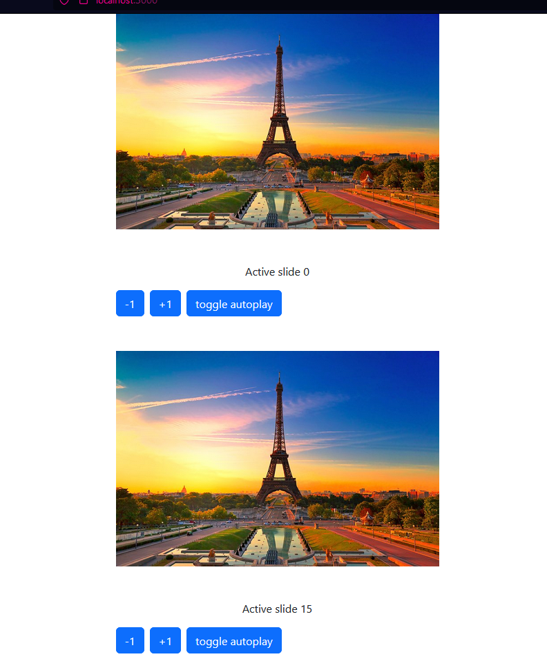

Вот как выглядит возврат `useState()`

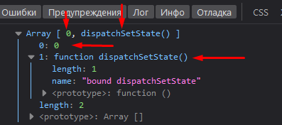

Если мы попытаемся вызывать функцию установки нового состояния дважды просто через передачу внутрь аргумента, у нас сработают обе функции асинхронно. Это приведёт к тому, что значение состояния будет меняться ровно один раз, потому что оба аргумента (состояние) функции ссылаются на одно и то же значение

То есть тут произойдёт увеличение состояния `slide` ровно на 1

```JS
function changeSlide(i) {
	setSlide(slide + i);
	setSlide(slide + i);
}
```

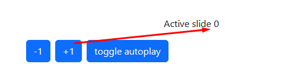

Однако при таком подходе, когда мы изменяем состояние через колбэк-функцию, стейт будет меняться два раза подряд и при передаче аргумента `1` стейт увеличится на `2`

```JS
function changeSlide(i) {
	setSlide((slide) => slide + i);
	setSlide((slide) => slide + i);
}
```

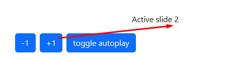

Так же мы можем вынести несколько состояний в одну переменную и хранить в ней объект с несколькими значениями.
Особенность заключается в том, что в отличие от классов объекты автоматически не складываются 
- `this.setState(({ slide }) => ({ slide: slide + i }))` - в классах будет работать и свойство `autoplay` не потеряется
- `setState((state) => ({ ...state, slide: state.slide + value }))` - нужно использовать в функциях деструктуризацию, потому что состояния в них иммутабельны и нужно вставлять полностью новые значения

```JS
const [state, setState] = useState({ slide: 0, autoplay: false });

function changeSlide(value) {
	setState((state) => ({ ...state, slide: state.slide + value }));
}

function toggleAutoplay() {
	setState((state) => ({ ...state, autoplay: !state.autoplay }));
}
```

Так же, если мы передадим в качестве начального значения состояния функцию, то она вызовется ровно один раз - при сборке компонента

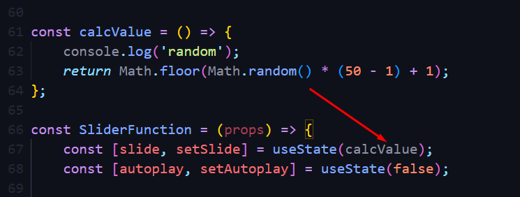

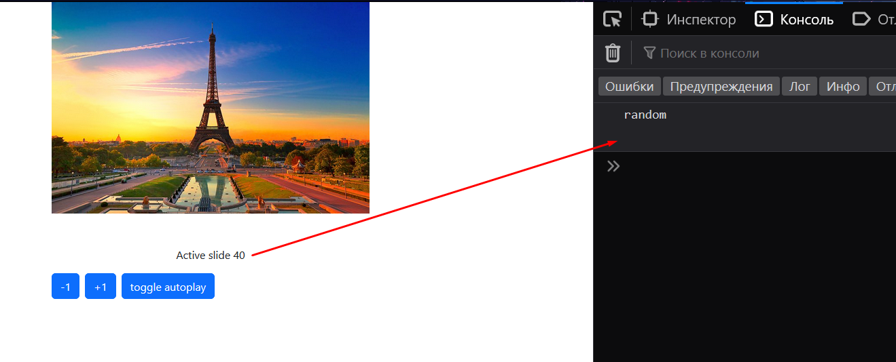

Так же будет себя вести функция, если мы передадим колбэк-функцию

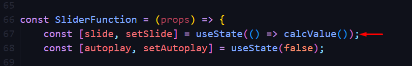

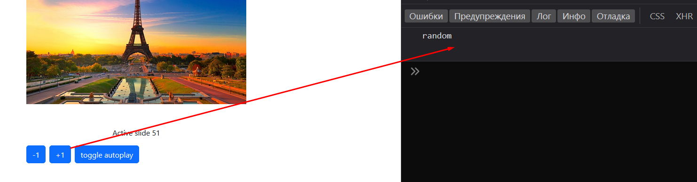

Если функцию просто вызвать внутри установки стейта, то она будет вызваться каждый раз при перерендере 

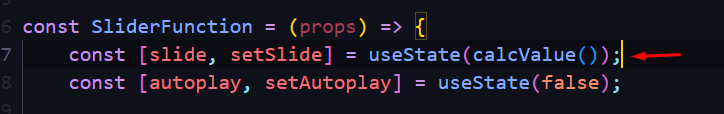

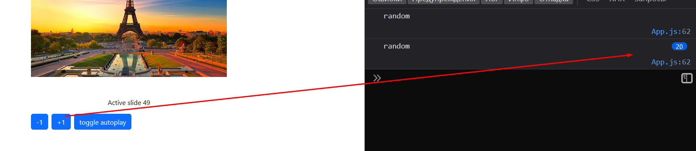


## 003 useEffect

`useEffect()` - это хук, который выполняет эффекты на определённых этапах жизненного состояния компонента

Побочными действиями (эффектами) обычно являются:
- дозагрузка данных
- использования сторонних модулей
- запуск таймаутов
- логирование 
- изменение ДОМ-структуры

И далее нам нужно обновлять заголовок страницы в зависимости от состояния слайда

И тут показан пример использования хуков жизненного состояния `componentDidMount` и `componentDidUpdate` в классовом компоненте. Основная проблема такого подхода заключается в повторении кода.

И в функциональном компоненте эту же самую операцию выполняет одна функция `useEffect()`

```JS
import { Component, useEffect, useState } from 'react';
import { Container } from 'react-bootstrap';
import './App.css';

class SliderClass extends Component {
	constructor(props) {
		super(props);
		this.state = {
			autoplay: false,
			slide: 0,
		};
	}

	// при монтировании компонента, будет показываться элемент
	componentDidMount() {
		document.title = `Slide: ${this.state.slide}`;
	}

	// при обновлении компонента, будет показываться слайд
	componentDidUpdate() {
		document.title = `Slide: ${this.state.slide}`;
	}

	changeSlide = (i) => {
		this.setState(({ slide }) => ({
			slide: slide + i,
		}));
	};

	toggleAutoplay = () => {
		this.setState(({ autoplay }) => ({
			autoplay: !autoplay,
		}));
	};

	render() {
		return (
			<Container className='wrapper'>
				<div className='slider w-50 m-auto'>
					
					<div className='text-center mt-5'>
						Active slide {this.state.slide} <br /> {this.state.autoplay ? 'auto' : null}
					</div>
					<div className='buttons mt-3'>
						<button
							className='btn btn-primary me-2'
							onClick={() => this.changeSlide(-1)}
						>
							-1
						</button>
						<button
							className='btn btn-primary me-2'
							onClick={() => this.changeSlide(1)}
						>
							+1
						</button>
						<button className='btn btn-primary me-2' onClick={this.toggleAutoplay}>
							toggle autoplay
						</button>
					</div>
				</div>
			</Container>
		);
	}
}

const SliderFunction = (props) => {
	const [slide, setSlide] = useState(0);
	const [autoplay, setAutoplay] = useState(false);

	// и сейчас мы будем каждый раз вызывать перерендер данного элемента
	useEffect(() => {
		document.title = `Slide: ${slide}`;
	});

	function changeSlide(i) {
		setSlide((slide) => slide + i);
	}

	function toggleAutoplay() {
		setAutoplay((autoplay) => !autoplay);
	}

	return (
		<Container className='wrapper'>
			<div className='slider w-50 m-auto'>
				
				<div className='text-center mt-5'>
					Active slide {slide} <br /> {autoplay ? 'auto' : null}
				</div>
				<div className='buttons mt-3'>
					<button className='btn btn-primary me-2' onClick={() => changeSlide(-1)}>
						-1
					</button>
					<button className='btn btn-primary me-2' onClick={() => setSlide(slide + 1)}>
						+1
					</button>
					<button className='btn btn-primary me-2' onClick={toggleAutoplay}>
						toggle autoplay
					</button>
				</div>
			</div>
		</Container>
	);
};

function App() {
	return (
		<div>
			<SliderClass />
			<SliderFunction />
		</div>
	);
}

export default App;
```

И теперь оба компонента выполняют свои функции одинаково

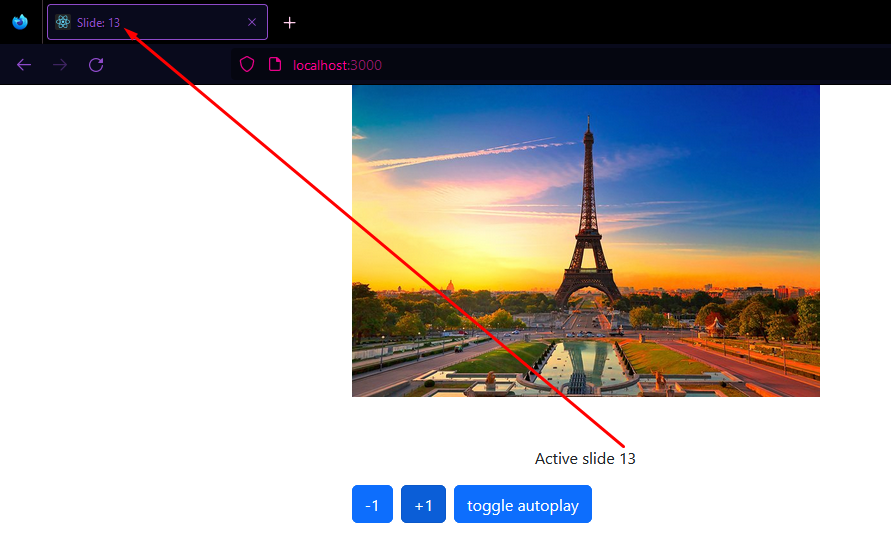

И так же нужно сказать про разные состояния работы хука `useEffect`

При такой записи эффект будет выполняться каждый раз при обновлении компонента.
Дело заключается в том, что так функция будет работать как `componentDidMount` и функция будет меняться при каждом рендере, то есть каждый раз будет создаваться новая функция (которая передаётся в `useEffect`). Реализован так хук, чтобы не было багов с замыканием, чтобы получать актуальную переменную из состояния.

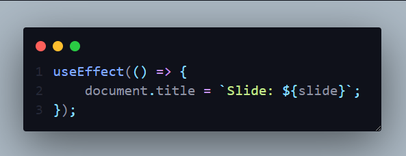

Такая запись хука будет вызвать срабатывание функции при любом изменении стейта на странице, что не очень хороший подход, так как у нас есть и другие стейты на странице, которые не относятся к выполнению данной функции

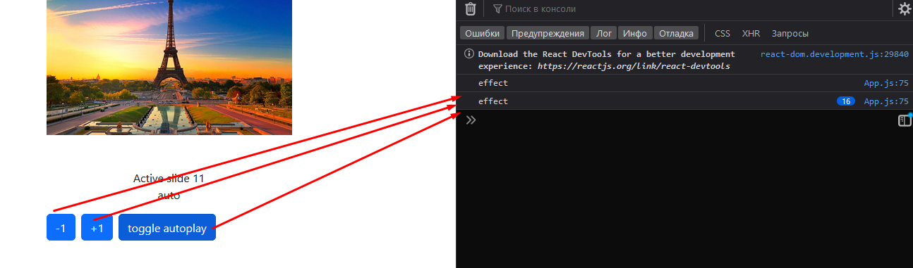

Чтобы исправить проблему выше, можно передать второй аргумент в хук - зависимости, которые будут триггерить срабатывание функции

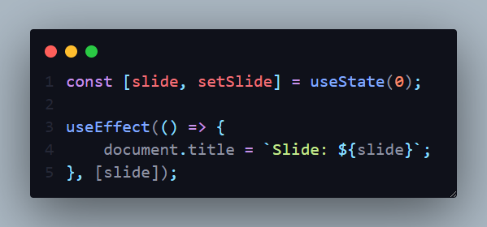

И теперь вызываться функция будет только при изменении целевого состояния

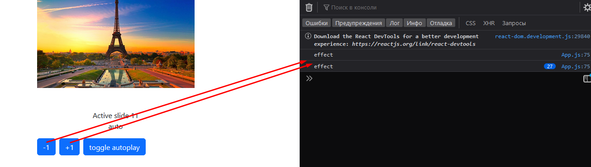

Если нам нужно сэмулировать работу функции `componentDidMount`, тогда нам нужно передать пустой массив зависимостей, что вызовет срабатывание функции только один раз - при загрузке 

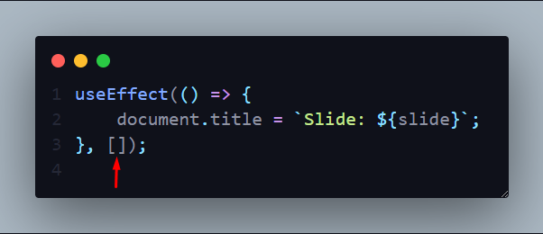

>[!note] Так же мы можем создать несколько хуков `useEffect`.Желательно создавать отдельные эффекты на каждое действие.

И далее рассмотрим поведение, когда нам нужно реализовать поведение `componentWillUnmount`, когда при размонтировании компонента нам нужно произвести все отписки (отключить листенеры и таймауты)

Чтобы выполнить данную операцию, нужно просто из эффекта вернуть другую функцию, которая выполнит заданную операцию при размонтировании

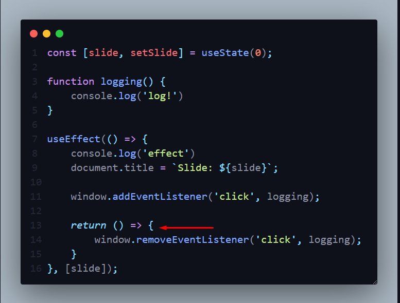

Добавим в родительский компонент возможность удалить компонент со страницы

```JS
function App() {
	const [slide, setSlide] = useState(true);

	return (
		<>
			<button onClick={() => setSlide(!slide)}>Слайдер</button>
			{/* <SliderClass /> */}
			{slide ? <SliderFunction /> : null}
		</>
	);
}
```

И теперь при каждом монтировании компонента появляется уведомление

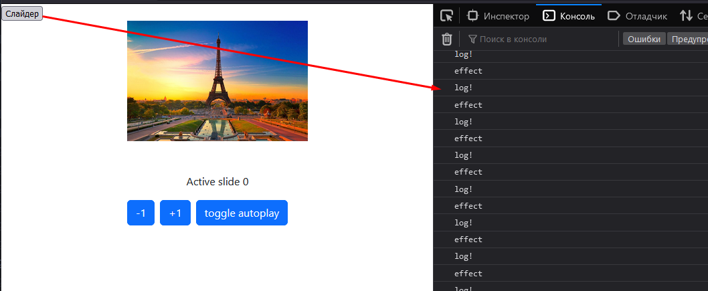

## 004 useCallback


Представим такую ситуацию: нам нужно получать изображения со стороннего ресурса

```JS
// функция получения изображений (вне компонента)
const getSomeImg = () => {
	console.log('fetching');

	return [
		'https://www.planetware.com/i/home-promo-italy.jpg',
		'https://www.planetware.com/wpimages/2023/02/scotland-isle-of-arran-top-things-to-do-intro-paragraph-goat-fell.jpg',
	];
};

// return компонента
return (
	<Container className='wrapper'>
		<div className='slider w-50 m-auto'>
			
			// формируем массив изображений 
			{getSomeImg().map((url, i) => (
				
			))}
			
			<div className='text-center mt-5'>
				Active slide {slide} <br /> {autoplay ? 'auto' : null}
			</div>
			<div className='buttons mt-3'>
				<button className='btn btn-primary me-2' onClick={() => changeSlide(-1)}>
					-1
				</button>
				<button className='btn btn-primary me-2' onClick={() => setSlide(slide + 1)}>
					+1
				</button>
				<button className='btn btn-primary me-2' onClick={toggleAutoplay}>
					toggle autoplay
				</button>
			</div>
		</div>
	</Container>
);
```

Но теперь перед нами встаёт проблема, что после каждого изменения стейта, у нас вызывается функция отправки запроса на сервер 

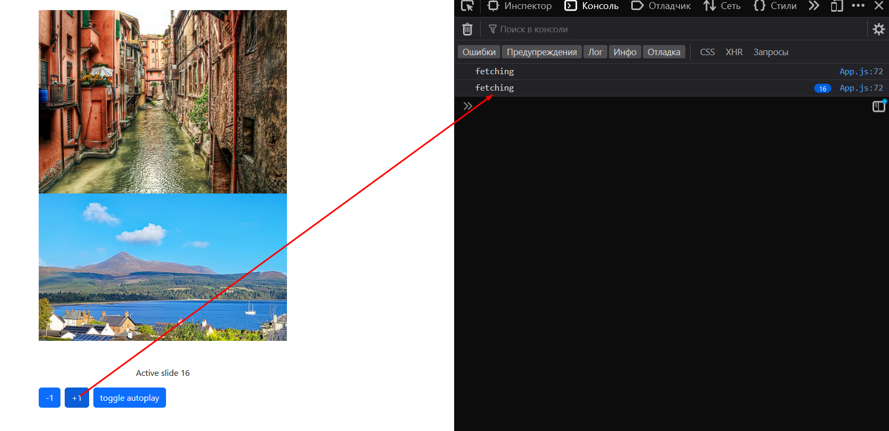

И тут на помощь к нам приходит хук `useCallback()`. Он принимает в себя функцию и мемоизирует ссылку на неё. Функция будет вызываться заново только после того, как у нас поменяется значение зависимости.

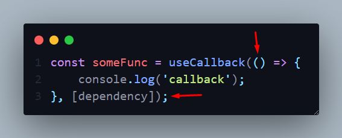

Чтобы правильно воспользоваться функцией, нужно создать новый компонент, который будет иметь своё состояние. Внутри неё нужно и отображать те изменения, данные для которых возвращает `useCallback()`. 

Конкретно тут мы через `useCallback` реализовали возврат новой ссылки на функцию, если изменится состояние слайда (если слайд не будет меняться, то ссылаться хук будет на старую версию функции, которая закэширована) 

```JS
const SliderFunction = (props) => {
	const [slide, setSlide] = useState(0);

	useEffect(() => {
		document.title = `Slide: ${slide}`;
	}, [slide]);

	// чтобы закешировать выполнение функции, нужно обернуть его в хук
	const getSomeImg = useCallback(() => {
		console.log('fetching');

		return [
			'https://www.planetware.com/i/home-promo-italy.jpg',
			'https://www.planetware.com/wpimages/2023/02/scotland-isle-of-arran-top-things-to-do-intro-paragraph-goat-fell.jpg',
		];
	}, [slide]);

	const [autoplay, setAutoplay] = useState(false);

	function changeSlide(i) {
		setSlide((slide) => slide + i);
	}

	function toggleAutoplay() {
		setAutoplay((autoplay) => !autoplay);
	}

	return (
		<Container className='wrapper'>
			<div className='slider w-50 m-auto'>
			
				{/* тут уже просто вызываем наш компонент слайдов */}
				<Slide getSomeImg={getSomeImg} />

				<div className='text-center mt-5'>
					Active slide {slide} <br /> {autoplay ? 'auto' : null}
				</div>
				<div className='buttons mt-3'>
					<button className='btn btn-primary me-2' onClick={() => changeSlide(-1)}>
						-1
					</button>
					<button className='btn btn-primary me-2' onClick={() => setSlide(slide + 1)}>
						+1
					</button>
					<button className='btn btn-primary me-2' onClick={toggleAutoplay}>
						toggle autoplay
					</button>
				</div>
			</div>
		</Container>
	);
};

// компонент отдельного слайда
const Slide = ({ getSomeImg }) => {
	const [images, setImages] = useState([]);

	useEffect(() => {
		setImages(getSomeImg());
	}, [getSomeImg]);

	return (
		<div>
			{images.map((url, i) => (
				
			))}
		</div>
	);
};
```

И теперь каждый раз мы будем вызвать мемоизированную функцию. При перезагрузке страницы те изображения, которые возвращает функция, будут закешированы в браузере. 

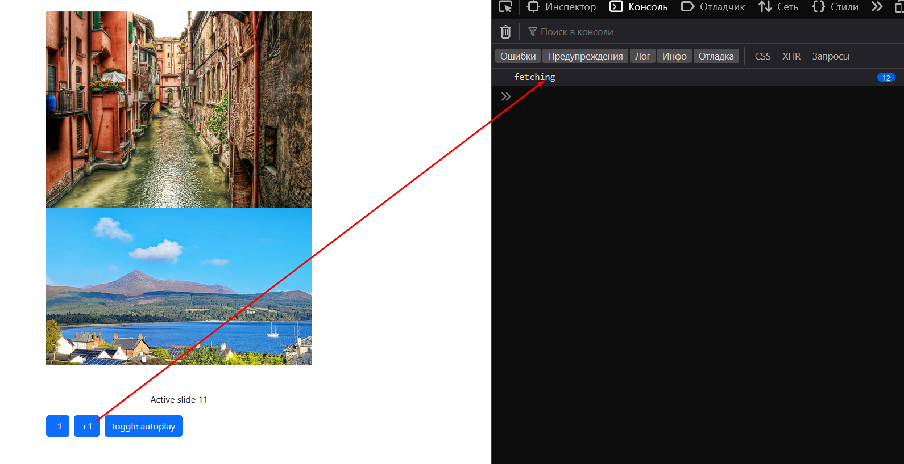

## 005 useMemo


`useMemo()` - это хук, который возвращает мемоизированное значение (результат вычислений запоминается в кеше)

И далее мы реализовали функцию подсчёта суммарного количества слайдов через `countTotal()`

```JS
// функция подсчёта общего количества слайдов
const countTotal = (num) => {
	console.log('counting...');
	return num + 10;
};

const SliderFunction = (props) => {
	const [slide, setSlide] = useState(0);
	const [autoplay, setAutoplay] = useState(false);

	useEffect(() => {
		document.title = `Slide: ${slide}`;
	}, [slide]);

	const getSomeImg = useCallback(() => {
		return [
			'https://www.planetware.com/i/home-promo-italy.jpg',
			'https://www.planetware.com/wpimages/2023/02/scotland-isle-of-arran-top-things-to-do-intro-paragraph-goat-fell.jpg',
		];
	}, [slide]);

	// вызываем функцию подсчёта слайдов
	const total = countTotal(slide);

	return (
		<Container className='wrapper'>
			<div className='slider w-50 m-auto'>
				<Slide getSomeImg={getSomeImg} />

				<div className='text-center mt-5'>
					Active slide {slide} <br /> {autoplay ? 'auto' : null}
				</div>

				<div className='text-center mt-5'>Total slides: {total}</div>

				<div className='buttons mt-3'>
					<button className='btn btn-primary me-2' onClick={() => setSlide(slide - 1)}>
						-1
					</button>
					<button className='btn btn-primary me-2' onClick={() => setSlide(slide + 1)}>
						+1
					</button>
					<button className='btn btn-primary me-2' onClick={() => setAutoplay(!autoplay)}>
						toggle autoplay
					</button>
				</div>
			</div>
		</Container>
	);
};
```

Основная проблема, которую мы сейчас имеем - функция вызывается ещё раз даже когда мы мы меняем совсем не связанное с ней состояние. Если операция подсчёта была бы очень ресурсозатратной, то производительность бы сильно упала

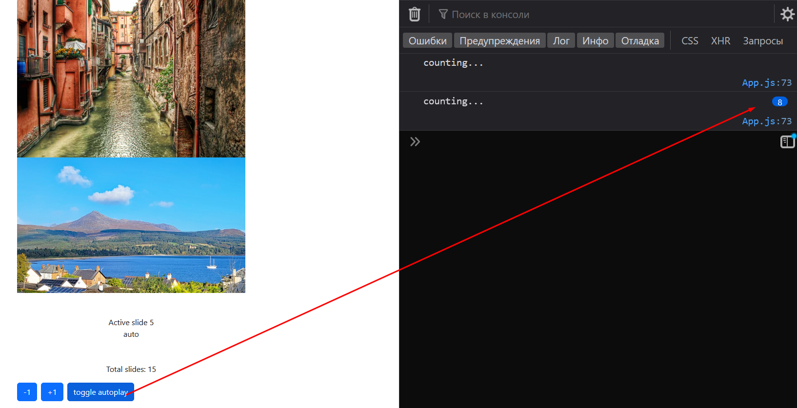

И чтобы исправить вышеописанную ситуацию, можно воспользоваться хуком `useMemo()`. Этот хук принимает первым аргументом функцию, а вторым аргументом зависимости, при изменении которых будет пересчитываться значение.

Данный хук используется для запоминания значения, которое возвращает функция, чтобы не выполнять тяжёлые операции пересчёта каждый раз.

Если передать пустой массив зависимостей, то значение посчитается ровно один раз.

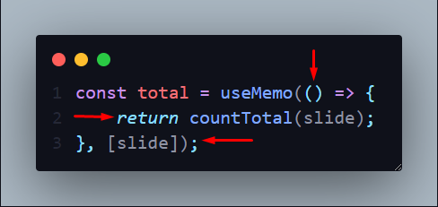

Представим такую ситуацию, что нам нужно менять стили при определённых условиях у объекта.
Если выводить в консоль уведомление об изменении стилей, то можно увидеть, что при смене любого состояния у нас переприсваивается значение свойств в компоненте. Это происходит потому, что при обновлении компонента у нас будет в переменную `style` заноситься новый объект, от чего и будет срабатывать `useEffect`.

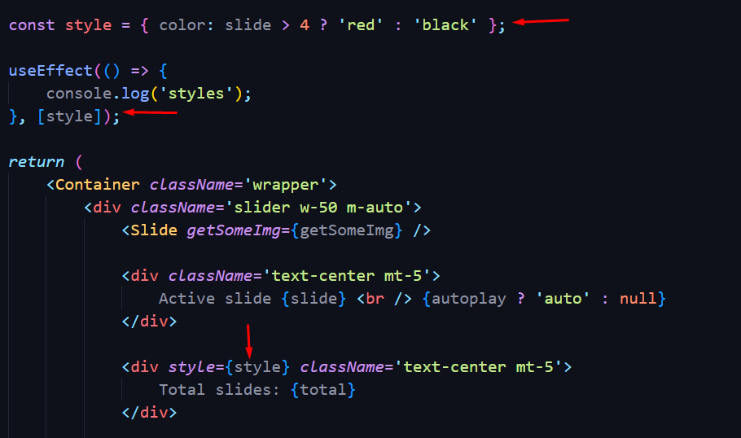
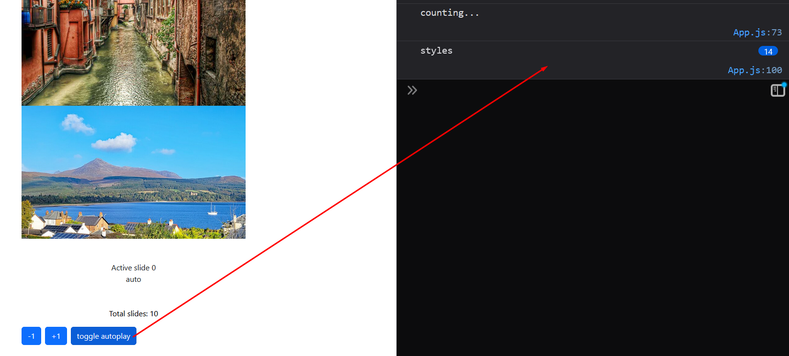

Чтобы исправить данную ситуацию, нужно занести объект в `useMemo`, что сохранит значение переменной в кеше браузера и внутри компонента объект не будет обновляться каждый раз и не будет вызвать срабатывание хука `useEffect`

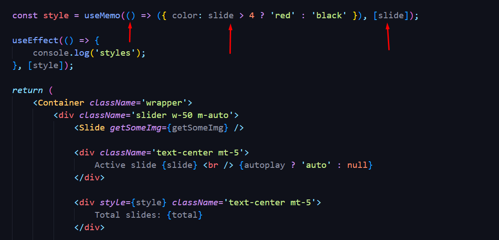
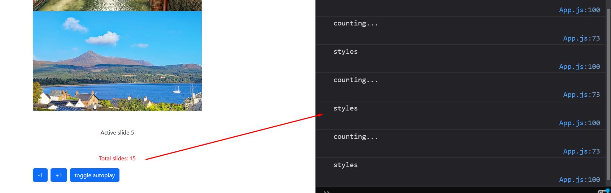


## 006 useRef

`useRef()` - это хук, который предоставляет прямой доступ к ДОМ-элементам на странице

1) Создаём переменную, которая будет хранить ссылку на нужный нам элемент
2) Передаём реф в элемент ДОМ-дерева
3) Вызываем срабатывание функции

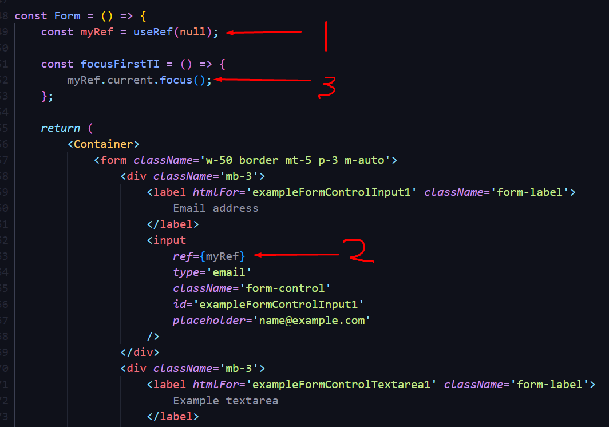

Далее представленный ниже код выполняет:
- при изменении состояния (внутри первого инпута) `useEffect` выводит в консоль значение свойства `current` у рефа
- при клике по текстэрии, значение в рефе будет увеличиваться на 1
- при дальнейшем вводе в первый инпут будет выводиться значение рефа, которое уже было увеличено 

Таким образом мы сохранили динамическое значение внутри свойства `current`, которое будет изменяться без перерендера компонента 

```JS
const Form = () => {
	const [text, setText] = useState('');

	const myRef = useRef(1);

	// отображаем значение рефа в консоли
	useEffect(() => console.log(myRef.current));

	return (
		<Container>
			<form className='w-50 border mt-5 p-3 m-auto'>
				<div className='mb-3'>
					<label htmlFor='exampleFormControlInput1' className='form-label'>
						Email address
					</label>
					<input
						// заносим текст в состояние
						onChange={(e) => setText(e.target.value)}
						type='email'
						className='form-control'
						id='exampleFormControlInput1'
						placeholder='name@example.com'
					/>
				</div>
				<div className='mb-3'>
					<label htmlFor='exampleFormControlTextarea1' className='form-label'>
						Example textarea
					</label>
					<textarea
						// увеличиваем значение на 1
						onClick={() => myRef.current++}
						className='form-control'
						id='exampleFormControlTextarea1'
						rows='3'
					></textarea>
				</div>
			</form>
		</Container>
	);
};
```
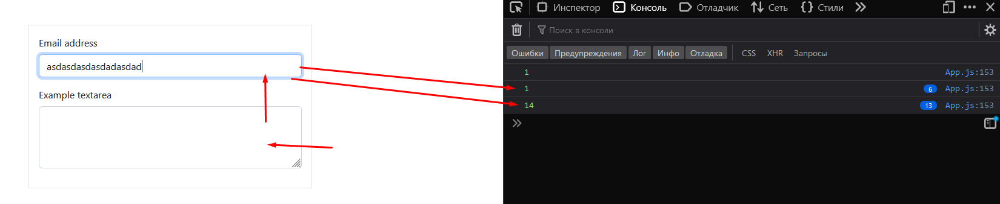

И при вынесении изменения свойства в эффект, можно увидеть, что компонент не перерендеривается каждый раз, а просто увеличивает свойство, находящееся в рефе

```JS
const Form = () => {
	const [text, setText] = useState('');

	const myRef = useRef(1);

	useEffect(() => {
		myRef.current++; // обновление свойства происходит тут
		console.log(myRef.current);
	});

	return (
		<Container>
			<form className='w-50 border mt-5 p-3 m-auto'>
				<div className='mb-3'>
					<label htmlFor='exampleFormControlInput1' className='form-label'>
						Email address
					</label>
					<input
						onChange={(e) => setText(e.target.value)}
						type='email'
						className='form-control'
						id='exampleFormControlInput1'
						placeholder='name@example.com'
					/>
				</div>
				<div className='mb-3'>
					<label htmlFor='exampleFormControlTextarea1' className='form-label'>
						Example textarea
					</label>
					<textarea
						className='form-control'
						id='exampleFormControlTextarea1'
						rows='3'
					></textarea>
				</div>
			</form>
		</Container>
	);
};
```
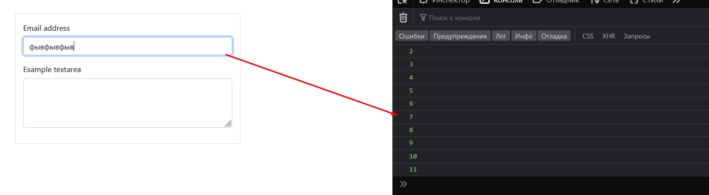

Так же мы можем использовать реф для сохранения предыдущего состояния компонента. Конкретно тут после записи в первый `input` его прошлое состояние переносится в `textarea` 

```JS
const Form = () => {
	const [text, setText] = useState('');

	const myRef = useRef(1);

	useEffect(() => {
		myRef.current = text;
	});

	return (
		<Container>
			<form className='w-50 border mt-5 p-3 m-auto'>
				<div className='mb-3'>
					<label htmlFor='exampleFormControlInput1' className='form-label'>
						Email address
					</label>
					<input
						onChange={(e) => setText(e.target.value)}
						type='email'
						className='form-control'
						id='exampleFormControlInput1'
						placeholder='name@example.com'
					/>
				</div>
				<div className='mb-3'>
					<label htmlFor='exampleFormControlTextarea1' className='form-label'>
						Example textarea
					</label>
					<textarea
						value={myRef.current}
						className='form-control'
						id='exampleFormControlTextarea1'
						rows='3'
					></textarea>
				</div>
			</form>
		</Container>
	);
};
```
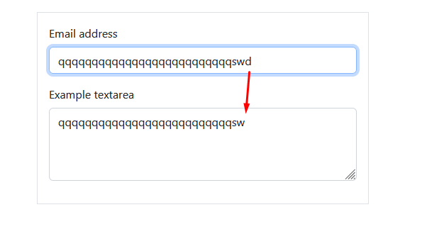


## 007 Практика. Перепишем весь проект на хуки


Далее можно попробовать перевести весь старый проект с классов на хуки

Основной компонент персонажа:

`components > app > App.js`
```JS
const App = () => {
	const [selectedChar, setSelectedChar] = useState(null);

	const onCharSelected = (id) => {
		setSelectedChar(id);
	};

	return (
		<div className='app'>
			<AppHeader />
			<main>
				<ErrorBoundary>
					<RandomChar />
				</ErrorBoundary>
				<div className='char__content'>
					<ErrorBoundary>
						<CharList onCharSelected={onCharSelected} />
					</ErrorBoundary>
					<ErrorBoundary>
						<CharInfo charId={selectedChar} />
					</ErrorBoundary>
				</div>
				
			</main>
		</div>
	);
};
```

`components > CharList > CharList.js`
```JS
const CharList = ({ onCharSelected }) => {
	const [charList, setCharList] = useState([]);
	const [loading, setLoading] = useState(true);
	const [error, setError] = useState(false);
	const [newItemLoading, setNewItemLoading] = useState(false);
	const [offset, setOffset] = useState(210);
	const [charEnded, setCharEnded] = useState(false);

	const marvelService = new MarvelService();

	useEffect(() => {
		onRequest();
	}, []);

	const onRequest = (offset) => {
		onCharListLoading();
		marvelService.getAllCharacters(offset).then(onCharListLoaded).catch(onError);
	};

	const onCharListLoading = () => {
		setNewItemLoading(true);
	};

	const onCharListLoaded = (newCharList) => {
		let ended = false;
		if (newCharList.length < 9) {
			ended = true;
		}

		setCharList((charList) => [...charList, ...newCharList]);
		setLoading(false);
		setNewItemLoading((newItemLoading) => false);
		setOffset((offset) => offset + 9);
		setCharEnded(ended);
	};

	const onError = () => {
		setError(true);
		setLoading(false);
	};

	const itemRefs = useRef([]);

	const focusOnItem = (id) => {
		itemRefs.current.forEach((item) => item.classList.remove('char__item_selected'));
		itemRefs.current[id].classList.add('char__item_selected');
		itemRefs.current[id].focus();
	};

	const renderItems = (arr) => {
		const items = arr.map((item, i) => {
			let imgStyle = { objectFit: 'cover' };
			if (
				item.thumbnail ===
				'http://i.annihil.us/u/prod/marvel/i/mg/b/40/image_not_available.jpg'
			) {
				imgStyle = { objectFit: 'unset' };
			}

			return (
				<li
					className='char__item'
					tabIndex={0}
					ref={(element) => (itemRefs.current[i] = element)}
					key={item.id}
					onClick={() => {
						onCharSelected(item.id);
						focusOnItem(i);
					}}
					onKeyDown={(e) => {
						if (e.key === ' ' || e.key === 'Enter') {
							onCharSelected(item.id);
							focusOnItem(i);
						}
					}}
				>
					
					<div className='char__name'>{item.name}</div>
				</li>
			);
		});

		return <ul className='char__grid'>{items}</ul>;
	};

	const items = renderItems(charList);

	const errorMessage = error ? <ErrorMessage /> : null;
	const spinner = loading ? <Spinner /> : null;
	const content = !(loading || error) ? items : null;

	return (
		<div className='char__list'>
			{errorMessage}
			{spinner}
			{content}
			<button
				className='button button__main button__long'
				disabled={newItemLoading}
				style={{ display: charEnded ? 'none' : 'block' }}
				onClick={() => onRequest(offset)}
			>
				<div className='inner'>load more</div>
			</button>
		</div>
	);
};
```

Тут нужно упомянуть, что мы используем стрелочную функцию выше её инициализации в коде. Это будет работать, так как `useEffect` срабатывает уже после рендера компонента

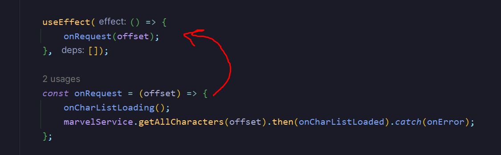

Так же такой короткой записью можно показать, какой аргумент получает функция (`newItemLoading`) и что она вернёт наружу (`false`).

Стрелочные функции используются для того, чтобы асинхронное выполнение установки состояния перевести в синхронное и выполнять по порядку. Так же использование колбэк-функции позволяет воспользоваться значением прошлого состояния 


Перевод рефов будет чуть более сложным. Когда мы работаем с хуками, то у нас появляется свойство `current`, в которое и нужно заносить значения хука. Просто так добавить в реф ссылку не получится.

Для этого инициализируем `useRef`, передаём в него массив, обращаемся в методе фокуса к свойству `current`

И далее уже в самом рендере будет вызываться функция, которая сформирует массив ссылок на те элементы, которые сгенерируются внутри мапы

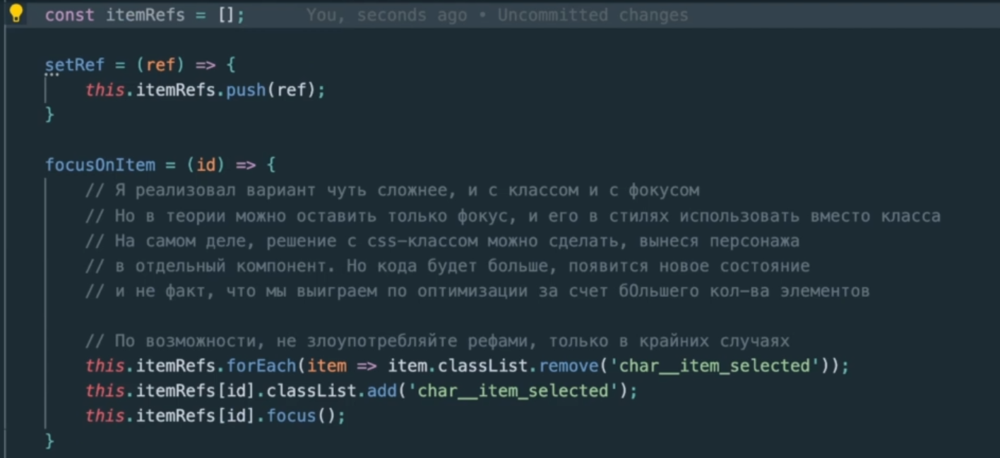
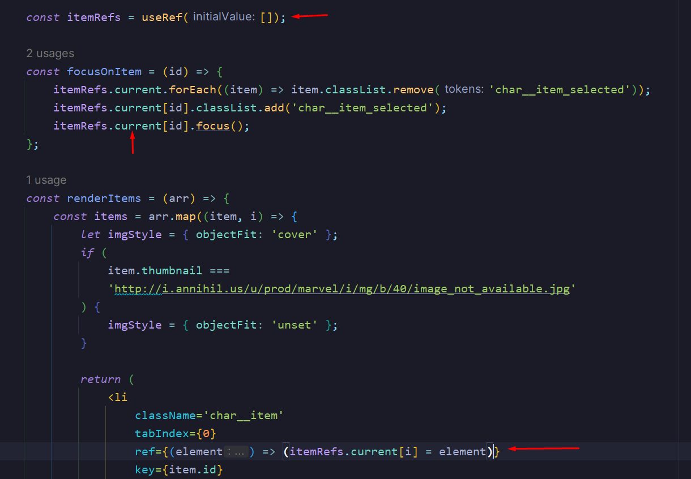

Дальше идёт компонент информации о персонаже:

`components > CharInfo > CharInfo.js`
```JS
const CharInfo = (props) => {
	const [char, setChar] = useState(null);
	const [loading, setLoading] = useState(false);
	const [error, setError] = useState(false);

	const marvelService = new MarvelService();

	useEffect(() => {
		updateChar();
	}, [props.charId]);

	const updateChar = () => {
		const { charId } = props;
		if (!charId) {
			return;
		}
		onCharLoading();
		marvelService.getCharacter(charId).then(onCharLoaded).catch(onError);
	};

	const onCharLoaded = (char) => {
		setLoading(false);
		setChar(char);
	};

	const onCharLoading = () => {
		setLoading(true);
	};

	const onError = () => {
		setError(true);
		setLoading(false);
	};

	const skeleton = char || loading || error ? null : <Skeleton />;
	const errorMessage = error ? <ErrorMessage /> : null;
	const spinner = loading ? <Spinner /> : null;
	const content = !(loading || error || !char) ? <View char={char} /> : null;

	return (
		<div className='char__info'>
			{skeleton}
			{errorMessage}
			{spinner}
			{content}
		</div>
	);
};

const View = ({ char }) => {
	const { name, description, thumbnail, homepage, wiki, comics } = char;

	let imgStyle = { objectFit: 'cover' };
	if (thumbnail === 'http://i.annihil.us/u/prod/marvel/i/mg/b/40/image_not_available.jpg') {
		imgStyle = { objectFit: 'contain' };
	}

	return (
		<>
			<div className='char__basics'>
				
				<div>
					<div className='char__info-name'>{name}</div>
					<div className='char__btns'>
						<a href={homepage} className='button button__main'>
							<div className='inner'>homepage</div>
						</a>
						<a href={wiki} className='button button__secondary'>
							<div className='inner'>Wiki</div>
						</a>
					</div>
				</div>
			</div>
			<div className='char__descr'>{description}</div>
			<div className='char__comics'>Comics:</div>
			<ul className='char__comics-list'>
				{comics.length > 0 ? null : 'There is no comics with this character'}
				{comics.map((item, i) => {
					// eslint-disable-next-line
					if (i > 9) return;
					return (
						<li key={i} className='char__comics-item'>
							{item.name}
						</li>
					);
				})}
			</ul>
		</>
	);
};

CharInfo.propTypes = {
	charId: PropTypes.number,
};

export default CharInfo;
```

И компонент рандомного персонажа:

`components > RandomChar > RandomChar.js`
```JS
const RandomChar = () => {
	const [char, setChar] = useState(null);
	const [loading, setLoading] = useState(true);
	const [error, setError] = useState(false);

	const marvelService = new MarvelService();

	useEffect(() => {
		updateChar();
		const timerId = setInterval(updateChar, 60000);

		return () => {
			clearInterval(timerId);
		};
	}, []);

	const onCharLoaded = (char) => {
		setLoading(false);
		setChar(char);
	};

	const onCharLoading = () => {
		setLoading(true);
	};

	const onError = () => {
		setError(true);
		setLoading(false);
	};

	const updateChar = () => {
		const id = Math.floor(Math.random() * (1011400 - 1011000)) + 1011000;
		onCharLoading();
		marvelService.getCharacter(id).then(onCharLoaded).catch(onError);
	};

	const errorMessage = error ? <ErrorMessage /> : null;
	const spinner = loading ? <Spinner /> : null;
	const content = !(loading || error || !char) ? <View char={char} /> : null;

	return (
		<div className='randomchar'>
			{errorMessage}
			{spinner}
			{content}
			<div className='randomchar__static'>
				<p className='randomchar__title'>
					Random character for today!
					<br />
					Do you want to get to know him better?
				</p>
				<p className='randomchar__title'>Or choose another one</p>
				<button onClick={updateChar} className='button button__main'>
					<div className='inner'>try it</div>
				</button>
				
			</div>
		</div>
	);
};

const View = ({ char }) => {
	const { name, description, thumbnail, homepage, wiki } = char;
	let imgStyle = { objectFit: 'cover' };
	if (thumbnail === 'http://i.annihil.us/u/prod/marvel/i/mg/b/40/image_not_available.jpg') {
		imgStyle = { objectFit: 'contain' };
	}

	return (
		<div className='randomchar__block'>
			
			<div className='randomchar__info'>
				<p className='randomchar__name'>{name}</p>
				<p className='randomchar__descr'>{description}</p>
				<div className='randomchar__btns'>
					<a href={homepage} className='button button__main'>
						<div className='inner'>homepage</div>
					</a>
					<a href={wiki} className='button button__secondary'>
						<div className='inner'>Wiki</div>
					</a>
				</div>
			</div>
		</div>
	);
};

export default RandomChar;
```


## 008 Создание собственных хуков


```JS
const Form = () => {
	const [text, setText] = useState('');

	return (
		<Container>
			<form className='w-50 border mt-5 p-3 m-auto'>
				<div className='mb-3'>
					<input 
						value={text} 
						type='text' 
						className='form-control' 
						readOnly 
					/>
					<label 
						htmlFor='exampleFormControlInput1' 
						className='form-label mt-3'
					>
						Email address
					</label>
					<input
						onChange={(e) => setText(e.target.value)}
						type='email'
						className='form-control'
						id='exampleFormControlInput1'
						placeholder='name@example.com'
					/>
				</div>
				<div className='mb-3'>
					<label 
						htmlFor='exampleFormControlTextarea1' 
						className='form-label'
					>
						Example textarea
					</label>
					<textarea
						className='form-control'
						id='exampleFormControlTextarea1'
						rows='3'
					></textarea>
				</div>
			</form>
		</Container>
	);
};
```

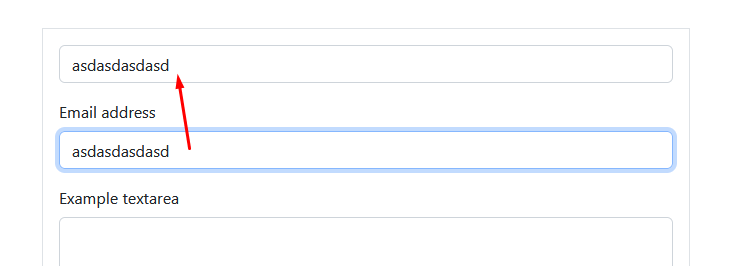


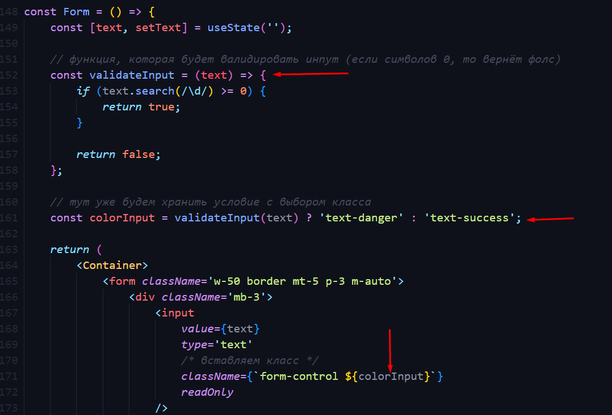

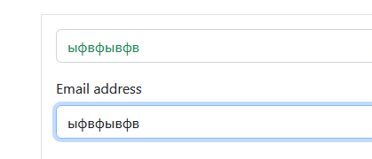
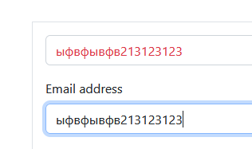


```JS
// первая версия
const validateInput = (text) => {
	if (text.search(/\d/) >= 0) {
		return true;
	}

	return false;
};

// вторая версия
const validateInput = (text) => {
	return text.search(/\d/) >= 0 ? true : false;
};

// третья версия
const validateInput = (text) => {
	return text.search(/\d/) >= 0;
};
```

И сейчас мы добавили в работу ещё одно поле для ввода текста - код был повторён. 
Тут мы сталкиваемся с такой ситуацией, что мы постоянно повторяем код, который написали единожды

```JS
const Form = () => {
	const [text, setText] = useState('');
	const [textArea, setTextArea] = useState('');

	// функция, которая будет валидировать инпут (если символов 0, то вернёт фолс)
	const validateInput = (text) => {
		return text.search(/\d/) >= 0;
	};

	// тут уже будем хранить условие с выбором класса
	const colorInput = validateInput(text) ? 'text-danger' : 'text-success';

	return (
		<Container>
			<form className='w-50 border mt-5 p-3 m-auto'>
				<div className='mb-3'>
					<input
						/* вставляем текст с нескольких инпутов */
						value={`${text} / ${textArea}`}
						type='text'
						/* вставляем класс */
						className={`form-control ${colorInput}``}
						readOnly
					/>
					<label 
						htmlFor='exampleFormControlInput1' 
						className='form-label mt-3'>
						Email address
					</label>
					<input
						onChange={(e) => setText(e.target.value)}
						type='email'
						className='form-control'
						id='exampleFormControlInput1'
						placeholder='name@example.com'
					/>
				</div>
				<div className='mb-3'>
					<label 
						htmlFor='exampleFormControlTextarea1' 
						className='form-label'>
						Example textarea
					</label>
					<textarea
						/* установка нвого состояния */
						onChange={(e) => setTextArea(e.target.value)}
						className='form-control'
						id='exampleFormControlTextarea1'
						rows='3'
					></textarea>
				</div>
			</form>
		</Container>
	);
};
```

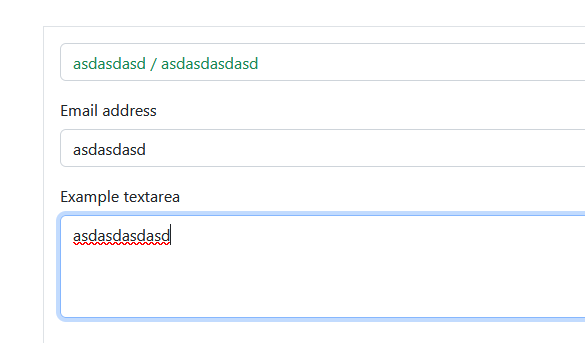

И теперь мы можем выделить всю вышеописанную повторяемую логику в отдельный хук. Кастомный хук - это механизм повторого использования логики с состоянием.

Таким образом выглядит классический кастомный хук. Обычно он возвращает несколько объектов в массиве и сохраняет в себе определённую логику

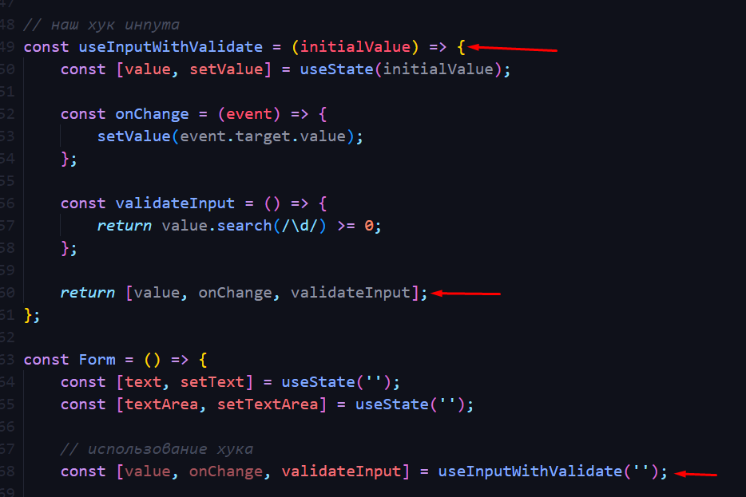

Либо мы можем собрать всю логику хука в отдельную переменную, если возвращать из него объект. Такой подход позволит создать несколько независимых объектов

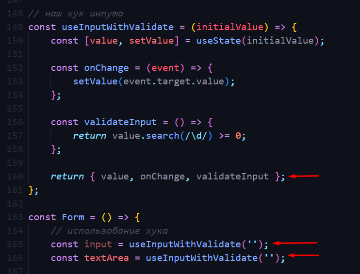

Пример использования хука внутри компонента:
- Инициализируем хук два раза для двух наших элементов формы
- Мы не передаём внутрь функции `validateInput` текст (переменная `colorInput`), так как он берётся из внутреннего состояния хука, который относится к данному инпуту 
- В элементы мы передаём `value` и `onChange`, которые относятся к инкапсулированной логике их хуков

```JS
const useInputWithValidate = (initialValue) => {
	const [value, setValue] = useState(initialValue);

	const onChange = (event) => {
		setValue(event.target.value);
	};

	const validateInput = () => {
		return value.search(/\d/) >= 0;
	};

	return { value, onChange, validateInput };
};

const Form = () => {
	// использование хука
	const input = useInputWithValidate('');
	const textArea = useInputWithValidate('');

	const colorInput = input.validateInput() ? 'text-danger' : 'text-success';

	return (
		<Container>
			<form className='w-50 border mt-5 p-3 m-auto'>
				<div className='mb-3'>
					<input
						/* вставляем текст с нескольких инпутов */
						value={`${input.value} / ${textArea.value}`}
						type='text'
						/* вставляем класс */
						className={`form-control ${colorInput}``}
						readOnly
					/>
					<label 
						htmlFor='exampleFormControlInput1' 
						className='form-label mt-3'
					>
						Email address
					</label>
					<input
						// установим изменение состояния из хука
						onChange={input.onChange}
						// значение инпута
						value={input.value}
						type='email'
						className='form-control'
						id='exampleFormControlInput1'
						placeholder='name@example.com'
					/>
				</div>
				<div className='mb-3'>
					<label 
						htmlFor='exampleFormControlTextarea1' 
						className='form-label'
					>
						Example textarea
					</label>
					<textarea
						// установим изменение состояния из хука
						onChange={textArea.onChange}
						// значение инпута
						value={textArea.value}
						className='form-control'
						id='exampleFormControlTextarea1'
						rows='3'
					></textarea>
				</div>
			</form>
		</Container>
	);
};
```

Итог: мы имеем оптимизированную форму

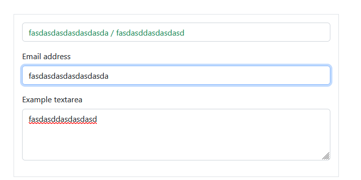

Так же можно взглянуть на:
- [Топ 10 библиотек хуков в реакте](https://www.bornfight.com/blog/top-10-react-hook-libraries/)
- [Гид по своим хукам в реакте](https://usehooks.com/)

Пример хука тогглера из второй ссылки:

```JS
import { useCallback, useState } from 'react';
// Usage
function App() {
    // Call the hook which returns, current value and the toggler function
    const [isTextChanged, setIsTextChanged] = useToggle();
    
    return (
        <button 
	        onClick={setIsTextChanged}
	    >
	        {isTextChanged ? 'Toggled' : 'Click to Toggle'}
	    </button>
    );
}
// Hook
// Parameter is the boolean, with default "false" value
const useToggle = (initialState = false) => {
    // Initialize the state
    const [state, setState] = useState(initialState);
    
    // Define and memorize toggler function in case we pass down the component,
    // This function change the boolean value to it's opposite value
    const toggle = useCallback(() => setState(state => !state), []);
    
    return [state, toggle]
}
```


## 009 Практика собственных хуков на проекте


Создадим хук, который будет получать данные о персонажах с сервера и выдавать их. Так же он будет контролировать состояние загрузки и ошибки 

`src > hooks > http.hook.js`
```JS
import { useCallback, useState } from 'react';

export const useHttp = () => {
	const [loading, setLoading] = useState(false);
	const [error, setError] = useState(null); // == false

	// эта функция будет выполнять запрос на сервер и возвращать данные
	const request = useCallback(
		async (
			url,
			method = 'GET',
			body = null,
			headers = { 'Content-type': 'application/json' },
		) => {
			// поставим загрузку
			setLoading(true);

			try {
				// отправляем запрос на сервер
				const response = await fetch(url, { method, body, headers });

				// если запрос не ок, то выкидываем ошибку
				if (!response.ok) {
					throw new Error(`Could not fetch ${url}, status: ${response.status}`);
				}

				// распарсим данные
				const data = await response.json();

				// окончим загрузку
				setLoading(false);

				// вернём данные
				return data;
			} catch (e) {
				setLoading(false);
				setError(e.message);
				throw e;
			}
		},
		[],
	);

	// чтобы избежать бага, когда у нас будет постоянно висеть ошибка, нам нужно очищать эту ошибку
	const clearError = useCallback(() => setError(false), []);

	return { loading, request, error, clearError };
};
```

Далее нужно переделать сервис по общению с сервером под хуки и встроить в его запросы `request` из прошлого хука

`src > services > marvel.service.js`
```JS
import { useHttp } from '../hooks/http.hook';

const useMarvelService = () => {
	const { request, loading, error, clearError } = useHttp();

	const _apiBase = 'https://gateway.marvel.com:443/v1/public/';
	const _apiKey = 'apikey=abfdaba95091affea928543eb9253ded';
	const _baseOffsetForPerson = 210;
	const _baseOffsetForComics = 210;

	const getAllCharacters = async (offset = _baseOffsetForPerson) => {
		const res = await request(`${_apiBase}characters?limit=9&offset=${offset}&${_apiKey}`);

		return res.data.results.map(_transformCharacter);
	};

	const getCharacter = async (id) => {
		const res = await request(`${_apiBase}characters/${id}?${_apiKey}`);
		return _transformCharacter(res.data.results[0]);
	};

	const _transformCharacter = (char) => {
		return {
			id: char.id,
			name: char.name,
			description: char.description
				? char.description.slice(0, 150) + '...'
				: 'No description for this person',
			thumbnail: char.thumbnail.path + '.' + char.thumbnail.extension,
			homepage: char.urls[0].url,
			wiki: char.urls[1].url,
			comics: char.comics.items,
		};
	};

	return { loading, error, clearError, getCharacter, getAllCharacters };
};

export default useMarvelService;

```

Далее нужно поменять общение с сервером в остальных компонентах. 

Чтобы всё работало нормально, нужно так же правильно вставить `clearError`.

`src > component > randomChar > RandomChar.js`
```JS
import { Component, useEffect, useState } from 'react';
import Spinner from '../Spinner/Spinner';
import ErrorMessage from '../ErrorMessage/ErrorMessage';

import './randomChar.scss';
import mjolnir from '../../resources/img/mjolnir.png';
import useMarvelService from '../../services/marvel.service';

const RandomChar = () => {
	const [char, setChar] = useState(null);

	// отсюда получаем состояния и функцию
	const { loading, error, clearError, getCharacter } = useMarvelService();

	useEffect(() => {
		updateChar();
		const timerId = setInterval(updateChar, 60000);

		return () => {
			clearInterval(timerId);
		};
	}, []);

	// тут уже просто устанавливаем персонажа
	const onCharLoaded = (char) => {
		setChar(char);
	};

	const updateChar = () => {
		// тут нужно сбросить ошибку, чтобы появилась возможность обновить персонажа
		clearError();

		const id = Math.floor(Math.random() * (1011400 - 1011000)) + 1011000;

		// вся логика получения данных описана в хуке
		getCharacter(id).then(onCharLoaded);
	};

	// тут берутся состояния ошибки и загрузки из состояния
	const errorMessage = error ? <ErrorMessage /> : null;
	const spinner = loading ? <Spinner /> : null;
	const content = !(loading || error || !char) ? <View char={char} /> : null;

	return (
		<div className='randomchar'>
			{errorMessage}
			{spinner}
			{content}
			<div className='randomchar__static'>
				<p className='randomchar__title'>
					Random character for today!
					<br />
					Do you want to get to know him better?
				</p>
				<p className='randomchar__title'>Or choose another one</p>
				<button onClick={updateChar} className='button button__main'>
					<div className='inner'>try it</div>
				</button>
				
			</div>
		</div>
	);
};

const View = ({ char }) => {
	const { name, description, thumbnail, homepage, wiki } = char;
	let imgStyle = { objectFit: 'cover' };
	if (thumbnail === 'http://i.annihil.us/u/prod/marvel/i/mg/b/40/image_not_available.jpg') {
		imgStyle = { objectFit: 'contain' };
	}

	return (
		<div className='randomchar__block'>
			
			<div className='randomchar__info'>
				<p className='randomchar__name'>{name}</p>
				<p className='randomchar__descr'>{description}</p>
				<div className='randomchar__btns'>
					<a href={homepage} className='button button__main'>
						<div className='inner'>homepage</div>
					</a>
					<a href={wiki} className='button button__secondary'>
						<div className='inner'>Wiki</div>
					</a>
				</div>
			</div>
		</div>
	);
};

export default RandomChar;
```

Для правильного перерендера объектов карточек, нужно убрать использование переменной `content` и использовать просто `items`, который у нас генерирует другая функция. 

`src > component > charList > CharList.js`
```JS
import { Component, useEffect, useRef, useState } from 'react';
import Spinner from '../Spinner/Spinner';
import ErrorMessage from '../ErrorMessage/ErrorMessage';
import MarvelService from '../../services/marvel.service';
import './charList.scss';
import useMarvelService from '../../services/marvel.service';

const CharList = ({ onCharSelected }) => {
	const [charList, setCharList] = useState([]);
	const [newItemLoading, setNewItemLoading] = useState(false);
	const [offset, setOffset] = useState(210);
	const [charEnded, setCharEnded] = useState(false);

	// получаем нужные состояния и функцию
	const { getAllCharacters, error, loading } = useMarvelService();

	useEffect(() => {
		onRequest(offset, true);
	}, []);

	// удаляем функцию для установки setNewItemLoading и переносим все внутренности сюда
	const onRequest = (offset, initial) => {
		// если загрузка первая, то нужно оставить установку новых карточек в false
		initial ? setNewItemLoading(false) : setNewItemLoading(true);
		getAllCharacters(offset).then(onCharListLoaded);
	};

	const onCharListLoaded = (newCharList) => {
		let ended = false;
		if (newCharList.length < 9) {
			ended = true;
		}

		// убираем setLoading
		setCharList((charList) => [...charList, ...newCharList]);
		setNewItemLoading((newItemLoading) => false);
		setOffset((offset) => offset + 9);
		setCharEnded(ended);
	};

	const itemRefs = useRef([]);

	const focusOnItem = (id) => {
		itemRefs.current.forEach((item) => item.classList.remove('char__item_selected'));
		itemRefs.current[id].classList.add('char__item_selected');
		itemRefs.current[id].focus();
	};

	const renderItems = (arr) => {
		const items = arr.map((item, i) => {
			let imgStyle = { objectFit: 'cover' };
			if (
				item.thumbnail ===
				'http://i.annihil.us/u/prod/marvel/i/mg/b/40/image_not_available.jpg'
			) {
				imgStyle = { objectFit: 'unset' };
			}

			return (
				<li
					className='char__item'
					tabIndex={0}
					ref={(element) => (itemRefs.current[i] = element)}
					key={item.id}
					onClick={() => {
						onCharSelected(item.id);
						focusOnItem(i);
					}}
					onKeyDown={(e) => {
						if (e.key === ' ' || e.key === 'Enter') {
							onCharSelected(item.id);
							focusOnItem(i);
						}
					}}
				>
					
					<div className='char__name'>{item.name}</div>
				</li>
			);
		});

		return <ul className='char__grid'>{items}</ul>;
	};

	const items = renderItems(charList);

	const errorMessage = error ? <ErrorMessage /> : null;
	// спиннер нужно показывать только тогда, когда у нас loading !!
	const spinner = loading && !newItemLoading ? <Spinner /> : null;

	// уже эту строку нужно удалить, так как наш компонент пересоздаётся, что приводит к перерисовке всех элементов списка
	// const content = !(loading || error) ? items : null;

	return (
		<div className='char__list'>
			{errorMessage}
			{spinner}

			{/* и теперь тут рендерим не content, а items */}
			{items}
			<button
				className='button button__main button__long'
				disabled={newItemLoading}
				style={{ display: charEnded ? 'none' : 'block' }}
				onClick={() => onRequest(offset)}
			>
				<div className='inner'>load more</div>
			</button>
		</div>
	);
};

export default CharList;
```

В `CharInfo` нужно просто поменять общение с сервером на хуковый и добавить очистку ошибки, если сервер не сможет вернуть данные (чтобы в принципе информация обновлялась)

`src > component > charInfo > CharInfo.js`
```JS
import { Component, useEffect, useState } from 'react';

import MarvelService from '../../services/marvel.service';
import Spinner from '../Spinner/Spinner';
import ErrorMessage from '../ErrorMessage/ErrorMessage';
import Skeleton from '../skeleton/Skeleton';

import './charInfo.scss';
import PropTypes from 'prop-types';
import useMarvelService from '../../services/marvel.service';

const CharInfo = (props) => {
	const [char, setChar] = useState(null);

	const { loading, error, clearError, getCharacter } = useMarvelService();

	useEffect(() => {
		updateChar();
	}, [props.charId]);

	const updateChar = () => {
		// тут нужно сбросить ошибку, чтобы появилась возможность обновить персонажа
		clearError();

		const { charId } = props;
		if (!charId) {
			return;
		}
		getCharacter(charId).then(onCharLoaded);
	};

	const onCharLoaded = (char) => {
		setChar(char);
	};

	const skeleton = char || loading || error ? null : <Skeleton />;
	const errorMessage = error ? <ErrorMessage /> : null;
	const spinner = loading ? <Spinner /> : null;
	const content = !(loading || error || !char) ? <View char={char} /> : null;

	return (
		<div className='char__info'>
			{skeleton}
			{errorMessage}
			{spinner}
			{content}
		</div>
	);
};

const View = ({ char }) => {
	const { name, description, thumbnail, homepage, wiki, comics } = char;

	let imgStyle = { objectFit: 'cover' };
	if (thumbnail === 'http://i.annihil.us/u/prod/marvel/i/mg/b/40/image_not_available.jpg') {
		imgStyle = { objectFit: 'contain' };
	}

	return (
		<>
			<div className='char__basics'>
				
				<div>
					<div className='char__info-name'>{name}</div>
					<div className='char__btns'>
						<a href={homepage} className='button button__main'>
							<div className='inner'>homepage</div>
						</a>
						<a href={wiki} className='button button__secondary'>
							<div className='inner'>Wiki</div>
						</a>
					</div>
				</div>
			</div>
			<div className='char__descr'>{description}</div>
			<div className='char__comics'>Comics:</div>
			<ul className='char__comics-list'>
				{comics.length > 0 ? null : 'There is no comics with this character'}
				{comics.map((item, i) => {
					// eslint-disable-next-line
					if (i > 9) return;
					return (
						<li key={i} className='char__comics-item'>
							{item.name}
						</li>
					);
				})}
			</ul>
		</>
	);
};

CharInfo.propTypes = {
	charId: PropTypes.number,
};

export default CharInfo;
```


## 010 Что такое batching и как он работает в React 18+


==**Batching**== - это объединение обновления нескольких состояний в одну операцию для улучшения производительности. 
Объединение нескольких обновлений позволяет экономить ресурсы ПК за счёт единоразового перерендера

У нас есть функция, которая вызывает внутри себя срабатывание изменения двух разных состояний, то есть компонент должен перерендерится два раза и вывести два лога в консоль

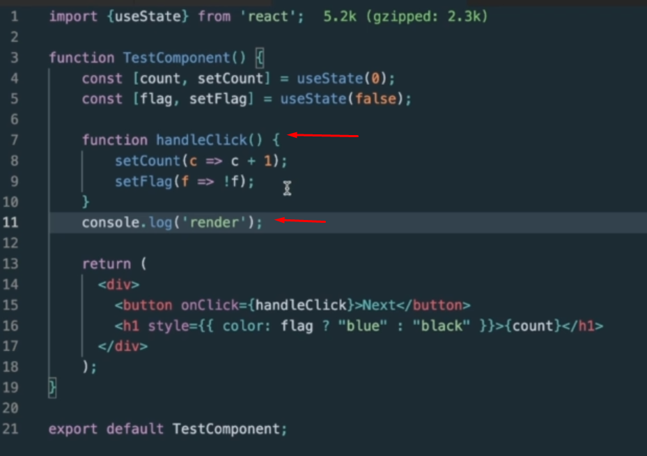

Однако при каждом срабатывании функции и изменении двух состояний, мы получаем только один лог в консоль - обе эти операции совмещаются 

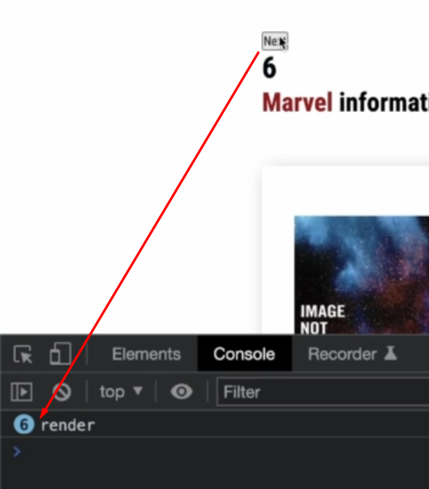

Но если поместить вызов изменения внутрь колбэка (то есть изменения происходят асинхронно), то мы будем получать два лога в консоль, так как эти состояния будут меняться отдельно друг от друга и каждый раз обновлять компонент

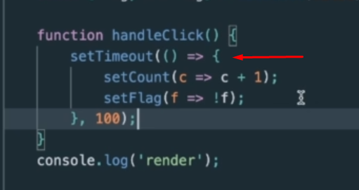

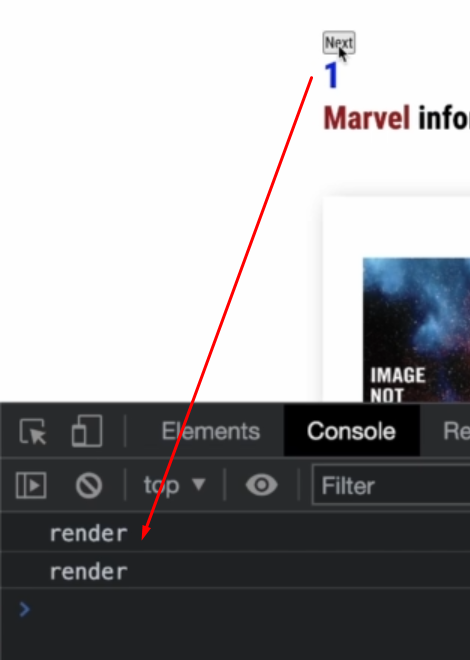

Так же если запихнуть `log()` в компонент `CharList`, то в консоли выведется сразу несколько таких логов, так как наши изменения состояний находятся в асинхронных функциях

Однако тут используется версия `React 18`, в котором оптимизированы некоторые изменения состояний и их бэтчинг, что сокращает количество перерендеров

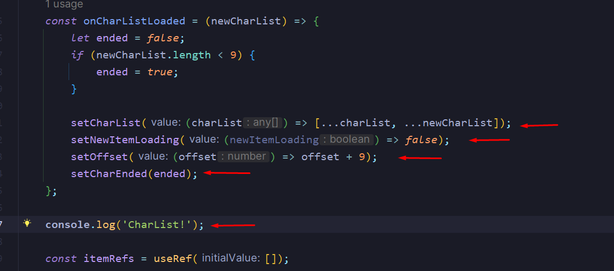

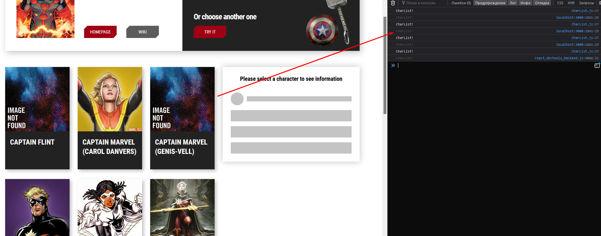

Однако, если нам нужно разъединить операции обновления, то мы можем воспользоваться функцией `flushSync` (эту функцию нужно использовать отдельно на каждую операцию)

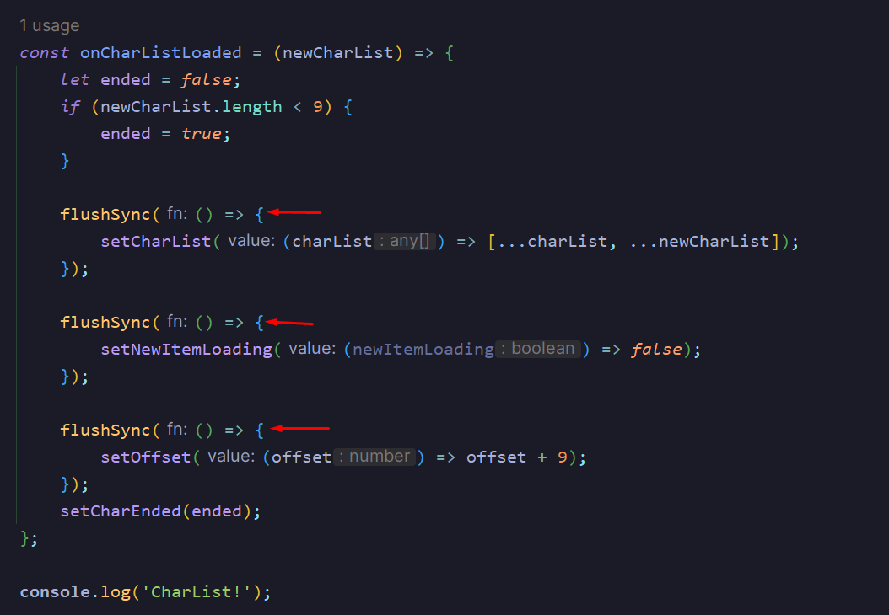

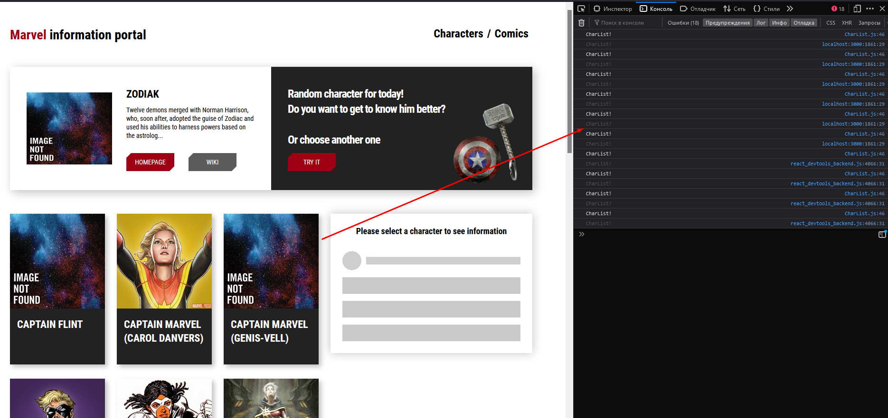


## 011 (д) useTransition, useDeferredValue и другие нововведения React 18+


`useId()` - генерирует уникальный идентификатор (он не должен использоваться для формирования атрибута `key`)

```JS
function Checkbox() {
  const id = useId(); // сгенерирует уникальный ключ
  return (
    <>
      <label htmlFor={id}>Do you like React?</label>
      <input id={id} type="checkbox" name="react"/>
    </>
  );
```

Так же были добавлены хуки для интеграции сторонних библиотек:
-   [`useSyncExternalStore`](https://ru.reactjs.org/docs/hooks-reference.html#usesyncexternalstore)
-   [`useInsertionEffect`](https://ru.reactjs.org/docs/hooks-reference.html#useinsertioneffect)

Конкурентный режим — это нововведение в React. Его задача — адаптировать приложение к разным устройствам и скорости сети. Пока что Concurrent Mode — эксперимент, который может быть изменён разработчиками библиотеки, а значит, новых инструментов нет в стабильной версии.

Сам конкурентный режим может ставить на рендер сразу несколько компонентов или ставить их на паузу определяя приоритет


```JS
import data from './data';
import {useState, useMemo} from 'react';

function App() {
    const [text, setText] = useState('');
    const [posts, setPosts] = useState(data);

    const filteredPosts = useMemo(() => {
        return posts.filter(item => item.name.toLowerCase().includes(text));
    }, [text]);

    const onValueChange = (e) => {
        setText(e.target.value);
    }

    return (
        <>
            <input value={text} type='text' onChange={onValueChange}/>

            <hr/>

            <div>
                {filteredPosts.map(post => (
                    <div key={post._id}>
                        <h4>{post.name}</h4>
                    </div>
                ))}
            </div>
        </>
    );
}

export default App;
```


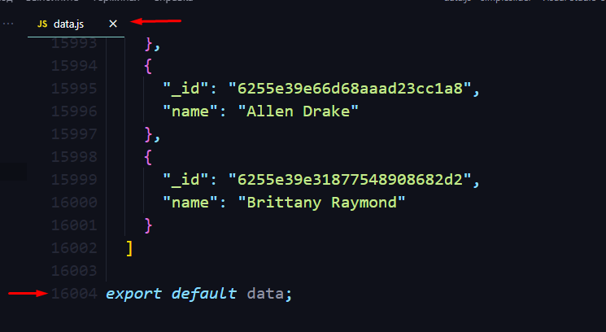

И сейчас мы столкнулись с такой проблемой, что ввод в инпут очень сильно лагает. Дело в том, что наш стейт меняется сразу при вводе новых данных, что тормозит ввод новых символов из-за постоянного рендера

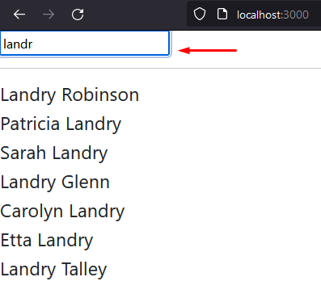

`useDeferredValue()` - данный хук позволит получить нужное нам значение с небольшим интервалом, чтобы задержать рендер компонента

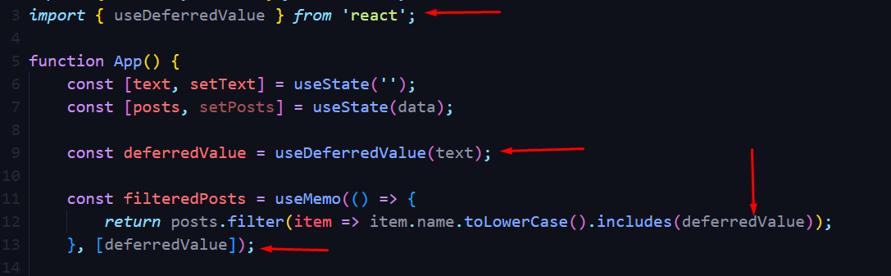

`useTransition()` - так же позволяет задержать перерендер компонента, но предоставляет возможность самому указать, что будет в интервале и как на него реагировать

Хук возвращает нам булеан ожидания рендера `isPending` и функцию, в которой будет находиться функция, которая выполняется длительное время. Далее нам нужно будет только сделать условный рендеринг, куда мы вставим спиннер (или другой элемент для ожидания загрузки)

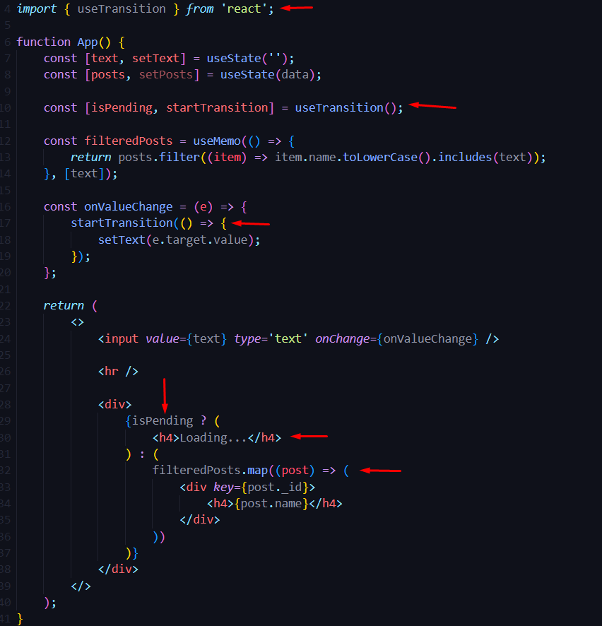

И тут появляется элемент загрузки

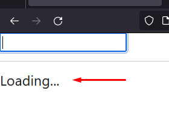


## 012 Навигация в приложении, React Router v5+


Сейчас имеется сразу несколько версий реакт-роутер-дома, но стоит начать с пятой 

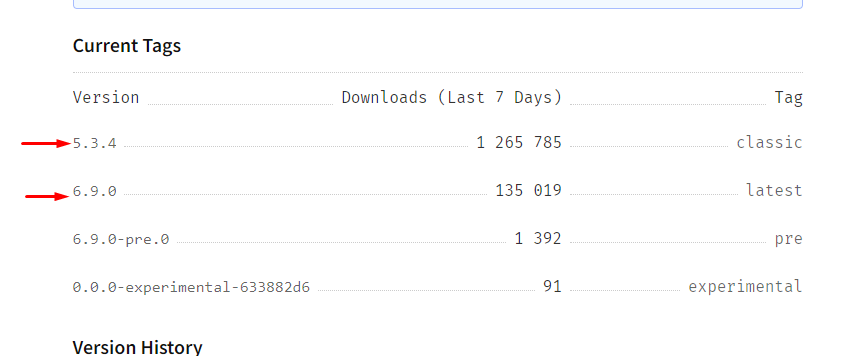

Устанавливаем нужную нам версию через `@версия`

```bash
npm i react-router-dom@5.3.4
```

И далее нам нужно закинуть в проект три компонента из роутер-дома:
- `BrowserRouter` - роутер по всем страницам приложения (отслеживает переход по ссылкам)
- `Route` - отдельный роут приложения
- `Switch` 

И далее обернём все наши страницы подобным образом:
- В `BrowserRouter` (который переименовали в `Router`) поместим всё наше приложение
- А в отдельный `Route` поместим компоненты, которые должны рендериться на отдельной странице

`components > app > App.js`
```JS
import { useState } from 'react';
import { BrowserRouter as Router, Route, Switch } from 'react-router-dom';

const App = () => {
	const [selectedChar, setSelectedChar] = useState(null);

	const onCharSelected = (id) => {
		setSelectedChar(id);
	};

	return (
		<Router>
			<div className='app'>
				<AppHeader />
				<main>
					<Route path={'/'}>
						<ErrorBoundary>
							<RandomChar />
						</ErrorBoundary>
						<div className='char__content'>
							<ErrorBoundary>
								<CharList onCharSelected={onCharSelected} />
							</ErrorBoundary>
							<ErrorBoundary>
								<CharInfo charId={selectedChar} />
							</ErrorBoundary>
						</div>
						
					</Route>
					<Route path={'/comics'}>
						<AppBanner />
						<ComicsList />
					</Route>
				</main>
			</div>
		</Router>
	);
};

export default App;
```

Но тут стоит заметить, что роутер компонует между собой элементы с ссылками, которые хранят одинаковые значения. То есть в данном случае первый роут и второй объединятся, так как `/` и `/comics` имеют при себе слеш

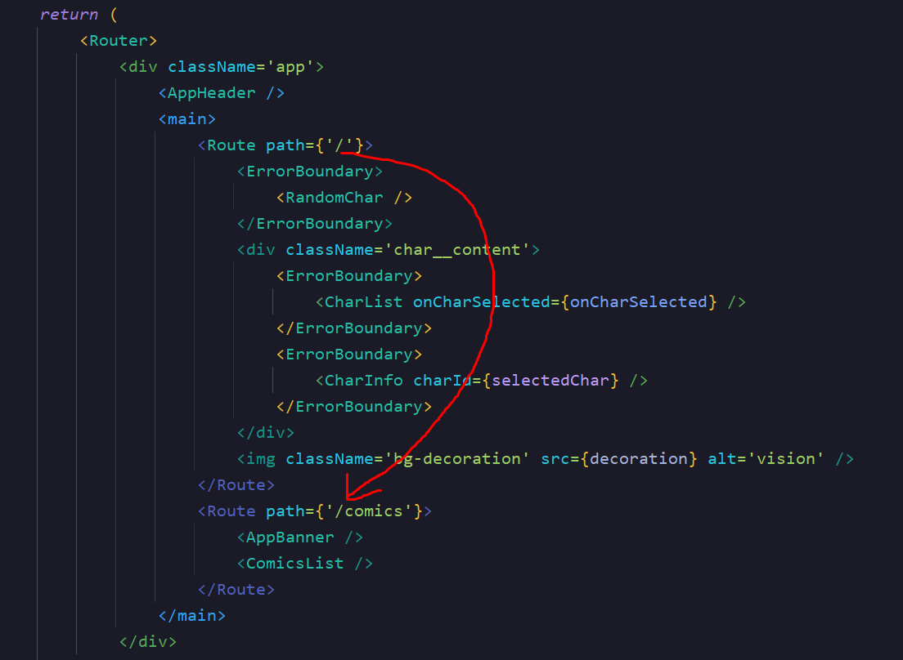

И при переходе на `/comics` у нас будет следующая картина:

Такой подход был бы уместен, если мы заранее спланировали бы вёрстку таким образом, что нам нужно показывать дополнительные данные (тыкаем по карточке товара и раскрывается его расширенное описание)

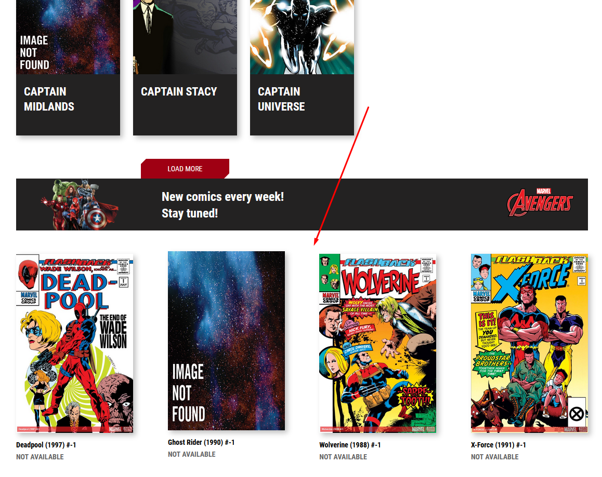

`Switch` - переключатель по роутам - он уже загружает отдельный роут как новую страницу

Однако тут мы упираемся в такую особенность работы свича, что он грузит только первую ссылку, которая совпадает с `url`, имеющейся на странице

То есть свитч грузит только первую страницу, которая совпала с первой ссылкой (которая всегда `/`) и не смотрит на следующие ссылки, которые имеют тот же маршрут

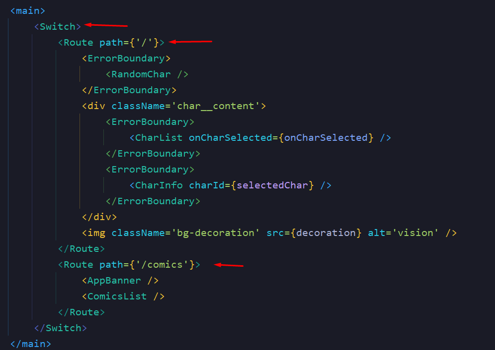

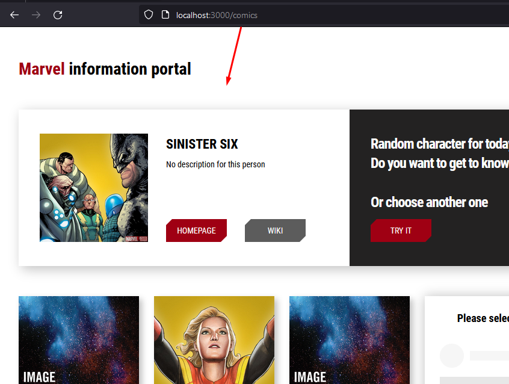

Чтобы исправить проблему, у нас есть два пути решения:
1) Главную страницу `/` расположить в конце списка свича
2) Добавить атрибут `exact`, который обязует, чтобы рендер был только по написанию полного и правильного пути

Вот пример использования первого подхода (все `/имя` нужно будет писать до `/` главной страницы)

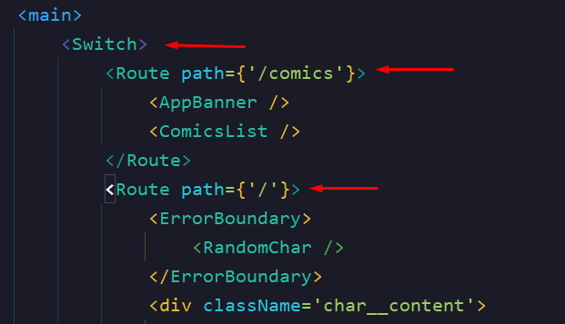

И вот пример использования обязующего атрибута

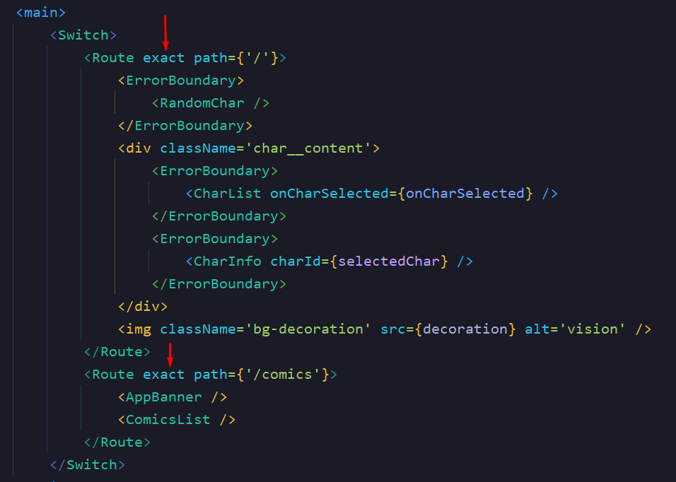

Результат:

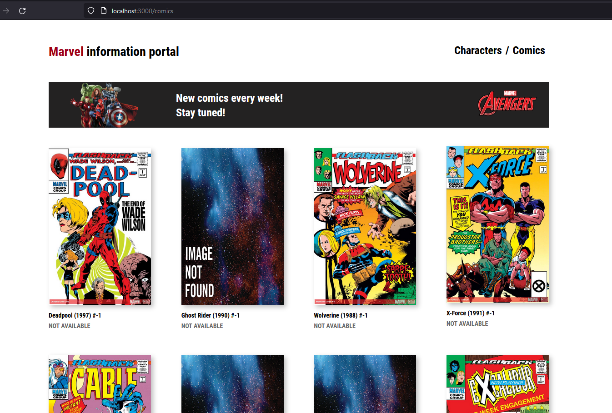

И далее, чтобы добавить ссылки в наш проект, нужно в нужное место в компоненте добавить компонент `Link`, который в качестве ссылки в себя принимает атрибут `to`

`components > appHeader > AppHeader.js`
```JS
import { Link } from 'react-router-dom';

const AppHeader = () => {
	return (
		<header className='app__header'>
			<h1 className='app__title'>
				// вместо a и href вставляем Link и to
				<Link to={'/'}>
					<span>Marvel</span> information portal
				</Link>
			</h1>
			<nav className='app__menu'>
				<ul>
					<li>
						<Link to={'/'}>Characters</Link>
					</li>
					/
					<li>
						<Link to={'/comics'}>Comics</Link>
					</li>
				</ul>
			</nav>
		</header>
	);
};

export default AppHeader;
```

И сейчас ссылки для перехода по страницам работают

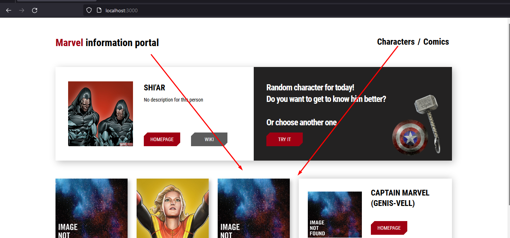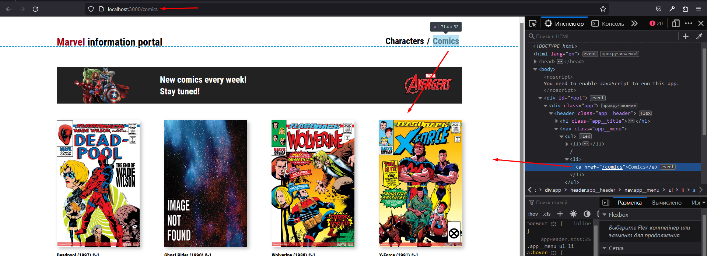

Так же мы имеем функцию `redirect`, которая при определённых условиях позволяет заредиректить пользователя (например, если он не залогинен или определённой ссылки не существует)

```JS
import { redirect } from "react-router-dom";

const loader = async () => {
  const user = await getUser();
  if (!user) {
    return redirect("/login");
  }
  return null;
};
```

Так же мы имеем атрибут `NavLink`, который позволяет нам стилизовать активную ссылку. Его особенностью является наличие атрибута `activeStyle` 

Однако, когда мы добавляем стили для наших элементов, стоит добавлять атрибут `exact`, чтобы стили применялись не ко всем элементам сразу, а только к нужным

`components > appHeader > AppHeader.js`
```JS
import { Link, NavLink } from 'react-router-dom';

const AppHeader = () => {
	return (
		<header className='app__header'>
			<h1 className='app__title'>
				<Link to={'/'}>
					<span>Marvel</span> information portal
				</Link>
			</h1>
			<nav className='app__menu'>
				<ul>
					<li>
						<NavLink 
							exact 
							activeStyle={{ color: '#9F0013' }} 
							to={'/'}
						>	
							Characters
						</NavLink>
					</li>
					/
					<li>
						<NavLink 
							exact 
							activeStyle={{ color: '#9F0013' }} 
							to={'/comics'}
						>
							Comics
						</NavLink>
					</li>
				</ul>
			</nav>
		</header>
	);
};
```

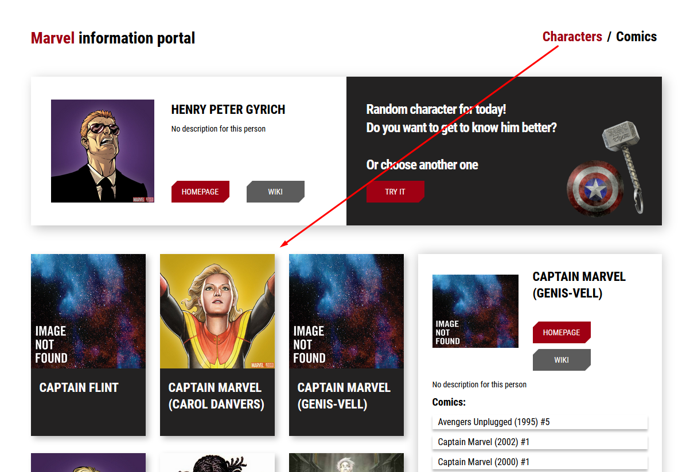

И далее мы можем вынести страницы в отдельные компоненты и поместить их в папку `pages`

`src > components > pages > ComicsList.js`
```JS
import React from 'react';
import AppBanner from '../appBanner/AppBanner';
import ComicsList from '../comicsList/ComicsList';

const ComicsPage = () => {
	return (
		<>
			<AppBanner />
			<ComicsList />
		</>
	);
};

export default ComicsPage;
```

`src > components > pages > MainPage.js`
```JS
import React, { useState } from 'react';
import ErrorBoundary from '../ErrorBoundary/ErrorBoundary';
import RandomChar from '../randomChar/RandomChar';
import CharList from '../charList/CharList';
import CharInfo from '../charInfo/CharInfo';
import decoration from '../../resources/img/vision.png';

const MainPage = () => {
	const [selectedChar, setSelectedChar] = useState(null);

	const onCharSelected = (id) => {
		setSelectedChar(id);
	};

	return (
		<>
			<ErrorBoundary>
				<RandomChar />
			</ErrorBoundary>
			<div className='char__content'>
				<ErrorBoundary>
					<CharList onCharSelected={onCharSelected} />
				</ErrorBoundary>
				<ErrorBoundary>
					<CharInfo charId={selectedChar} />
				</ErrorBoundary>
			</div>
			
		</>
	);
};

export default MainPage;
```

А далее экспортировать их через `index.js`, который сократит до них путь

`src > components > pages > index.js`
```JS
import MainPage from './MainPage';
import ComicsPage from './ComicsPage';

export { MainPage, ComicsPage };
```

И тут используем импорт

`src > components > app > App.js`
```JS
import { BrowserRouter as Router, Route, Switch } from 'react-router-dom';

import AppHeader from '../appHeader/AppHeader';
// импортируем страницы из одного файла
import { ComicsPage, MainPage } from '../pages';

const App = () => {
	return (
		<Router>
			<div className='app'>
				<AppHeader />
				<main>
					<Switch>
						<Route exact path={'/'}>
							<MainPage />
						</Route>
						<Route exact path={'/comics'}>
							<ComicsPage />
						</Route>
					</Switch>
				</main>
			</div>
		</Router>
	);
};

export default App;
```


## 013 React Router v6+


И теперь нужно установить последнюю версию роутера

```bash
npm i react-router-dom@latest
```

>[!info] [Тут](https://github.com/remix-run/react-router/blob/main/docs/upgrading/v5.md#upgrade-to-react-router-v6) находится руководство о переходе с пятой версии на шестую

> Вместо компонента `Switch` используется компонент `Routes`. 

> Нужный компонент для отрисовки теперь передаётся не в качестве `child`, а передаётся внутрь атрибута `element`. 

> Теперь вместо хука `useHistory` нужно использовать `useNavigate`

Теперь мы пишем не так: 

```TS
const history = useHistory();

/// CODE ...

<button onClick={() => history.push('/')}>BACK</button>
```

А так:

```TSX
import { Link, useNavigate, useParams } from 'react-router-dom';

interface IUserItemPageParams {
	id: string;
}

const UserItemPage: FC = () => {
	const [user, setUser] = useState<IUser | null>(null);
	const params = useParams();

	// используем навигацию
	const navigate = useNavigate();

	async function fetchUser() {
		try {
			const response = await axios.get<IUser>(
				'https://jsonplaceholder.typicode.com/users/' + params.id,
			);
			setUser(response.data);
		} catch (e) {
			console.error(e);
		}
	}

	useEffect(() => {
		fetchUser();
	}, []);

	return (
		<div>
			{/* перемещаемся в нужное место */}
			<button onClick={() => navigate('/users')}>back</button>
			<h1>Страница пользователя {user?.name}</h1>
			<h4>Проживает в {user?.address.city}</h4>
		</div>
	);
};
```

> Хук `useRouteMatch` заменили на `useMatch`

> Компонент `Prompt` больше не поддерживается

> Так же нужно сказать, что такого атрибута как `exact` теперь не существует. Внутри `Routes` проходит правильное сравнение ссылок, что не приводит к рендеру одного компонента внутри другого. Если нам нужно будет использовать эквивалент этому атрибуту в `NavLink`, то там мы вместо него пишем `end`

`components > app > App.js`
```JS
import { BrowserRouter as Router, Route, Routes } from 'react-router-dom';

const App = () => {
	return (
		<Router>
			<div className='app'>
				<AppHeader />
				<main>
					<Routes>
						<Route path={'/'} element={<MainPage />} />
						<Route path={'/comics'} element={<ComicsPage />} />
					</Routes>
				</main>
			</div>
		</Router>
	);
};
```

Так же в новой версии у нас пропала наша классическая композиция, когда у нас свитч рендерил сразу все страницы, если их не разделять атрибутом `exact`. Чтобы использовать данную функциональность и подгружать другую страницу внутри нашей страницы, нужно использовать компонент `<Outlet />`. Он загрузит другой компонент на нашей странице при клике на нужную ссылку.

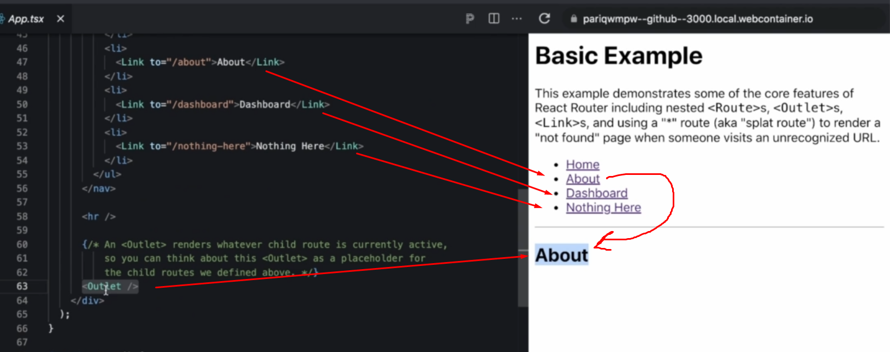

> Так же нужно указать, что ссылки внутри роутов будут относиться к этим роутам. То есть, если родительский роут имеет ссылку `to='/comics'`, то при выборе внутри него ссылки `to='/deadpool'` мы перейдём по ссылке `/comics/deadpool`. В пятой версии с этим были определённые трудности.

Из вышеописанных исправлений вытекает дополнительный функционал: 
- `to='.'` будет осуществлять переход на эту же страницу
- `to='..'` будет вызывать страницу на один уровень выше (родительскую)
- `to='../bayonette'` выйдет на уровень выше и перейдёт оттуда на другую страницу (которая находится в родительском компоненте)

> Так же из компонента `NavLink` удалили атрибуты `activeStyle` и `activeClassName`. Вместо них нужно самому делать функции по добавлению нужного функционала

Исправим хедер страницы, чтобы он поддерживал 6 версию роутер-дома:
- заменяем `exact` на `end`
- заменяем `activeStyle` на `style`. Сам же стиль будет автоматически принимать в себя аргумент активности (`isActive`), чтобы мы могли навесить нужные нам стили

```JS
const AppHeader = () => {
	return (
		<header className='app__header'>
			<h1 className='app__title'>
				<Link to={'/'}>
					<span>Marvel</span> information portal
				</Link>
			</h1>
			<nav className='app__menu'>
				<ul>
					<li>
						<NavLink
							// вставляем вместо exact
							end
							// можно так передать стили
							style={({ isActive }) => 
								({ color: isActive ? '#9F0013' : 'inherit' })}
							to={'/'}
						>
							Characters
						</NavLink>
					</li>
					/
					<li>
						<NavLink
							end
							// а можно так
							style={({ isActive }) => 
								(isActive ? { color: '#9F0013' } : {})}
							to={'/comics'}
						>
							Comics
						</NavLink>
					</li>
				</ul>
			</nav>
		</header>
	);
};
```

Теперь применение стилей правильно работает:

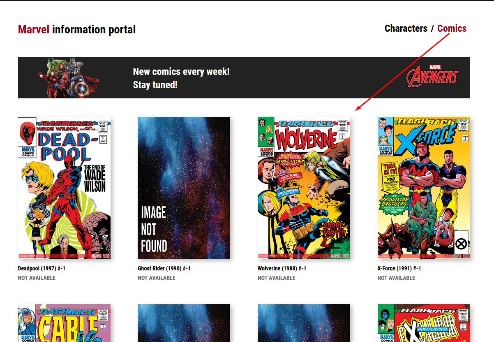


## 014 Практика создания динамических путей

### Страница ошибки

```JS
import React from 'react';
import ErrorMessage from '../ErrorMessage/ErrorMessage';
import { Link } from 'react-router-dom';

const Error404 = () => {
	return (
		<div style={{ textAlign: 'center' }}>
			<ErrorMessage />
			<h1>Page not found!</h1>
			<Link
				style={{
					display: 'inline-block',
					padding: '10px',
					margin: '10px',
					textDecoration: 'underline',
					border: '1px solid black',
				}}
				to={'/'}
			>
				Back to main page
			</Link>
		</div>
	);
};

export default Error404;
```


```JS
import MainPage from './MainPage';  
import ComicsPage from './ComicsPage';  
import Error404 from './404';  
  
export { MainPage, ComicsPage, Error404 };
```


```JS
import { ComicsPage, Error404, MainPage } from '../pages';

const App = () => {
	return (
		<Router>
			<div className='app'>
				<AppHeader />
				<main>
					<Routes>
						<Route path={'/'} element={<MainPage />} />
						<Route path={'/comics'} element={<ComicsPage />} />
						<Route path={'*'} element={<Error404 />} />
					</Routes>
				</main>
			</div>
		</Router>
	);
};
```

### Динамические страницы

> Дальше используется `Router Dom v5`

`Match` хранит в себе данные о том, как именно `path` совпал с текущим адресом
`History` представляет из себя API для организации перехода между страницами
`Location` хранит в себе состояние положения роутера

Для работы с данными объектами используются хуки: `useParams`, `useHistory`, `useLocation`

Для реализации побочной ссылки, которая будет грузиться изнутри другого роута, нужно добавить новый роут с родительским путём и указать дополнительный динамический путь через `:`. То есть ссылка будет выглядеть следующим образом: `/comics/:comicId` - передаём параметр `comicId` в динамическую ссылку

`components > app > App.js`
```JS
import { BrowserRouter as Router, Route, Switch } from 'react-router-dom';

import { MainPage, ComicsPage, Error404, SingleComicPage } from '../pages';
import AppHeader from '../appHeader/AppHeader';

const App = () => {
	return (
		<Router>
			<div className='app'>
				<AppHeader />
				<main>
					<Switch>
						<Route exact path='/'>
							<MainPage />
						</Route>
						<Route exact path='/comics'>
							<ComicsPage />
						</Route>
						<Route exact path='/comics/:comicId'>
							<SingleComicPage />
						</Route>
						<Route path='*'>
							<Error404 />
						</Route>
					</Switch>
				</main>
			</div>
		</Router>
	);
};

export default App;
```

В сервисе нужно иметь функцию, которая будет по `id` возвращать нужный нам комикс

`service > marvel.service.js`
```JS
const getComics = async (id) => {  
   const res = await request(`${_apiBase}comics/${id}?${_apiKey}`);  
   return _transformComics(res.data.results[0]);  
};
```

Далее в компоненте списка комиксов поменяем ссылку `a` на `Link` и в параметры ссылки передадим `item.id`, который будет ссылаться на определённый комикс

`components > comicsList > ComicsList.js`
```JS
function renderItems(arr) {
	const items = arr.map((item, i) => {
		return (
			<li className='comics__item' key={i}>
				// добавляем сюда динамическую ссылку в качестве линка
				<Link to={`/comics/${item.id}``}>
					
					<div className='comics__item-name'>{item.title}</div>
					<div className='comics__item-price'>{item.price}</div>
				</Link>
			</li>
		);
	});

	return <ul className='comics__grid'>{items}</ul>;
}
```

Далее нам нужно реализовать страницу отдельного комикса

`components > pages > SingleComicPage.js`
```JS
import { useParams, Link } from 'react-router-dom';
import { useState, useEffect } from 'react';

import useMarvelService from '../../services/marvel.service';
import Spinner from '../Spinner/Spinner';
import ErrorMessage from '../ErrorMessage/ErrorMessage';
import AppBanner from '../appBanner/AppBanner';
import './singleComicPage.scss';

const SingleComicPage = () => {
	// берём id комикса из нашей адресной строки с помощью хука
	const { comicId } = useParams();
	// состояние комикса
	const [comic, setComic] = useState(null);
	// получаем функции для работы с сервером
	const { loading, error, getComics, clearError } = useMarvelService();

	useEffect(() => {
		// обновляем комикс при изменении id
		updateComic();
	}, [comicId]);

	// обновление комикса
	const updateComic = () => {
		clearError();
		getComics(comicId).then(onComicLoaded);
	};

	// тут устанавливаем комикс в стейт
	const onComicLoaded = (comic) => {
		setComic(comic);
	};

	const errorMessage = error ? <ErrorMessage /> : null;
	const spinner = loading ? <Spinner /> : null;
	const content = !(loading || error || !comic) ? <View comic={comic} /> : null;

	return (
		<>
			<AppBanner />
			{errorMessage}
			{spinner}
			{content}
		</>
	);
};

// рендерим сам компонент комикса
const View = ({ comic }) => {
	// деструктурируем ответ
	const { title, description, pageCount, thumbnail, language, price } = comic;

	return (
		<div className='single-comic'>
			
			<div className='single-comic__info'>
				<h2 className='single-comic__name'>{title}</h2>
				<p className='single-comic__descr'>{description}</p>
				<p className='single-comic__descr'>{pageCount}</p>
				<p className='single-comic__descr'>Language: {language}</p>
				<div className='single-comic__price'>{price}</div>
			</div>
			<Link to='/comics' className='single-comic__back'>
				Back to all
			</Link>
		</div>
	);
};

export default SingleComicPage;
```

Экспортируем страницу одиночного комикса

`components > pages > index.js`
```JS
import MainPage from './MainPage';  
import ComicsPage from './ComicsPage';  
import Error404 from './404';  
import SingleComicPage from './SingleComicPage';  
  
export { MainPage, ComicsPage, Error404, SingleComicPage };
```

Чтобы слово *Comics* горело даже в отдельном комиксе, нужно убрать строгое сравнение ссылки через `exact` из компонента `AppHeader`

`components > appHeader > AppHeader.js`
```JS
import { Link, NavLink } from 'react-router-dom';
import './appHeader.scss';

const AppHeader = () => {
	return (
		<header className='app__header'>
			<h1 className='app__title'>
				<Link to='/'>
					<span>Marvel</span> information portal
				</Link>
			</h1>
			<nav className='app__menu'>
				<ul>
					<li>
						<NavLink exact activeStyle={{ color: '#9f0013' }} to='/'>
							Characters
						</NavLink>
					</li>
					/
					<li>
						<NavLink activeStyle={{ color: '#9f0013' }} to='/comics'>
							Comics
						</NavLink>
					</li>
				</ul>
			</nav>
		</header>
	);
};

export default AppHeader;
```

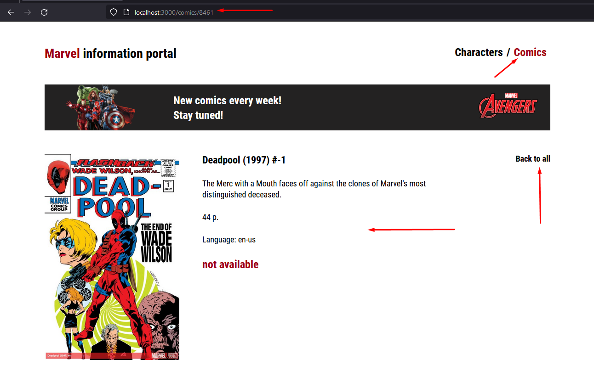


## 015 Динамические импорты и React.lazy


На определённом этапе разработки приложение станет настолько большим, что уже оно начнёт загружаться крайне длительное время. Но мы можем определить, какие участки приложения нам не нужны на этапе первичной загрузки и так же мы можем указать с помощью JS на эти блоки кода.

Для примера создадим функцию логгера:

`components > charList > someFunc.js`
```JS
export function logger(logString = 'Hello, World!') {  
   console.log(logString);  
}  
  
export function secondLog(logString = 'Second Log!') {  
   console.log(logString);  
}
```

Динамический импорт возвращает промис с объектом модуля

Тут нужно напомнить, что любой экспорт из файла в JS экспортирует единый объект (в данном случае - `obj`), который хранит данную функцию в качестве свойства (`obj.logger`). Если мы экспортируем по умолчанию через `export default`, то на выходе мы получаем объект с одним свойством - `obj.default`

Так же обязательно всегда нужно указывать `catch`, который будет срабатывать, когда не сработал импорт / неправильно был указан путь

`components > charList > CharList.js`
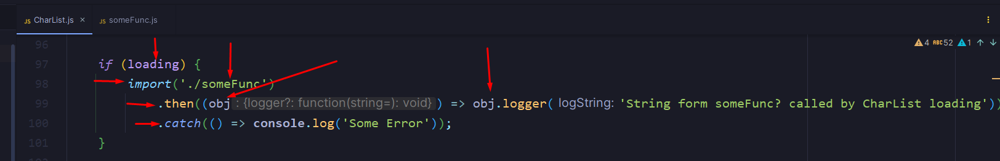

Но зачастую используется более простой синтаксис - получение нужной функции через деструктуризацию 

`components > charList > CharList.js`
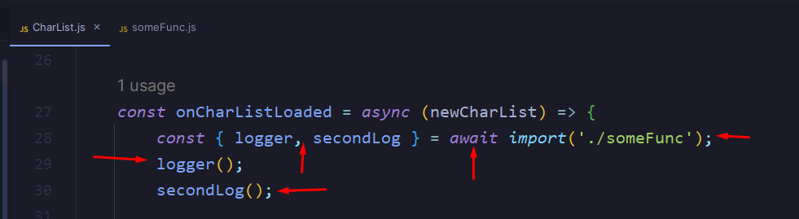

И если нам нужно будет вытащить дефолтную функцию, то в импортах нужно будет обратиться не к функции по имени, а к свойству `default`, которое содержит функцию 

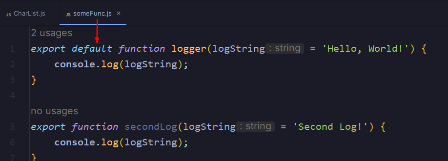

`components > charList > CharList.js`
```JS
if (loading) {  
   import('./someFunc').then((obj) => obj.default());  
}
```

Далее переходим к функционалу реакта - `React.lazy`

- Основным условием является то, что компонент должен экспортироваться дефолтно из файла
- Так же все динамические импорты нужно вставлять после статических, иначе может произойти ошибка

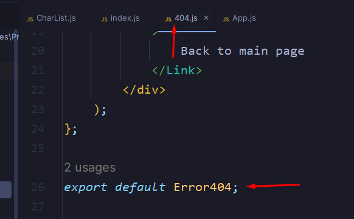

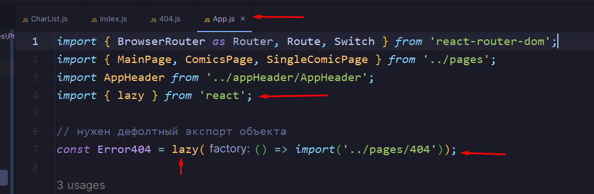

Далее нужно как и с промисами обработать возможную ошибку. Для этого предназначен дополнительный компонент `Suspense`. Он принимает в себя атрибут `fallback`, который будет показываться пока подгружается нужный нам компонент из динамического импорта

`components > app > App.js`
```JS
import { lazy, Suspense } from 'react';

// нужен дефолтный экспорт объекта
const Error404 = lazy(() => import('../pages/404'));

const App = () => {
	return (
		<Router>
			<div className='app'>
				<AppHeader />
				<main>
		// оборачиваем страницу в саспенс, который и будет подгружать нужный компонент
					<Suspense fallback={<Spinner />}>
						<Switch>
							<Route exact path='/'>
								<MainPage />
							</Route>
							<Route exact path='/comics'>
								<ComicsPage />
							</Route>
							<Route exact path='/comics/:comicId'>
								<SingleComicPage />
							</Route>
							<Route path='*'>
								<Error404 />
							</Route>
						</Switch>
					</Suspense>
				</main>
			</div>
		</Router>
	);
};

export default App;
```

И теперь во время загрузки этой страницы у нас будет показываться спиннер пока не загрузится ошибка

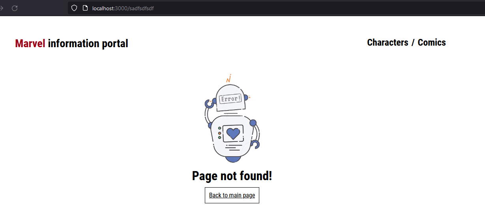

Так же можно сделать подобную подгрузку для всех страниц, чтобы они не грузились сразу все пользователю, а только по надобности

```JS
import { BrowserRouter as Router, Route, Switch } from 'react-router-dom';
import AppHeader from '../appHeader/AppHeader';

import { lazy, Suspense } from 'react';
import Spinner from '../Spinner/Spinner';

// нужен дефолтный экспорт объекта
const Error404 = lazy(() => import('../pages/404'));
const MainPage = lazy(() => import('../pages/MainPage'));
const ComicsPage = lazy(() => import('../pages/ComicsPage'));
const SingleComicPage = lazy(() => import('../pages/SingleComicPage'));

const App = () => {
	return (
		<Router>
			<div className='app'>
				<AppHeader />
				<main>
					<Suspense fallback={<Spinner />}>
						<Switch>
							<Route exact path='/'>
								<MainPage />
							</Route>
							<Route exact path='/comics'>
								<ComicsPage />
							</Route>
							<Route exact path='/comics/:comicId'>
								<SingleComicPage />
							</Route>
							<Route path='*'>
								<Error404 />
							</Route>
						</Switch>
					</Suspense>
				</main>
			</div>
		</Router>
	);
};

export default App;
```

И уже таким образом будет выглядеть ошибка, если ленивые импорты вставить внутрь статических


До ленивых импортов мы имели 3 файла JS и вся папка весила 751 килобайт. Тут нужно сказать, что все эти файлы пользователь подгружал сразу, даже если их функционал ему не нужен был

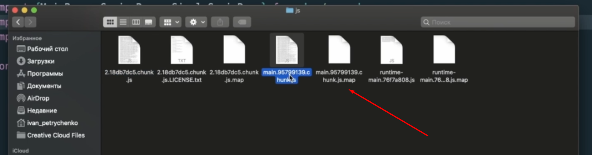

После lazy-импорта количество файлов возросло в несколько раз и вес папки со скриптами вырос до 880 килобайт. Хоть скрипты и весят больше в общем, но теперь пользователь не будет скачивать все страницы сразу - он будет получать только актуальные ему страницы и подгружать их в процессе использования приложения. 

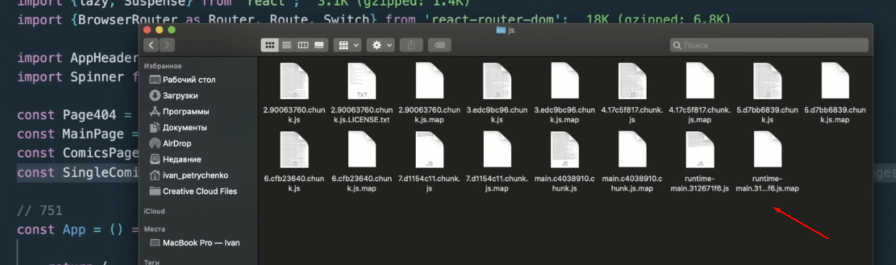

>[!info] Использовать ленивую загрузку стоит уже в больших приложениях, где первая скорость загрузки уже будет переваливать за 3 секунды
>- Зачастую такую загрузку применяют уже к целым страницам приложения 
>- Но таким же образом можно выносить в ленивую загрузку и отдельные компоненты


## 016 React.memo, Pure Component и оптимизация скорости работы приложения

> `React.memo` - это компонент высшего порядка (HOC), который предназначен для мемоизации рендера компонента. Если в компонент не пришли новые пропсы или не изменился стейт, то компонент не перерендерится и сохранит ресурсы компьютера пользователя. 

Например, мы имеем форму. При нажатии на кнопку компонент формы получает новые пропсы и перерендеривается.

```JS
import { useState } from 'react';
import { Container } from 'react-bootstrap';
import './App.css';

const Form = (props) => {
	console.log('render Form');

	return (
		<Container>
			<form className='w-50 border mt-5 p-3 m-auto'>
				<div className='mb-3'>
					<label htmlFor='exampleFormControlInput1' className='form-label mt-3'>
						Email address
					</label>
					<input
						value={props.mail}
						type='email'
						className='form-control'
						id='exampleFormControlInput1'
						placeholder='name@example.com'
					/>
				</div>
				<div className='mb-3'>
					<label htmlFor='exampleFormControlTextarea1' className='form-label'>
						Example textarea
					</label>
					<textarea
						value={props.text}
						className='form-control'
						id='exampleFormControlTextarea1'
						rows='3'
					></textarea>
				</div>
			</form>
		</Container>
	);
};

function App() {
	const [data, setData] = useState({
		mail: 'name@example.com',
		text: 'some text',
	});

	return (
		<>
			<Form mail={data.mail} text={data.text} />
			<button
				onClick={() =>
					setData({
						mail: 'second@example.com',
						text: 'another text',
					})
				}
			>
				Click me
			</button>
		</>
	);
}

export default App;
```

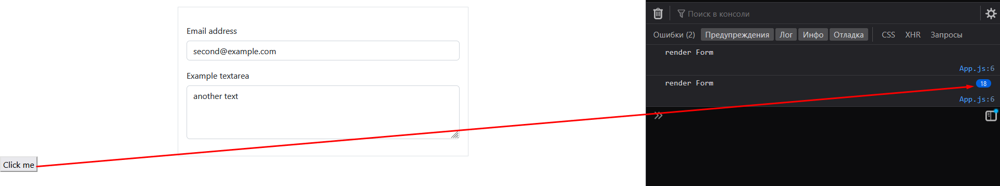

Чтобы решить вышеописанную проблему, нужно просто обернуть компонент в `memo()`, который сохранит результат рендера и при неизменных значениях не будет рендерить компонент заново

```JS
// обернём компонент в memo()
const Form = memo((props) => {
	console.log('render Form');

	/// CODE ...
});
```

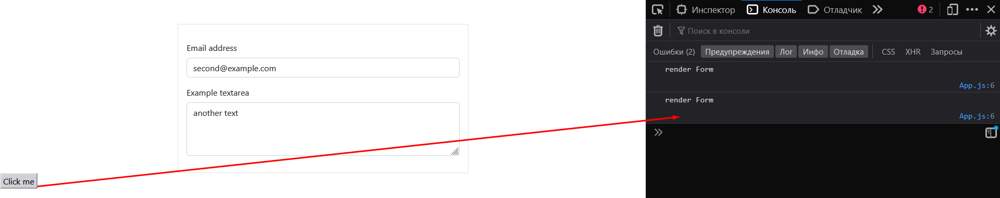

Однако тут нужно упомянуть, что перерендер будет происходить, если внутри пропсов мы передаём свойства с вложенными объектами

```JS
function App() {
	const [data, setData] = useState({
		// объект внутри свойства объекта
		mail: { name: 'name@example.com' },
		text: 'some text',
	});

	return (
		<>
			<Form mail={data.mail} text={data.text} />
			<button
				onClick={() =>
					setData({
						// передаём mail - name
						mail: { name: 'name@example.com' },
						text: 'another text',
					})
				}
			>
				Click me
			</button>
		</>
	);
}
```

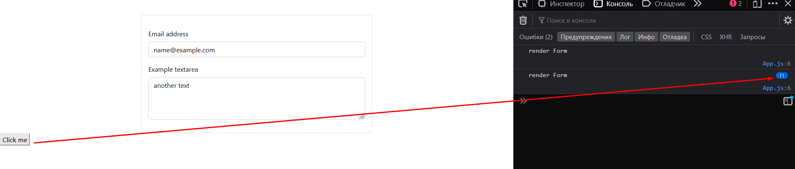

Чтобы указать, что в приложении нам нужно реализовать для определённого пропса глубокую проверку (проверять изменение вложенных значений), то нам нужно реализовать функцию, которая будет сравнивать значения и возвращать `boolean`

```JS
// функция для сравнения пропсов
const propsCompare = (prevProps, nextProps) => {
	return prevProps.mail.name === nextProps.mail.name;
};

const Form = memo((props) => {
	console.log('render Form');

	return (
		<Container>
			<form className='w-50 border mt-5 p-3 m-auto'>
				<div className='mb-3'>
					<label 
						htmlFor='exampleFormControlInput1' 
						className='form-label mt-3'
					>	
						Email address
					</label>
					<input
						value={props.mail.name}
						type='email'
						className='form-control'
						id='exampleFormControlInput1'
						placeholder='name@example.com'
					/>
				</div>
				<div className='mb-3'>
					<label 
						htmlFor='exampleFormControlTextarea1' 
						className='form-label'
					>	
						Example textarea
					</label>
					<textarea
						value={props.text}
						className='form-control'
						id='exampleFormControlTextarea1'
						rows='3'
					></textarea>
				</div>
			</form>
		</Container>
	);
}, propsCompare);
```

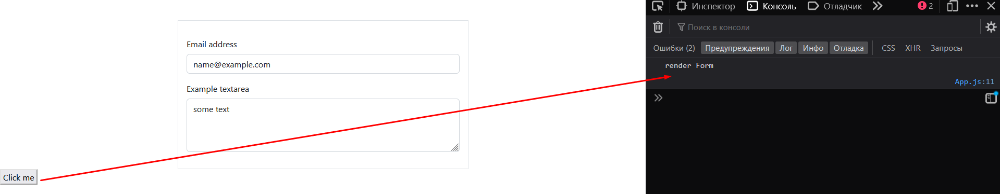

> `React.PureComponent` - это расширение классовых компонентов, которое в отличе от `Component` триггерит каждый раз функцию `shouldComponentUpdate()`, которым мы определяем потребность в обновлении компонента

Всю логику, что мы реализовывали через `memo` данный компонент реализует сам. Однако нам нужно будет так же проводить сравнение внутри `shouldComponentUpdate()`, если мы будем передавать вложенные объекты

```JS
class Form extends PureComponent {
	render() {
		console.log('render Form');

		return (
			<Container>
				<form className='w-50 border mt-5 p-3 m-auto'>
					<div className='mb-3'>
						<label htmlFor='exampleFormControlInput1' className='form-label mt-3'>
							Email address
						</label>
						<input
							value={this.props.mail}
							type='email'
							className='form-control'
							id='exampleFormControlInput1'
							placeholder='name@example.com'
						/>
					</div>
					<div className='mb-3'>
						<label htmlFor='exampleFormControlTextarea1' className='form-label'>
							Example textarea
						</label>
						<textarea
							value={this.props.text}
							className='form-control'
							id='exampleFormControlTextarea1'
							rows='3'
						></textarea>
					</div>
				</form>
			</Container>
		);
	}
}

function App() {
	const [data, setData] = useState({
		mail: 'name@example.com',
		text: 'some text',
	});

	return (
		<>
			<Form mail={data.mail} text={data.text} />
			<button
				onClick={() =>
					setData({
						mail: 'name@example.com',
						text: 'another text',
					})
				}
			>
				Click me
			</button>
		</>
	);
}

export default App;
```


Если мы хотим контролировать перерендер в обычном компоненте, который наследуется от `Component`, то нам нужно будет использовать функцию `shouldComponentUpdate()`

> Тут стоит сделать пометку, что логику очень глубокого сравнения делать не стоит

```JS
class Form extends Component {
	shouldComponentUpdate(nextProps) {
		if (this.props.mail.name === nextProps.mail.name) {
			return false;
		}

		return true;
	}

	render() {
		console.log('render Form');

		return (
			<Container>
				<form className='w-50 border mt-5 p-3 m-auto'>
					<div className='mb-3'>
						<label 
							htmlFor='exampleFormControlInput1' 
							className='form-label mt-3'
						>	
							Email address
						</label>
						<input
							value={this.props.mail.name}
							type='email'
							className='form-control'
							id='exampleFormControlInput1'
							placeholder='name@example.com'
						/>
					</div>
					<div className='mb-3'>
						<label 
							htmlFor='exampleFormControlTextarea1' 
							className='form-label'
						>	
							Example textarea
						</label>
						<textarea
							value={this.props.text}
							className='form-control'
							id='exampleFormControlTextarea1'
							rows='3'
						></textarea>
					</div>
				</form>
			</Container>
		);
	}
}
```

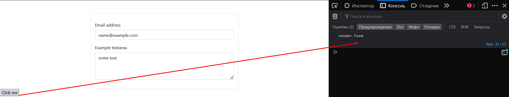


>[!info] Вывод:
> - `memo()` используется для функциональных компонентов
> - Для классовых компонентов используется `PureComponent` или `Component` вместе с функцией `shouldComponentUpdate()` 
> - Используется мемоизация для компонентов, которые часто получают одинаковые пропсы

>[!warning] Если добавить мемоизацию на компонент, который постоянно получает новые пропсы, то можно только затормозить работу приложения дополнительным сохранением данных - поэтому использовать данный функционал нужно аккуратно

Например, если мы передадим функцию, то компонент даже с `memo()` будет перерендериваться постоянно из-за того, что каждый раз при передаче будет создаваться новая функция (а функция является объектом в ==JS==).

Это так же будет происходить, если мы вынесем эту функцию в отдельную именованную стрелочную, потому что наш компонент `App` перерендеривается каждый раз, когда в нём меняется состояние и из-за этого пересоздаётся функция внутри него

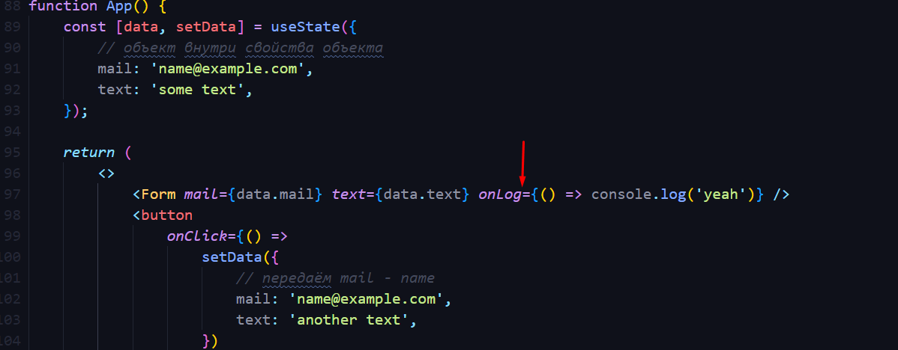

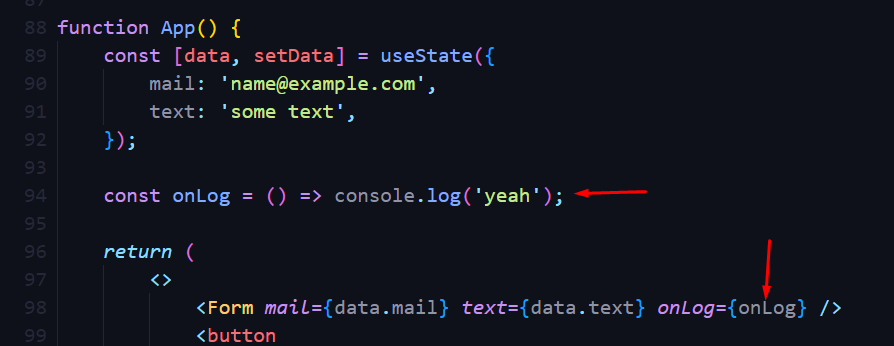

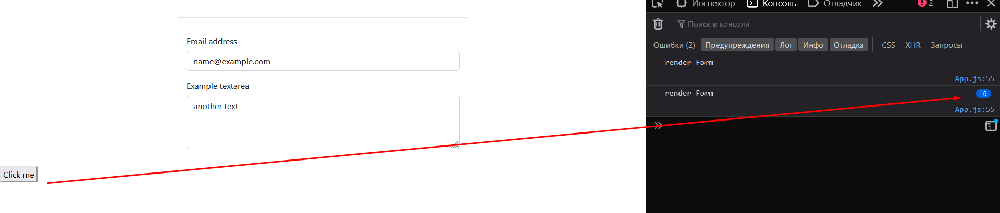

Чтобы закешировать функцию и не пересоздавать её по-новой каждый раз, можно просто замемоизировать её через `useCallback()`

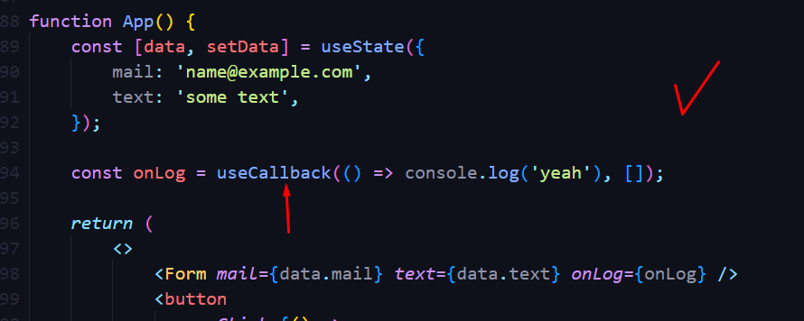

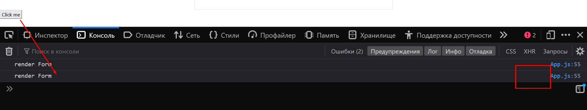


## 017 React Context и useContext


`React.createContext` и `useContext` - это функциональность, которая позволит создать один глобальный провайдер пропсов, чтобы пользоваться ими из любого участка приложения. То есть мы можем передавать данные по дереву компонентов не прибегая к *property drill* (сверлим компоненты пропсами, которые нужно передать ниже)

Вот пример антипаттерна передачи пропсов через несколько промежуточных компонентов:

```JSX
<Page user={user} avatarSize={avatarSize} />
// ... который рендерит ...
<PageLayout user={user} avatarSize={avatarSize} />
// ... который рендерит ...
<NavigationBar user={user} avatarSize={avatarSize} />
// ... который рендерит ...
<Link href={user.permalink}>
  <Avatar user={user} size={avatarSize} />
</Link>
```

- Функция `createContext` создаёт единый контекст в приложении
- В эту функцию можно передать дефолтное значение, которое будет передаваться во все провайдеры, если в них не было передано значение в атрибут `value`
- Сам `Provider` является компонентом и в себя он принимает любое значение своего компонента (компонент `App` раздаёт состояние `data`) 
- `Consumer` так же является компонентом, который получает все данные из провайдера. Данный компонент получает функцию с данными в виде одного аргумента и через неё и можно отрендерить внутренности (просто так вставить компонент не получится)
- Все компоненты, которые используют данные провайдера будут обновлены при изменении этих данных

```JS
import { Component, createContext, memo, PureComponent, useCallback, useState } from 'react';
import { Container } from 'react-bootstrap';
import './App.css';

// это создание самого контекста в приложении
const dataContent = createContext({
	// сюда мы можем передать дефолтные данные
	mail: 'name@example.com',
	text: 'some text',
});

// получаем провайдера и консьюмера
const { Provider, Consumer } = dataContent;

const Form = memo((props) => {
	console.log('render Form');

	return (
		<Container>
			<form className='w-50 border mt-5 p-3 m-auto'>
				<div className='mb-3'>
					<label htmlFor='exampleFormControlInput1' className='form-label mt-3'>
						Email address
					</label>
					<Input />
				</div>
				<div className='mb-3'>
					<label htmlFor='exampleFormControlTextarea1' className='form-label'>
						Example textarea
					</label>
					<textarea
						value={props.text}
						className='form-control'
						id='exampleFormControlTextarea1'
						rows='3'
					></textarea>
				</div>
			</form>
		</Container>
	);
});

// компонент инпута
class Input extends Component {
	render() {
		return (
			// объявляем получателя
			<Consumer>
			{/* получаем функцию, которая сгенерирует нужную нам вёрстку и отдаст нужное значение */}
				{(value) => (
					<input
						// используем значение value
						value={value.mail}
						type='email'
						className='form-control'
						id='exampleFormControlInput1'
						placeholder='name@example.com'
					/>
				)}
			</Consumer>
		);
	}
}

function App() {
	const [data, setData] = useState({
		mail: 'name@example.com',
		text: 'some text',
	});

	return (
		// оборачиваем нужный участок в провайдера и передаём нужное для распространения значение (data)
		<Provider value={data}>
			<Form text={data.text} />
			<button
				onClick={() =>
					setData({
						mail: 'name@example.com',
						text: 'another text',
					})
				}
			>
				Click me
			</button>
		</Provider>
	);
}

export default App;
```

Сам же объект, который располагается в контексте хранит в себе:
- Переданные данные
- `Provider` - раздаёт данные всем компонентом из единого места в приложении 
- `Consumer` - подписывается на провайдера и следит за изменением его данных

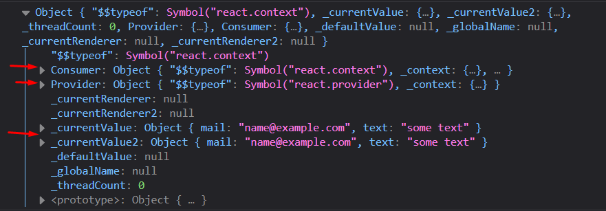

Так же есть более простой метод получать данные из состояний - это присвоение контекста компоненту

```JS
// компонент инпута
class Input extends Component {
	render() {
		return (
			<input
				// вытаскиваем данные из контекста
				value={this.context.mail}
				type='email'
				className='form-control'
				id='exampleFormControlInput1'
				placeholder='name@example.com'
			/>
		);
	}
}

// присваиваем контекст компоненту
Input.contextType = dataContent;
```

Так же можно использовать `static` присвоение контекста, но это экспериментальный способ

```JS
class Input extends Component {
	static contextType = dataContent;

	render() {
		return (
			<input
				// вытаскиваем данные из контекста
				value={this.context.mail}
				type='email'
				className='form-control'
				id='exampleFormControlInput1'
				placeholder='name@example.com'
			/>
		);
	}
}
```

Ну и работа заметно упрощается, когда мы работаем с функциональными компонентами и просто используем `useContext()`

```JS
const Input = (props) => {
	// подписываемся на определённый контекст 
	const context = useContext(dataContext);

	return (
		<input
			value={context.mail}
			type='email'
			className='form-control'
			id='exampleFormControlInput1'
			placeholder='name@example.com'
		/>
	);
};
```

- так же приложение можно разбить на модули с контекстом
- контекстов может быть несколько в приложении
- провайдеры можно вкладывать в провайдеры, чтобы добавлять дополнительно контекст

```JS
/// context.js - тут хранится сам контекст приложения
import { createContext } from 'react';

export const dataContext = createContext({
	mail: 'name@example.com',
	text: 'some text',
});


/// Input.js - тут хранится отдельный компонент инпута
import { useContext } from 'react';
import { dataContext } from './context';

export const Input = (props) => {
	const context = useContext(dataContext);

	return (
		<input
			value={context.mail}
			type='email'
			className='form-control'
			id='exampleFormControlInput1'
			placeholder='name@example.com'
		/>
	);
};


/// Form.js - компонент формы
import { memo } from 'react';
import { Container } from 'react-bootstrap';
import { Input } from './Input';

export const Form = memo((props) => {
	console.log('render Form');

	return (
		<Container>
			<form className='w-50 border mt-5 p-3 m-auto'>
				<div className='mb-3'>
					<label 
						htmlFor='exampleFormControlInput1' 
						className='form-label mt-3'
					>	
						Email address
					</label>
					<Input />
				</div>
				<div className='mb-3'>
					<label 
						htmlFor='exampleFormControlTextarea1' 
						className='form-label'
					>	
						Example textarea
					</label>
					<textarea
						value={props.text}
						className='form-control'
						id='exampleFormControlTextarea1'
						rows='3'
					></textarea>
				</div>
			</form>
		</Container>
	);
});


/// App.js - главный компонент приложения
import { useState } from 'react';
import './App.css';

import { dataContext } from './context';
import { Form } from './Form';

const { Provider } = dataContext;

function App() {
	const [data, setData] = useState({
		mail: 'name@example.com',
		text: 'some text',
	});

	return (
		<Provider value={data}>
			<Form text={data.text} />
			<button
				onClick={() =>
					setData({
						mail: 'name@example.com',
						text: 'another text',
					})
				}
			>
				Click me
			</button>
		</Provider>
	);
}

export default App;
```

- Таким образом можно изменить состояние через функцию, переданную внутри контекста
- Теперь нам везде так же нужно передавать функцию `forceChangeMail` (меняет стейт), чтобы не было ошибок

```JS
/// Input.js
export const Input = (props) => {
	// подписываемся на определённый контекст
	const context = useContext(dataContext);

	return (
		<input
			value={context.mail}
			type='email'
			className='form-control'
			id='exampleFormControlInput1'
			placeholder='name@example.com'
			// при фокусе будет меняться состояние
			onFocus={context.forceChangeMail}
		/>
	);
};


/// App.js
const { Provider } = dataContext;

function App() {
	const [data, setData] = useState({
		mail: 'name@example.com',
		text: 'some text',
		forceChangeMail, // здесь передаём функцию
	});

	// функция будет менять данные в стейте при фокусе
	function forceChangeMail() {
		setData({ ...data, mail: 'changed@mail.com' });
	}

	return (
		<Provider value={data}>
			<Form text={data.text} />
			<button
				onClick={() =>
					setData({
						mail: 'name@example.com',
						text: 'another text',
						forceChangeMail, // здесь передаём функцию
					})
				}
			>
				Click me
			</button>
		</Provider>
	);
}
```

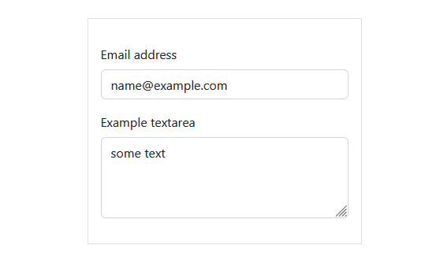
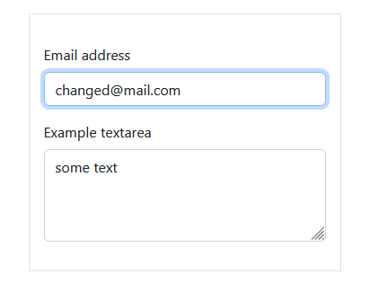

Так же нужно сказать, что если мы в `Provider` не передаём атрибут `value`, то он будет равняться `undefind`, что вызовет ошибки

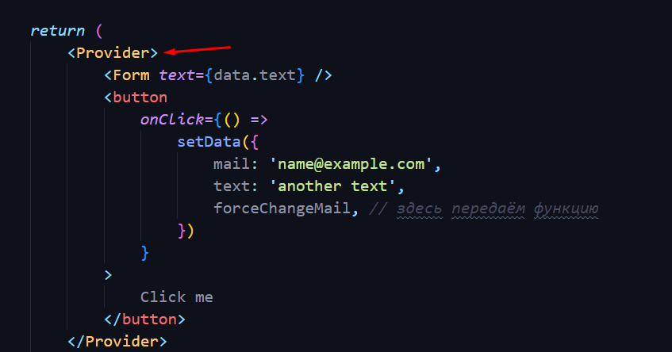

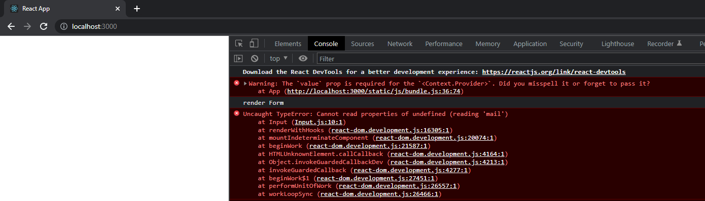

Однако, если убрать провайдера, то мы будем получать данные по умолчанию из контекста

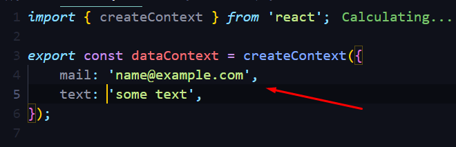

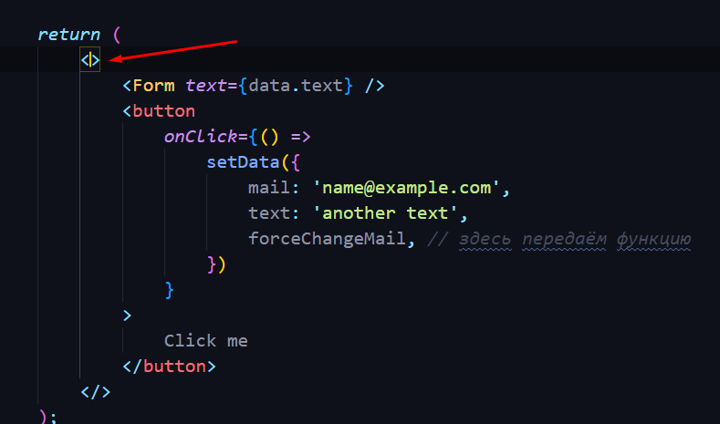

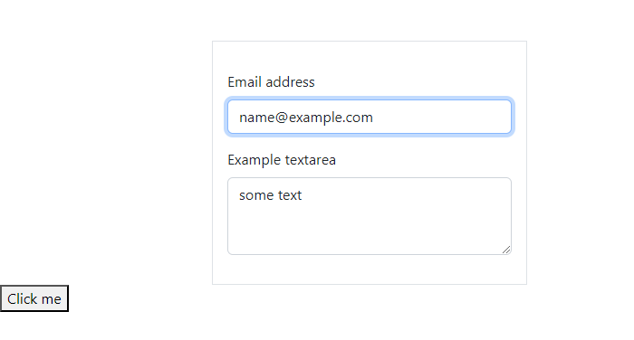

И чтобы не получать ошибок, нужно добавлять все новые значения в значения по умолчанию контекста

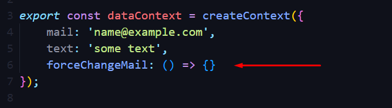

Так же в провайдера не стоит передавать объекты напрямую, так как такая запись будет ухудшать оптимизацию проекта

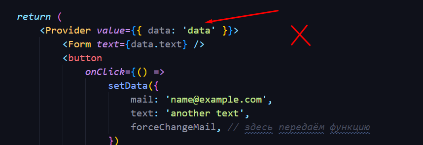


## 018 useReducer


`useReducer` - это функция, которая управляет ограниченным набором состояний. Она заменяет `useState` и позволяет нам предсказывать определённые наборы состояний компонента. 
Хук возвращает само состояние и функцию `dispatch`, которая вызывает изменение состояния.
`dispatch` принимает в себя объект с одним обязательным свойством `type`, которое хранит в себе тип операции

Хук принимает в себя три аргумента:
- Функцию-reducer, которая отвечает за изменение состояния
- Начальное состояние 
- Ленивое создание начального состояния

И тут у нас построена определённая структура:
- Добавлен хук `useReducer`, который будет контролировать состояние автоплея слайдера
- Внутрь мы передаём функцию `reducer` и начальное значение состояния
- Функция `reducer` через `switch`-конструкцию возвращает определённое значение в зависимости от переданного значения `action`. Так же эта функция принимает в себя `state`, чтобы от него иметь возможность поменять состояние
- Далее мы вызываем работу `useReducer` из вёрстки через функцию `dispatch`, которая принимает в себя экшен. Этот экшен уже будет передан в функцию `reducer` 

```JS
import { useReducer, useState } from 'react';
import { Container } from 'react-bootstrap';
import './App.css';

// это функция изменения состояния
const reducer = (state, action) => {
	switch (action.type) {
		case 'toggle':
			return { autoplay: !state.autoplay };
		case 'slow':
			return { autoplay: 300 };
		case 'fast':
			return { autoplay: 1500 };
		default:
			throw new Error('Reducer is not compatible');
			break;
	}
};

const Slider = (props) => {
	const [slide, setSlide] = useState(0);
	// const [autoplay, setAutoplay] = useState(false);

	// тут создаётся редьюсер и передаётся функция изменения состояния и начальное значение состояния
	// возвращается изначение состояния и функция вызова изменения состояния
	const [autoplay, dispatch] = useReducer(reducer, { autoplay: false });

	function changeSlide(i) {
		setSlide((slide) => slide + i);
	}

	return (
		<Container>
			<div className='slider w-50 m-auto'>
				
				<div className='text-center mt-5'>
					Active slide {slide} <br />
					{/* тут немного меняем условие, чтобы достучаться до булеана */}
					{autoplay.autoplay ? 'auto' : null}
				</div>
				<div className='buttons mt-3'>
					<button className='btn btn-primary me-2' onClick={() => changeSlide(-1)}>
						-1
					</button>
					<button className='btn btn-primary me-2' onClick={() => changeSlide(1)}>
						+1
					</button>
					<button
						className='btn btn-primary me-2'
						// тут вызвается dispatch-функция редьюсера
						onClick={() => dispatch({ type: 'toggle' })}
					>
						toggle autoplay
					</button>
					<button
						className='btn btn-primary me-2'
						// тут вызвается dispatch-функция редьюсера
						onClick={() => dispatch({ type: 'slow' })}
					>
						slow autoplay
					</button>
					<button
						className='btn btn-primary me-2'
						// тут вызвается dispatch-функция редьюсера
						onClick={() => dispatch({ type: 'fast' })}
					>
						fast autoplay
					</button>
				</div>
			</div>
		</Container>
	);
};

function App() {
	return <Slider />;
}

export default App;
```

И тут уже можно увидеть подконтрольное изменение состояния, когда мы уже знаем, что будет в качестве значения состояния. Для этого и предназначен данный хук

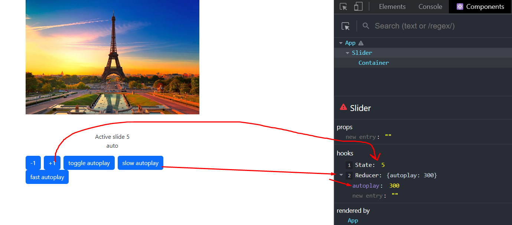

Так выглядит ленивое задание начального значения через третий аргумент хука редьюсера:

```JS
// функция для ленивого задания состояния
function init(initial) {
	return { autoplay: initial };
}

const Slider = ({ initial }) => {
	const [slide, setSlide] = useState(0);
	// const [autoplay, setAutoplay] = useState(false);

	// тут создаётся редьюсер и передаётся функция изменения состояния и начальное значение состояния
	// возвращается изначение состояния и функция вызова изменения состояния
	const [autoplay, dispatch] = useReducer(reducer, initial, init);

	/// CODE ....
};

function App() {
	return <Slider initial={false} />;
}
```

При таком подходе у нас уже изначально стоит правильное значение в состоянии, которое соответствует будущим объектам

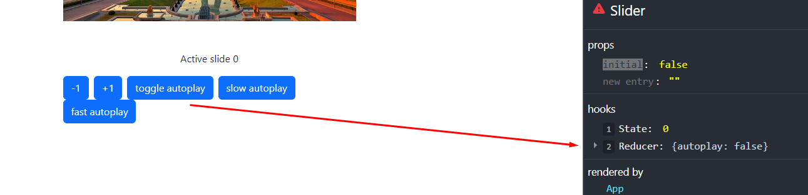

Так же в `dispatch` наряду с `type` обычно передают второе свойство - `payload`. Оно хранит в себе кастомное значение, которое мы хотим передать в состояние.

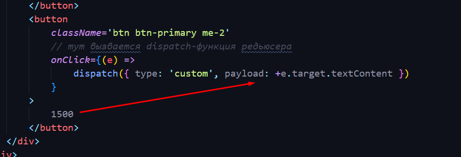

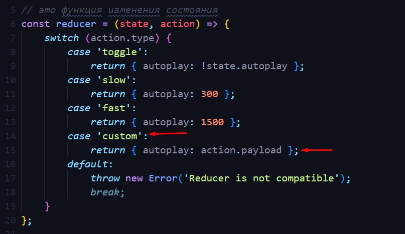


## 019 Компоненты высшего порядка (HOC)


Первым делом нужно посмотреть на то, какой механизм отвечает за логику работы ХОКов. 
За них отвечает подобная логика, когда у нас вызывается и возвращается одна функция внутри другой. Каждая из этих функций обогащает друг друга.

```JS
const f = (a) => {
	return (b) => {
		console.log(a+b);
	};
}

f(1)(2); // выход - 3
```

Так же можно будет работать и с классовыми компонентами

```JS
const f = (a) => {
	return class extends Component {
		render() {
			return <H1>Hello, World!</H1>
		}
	};
}
```

ХОКи могут пригодиться, когда нам нужно обогатить функционал достаточно похожей логики. Например, нам нужно вывести список товаров для клиента на сайте и для администратора внутри административной панели - это один и тот же список, но для разных пользователей он будет иметь немного разную информацию (конкретно администратор сможет каждый компонент изменить или удалить).

В изначальном варианте у нас представлена логика, когда мы получаем информацию о том, на каком слайде мы находимся, с условного "сервера". Из-за определённых ограничений мы не можем использовать одну эту функцию в обоих слайдерах.

```JS
const getDataFromFirstFetch = () => {
	return 10;
};
const getDataFromSecondFetch = () => {
	return 20;
};

const SliderFirst = () => {
	const [slide, setSlide] = useState(0);

	useEffect(() => {
		setSlide(getDataFromFirstFetch());
	}, []);

	function changeSlide(i) {
		setSlide((slide) => slide + i);
	}

	return (
		<Container>
			<div className='slider w-50 m-auto mb-3'>
				
				<div className='text-center mt-5'>Active slide {slide}</div>
				<div className='buttons mt-3'>
					<button className='btn btn-primary me-2' onClick={() => changeSlide(-1)}>
						-1
					</button>
					<button className='btn btn-primary me-2' onClick={() => changeSlide(1)}>
						+1
					</button>
				</div>
			</div>
		</Container>
	);
};

const SliderSecond = () => {
	const [slide, setSlide] = useState(0);
	const [autoplay, setAutoplay] = useState(false);

	useEffect(() => {
		setSlide(getDataFromSecondFetch());
	}, []);

	function changeSlide(i) {
		setSlide((slide) => slide + i);
	}

	return (
		<Container>
			<div className='slider w-50 m-auto'>
				
				<div className='text-center mt-5'>
					Active slide {slide} <br />
					{autoplay ? 'auto' : null}{' '}
				</div>
				<div className='buttons mt-3'>
					<button className='btn btn-primary me-2' onClick={() => changeSlide(-1)}>
						-1
					</button>
					<button className='btn btn-primary me-2' onClick={() => changeSlide(1)}>
						+1
					</button>
					<button
						className='btn btn-primary me-2'
						onClick={() => setAutoplay((autoplay) => !autoplay)}
					>
						toggle autoplay
					</button>
				</div>
			</div>
		</Container>
	);
};

function App() {
	return (
		<>
			<SliderFirst />
			<SliderSecond />
		</>
	);
}
```

Все ХОКи начинаются с `with`.

Конкретно тут ХОК оставил страницу ровно такой же, но он сохранил в себе обобщённую логику из двух данных компонентов и передал её в них обратно.

```JS
// HOC, который принимает в себя компонент и функцию получения данных
const withSlider = (BaseComponent, getData) => {
	// сам возвращаемый компонент
	return (props) => {
		const [slide, setSlide] = useState(0);
		const [autoplay, setAutoplay] = useState(false);

		useEffect(() => {
			setSlide(getData());
		}, []);

		function changeSlide(i) {
			setSlide((slide) => slide + i);
		}

		return (
			<BaseComponent
				// все остальные пропсы, которые будут переданы в ХОК, попадут сюда
				{...props}
				// передаём обязательные пропсы отсюда
				changeSlide={changeSlide}
				slide={slide}
				autoplay={autoplay}
				setAutoplay={setAutoplay}
			/>
		);
	};
};

const getDataFromFirstFetch = () => {
	return 10;
};
const getDataFromSecondFetch = () => {
	return 20;
};

// вырезаем из слайдеров всю логику для примера
// передаём все нужные данные через пропсы
const SliderFirst = ({ slide, changeSlide }) => {
	return (
		<Container>
			<div className='slider w-50 m-auto mb-3'>
				
				<div className='text-center mt-5'>Active slide {slide}</div>
				<div className='buttons mt-3'>
					<button className='btn btn-primary me-2' onClick={() => changeSlide(-1)}>
						-1
					</button>
					<button className='btn btn-primary me-2' onClick={() => changeSlide(1)}>
						+1
					</button>
				</div>
			</div>
		</Container>
	);
};

const SliderSecond = ({ slide, autoplay, setAutoplay, changeSlide }) => {
	return (
		<Container>
			<div className='slider w-50 m-auto'>
				
				<div className='text-center mt-5'>
					Active slide {slide} <br />
					{autoplay ? 'auto' : null}{' '}
				</div>
				<div className='buttons mt-3'>
					<button className='btn btn-primary me-2' onClick={() => changeSlide(-1)}>
						-1
					</button>
					<button className='btn btn-primary me-2' onClick={() => changeSlide(1)}>
						+1
					</button>
					<button
						className='btn btn-primary me-2'
						onClick={() => setAutoplay((autoplay) => !autoplay)}
					>
						toggle autoplay
					</button>
				</div>
			</div>
		</Container>
	);
};

// тут мы создаём ХОКовые компоненты
const SliderWithFetchFirst = withSlider(SliderFirst, getDataFromFirstFetch);
const SliderWithFetchSecond = withSlider(SliderSecond, getDataFromSecondFetch);

function App() {
	return (
		<>
			{/* вызываем ХОКовые компоненты */}
			<SliderWithFetchFirst />
			<SliderWithFetchSecond />
		</>
	);
}
```

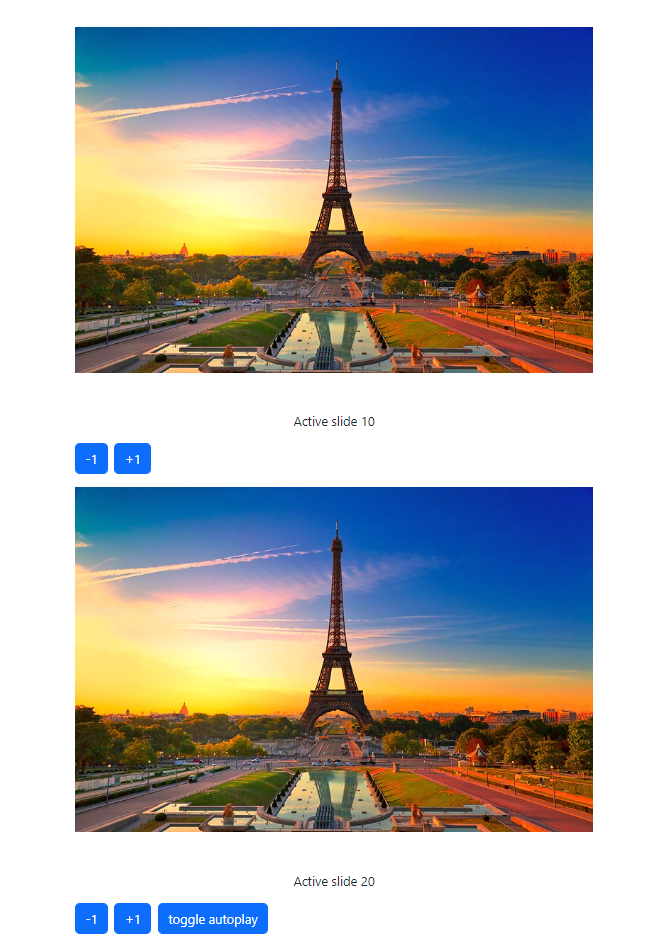

Так же есть второй вариант создания ХОКа, когда мы создаём функцию, которая вызывает создание функции, возвращающей компонент из переданного пропса в первую функцию. 

Конкретно тут ХОК обогащает переданный компонент в него логгером при рендере на странице 

```JS
const withLogger = (WrappedComponent) => (props) => {
	useEffect(() => {
		console.log('first render');
	}, []);

	return <WrappedComponent {...props} />;
};

const Hello = () => {
	return <h1>Hello</h1>;
};

const HelloWithLogger = withLogger(Hello);

function App() {
	return (
		<>
			<HelloWithLogger />
			<SliderWithFetchFirst />
			<SliderWithFetchSecond />
		</>
	);
}
```

И теперь компонент приветствия вызывает лог в консоли

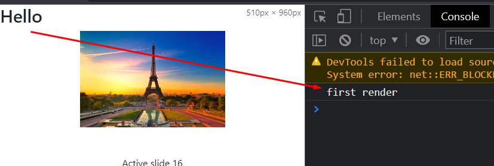

Итог:

>[!warning] Когда не стоит использовать HOC:
> - Если компоненты слишком разные и их логику не получается обобщить. Самый идеальный вариант, когда мы передаём минимальное количество пропсов в возвращаемый компонент:
> 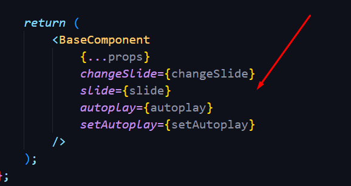
> - Если в проекте имеется только один компонент, который подходит для использования вместе с компонентом высшего порядка
> - Если приходится каждый раз модифицировать HOC при подключении нового компонента

>[!success] Когда использовать:
> - Когда много компонентов имеют схожую логику выполнения
> - Когда понятно, что ХОК не будет расти со временем из-за схожести логики
> - Когда нужно добавить общую логику для выполнения самых разных компонентов


## 020 Библиотеки и экосистема React

Современная разработка веб-приложений не представляется без использования сторонних библиотек: нужно быстро выполнить задачу, нужно выполнить задачу на уровне, хочется просто не придумывать велосипед - за всем этим можно обратиться к уже готовым библиотекам

>[!note] Полезные ссылки, на которых можно узнать побольше о библиотеках реакта:
>- [Тут](https://proglib.io/p/8-moshchnyh-bibliotek-react-kotorye-stoit-poprobovat-v-2021-godu-2021-01-15) находится список из 10 библиотек, которые позволяет заменить простой функционал реакта
>- [Тут](https://habr.com/ru/company/ruvds/blog/554280/) находятся полезные хуки, которые можно использовать в любом проекте
>- [Тут](https://techrocks.ru/2020/01/18/13-top-react-component-libraries/) находится список библиотек компонентов реакта
>- [Тут](https://www.bornfight.com/blog/top-10-react-hook-libraries/) находится топ реакт-хук-библиотек
>- [Это](https://usehooks.com/) портал с полезными хуками реакта
>- [Тут](https://dev.to/balaevarif/react-2021-10g4) находится информация по всей актуальной экосистеме реакта


## 021 React Transition Group


**React Transition Group** - классический модуль для создания анимаций в React.

```bash
npm install react-transition-group
```

Компонент `Transition`. Он принимает в себя на вход `nodeRef` (элемент ссылки), `in` (элемент появляется или исчезает со страницы) и `timeout` (длительность анимации)

Элемент при появлении делится на три этапа (пропс `in` в позиции `false`, что говорит об отсутствии элемента):
- `onEnter` - инициализация появления
- `onEntering` - появление
- `onEntered` - окончание появления на странице

Противоположные состояния имеются, при наличии элемента на странице (актуальна анимация исчезновения элемента со страницы)

Все этапы изображены тут:


Все промежутки ожидания имеют определённую длительность. Анимировать мы можем переход от `entering` к `entered` и от `exiting` к `exited`

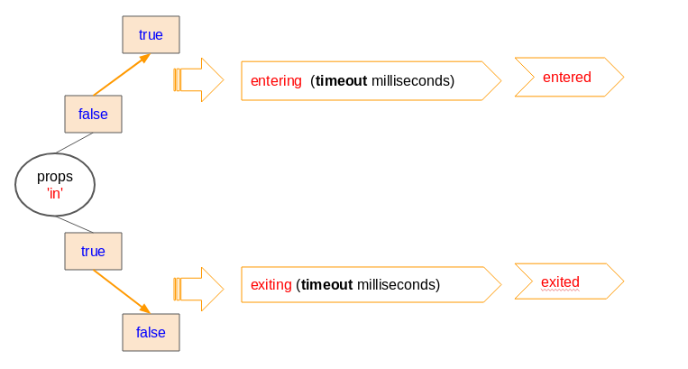


> Тут стоит отметить, что свойство `display` (`none` и `block`) невозможно анимировать, поэтому их не используем

```JS
import { useState, useRef } from 'react';
import { Container } from 'react-bootstrap';
import { Transition } from 'react-transition-group'; // импорт
import './App.css';

const Modal = ({ showModal, onClose }) => {
	// длительность
	const duration = 300;

	// базовые стили
	const defaultStyle = {
		transition: `all ${duration}ms ease-in-out`,
		opacity: 0,
		visibility: 'hidden',
	};

	// стили на разных этапах перехода
	const transitionStyles = {
		entering: { opacity: 1, visibility: 'visible' },
		entered: { opacity: 1, visibility: 'visible' },
		exiting: { opacity: 0, visibility: 'hidden' },
		exited: { opacity: 0, visibility: 'hidden' },
	};

	return (
		<Transition in={showModal} timeout={duration}>
			{(state) => (
				<div className='modal mt-5 d-block' style={{ ...defaultStyle, ...transitionStyles[state] }}>
					<div className='modal-dialog'>
						<div className='modal-content'>
							<div className='modal-header'>
								<h5 className='modal-title'>Typical modal window</h5>
								<button
									onClick={() => onClose(false)}
									type='button'
									className='btn-close'
									aria-label='Close'
								></button>
							</div>
							<div className='modal-body'>
								<p>Modal body content</p>
							</div>
							<div className='modal-footer'>
								<button onClick={() => onClose(false)} type='button' className='btn btn-secondary'>
									Close
								</button>
								<button onClick={() => onClose(false)} type='button' className='btn btn-primary'>
									Save changes
								</button>
							</div>
						</div>
					</div>
				</div>
			)}
		</Transition>
	);
};

function App() {
	const [showModal, setShowModal] = useState(false);

	return (
		<Container>
			<Modal showModal={showModal} onClose={setShowModal} />
			<button type='button' className='btn btn-warning mt-5' onClick={() => setShowModal(true)}>
				Open Modal
			</button>
		</Container>
	);
}

export default App;
```

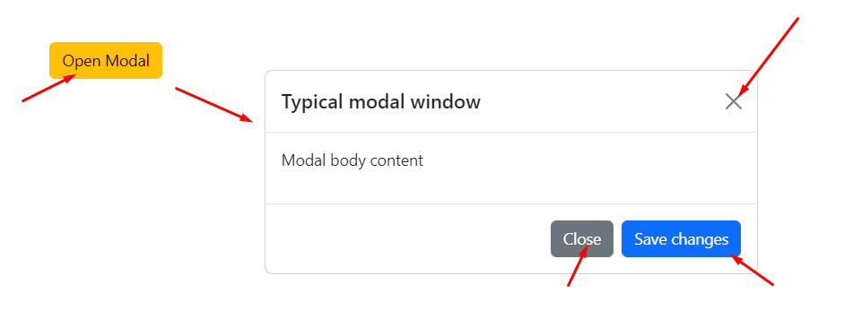

Так же в транзишене есть атрибут, который размонтирует компонент, когда его нет на странице

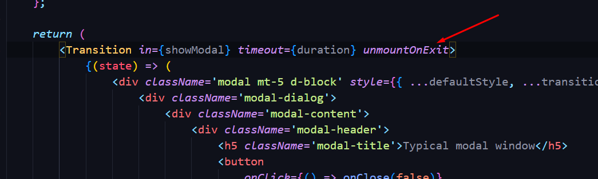

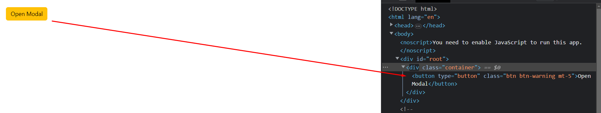

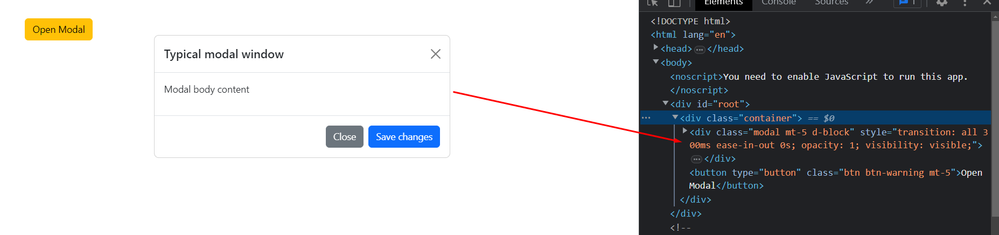

Так же стоит рассказать, что для транзишена ещё имеются и функции, которые позволяют выполнять разные операции на разных этапах анимации компонента.

Например, `onEntering` принимает в себя функцию, которая может выполниться во время появления компонента

Тут показан жизненный цикл выполнения данных функций:

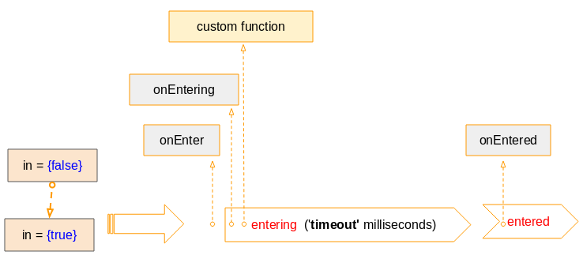

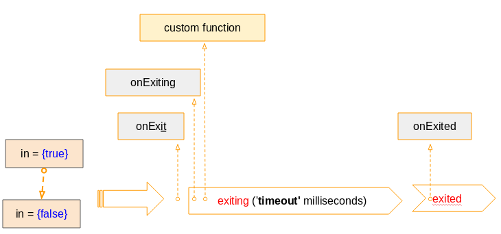

Например, нам нужно скрыть кнопку, которая является триггером для модального окна

```JS
const Modal = ({ showModal, setShowTrigger, onClose }) => {
	// длительность
	const duration = 300;

	// базовые стили
	const defaultStyle = {
		transition: `all ${duration}ms ease-in-out`,
		opacity: 0,
		visibility: 'hidden',
	};

	// стили на разных этапах перехода
	const transitionStyles = {
		entering: { opacity: 1, visibility: 'visible' },
		entered: { opacity: 1, visibility: 'visible' },
		exiting: { opacity: 0, visibility: 'hidden' },
		exited: { opacity: 0, visibility: 'hidden' },
	};

	return (
		<Transition in={showModal} timeout={duration} onEnter={() => setShowTrigger(false)} onExited={() => setShowTrigger(true)}>
			{(state) => (
				<div className='modal mt-5 d-block' style={{ ...defaultStyle, ...transitionStyles[state] }}>
					<div className='modal-dialog'>
						<div className='modal-content'>
							<div className='modal-header'>
								<h5 className='modal-title'>Typical modal window</h5>
								<button
									onClick={() => onClose(false)}
									type='button'
									className='btn-close'
									aria-label='Close'
								></button>
							</div>
							<div className='modal-body'>
								<p>Modal body content</p>
							</div>
							<div className='modal-footer'>
								<button onClick={() => onClose(false)} type='button' className='btn btn-secondary'>
									Close
								</button>
								<button onClick={() => onClose(false)} type='button' className='btn btn-primary'>
									Save changes
								</button>
							</div>
						</div>
					</div>
				</div>
			)}
		</Transition>
	);
};

function App() {
	const [showModal, setShowModal] = useState(false);
	const [showTrigger, setShowTrigger] = useState(true);

	return (
		<Container>
			<Modal showModal={showModal} setShowTrigger={setShowTrigger} onClose={setShowModal} />
			{showTrigger ? (
				<button type='button' className='btn btn-warning mt-5' onClick={() => setShowModal(true)}>
					Open Modal
				</button>
			) : null}
		</Container>
	);
}
```

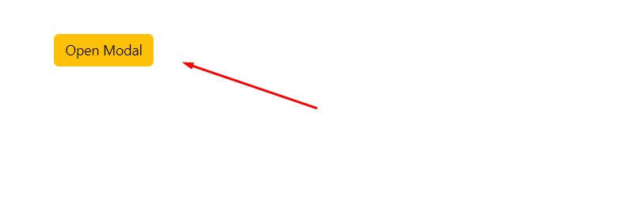

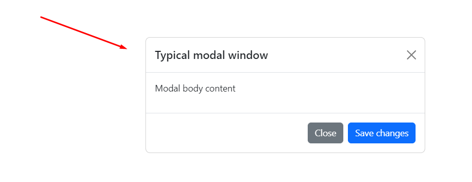

Далее идёт компонент `CSSTransition`. Его отличительная особенность заключается в том, что мы не должны передавать состояния внутрь компонента и рендерить весь компонент через функцию тоже не нужно. Этот компонент работает с готовыми стилями и производит анимацию на её основе.

Данный компонент принимает в себя атрибут classNames, где указывается начальное наименование стилей, которые относятся к этому компоненту и далее они воспроизводятся в зависимости от их префикса:
- `-enter`
- `-enter-active`
- `-exit`
- `-exit-active`

```JS
const Modal = ({ showModal, setShowTrigger, onClose }) => {
	// длительность
	const duration = 300;

	return (
		<CSSTransition
			in={showModal}
			timeout={duration}
			onEnter={() => setShowTrigger(false)}
			onExited={() => setShowTrigger(true)}
			// базовый className
			classNames={'modal'}
			// для решения проблем с обрывом анимации
			mountOnEnter
			unmountOnExit
		>
			<div className='modal mt-5 d-block'>
				<div className='modal-dialog'>
					<div className='modal-content'>
						<div className='modal-header'>
							<h5 className='modal-title'>Typical modal window</h5>
							<button
								onClick={() => onClose(false)}
								type='button'
								className='btn-close'
								aria-label='Close'
							></button>
						</div>
						<div className='modal-body'>
							<p>Modal body content</p>
						</div>
						<div className='modal-footer'>
							<button onClick={() => onClose(false)} type='button' className='btn btn-secondary'>
								Close
							</button>
							<button onClick={() => onClose(false)} type='button' className='btn btn-primary'>
								Save changes
							</button>
						</div>
					</div>
				</div>
			</div>
		</CSSTransition>
	);
};
```

```CSS
/* дефолтное состояние компонента */
/* лучше не использовать такой подход, а просто атрибутами в компоненте транзишена указать mountOnEnter и unmountOnExit */
/* .modal {
  visibility: hidden;
  opacity: 0;
} */

/* начало появления компонента */
.modal-enter {
  opacity: 0;
}

/* конечное состояние анимации компонента */
.modal-enter-active {
  visibility: visible;
  opacity: 1;
  transition: all 300ms;
}

/* указываем конечное состояние компонента */
.modal-enter-done {
  visibility: visible;
  opacity: 1;
}

.modal-exit {
  opacity: 1;
}

/* конечное состояние вышедшего компонента */
.modal-exit-active {
  visibility: hidden;
  opacity: 0;
  transition: all 300ms;
}

```

Далее идут два компоненты - `SwitchTransition` и `TransitionGroup` - это компоненты, которые модифицируют поведение первых двух

Основной особенностью `SwitchTransition` является переключение режимов анимации через атрибут `mode`:

- `out-in` - запускает анимацию и дожидаётся её окончания перед тем, как запустить анимацию другого компонента

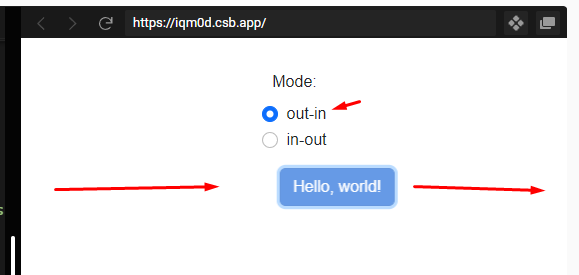

- `in-out` - сначала дожидается анимации появления второго компонента и только потом удаляет первый компонент со страницы

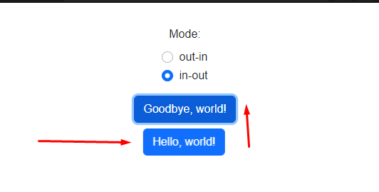


Компонент `TransitionGroup` занимается оборачиванием других компонентов анимации.

Конкретно в этом компоненте обычно разворачивают остальные компоненты транзишена из массива. Так же он позволяет не указывать атрибут `in`, так как этот компонент отслеживает начало всех анимаций.

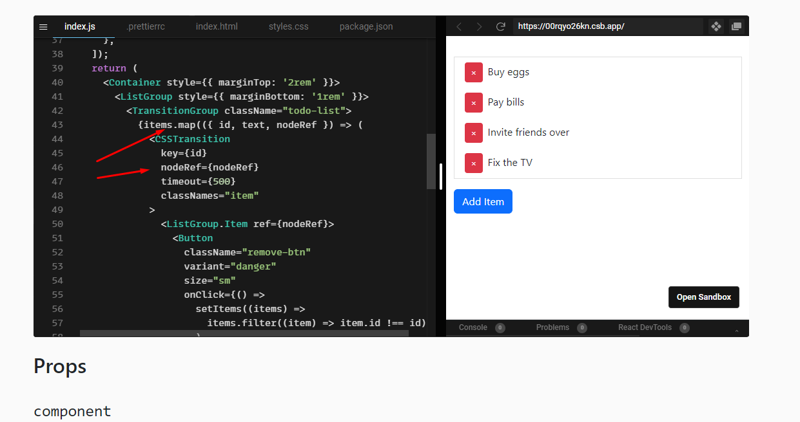


## 022 Formik, Yup и работа с формами любой сложности

```bash
npm i formik
```

==Formik== - это популярная библиотека под ==React== по работе с формами на странице.

- `initialValue` - важный начальный атрибут для компонента `Formik`. В него мы вписываем связанные имена с инпутами в виде ключей и их данные являются начальными значениями. Связь устанавливается с формами через атрибут внутри формы `name` или `id`
- `validate` - атрибут, который хранит функцию валидации форм
- `onSubmit` - атрибут, который хранит функцию, срабатывающую при отправке формы

Тут представлен пример классического использования формика на странице:

```JS
import React from 'react';
import { Formik } from 'formik';

const Basic = () => (
  <div>
    <h1>Anywhere in your app!</h1>
    <Formik
      // начальные значения
      initialValues={{ email: '', password: '' }}
      // функция валидации полей
      validate={values => {
        const errors = {};
        if (!values.email) {
          errors.email = 'Required';
        } else if (
          !/^[A-Z0-9._%+-]+@[A-Z0-9.-]+\.[A-Z]{2,}$/i.test(values.email)
        ) {
          errors.email = 'Invalid email address';
        }
        return errors;
      }}
      // функция сабмита формы
      onSubmit={(values, { setSubmitting }) => {
        setTimeout(() => {
          alert(JSON.stringify(values, null, 2));
          setSubmitting(false);
        }, 400);
      }}
    >
      {({
        values, // значения формы
        errors, // объект с ошибками
        touched, // отображает, трогал ли пользователь данную форму
        handleChange, // событие изменения формы
        handleBlur, // действие при снятии фокуса
        handleSubmit, // сабмит формы
        isSubmitting, // состояние сабмита формы
        /* and other goodies */
      }) => (
        // форма при сабмите будет выполнять данную операцию
        <form onSubmit={handleSubmit}>
          <input
            type="email" // тип
            name="email" // имя, которое связывает с initialValues
            onChange={handleChange} // действие при изменении
            onBlur={handleBlur} // действие при снятии фокуса
            value={values.email} // связывание значения
          />
          {/* отображаем ошибку, если такая появилась */}
          {errors.email && touched.email && errors.email}
          <input
            type="password"
            name="password"
            onChange={handleChange}
            onBlur={handleBlur}
            value={values.password}
          />
          {errors.password && touched.password && errors.password}
          <button type="submit" disabled={isSubmitting}>
            Submit
          </button>
        </form>
      )}
    </Formik>
  </div>
);

export default Basic;
```

Так же формик предоставляет готовые компоненты `Form`, `Field`, `ErrorMessage`, которые можно использовать в проекте вместо стандартных форм:

```JS
 // Render Prop
 import React from 'react';
 import { Formik, Form, Field, ErrorMessage } from 'formik';
 
 const Basic = () => (
   <div>
     <h1>Any place in your app!</h1>
     <Formik
       initialValues={{ email: '', password: '' }}
       validate={values => {
         const errors = {};
         if (!values.email) {
           errors.email = 'Required';
         } else if (
           !/^[A-Z0-9._%+-]+@[A-Z0-9.-]+\.[A-Z]{2,}$/i.test(values.email)
         ) {
           errors.email = 'Invalid email address';
         }
         return errors;
       }}
       onSubmit={(values, { setSubmitting }) => {
         setTimeout(() => {
           alert(JSON.stringify(values, null, 2));
           setSubmitting(false);
         }, 400);
       }}
     >
       {({ isSubmitting }) => (
         <Form>
           <Field type="email" name="email" />
           <ErrorMessage name="email" component="div" />
           <Field type="password" name="password" />
           <ErrorMessage name="password" component="div" />
           <button type="submit" disabled={isSubmitting}>
             Submit
           </button>
         </Form>
       )}
     </Formik>
   </div>
 );
 
 export default Basic;
```

Далее будет реализована форма отправки данных на пожертвования. Со всей формы будут собираться данные и выводиться в логе строковый вариант объекта

- функция `handleChange` будет перехватывать изменения внутри формы и определять, в какой произошли изменения
- функция формика `handleBlur` записывает формы в объект `touched`, который передаётся в форму внутри объекта `values`. После добавления этой функции в инпут, можно будет воспользоваться объектом `touched` для проверки при выводе ошибки

```JS
import { useFormik } from 'formik';

// функция валидации форм
const validate = (values) => {
	const errors = {}; // массив ошибок формы

	// если отсутствует имя
	if (!values.name) {
		errors.name = 'Обязательное поле!';

		// если имя меньше двух символов
	} else if (values.name.length < 2) {
		errors.name = 'Имя должно иметь больше двух символов!';
	}

	// если отсутствует почта
	if (!values.email) {
		errors.email = 'Обязательное поле!';

		// если почта не подходит по структуре
	} else if (!/^[A-Z0-9._%+-]+@[A-Z0-9.-]+\.[A-Z]{2,}$/i.test(values.email)) {
		errors.email = 'Нужно ввести корректную почту!';
	}

	return errors;
};

const Form = () => {
	// хук Формика
	const formik = useFormik({
		initialValues: {
			name: '',
			email: '',
			amount: 0,
			currency: '',
			text: '',
			terms: false,
		},
		validate, // эта функция валидации будет применяться автоматически
		onSubmit: (values) => {
			// данная функция выведет лог с объектом, который переведён в понятную строку
			console.log(JSON.stringify(values, null, 2));
		},
	});

	return (
		<form
			className='form'
			// сюда передаём функцию, которая будет перехватывать сабмит из формы
			onSubmit={formik.handleSubmit}
		>
			<h2>Отправить пожертвование</h2>
			<label htmlFor='name'>Ваше имя</label>
			<input
				id='name'
				name='name'
				type='text'
				// это значение будет связано с состоянием внутри формика
				value={formik.values.name}
				// эта функция будет отслеживать какие данные и в какой форме поменялись
				onChange={formik.handleChange}
				// сообщает формику, трогал ли пользователь данную форму
				onBlur={formik.handleBlur}
			/>
			{/* вывод ошибки */}
			{formik.errors.name && formik.touched.name ? (
				<div style={{ color: 'red' }}>{formik.errors.name}</div>
			) : null}
			<label htmlFor='email'>Ваша почта</label>
			<input
				id='email'
				name='email'
				type='email'
				value={formik.values.email}
				onChange={formik.handleChange}
				onBlur={formik.handleBlur}
			/>
			{formik.errors.email && formik.touched.email ? (
				<div style={{ color: 'red' }}>{formik.errors.email}</div>
			) : null}
			<label htmlFor='amount'>Количество</label>
			<input
				id='amount'
				name='amount'
				type='number'
				value={formik.values.amount}
				onChange={formik.handleChange}
				onBlur={formik.handleBlur}
			/>
			<label htmlFor='currency'>Валюта</label>
			<select
				id='currency'
				name='currency'
				value={formik.values.currency}
				onChange={formik.handleChange}
				onBlur={formik.handleBlur}
			>
				<option value=''>Выберите валюту</option>
				<option value='USD'>USD</option>
				<option value='UAH'>UAH</option>
				<option value='RUB'>RUB</option>
			</select>
			<label htmlFor='text'>Ваше сообщение</label>
			<textarea
				id='text'
				name='text'
				value={formik.values.text}
				onChange={formik.handleChange}
				onBlur={formik.handleBlur}
			/>
			<label
				className='checkbox'
				value={formik.values.terms}
				onChange={formik.handleChange}
				onBlur={formik.handleBlur}
			>
				<input name='terms' type='checkbox' />
				Соглашаетесь с политикой конфиденциальности?
			</label>
			<button type='submit'>Отправить</button>
		</form>
	);
};

export default Form;
```

- При вводе валидных данных форма будет их собирать и отправлять

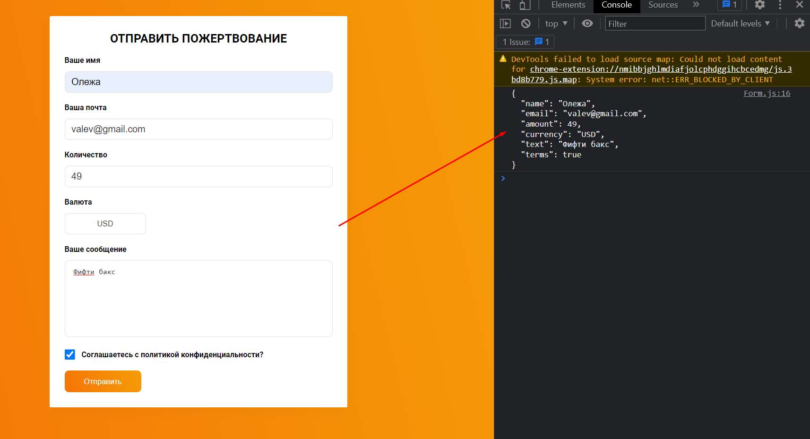

- Все формы могут воспринимать ошибки и реагируют на них

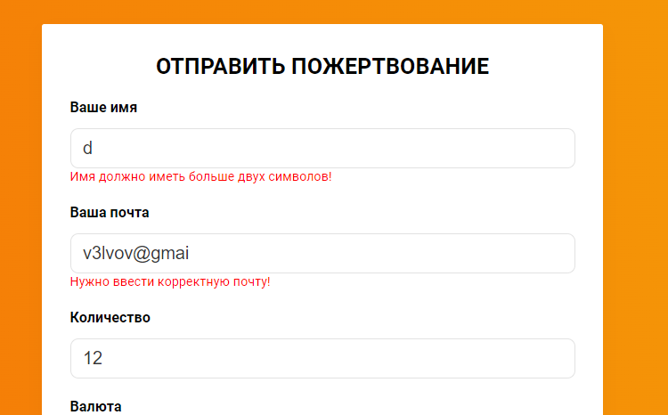

- У нас выделяется всего один инпут с ошибкой (а не сразу во всех отображается ошибка, как бы было без `touched`)
- Так же данные не будут отправляться, если в поле есть невалидные данные

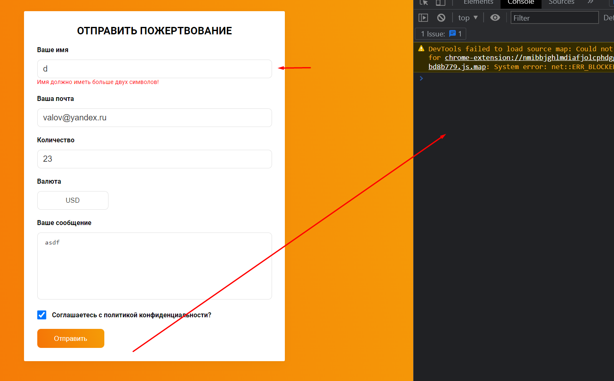

Самый простой вариант валидации - это использовать стороннюю библиотеку, которая поможет избежать рутинных процессов, а именно - Yup. Он уже имеет много методов для валидации данных в себе и очень прост в использовании.

```bash
npm i yup
```

Тут показан пример, заданный в `validationSchema` (функция валидации данных находится второй по списку!). Все значения описаны в объекте схемы и через чейн вызваются функции проверки данных с формы. Сам Юп возвращает один объект ошибки, который работает подобно нашей самостоятельной реализации выше

```JS
import { useFormik } from 'formik';
import * as Yup from 'yup';

const Form = () => {
	// хук Формика
	const formik = useFormik({
		initialValues: {
			name: '',
			email: '',
			amount: 0,
			currency: '',
			text: '',
			terms: false,
		},
		// тут мы должны описать схему валидации
		validationSchema: Yup.object({
			// поле name
			name: Yup.string() // тип - строка
				.min(2, 'Имя должно иметь больше двух символов!') // минимальная длина и сообщение
				.required('Обязательное поле'), // обязательно к заполнению
			email: Yup.string()
				.email('Нужно ввести корректную почту!')
				.required('Обязательное поле'),
			amount: Yup.number()
				.min(5, 'Пожертвование не меньше 5 уе')
				.max(1000, 'Пожертвование не больше 1000 уе')
				.required('Обязательное поле'),
			currency: Yup.string().required('Выберите валюту'),
			text: Yup.string(), // необязательное поле
			terms: Yup.boolean()
				.oneOf([true], 'Необходимо согласие') // тут значение будет валидным, если оно равно одному из указанных в массиве
				.required('Подтвердите согласие'),
		}),
		onSubmit: (values) => {
			// данная функция выведет лог с объектом, который переведён в понятную строку
			console.log(JSON.stringify(values, null, 2));
		},
	});

	return (
		<form
			className='form'
			// сюда передаём функцию, которая будет перехватывать сабмит из формы
			onSubmit={formik.handleSubmit}
		>
			<h2>Отправить пожертвование</h2>
			<label htmlFor='name'>Ваше имя</label>
			<input
				id='name'
				name='name'
				type='text'
				// это значение будет связано с состоянием внутри формика
				value={formik.values.name}
				// эта функция будет отслеживать какие данные и в какой форме поменялись
				onChange={formik.handleChange}
				// сообщает формику, трогал ли пользователь данную форму
				onBlur={formik.handleBlur}
			/>
			{/* вывод ошибки */}
			{formik.errors.name && formik.touched.name ? (
				<div style={{ color: 'red' }}>{formik.errors.name}</div>
			) : null}
			<label htmlFor='email'>Ваша почта</label>
			<input
				id='email'
				name='email'
				type='email'
				value={formik.values.email}
				onChange={formik.handleChange}
				onBlur={formik.handleBlur}
			/>
			{formik.errors.email && formik.touched.email ? (
				<div style={{ color: 'red' }}>{formik.errors.email}</div>
			) : null}
			<label htmlFor='amount'>Количество</label>
			<input
				id='amount'
				name='amount'
				type='number'
				value={formik.values.amount}
				onChange={formik.handleChange}
				onBlur={formik.handleBlur}
			/>
			{formik.errors.amount && formik.touched.amount ? (
				<div style={{ color: 'red' }}>{formik.errors.amount}</div>
			) : null}
			<label htmlFor='currency'>Валюта</label>
			<select
				id='currency'
				name='currency'
				value={formik.values.currency}
				onChange={formik.handleChange}
				onBlur={formik.handleBlur}
			>
				<option value=''>Выберите валюту</option>
				<option value='USD'>USD</option>
				<option value='UAH'>UAH</option>
				<option value='RUB'>RUB</option>
			</select>
			{formik.errors.currency && formik.touched.currency ? (
				<div style={{ color: 'red' }}>{formik.errors.currency}</div>
			) : null}
			<label htmlFor='text'>Ваше сообщение</label>
			<textarea
				id='text'
				name='text'
				value={formik.values.text}
				onChange={formik.handleChange}
				onBlur={formik.handleBlur}
			/>
			{formik.errors.text && formik.touched.text ? (
				<div style={{ color: 'red' }}>{formik.errors.text}</div>
			) : null}
			<label
				className='checkbox'
				value={formik.values.terms}
				onChange={formik.handleChange}
				onBlur={formik.handleBlur}
			>
				<input name='terms' type='checkbox' />
				Соглашаетесь с политикой конфиденциальности?
			</label>
			{formik.errors.terms && formik.touched.terms ? (
				<div style={{ color: 'red' }}>{formik.errors.terms}</div>
			) : null}
			<button type='submit'>Отправить</button>
		</form>
	);
};

export default Form;
```

И так выглядят все реакции на ошибки в форме:

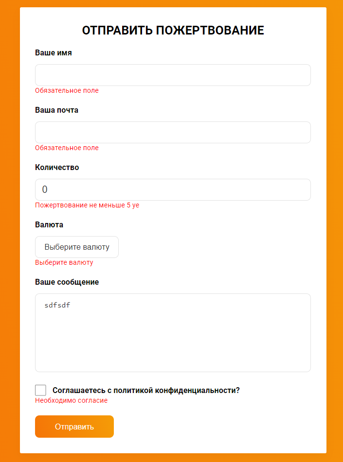

Так же вместо того, чтобы писать везде одинаковые атрибуты, можно просто вставлять деструктурированный вызов функции `getFieldProps('имя_поля')`, который вернёт все нужные атрибуты в инпут 

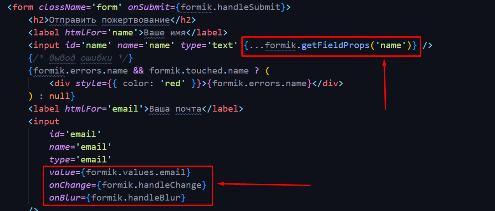

Далее, чтобы использовать компоненты самого формика, нужно будет переписать код на классическое поведение без хука 

- Нам нужно будет удалить все использования переменной `formik`
- Перенести все данные из хука в компонент `Formik`
- Убрать хук
- Убрать все лишние атрибуты из инпутов
- Переименовать инпуты в `Field`
- Вместо условных конструкций с выводом ошибки написать вывод через `ErrorMessage`

```JS
import { Formik, Form, Field, ErrorMessage } from 'formik';
import * as Yup from 'yup';

const FormInput = () => {
	return (
		<Formik
			initialValues={{
				name: '',
				email: '',
				amount: 0,
				currency: '',
				text: '',
				terms: false,
			}}
			validationSchema={Yup.object({
				name: Yup.string()
					.min(2, 'Имя должно иметь больше двух символов!')
					.required('Обязательное поле'),
				email: Yup.string()
					.email('Нужно ввести корректную почту!')
					.required('Обязательное поле'),
				amount: Yup.number()
					.min(5, 'Пожертвование не меньше 5 уе')
					.max(1000, 'Пожертвование не больше 1000 уе')
					.required('Обязательное поле'),
				currency: Yup.string().required('Выберите валюту'),
				text: Yup.string(),
				terms: Yup.boolean()
					.oneOf([true], 'Необходимо согласие')
					.required('Подтвердите согласие'),
			})}
			onSubmit={(values) => {
				console.log(JSON.stringify(values, null, 2));
			}}
		>
			<Form className='form'>
				<h2>Отправить пожертвование</h2>
				<label htmlFor='name'>Ваше имя</label>
				<Field id='name' name='name' type='text' />
				<ErrorMessage name={'name'} className={'error'} component={'div'} />
				<label htmlFor='email'>Ваша почта</label>
				<Field id='email' name='email' type='email' />
				<ErrorMessage name={'email'} className={'error'} component={'div'} />
				<label htmlFor='amount'>Количество</label>
				<Field id='amount' name='amount' type='number' />
				<ErrorMessage name={'amount'} className={'error'} component={'div'} />
				<label htmlFor='currency'>Валюта</label>
				<Field id='currency' name='currency' as={'select'}>
					<option value=''>Выберите валюту</option>
					<option value='USD'>USD</option>
					<option value='UAH'>UAH</option>
					<option value='RUB'>RUB</option>
				</Field>
				<ErrorMessage name={'currency'} className={'error'} component={'div'} />
				<label htmlFor='text'>Ваше сообщение</label>
				<Field id='text' name='text' as={'textarea'} />
				<ErrorMessage name={'text'} className={'error'} component={'div'} />
				<label className='checkbox'>
					<Field name='terms' type='checkbox' />
					Соглашаетесь с политикой конфиденциальности?
				</label>
				<ErrorMessage name={'terms'} className={'error'} component={'div'} />
				<button type='submit'>Отправить</button>
			</Form>
		</Formik>
	);
};

export default FormInput;
```

В итоге мы имеем ровно такую же форму, но более оптимизированную по коду

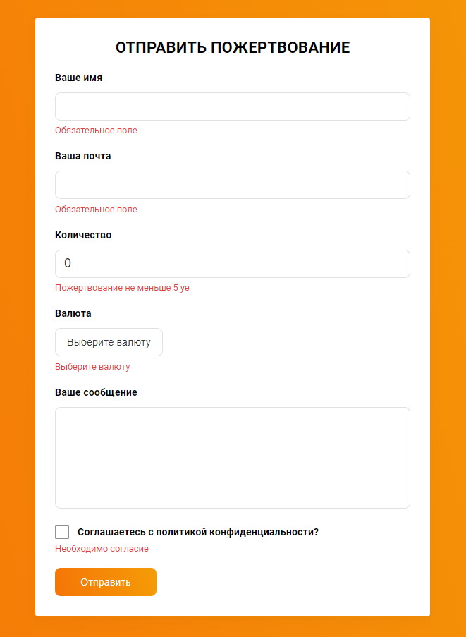

Когда мы говорим про чистую работу с формиком, то он сам подставляет все нужные значения в формы, которые мы обозначили как `Field`. Сам Field - это общее поле, которое можно через атрибут `as` указать как другое поле (селект или текстэриа)

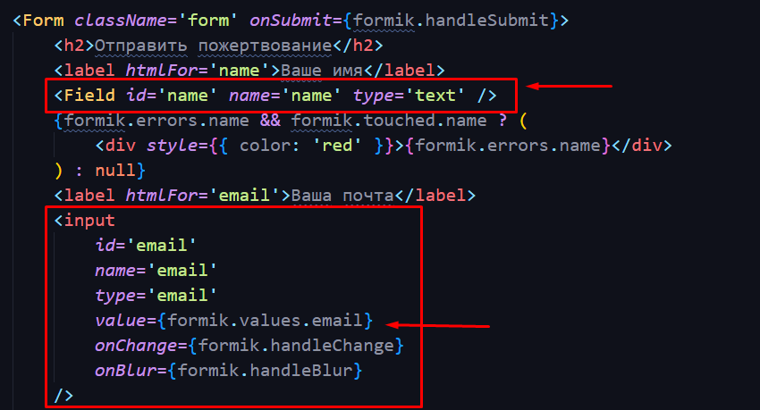

Так же и с полем ошибки - использовать готовый компонент `ErrorMessage` куда более простой и быстрый вариант. Оно в себя принимает:
- `name` - имя поля, к которому привязывается ошибка
- `component` - тег, которым оно отрендерится на странице

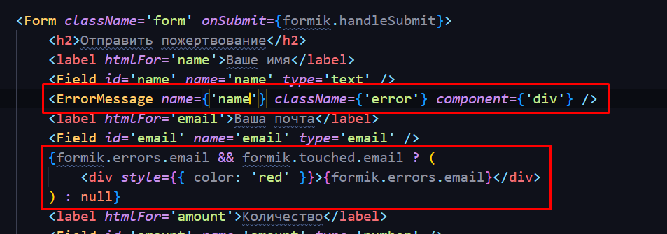

Так же есть другой вариант отобразить ошибку - расположить функцию по отрисовке внутри компонента

```JS
<ErrorMessage name="email">{msg => <div>{msg}</div>}</ErrorMessage>
```

Ну и так же формик предоставляет хук `useField`, который позволяет нам сделать свои шаблоны под повторяющиеся формы на странице. Сам хук в себя принимает пропсы, а возвращает кортеж из значений:
- `field` - хранит в себе пропсы формика (включая события `onChange`, `onBlur` и `onValue`)
- `meta` - хранит метаданные с ошибками и был ли использован данный инпут

```JS
import { Formik, Form, Field, ErrorMessage, useField } from 'formik';
import * as Yup from 'yup';

const CustomInput = ({ label, ...props }) => {
	// данный хук позволит присвоить данные из формика в наши инпуты
	const [field, meta] = useField(props);

	return (
		<>
			<label htmlFor={props.name}>{label}</label>
			<input {...props} {...field} />
			{meta.touched && meta.error ? <div className={'error'}>{meta.error}</div> : null}
		</>
	);
};

const CustomCheckbox = ({ children, ...props }) => {
	// тут дополнительно разворачиваем тип инпута как чекбокс
	const [field, meta] = useField({ ...props, type: 'checkbox' });

	return (
		<>
			{/* лейбл без атрибута htmlFor, так как инпут внутри */}
			<label className='checkbox'>
				<input type='checkbox' {...props} {...field} />
				{children}
			</label>
			{meta.touched && meta.error ? <div className={'error'}>{meta.error}</div> : null}
		</>
	);
};

const CustomTextarea = ({ label, ...props }) => {
	const [field, meta] = useField({ ...props, type: 'textarea' });

	return (
		<>
			<label htmlFor={props.name}>{label}</label>
			<textarea {...props} {...field} />
			{meta.touched && meta.error ? <div className={'error'}>{meta.error}</div> : null}
		</>
	);
};

const FormInput = () => {
	return (
		<Formik
			initialValues={{
				name: '',
				email: '',
				amount: 0,
				currency: '',
				text: '',
				terms: false,
			}}
			validationSchema={Yup.object({
				name: Yup.string()
					.min(2, 'Имя должно иметь больше двух символов!')
					.required('Обязательное поле'),
				email: Yup.string()
					.email('Нужно ввести корректную почту!')
					.required('Обязательное поле'),
				amount: Yup.number()
					.min(5, 'Пожертвование не меньше 5 уе')
					.max(1000, 'Пожертвование не больше 1000 уе')
					.required('Обязательное поле'),
				currency: Yup.string().required('Выберите валюту'),
				text: Yup.string(),
				terms: Yup.boolean()
					.oneOf([true], 'Необходимо согласие')
					.required('Подтвердите согласие'),
			})}
			onSubmit={(values) => {
				console.log(JSON.stringify(values, null, 2));
			}}
		>
			<Form className='form'>
				<h2>Отправить пожертвование</h2>
				<CustomInput label={'Ваше имя'} id='name' name='name' type='text' />
				<CustomInput label={'Ваша почта'} id='email' name='email' type='email' />
				<CustomInput label={'Количество'} id='amount' name='amount' type='number' />

				<Field id='currency' name='currency' as={'select'}>
					<option value=''>Выберите валюту</option>
					<option value='USD'>USD</option>
					<option value='UAH'>UAH</option>
					<option value='RUB'>RUB</option>
				</Field>
				<ErrorMessage name={'currency'} className={'error'} component={'div'} />

				<CustomTextarea label={'Ваше сообщение'} id='text' name='text' />

				<CustomCheckbox name={'terms'}>
					Соглашаетесь с политикой конфиденциальности?
				</CustomCheckbox>

				<button type='submit'>Отправить</button>
			</Form>
		</Formik>
	);
};

export default FormInput;
```

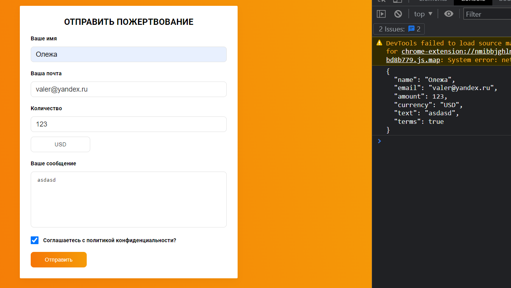


## 024 Разбор домашнего задания


Первым делом, нужно добавить метод, который достанет одного персонажа с сервера по имени

`service > MarvelService.js`
```JS
// Вариант модификации готового метода для поиска по имени.  
// Вызывать его можно вот так: getAllCharacters(null, name)  
  
// const getAllCharacters = async (offset = _baseOffset, name = '') => {  
//     const res = await request(`${_apiBase}characters?limit=9&offset=${offset}${name ? `&name=${name}` : '' }&${_apiKey}`);  
//     return res.data.results.map(_transformCharacter);  
// }  
  
// Или можно создать отдельный метод для поиска по имени  
  
// дополнительная функция для поиска персонажа по имени  
const getCharacterByName = async (name) => {  
   const res = await request(`${_apiBase}characters?name=${name}&${_apiKey}`);  
   return res.data.results.map(_transformCharacter);  
};
```

Далее добавим компонент поиска персонажа

`components > CharSearchForm > CharSearchForm.js`
```JS
import { useState } from 'react';
import { Formik, Form, Field, ErrorMessage as FormikErrorMessage } from 'formik';
import * as Yup from 'yup';
import { Link } from 'react-router-dom';

import useMarvelService from '../../services/MarvelService';
import ErrorMessage from '../errorMessage/ErrorMessage';

import './charSearchForm.scss';

// форма поиска персонажа
const CharSearchForm = () => {
	// сюда будет помещаться найденный персонаж
	const [char, setChar] = useState(null);
	// тут мы импортируем функции из сервиса
	const { loading, error, getCharacterByName, clearError } = useMarvelService();

	// при загрузке будем устанавливать персонажа
	const onCharLoaded = (char) => {
		setChar(char);
	};

	// обновляем персонажа в поиске
	const updateChar = (name) => {
		clearError();

		getCharacterByName(name).then(onCharLoaded);
	};

	// сообщение с ошибкой, если форма не прогрузится
	const errorMessage = error ? (
		<div className='char__search-critical-error'>
			<ErrorMessage />
		</div>
	) : null;

	// это тот ответ, который увидит пользователь по результатам поиска
	// если персонажа нет, то ничего не делаем
	// в противном случае, если длина введённого персонажа больше нуля, то выводим предложение перейти на страницу
	// в противном случае, выводим, что персонажа нет на странице
	const results = !char ? null : char.length > 0 ? (
		<div className='char__search-wrapper'>
			<div className='char__search-success'>There is! Visit {char[0].name} page?</div>
			<Link to={`/characters/${char[0].id}``} className='button button__secondary'>
				<div className='inner'>To page</div>
			</Link>
		</div>
	) : (
		<div className='char__search-error'>
			The character was not found. Check the name and try again
		</div>
	);

	return (
		<div className='char__search-form'>
			<Formik
				// начальное значение - имя персонажа
				initialValues={{
					charName: '',
				}}
				// схема валидации
				validationSchema={Yup.object({
					// поле обязательне и является строкой
					charName: Yup.string().required('This field is required'),
				})}
				// при сабмите отправляем апдейтим персонажа
				onSubmit={({ charName }) => {
					updateChar(charName);
				}}
			>
				<Form>
					<label className='char__search-label' htmlFor='charName'>
						Or find a character by name:
					</label>
					<div className='char__search-wrapper'>
						<Field id='charName' name='charName' type='text' placeholder='Enter name' />
						<button type='submit' className='button button__main' disabled={loading}>
							<div className='inner'>find</div>
						</button>
					</div>
					<FormikErrorMessage
						component='div'
						className='char__search-error'
						name='charName'
					/>
				</Form>
			</Formik>
			{/* выводим результат поиска пользователю */}
			{results}

			{/* выводим сообщение об ошибке поиска пользователю */}
			{errorMessage}
		</div>
	);
};

export default CharSearchForm;
```

Тут добавим компонент поиска персонажа на страницу под информацией о выбранном персонаже из списка

`components > pages > MainPage.js`
```JS
const MainPage = () => {
	const [selectedChar, setChar] = useState(null);

	const onCharSelected = (id) => {
		setChar(id);
	};

	return (
		<>
			<ErrorBoundary>
				<RandomChar />
			</ErrorBoundary>
			<div className='char__content'>
				<ErrorBoundary>
					<CharList onCharSelected={onCharSelected} />
				</ErrorBoundary>
				{/* здесь, в боковой части страницы, будет располагаться инфо о персонаже и поиск */}
				<div>
					<ErrorBoundary>
						<CharInfo charId={selectedChar} />
					</ErrorBoundary>
					<ErrorBoundary>
						<CharSearchForm />
					</ErrorBoundary>
				</div>
			</div>
			
		</>
	);
};
```

Тут будет содержаться логика поведения страницы для комикса или персонажа

`components > pages > SinglePage.js`
```JS
import { useParams } from 'react-router-dom';
import { useState, useEffect } from 'react';

// Хотелось бы вынести функцию по загрузке данных как отдельный аргумент
// Но тогда мы потеряем связь со стэйтами загрузки и ошибки
// А если вынесем их все в App.js - то они будут одни на все страницы

// страница одного персонажа или комикса
const SinglePage = ({ Component, dataType }) => {
	// получаем id персонажа или комикса из параметров
	const { id } = useParams();
    // устанавливаем данные
	const [data, setData] = useState(null);
    // получаем методы из сервиса
	const { loading, error, getComic, getCharacter, clearError } = useMarvelService();

    // обновляем данные при изменении id
	useEffect(() => {
		updateData();
	}, [id]);

    // обновляем данные в комиксе или персонаже в зависимости от свича
	const updateData = () => {
		clearError(); // очищяем ошибку, чтобы можно было обновить данные

		switch (dataType) {
			case 'comic':
				getComic(id).then(onDataLoaded);
				break;
			case 'character':
				getCharacter(id).then(onDataLoaded);
		}
	};

    // устанавливаем в состояние
	const onDataLoaded = (data) => {
		setData(data);
	};

	const errorMessage = error ? <ErrorMessage /> : null;
	const spinner = loading ? <Spinner /> : null;
	const content = !(loading || error || !data) ? <Component data={data} /> : null;

	return (
		<>
			<AppBanner />
			{errorMessage}
			{spinner}
			{content}
		</>
	);
};

export default SinglePage;
```

И тут мы создаём лейаут для отдельного персонажа

`components > pages > SingleCharacterLayout > SingleCharacterLayout.js`
```JS
import './singleCharacterLayout.scss';

const SingleCharacterLayout = ({data}) => {

    const {name, description, thumbnail} = data;

    return (
        <div className="single-comic">
            
            <div className="single-comic__info">
                <h2 className="single-comic__name">{name}</h2>
                <p className="single-comic__descr">{description}</p>
            </div>
        </div>
    )
}

export default SingleCharacterLayout;
```

Таким образом выглядят лейауты со стилями в страницах:

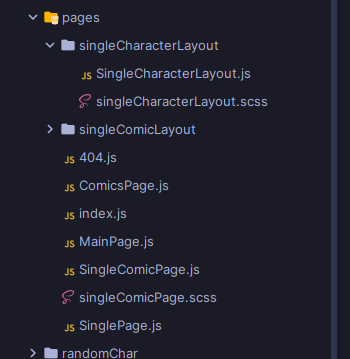

И финальная часть. Уже компонент `App` определяет то, какая страница у нас загружается - персонаж или комикс. Тут в компонент передаётся `dataType`, который определяет запрос свичч-конструкции

`component > app > App.js`
```JS
import { lazy, Suspense } from 'react';
import { BrowserRouter as Router, Route, Switch } from 'react-router-dom';

import AppHeader from '../appHeader/AppHeader';
import Spinner from '../spinner/Spinner';

const Page404 = lazy(() => import('../pages/404'));
const MainPage = lazy(() => import('../pages/MainPage'));
const ComicsPage = lazy(() => import('../pages/ComicsPage'));
const SingleComicLayout = lazy(() => import('../pages/singleComicLayout/SingleComicLayout'));
const SingleCharacterLayout = lazy(() =>
	import('../pages/singleCharacterLayout/SingleCharacterLayout'),
);
const SinglePage = lazy(() => import('../pages/SinglePage'));

const App = () => {
	return (
		<Router>
			<div className='app'>
				<AppHeader />
				<main>
					<Suspense fallback={<Spinner />}>
						<Switch>
							<Route exact path='/'>
								<MainPage />
							</Route>
							<Route exact path='/comics'>
								<ComicsPage />
							</Route>
                            {/* рендер комиксов */}
							<Route exact path='/comics/:id'>
								<SinglePage 
									Component={SingleComicLayout} 
									dataType='comic' 
								/>
							</Route>
                            {/* рендер персонажей */}
							<Route exact path='/characters/:id'>
								<SinglePage
									Component={SingleCharacterLayout}
									dataType='character'
								/>
							</Route>
							<Route path='*'>
								<Page404 />
							</Route>
						</Switch>
					</Suspense>
				</main>
			</div>
		</Router>
	);
};

export default App;
```

Итог: мы имеем форму поиска, которая реагирует на действия пользователя и предоставляет возможность перейти на страницу по персонажу

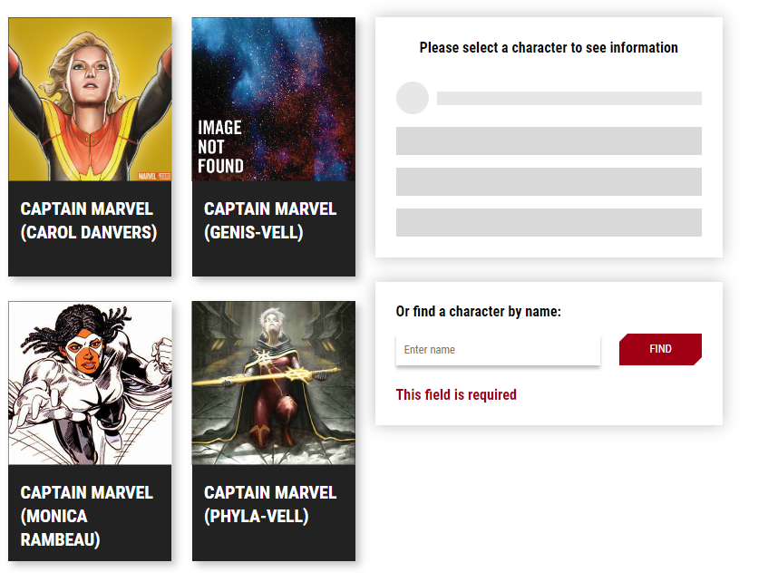

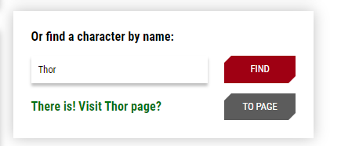

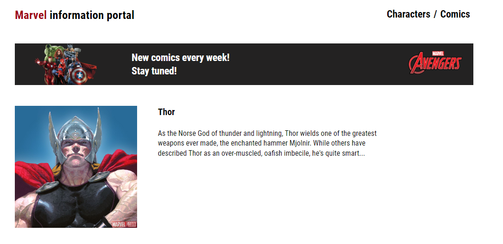


## 025 SEO-оптимизация веб-приложений, React-helmet


SEO - Search Engine Optimization - это отрасль оптимизации поисковых запросов за счёт выполнения сайтом определённых требований  

Основные показатели, влияющие на СЕО положительно:
- Валидность вёрстки
- Использования семантической вёрстки и валидность тегов
- Скорость загрузки
- Заполнены для каждой страницы правильно метатеги и тайтл (они будут отображаться в поиске), а так же использование OG-тегов

Основной проблемой современных SPA является то, что они не отображают никакого контента, даже когда на них зайдёт робот (он видит только пустой `div`), что приводит к снижению СЕО-оптимизации.

Обычно, чтобы бороться с такой проблемой, используют фреймворки с SSR (рендерингом страницы на стороне сервера), который сразу отдаёт отрендеренную страницу любому пользователю или роботу. Самый популярный из имеющихся - NextJS. Он хранит в себе все возможности для оптимизации страницы (сам конвертирует изображения, предоставляет роутинг, рендеринг на сервере, общение с сервером через пропсы и даёт настроить метатеги на всех страницах)

Однако подход с SSR требует много вычислительных ресурсов, что приводит к сильной нагрузке на сервера. Поэтому обычно используется пререндеринг страницы через тот же `react-snap`, который будет отдавать боту готовую страницу  

Чтобы настроить метатеги на странице можно воспользоваться модулем `react-helmet`, который будет работать как на клиенте, так и на сервере

```bash
npm i react-helmet
```

Добавление мета-тегов на страницу выглядит просто: 
- Добавляем тег `Helmet` в компонент
- Внутрь него вставляем нужные мета-теги либо можем передавать их в качестве атрибутов компонента

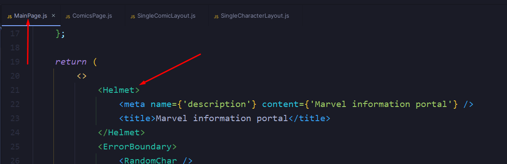

Вставим мету на страницу со списком комиксов

`components > pages > ComicsPage.js`
```JS
import ComicsList from '../comicsList/ComicsList';
import AppBanner from '../appBanner/AppBanner';
import { Helmet } from 'react-helmet';

const ComicsPage = () => {
	return (
		<>
			<Helmet>
				<meta name={'description'} content={'Comics Marvel'} />
				<title>Marvel comics</title>
			</Helmet>
			<AppBanner />
			<ComicsList />
		</>
	);
};

export default ComicsPage;
```

Вставим мету на страницу комиксов

`components > pages > SingleComicLayout.js`
```JS
const SingleComicLayout = ({ data }) => {
	const { title, description, pageCount, thumbnail, language, price } = data;

	return (
		<div className='single-comic'>
			<Helmet>
				<meta name={'description'} content={`${title} comics``} />
				<title>{title}</title>
			</Helmet>
			
			<div className='single-comic__info'>
				<h2 className='single-comic__name'>{title}</h2>
				<p className='single-comic__descr'>{description}</p>
				<p className='single-comic__descr'>{pageCount}</p>
				<p className='single-comic__descr'>Language: {language}</p>
				<div className='single-comic__price'>{price}</div>
			</div>
			<Link to='/comics' className='single-comic__back'>
				Back to all
			</Link>
		</div>
	);
};
```

Вставим мету на страницу персонажей

`components > pages > SingleCharacterLayout.js`
```JS
const SingleCharacterLayout = ({ data }) => {
	const { name, description, thumbnail } = data;

	return (
		<div className='single-comic'>
			<Helmet>
				<meta name={'description'} content={description} />
				<title>{name}</title>
			</Helmet>
			
			<div className='single-comic__info'>
				<h2 className='single-comic__name'>{name}</h2>
				<p className='single-comic__descr'>{description}</p>
			</div>
		</div>
	);
};
```

И так же можно убрать мета-теги из хтмлки

`index.html`
```HTML
<!DOCTYPE html>
<html lang="en">
  <head>
    <meta charset="utf-8" />
    <link rel="icon" href="%PUBLIC_URL%/favicon.ico" />
    <meta name="viewport" content="width=device-width, initial-scale=1" />
    <meta name="theme-color" content="#000000" />
  </head>
  <body>
    <noscript>You need to enable JavaScript to run this app.</noscript>
    <div id="root"></div>
  </body>
</html>
```

И теперь на всех страницах имеются свои мета-теги

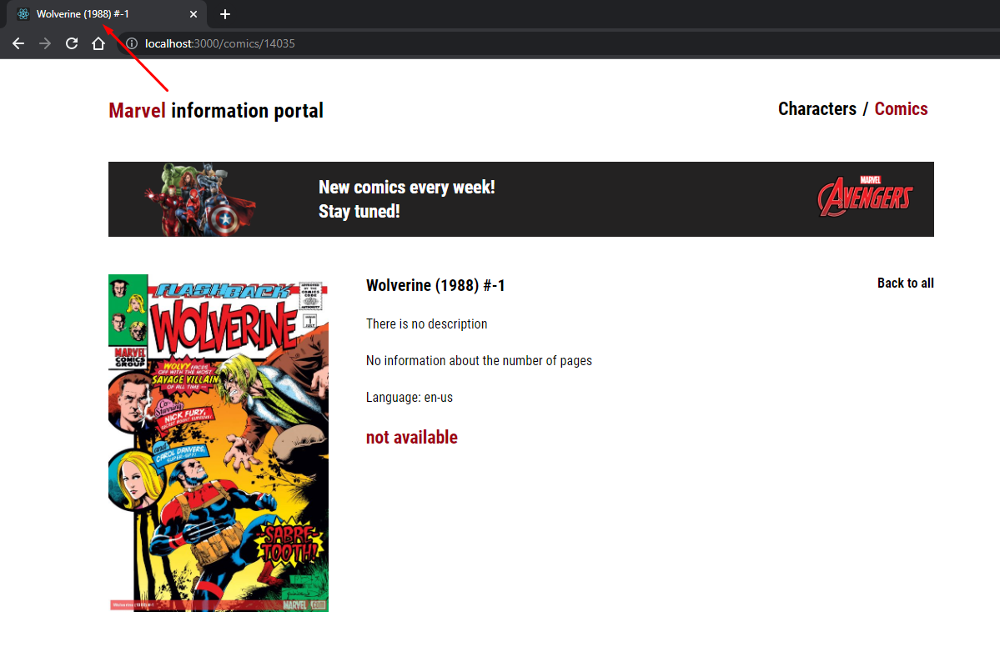


## 026 Принцип конечного автомата (FSM, Finite-state machine) и +1 подход к состояниям


Начнём с того, что в приведённом примере ниже, отображение на странице зависит от данных четырёх состояний. Это очень громоздкая и зачастую непонятная конструкция, но ей пользуются для реализации вёрстки на страницах.

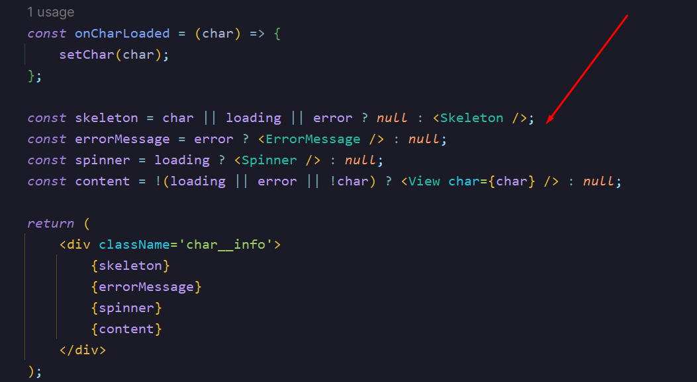

И тут к нам приходит **Концепция Конечного Автомата** (FSM - Finite-State Machine - State Machine - Машина состояний). Это такая сущность (математическая модель), которая имеет определённое количество состояний. То есть данная сущность может иметь ровно одно состояние в определённый момент времени.

Если кнопка скрыта, то она уже имеет определённое состояние. Она не может быть выключена, так как она скрыта и так далее.

На примере курьера можно привести его состояния:
- Ожидание (тут он может отдохнуть, выпить кофе)
- Получение заказа (тут он уже уточняет адрес, общается с заказчиком и так далее)
- Доставка заказа (уже тут он перемещается к заказчику)
- Получение оплаты (а тут получает оплату и дальше переходит в состояние ожидания)

Данная концепция не выделяется как отдельный приём. Оно отвечает лишь за то, что мы контролируем количество состояний, которое может быть в приложении.

Для работы со машиной состояний имеется несколько библиотек под JS (их стоит использовать уже вместе с `Redux`):
- [Xstate](https://xstate.js.org/docs/recipes/react.html)
- [Robot](https://thisrobot.life/)
- [Machina.js](http://machina-js.org/)

Модифицируем хук, который выполняет получение данных с сервера. В него на каждый из этапов будем устанавливать состояние процесса, который будет вызвать определённый рендер в компонентах

Первым делом, мы можем удалить состояния `loading` и `error` из хука и так же установку этих состояний внутри хука

`hooks > http.hook.js`
```JS
import { useState, useCallback } from 'react';

export const useHttp = () => {
	// Эти две строки больше НЕ НУЖНЫ, так как мы больше не используем данные состояния, а перекладываем всю ответственность на состояние process
	// const [loading, setLoading] = useState(false);
	// const [error, setError] = useState(null);
	
	// тут будет находиться состояние процесса
	// начальное - ожидание
	const [process, setProcess] = useState('waiting');

	const request = useCallback(
		async (
			url,
			method = 'GET',
			body = null,
			headers = { 'Content-Type': 'application/json' },
		) => {
			// тут происходит загрузка
			setProcess('loading');

			try {
				const response = await fetch(url, { method, body, headers });

				if (!response.ok) {
					throw new Error(`Could not fetch ${url}, status: ${response.status}`);
				}

				const data = await response.json();

				return data;
			} catch (e) {
				// так же состояние может принять в себя ошибку
				setProcess('error');
				throw e;
			}
		},
		[],
	);

	const clearError = useCallback(() => {
		// тут так же будет стоять ожидание
		setProcess('waiting');
	}, []);

	return { request, clearError, process, setProcess };
};
```

Возвращаем хук установки процесса и состояние самого процесса через хук сервиса общения с сервером

`service > MarvelService.js`
```JS
const useMarvelService = () => {
	const { request, clearError, process, setProcess } = useHttp();

	/// CODE ...

	return {
		clearError,
		getAllCharacters,
		getCharacterByName,
		getCharacter,
		getAllComics,
		getComic,
		process,
		setProcess,
	};
};
```

Эта уже сама машина состояний. Тут мы определяем, какие процессы будут выполняться на разных этапах процесса

`utils > setContent.js`
```JS
import Skeleton from '../components/skeleton/Skeleton';
import Spinner from '../components/spinner/Spinner';
import ErrorMessage from '../components/errorMessage/ErrorMessage';

// по состоянию процесса компонент будет рендерить разные части интерфейса
export const setContent = (process, Component, data) => {
	switch (process) {
		case 'waiting':
			return <Skeleton />;
		case 'loading':
			return <Spinner />;
		case 'confirmed':
			return <Component data={data} />;
		case 'error':
			return <ErrorMessage />;
		default:
			throw new Error('Unexpected process state in this case');
	}
};
```

И далее тут в рендере используем `setContent()`. Эта функция будет каждый раз перевызываться при изменении состояния `process`. Так же в этом же компоненте нужно вызывать `setProcess` после того, как мы получили данные внутри `updateChar`

`component > charInfo > CharInfo.js`
```JS
const CharInfo = (props) => {
	const [char, setChar] = useState(null);

	const { getCharacter, clearError, process, setProcess } = useMarvelService();

	useEffect(() => {
		updateChar();
	}, [props.charId]);

	const updateChar = () => {
		const { charId } = props;
		if (!charId) {
			return;
		}

		clearError();
		getCharacter(charId)
			.then(onCharLoaded)
			// тут мы подтверждаем загрузку данных, чтобы рендер персонажа был с данными
			.then(() => setProcess('confirmed'));
	};

	const onCharLoaded = (char) => {
		setChar(char);
	};

	return <div className='char__info'>{setContent(process, View, char)}</div>;
};
```

Так же стоит переименовать пропс, получаемый в компоненте на тот, что передаётся внутри свича

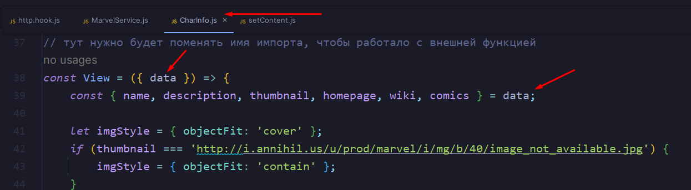

Тут так же пришлось решать проблему с тем, что в списке во время загрузки отображалось `null` (это приводит к тому, что мы поднимаемся вверх страницы и заново приходится скроллить вниз по списку). Эту проблему можно было решить только переписав функцию установки контента, где мы в загрузке показываем старый список или спиннер (если старых элементов списка нет)

`component > charList > CharList.js`
```JS
// !!!
export const setContent = (process, Component, newItemLoading) => {
	switch (process) {
		case 'waiting':
			return <Spinner />;
		case 'loading':
			// если у нас грузятся новые элементы, то оставляем список, если нет, то показываем спиннер
			return newItemLoading ? <Component /> : <Spinner />;
		case 'confirmed':
			return <Component />;
		case 'error':
			return <ErrorMessage />;
		default:
			throw new Error('Unexpected process state in this case');
	}
};

const CharList = (props) => {
	const [charList, setCharList] = useState([]);
	const [newItemLoading, setnewItemLoading] = useState(false);
	const [offset, setOffset] = useState(210);
	const [charEnded, setCharEnded] = useState(false);

	const { loading, error, getAllCharacters, process, setProcess } = useMarvelService();

	useEffect(() => {
		onRequest(offset, true);
	}, []);

	const onRequest = (offset, initial) => {
		initial ? setnewItemLoading(false) : setnewItemLoading(true);
		getAllCharacters(offset)
			.then(onCharListLoaded)
			// !!
			.then(() => setProcess('confirmed'));
	};

	/// CODE ...

	return (
		<div className='char__list'>
			{/* !!! */}
			{setContent(process, () => renderItems(charList), newItemLoading)}
			<button
				disabled={newItemLoading}
				style={{ display: charEnded ? 'none' : 'block' }}
				className='button button__main button__long'
				onClick={() => onRequest(offset)}
			>
				<div className='inner'>load more</div>
			</button>
		</div>
	);
};
```

Код мы оптимизировали и компонент информации о персонаже так же работает и список персонажей тоже

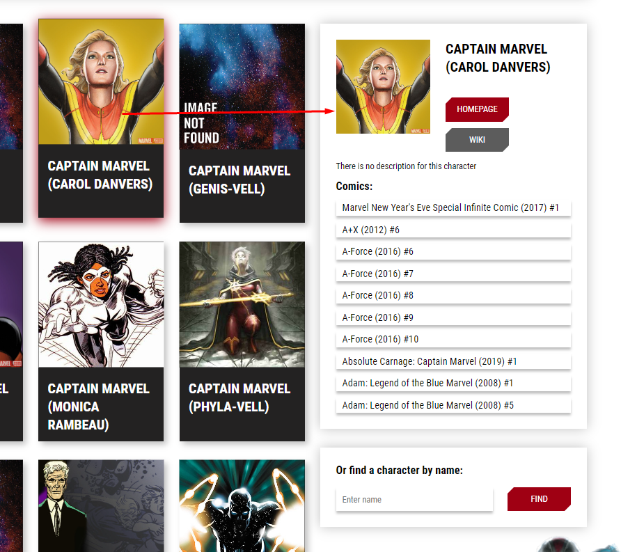

Список комиксов так же переводим в стейт-машину

`component > comicsList > ComicsList.js`
```JS
// !!
export const setContent = (process, Component, newItemLoading) => {
	switch (process) {
		case 'waiting':
			return <Spinner />;
		case 'loading':
			return newItemLoading ? <Component /> : <Spinner />;
		case 'confirmed':
			return <Component />;
		case 'error':
			return <ErrorMessage />;
		default:
			throw new Error('Unexpected process state in this case');
	}
};

const ComicsList = () => {
	const [comicsList, setComicsList] = useState([]);
	const [newItemLoading, setnewItemLoading] = useState(false);
	const [offset, setOffset] = useState(0);
	const [comicsEnded, setComicsEnded] = useState(false);

	const { getAllComics, process, setProcess } = useMarvelService();

	useEffect(() => {
		onRequest(offset, true);
	}, []);

	const onRequest = (offset, initial) => {
		initial ? setnewItemLoading(false) : setnewItemLoading(true);
		getAllComics(offset)
			.then(onComicsListLoaded)
			// !!!
			.then(() => setProcess('confirmed'));
	};

	/// CODE ...

	return (
		<div className='comics__list'>
			{setContent(process, () => renderItems(comicsList), newItemLoading)}
			<button
				disabled={newItemLoading}
				style={{ display: comicsEnded ? 'none' : 'block' }}
				className='button button__main button__long'
				onClick={() => onRequest(offset)}
			>
				<div className='inner'>load more</div>
			</button>
		</div>
	);
};
```

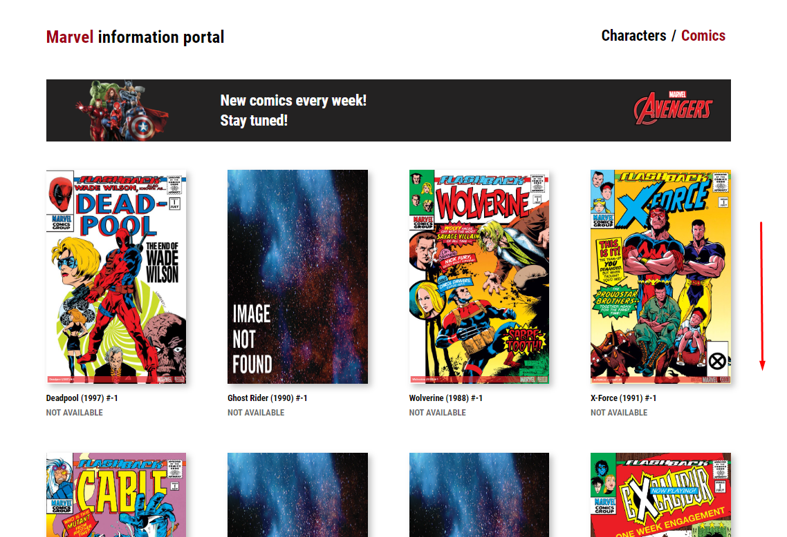

Далее модифицируем компонент рандомного персонажа

`component > randomChar > RandomChar.js`
```JS
const RandomChar = () => {
	const [char, setChar] = useState(null);
	const { getCharacter, clearError, process, setProcess } = useMarvelService();

	useEffect(() => {
		updateChar();
		const timerId = setInterval(updateChar, 60000);

		return () => {
			clearInterval(timerId);
		};
	}, []);

	const onCharLoaded = (char) => {
		setChar(char);
	};

	const updateChar = () => {
		clearError();
		const id = Math.floor(Math.random() * (1011400 - 1011000)) + 1011000;
		getCharacter(id)
			.then(onCharLoaded)
			// !!!
			.then(() => setProcess('confirmed'));
	};

	return (
		<div className='randomchar'>
			{setContent(process, View, char)}
			<div className='randomchar__static'>
				<p className='randomchar__title'>
					Random character for today!
					<br />
					Do you want to get to know him better?
				</p>
				<p className='randomchar__title'>Or choose another one</p>
				<button onClick={updateChar} className='button button__main'>
					<div className='inner'>try it</div>
				</button>
				
			</div>
		</div>
	);
};

const View = ({ data }) => {
	const { name, description, thumbnail, homepage, wiki } = data;
	
	/// CODE ...
};

export default RandomChar;
```

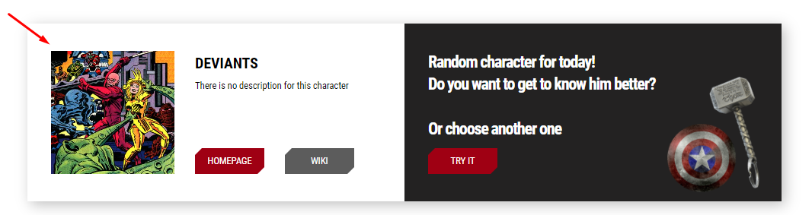

И так же можно установить машину состояний для отдельных страниц комиксов и персонажей

`components > pages > SinglePage.js`
```JS
const SinglePage = ({ Component, dataType }) => {
	const { id } = useParams();
	const [data, setData] = useState(null);
	const { getComic, getCharacter, clearError, process, setProcess } = useMarvelService();

	useEffect(() => {
		updateData();
	}, [id]);

	const updateData = () => {
		clearError();

		switch (dataType) {
			case 'comic':
				getComic(id)
					.then(onDataLoaded)
					// !!
					.then(() => setProcess('confirmed'));
				break;
			case 'character':
				getCharacter(id)
					.then(onDataLoaded)
					// !!
					.then(() => setProcess('confirmed'));
		}
	};

	// устанавливаем в состояние
	const onDataLoaded = (data) => {
		setData(data);
	};

	return (
		<>
			<AppBanner />
			{setContent(process, Component, data)}
		</>
	);
};
```

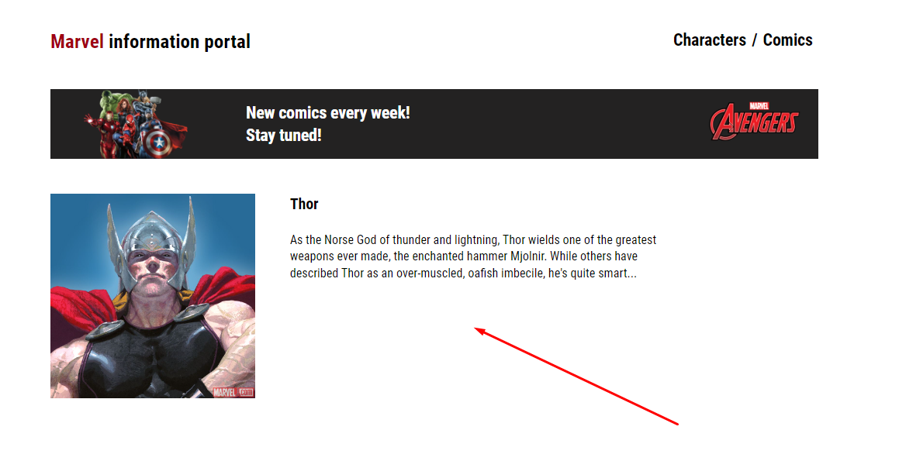

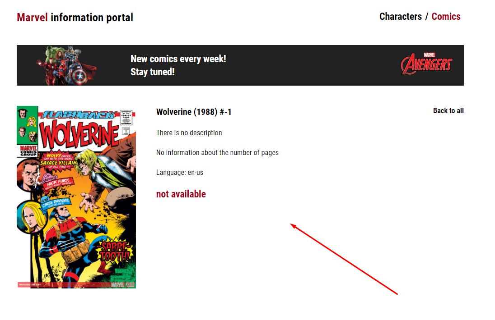

Ну и так же стоит переписать на стейт-машину компонент поиска персонажа

`components > charSearchForm > CharSearchForm.js`
```JS
// !!
export const setContent = (process, Component, updateChar) => {
	switch (process) {
		case 'waiting':
			return <Spinner />;
		case 'loading':
			return <Spinner />;
		case 'confirmed':
			return <Component updateChar={updateChar} />;
		case 'error':
			return (
				<div className='char__search-critical-error'>
					<ErrorMessage />
				</div>
			);
		default:
			throw new Error('Unexpected process state in this case');
	}
};

const CharSearchForm = () => {
	const [char, setChar] = useState(null);
	const { getCharacterByName, clearError, process, setProcess } = useMarvelService();

	// !!
	useEffect(() => setProcess('confirmed'), []);

	const onCharLoaded = (char) => {
		setChar(char);
	};

	const updateChar = (name) => {
		clearError();

		getCharacterByName(name)
			.then(onCharLoaded)
			// !!
			.then(() => setProcess('confirmed'));
	};

	const results = !char ? null : char.length > 0 ? (
		<div className='char__search-wrapper'>
			<div className='char__search-success'>There is! Visit {char[0].name} page?</div>
			<Link to={`/characters/${char[0].id}``} className='button button__secondary'>
				<div className='inner'>To page</div>
			</Link>
		</div>
	) : (
		<div className='char__search-error'>
			The character was not found. Check the name and try again
		</div>
	);

	return (
		<div className='char__search-form'>
			{/* !! */}
			{setContent(process, View, updateChar)}
			{results}
		</div>
	);
};

// !!
const View = ({ updateChar }) => {
	return (
		<Formik
			initialValues={{
				charName: '',
			}}
			validationSchema={Yup.object({
				charName: Yup.string().required('This field is required'),
			})}
			onSubmit={({ charName }) => {
				updateChar(charName);
			}}
		>
			<Form>
				<label className='char__search-label' htmlFor='charName'>
					Or find a character by name:
				</label>
				<div className='char__search-wrapper'>
					<Field id='charName' name='charName' type='text' placeholder='Enter name' />
					<button type='submit' className='button button__main'>
						<div className='inner'>find</div>
					</button>
				</div>
				<FormikErrorMessage
					component='div'
					className='char__search-error'
					name='charName'
				/>
			</Form>
		</Formik>
	);
};

export default CharSearchForm;
```

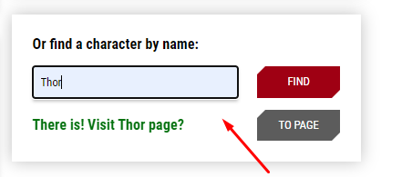


## 027 Разбираем ошибки сторонних библиотек и проблему с фокусом


Представленную ошибку выводит модуль `react-helmet`. Такие ошибки может решить только сам разработчик и реакцию сообщества на данные баги можно найти в обсуждениях на гитхабе, если загуглить ошибку

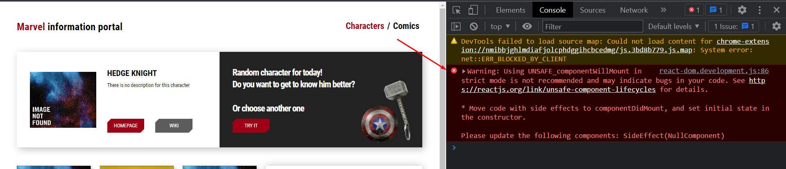

Далее в проекте появился баг, который возникает из-за подхода с конечными автоматами - у нас выделяется карточка только при втором нажатии

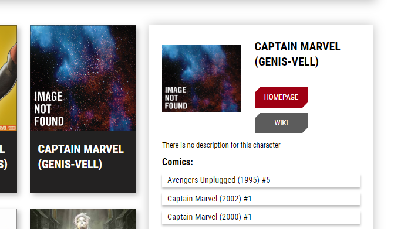

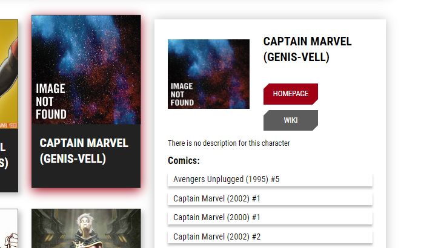

Чтобы найти проблему, можно поставить логгер на предполагаемом месте. После клика на персонажа у нас почему-то перерендеривается вся структура, что и не даёт анимации выделения сработать

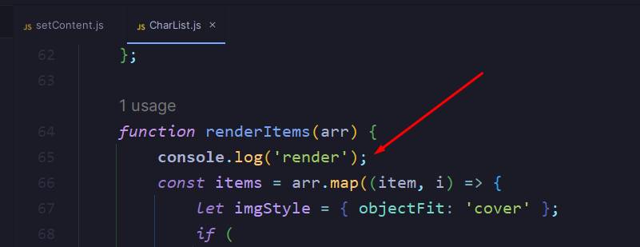

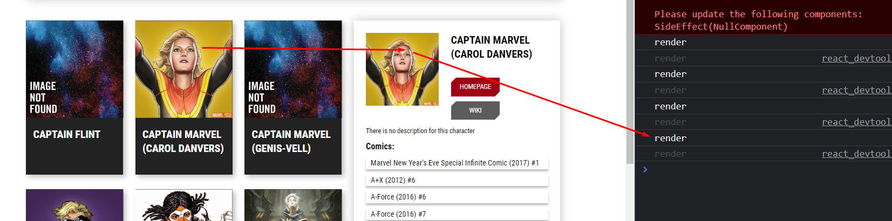

Если выйти в компонент родителя, то можно и там оставить логгер, который нам скажет, что при выделении персонажа перерендеривается вся страница

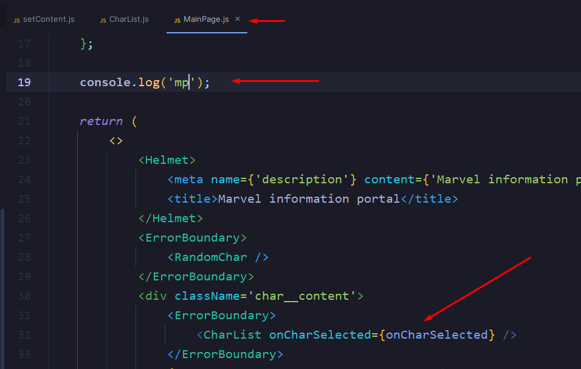

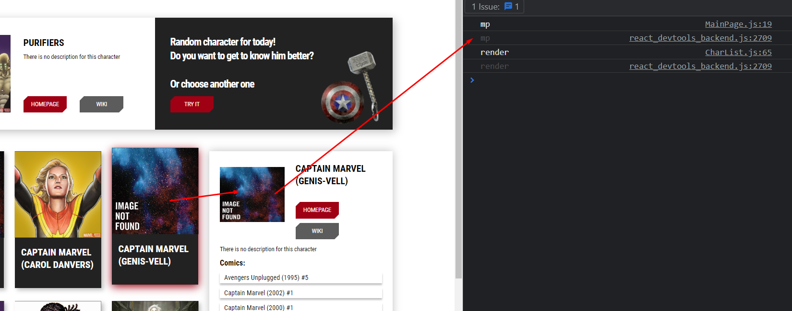

Поэтому одним из вариантов является запоминание результата рендера, если не были изменены никакие другие стейты процесса. В данном случае нам может помочь хук `useMemo()`

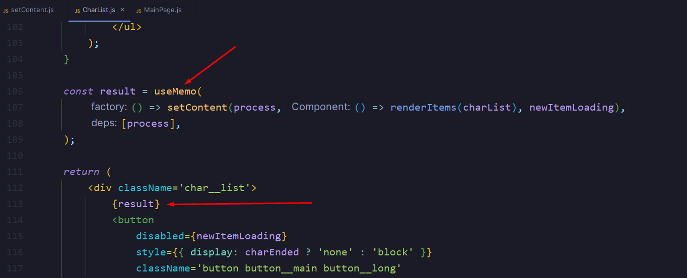

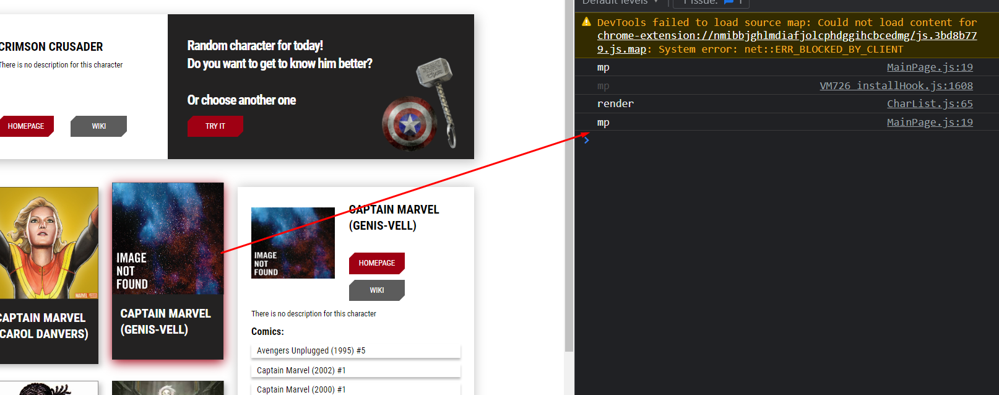
