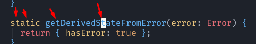

### Режимы

>[!danger] NVim не воспринимает русскую раскладку во время работы с коммандами! Нужно перключаться на английскую.

Сама работа в симе поделена на несколько режимов, которые определяют доступный пул действий, которые мы можем выполнять в редакторе.

В Vim существует 5 режимов:
- *normal* - просмотр кода. Это основной режим для навигации, который является стандартным и используется для перемещения по файлу.
- *insert* - вставка. Позволяет вводить текст.
	- `i` - войдёт в режим вставки перед текущей позицией курсора.
	- `I` - войдёт в режим вставки в начале строки.
	- `a` - войдёт в режим вставки после текущей позиции курсора.
	- `A` - войдёт в режим вставки в конце строки.
	- `o` - создаст новую строку ниже текущей и войдите в режим вставки.
	- `O` - создаст новую строку выше текущей и войдёт в режим вставки.
	- `r` - заменит текущий символ (без перехода в режим вставки).
	- `R` - войдёт в режим замены, где можно будет заменять символы непосредственно.
- *visual* - выделение кода
	- `v` - войдёт в режим визуального выделения для выделения текста.
	- `V` - войдёт в режим визуального выделения для выделения строк.
	- `Ctrl + v` - войдёт в режим блочного выделения для выделения прямоугольных областей текста.
- *replace* - ввод с перезаписью существующего текста.
- *command* - позволяет работать с коммандами vim
	- `:` - вызывает режим команд

### Базовые перемещения

`ctrl + o` - отменит любое движение и действие, которое было выполнено.

#### Базовые движения

Для базовых перемещений по коду:
- `j/k` - вверх-вниз
- `h/l` - влево-вправо

#### Горизонтальные перемещения:

- `0` - перемещает в начало строки
- `$` - перемещает в конец строки
- `w/b` - переход вперёд/назад по словам с учётом пробелов
- `W/B` - переход по словам без учёта пробелов (помогает, если перемещаемся по большому количеству спецсимволов `<title>Слова внутри тега</title>`)
- `e` - переходит в конец текщего слова
- `E` - игнорирует символы, кроме пробела, перемещаясь к концу слова.

#### Вертикальные перемещения:

- `число + G` - перемещение на определённую строку (перейдёт на выбранную по числу строку)
- `число + jk` - перемещение вверх/вниз на определённое число строк
- `gg` - перемещение в начало файла
- `G` - перемещение в конец файла

### Как практиковаться

Даже если пока не получается сидеть в виме, можно установить плагин для работы с Vim Motions в любом редакторе

### Комбинации движений

Комбинации - это последовательность действий. которые мы можем выполнить за счёт объединения сочетаний в виме

Operator - это действие, которое нужно выполнить над текстом
Count - это количество Motion (так же есть альтернатива в виде указания места)
Motion - это действие передвижения, в рамках которой будет выполнен оператор

`d3w` удалит 3 слова (aka *delete 3 words*)

`d3j` удалит уже 3 строки вниз

`di(` - удалит текст внутри скобок

Все те движения, что мы совершаем в виме - мы можем откатить. Если нам нужно будет откатиться на прошлое движение, то мы можем воспользоваться `ctrl + o`. Может это быть полезно, например, если мы зашли внутрь типа и нам нужно быстро вернуться обратно либо в случае, когда мы перешли не в ту часть файла. 

### Продвинутое перемещние

`$` - переход в начало строки
`0` - переход в начало строки
`gg` - переход в начало файла
`G` - переход в конец файла

`:set nu` вызовет номера строк

`:set relativenumber` вызовет относительные номера строк, которые позволят нам не считать количество строк, на которое мы можем переместиться, например, той же командой `5j`

`f` ищет определённую букву в строке вперёд, а `shift+f` ищёт назад

`f` + `o` - найдёт первую найденную букву `o` в строке
`2fo` - перейдёт сразу ко второй названной `o` в строке

Если нужно продолжать передвигаться дальше по найденной букве, то мы нажимаем `;`

### Перемещение по блокам

`{` / `}` - позволяют перемещаться между разрывами строк

`%` - позволяет нам передвигаться между открывающей и закрывающей скобками (любыми)

`[` / `]` + определённый тип скобки - позволит переместиться к ближайшей скобке

`[}` переместит изнутри блока к ближайшей фигурной скобке. А уже комбинация `]}` сделает то же самое, но к закрывающей скобке. Так же это работает и с любыми другими скобками.

`ctrl + d` / `ctrl + u` - перемещение на страницу вниз/вверх

`_` - позволит нам перейти к первому символу строки. В отличе от `0`, который переносит нас в целом в начало строки (даже включая табы).

`-` / `+` уже будут переводить к началу/концу следующей строки

### Файлы и buffers

Как уже и упоминалось ранее, vim работает с буфферами - он загружает файл в ОЗУ и редактирует его в нём.

Открыть файл мы можем через команду `:edit <file>`

Открыть директорию с файлами мы можем через `:edit .`. Тут у нас появится напрямую файловый менеджер из вима. Все команды указаны сверху и, например, `R` позволит переименовать файл.

Команда `:buffers` позволит выписать список буфферов. В первом столбце идёт идентификатор буффера. Для перехода в определённый буффер, мы можем воспользоваться `:buffer <id_буфера>` для перехода в нужный 

`:bnext` / `:bprevious` позволят переместиться к следующему/предыдущему буферу

`:buffer {` позволяет перейти в доку и узнать, что делает определённое сочетание на случай того, если мы забыли, что делает определённая команда 

