# Storytelling (Юра Марченко)

#storytelling #copywriting

## Урок 1. Введение

- Человек умеет придумывать что-то абстрактное и верить в это. Человек может придумать и солгать, но животное придумать и поверить в нереалистичную придумку – не может
  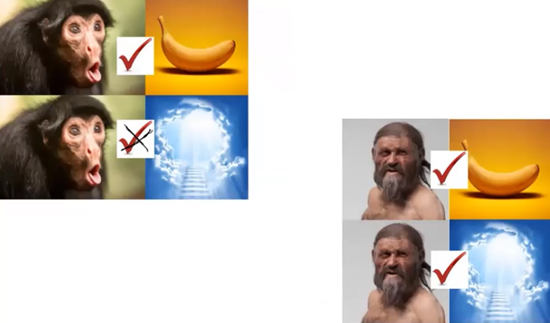
- Все истории, придуманные человеком работают всегда и везде
- Человечество придумало историю об экономической системе и о том, что бумажки что-то значат в нашем мире. Этой системой пользуются все. И все мы понимаем, что она абстрактна
- Журналистика – одна из самых древних профессий. Ей занимались ещё самые древние люди, которые рассказывали у костра истории и события минувших дней, повествуя о людях и их делах
- Один из первых фоторепортажей
  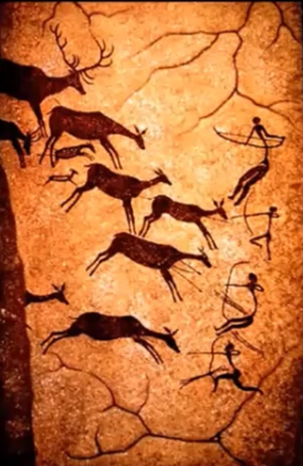
- Так же по примеру обществ, в которые не пробрались технологии, можно заметить, что группы, в которых были хорошие расказчики, жили лучше и более дружно. Хорошие сторителлеры могут облагораживать общество вокруг себя
  

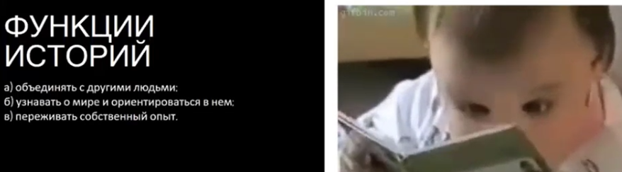

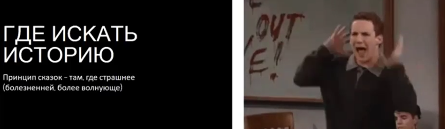

- В нашем мире существует только 36 универсальных сюжетов, которые можно использовать всегда (кстати, неплохо бы было найти их в интернете). Под них попадает любая история нашей планеты
  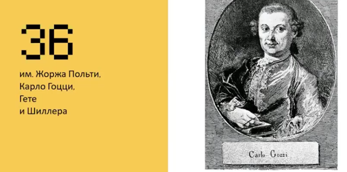
- Так же существует теория Борхеса о вариантах универсального сюжета:

1. Противостояние и защита своих интересов
2. Поиск себя и поиск своего дома в этом мире
3. Жертва во имя Бога и великой цели (цели героя)
4. Похоже на возвращение, но нет цели

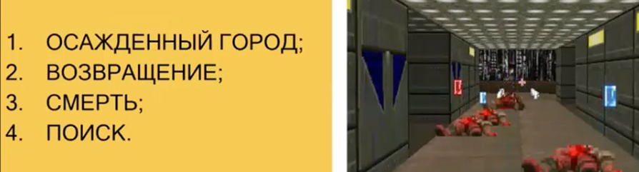

- Ещё одна система
  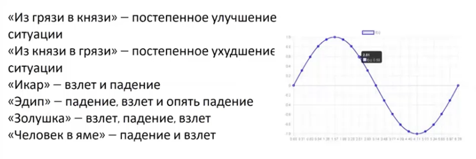

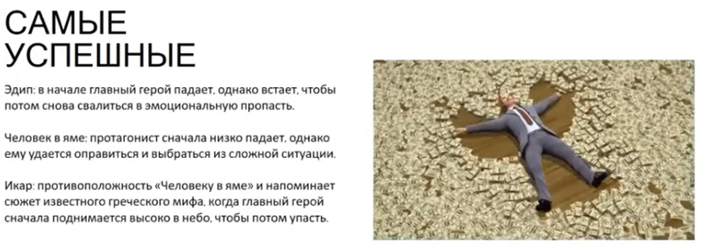

- Все эти сюжеты, изображённые выше, человечество создавало тысячелетиями и систематизация их просто обобщает
- Обычно определения про журналистику выглядят примерно как на фото, но это определение в корне неверно.
  Журналистика – это распространение историй
  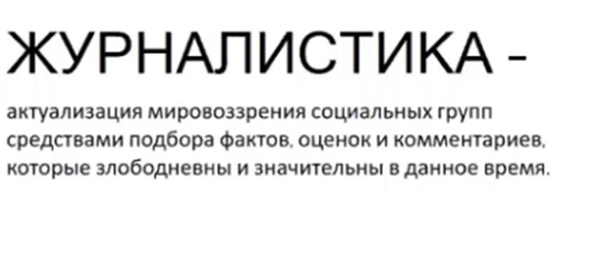

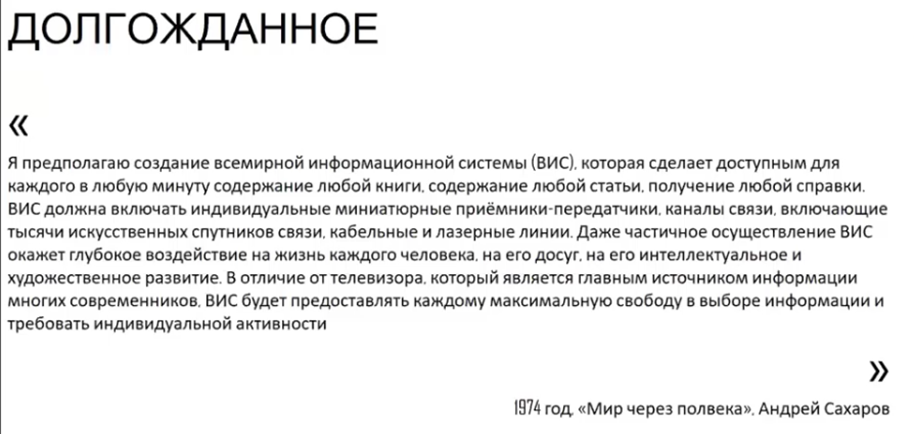

- Каждый день создаётся огромное множество информации, которая забивает голову обычному человеку. И сей час, чтобы выделиться приходится потратить крайне много сил и энергии
  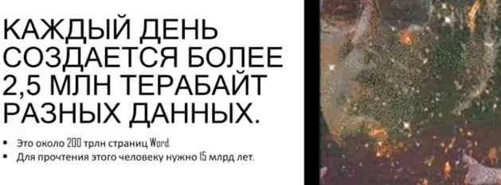

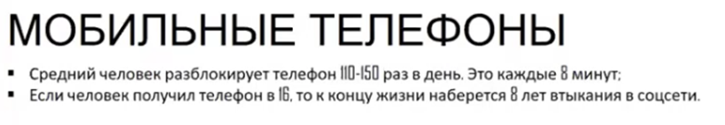

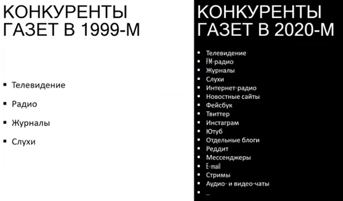

- Сторителлинг – умение рассказать историю в наиболее подходящем формате
- Вот тут представлен пример инфотеймента: история Украины в фэйсбуке
  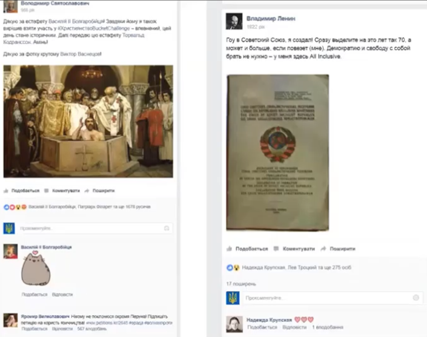
- Сейчас не получится самому первому написать что-то оригинальное, потому что историю могут у вас перенять или адаптировать и она уже не станет эксклюзивной. К тому же, станет тяжело влиться в информационный поток
  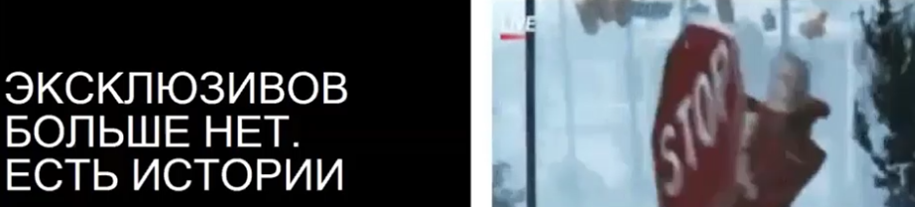
- Что ценится в истории, которую мы пишем:
  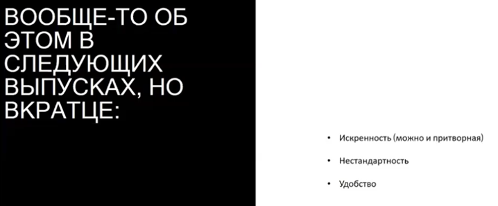
- Есть так же интересная история про хлам, который купили за 128 долларов, а продали на ебэе благодаря написанной истории за 3612 долларов. Вещи никак не изменились, им просто добавили историю
  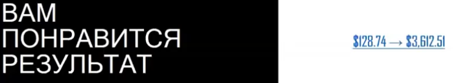

**Полезные ссылки:**

- Тысячеликий герой и мономиф
  Краткое содержание книги Джозефа Кэмпбела "Герой с тысячью лиц" и методичка, написанная на ее основе. Исследование о том, как многие рассказанные истории объединяются в общие сюжеты.
  https://www.mirf.ru/book/tysyachelikij-geroj-campbell

- Альтамира (фильм)
  Первый мультимедийный сторителлинг. Фильм об археологе открывшим пещеру Альтамира
  https://ru.wikipedia.org/wiki/%D0%90%D0%BB%D1%8C%D1%82%D0%B0%D0%BC%D0%B8%D1%80%D0%B0_(%D1%84%D0%B8%D0%BB%D1%8C%D0%BC)

- "Герой с тысячью лиц"
  Методичка, написанная на ее основе. Исследование о том, как многие рассказанные истории объединяются в общие сюжеты
  https://ru.wikipedia.org/w/index.php?title=%D0%93%D0%B5%D1%80%D0%BE%D0%B9_%D1%81_%D1%82%D1%8B%D1%81%D1%8F%D1%87%D1%8C%D1%8E_%D0%BB%D0%B8%D1%86%D0%B0%D0%BC%D0%B8

- Вечный сюжет
  4 литературных цикла по Борхесу
  https://concepture.club/post/rubrika_2021/the-four-cycles-by-borges

- Типы сюжетов по Блейку Снайдеру
  Кучка героев, могучий и кровожадный монстр, замкнутое пространство и много других интересных сюжетов :)
  http://litmasters.ru/sila-sujeta/tipy-syuzhetov-po-blejku-snajderu.html

- 36 драматических ситуаций
  Создатель 36-ти сюжетов – французский писатель Жорж Польти
  https://litmasters.ru/sila-sujeta/36-dramaticheskix-situacij-chast-1.html

- Cкрытые механизмы сторителлинга
  https://mmr.ua/show/skrytye-mehanizmy-storitellinga/43295

- Самый яркий пример сторителлинга в диджитал
  https://www.nytimes.com/projects/2012/snow-fall/index.html#/?part=tunnel-creek

## Урок 2. Как можно писать тексты

- Одна из важных вещей для понимания текста, который мы пишем, является композиция текста. Это структура, которая позволяет рассказать историю самым эффективным способом.
  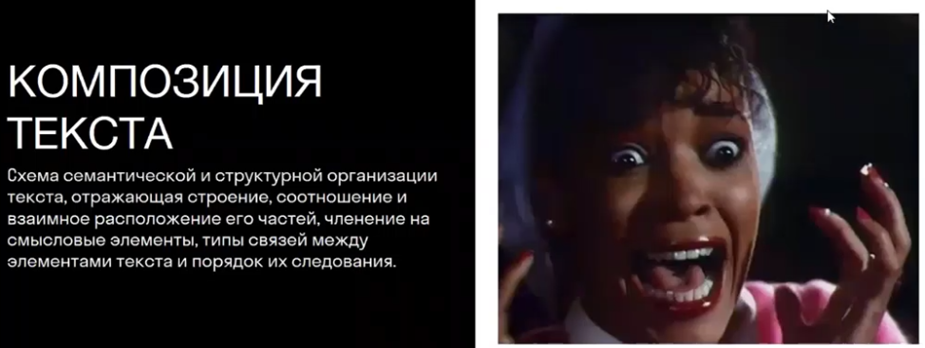

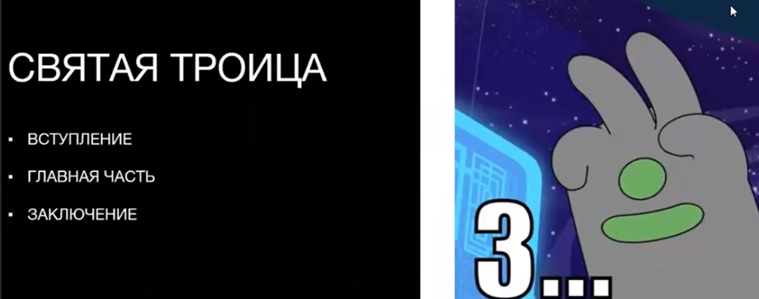

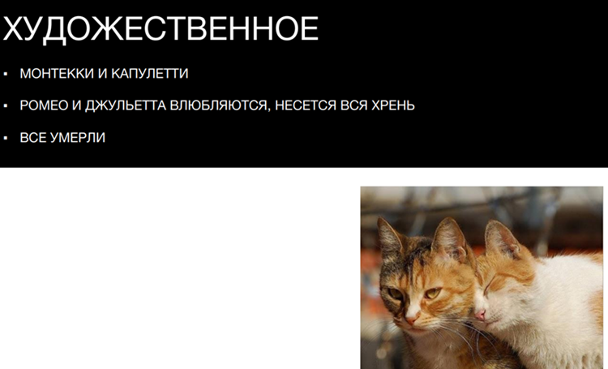

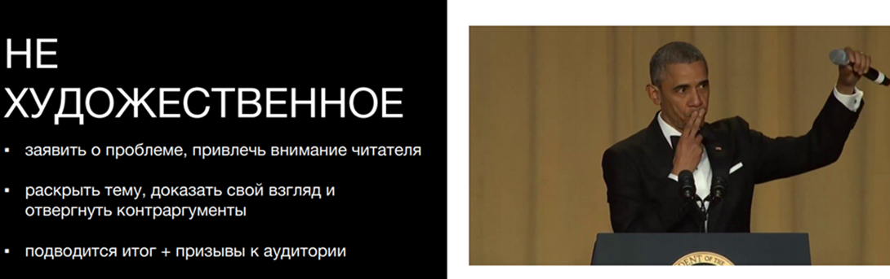

- Идея того, что мы пользуемся каждый день пластиком и даже не задумываемся о том, что производим крайне много пластика, и что мы не утилизируем его в подобающей мере. Поэтому появляются проблемы с природой. Нужно активизировать политиков утилизировать пластик
  Вот наши три акта
  В примере используется сравнение со слонами, так как мы выработали 8 миллиардов тонн пластика, а один слон весит не более 8-ми тонн
  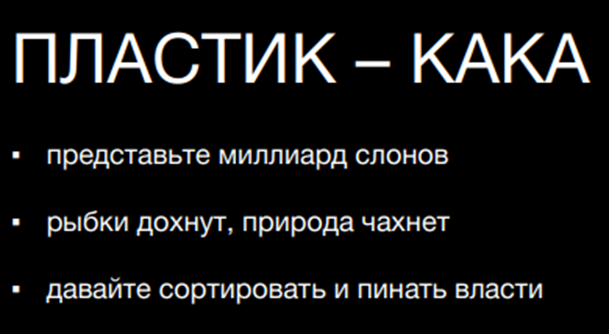

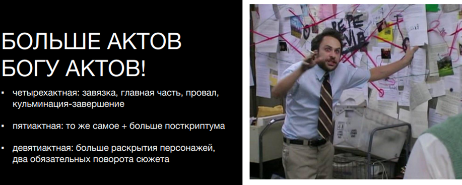

- Структуры текста
  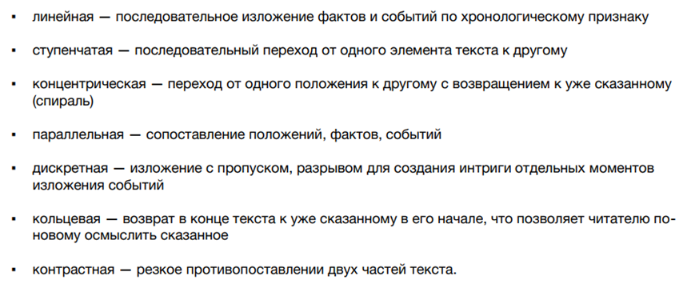
- Это уже относится к устному сторителлингу
  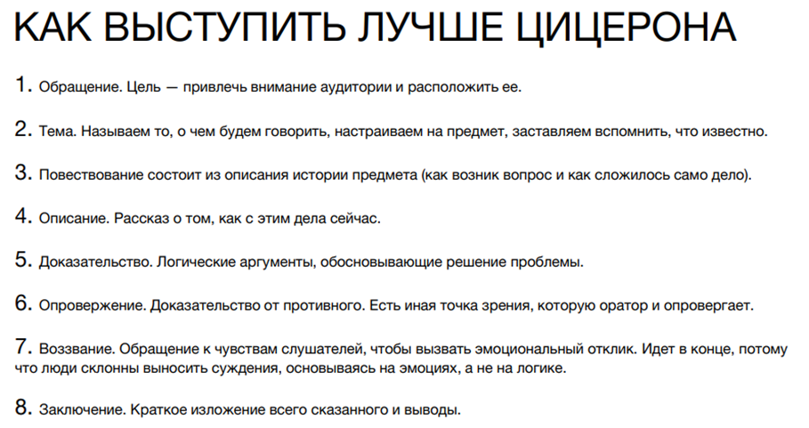

В первую очередь нужно завлечь зрителя своими зазывами, чтобы на тебя обратили внимание
Монотонный текст зачитывать не нужно – это излишне. Любой текст нужно рассказывать с эмоциями либо сопровождая его видеоматериалом
Нужно чем-то заинтересовать читателя в самом начале, чтобы от факта с начала уже пошло распутываться повествование (Гражданин Кейн)
Нужно бросать аудиторию из негатива в позитив и обратно, чтобы сохранять эмоциональные качели

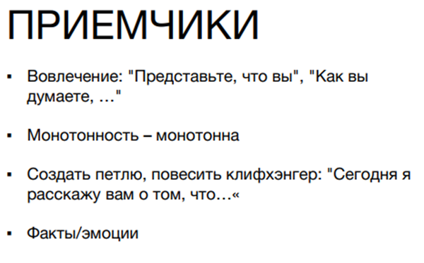

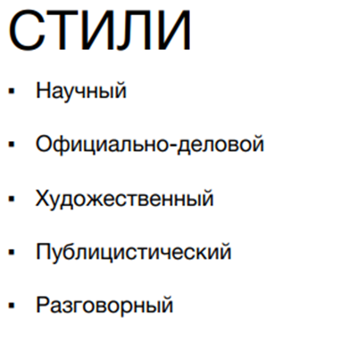
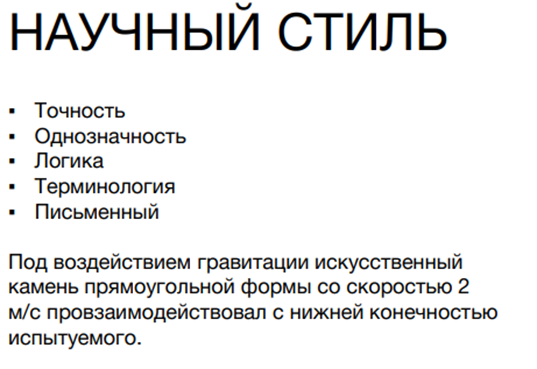
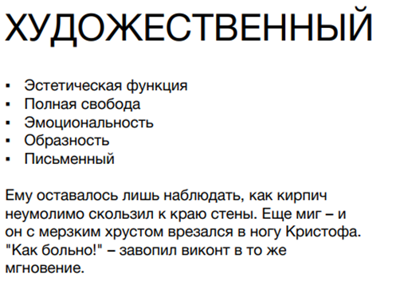
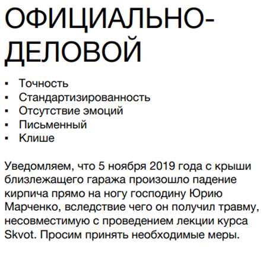
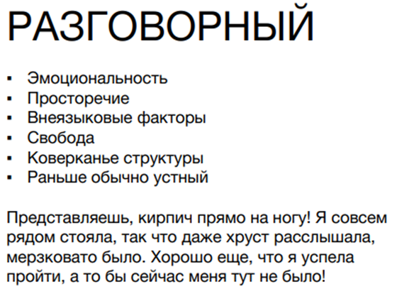
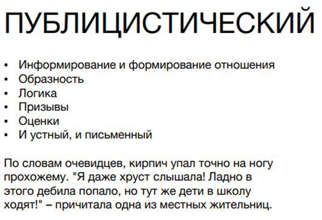

- Язык современного сторителлинга – нормальный. Он должен быть живым и просто понятным
  Денис Драгунский показал, как не нужно писать тексты через обычный и простой пример [прочитал картинку].

1. Не нужно писать вычурно-красивый текст, чтобы угодить кому-то стихотворному.
2. Не нужно писать «Смешные» тексты, чтобы не выглядеть натужным
3. Все умные вещи можно сказать простыми и понятными словами
4. Грубые вещи вызывают негатив
5. Слышится явная искуственность текста

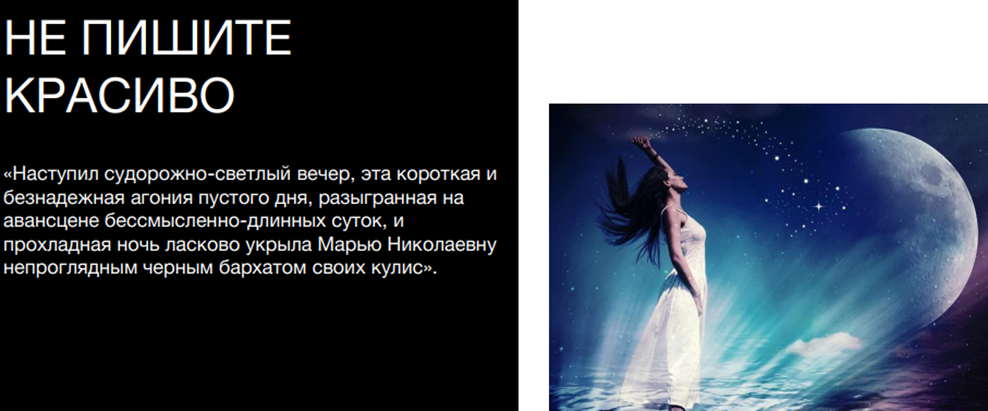
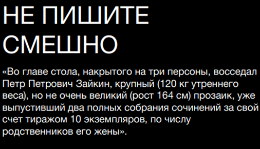
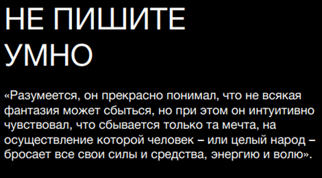
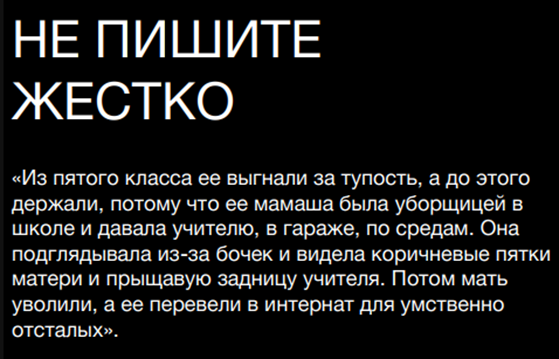
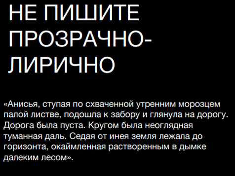

- И как же тогда повествовать историю? Можно воспользоваться примерно такой техникой: представим, что мы рассказываем нашу историю кому-то постороннему, например, другу в баре. Если появляется сильное желание рассказать эту историю, то она будет интересной!
  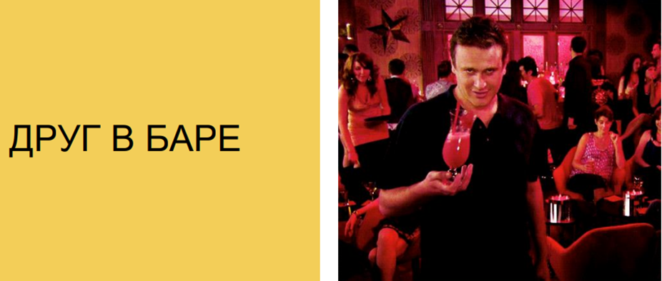

Вот пример первого текста: тут присутствует огромный и томный язык и второе предложение распростерается на огромное количество предложений
Второй текст уже написан в научном стиле и тоже не блещет красотой, так как написан в научном и достаточно сложном стиле
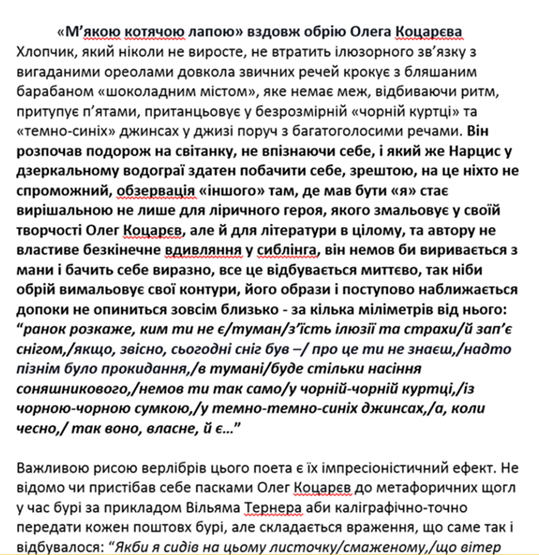
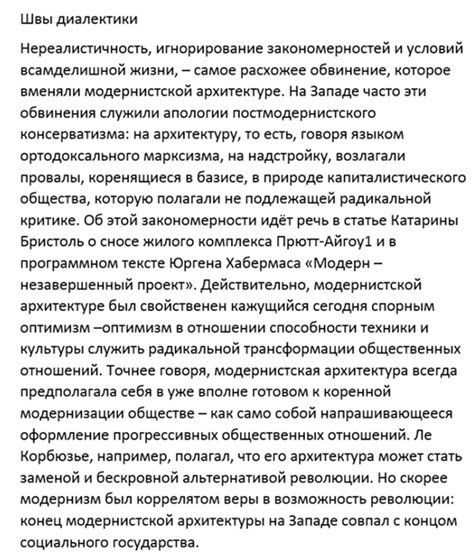

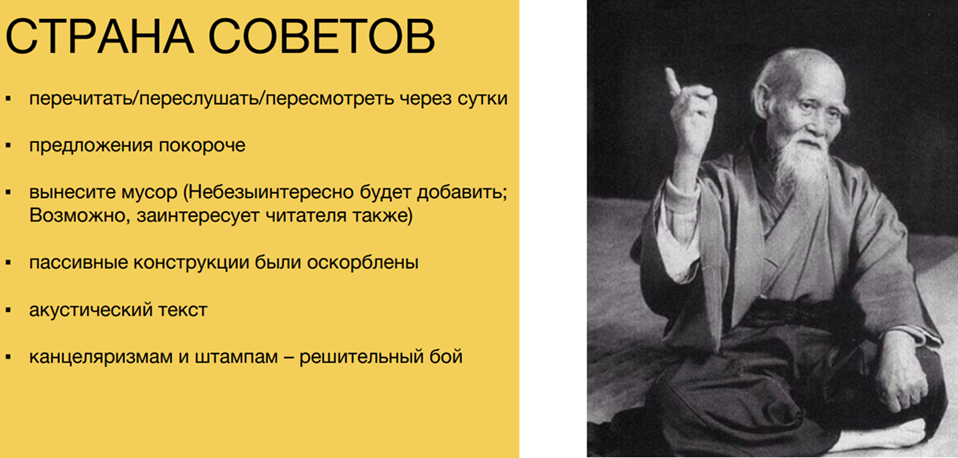

Если задать эти 6 вопросов, то можно будет увидеть всеобъёмлющую картину ситуации и понять кто, что, где и когда сделал

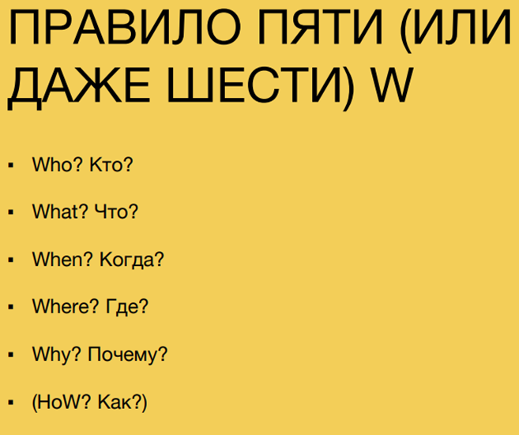

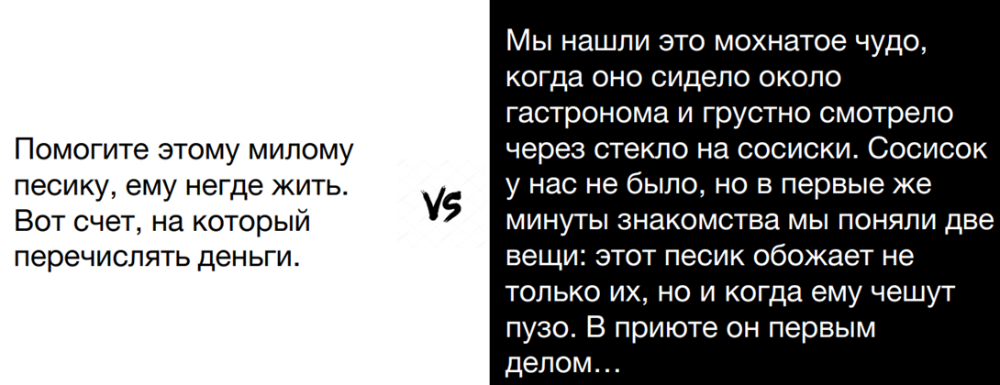

На то, чтобы привлечь внимание зрителя – у нас 3,6 секунды. Поэтому с первой фразы нужно привлечь очень сильное внимание

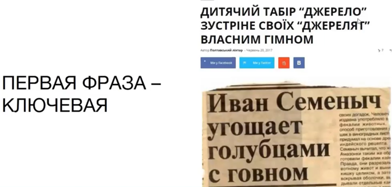
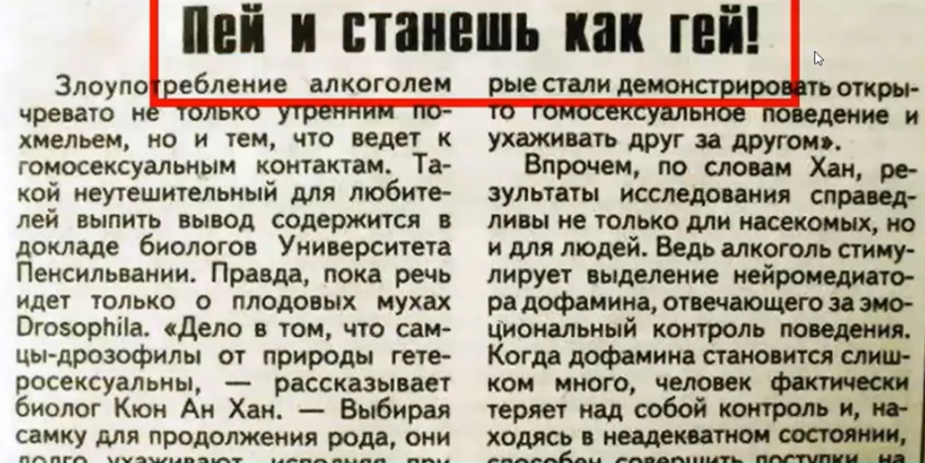
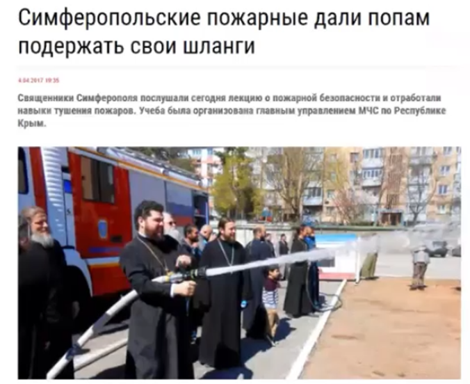

Чтобы придумать креативный заголовок, можно поиграться со словами. В помощь может прийти WikiСловарь. И так же не забываем про Рифму

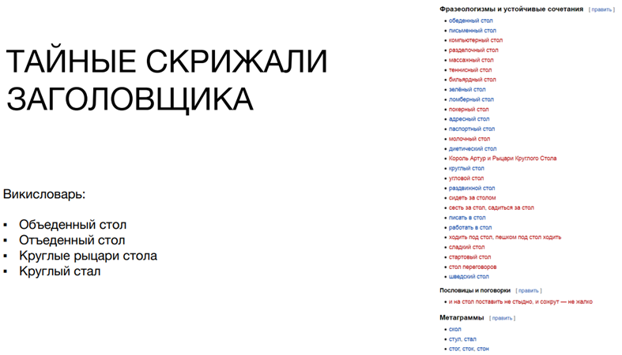

Так же можно отметить, что можно нарушать правила языка, если того требует ситуация

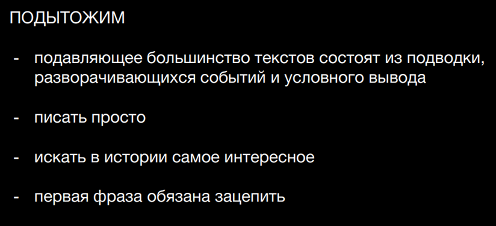

**Домашнее задание:**
У вас есть домашки по сторителлингу, у нас — курсы и сайт со страницей 404. Сегодня мы это объединим.

Первая домашка — рассказать историю. Вы же помните, что сторителлинг — это способ поделиться опытом с другими? Напишите историю о том, зачем вы купили курс 3-м людям: бабушке, другу и врагу :)

Вторая домашка — всё ещё рассказать историю, только ещё и сделать это (cм. ниже) лучше, чем сейчас.

- Taxi
  Суровые истории о буднях таксистов. Пример, когда не только интересно читать, но и смотреть
  http://taxi.batenka.ru/

- Coronavirus: Everything you need to know in a visual explainer
  Как правильно подать факты: лендинг с информацией о коронавирусе здорового человека
  https://multimedia.scmp.com/infographics/news/china/article/3047038/wuhan-virus/index.html
- Нора Галь Слово живое и мертвое
  Книга о том, как избавляться от канцеляризмов и штампов
  https://dramafond.ru/wp-content/uploads/2014/12/Nora_Gal_Slovo_zhivoe_i_mertvoe.pdf

## Урок 3. Как понять, что перед тобой фейк

- Фейк ньюс – это намеренно искажение информации с целью получить какую-либо выгоду
  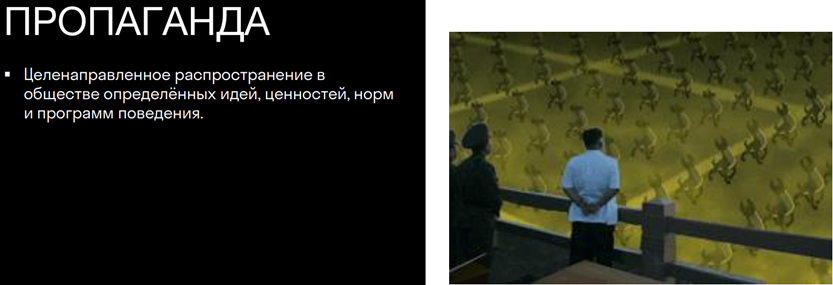
- Во время вьетнамо-американской войны было потрачено американцами 725 миллиардов долларов и было подсчитано, что на убийство одного вьетнамца уходило около 400000 долларов, а на переубеждение сдаться – 125 долларов
  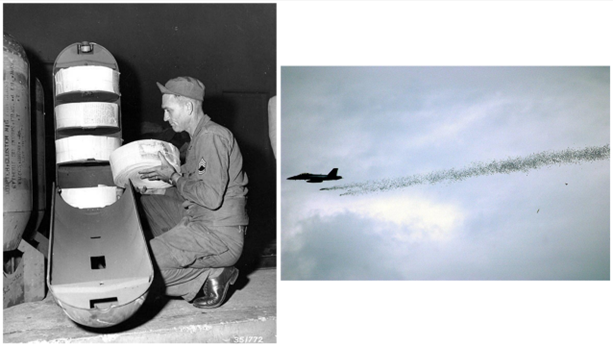
- Тезис: «Сдаться и жить» - очень прост. На каждое простое высказывание должна приходиться простая мысль, которую легко будет донести общественности
  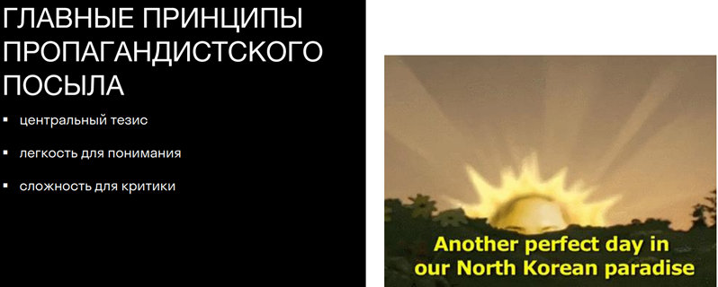
- «Фургон с оркестром / неизбежная победа» - победитель уже понятен и стоит примкнуть к нему
  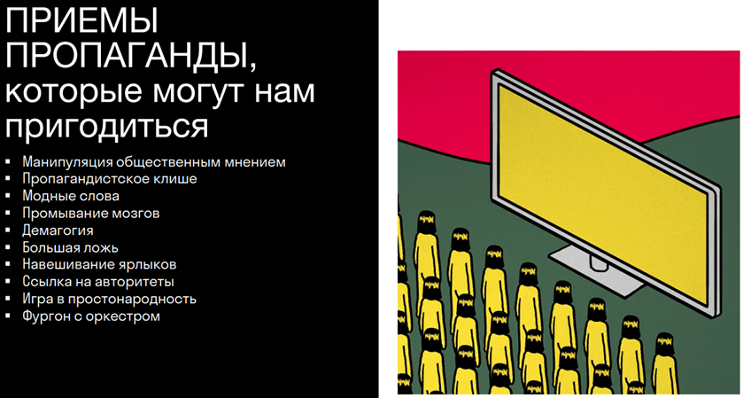
- Так же очень важной частью является создание основной фразы. Её часть используют в рекламе. Повторив её от 7 до 13 раз, у человека она откладывается в памяти
  
- Из признаков:
  • говорят, что мнение против высказывает меньшинство
  • ссылаются на анонимные источники
  • большая эмоциональность и призывы совершать какие-то необдуманные действия (баррикады чего-либо, ненависть к кому-либо)
  • вырывание из контекста любой информации (В Америке продолжительность жизни – 78 лет, в России – 72 года, но не упоминать, что по миру 66 лет)
  • фрейминг – показывать ситуацию только с нужной стороны
  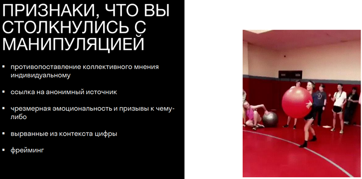

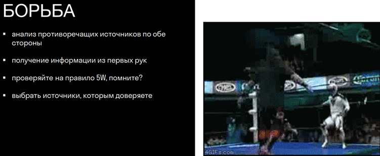

- Правила для радио и подкастов:
  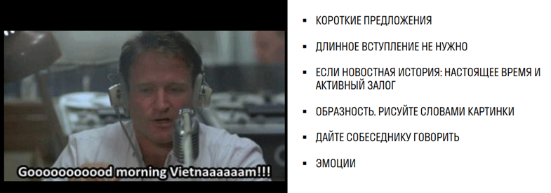

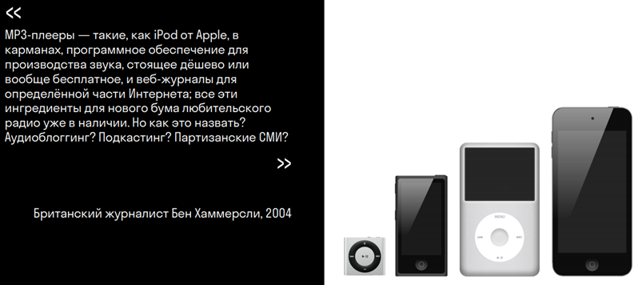

- Как начать самому делать такие подкасты?
  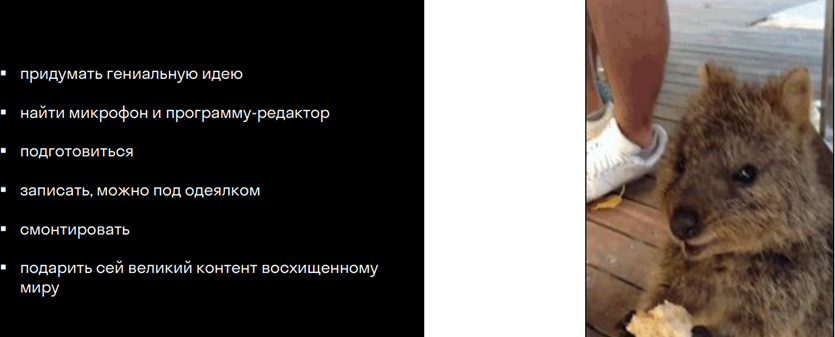

- Как понять, что перед нами фейк?
  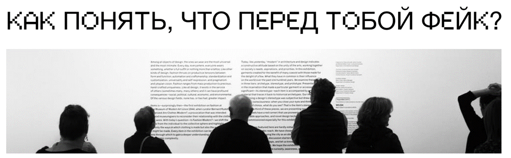

1. Читайте текст под заголовком
   Очень часто читатели воспринимают только заголовки, искренне
   веря, что они соответствуют самой статье.
   Но не будем столь наивны, так как не все журналисты работают
   качественно, а иногда — слишком даже хорошо: в этом случае
   нам предлагают мастерски замаскированный под правду фейк
   или пропаганду.
2. Проверяйте источник публикации
   Важно не только то, что публикуется, но и где. Это может сказать
   больше, нежели сама статья.
   И конечно, просмотрев публикации на подобной платформе, легко
   понять не является ли она пародией на серьезный новостной
   ресурс.
3. Проверьте дату и время публикации
   Простой способ манипуляции читателями — это выхватить что-то
   забытое из другого контекста и подать, как актуальное.
   Поверьте, не у всех хорошая память и не все даже смотрят на
   даты. А вы смотрите? Если нет, то советуем обращать на это
   внимание.
4. Кто автор?
   Этот пункт тесно переплетен с пунктом 2. Но также мы не должны
   игнорировать личность автора, а именно:
   ― как часто он публикуется
   ― где еще можно найти его статьи
   ― кого критикует, а кого хвалит
   ― какие источники использует
   ― ну и страничка в соцсетях, чтобы понять
   мировоззрение человека
5. Проверьте ссылки на первоисточник
   Для начала, они должны быть. Если в тексте нет ссылок на точные
   источники, то этот текст скорее манипулятивного характера,
   нежели информационного.
   Если же факты подкреплены, нужно проверить их реальность,
   актуальность и адекватность.
6. Изучите цитаты и фотографии
   Многие видели, как мастерски некоторые журналисты играются с
   фотошопом. Если видите что-то подозрительное и
   неправдоподобное, лучше найдите первоисточник, полную
   версию и т.д. — убедитесь лично.
   Просмотр фотографий в поиске через Google или инструментарии
   типа TinEye поможет изучить «историю» изображения.
   В этот пункт мы бы добавили еще анализ документов — факт
   наличия фото документа не подтверждает его соответствие
   ситуации.
7. Остерегайтесь эмоциональных заявлений
   Допустимость эмоций в тексте зависит от того, кто и где пишет.
   Если говорить о новостях, то журналист или блогер при
   передачи информации должен быть максимально объективным
   и профессиональным.
   Эмоции — это скорее способ манипуляции и привлечения
   внимания. Кстати, очень часто подобные заявления не
   подкреплены фактами. Капс и крики — не показатели честности.
8. Ищите на нескольких сайтах
   Проверьте то, как новость подается на других платформах.
   Для подобной аналитики лучше найти для себя ресурс, которому
   можно доверять: незаангажированный, нейтральный, с
   профессионально написанными статьями.
   Сравнивайте, дополняйте историю — возможно, тогда
   получится сложить всю картину.
9. Сомневайтесь, прежде чем делиться ссылкой
   Среди всего вышеперечисленного важно не забывать, что
   распространение фейков тоже плохо.
   За последние годы доверие к пользователям соцсетей выросло
   почти в 2 раза. После эфира или публикации чем больше репостов
   и позитивных комментариев, тем шире охват, больше доверие и
   влияние.
   Цель фейка — дестабилизация общества. Если вы не можете
   опровергнуть, то, как минимум, не распространяйте.

- The Alibi
  https://serialpodcast.org/season-one

- The Pravda Times
  http://thepravdatimes.com/

- Дебаты Ричарда Докинза и Роуэна Вильямса
  https://www.youtube.com/watch?time_continue=1&v=7b5wxnpqycY&feature=emb_logo

- Подкаст. Юрий Марченко
  Подкаст для Радио Аристократы
  https://aristocrats.fm/podcasts/koshmarchenko-sezon-1-epizod-1-oleg-fagot/?autoplay=1

- How I detect fake news
  Название говорит само за себя :)
  https://timoreilly.medium.com/how-i-detect-fake-news-ebe455d9d4a7,

- Самые громкие фейки с начала XX века
  Фейк ньюз, которые вошли в историю.
  https://www.dw.com/ru/%D1%81%D0%B0%D0%BC%D1%8B%D0%B5-%D0%B3%D1%80%D0%BE%D0%BC%D0%BA%D0%B8%D0%B5-%D1%84%D0%B5%D0%B9%D0%BA%D0%B8-%D1%81-%D0%BD%D0%B0%D1%87%D0%B0%D0%BB%D0%B0-xx-%D0%B2%D0%B5%D0%BA%D0%B0/a-37103577

- Fake news. Youtube
  Статья о том, как журналисты BBC обнаружили на Youtube более 80 неправдивых роликов о способах лечения различных заболеваний.
  https://www.bbc.com/russian/features-49692273

- Фильм «Части тела». Стоит посмотреть для кругозора.
  https://www.youtube.com/watch?v=w6a5bOPZQbU

## Урок 4. Как НЕ пишут журналисты (не пройдено)

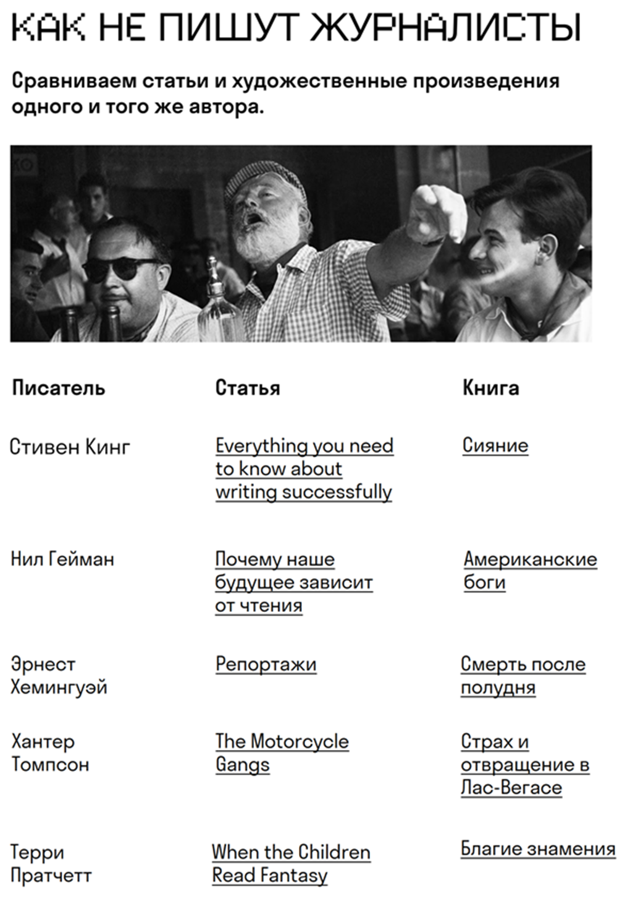

Шаги написания репортажа:

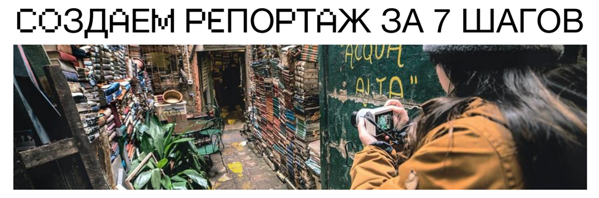
Схема запуска, написание сценария, обработка информации

1. Пробираемся туда, где читатель не был
   Выбираем актуальные темы, определяемся с аудиторией.
2. Выявляем конфликт
   Чтобы репортаж «затягивал», он должен быть написан по
   законам драматургии:

- появляется проблема (завязка);
- персонажи пытаются ее решить (развитие действия);
- приближаются к решению (кульминация);
- либо добиваются успеха, либо нет (развязка).

3. Наблюдаем целенаправленно
   Внимательное наблюдение за происходящим обязательно,
   чтобы передать «эффект присутствия».
   Также стоит придерживаться плана: список мест для
   посещения, список людей, с которыми нужно встретиться,
   список событий. В процессе определяемся с концовкой и
   началом репортажа.
4. Находим характерные детали
   Слова, действия или предметы, показывающие характерную
   черту персонажа.
5. Определяемся с «красной нитью»
   Это линия повествования, ограниченная началом и концовкой.
   Совсем не обязательно (и не нужно) включать в репортаж все
   увиденные журналистом сцены. Этот прием получил название
   «пунктир».
6. Пишем кинематографично
   Писать так, чтобы текст рождал в голове читателя кадр за
   кадром. Для этого есть 2 простых правила:

- передаем слова и действия, а не их осмысление;
- работа с планами;

7. Дополняем репортажным бэкграундом
   Репортажный бэкграунд — это информация, поясняющая
   сцены, голос за кадром.

- Домашнее задание:
  Подготовьтесь к интервью с публичной личностью
  – определитесь, кто это? Актер? Общественный деятель? Возможно, Дональд Трамп?
  – какой тип интервью вы будете проводить (информационное, портрет, беседа, опрос, флеш?)
  – как будет проходить интервью (письменно/устно)?
  – составьте список вопросов

Напишите короткий репортаж на любое событие
(если вы не знаете, что выбрать, напишите, про первые 5 минут после завтрака)

-
-
-
-
- «В околофутболе пенальти — удар ногой по голове лежачего»: хулиган о расизме, наркоторговле и драках
  https://platfor.ma/topics/people/v-okolofutbole-penalty-udar-nogoj-po-golove-lezhachego-hulygan-o-rasyzme-narkotorgovle-y-drakah/

- Не лидер мнений: lifestyle начальника караула пожарной части
  https://bit.ua/2017/08/fireman/

- 50 Cent On French Montana Beef, Roddy Ricch & Eminem Declining $8 Million
  https://www.youtube.com/watch?v=ZX2yBFvJDgs

- Борис Бурда: «Образование — это мост к знаниям. И по нему плохо ходить строем»
  https://platfor.ma/topics/people/boris-burda-obrazovanie-eto-most-k-znaniyam-i-po-nemu-ploho-hodit-stroem/

- В ауте: как главред поговорил с одноклассником-аутистом о травле, школе и гениальности
  https://platfor.ma/topics/people/v-aute-kak-glavred-pogovoryl-s-odnoklassnykom-autystom-o-travle-shkole-y-genyalnosty/

- «Самая непонятная и непонятая молодежь за всю историю»: как 21 век покорежил нашу жизнь
  https://platfor.ma/topic/samoe-neponyatnoe-y-neponyatoe-pokolenye-za-vsyu-ystoryyu-kak-21-vek-pokorezhyl-nashu-zhyzn/

- Кошмарченко - сезон 1 эпизод 7 - Валерий Харчишин (25.04.2015)
  https://www.mixcloud.com/aristocratsfm/%D0%BA%D0%BE%D1%88%D0%BC%D0%B0%D1%80%D1%87%D0%B5%D0%BD%D0%BA%D0%BE-%D1%81%D0%B5%D0%B7%D0%BE%D0%BD-1-%D1%8D%D0%BF%D0%B8%D0%B7%D0%BE%D0%B4-7-%D0%B2%D0%B0%D0%BB%D0%B5%D1%80%D0%B8%D0%B9-%D1%85%D0%B0%D1%80%D1%87%D0%B8%D1%88%D0%B8%D0%BD-25042015/

- Кузьмичи (о том, как смотрят футбол во второй лиге)
  http://zhlob.info/?p=1433

- Colta
  https://www.colta.ru/authors/229

- Интервью Стива Джобса и Билла Гейтса
  https://www.youtube.com/watch?v=436Y9hLbz-s
- Одно из самых откровенных интервью принцессы Дианы
  https://www.youtube.com/watch?v=D0Bgi8nEhuo

## Урок 5. Основные принципы написания блогов

## Урок 6. Мемотворчество

- Домашнее задание:

1. Выберите любой бренд, который вам нравится или наоборот
2. Напишите пост!

При этом постарайтесь учесть мотивацию потребителей бренда,
его социальную миссию, характер продуктов, найти или придумать личные истории.

Если настигнет синдром “белого листа”, помните, что историю о брендах можно
писать с нескольких позиций:

1. Рассказать реальную историю создания продукта или бренда
2. Проанализировать и написать об особенностях продукта, вокруг которых можно построить легенду
3. Не забывайте об инновационности продукта или бренда
4. Ну и,конечно, не забывайте о тех, кто любит этот бренд – расскажите о потребителях

- Максим Ильяхов. Стоп-слова
  http://maximilyahov.ru/blog/tags/stop-slova/

- U2 in der U2
  https://www.youtube.com/watch?v=YR2_r1ckkL8

- Apple 1984
  https://www.youtube.com/watch?v=2zfqw8nhUwA

- BVG “Is mir egal”
  https://www.youtube.com/watch?v=xvcpy4WjZMs

- Дедушка и стул (Ikea)
  https://www.youtube.com/watch?v=EmqIsMlKS-Q

## Урок 7. Механика шутки (недопройдено)

- Прежде чем понять как и для чего шутить, нужно понять для чего мы это делаем. Вот несколько причин:
  Выделиться среди других людей
  Поделиться острой инфомрацией, чтобы максимально её распространить
  Проявить себя публике
  Показать приверженность к какой-то социальной группе (для самых умных, для самых опасных, для тех, кто может рискнуть собой). Пример: Если победила какая-то футбольная команда (своя), то можно написать, что не Динамо победило, а победили «Мы»

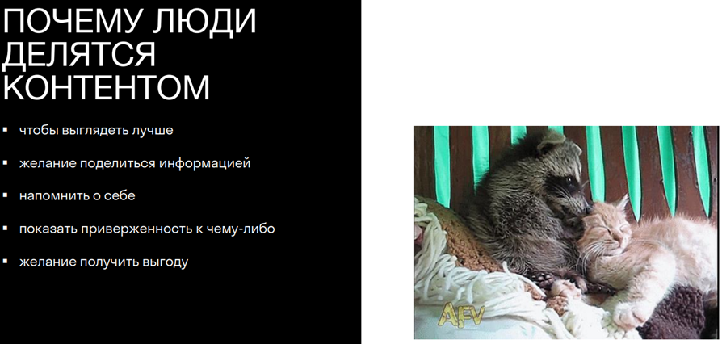
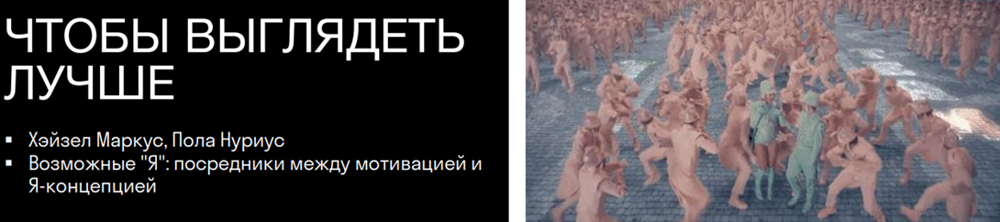

- Чтобы создать действительно полезный продукт, нужно создать продукт, который решит проблему человека, чтобы утолить её.
  Женщина сидит в одноклассниках не потому, что ей 45-55 лет (целевая аудитория), а потому что ей скучно ехать в метро 30 минут каждый день и ей будет проще листать мемы. Тут решается конкретная проблема человека. Проблемоориентированность
  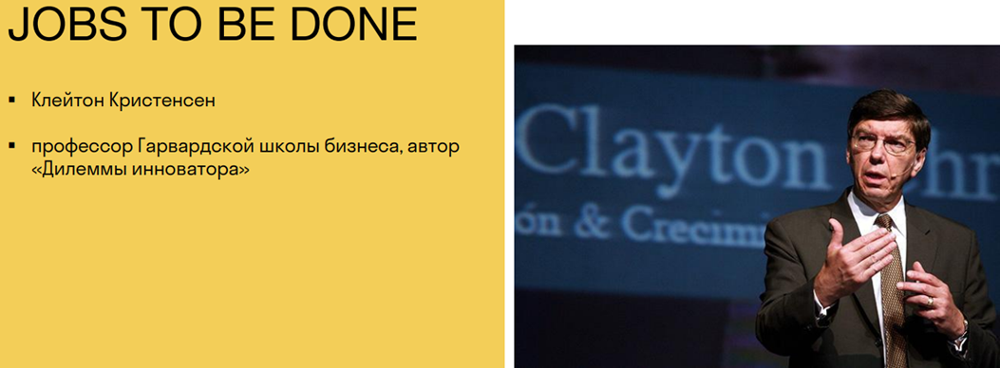
- Работа текста
  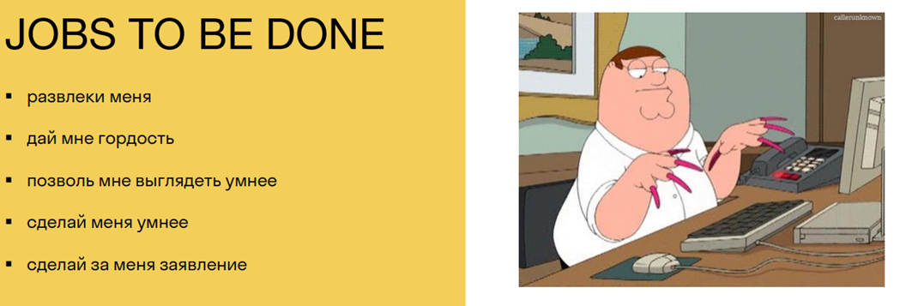
- Негативные моменты отражаются в голове человека куда сильнее, чем грустные. Если скажут, что зарплата уменьшается на 10%, то грусти будет куда больше, чем радости от её поднятия на 10%
  Так же сравнение с другими людьми – является сильным мотиватором. Алекс Ласки стремился создать в людях осознание гражданина Земли, чтобы они меньше тратили электроэнергии. Никакие силы не давали результата ровно до тех пор, пока он не написал, что: «Ваши соседи тратят меньше денег на электроэнергию, чем вы…»
  Больше внимания в заголовках можно уделять на том, что читатель может потерять
  
- Куда убедительней звучит просьба или предложение, когда мы его аргументируем. Не важно почему, но если добавить потому что, то человеку куда проще будет согласиться и уступить
  «Посмотри этот ролик, поставь лайк и подпишись, ПОТОМУ ЧТО это продвинет мой канал и позволит чаще делать ролики»
  

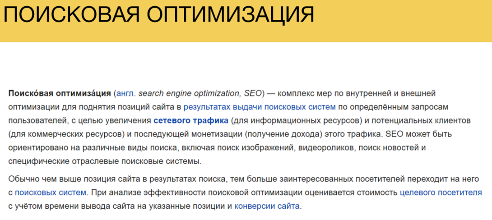

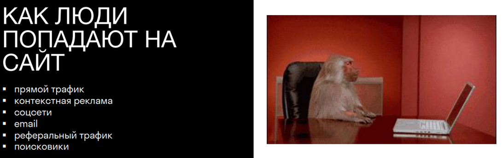

- 34:49
-
-
- 

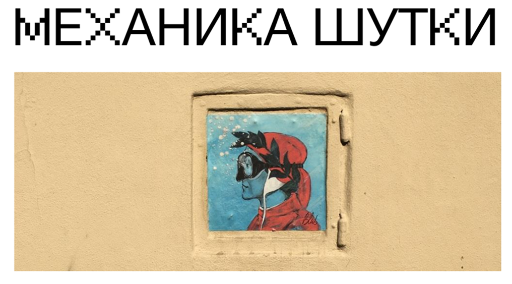

Стендап как пример сторителлинга: основные правила, приемы и
тенденции
Если изучить выступления знаменитых стендап-комиков, то можно
прийти к следующей схеме:
― одна тема, включающая несколько подтем;
― выступление сопровождается движениями, шутками, даже
небольшими отступлениями от тем;
― переход между подтемами осуществляется постепенно,
посредством шутки;
― оптимальная концентрация шуток 4–6 в минуту.
Тема должна быть жизненной и актуальной. Все хорошие стендаперы
говорят о себе, о своих близких — о простых и понятных вещах,
которые могут случится с каждым. Вы можете написать уморительную
шутку, но если она «не от мира сего», никто не начнет смеяться — в
чем тогда смысл?
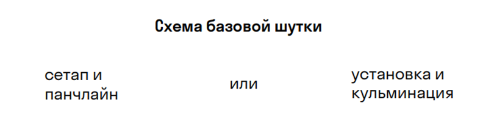
Setup (установка) — это логическое утверждение факта. Внимание, не
забывайте, что установка логична, так как это, как правило
достоверные сведения или реальное событие. Большинство комиков
убивают свои шутки тем, что пытаются сделать установку смешной.
Это ошибка.
Между этими точками обычно происходит развитие ситуации:
слушателю объясняют нюансы ситуации. Чтобы потом было понятно с
чего смеятся.
Punchline (кульминация) — это продолжение утверждения, которое
внезапно ведет зрителей в неожиданном направлении. Такое
неожиданное завершение шутки и должно вызывать смех.
Убедись, что аудитория
А) получает всю информацию;
Б) понимает все детали истории.
Примеры выступлений известных стендаперов (+18)
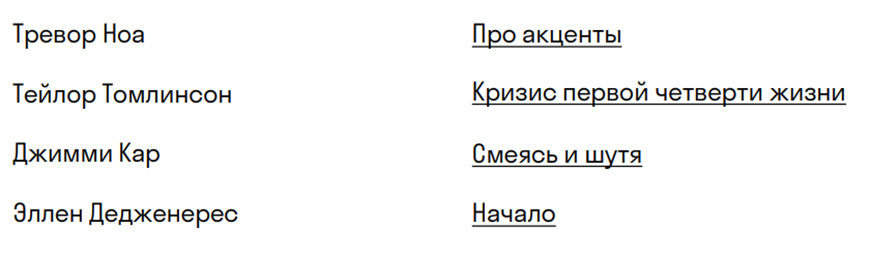

- Прикольная социальная реклама Dove (стоит посмотреть)
  https://www.youtube.com/watch?v=LMgAr2KgvL0
- Клейтон Кристенсен «Дилемма инноватора: Как из-за новых технологий погибают сильные компании»
  https://4brain.ru/blog/%D0%BA%D1%80%D0%B8%D1%81%D1%82%D0%B5%D0%BD%D1%81%D0%B5%D0%BD-%D0%B4%D0%B8%D0%BB%D0%B5%D0%BC%D0%BC%D0%B0-%D0%B8%D0%BD%D0%BD%D0%BE%D0%B2%D0%B0%D1%82%D0%BE%D1%80%D0%B0/

- Стратегия Mobile First
  https://lpgenerator.ru/blog/2016/03/16/strategiya-mobile-first-chto-eto-i-pochemu-na-nego-stoit-obratit-vnimanie/

## Урок 8. Выгодная дружба

Как работать с инфлюенсерами
https://l-a-b-a.com/blog/927-kak-rabotat-s-infljuenserami

## Урок 9. Инициатива в плюс в минус

**Домашнее задание**:
Придумайте и напишите проявление в медиа социальной инициативы

## Урок 10. борьба во благо
