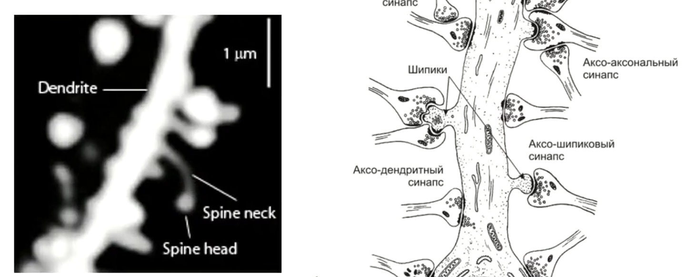
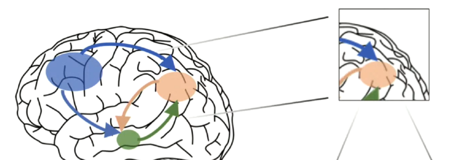
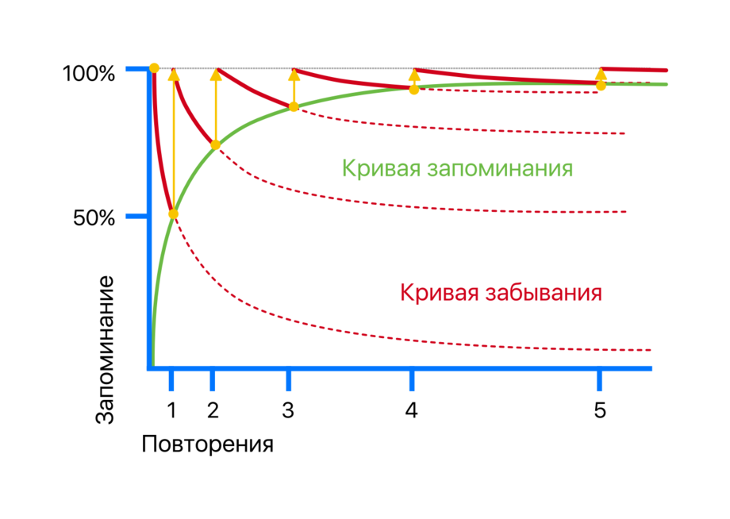
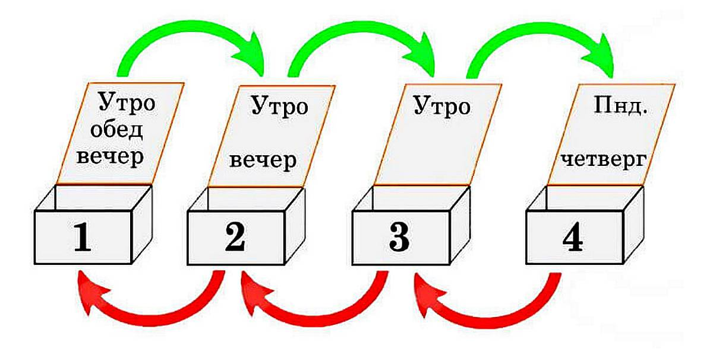
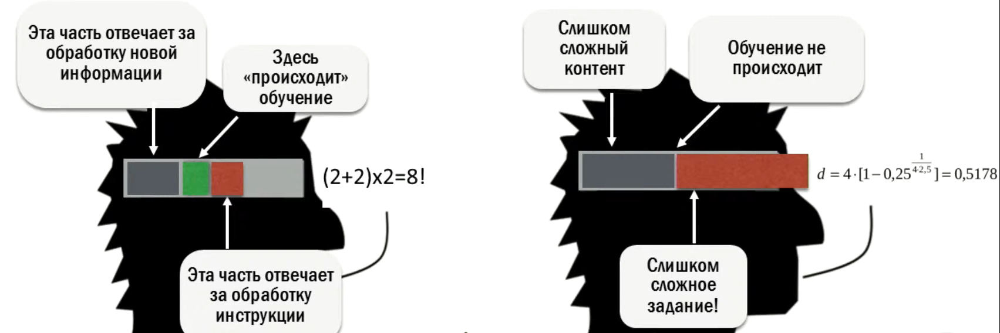

# Лекция Антона Захарова: Как учиться учиться

## Задание - Как происходит обучение?

Написать:
- 2 слова
- 2 вопроса
- 1 метафору

Мои ответы:
- Сидеть, писать
- В чём суть? Где польза?
- Без труда не выловишь и рыбку из пруда

## Что такое научение? 7 метафор:
- **Подстройка параметров ментальной модели**. Для того, чтобы ориентироваться в окружающем мире, мы строим модель этого мира. *Простейшие примеры моделей*: физическая модель окружающего пространства, ментальная модель езды на велосипеде, знания русского языка. Обучение - это подстройка параметров ментальной модели - мы подстраиваем своё восприятие мира под реалии той или иной сферы науки
- **Использование комбинаторного взрыва**. Исследование и использование знаний и комбинация их в одной сфере. Можно привести пример с изучением языка: мы учим небольшое количество слов и правила их использования, что даёт большое количество вариантов составления предложений 
- **Исследование пространства возможностей**. Учимся использовать то, что мы узнали.
- **Минимизация ошибок**.
- **Максимизация награждения**.
- **Ограничение области поиска**. 
- **Проверка априорных гипотез**. Проверка гипотез о своих знаниях (например, что объекты падают вниз).

## Физиология

Наш мозг представляет из себя сложную систему, которая состоит из 86 миллиардов нейронов, которые могут образовывать до 10000 связей. В общей сложности мы получаем 86 миллиардов в 10000 степени комбинаций. Комбинации образуются через шипики, которые образуются в течение минуты

Собственно, формирование знания - это сообщение целых групп нейронов

Для обучения наш мозг использует **нейронный рецайклинг** - переиспользует уже имеющиеся нейронные архитектуры

Так же нужно отметить, что какие-то фактологические воспоминания мозг может забыть насовсем и навсегда, если не пользоваться этими данными. Уже разучиться езде на велосипеде куда сложнее, если научился один раз и периодами практикуешь это умение. То же самое и с языками - наш мозг эволюционно учился воспринимать и учить языки, так как от этого зависело наша возможность к разведению потомства.

## Как учиться эффективно?
### **Управление эмоциями** (прокрастинация). 
Мозг направляет наши эмоции на те события в жизни, которые вызывают эмоциональный отклик в нас.

И тут нужно описать, какое значение имеет прокрастинация в наших эмоциях:
1) Прокрастинация возникает, когда перед нами встаёт выбор, что делать. Есть, например, два пути и один из них приведёт к результату, а второй, возможно, нет. И перед тем, как начать что-либо делать, мы машинально выполняем простые рутинные действия, чтобы уменьшить нашу тревогу.

<cite style="color: yellow; font-weight: bold">Перед нами стоит задача сдать сложный экзамен и вместо того, чтобы к нему подготовиться, мы выполняем простые рутинные действия: моем посуду, едим, двигаем стулья и так далее</cite>

2) Второй момент, когда возникает прокрастинация - это слишком грандиозная и комплексная задача. Чтобы решить этот вопрос, нужно поделить задачу на много мелких пунктов.

### **Мотивация** (внутренняя)

Внешняя мотивация - это мотивация человека извне либо какими-то подарками (сам себе или кто-то дарит их), либо оценками в школе, либо наказаниями за проступки. 

Внутренняя мотивация - это мотивация, которую себе поставил сам человек. 

**[Теория самодетерминации](https://ru.wikipedia.org/wiki/%D0%A2%D0%B5%D0%BE%D1%80%D0%B8%D1%8F_%D1%81%D0%B0%D0%BC%D0%BE%D0%B4%D0%B5%D1%82%D0%B5%D1%80%D0%BC%D0%B8%D0%BD%D0%B0%D1%86%D0%B8%D0%B8)** (англ. self-determination theory; SDT) — психологический подход к пониманию человеческой (*внутренней*) мотивации, личности и психологического благополучия, в частности, рассматривающий подробно проблематику внутренней и внешней мотивации. Авторами данной **теории** являются два американских психолога из Рочестерского университета — Эдвард Л. Деси и Ричард М. Райан. Определяют термин **самодетерминации** как способность индивида к осуществлению и переживанию выбора.

Таблица пунктов данной теории:
|               | Компетентность (проще заниматься и развиваться там, где мы уже чувствуем себя более-менее компетентными)                                                  | Автономия (ощущение, что это наш самостоятельный выбор и только наше решение чем-то заниматься) | Relatedness (связанность с кем-либо, чем-либо) |
| --------------------- | --------------------------------------------------------------- | --- | ---------------------------------------------- |
| Повышается через      | Правильно сбалансированную сложность; позитивную обратную связь | Возможность свободного выбора; возможность объяснить выбор/рациональность ситуации | Уважение и заботу; Открытую среду (Elusive Environpment); Безопасность  |
| Подрывается с помощью | Чрезмерная сложность; негативная обратная связь                                                             | Угроз дедлайнов; усиленного контроля; Навязанных целей       | Конкуренция (нездоровая конкуренция, при которой рождается не общность, а постоянное соперничество); Критика                                            |

- Компетентность мы реализуем, когда чувствуем, что в своей сфере мы что-то понимаем и можем этим пользоваться. Например, это чувство мы можем реализовывать (чтобы сохранить мотивацию что-то делать) через те же телеграм-каналы, где будем пытаться объяснить сложные механизмы каких-то полученных нами знаний
- Автономность проявляется через понимание, что мы понимаем, для чего мы учимся и через возможность отказаться от тех знаний, которые мы не понимаем для чего получаем. <cite style="color: yellow; font-weight: bold">Например, школьник не любит географию, но его заставляют её учить - это падение  мотивации через автономность</cite>
- Связанность срабатывает, когда мы учимся чему-то новому вместе с кем-то (периодические конференции, хакатоны, паблики с мемами про то же программирование)

### **Внимание**.

Мы учимся тому, на что обращаем *внимание*. *Внимание* мы используем для того, чтобы натренировать в себе определённые паттерны того, на что нужно обращать это самое *внимание* в разных ситуациях.

*Внимание* - это принципиально ограниченный ресурс. Его нельзя натренировать. Так же как и остальные метапредметные навыки, нам их тоже не удастстя развить без определённой натренированности в той области, где мы хотим использовать эти навыки. 
<cite style="color: yellow; font-weight: bold">Например, если показать шахматную партию гроссмейстеру и обычному человеку, то гроссмейстер запомнит её лучше, так как он знает, на что обращать внимание. Так же и биолог обозначит в лесу для себя больше деталей, так как он знает, на что обращать внимание.</cite>

### **Физическое состояние** (физическая активность и сон)

Во сне информация переводится информация из кратковременной памяти в долговременную
Пик обучаемости длится с 16 до 25 лет
Очень важна физическая активность, так как она помогает в общем и целом улучшить настроение, кровоток и построение нейронных связей
Сон 7-9 часов (с возрастом для здорового сна нужно всё меньше времени)

### **Воспроизведение знаний**.

>[!info] Самый простой способ выучить информацию - это попытаться объяснить её другому человеку (или самому себе)

>[!info] Spaced Repetition - интервальное повторение
>Нужно повторять информацию с определённым интервалом (с каждым разом всё реже и реже)

По кривой Эббингауза мы можем увидеть, с какой скоростью мы забываем информацию. Большую часть информации мы забываем в первый день её изучения и с каждым днём забываем всё меньше и меньше. Чтобы исправить эту ситуацию, мы можем просто периодами повторять её, чтобы замедлять кривую и больше запоминать информацию

Так же в решении задачи запоминания может помочь Коробка Лейтнера. Верные ответы мы перекладываем на коробку вперёд, а неверные откладываем на одну коробку назад и так постоянно повторяем

### **Постройка ментальных моделей**.

**Bearning concepts** - ключевые идеи, основные моменты ментальных идей, которые желательно как-то записать

Так же очень важно **переплетать** (interleaving) полученные знания с другими знаниями. Обычно знания не изолированы и их нужно применять вместе друг с другом. 

**Desirable difficulty - желаемая сложность**. Она не должна быть слишком высокой, но должна немного заставлять помучаться

**Теория когнитивной нагрузки**. Нагрузка должна быть подсильна мозгу человека, чтобы принять и усвоить информацию.

**Goal-directed forgetting или иллюзия знания**. Это чувство, что мы уже знаем определённую информацию и пропускаем её, когда начинаем про неё слушать, не дополняя ту информацию, которую мы уже знаем. Из этого вытекает такая особенность, что опытных специалистов трудно обучить новому, потому что в голове заело старое.

## Задание - Как происходит обучение?

- Конспект, задание, знание
- Как учиться правильно? Как учиться эффективно?
- Старую собаку не научить новым трюкам