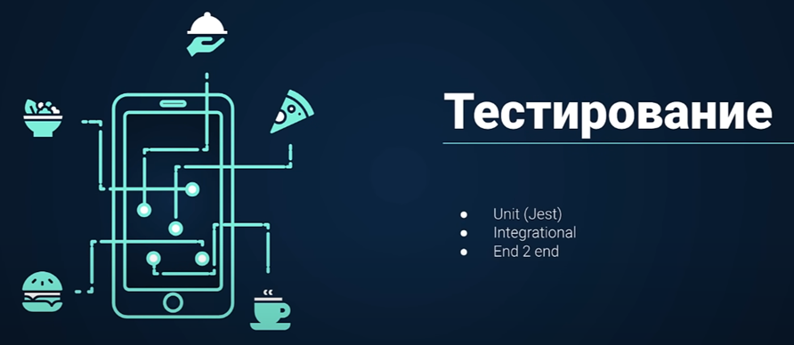

## **Тестирование**
#Testing #Unit #Integrational #End2End #Jest #ReactTestingLibrary #Screenshot 

Юнит-тестирование – тестирует отдельный функционал/класс

Интеграциональное тестирование – тестирует целый модуль приложения

End 2 end – тестирует использование приложения полностью

Материал:
[Тестирование JavaScript](../../Development/Testing/Тестирование%20JavaScript.md)