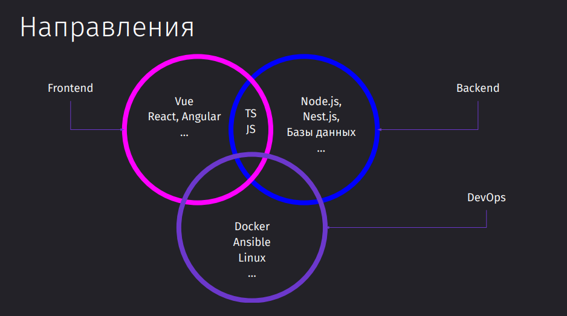

---
aliases:
    - index
    - home
    - homepage
    - dashboard
tags:
    - homepage
    - dashboard
description: Base homepage.
---

# Obsidian Base

## Приветствие

Привет, дорогой читатель (или я). Это база junior-frontend разработчика из маленького регионального банка. Её я собираю, чтобы всегда держать под руками актуальную и важную информацию из пройденных курсов.

## Оглавление

- [agile](agile/agile.md)
- [tools](tools/tools.md)
- [testing](testing/testing.md)
- [obsidian](obsidian/Obsidian.md)
- [mobile](mobile/mobile.md)
- [frontend](frontend/frontend.md)
- [edge](edge/edge.md)
- [devops](devops/devops.md)
- [desktop](desktop/desktop.md)
- [design](Design/Design.md)
- [database](database/database.md)
- [computer science](cs/computer%20science.md)
- [books](Books/Books.md)
- [backend](backend/backend.md)
- [inbox](inbox/inbox.md) - неструктурированные данные и шальные мысли =)

## Как стартовать в профессии?

Выбираем одно нправление, в котором развиваемся:

- [x] Frontend
    - разработчики, ответственные за клиентскую часть приложения. Занимаются созданием интерфейса на основе макетов от дизайнеров, используя фреймворки (React, Angular, Vue и др.). Основная задача - обеспечить удобное и приятное взаимодействие пользователя с приложением. Важны знания HTML, CSS, JavaScript и фреймворков
- [ ] Backend
    - разработчики, работающие с серверной частью приложения. Создают логику работы приложения, базы данных и API для взаимодействия с клиентской частью. Ключевые навыки включают в себя знание языков программирования (Python, Ruby, Java и т.д.), баз данных и принципов работы серверов.
- [ ] DevOps
    - специалисты, обеспечивающие развертывание приложений и их бесперебойную работу. Задачи включают конфигурацию серверов, автоматизацию процессов развертывания, мониторинг и логирование. Важные навыки - управление серверами, знание инструментов для автоматизации (Ansible, Docker и т.д.), опыт работы с системами контроля версий.
- [ ] Мобильная разработка
    - разработчики, ответственные за мобильную версию приложения.

А уже все остальные трогаем, чтобы иметь представление и смочь что-нибудь сделать

Разделение на роли даёт нам следующие преимущества:

- Эффективность и специализация: Каждая роль требует уникального набора знаний и навыков, что позволяет специалистам глубоко погружаться в свою область.
- Командная работа: Позволяет команде разработчиков работать над разными аспектами проекта одновременно, ускоряя его разработку и улучшая качество.
- Сложные проекты: Разделение позволяет создавать более крупные и функциональные приложения, где каждая часть системы оптимизирована под свои задачи.

## Прогресс изучения

- [Основы HTML + CSS](frontend/Базовая%20вёрстка/Вёрстка%20Basic.md)
    - HTML
    - CSS
        - FlexBox
        - Grid
        - container queries
        - mediaqueries
        - animations
        - position
    - Preprocessors
        - SASS
        - LESS
        - STYLYS
    - Frameworks
        - Bootstrap
        - Materialize CSS
        - [Tailwind CSS](frontend/Tailwind%20CSS.md)
        - Panda CSS
        - CSS Modules
    - Methology
        - BEM
    - Tooling
        - Pug
- Computer Science
    - [Алгоритмы и Структуры даных](cs/Алгоритмы%20и%20Структуры%20даных.md)
    - Безопасность
    - [C](cs/C.md)
    - [Python](cs/Python.md)
- [JavaScript](frontend/JavaScript/JavaScript.md)
    - Language Basics
    - Dom
    - Замыкания
    - Типы функций
        - arrow functions
        -
    - Promises / async-await
    - Event loop
    - Prototype
    - Array
    - Classes
    - Fetch
    - Proxy
    - Observables
    - Events
- [TypeScript](edge/TypeScript/TypeScript.md)
- [Инструменты](edge/edge.md)
    - Bundlers
        - Vite
        - SWC
        - Webpack
        - RSPack
        - ESBuild
        - Parcel
        - Snowpack
    - Git, Npm, Yarn
    - Github, Gitlab, Bitbucket
- [Frontend](frontend/frontend.md)
    - UI Libs
        - Material UI (React)
        - Chakra UI (React)
        - Shadcn UI (React)
        - Ant-design (React)
        - Radix UI (React)
        - React Aria (React)
        - Ark UI (React)
        - Taiga UI (Angular)
    - Подходы
        - Webhooks
    - Frameworks
        - React / NextJS / React Router Dom
        - Vue / Nuxt
            - Pinia
        - Angular
            - NgRx
            - RxJS
        - Svelte / SvelteKit
        - Astro
    - State management
        - Redux
        - [MobX](frontend/State%20Managers/MobX.md)
        - Jotai
        - Effector
        - Context
        - Zustand
    - Forms
        - React-hook-form
        - Formik
    - Validation
        - Zod
        - Yup
        - Valibot
    - API Calls
        - REST
            - RTK Query
            - axios
            - swr
            - react query
        - GQL
            - Relay
            - urql
            - Apollo
        - gRPC
            -
    - Animation
        - Framer Motion
        - React Spring
        - GSock
        - GASP
    - [SSR](frontend/SSR.md)
    - [PWA](frontend/PWA.md)
        - Canvas
        - WebGL + WebVR
        - WebAuthn
        - Service Workers
        - Web Workers
        - Fullscreen
        - Perfomance
        - Notification
        - Geolocation
        - Broadcast API
        - Media
        - Filesystem
        - Gamepad
        - Pointer Lock
        - Ambient Light Events
    - [Микрофронтенды](frontend/microfrontends.md)
- Mobile
    - [React Native](mobile/React%20Native/React%20Native.md)
- [Backend](backend/backend.md)
    - [Безбэкендный подход](backend/serverless.md)
    - [Микросервисы](backend/Microservices/Паттерны%20и%20практика%20построения%20микросервисов.md)
- [Базы данных](database/database.md)
    - SQL
        - [SQLite](database/SQLite.md)
        - [PostgreSQL](database/PostgreSQL.md)
    - NoSQL
        - [Mongo DB](database/Mongo%20DB.md)
    - Caching
        - [Redis](database/Redis.md)
        - [Valkey](database/Valkey.md)
    - ORM
        - [Prisma ORM](database/Prisma%20ORM.md)
- [Концепты](concepts/concepts.md)
    - [REST API](concepts/REST%20API.md)
    - GraphQL
    - gRPC
    - Brokers
- [Тестирование](testing/Тестирование%20JavaScript.md)
    - E2E
        - Playwright
        - Cypress
    - Integration
    - Unit
        - Vitest
        - Jest
        - React-testing-library
    - Screenshot
        - Storybook
        - Loki
- [Архитектура](architecture/architecture.md)
    - Парадигмы
        - Объектно-ориентированное программирование
        - Структурное программирование
        - Функциональное программирование
    - Паттерны
    - SOLID
    - DRY
    - KISS
