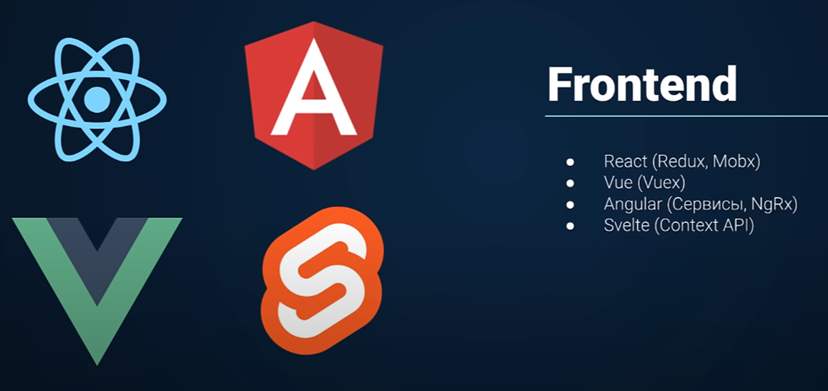
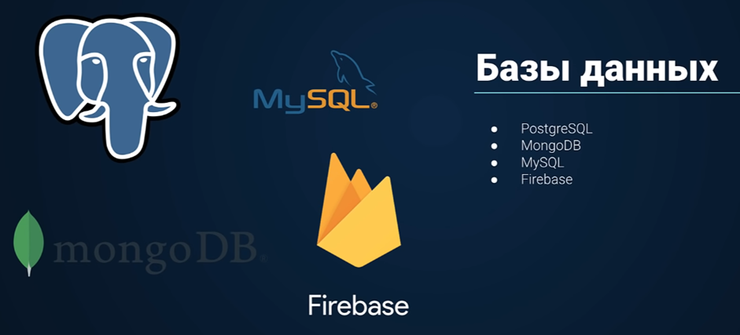
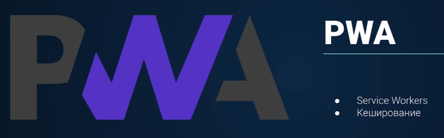

---
aliases:
  - index
  - home
  - homepage
  - dashboard
tags:
  - homepage
  - dashboard
description: Base homepage.
---

# Obsidian Base

## Приветствие

Привет, дорогой читатель (или я). Это база junior-frontend разработчика из маленького регионального банка. Её я собираю, чтобы всегда держать под руками актуальную и важную информацию из пройденных курсов. 

## Оглавление

- [agile](agile/agile.md)
- [tools](tools/tools.md)
- [testing](testing/testing.md)
- [obsidian](obsidian/obsidian.md)
- [mobile](mobile/mobile.md)
- [frontend](frontend/frontend.md)
- [edge](edge/edge.md)
- [devops](devops/devops.md)
- [desktop](desktop/desktop.md)
- [design](design/design.md)
- [database](database/database.md)
- [computer science](cs/computer%20science.md)
- [books](books/books.md)
- [backend](backend/backend.md)
- [inbox](inbox/inbox.md) - неструктурированные данные и шальные мысли =)

## Как стартовать в профессии?

Выбираем одно нправление, в котором развиваемся:
- [x] Frontend
	- разработчики, ответственные за клиентскую часть приложения. Занимаются созданием интерфейса на основе макетов от дизайнеров, используя фреймворки (React, Angular, Vue и др.). Основная задача - обеспечить удобное и приятное взаимодействие пользователя с приложением. Важны знания HTML, CSS, JavaScript и фреймворков
- [ ] Backend
	- разработчики, работающие с серверной частью приложения. Создают логику работы приложения, базы данных и API для взаимодействия с клиентской частью. Ключевые навыки включают в себя знание языков программирования (Python, Ruby, Java и т.д.), баз данных и принципов работы серверов.
- [ ] DevOps
	- специалисты, обеспечивающие развертывание приложений и их бесперебойную работу. Задачи включают конфигурацию серверов, автоматизацию процессов развертывания, мониторинг и логирование. Важные навыки - управление серверами, знание инструментов для автоматизации (Ansible, Docker и т.д.), опыт работы с системами контроля версий.
- [ ] Мобильная разработка
	- разработчики, ответственные за мобильную версию приложения.

А уже все остальные трогаем, чтобы иметь представление и смочь что-нибудь сделать

Разделение на роли даёт нам следующие преимущества:

- Эффективность и специализация: Каждая роль требует уникального набора знаний и навыков, что позволяет специалистам глубоко погружаться в свою область.
- Командная работа: Позволяет команде разработчиков работать над разными аспектами проекта одновременно, ускоряя его разработку и улучшая качество.
- Сложные проекты: Разделение позволяет создавать более крупные и функциональные приложения, где каждая часть системы оптимизирована под свои задачи.

## Прогресс изучения

Пройтись по паку занний [отсюда](https://code.s3.yandex.net/MiddleFrontend/syllabus/syllabus.pdf) и нафильтровать нужного

- Основы HTML + CSS
- Javascript / Typescript
- Инструменты
- Frontend
- SSR
- Backend
- Базы данных
- ORM
- Архитектура
	- Паттерны
	- SOLID
	- DRY
	- KISS
- Концепты
- Serverless
- Тестирование
- 
- Микросервисы
- Микрофронтенды

### Основы HTML + CSS

#HTML #CSS #Pug #SASS #SCSS #Bootstrap #Tailwind #Materialize #BEM #Adaptive #FlexBox #CSSGrid #Float

**HTML**: структура страницы, семантика, формы, эммет

**CSS**: селекторы, box model, flexbox, grid, позиционирование, псевдоэлементы, медиазапросы, анимации

**Дополнительно к разметке**: препроцессоры (SASS), Bootstrap (это фреймворк для CSS, который был разработан в фейсбук), Materialize CSS (разработан в гугл для материал-дизайна), Tailwind CSS (огромная библиотека заранее подготовленных классов), BEM (яндекс-стайл наименования классов)

Материал:
[Вёрстка Basic](frontend/Базовая%20вёрстка/Вёрстка%20Basic.md)
[Вёрстка PRO](../../Development/FrontEnd/HTML+CSS__Git+NPM/Вёрстка%20PRO/Вёрстка%20PRO.md)
[Pug](../../Development/FrontEnd/HTML+CSS__Git+NPM/PUG/Pug.md)
[Tailwind CSS](frontend/Tailwind%20CSS.md)

## **JavaScript**
#JavaScript 

Материал:
[JS - Basics](frontend/JavaScript/JavaScript.md)
[Практический JS](frontend/React/Практический%20JS.md)
[Senior JS](../../Development/FrontEnd/Владилен%20Минин%20-%20JavaScript.%20Стань%20Senior%20Frontend%20Разработчиком%20(2020)/Senior%20JS.md)

## **Инструменты**
#Tools #Git #GitHub #Gitbucket #Gitlab #Webpack #Parcel #Snowpack #Npm #yarn

Если говорить про сборщики проектов, то лучше использовать вебпак. Сноупак является достаточно перспективным сборщиком

Материал:
[Git и GitHub - основные команды](../../Development/FrontEnd/HTML+CSS__Git+NPM/Вёрстка%20PRO/Глава%202.%20Git%20и%20GitHub/Git%20и%20GitHub.md)
[Webpack - Полный курс](edge/Инструменты/Webpack.md)
[Docker - Полный курс Docker](../../Development/DevOps/Полный%20курс%20Docker/Docker%20-%20Полный%20курс%20Docker.md)

## **FrontEnd**
#React #Angular #Vue #Svelte #Redux #Mobx #Vuex #NgRx #ContextAPI #FrontEnd #Framework

Учить какой-либо из фреймворков - обязательно. Так же к ним в придачу учим технологию для определения состояний

Материал:
[Практический JS - часть по React (+Redux)](frontend/React/Практический%20JS.md)
[Типизация TypeScript в React, Redux Toolkit](../../Development/TypeScript/_lessons/Типизация%20TypeScript%20в%20React,%20Redux%20Toolkit.md)

## **SSR**
#NextJS #NuxtJS #AngularUniversal #Sapper

**Server-***side** **rendering** – эта технология позволяет изначально генерировать определённую структуру страницы на сервере. Дело в том, что SPA сайты не парсятся роботом поисковиков, поэтому отпадает СЕО-оптимизация. Для исправления этой ситуации используют ССР технологии, чтобы генерировался HTML-код на сервере и выдавался пользователю

Материалы:
[React + Next.js - с нуля](frontend/NextJS/React%20+%20Next.js%20-%20с%20нуля.md)

## **TypeScritpt**
#TypeScript 

TypeScript используют в основе своей для поддержания больших проектов в строго-типизируемом русле. Ангуляр был сразу написан на тайпскрипте

Материал:
[TypeScript](edge/TypeScript/TypeScript.md)

# ООП
#OOP

Самая используемая и продвинутая в мире методология написания легкорасширяемого и безопасного кода, которая состоит из нескольких парадигм

Материал:
[Немного про ООП (by ExtremeCode)](cs/ООП/Великое%20ООП/Немного%20про%20ООП%20(by%20ExtremeCode).md)
[ООП на простых примерах. Объектно-ориентированное программирование](cs/ООП/ООП%20в%20TypeScript/ООП%20на%20простых%20примерах.%20Объектно-ориентированное%20программирование.md)

# Паттерны
#Patterns #Singleton #Observer #SOLID #Builder #Factory #Strategy

Шаблон **проектирования** или **паттерн** (англ. design **pattern**) в разработке программного обеспечения — повторяемая архитектурная конструкция, представляющая собой решение проблемы **проектирования** в рамках некоторого часто возникающего контекста. Обычно шаблон не является законченным образцом, который может быть прямо преобразован в код; это лишь пример решения задачи, который можно использовать в различных ситуациях.

Материал:
[SOLID принципы](cs/SOLID%20принципы.md)

## **Backend**
#NodeJS #Express #Deno #NestJS 

**Deno.JS** – это язык от разработчиков ноды. Его основной целю при создании было исправить ошибки, которые были допущены при проектировании ноды

Материал:
[Node.js - с нуля, основы и построение архитектуры приложений](backend/NodeJS/Node.js%20-%20с%20нуля,%20основы%20и%20построение%20архитектуры%20приложений.md)
[Node JS. Практический курс.](../../Development/BackEnd%20-%20Node.JS%20+%20Express__Mongo,%20Graph,%20SQL/Владилен%20Минин%20-%20%20Node%20JS.%20Практический%20курс.%20(Mongo,%20GraphQL,%20MySQL,%20Express)%20(2020)/Node%20JS.%20Практический%20курс..md)

## **Базы Данных**
#PostgreSQL #SQL #MySQL #MongoDB #FireBase

**PostreSQL** и **MySQL** выступают в качестве БД, которые построены на языке SQL. MongoDB же построен на файловом взаимодействии (JSON)

Материал:
- [Mongo DB](database/Mongo%20DB.md)
- [PostreSQL](../../Development/BackEnd/PostgreSQL/PostreSQL.md)

## ORM

#ORM #Prisma 

ORM предоставляют разработчику интерфейс общения с базой данных на основе ввода запросов из языка с автоматической компиляцией этих запросов в SQL или в другой язык определённой базы 

Материал:
[Prisma ORM](database/Prisma%20ORM.md)

## **Концепты**
#GraphQL #RestAPI #HTTP #HTTPS

**GraphQL** позволяет настроить вызов только тех данных с фронтэнда, которые нам нужны в данный момент. **Rest** **API** позволяет настроить клиент-серверное взаимодействие. **HTTP/***S** – это протокол, с который желательно понимать для работы с интернет-приложениями

Материал: 
[REST API](edge/REST%20API.md)

## **Serverless**
#FireBase #AWS #JAMstack #YandexCloud #Netlify

Серверлеесс технология позволяет не покупать сервера для своего веб-приложения и не гадать, куда и сколько про запас понадобится оборудования. Данные технологии позволяют сократить количество затрат на крупные приложения (было 1000 запросов на сервер – заказчик заплатил только за них). Так же данные приложения забирают на себя часть сервиса и забот по бэкэнду и БД

## **Тестирование**
#Testing #Unit #Integrational #End2End #Jest #ReactTestingLibrary #Screenshot 

Юнит-тестирование – тестирует отдельный функционал/класс

Интеграциональное тестирование – тестирует целый модуль приложения

End 2 end – тестирует использование приложения полностью

Материал:
[Тестирование JavaScript](testing/Тестирование%20JavaScript.md)

## **PWA**
#ServiceWorkers #Cashing

Progressive Web Application. Эта технология позволяет эмулировать работу нативного приложения в браузере

