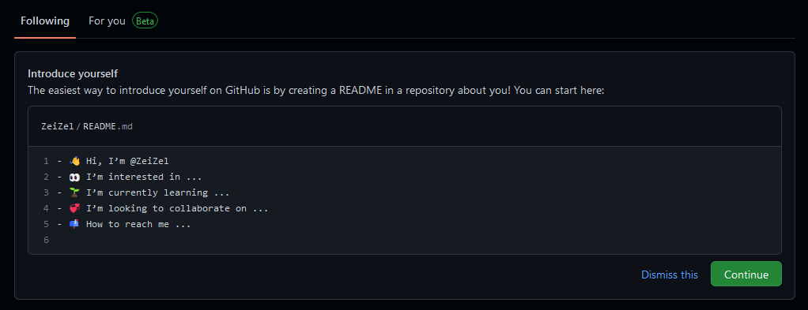

# h1

## h2

### h3

#### h4

##### h5

###### h6

#теги/подтеги

_Курсивный текст_
**Жирный текст**

<b> Работает и разметка </b>
<i> Работает и разметка </i>

<font style = "color: red"> Красный текст </font>
<span style = "color: yellow"> Жёлтый текст </span>

> Лови цитату

```md
### Либо лови код

## mdшный
```

> [!Note] Заметка
> Которая может хранить очень много текста

- Первый пункт
- Второй пункт
- Два Enter, чтобы закончить список

- [ ] Первая галка
- [ ] Вторая галка
- [ ] А нужна ли третья?

[Obsidian UI](Obsidian%20UI.md) - относительная ссылка (работает только внутри обсидиана)
[Obsidian UI](Obsidian%20UI.md) - абсолютная ссылка (более предпочтительный вариант)

[Справочник по Docs Markdown](https://docs.microsoft.com/ru-ru/contribute/markdown-reference)



| Первый              | Второй           |
| ------------------- | ---------------- |
| Очень сложный       | Синтаксис таблиц |
| Однако тут работают | Энтеры           |


