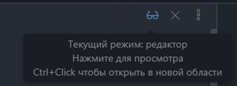
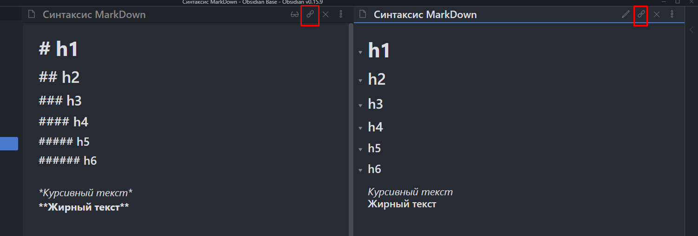
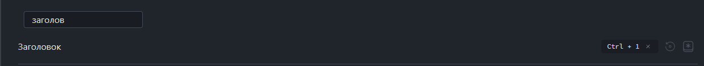
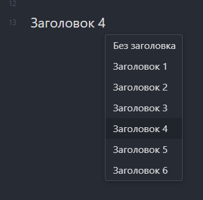
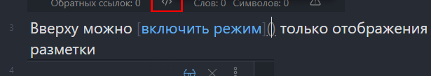
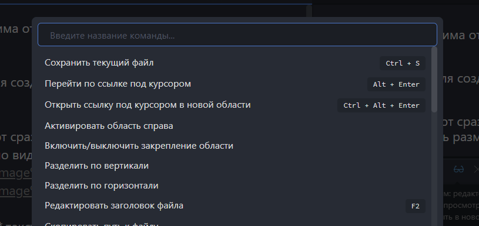

Ctrl+E - смена режима отображения документа (редактирование - просмотр)

Ctrl+O - палитра для создания или поиска файла (лучше создавать файлы через него)

Ctrl+Очки - откроют сразу второе слинкованное окно. Очень удобно, когда нужно видеть разметку и готвый код

Ctrl+I - _курсивный_ текст
Ctrl+B - **жирный** текст

Ctrl+1 - назначил менюшку назначения заголовка

Ctrl+K - из выделенного текста создаст ссылку либо просто создаст конструкцию для ссылки

Ctrl+Alt+K - создаст [внутреннюю ссылку](внутреннюю%20ссылку) (якорь)

Ctrl+P - палитра команд

