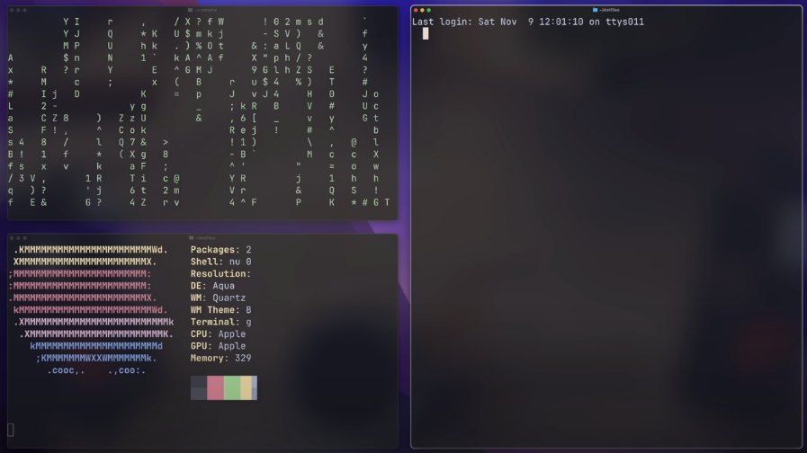

Aerospace - это тайлинговый менеджер для mac os.

> [!caution] Он не работает дефолтно с виртуальными рабочими столами на маке и считает их как за одно своё пространство! Вместо них нужно использовать пространства этого менеджера.

### Работа с виртуальными пространствами

`cmd + <number>` - поменять текущее виртуальное пространство
`cmd + shift + <number>` - перетянет приложение в определённое виртуальное пространство

### Работа с тайлами в рамках пространства

`opt + h/j/k/l` - навигация по окнам приложений в рамках пространства
`opt + shift + h/j/k/l` - перемещение самих окон
`cmd + shift + = / -` - изменение размера окна
`cmd + shift + ;` - переход в `service mode`
`service mode + r` - сброс настроек текущего окна

`cmd + /` - переход в режим тайлинга окон (все окна в ряд)
`cmd + ,` - переход в режим аккордеона (окна наслаиваются друг на друга)

Для создания более сложной сетки нужно будет воспользоваться стрелками (или `j/k`) и комбинацией `cmd+shift`

