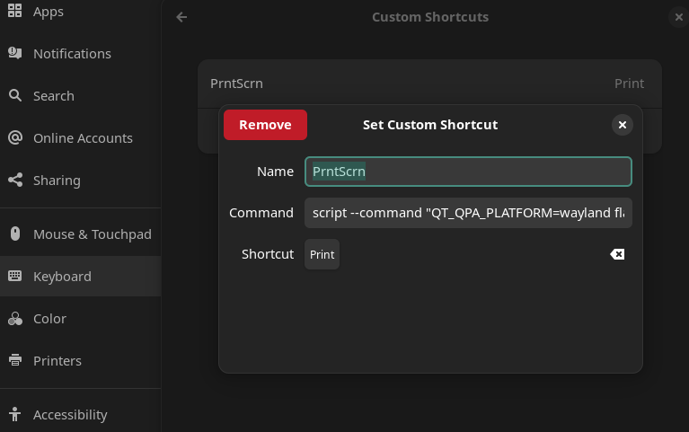

## Troubleshooting

Этот ФШ нужно обязательно триггерить через скрипт на Wayland, так как доступа никогда к экрану не будет в противном случае

```bash
script --command "QT_QPA_PLATFORM=wayland flameshot gui" /dev/null
```




