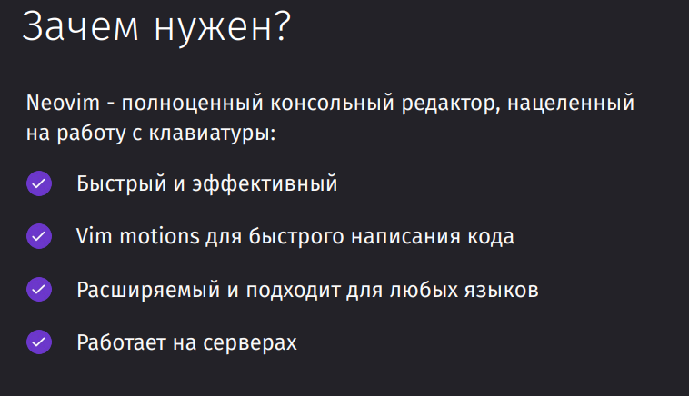
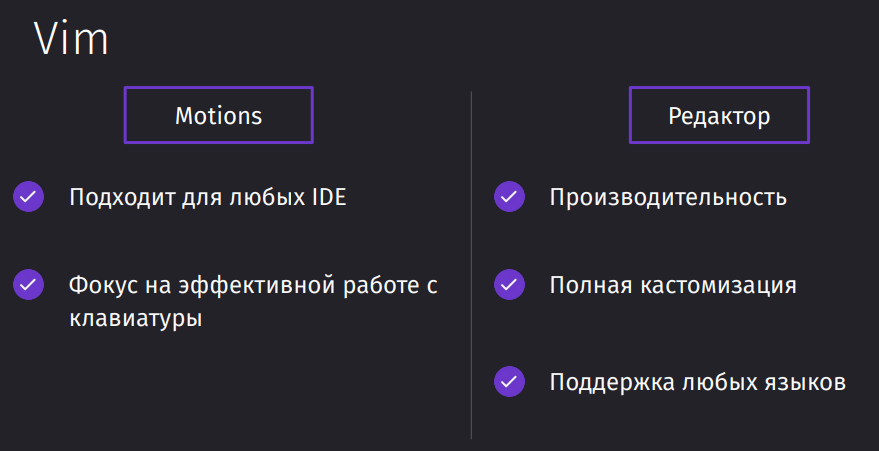

Vim - это консольный редактор

Его можно как запустить удалённом сервере и уже поднять внутри него свою конфигурацию, так и просто импортировать конфигурацию удобно и быстро на любой другой компьютер 

Стоит различать, что vim-motions и vim-редактор - это две разные сущности, которые можно отделить друг от друга. Те же моушены можно использовать в любой IDE или редакторе через плагины, потому что это целый подход к работе с текстом.

