### Путь конфигурации

Чтобы узнать путь до папки с конфигурацией nvim, можно ввести команду `:echo stdpath('config')`

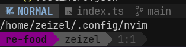

NeoVim при инициализации смотрит на свой путь конфигурации. По этому пути он ищет файл `init.lua`, который является точной входа в свою конфигурацию.

Сам по себе конфиг представляет из себя программу, на которую вим выполняет внутри себя.

`.config > init.lua`
```lua
print('Привет!')
```

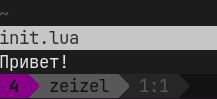

### Структура конфигурации

Структура конфигурации выглядит следующим образом:

- `init.lua` - наш стартовый bootstrap файл
- `lua` - общая папка для всех конфигураций
- `lua/core` - ключевые вещи (цвета, маппинги, конфигурации)
- `lua/plugins` - отдельные файлы для каждого плагина

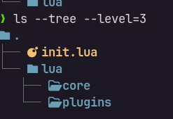

Далее нам нужно создать файл с нашими базовыми конфигами в следующей папке:

`lua / core / configs.lua`
```lua
print("Configs!")
```

И теперь остаётся только импортировать модуль. Папка `lua` будет установлена по дефолту

`init.lua`
```lua
require("core.configs")
```

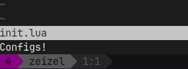

### Базовые настройки

Для изменения базовых настроек вима, нам нужно обращаться к таблице `vim`. Все базовые настройки мы храним в `configs.lua`.

`lua / core / configs.lua`
```lua
-- настройка номеров колонок
vim.wo.number = true
vim.wo.relativenumber = true

-- настройка поведения мыши
vim.opt.mouse = "a"
vim.opt.mousefocus = true

-- подключение к системному клиборду
vim.opt.clipboard = "unnamedplus"

-- описание табуляции
vim.opt.shiftwidth = 4
vim.opt.tabstop = 4
vim.opt.softtabstop = 4

-- другие настройки
vim.opt.scrolloff = 8
vim.opt.wrap = false
vim.opt.termguicolors = true -- поддержка полноцветного терминала

-- заполнение символов вима
vim.opt.fillchars = {
	vert = "│",
	fold = "⠀",
	eob = " ", -- suppress ~ at EndOfBuffer
	-- diff = "⣿", -- alternatives = ⣿ ░ ─ ╱
	msgsep = "‾",
	foldopen = "▾",
	foldsep = "│",
	foldclose = "▸",
}
```

Последнее поле `fillchars` нужно для того нам, чтобы перезатереть дефолтные символы, которые рисует вим - в частности: 
- чтобы перезатереть пустые строки
- чтобы нарисовать

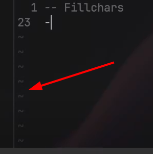

### Сочетания клавиш

Далее добавим альтернативные сочетания клавиш

`leader` - это главная клавиша, которую мы используем для ключевых действий

- `<leader>` - вызов главной клавиши
- `<CR>` - это обозначение завершения команды
- `c` - это `ctrl`
- `s` - это `shift`
- `Tab` - это `Tab`

Через `=` мы перезаписываем сочетание, а через `set` мы добавляем новое без перезаписывания старого

В `set` мы передаём первым аругментом режим, вторым наше сочетание, а третьим то, какое мы дополняем

`lua / core / mappings.lua`
```lua
-- установка leader-клавиши в пробел
vim.g.mapleader = " "

-- биндим выход из режим на jj
vim.keymap.set("i", "jj", "<Esc>")

-- Устанавливаем сохранение файла с :w на leader+w
vim.keymap.set("n", "<leader>w", ":w<CR>")
```

Каждый наш записанный биндинг, мы сможем отследить в строке команды

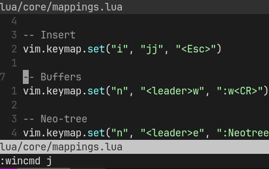

Дальше нужно установить маппинги в инициализирующий файл

`init.lua`
```lua
-- Basic Config
require("core.configs")
require("core.mappings")
```

### Split окон

Сплит окон позволяет нам расположить другое рабочее окно прямо в нашем

Для горизонтального разделения экрана, нужно воспользоваться `:split` (или коротко `:sp`). Для вертикального `:vsplit` (или коротко `:vsp`).

Перемещение между окнами: `ctrl + w` + `j` (вниз), `k` (вверх), `h` (влево), `l` (вправо).

Для упрощения навигации между окнами, можно забиндить возможность перемещения по `ctrl + направление`. Чтобы забиндить перемещение, нужно обратиться к `:wincmd`, через который можно так же переместиться на другое окно.

Деление экрана забиндим на `|` и `\`.

`lua / core / mappings.lua`
```lua
-- Навигация
vim.keymap.set("n", "<c-k>", ":wincmd k<CR>")
vim.keymap.set("n", "<c-j>", ":wincmd j<CR>")
vim.keymap.set("n", "<c-h>", ":wincmd h<CR>")
vim.keymap.set("n", "<c-l>", ":wincmd l<CR>")

-- Настройка деления экрана
vim.keymap.set("n", "|", ":vsplit<CR>")
vim.keymap.set("n", "\\", ":split<CR>")
```

### Менеджер плагинов

Для того, чтобы у нас появилась возможность прокачивать наш конфиг более удобными методами и наполнять его плагинами сообщества, есть удобный инструмент для установки пакетов - [lazy.nvim](https://lazy.folke.io/)

`lua / core / configs.lua`
```lua
-- Bootstrap lazy.nvim
-- вся эта конструкция, при отсутствии на компьютере lazy.nvim, склонирует репозиторий с пакетом и установит его
local lazypath = vim.fn.stdpath("data") .. "/lazy/lazy.nvim"
if not (vim.uv or vim.loop).fs_stat(lazypath) then
	local lazyrepo = "https://github.com/folke/lazy.nvim.git"
	local out = vim.fn.system({ "git", "clone", "--filter=blob:none", "--branch=stable", lazyrepo, lazypath })
	if vim.v.shell_error ~= 0 then
		vim.api.nvim_echo({
			{ "Failed to clone lazy.nvim:\n", "ErrorMsg" },
			{ out, "WarningMsg" },
			{ "\nPress any key to exit..." },
		}, true, {})
		vim.fn.getchar()
		os.exit(1)
	end
end
vim.opt.rtp:prepend(lazypath)

-- Setup lazy.nvim
-- тут находится базовая настройка lazy.nvim
require("lazy").setup({
	spec = {
		{ import = "plugins" },
	},
	checker = { enabled = true },
})
```

Сразу после перезахода в вим, мы встретим ошибку, что плагины не были найдены.
Сейчас нам нужно будет установить какой-нибудь плагин.

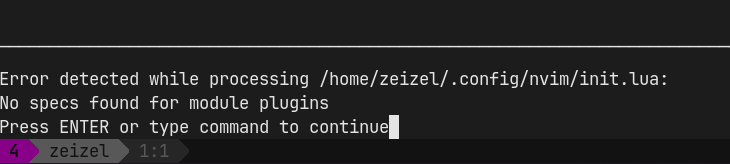

Располагать все плагины мы можем по документации `lazy` в папке `plugins` либо в `init.lua`, либо в каждом отдельном `.lua` файле

Теперь подтянем плагин *gitsigns*, который будет отображать нам изменения файла относительно того, что есть в git

Описать плагин мы должны по схеме `lazy`, где:

- первый параметр - репозиторий плагина
- второй параметр - инициализация запуска, которую мы заносим в `function()`

Как запускается каждый плагин, можно посмотреть в документации. У данного плагина установка описана [тут](https://github.com/lewis6991/gitsigns.nvim?tab=readme-ov-file#installation--usage) (+ там указаны возможные параметры для конфиграции, которые мы можем передать в метод инициализации)

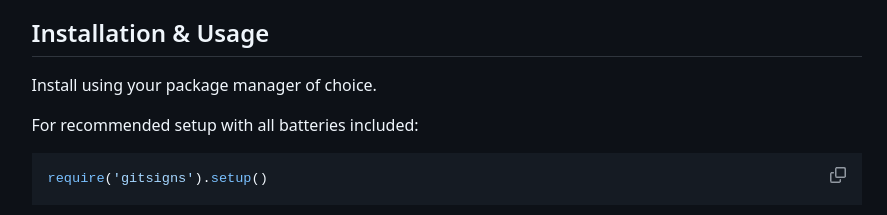

Так будет выглядеть финальный результат:

`lua / plugins / gitsigns.lua`
```lua
return {
	{
		"lewis6991/gitsigns.nvim",
		config = function()
			require('gitsigns').setup()
		end
	}
}
```

Плагин должен автоматически установиться после перезахода. Если это не произошло, то можно сделать это самостоятельно через вызов `:Lazy`, где вверху будут отображаться команды установки, обновления, синхронизации и так далее.

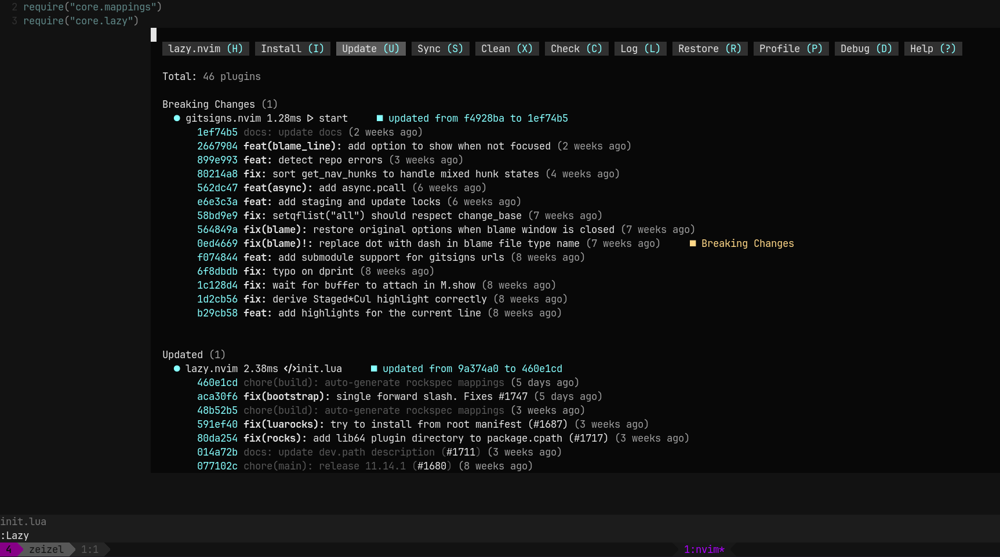

Все установленные нами плагины записываются в файл `lazy-lock.json`, который фиксирует определённые версии плагинов, занося название пакета, ветку и коммит

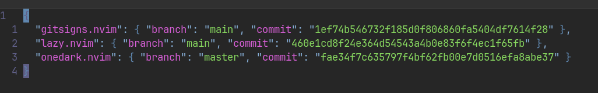

### Тема

Далее попробуем установить [тему](https://github.com/navarasu/onedark.nvim).

`lua / plugins / onedark.lua`
```lua
return {
	"navarasu/onedark.nvim",
	config = function()
		require('onedark').setup({
			transparent = true
		})
		require('onedark').load()
	end
}
```

Теперь у нас есть тема с такой подсветкой

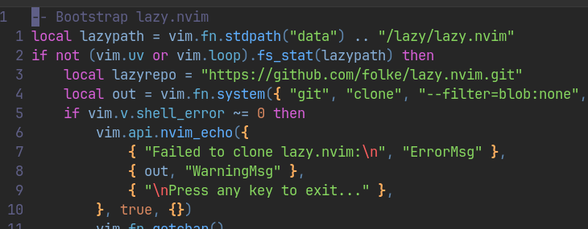

За более продвинутую подсветку синтаксиса уже будет отвечать Treesitter

Иногда для подключения других тем нужно воспользоваться командой `:colorscheme <тема>`, чтобы подключить тему
