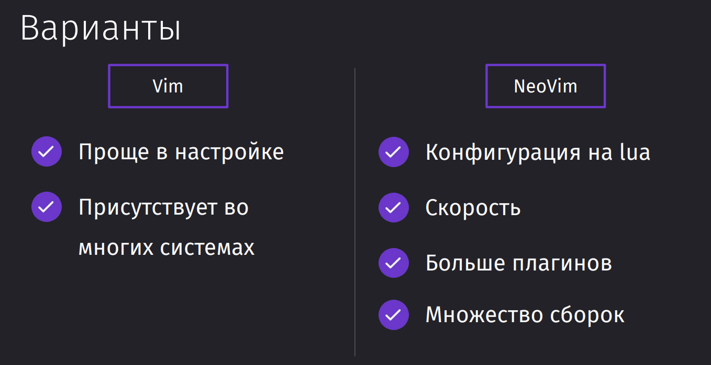
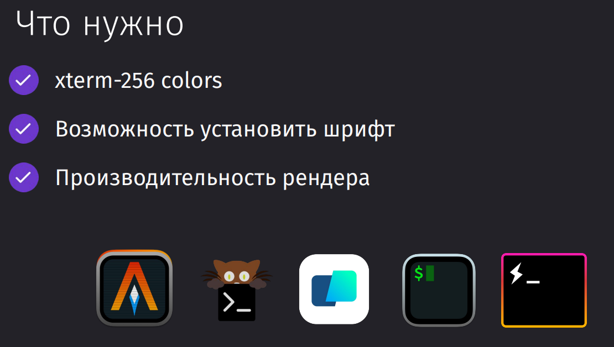
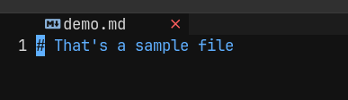
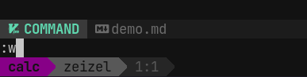
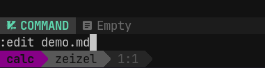

### Vim или NVim

Vim:
- присутствует из коробки во многих системах
- у него только один простой конфигурационный файл

NeoVim:
- Конфигурируется на lua, который проще vimscript и предоставляет возможность разнести разные группы по разным файлам 
- Является многопоточным и ускоренным за счёт libuv
- Имеет больше плагинов
- Имеет широкую базу различных удобных сборок



### Выбор терминала

Самый универсальный вариант - Alacritty. Он работает под любой ОС.



### Настройка терминала

Процесс настройки описан в [Terminal](../../Terminal.md)

### Установка NVim

```bash
sudo [apt install | dnf install | pacman -S] neovim
brew install neovim
```

### Создание первого файла

Так же мы можем создать новый файл через вим, передав имя и расширение файла. Если такой файл в папке уже существует, то вим просто откроет его.

```bash
nvim [название файла]
```

Для ввода данных, нужно будет перейти в режим ввода `i`



Изначально файл создастся в нашем буфере и потом, когда мы запустим команду `:w`, он запишется к нам на диск



Если мы уже вошли в вим, но не открыли файл, то это сделать мы можем через команду `:edit` куда передадим имя целевого файла


