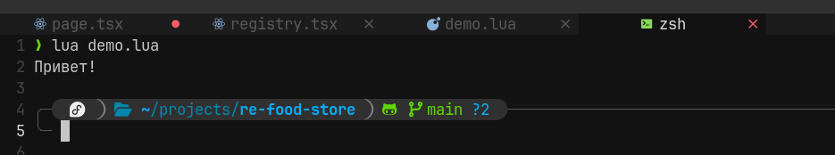
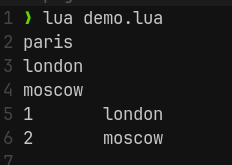

### Установка

Установить lua достаточно легко можно через brew

```bash
brew inatall lua
```

Далее нам нужно будет создать файл с небольшим примером кода на lua

`demo.lua`

```lua
print("Привет!")
```

Далее нам нужно запустить терминал. Сделать это можно так же прямо в виме через команду `:terminal`. Начать писать можно через переход в режим _terminal_ через `i`

И запускаем файл

```bash
lua demo.lua
```



Из терминала можно выключить через стандартный `exit`

### Переменные

Переменные в lua делятся на локальные и глобальные.
Создать локальную переменную можно с помощью конструкции `local`.

Основные типы: числа, строки, булевы значения, таблицы, массивы (таблицы с числовыми индексами), nil

Конкатенация строк происходит через `..`
Вывести текст через `print()`
Вывести тип можно через `type()`

```lua
local a = 50
local b
b = 30
c = 80

local greeting = "Привет"
local excl = "!"

local isAdmin = true

-- Привет!
print(greeting..excl)
-- boolean
print(type(isAdmin))
-- 80 80
print(a + b, c)
```

### Циклы

Массивы в lua - это таблицы (объекты), ключами которых являются числовые значения. Значения индексов идут с 1, а не с 0.

Перебор по собственным нашим индексам, которые мы добавим в таблицу можно совершить через `for-i`. А пройти целиковый массив можно через `for-in`.

```lua
local array = {"london", "moscow"}
array[0] = "paris"
array[-1] = "denver"

-- Цикл for с числовыми индексами
for i = 0, 2 do
  print(array[i])
end

-- Итерация с помощью ipairs
for key, value in ipairs(array) do
  print(key, value)
end
```



### Ветвления

Операции ветвления в lua представлены следующим образом:

- старт условия - `if`
- вставка дополнительного условия - `elseif`
- иначе - `else`
- `||` и `&&` выглядят как `and` и `or`

```lua
local a = 20

if a < 20 then
	print("a is less then 30")
elseif a > 20 and a < 30 then
	print("a is between 20 and 30")
else
	print("a is more then 30")
end
```

### Функции

Функция — это изолированный кусочек кода.

- Их можно вызывать в различных частях приложения.
- Функции имеют наименование, аргументы и могут возвращать значение.

```lua
function max(num1, num2)
	if num1 > num2 then
		return num1
	else
		return num2
	end
end

local res = max(5, 7)

-- 7
print(res)
```

### Tables

Таблица в lua представляет из себя то же самое, что и объект в JS. Она хранит набор различных значений

Ключи мы можем записывать под индексами, под строчными записями, записывать через dot notation и обращаться ко всем записанным значениям таким же образом.

```lua
table = {}
table[0] = "test"
table["a"] = "avalue"
table.b = "bvalue"

table2 = {
	c = "cvalue"
}

table3 = {
	d = {
		e = "evalue"
	}
}

print(table3.d.e)
```

### Модули

Модули - это удобный инструмент декомпозиции кода по разным файлам. Они нам предоставляют:

- Декомпозицию код на отдельные файлы
- Изоляцию кода для последующего переиспользования
- Повышение читабельности приложения

Создаём таблицу с нужными данными и для неё создаём функцию. Чтобы таблица не попадала в глобальный скоуп, создадим её локальной (чтобы она реально оставалась только внутри своего файла).
Саму таблицу мы экспортируем из файла через `return`.

`lib/mymath.lua`

```lua
local mymath = {}

function mymath.add(a, b)
	print(a + b)
end

return mymath
```

И далее через `require` и абсолютный путь до файла мы можем получить наш экспортированный модуль

`demo.lua`

```lua
mymathmodule = require("lib/mymath")
mymathmodule.add(1, 3)
```
