---
tags:
  - nvim
  - DevNvim
description: Глава посвящена установке плагинов для разработки приложений
---

### Cmp

Мы не можем обойтись во время разработки без автокомплитов, которые может предложить нам полноценная IDE. Покрыть эту реализацию поможет нам плагин [Cmp](https://github.com/hrsh7th/nvim-cmp)

Конфиг будет включать в себя сразу несколько различных пакетов:

`lua / plugins / cmp.lua`
```lua
return {
	{ "hrsh7th/cmp-nvim-lsp" },
	{ "hrsh7th/cmp-buffer" },
	{ "hrsh7th/cmp-path" },
	{ "hrsh7th/cmp-cmdline" },
	{
		"hrsh7th/nvim-cmp",
		config = function()
			local cmp = require("cmp")
			cmp.setup({
				snippet = {
					expand = function(args)
						vim.fn["vsnip#anonymous"](args.body) -- For `vsnip` users.
						-- require('luasnip').lsp_expand(args.body) -- For `luasnip` users.
						-- require('snippy').expand_snippet(args.body) -- For `snippy` users.
						-- vim.fn["UltiSnips#Anon"](args.body) -- For `ultisnips` users.
						-- vim.snippet.expand(args.body) -- For native neovim snippets (Neovim v0.10+)
					end,
				},
				window = {
					-- completion = cmp.config.window.bordered(),
					-- documentation = cmp.config.window.bordered(),
				},
				mapping = cmp.mapping.preset.insert({
					["<C-b>"] = cmp.mapping.scroll_docs(-4),
					["<C-f>"] = cmp.mapping.scroll_docs(4),
					["<C-Space>"] = cmp.mapping.complete(),
					["<C-e>"] = cmp.mapping.abort(),
					["<CR>"] = cmp.mapping.confirm({ select = true }), -- Accept currently selected item. Set `select` to `false` to only confirm explicitly selected items.
					-- конфигурация маппинга по доступным словам по табу
					["<Tab>"] = cmp.mapping(function(fallback)
						if cmp.visible() then
							cmp.select_next_item()
						else
							fallback()
						end
					end, { "i", "s" }),
					["<S-Tab>"] = cmp.mapping(function(fallback)
						if cmp.visible() then
							cmp.select_prev_item()
						else
							fallback()
						end
					end, { "i", "s" }),
				}),
				sources = cmp.config.sources({
					{ name = "nvim_lsp" },
					{ name = "vsnip" }, -- For vsnip users.
					-- { name = 'luasnip' }, -- For luasnip users.
					-- { name = 'ultisnips' }, -- For ultisnips users.
					-- { name = 'snippy' }, -- For snippy users.
				}, {
					{ name = "buffer" },
				}),
			})
		end,
	},
}
```

Но пока этот плагин не будет нормально работать, так как у нас не установлены LSP, которые и отвечают за поддержку различных языков

В итоге наш автокомплит будет предлагать нам завершение строк в зависимости от контекста его вызова и доступных вариантов.

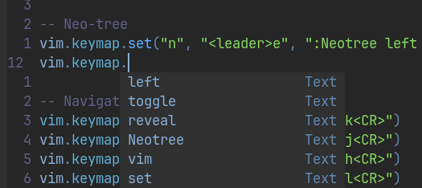

### LSP + Быстрые переходы

И сейчас для полноценной поддержки наших ЯПов в разработке, нам понадобится подключить Lsp

LSP - это language server protocol, который представляет из себя иснтрумент для взаимодействия с языком (проверка, подсказки и так далее)

Для подключения большого количества различных lsp, мы можем воспользоваться [nvim-lspconfig](https://github.com/neovim/nvim-lspconfig)

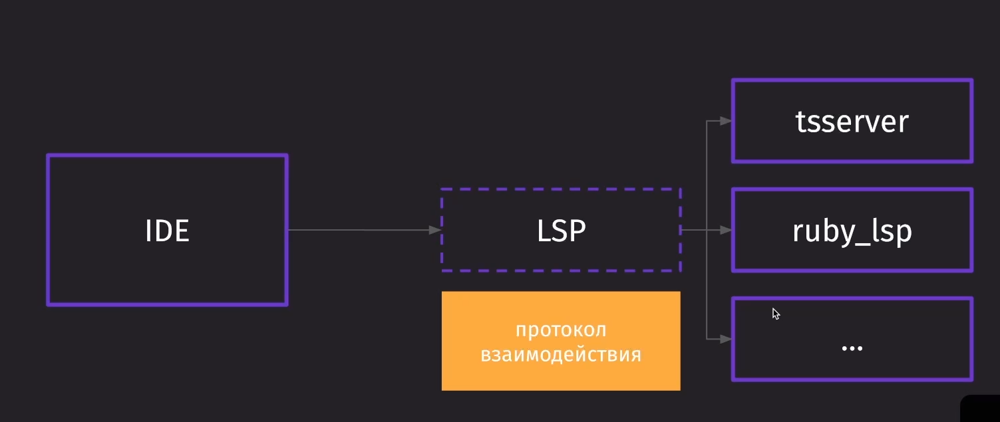

Тут мы добавили базовые LSP для TS, GO и Lua, а так же клавиши быстрых переходов по коду:

- `gd` - пройти к определению

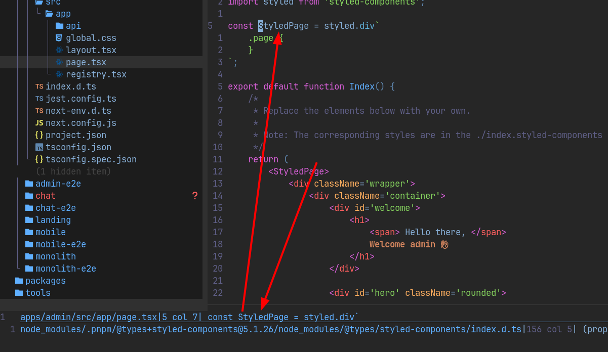

- `K` - сигнатура функции (какие аргументы она принимает)

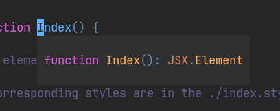

- `ctrl + k` - помощь сигнатуры

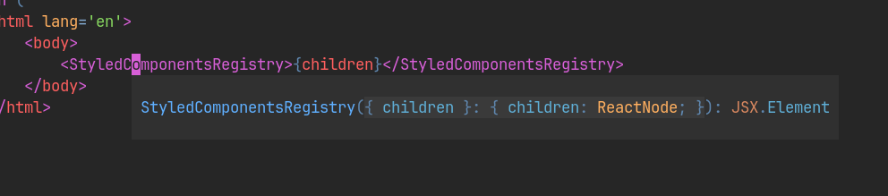

- `gi` - имплементация

Тут осуществился переход к компоненту из прошлого скрина

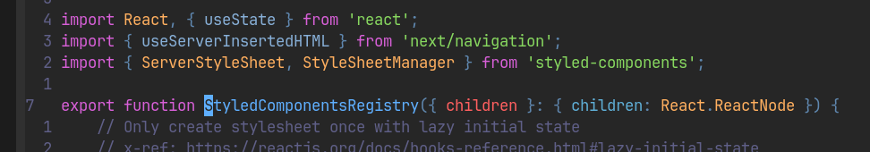

- `leader` + `D` - переход к определнию типа
- `leader` + `lr` - переименовывает объект
- `leader` + `la` - выводит быстрое действие, которое можно выполнить

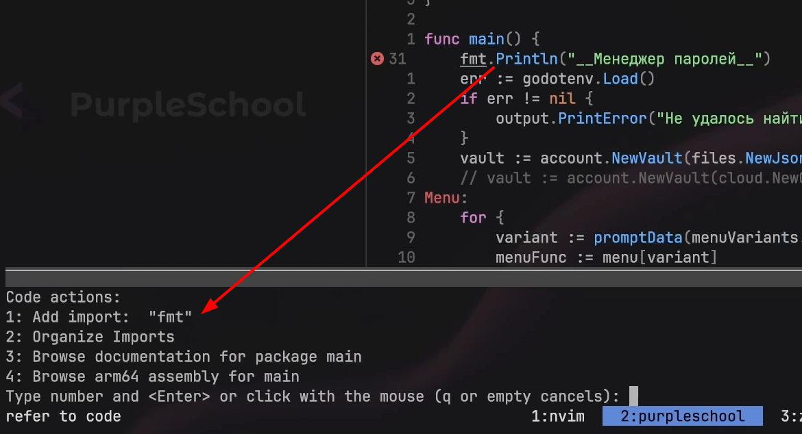

- `leader` + `lf` - форматирование кода

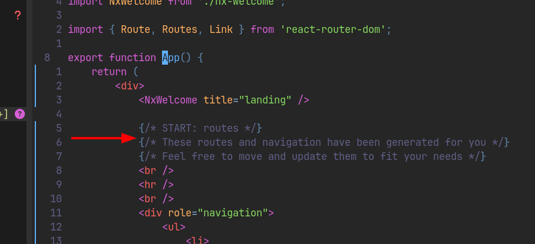

`lua / plugins / lsp.lua`
```lua
return {
	{
		"neovim/nvim-lspconfig",
		config = function()
			local lspconfig = require("lspconfig")
			lspconfig.lua_ls.setup({})
			lspconfig.gopls.setup({})

			-- поднятие ts-сервера, который будет нужен для работы с его кодом и линтингом
			lspconfig.ts_ls.setup({})

			-- Быстрые переходы
			vim.api.nvim_create_autocmd("LspAttach", {
				group = vim.api.nvim_create_augroup("UserLspConfig", {}),
				callback = function(ev)
					vim.bo[ev.buf].omnifunc = "v:lua.vim.lsp.omnifunc"

					local opts = { buffer = ev.buf }
					vim.keymap.set("n", "gd", vim.lsp.buf.definition, opts)
					vim.keymap.set("n", "K", vim.lsp.buf.hover, opts)
					vim.keymap.set("n", "gi", vim.lsp.buf.implementation, opts)
					vim.keymap.set("n", "<C-k>", vim.lsp.buf.signature_help, opts)
					vim.keymap.set("n", "<Leader>D", vim.lsp.buf.type_definition, opts)
					vim.keymap.set("n", "<Leader>lr", vim.lsp.buf.rename, { buffer = ev.buf, desc = "Rename Symbol" })
					vim.keymap.set({ "n", "v" }, "<Leader>la", vim.lsp.buf.code_action, opts)
					vim.keymap.set("n", "<Leader>lf", function()
						vim.lsp.buf.format({ async = true })
					end, opts)
				end,
			})
		end,
	},
}
```

Ну и так же нам нужно установить языковые сервера, чтобы протоклы могли с ними общаться

```bash
brew install go
npm install -g typescript typescript-language-server
```

**Либо** мы можем установить Mason, который упростит установку языковых серверов

### Mason + Ensure install

Далее нам понадобится пакетный менеджер [Mason](https://github.com/williamboman/mason.nvim), который пзволит нам устанавливать языковые-сервера и связанные с разработкой пакеты в NeoVim

- Первым объектом мы установим сам Mason
- а дальше пакет автоматической установки LSP после установки самого Mason

`lua / plugins / mason.lua`
```lua
return {
	{
		"williamboman/mason.nvim",
		config = function()
			require('mason').setup()
		end
	},
	-- Ensure install
	{
		'williamboman/mason-lspconfig.nvim',
		config = function()
			require("mason-lspconfig").setup(
			{
				ensure_installed = { "lua_ls", "rust_analyzer", "gopls" }
			})
		end
	}
}
```

Командой `:Mason` мы вызываем окно, в котором сами ищем и через `i` запускаем установку интересующего нас сервера

Так же он сам за нас добавляет сервер в `$PATH`

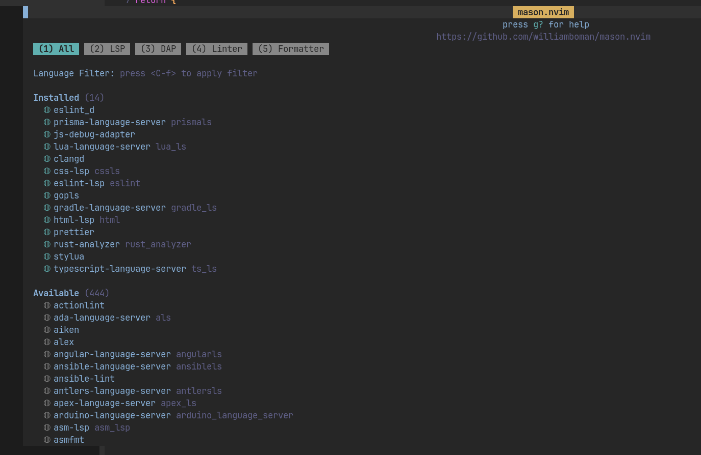

И теперь у нас на данном этапе появляется автокомплит

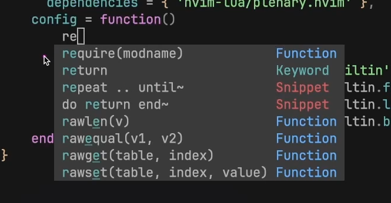

### Treesitter

Теперь нам понадобится плагин для того, чтобы подсвечивать синтаксис [Treesitter](https://github.com/nvim-treesitter/nvim-treesitter)

`lua / plugins / treesitter.lua`
```lua
return {
	{
		'nvim-treesitter/nvim-treesitter',
		config = function()
			require('nvim-treesitter.configs').setup({
				ensure_installed = { "go", "rust", "lua", "typescript", "javascript", "c", "vim", "vimdoc", "markdown", "markdown_inline" },
				auto_install = true,
				highlight = {
					enable = true,
				}
			})
		end
	}
}
```

В итоге мы из обычной белой подсветки получим полноценную подсветку функций, методов, классов и других конструкций языков

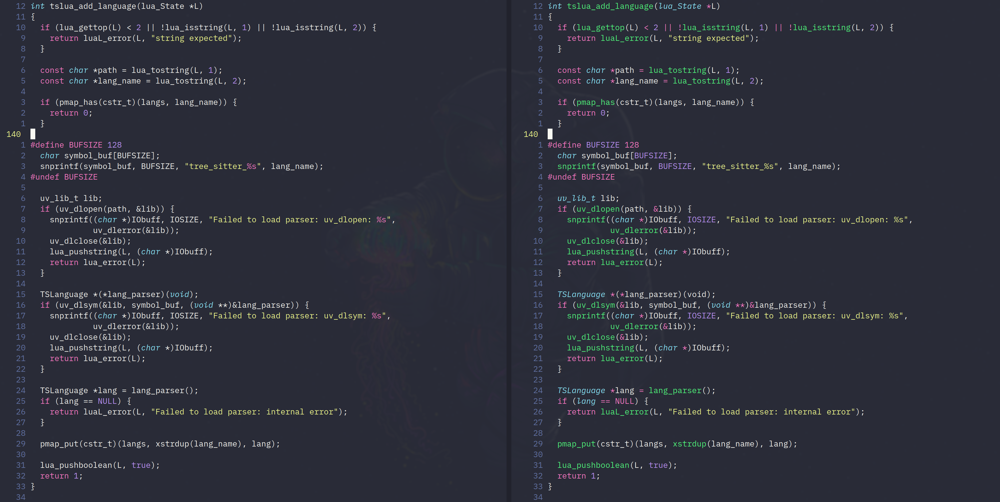

### Dressing

Далее было бы удобно открывать быстрые действия с помощью [Dressing](https://github.com/stevearc/dressing.nvim), которые предоставляет нам LSP в отдельном маленьком попапчике, который будет более удобным отображением, чем окошко в районе поля команд

`lua / plugins / dressing.lua`
```lua
return {
	{
		'stevearc/dressing.nvim',
		config = function()
			require('dressing').setup({
				input = {
					win_options = {
						winhighlight = 'Normal:CmpPmenu,FloatBorder:CmpPmenuBorder,CursorLine:PmenuSel,Search:None',
					},
				}
			})
		end
	}
}
```

Теперь под каждое действие, которое мы добавили через LSP, у нас открываются попапчики

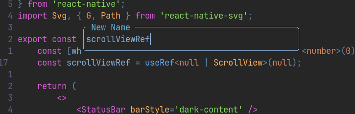

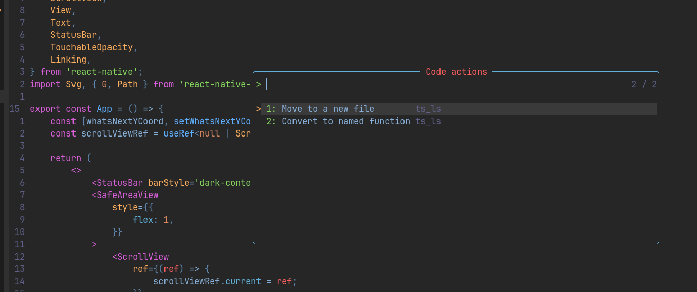

### Trouble

Так же нам очень понадобится плагин, который отобразит более подробно ошибку, которая произошла в коде и в этом нам поможет [Trouble](https://github.com/folke/trouble.nvim)

`lua / plugins / trouble.lua`
```lua
return {
	{
		"folke/trouble.nvim",
		opts = {}, -- for default options, refer to the configuration section for custom setup.
		cmd = "Trouble",
		keys = {
			{
				"<leader>qq",
				"<cmd>Trouble diagnostics toggle focus=true<cr>",
				desc = "Diagnostics (Trouble)",
			},
			{
				"<leader>qQ",
				"<cmd>Trouble diagnostics toggle filter.buf=0<cr>",
				desc = "Buffer Diagnostics (Trouble)",
			},
			{
				"<leader>cs",
				"<cmd>Trouble symbols toggle focus=false<cr>",
				desc = "Symbols (Trouble)",
			},
			{
				"<leader>cl",
				"<cmd>Trouble lsp toggle focus=false win.position=right<cr>",
				desc = "LSP Definitions / references / ... (Trouble)",
			},
			{
				"<leader>qL",
				"<cmd>Trouble loclist toggle<cr>",
				desc = "Location List (Trouble)",
			},
			{
				"<leader>qQ",
				"<cmd>Trouble qflist toggle<cr>",
				desc = "Quickfix List (Trouble)",
			},
		},
	}
}
```

- `leader + qq` - тугл диагностики

Она позволяет сразу переключаться по проблемам в проекте. Закрывается окошко просто через `q` (предварительно перейдя в него через `ctrl + направление`)

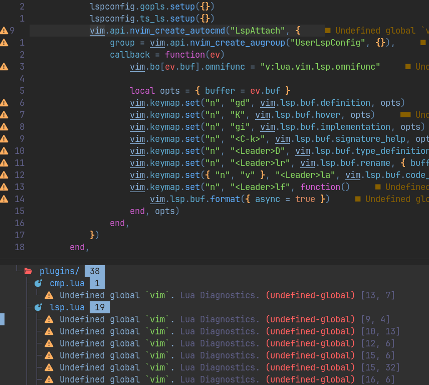

### Formatting

Далее нам нужно настроить форматирование кода с помощью плагина [Conform](https://github.com/stevearc/conform.nvim)

Форматтиер не работает как LSP и мы его должны вызывать будем вызывать ивентом "перед сохранением"

`lua / plugins / conform.lua`
```lua
return {
	{
		"stevearc/conform.nvim",
		opts = {},
		config = function()
			require("conform").setup({
				-- тут мы определяем, какие форматтиеры будут отрабатывать по-умолчанию
				formatters_by_ft = {
					lua = { "stylua" },
					python = { "isort", "black" },
					rust = { "rustfmt", lsp_format = "fallback" },
					javascript = { "prettier" },
					typescript = { "prettier" },
					javascriptreact = { "prettier" },
					typescriptreact = { "prettier" },
				},
			})
			vim.api.nvim_create_autocmd("BufWritePre", {
				pattern = "*",
				callback = function(args)
					require("conform").format({ bufnr = args.buf })
				end,
			})
		end,
	},
}
```

Далее нам нужно будет запустить команду `:MasonInstall stylelua prettier` для установки серверов линтеров

В результате после сохранения файла, у нас будет прогоняться форматтиер, чтобы почистить наш код

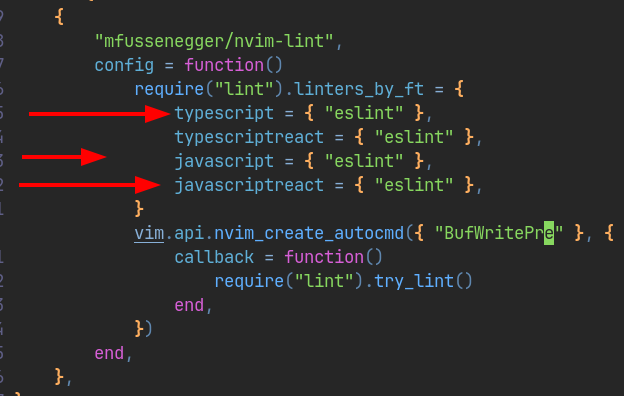

### Linting

И последним этапом в форматировании кода у нас остаётся специфичный под каждую среду разработки линтинг через [nvim-lint](https://github.com/mfussenegger/nvim-lint)

Линтер так же не является LSP, но его мы уже будем вызывать после сохранения

`lua / plugins / nvim-lint.lua`
```lua
return {
	{
		"mfussenegger/nvim-lint",
		config = function()
			require("lint").linters_by_ft = {
				-- тут мы определяем дефолтные линтеры, которые будут отрабатывать в языках
				typescript = { "eslint" },
				typescriptreact = { "eslint" },
				javascript = { "eslint" },
				javascriptreact = { "eslint" },
			}

			-- тут создаётся команда, которая вызывается перед записью буфера
			vim.api.nvim_create_autocmd({ "BufWritePost" }, {
				callback = function()
					require("lint").try_lint()
				end,
			})
		end,
	},
}
```

Чтобы линтер работал внутри ts, нужно, чтобы в конфигурации LSP была строчка с сетапом сервера языка по типу:

`lua / plugins / lsp.lua`
```lua
...
lspconfig.ts_ls.setup({})
...
```

Теперь мы всегда будем получать ошибки, которые нарушают наши правила eslint и они будут так же выходить в окно с ошибками `leader + qq`

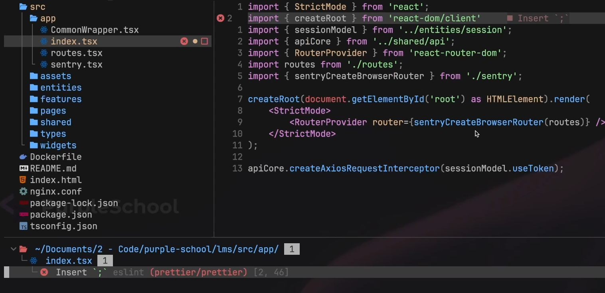
