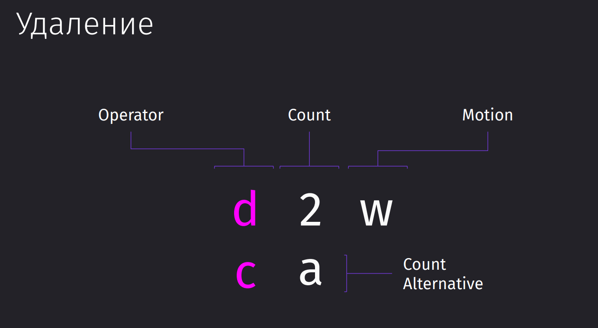
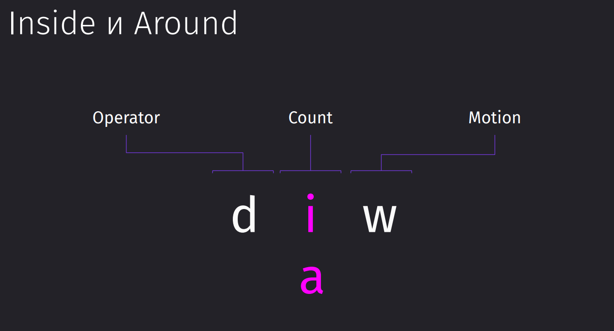
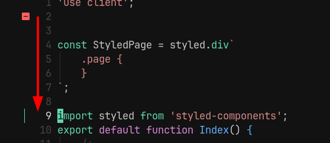
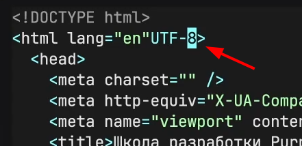
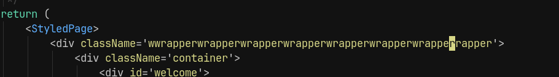
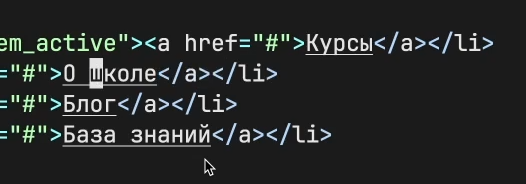
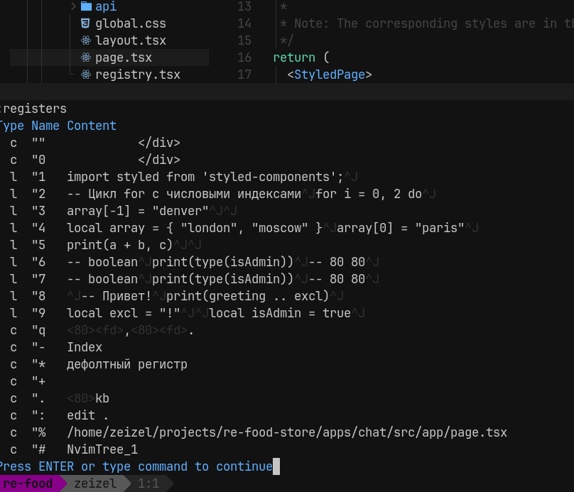

### Удаление текста

За удаление отвечает операцтор `d`. Он включает операцию удаления, которая позволит по моушену удалить нужный нам участок текста.

Чтобы откатить изменения вместо `ctrl + z` в Vim работает `u`. Сам же вим хранит все изменения, которые мы совершали в файле, поэтому можно откатываться даже до тех изменений, которые были до входа в файл
Чтобы вернуть отменённые изменения, нам нужно использовать `ctrl + r`

#### Основные комбинации

- `d` - *delete* - удаляет текст и остается в нормальном режиме.
- `c` - *correct* - удаляет текст и переходит в режим Insert.

#### Работа с операторами и motion

- `dw` - удалить слово. `d2w` - удалить два слова
- `dd` - удалить строку. `d3d` - удалить три строки вниз
- `db` - удалить назад до начала слова.
- `de` - удалить до конца слова.

#### Примеры комбинирования

- `d2w` - удалить два слова.
- `d$` - удалить до конца строки.
- `d10j` - удалить 10 строк вниз.

#### Переходы в режим Insert

- `cw` - удалить слово и сразу перейти в режим Insert.
- `cb` - удалить назад до начала слова и перейти в режим Insert.
- `cc` - удалит строку и перейдёт в режим `insert`

#### Упрощенные операции удаления

- Используемые команды для удаления могут быть комбинированы с count (числом удаляемых объектов) и motion (движением курсора), что позволяет эффективно удалять большие участки текста.

### inside и around

Так же вместо *Count* мы можем использовать специальные операторы, которые будут выполнять действия в рамках определённых границ либо только за ними

- `d` – удалить
- `i (inside)` – внутри границ
- `a (around)` – вокруг границ
- `t` – тег

Например, мандой `diw` мы можем выполнить действие внутри слова и удалить его целиком. То есть мы можем не переходить в его начало, а просто сделать действие удаления в самом слове. `daw` удалит и всё, что вокруг слова (пробелы).

`di"` - *delete inside "* - удалит слово внутри кавычек `"example"` -> `""`

Команда `dit` - *delete inside tag* - удалит всё внутри тегов: `<title>Школа разработки</title>` → `<title></title>`

`dt:` - *delete to :* - удалит всё до *:*

`di{` - *delete inside {* - удалит всё внутри фигурных кавычек

Мы можем вместо удаления скорректировать текст с помощью `ci(` для круглых скобок с последующим вводом нового значения

### Копирование и вставка

#### Удаление текста и регистры

При удалении текста в Vim с помощью команды `d` (например, `dd` для удаления строки), текст автоматически попадает в регистр, который действует как временное хранилище или буфер обмена.

В зависимости от настроек, регистр может интегрироваться с буфером обмена нашей операционной системы.

#### Вставка текста:

Команда `P`  / `p` вставляет текст из регистра ниже / выше текущей строки.

Эти команды помогают вернуть удаленный или скопированный текст в нужное место.

Если вырезана не вся строка, то `P` и `p` всталяют до/после курсора

#### Копирование текста:

Команда `y` копирует текст, аналогично удалению, но не удаляя его. Этот процесс в Vim называется "yanking".

`yy` копирует всю строку.

Можно использовать комбинации, аналогичные удалению, для копирования отдельных частей текста (например, `yi"` для копирования текста внутри кавычек).

#### Модификаторы движения и копирование

Они работают аналогично тем, что используются при удалении:

- `yw` копирует слово.
- `y$` копирует текст до конца строки.
- `yi<тег>` копирует текст внутри HTML-тега.

### Регистры

Проблема: мы скопировали одно значение, удалили другое, вставляем и получаем то, что у нас вставилось из регистра последнее значение в виде удалённого только что текста (скопировали *Блог*, удалили *Курсы* и вставили *Курсы*, хотя хотелось *Блог*)

Дело в том, что мы помещаем все скопированные и удалённые значения в **дефолтный регистр**

Просмотреть ВСЕ регистры (включая дефолтный) и их содержимое можно командой `:registers`

`Type` - говорит нам о типе данных, который присутствует в регистре (`Character`, `Line`, `Block`) 

`Name` - имя регистра

`Content` - контент регистра

Чтобы вставить и прочитать значение из именованного регистра, нужно перед началом команды записать индекс используемого регистра:
- `"2yiw` - запишет слово во второй регистр
- `"2p` - вставит последнее значение из второго регистра

`"` - это префикс регистра

И такое использование вполне можно комбинировать с использованием дефолтного регистра, когда мы копируем одного, второе, третье, четвёртое слово в разные регистры и потом достаём значения из них по очереди.

>[!info] Использование регистров
>- **Дефолтный и нулевой регистр** всегда обновляются автоматически, используйте их для повседневных задач.
> - **Именованные регистры** удобны для хранения полезного текста, который не должен быть перезаписан.