---
tags:
  - tools
  - nvim
---
#nvim #neovim #console #IDE

> [!summary] Писать в виме - это как использовать определённый язык программирования. Мы общаемся с Вимом, используя определённый синтаксис. `d2w` может расшировываться, как `delete 2 words`, что является понятным путём для редактирования текста. Каждое сочетание в виме переводится определённым полноценным словом, которое описывает действие клавиши.

> [!warning] Обрати внимание на регистр!
> В этом гайде все использования `shift + <команда>` заменены на использование команды в верхнем регистре aka просто `<КОМАНДА>`.


---
## Введение

Vim - это консольный редактор

Его можно как запустить удалённом сервере и уже поднять внутри него свою конфигурацию, так и просто импортировать конфигурацию удобно и быстро на любой другой компьютер


Стоит различать, что vim-motions и vim-редактор - это две разные сущности, которые можно отделить друг от друга. Те же моушены можно использовать в любой IDE или редакторе через плагины, потому что это целый подход к работе с текстом.


---
## Настройка окружения
### Vim или NVim  
  
Vim:  
  
- присутствует из коробки во многих системах  
- у него только один простой конфигурационный файл  
  
NeoVim:  
  
- Конфигурируется на lua, который проще vimscript и предоставляет возможность разнести разные группы по разным файлам  
- Является многопоточным и ускоренным за счёт libuv  
- Имеет больше плагинов  
- Имеет широкую базу различных удобных сборок  
  
  
  
### Выбор терминала  
  
Безошибочный вариант для выбора своей основной среды - Ghostty.
  
  
  
### Настройка терминала  
  
Процесс настройки описан в [Terminal](../../Terminal.md)  

### Установка NVim  
  
```bash  
sudo [apt install | dnf install | pacman -S] neovim  
brew install neovim
```  
  
### Создание первого файла  
  
Так же мы можем создать новый файл через вим, передав имя и расширение файла. Если такой файл в папке уже существует, то вим просто откроет его.  
  
```bash  
nvim [название файла]
```  
  
Для ввода данных, нужно будет перейти в режим ввода `i`  
  
  
  
Изначально файл создастся в нашем буфере и потом, когда мы запустим команду `:w`, он запишется к нам на диск  
  
  
  
Если мы уже вошли в вим, но не открыли файл, то это сделать мы можем через команду `:edit` куда передадим имя целевого файла  
  


---
## Базовые motion

### Режимы

> [!danger] NVim не воспринимает русскую раскладку во время работы с коммандами! Нужно перключаться на английскую.

Сама работа в симе поделена на несколько режимов, которые определяют доступный пул действий, которые мы можем выполнять в редакторе.

В Vim существует 5 режимов:

- _normal_

- просмотр
- _insert_ - вставка. Позволяет вводить текст.
    - войдёт
    - войдёт
    - войдёт
    - войдёт
    - создаст
    - создаст
    - заменит
    - войдёт
- _visual_ - выделение кода
    - войдёт
    - войдёт
    - `Ctrl + v` - войдёт в режим блочного выделения для выделения прямоугольных областей текста.
- _replace_ - ввод с перезаписью существующего текста.
- _command_ - позволяет работать с коммандами vim
    - вызывает


### Базовые перемещения

`ctrl + o` - отменит любое движение и действие, которое было выполнено.

#### Базовые движения

Для базовых перемещений по коду:

- вверх-вниз
- `h/l` - влево-вправо

#### Горизонтальные перемещения:

- перемещает
- `$` - перемещает в конец строки
- `w/b` - переход вперёд/назад по словам с учётом пробелов
- `W/B` - переход по словам без учёта пробелов (помогает, если перемещаемся по большому количеству спецсимволов `<title>Слова внутри тега</title>`)
- `e` - переходит в конец текщего слова
- `E` - игнорирует символы, кроме пробела, перемещаясь к концу слова.

#### Вертикальные перемещения:

- `число + G` - перемещение на определённую строку (перейдёт на выбранную по числу строку)
- `число + jk` - перемещение вверх/вниз на определённое число строк
- `gg` - перемещение в начало файла
- `G` - перемещение в конец файла

### Как практиковаться

Даже если пока не получается сидеть в виме, можно установить плагин для работы с Vim Motions в любом редакторе


### Комбинации движений

Комбинации - это последовательность действий. которые мы можем выполнить за счёт объединения сочетаний в виме

Operator - это действие, которое нужно выполнить над текстом
Count - это количество Motion (так же есть альтернатива в виде указания места)
Motion - это действие передвижения, в рамках которой будет выполнен оператор


`d3w` удалит 3 слова (aka _delete 3 words_)


`d3j` удалит уже 3 строки вниз


`di(` - удалит текст внутри скобок


Все те движения, что мы совершаем в виме - мы можем откатить. Если нам нужно будет откатиться на прошлое движение, то мы можем воспользоваться `ctrl + o`. Может это быть полезно, например, если мы зашли внутрь типа и нам нужно быстро вернуться обратно либо в случае, когда мы перешли не в ту часть файла.

### Продвинутое перемещние

`$` - переход в начало строки
`0` - переход в начало строки
`gg` - переход в начало файла
`G` - переход в конец файла

`:set nu` вызовет номера строк


`:set relativenumber` вызовет относительные номера строк, которые позволят нам не считать количество строк, на которое мы можем переместиться, например, той же командой `5j`


`f` ищет определённую букву в строке вперёд, а `shift+f` ищёт назад

`f` + `o` - найдёт первую найденную букву `o` в строке
`2fo` - перейдёт сразу ко второй названной `o` в строке


Если нужно продолжать передвигаться дальше по найденной букве, то мы нажимаем `;`


### Перемещение по блокам

`{` / `}` - позволяют перемещаться между разрывами строк


`%` - позволяет нам передвигаться между открывающей и закрывающей скобками (любыми)


`[` / `]` + определённый тип скобки - позволит переместиться к ближайшей скобке

`[}` переместит изнутри блока к ближайшей фигурной скобке. А уже комбинация `]}` сделает то же самое, но к закрывающей скобке. Так же это работает и с любыми другими скобками.


`ctrl + d` / `ctrl + u` - перемещение на страницу вниз/вверх

`_` - позволит нам перейти к первому символу строки. В отличе от `0`, который переносит нас в целом в начало строки (даже включая табы).


`-` / `+` уже будут переводить к началу/концу следующей строки


### Файлы и buffers

Как уже и упоминалось ранее, vim работает с буфферами - он загружает файл в ОЗУ и редактирует его в нём.

Открыть файл мы можем через команду `:edit <file>`

Открыть директорию с файлами мы можем через `:edit .`. Тут у нас появится напрямую файловый менеджер из вима. Все команды указаны сверху и, например, `R` позволит переименовать файл.


Команда `:buffers` позволит выписать список буфферов. В первом столбце идёт идентификатор буффера. Для перехода в определённый буффер, мы можем воспользоваться `:buffer <id_буфера>` для перехода в нужный

`:bnext` / `:bprevious` позволят переместиться к следующему/предыдущему буферу


`:buffer {` позволяет перейти в доку и узнать, что делает определённое сочетание на случай того, если мы забыли, что делает определённая команда


---
## Удаление и копирование

### Удаление текста

За удаление отвечает операцтор `d`. Он включает операцию удаления, которая позволит по моушену удалить нужный нам участок текста.


Чтобы откатить изменения вместо `ctrl + z` в Vim работает `u`. Сам же вим хранит все изменения, которые мы совершали в файле, поэтому можно откатываться даже до тех изменений, которые были до входа в файл
Чтобы вернуть отменённые изменения, нам нужно использовать `ctrl + r`

#### Основные комбинации

- _delete_

- удаляет
- `c` - _correct_ - удаляет текст и переходит в режим Insert.

#### Работа с операторами и motion

- удалить
- `dd` - удалить строку. `d3d` - удалить три строки вниз
- `db` - удалить назад до начала слова.
- `de` - удалить до конца слова.

#### Примеры комбинирования

- удалить
- `d$` - удалить до конца строки.
- `d10j` - удалить 10 строк вниз.

#### Переходы в режим Insert

- удалить
- `cb` - удалить назад до начала слова и перейти в режим Insert.
- `cc` - удалит строку и перейдёт в режим `insert`

#### Упрощенные операции удаления

- Используемые команды для удаления могут быть комбинированы с count (числом удаляемых объектов) и motion (движением курсора), что позволяет эффективно удалять большие участки текста.

### inside и around

Так же вместо _Count_ мы можем использовать специальные операторы, которые будут выполнять действия в рамках определённых границ либо только за ними

- `d` – удалить
- `i (inside)` – внутри границ
- `a (around)` – вокруг границ
- `t` – тег


Например, мандой `diw` мы можем выполнить действие внутри слова и удалить его целиком. То есть мы можем не переходить в его начало, а просто сделать действие удаления в самом слове. `daw` удалит и всё, что вокруг слова (пробелы).

`di"` - _delete inside "_ - удалит слово внутри кавычек `"example"` -> `""`

Команда `dit` - _delete inside tag_ - удалит всё внутри тегов: `<title>Школа разработки</title>` → `<title></title>`

`dt:` - _delete to :_ - удалит всё до _:_

`di{` - _delete inside {_ - удалит всё внутри фигурных кавычек

Мы можем вместо удаления скорректировать текст с помощью `ci(` для круглых скобок с последующим вводом нового значения

### Копирование и вставка

#### Удаление текста и регистры

При удалении текста в Vim с помощью команды `d` (например, `dd` для удаления строки), текст автоматически попадает в регистр, который действует как временное хранилище или буфер обмена.

В зависимости от настроек, регистр может интегрироваться с буфером обмена нашей операционной системы.

#### Вставка текста:

Команда `P`  / `p` вставляет текст из регистра ниже / выше текущей строки.

Эти команды помогают вернуть удаленный или скопированный текст в нужное место.


Если вырезана не вся строка, то `P` и `p` всталяют до/после курсора


#### Копирование текста:

Команда `y` копирует текст, аналогично удалению, но не удаляя его. Этот процесс в Vim называется "yanking".

`yy` копирует всю строку.

Можно использовать комбинации, аналогичные удалению, для копирования отдельных частей текста (например, `yi"` для копирования текста внутри кавычек).


#### Модификаторы движения и копирование

Они работают аналогично тем, что используются при удалении:

- `yw` копирует слово.
- `y$` копирует текст до конца строки.
- `yi<тег>` копирует текст внутри HTML-тега.

### Регистры

Проблема: мы скопировали одно значение, удалили другое, вставляем и получаем то, что у нас вставилось из регистра последнее значение в виде удалённого только что текста (скопировали _Блог_, удалили _Курсы_ и вставили _Курсы_, хотя хотелось _Блог_)

Дело в том, что мы помещаем все скопированные и удалённые значения в **дефолтный регистр**


Просмотреть ВСЕ регистры (включая дефолтный) и их содержимое можно командой `:registers`

`Type` - говорит нам о типе данных, который присутствует в регистре (`Character`, `Line`, `Block`)

`Name` - имя регистра

`Content` - контент регистра


Чтобы вставить и прочитать значение из именованного регистра, нужно перед началом команды записать индекс используемого регистра:

- запишет
- `"2p` - вставит последнее значение из второго регистра

`"` - это префикс регистра

И такое использование вполне можно комбинировать с использованием дефолтного регистра, когда мы копируем одного, второе, третье, четвёртое слово в разные регистры и потом достаём значения из них по очереди.

> [!info] Использование регистров
>
> - **Дефолтный и нулевой регистр** всегда обновляются автоматически, используйте их для повседневных задач.
> - **Именованные регистры** удобны для хранения полезного текста, который не должен быть перезаписан.


---
## Преобразование текста

### Замена текста

Тут уже пойдёт разговор о замене текста без перехода в insert режим и удаления текста.

#### Удаление одного символа

`x` - это команда, которая удалит один символ.


#### Режим замены

Режим замены символа активируется через `R`. В этом режиме каждый вводимый символ будет замещать текущий, а каретка будет перемещаться на следующий символ.

- Например, замена "header" на "footer":
    1.  Переместите каретку на начало слова "header".
    2.  Нажмите `shift + r`.
    3.  Введите `footer`, замещая каждый символ поочередно.

Replace Mode используется редко, так как в некоторых случаях может испортить форматирование.

### Поиск по буферу

#### Основные методы поиска:

Поиск по текущему слову осуществляется через `*`. Переходим курсором на нужное слово, нажимаем `*` и дальше переходим к следующему слову через `n` и к предыдущему через `N`.

Эта команда автоматически сгенерирует RegExp, который и найдёт все нужные вхождения слова


Чтобы убрать подсветку поиска, нужно использовать команду `:noh` (nohighlight). Подсветка исчезнет, и перемещение с помощью `n` перестанет работать до нового поиска.

#### Ввод поиска вручную:

Так же можно и вручную определить слова, которые мы будем искать, через `/`, который сразу перейдёт в режим команды и будет искать по буферу нужные вхождения

Через `enter` мы перейдём в режим такого же поиска, как и при `*`


#### Использование регулярных выражений:

Можно так же использовать регулярные выражения для поиска сложных паттернов.

Например, для поиска строки в кавычках: `\/".*?"`.


### Замена в файле

Теперь нужно понять, как мы можем редактировать найденное слово.

- Находим слово `/sheet`
- переходим в режим корректирования `c`
- `g` позволит перейти к последнему найденному вхождению
- `n` удалит слово

Так же, чтобы просто удалить слово, мы могли бы использовать `dgn`

(`c`, `c`, `d`)


#### Команда замены

Так же через команду мы можем заменять определённые вхождения слов глобально, либо по буферу. Команда `:s` позволит заменить по RegExp одно значение на другое

Например:

- заменит
- `:s/styles/aaa/g` - заменит значение с одного на другое **во всех вхождениях текущей строки**
- `:%s/styles/aaa/g` - заменит **во всех строках буфера**

#### Регулярные выражения

Так же можно использовать регулярные выражения для более сложных поисков и замен:

- заменит
- `:%s/\s+/ /g` — заменяет все пробелы на одиночный пробел.
- Флаг `i` для игнорирования регистра: `:%s/styles/aaa/gi` — заменяет "styles" и "Styles" на "aaa".

#### Локальные сервера протоколов (LSP)

Для переименования определённой переменной в рамках всего проекта уже используются LSP-сервера


---
## Visual mode и макросы

### Visual Mode

Визуальный режим позволяет нам выделять в своих рамках текст.


Всего сущесвует несколько типов разных визуальных режимов:

1. `v` - простой визуальный режим. Текст выделяется при перемещении курсора.
2. `V` - реэим выделения строк.


3. `ctrl + shift + v` - визуальный блок-режим. Выделяется прямоугольный блок текста. Зачастую нужен для столбцеобразных данных.


В визуальном режиме работают так же все команды и удобно комбинировать `d` / `dw`, `y` / `yy`, `c` / `cw`

Весь текст, поверх которого мы вставляем наш текст, будет попадать в регистр


Самый сэмпловый пример использования: скопировал слово `yw`, вставил поверх `vwp`

### Изменение регистра

`u` - в обычном режиме отменяет изменения. В режиме выделения он меняет регистр букв.

- меняет
- `u` - меняет на нижний регистр.

`veU` - поменяет регистр на верхний


`~` - также меняет регистр, но без дополнительного выделения. Просто переходим на нужный символ без выделения и используем.


### V-Line Mode

`V` - включает режим выделения строк. Этот режим позволяет выделать нам сразу целые группы строк и так же позволяет рабоатать с `d`, `y`, `p`.

Обычно, для перемещения строк мы используем удаление и вставку `dd + P`. Этот режим имеет особенную синергию с командой `:m`, которая позволяет перемещать выделенные строки туда, куда мы укажем.

`:m10` - переместит на десятую строку
`:m+10` - переместит на 10 строк вниз (так же можно указать и `-`)


Сама по себе команда `:m` работает и без режима выделения, но она здорово помогает с переносом большого количества строк.

### V-Block Mode

`ctrl + v` / `ctrl + V` переводит нас в режим визуального блочного выделения. Этот режим повзоляет выбирать многострочным образом, но не захватывая строки целиком, а в радиусе блока


Удобен он тем, что его можно использовать как:

- Мультикурсор

- редактирование
- Выделение блока - выделение по параллелепипеду

Чтобы пе6рейти к редактированию на том блоке, который мы выделили, мы должны:

- выделить блок
- нажать на `I`
- начать вводить первую строку
- выйти из режима, чтобы принять изменения из одной строки сразу во все выделенные


Удаление уже работает проще и оно просто на `d` удаляет выделенный участок.

Вставка через `p`/`P` сразу будет многострочной.

### Макросы

Макрос - это инструмент Vim, который позволяет в одно движение выполнять однотипные действия.

Очень удобны макросы для того, чтобы в одно движение модифицировать большое колчиество текста aka кода.

Например, у нас есть много обычных функций, которые мы хотим перевести в стрелочные:

```TS
const myFn = () => {
}

function myFn() {
}

function newFn() {
}

function anotherFn() {
}
```

Начать записывать макрос можно на `q`. Далее нам нужно указать ячейку, в которую будем записывать макрос - тоже можно `q`. И теперь все наши действия записываются до тех пор, пока мы ещё раз не нажмём `q`, чтобы зафиксировать эти изменения.

`cw const esc f( i = esc f{ i =>` - этим небольшим набором действий мы превратили из обычной функции в стрелочную

```TS
const newFn = () => {
}
```

И теперь мы можем применить этот макрос сочетанием `@q`, где второе значение - ячейка макроса


---
## Основы lua

### Установка

Установить lua достаточно легко можно через brew

```bash
brew inatall lua
```

Далее нам нужно будет создать файл с небольшим примером кода на lua

`demo.lua`

```lua
print("Привет!")
```

Далее нам нужно запустить терминал. Сделать это можно так же прямо в виме через команду `:terminal`. Начать писать можно через переход в режим _terminal_ через `i`

И запускаем файл

```bash
lua demo.lua
```


Из терминала можно выключить через стандартный `exit`

### Переменные

Переменные в lua делятся на локальные и глобальные.
Создать локальную переменную можно с помощью конструкции `local`.

Основные типы: числа, строки, булевы значения, таблицы, массивы (таблицы с числовыми индексами), nil

Конкатенация строк происходит через `..`
Вывести текст через `print()`
Вывести тип можно через `type()`

```lua
local a = 50
local b
b = 30
c = 80

local greeting = "Привет"
local excl = "!"

local isAdmin = true

-- Привет!
print(greeting..excl)
-- boolean
print(type(isAdmin))
-- 80 80
print(a + b, c)
```

### Циклы

Массивы в lua - это таблицы (объекты), ключами которых являются числовые значения. Значения индексов идут с 1, а не с 0.

Перебор по собственным нашим индексам, которые мы добавим в таблицу можно совершить через `for-i`. А пройти целиковый массив можно через `for-in`.

```lua
local array = {"london", "moscow"}
array[0] = "paris"
array[-1] = "denver"

-- Цикл for с числовыми индексами
for i = 0, 2 do
  print(array[i])
end

-- Итерация с помощью ipairs
for key, value in ipairs(array) do
  print(key, value)
end
```


### Ветвления

Операции ветвления в lua представлены следующим образом:

- старт условия - `if`
- вставка дополнительного условия - `elseif`
- иначе - `else`
- `||` и `&&` выглядят как `and` и `or`

```lua
local a = 20

if a < 20 then
	print("a is less then 30")
elseif a > 20 and a < 30 then
	print("a is between 20 and 30")
else
	print("a is more then 30")
end
```

### Функции

Функция — это изолированный кусочек кода.

- Их можно вызывать в различных частях приложения.
- Функции имеют наименование, аргументы и могут возвращать значение.

```lua
function max(num1, num2)
	if num1 > num2 then
		return num1
	else
		return num2
	end
end

local res = max(5, 7)

-- 7
print(res)
```

### Tables

Таблица в lua представляет из себя то же самое, что и объект в JS. Она хранит набор различных значений

Ключи мы можем записывать под индексами, под строчными записями, записывать через dot notation и обращаться ко всем записанным значениям таким же образом.

```lua
table = {}
table[0] = "test"
table["a"] = "avalue"
table.b = "bvalue"

table2 = {
	c = "cvalue"
}

table3 = {
	d = {
		e = "evalue"
	}
}

print(table3.d.e)
```

### Модули

Модули - это удобный инструмент декомпозиции кода по разным файлам. Они нам предоставляют:

- Декомпозицию код на отдельные файлы
- Изоляцию кода для последующего переиспользования
- Повышение читабельности приложения

Создаём таблицу с нужными данными и для неё создаём функцию. Чтобы таблица не попадала в глобальный скоуп, создадим её локальной (чтобы она реально оставалась только внутри своего файла).
Саму таблицу мы экспортируем из файла через `return`.

`lib/mymath.lua`

```lua
local mymath = {}

function mymath.add(a, b)
	print(a + b)
end

return mymath
```

И далее через `require` и абсолютный путь до файла мы можем получить наш экспортированный модуль

`demo.lua`

```lua
mymathmodule = require("lib/mymath")
mymathmodule.add(1, 3)
```


---
## Конфигурация

### Путь конфигурации

Чтобы узнать путь до папки с конфигурацией nvim, можно ввести команду `:echo stdpath('config')`


NeoVim при инициализации смотрит на свой путь конфигурации. По этому пути он ищет файл `init.lua`, который является точной входа в свою конфигурацию.

Сам по себе конфиг представляет из себя программу, на которую вим выполняет внутри себя.

`.config > init.lua`

```lua
print('Привет!')
```


### Структура конфигурации

Структура конфигурации выглядит следующим образом:

- наш
- `lua` - общая папка для всех конфигураций
- `lua/core` - ключевые вещи (цвета, маппинги, конфигурации)
- `lua/plugins` - отдельные файлы для каждого плагина


Далее нам нужно создать файл с нашими базовыми конфигами в следующей папке:

`lua / core / configs.lua`

```lua
print("Configs!")
```

И теперь остаётся только импортировать модуль. Папка `lua` будет установлена по дефолту

`init.lua`

```lua
require("core.configs")
```


### Базовые настройки

Для изменения базовых настроек вима, нам нужно обращаться к таблице `vim`. Все базовые настройки мы храним в `configs.lua`.

`lua / core / configs.lua`

```lua
-- настройка номеров колонок
vim.wo.number = true
vim.wo.relativenumber = true

-- настройка поведения мыши
vim.opt.mouse = "a"
vim.opt.mousefocus = true

-- подключение к системному клиборду
vim.opt.clipboard = "unnamedplus"

-- описание табуляции
vim.opt.shiftwidth = 4
vim.opt.tabstop = 4
vim.opt.softtabstop = 4

-- другие настройки
vim.opt.scrolloff = 8
vim.opt.wrap = false
vim.opt.termguicolors = true -- поддержка полноцветного терминала

-- заполнение символов вима
vim.opt.fillchars = {
	vert = "│",
	fold = "⠀",
	eob = " ", -- suppress ~ at EndOfBuffer
	-- diff = "⣿", -- alternatives = ⣿ ░ ─ ╱
	msgsep = "‾",
	foldopen = "▾",
	foldsep = "│",
	foldclose = "▸",
}
```

Последнее поле `fillchars` нужно для того нам, чтобы перезатереть дефолтные символы, которые рисует вим - в частности:

- чтобы перезатереть пустые строки
- чтобы нарисовать


### Сочетания клавиш

Далее добавим альтернативные сочетания клавиш

`leader` - это главная клавиша, которую мы используем для ключевых действий

- вызов
- `<CR>` - это обозначение завершения команды
- `c` - это `ctrl`
- `s` - это `shift`
- `Tab` - это `Tab`

Через `=` мы перезаписываем сочетание, а через `set` мы добавляем новое без перезаписывания старого

В `set` мы передаём первым аругментом режим, вторым наше сочетание, а третьим то, какое мы дополняем

`lua / core / mappings.lua`

```lua
-- установка leader-клавиши в пробел
vim.g.mapleader = " "

-- биндим выход из режим на jj
vim.keymap.set("i", "jj", "<Esc>")

-- Устанавливаем сохранение файла с :w на leader+w
vim.keymap.set("n", "<leader>w", ":w<CR>")
```

Каждый наш записанный биндинг, мы сможем отследить в строке команды


Дальше нужно установить маппинги в инициализирующий файл

`init.lua`

```lua
-- Basic Config
require("core.configs")
require("core.mappings")
```

### Split окон

Сплит окон позволяет нам расположить другое рабочее окно прямо в нашем

Для горизонтального разделения экрана, нужно воспользоваться `:split` (или коротко `:sp`). Для вертикального `:vsplit` (или коротко `:vsp`).

Перемещение между окнами: `ctrl + w` + `j` (вниз), `k` (вверх), `h` (влево), `l` (вправо).

Для упрощения навигации между окнами, можно забиндить возможность перемещения по `ctrl + направление`. Чтобы забиндить перемещение, нужно обратиться к `:wincmd`, через который можно так же переместиться на другое окно.

Деление экрана забиндим на `|` и `\`.

`lua / core / mappings.lua`

```lua
-- Навигация
vim.keymap.set("n", "<c-k>", ":wincmd k<CR>")
vim.keymap.set("n", "<c-j>", ":wincmd j<CR>")
vim.keymap.set("n", "<c-h>", ":wincmd h<CR>")
vim.keymap.set("n", "<c-l>", ":wincmd l<CR>")

-- Настройка деления экрана
vim.keymap.set("n", "|", ":vsplit<CR>")
vim.keymap.set("n", "\\", ":split<CR>")
```

### Менеджер плагинов

Для того, чтобы у нас появилась возможность прокачивать наш конфиг более удобными методами и наполнять его плагинами сообщества, есть удобный инструмент для установки пакетов - [lazy.nvim](https://lazy.folke.io/)

`lua / core / configs.lua`

```lua
-- Bootstrap lazy.nvim
-- вся эта конструкция, при отсутствии на компьютере lazy.nvim, склонирует репозиторий с пакетом и установит его
local lazypath = vim.fn.stdpath("data") .. "/lazy/lazy.nvim"
if not (vim.uv or vim.loop).fs_stat(lazypath) then
	local lazyrepo = "https://github.com/folke/lazy.nvim.git"
	local out = vim.fn.system({ "git", "clone", "--filter=blob:none", "--branch=stable", lazyrepo, lazypath })
	if vim.v.shell_error ~= 0 then
		vim.api.nvim_echo({
			{ "Failed to clone lazy.nvim:\n", "ErrorMsg" },
			{ out, "WarningMsg" },
			{ "\nPress any key to exit..." },
		}, true, {})
		vim.fn.getchar()
		os.exit(1)
	end
end
vim.opt.rtp:prepend(lazypath)

-- Setup lazy.nvim
-- тут находится базовая настройка lazy.nvim
require("lazy").setup({
	spec = {
		{ import = "plugins" },
	},
	checker = { enabled = true },
})
```

Сразу после перезахода в вим, мы встретим ошибку, что плагины не были найдены.
Сейчас нам нужно будет установить какой-нибудь плагин.


Располагать все плагины мы можем по документации `lazy` в папке `plugins` либо в `init.lua`, либо в каждом отдельном `.lua` файле

Теперь подтянем плагин _gitsigns_, который будет отображать нам изменения файла относительно того, что есть в git

Описать плагин мы должны по схеме `lazy`, где:

- первый параметр - репозиторий плагина
- второй параметр - инициализация запуска, которую мы заносим в `function()`

Как запускается каждый плагин, можно посмотреть в документации. У данного плагина установка описана [тут](https://github.com/lewis6991/gitsigns.nvim?tab=readme-ov-file#installation--usage) (+ там указаны возможные параметры для конфиграции, которые мы можем передать в метод инициализации)


Так будет выглядеть финальный результат:

`lua / plugins / gitsigns.lua`

```lua
return {
	{
		"lewis6991/gitsigns.nvim",
		config = function()
			require('gitsigns').setup()
		end
	}
}
```

Плагин должен автоматически установиться после перезахода. Если это не произошло, то можно сделать это самостоятельно через вызов `:Lazy`, где вверху будут отображаться команды установки, обновления, синхронизации и так далее.


Все установленные нами плагины записываются в файл `lazy-lock.json`, который фиксирует определённые версии плагинов, занося название пакета, ветку и коммит


### Тема

Далее попробуем установить [тему](https://github.com/navarasu/onedark.nvim).

`lua / plugins / onedark.lua`

```lua
return {
	"navarasu/onedark.nvim",
	config = function()
		require('onedark').setup({
			transparent = true
		})
		require('onedark').load()
	end
}
```

Теперь у нас есть тема с такой подсветкой


За более продвинутую подсветку синтаксиса уже будет отвечать Treesitter

Иногда для подключения других тем нужно воспользоваться командой `:colorscheme <тема>`, чтобы подключить тему


---
## Плагины UI

### Neotree

Neotree - это плагин для отображения боковой менюшки с файлами проекта

Так же мы имеем дополнительные поля в нашей конфигурации lazy:

- ветка
- `dependencies` - представляет собой отображение дополнительных зависимостей пакета

Отдельно мы тут включаем диагностику `diagnostic` и назначаем каждому типу предупреждения свою иконку

`lua / plugins / neo-tree.lua`

```lua
return {
	"nvim-neo-tree/neo-tree.nvim",
	branch = "v3.x",
	dependencies = {
		"nvim-lua/plenary.nvim",
		"nvim-tree/nvim-web-devicons",
		"MunifTanjim/nui.nvim",
	},
	config = function()
		-- эти параметры сделают плавающее окошко редактирования прозрачным
		vim.api.nvim_set_hl(0, "NormalFloat", { bg = "none", fg = "none"})
		vim.api.nvim_set_hl(0, "FloatBorder", { bg = "none", fg = "none"})

		vim.diagnostic.config({
			signs = {
				text = {
					[vim.diagnostic.severity.ERROR] = " ",
					[vim.diagnostic.severity.WARN] = " ",
					[vim.diagnostic.severity.INFO] = " ",
					[vim.diagnostic.severity.HINT] = " ",
				},
			},
		})
		require("neo-tree").setup({
			close_if_last_window = false,
		})
	end,
}
```

Теперь по команде `:Neotree` мы можем открыть окно с файлами нашего проекта

- Для перемещения между деревом проекта и открытым файлом нужно использовать те же сочетания, что и при split (ранее забиндили на `ctrl + сторона движения`)
- `a` - создать новый файл/папку
- `d` - удалить файл
- `x` - вырезать файл
- `p` - вставка файла
- ну и так же работают те же самые режимы выделения и копирования


`shift + h` - отображение скрытых файлов


Все команды, которые доступны в плагине, можно глянуть тут. Из всех них можно выделить:

- который
- `show` - откроет дерево
- `close` - закроет дерево
- `toggle` - переключает состояния
- `reveal` - открывает дерево на текущем редактируемом файле


- отобразит


Добавим в маппинги строчку, по которой мы будем быстро открывать и закрывать отображение дерева `<leader>e`

`lua / core / mappings.lua`

```lua
-- Устанавливаем дефолтный кейбиндинг для Neotree плагина
vim.keymap.set("n", "<leader>e", ":Neotree left toggle reveal<CR>")
```

`<` / `>` - переключение между буферами (файлы/буферы/гит)


### Bufferline

Сейчас мы пока можем работать только в одном файле. Чтобы расширить свои возможности и работать сразу с несколькими буферами, можно установить плагин `Bufferline`


Установка плагина производится несложно, а вот всё остальное требует настройки:

- Обозначаем локальные цвета
- Вызываем `setup`, в который передаём опции с иконками и цветами для подсветки

`lua / plugins / bufferline.lua`

```lua
return {
	{
		'akinsho/bufferline.nvim',
		version = "*",
		dependencies = 'nvim-tree/nvim-web-devicons',
		config = function()
		local bufferline = require("bufferline")

		local gray = "#585b70"
		local links = "#89dceb"

		bufferline.setup({
			options = {
				mode = "buffers",
				numbers = "none",
				color_icons = false,
				indicator = {
					style = "none",
				},
				modified_icon = "●",
				left_trunc_marker = "",
				right_trunc_marker = "",
				diagnostics = "nvim_lsp",
				diagnostics_indicator = function(count, level, diagnostics_dict, context)
					local s = " "
					for e, _ in pairs(diagnostics_dict) do
						local sym = e == "error" and " " or (e == "warning" and " " or " ")
						s = s .. sym
					end
					return s
				end,
				always_show_bufferline = true,
			},
			highlights = {
				background = {
					fg = gray,
				},
				buffer_selected = {
					fg = links,
				},
				buffer_visible = {
					fg = gray,
				},
				separator = {
					bg = "#1e1e2e",
					fg = "#1e1e2e",
				},
				diagnostic = {},
			},
		})
	end,
	}
}
```

Биндинги на быструю работу:

- перейти
- `shift + tab` - перейти на предыдущую вкладку
- `lead + x` - закрыть текущую вкладку
- `ctrl + x` - закрыть остальные вкладки

`lua / core / mappings.lua`

```lua
-- Настройка табуляции
vim.keymap.set("n", "<Tab>", ":BufferLineCycleNext<CR>")
vim.keymap.set("n", "<s-Tab>", ":BufferLineCyclePrev<CR>")
vim.keymap.set("n", "<leader>x", ":BufferLinePickClose<CR>")
vim.keymap.set("n", "<c-x>", ":BufferLineCloseOthers<CR>")
```

### Lualine

Так же можно прокачать наше нижнее меню и сделать его более информативным, чем сейчас. Сделать это не так уж и сложно - достаточно добавить плагин [Lualine](https://github.com/nvim-lualine/lualine.nvim), который добавит информацию по языку, ветке, системе, строке и сделать это более красивым и приятным образом


Для этого можно воспользоваться следующим конфигом, где мы определяем свои цвета, тему и сепараторы (включая закругления по краям)

`lua / plugins / lualine.lua`

```lua
return {
	{
		'nvim-lualine/lualine.nvim',
		dependencies = { 'nvim-tree/nvim-web-devicons' },
		config = function()
			local colors = {
				blue   = '#80a0ff',
				cyan   = '#79dac8',
				black  = '#080808',
				white  = '#c6c6c6',
				red    = '#ff5189',
				violet = '#d183e8',
				grey   = '#303030',
			}

			local bubbles_theme = {
				normal = {
					a = { fg = colors.black, bg = colors.violet },
					b = { fg = colors.white, bg = colors.grey },
					c = { fg = colors.white },
				},

				insert = { a = { fg = colors.black, bg = colors.blue } },
				visual = { a = { fg = colors.black, bg = colors.cyan } },
				replace = { a = { fg = colors.black, bg = colors.red } },

				inactive = {
					a = { fg = colors.white, bg = colors.black },
					b = { fg = colors.white, bg = colors.black },
					c = { fg = colors.white },
				},
			}
			require('lualine').setup({
				options = {
					globalstatus = true,
					theme = bubbles_theme,
					component_separators = '',
					section_separators = { left = '', right = '' },
				},
				sections = {
					lualine_a = { { 'mode', separator = { left = '' }, right_padding = 2 } },
					lualine_b = { 'filename', 'branch' },
					lualine_c = {
						'%=', --[[ add your center compoentnts here in place of this comment ]]
					},
					lualine_x = {},
					lualine_y = { 'filetype', 'progress' },
					lualine_z = {
						{ 'location', separator = { right = '' }, left_padding = 2 },
					},
				},
				inactive_sections = {
					lualine_a = { 'filename' },
					lualine_b = {},
					lualine_c = {},
					lualine_x = {},
					lualine_y = {},
					lualine_z = { 'location' },
				},
				tabline = {},
				extensions = {},
			})
		end
	}
}
```

### Telescope

Далее нам нужно организовать удобный поиск по проекту, чтобы мы смогли быстро найти интересующую нас строчку кода, буфер, тег, коммит и так далее. Для этого нам нужно будет установить [Telescope]()


Для начала установим fuzzyfinder, который предоставляет поиск по словам в терминале

```bash
brew install fzf
```

Далее дефолтно устанавливаем телескоп и настраиваем ему локальные кейбиндинги, которые будут ссылаться не на определённую команду, а на функцию, которую провайдит пакет

- поиск
- `<leader>fw` - поиск по словам
- `<leader>fb` - поиск по открытым буферам

`lua / plugins / lualine.lua`

```lua
return {
    'nvim-telescope/telescope.nvim',
    tag = '0.1.8',
    dependencies = { 'nvim-lua/plenary.nvim' },
	config = function()
		require('telescope').setup({})
		local builtin = require('telescope.builtin')
		vim.keymap.set('n', '<leader>ff', builtin.find_files, {})
		vim.keymap.set('n', '<leader>fw', builtin.live_grep, {})
		vim.keymap.set('n', '<leader>fb', builtin.buffers, {})
	end
}
```

Для того, чтобы перемещаться по результатам поиска, можно через `jj` перейти в нормальный режим / через `Tab` выбирать результат поиска.

Так же через `:Telescope`, мы можем выбирать, по какой группе будет вестись поиск


### Терминал

Так же для полноценной работы с редактором нам понадобится терминал. Его мы добавим плагином [Toggleterm](https://github.com/akinsho/toggleterm.nvim)


Нам нужно будет добавить небольшой и простенький конфиг для подгрузки плагина, где нам нужно будет задать сочетания для работы с терминалом:

- `ctrl + \` - тугглит терминал
- `jj` - так же переведёт в _normal mode_

`lua / plugins / toggleterm.lua`

```lua
return {
	{
		'akinsho/toggleterm.nvim',
		version = "*",
		config = function()
			require('toggleterm').setup({
				open_mapping = [[<c-\>]],
			})
			function _G.set_terminal_keymaps()
				local opts = { buffer = 0 }
				vim.keymap.set('t', '<esc>', [[<C-\><C-n>]], opts)
				vim.keymap.set('t', 'jj', [[<C-\><C-n>]], opts)
				vim.keymap.set('t', '<C-h>', [[<Cmd>wincmd h<CR>]], opts)
				vim.keymap.set('t', '<C-j>', [[<Cmd>wincmd j<CR>]], opts)
				vim.keymap.set('t', '<C-k>', [[<Cmd>wincmd k<CR>]], opts)
				vim.keymap.set('t', '<C-l>', [[<Cmd>wincmd l<CR>]], opts)
				vim.keymap.set('t', '<C-w>', [[<C-\><C-n><C-w>]], opts)
			end

			-- if you only want these mappings for toggle term use term://*toggleterm#* instead
			vim.cmd('autocmd! TermOpen term://* lua set_terminal_keymaps()')
		end
	}
}
```


---
## Плагины для разработки

### Cmp

Мы не можем обойтись во время разработки без автокомплитов, которые может предложить нам полноценная IDE. Покрыть эту реализацию поможет нам плагин [Cmp](https://github.com/hrsh7th/nvim-cmp)

Конфиг будет включать в себя сразу несколько различных пакетов:

`lua / plugins / cmp.lua`
```lua
return {
	{ "hrsh7th/cmp-nvim-lsp" },
	{ "hrsh7th/cmp-buffer" },
	{ "hrsh7th/cmp-path" },
	{ "hrsh7th/cmp-cmdline" },
	{
		"hrsh7th/nvim-cmp",
		config = function()
			local cmp = require("cmp")
			cmp.setup({
				snippet = {
					expand = function(args)
						vim.fn["vsnip#anonymous"](args.body) -- For `vsnip` users.
						-- require('luasnip').lsp_expand(args.body) -- For `luasnip` users.
						-- require('snippy').expand_snippet(args.body) -- For `snippy` users.
						-- vim.fn["UltiSnips#Anon"](args.body) -- For `ultisnips` users.
						-- vim.snippet.expand(args.body) -- For native neovim snippets (Neovim v0.10+)
					end,
				},
				window = {
					-- completion = cmp.config.window.bordered(),
					-- documentation = cmp.config.window.bordered(),
				},
				mapping = cmp.mapping.preset.insert({
					["<C-b>"] = cmp.mapping.scroll_docs(-4),
					["<C-f>"] = cmp.mapping.scroll_docs(4),
					["<C-Space>"] = cmp.mapping.complete(),
					["<C-e>"] = cmp.mapping.abort(),
					["<CR>"] = cmp.mapping.confirm({ select = true }), -- Accept currently selected item. Set `select` to `false` to only confirm explicitly selected items.
					-- конфигурация маппинга по доступным словам по табу
					["<Tab>"] = cmp.mapping(function(fallback)
						if cmp.visible() then
							cmp.select_next_item()
						else
							fallback()
						end
					end, { "i", "s" }),
					["<S-Tab>"] = cmp.mapping(function(fallback)
						if cmp.visible() then
							cmp.select_prev_item()
						else
							fallback()
						end
					end, { "i", "s" }),
				}),
				sources = cmp.config.sources({
					{ name = "nvim_lsp" },
					{ name = "vsnip" }, -- For vsnip users.
					-- { name = 'luasnip' }, -- For luasnip users.
					-- { name = 'ultisnips' }, -- For ultisnips users.
					-- { name = 'snippy' }, -- For snippy users.
				}, {
					{ name = "buffer" },
				}),
			})
		end,
	},
}
```

Но пока этот плагин не будет нормально работать, так как у нас не установлены LSP, которые и отвечают за поддержку различных языков

В итоге наш автокомплит будет предлагать нам завершение строк в зависимости от контекста его вызова и доступных вариантов.


### LSP + Быстрые переходы

И сейчас для полноценной поддержки наших ЯПов в разработке, нам понадобится подключить Lsp

LSP - это language server protocol, который представляет из себя иснтрумент для взаимодействия с языком (проверка, подсказки и так далее)

Для подключения большого количества различных lsp, мы можем воспользоваться [nvim-lspconfig](https://github.com/neovim/nvim-lspconfig)


Тут мы добавили базовые LSP для TS, GO и Lua, а так же клавиши быстрых переходов по коду:

- пройти


- сигнатура


- `ctrl + k` - помощь сигнатуры


- имплементация

Тут осуществился переход к компоненту из прошлого скрина


- `leader` + `D` - переход к определнию типа
- `leader` + `lr` - переименовывает объект
- `leader` + `la` - выводит быстрое действие, которое можно выполнить


- `leader` + `lf` - форматирование кода


`lua / plugins / lsp.lua`

```lua
return {
	{
		"neovim/nvim-lspconfig",
		config = function()
			local lspconfig = require("lspconfig")
			lspconfig.lua_ls.setup({})
			lspconfig.gopls.setup({})

			-- поднятие ts-сервера, который будет нужен для работы с его кодом и линтингом
			lspconfig.ts_ls.setup({})

			-- Быстрые переходы
			vim.api.nvim_create_autocmd("LspAttach", {
				group = vim.api.nvim_create_augroup("UserLspConfig", {}),
				callback = function(ev)
					vim.bo[ev.buf].omnifunc = "v:lua.vim.lsp.omnifunc"

					local opts = { buffer = ev.buf }
					vim.keymap.set("n", "gd", vim.lsp.buf.definition, opts)
					vim.keymap.set("n", "K", vim.lsp.buf.hover, opts)
					vim.keymap.set("n", "gi", vim.lsp.buf.implementation, opts)
					vim.keymap.set("n", "<C-k>", vim.lsp.buf.signature_help, opts)
					vim.keymap.set("n", "<Leader>D", vim.lsp.buf.type_definition, opts)
					vim.keymap.set("n", "<Leader>lr", vim.lsp.buf.rename, { buffer = ev.buf, desc = "Rename Symbol" })
					vim.keymap.set({ "n", "v" }, "<Leader>la", vim.lsp.buf.code_action, opts)
					vim.keymap.set("n", "<Leader>lf", function()
						vim.lsp.buf.format({ async = true })
					end, opts)
				end,
			})
		end,
	},
}
```

Ну и так же нам нужно установить языковые сервера, чтобы протоклы могли с ними общаться

```bash
brew install go
npm install -g typescript typescript-language-server
```

**Либо** мы можем установить Mason, который упростит установку языковых серверов

### Mason + Ensure install

Далее нам понадобится пакетный менеджер [Mason](https://github.com/williamboman/mason.nvim), который пзволит нам устанавливать языковые-сервера и связанные с разработкой пакеты в NeoVim

- Первым объектом мы установим сам Mason
- а дальше пакет автоматической установки LSP после установки самого Mason

`lua / plugins / mason.lua`

```lua
return {
	{
		"williamboman/mason.nvim",
		config = function()
			require('mason').setup()
		end
	},
	-- Ensure install
	{
		'williamboman/mason-lspconfig.nvim',
		config = function()
			require("mason-lspconfig").setup(
			{
				ensure_installed = { "lua_ls", "rust_analyzer", "gopls" }
			})
		end
	}
}
```

Командой `:Mason` мы вызываем окно, в котором сами ищем и через `i` запускаем установку интересующего нас сервера

Так же он сам за нас добавляет сервер в `$PATH`


И теперь у нас на данном этапе появляется автокомплит


### Treesitter

Теперь нам понадобится плагин для того, чтобы подсвечивать синтаксис [Treesitter](https://github.com/nvim-treesitter/nvim-treesitter)

`lua / plugins / treesitter.lua`

```lua
return {
	{
		'nvim-treesitter/nvim-treesitter',
		config = function()
			require('nvim-treesitter.configs').setup({
				ensure_installed = { "go", "rust", "lua", "typescript", "javascript", "c", "vim", "vimdoc", "markdown", "markdown_inline" },
				auto_install = true,
				highlight = {
					enable = true,
				}
			})
		end
	}
}
```

В итоге мы из обычной белой подсветки получим полноценную подсветку функций, методов, классов и других конструкций языков


### Dressing

Далее было бы удобно открывать быстрые действия с помощью [Dressing](https://github.com/stevearc/dressing.nvim), которые предоставляет нам LSP в отдельном маленьком попапчике, который будет более удобным отображением, чем окошко в районе поля команд

`lua / plugins / dressing.lua`

```lua
return {
	{
		'stevearc/dressing.nvim',
		config = function()
			require('dressing').setup({
				input = {
					win_options = {
						winhighlight = 'Normal:CmpPmenu,FloatBorder:CmpPmenuBorder,CursorLine:PmenuSel,Search:None',
					},
				}
			})
		end
	}
}
```

Теперь под каждое действие, которое мы добавили через LSP, у нас открываются попапчики


### Trouble

Так же нам очень понадобится плагин, который отобразит более подробно ошибку, которая произошла в коде и в этом нам поможет [Trouble](https://github.com/folke/trouble.nvim)

`lua / plugins / trouble.lua`

```lua
return {
	{
		"folke/trouble.nvim",
		opts = {}, -- for default options, refer to the configuration section for custom setup.
		cmd = "Trouble",
		keys = {
			{
				"<leader>qq",
				"<cmd>Trouble diagnostics toggle focus=true<cr>",
				desc = "Diagnostics (Trouble)",
			},
			{
				"<leader>qQ",
				"<cmd>Trouble diagnostics toggle filter.buf=0<cr>",
				desc = "Buffer Diagnostics (Trouble)",
			},
			{
				"<leader>cs",
				"<cmd>Trouble symbols toggle focus=false<cr>",
				desc = "Symbols (Trouble)",
			},
			{
				"<leader>cl",
				"<cmd>Trouble lsp toggle focus=false win.position=right<cr>",
				desc = "LSP Definitions / references / ... (Trouble)",
			},
			{
				"<leader>qL",
				"<cmd>Trouble loclist toggle<cr>",
				desc = "Location List (Trouble)",
			},
			{
				"<leader>qQ",
				"<cmd>Trouble qflist toggle<cr>",
				desc = "Quickfix List (Trouble)",
			},
		},
	}
}
```

- `leader + qq` - тугл диагностики

Она позволяет сразу переключаться по проблемам в проекте. Закрывается окошко просто через `q` (предварительно перейдя в него через `ctrl + направление`)


### Formatting

Далее нам нужно настроить форматирование кода с помощью плагина [Conform](https://github.com/stevearc/conform.nvim)

Форматтиер не работает как LSP и мы его должны вызывать будем вызывать ивентом "перед сохранением"

`lua / plugins / conform.lua`

```lua
return {
	{
		"stevearc/conform.nvim",
		opts = {},
		config = function()
			require("conform").setup({
				-- тут мы определяем, какие форматтиеры будут отрабатывать по-умолчанию
				formatters_by_ft = {
					lua = { "stylua" },
					python = { "isort", "black" },
					rust = { "rustfmt", lsp_format = "fallback" },
					javascript = { "prettier" },
					typescript = { "prettier" },
					javascriptreact = { "prettier" },
					typescriptreact = { "prettier" },
				},
			})
			vim.api.nvim_create_autocmd("BufWritePre", {
				pattern = "*",
				callback = function(args)
					require("conform").format({ bufnr = args.buf })
				end,
			})
		end,
	},
}
```

Далее нам нужно будет запустить команду `:MasonInstall stylelua prettier` для установки серверов линтеров

В результате после сохранения файла, у нас будет прогоняться форматтиер, чтобы почистить наш код


### Linting

И последним этапом в форматировании кода у нас остаётся специфичный под каждую среду разработки линтинг через [nvim-lint](https://github.com/mfussenegger/nvim-lint)

Линтер так же не является LSP, но его мы уже будем вызывать после сохранения

`lua / plugins / nvim-lint.lua`

```lua
return {
	{
		"mfussenegger/nvim-lint",
		config = function()
			require("lint").linters_by_ft = {
				-- тут мы определяем дефолтные линтеры, которые будут отрабатывать в языках
				typescript = { "eslint" },
				typescriptreact = { "eslint" },
				javascript = { "eslint" },
				javascriptreact = { "eslint" },
			}

			-- тут создаётся команда, которая вызывается перед записью буфера
			vim.api.nvim_create_autocmd({ "BufWritePost" }, {
				callback = function()
					require("lint").try_lint()
				end,
			})
		end,
	},
}
```

Чтобы линтер работал внутри ts, нужно, чтобы в конфигурации LSP была строчка с сетапом сервера языка по типу:

`lua / plugins / lsp.lua`

```lua
...
lspconfig.ts_ls.setup({})
...
```

Теперь мы всегда будем получать ошибки, которые нарушают наши правила eslint и они будут так же выходить в окно с ошибками `leader + qq`


---
## Продвинутая работа

### Версионирование

Основным преимуществом NeoVim является его простой перенос из одной среды в другую посредством клонирования конфига из удалённого репозитория в папку с конфигом

```bash
echo "# Кастомная конфигурация NeoVim" >> README.md
git init
git add .
git commit -m "first commit"
git branch -M main
git remote add origin CCЫЛКА_НА_РЕПО
git push -u origin main
```

И далее на другой машине просто скопируем конфиг

```bash
git clone CCЫЛКА_НА_РЕПО ~/.config/nvim
```

### Git плагины

Для работы с Git внутри Vim нам потребуется установить два плагина [Fugitive](https://github.com/tpope/vim-fugitive) и [Flog](https://github.com/rbong/vim-flog)

Параметр `lazy` в конфиге отвечает за загрузку вместе с neovim либо только при использовании плагина

`lua / plugins / figutive.lua`

```lua
return {
	{ "tpope/vim-fugitive" },
	{
		"rbong/vim-flog",
		lazy = true,
		cmd = { "Flog", "Flogsplit", "Floggit" },
		dependencies = {
			"tpope/vim-fugitive",
		},
	},
}
```

`:G` откроет меню с изменениями, которые мы сделали в проекте, где `s` застейджит изменения, `u` заанстейджит их, `X` сбросит текущие изменения

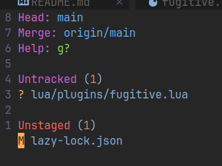

`:Flog` откроет окно с коммитами

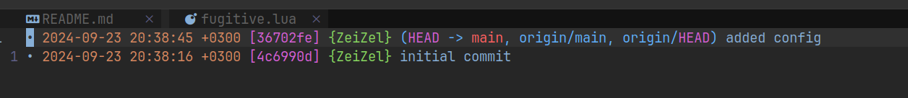

`:G push` - запушить изменения
`:G pull` - запулить изменения

#### LazyGit

Это плагин для отображения удобного интерфейса истории работы с гитом

Устанавливаем сначала саму утилиту:

```bash
brew install jesseduffield/lazygit/lazygit
```

Конфигурация lazygit:

`.config / lazygit / config.yml`

```YML
git:
  commit:
    signOff: true
quitOnTopLevelReturn: true
```

Далее устанавливаем плагин в neovim

`lua / plugins / lazygit.lua`

```lua
-- nvim v0.8.0
return {
  "kdheepak/lazygit.nvim",
  cmd = {
    "LazyGit",
    "LazyGitConfig",
    "LazyGitCurrentFile",
    "LazyGitFilter",
    "LazyGitFilterCurrentFile",
  },
  -- optional for floating window border decoration
  dependencies = {
    "nvim-lua/plenary.nvim",
  },
  -- setting the keybinding for LazyGit with 'keys' is recommended in
  -- order to load the plugin when the command is run for the first time
  keys = {
    { "<leader>lg", "<cmd>LazyGit<cr>", desc = "LazyGit" }
  }
}
```

И теперь на `<leader>lg` у нас открывается окошко с историей гита. Для перемещения по вкладкам, нужно использовать `1-4`. Для перемещения между табами вкладок `[`/`]`. Чтобы скроллить правую панель, нужно будет использовать `PgUp` и `PgDn`

`ctrl + ?` - откроет меню с подсказками для определённого окна, в котором мы сейчас находимся. Шорткаты будут отличаться в зависимости от активного окна, в котором мы работаем

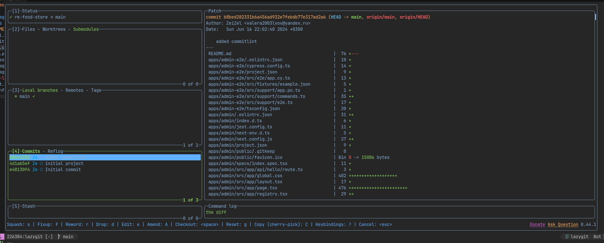

Через `/` можно запустить поиск по любому из окошек

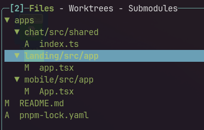

При открытии файла через enter из второго меню, мы можем определять, какие строки мы хотим стейджить, а какие нет через `space`. Переключение между вкладками на `Tab`

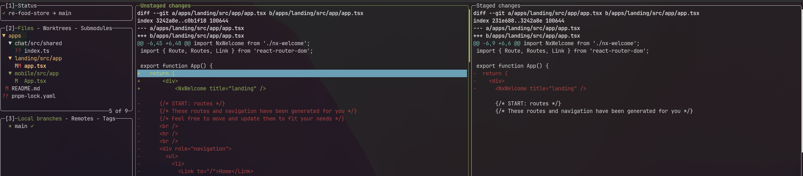

Через `a` мы можем застейджить всё, а через `c` открыть поле для создания коммита, где через `enter` создадим новый коммит

`P` - отправить коммит на удалённую репу

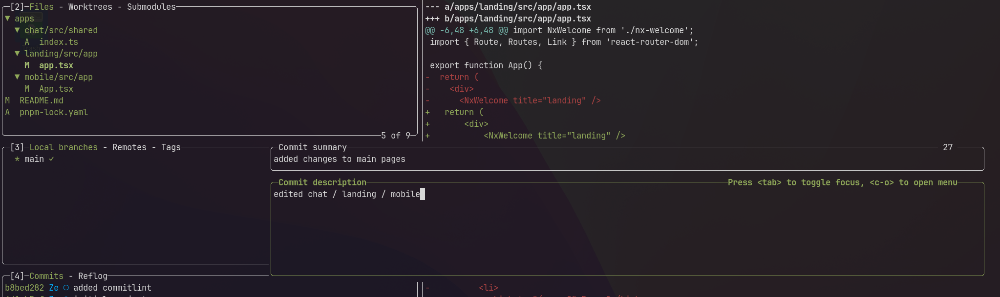

Во вкладке с ветками мы можем создавать новые ветки через `n` и переключаться по ним через `space`

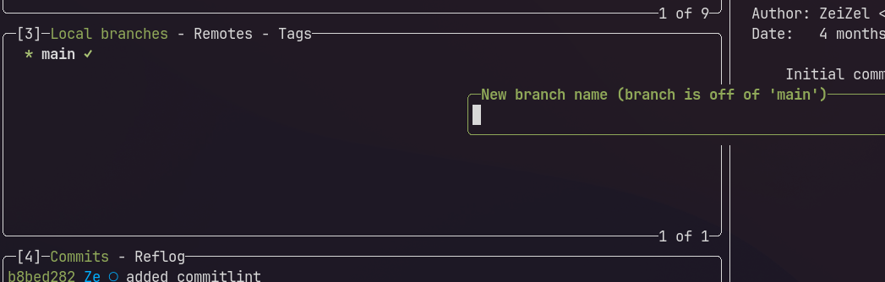

Так же через `enter` мы можем просмотреть все коммиты, которые были сделаны в этой ветке

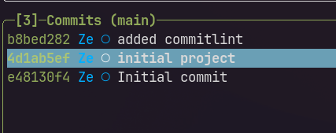

А уже дальше в 4 или 3 вкладке мы можем через `enter` взглянуть на измения, которые были сделаны в этом коммите

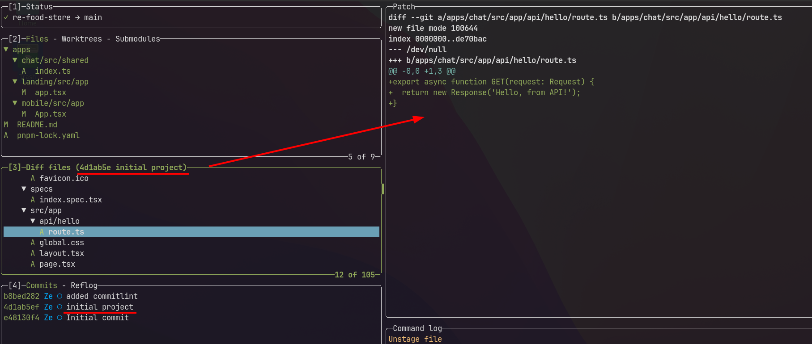

Через `M` мы смёрджим ветку, на которой мы находимся с целевой

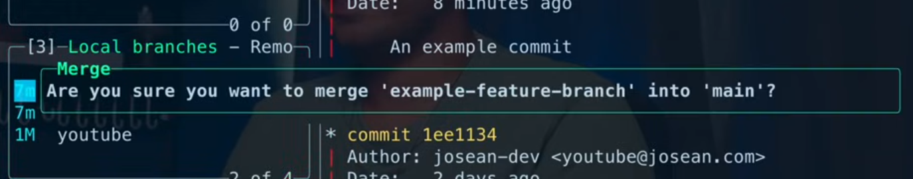

И если у нас есть конфликты, то утилита предложит их разрешить

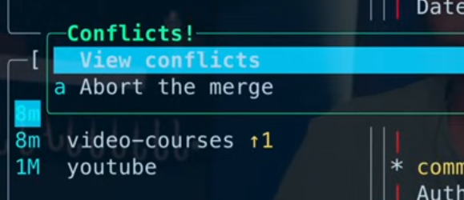

Через `space` выбираем нужный вариант, через `b` можем принять все изменения

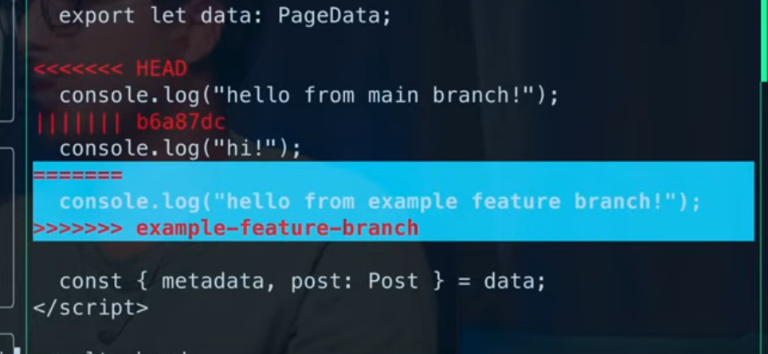

### Leap

Плагин Leap позволяет нам быстро перемещаться горизонтально и вертикально к определённому слову

`lua / plugins / leap.lua`

```lua
return {
	"ggandor/leap.nvim",
	lazy = false,
	config = function()
		require("leap").add_default_mappings(true)
	end,
}
```

`s` + `первые две буквы` - будет искать слово ниже нашего курсора и при нахождении вхождений подсветит возможные варианты, по которым мы сможем перейти после нажатия выделенной буквы

То же самое, но до курсора будет работать с `S`

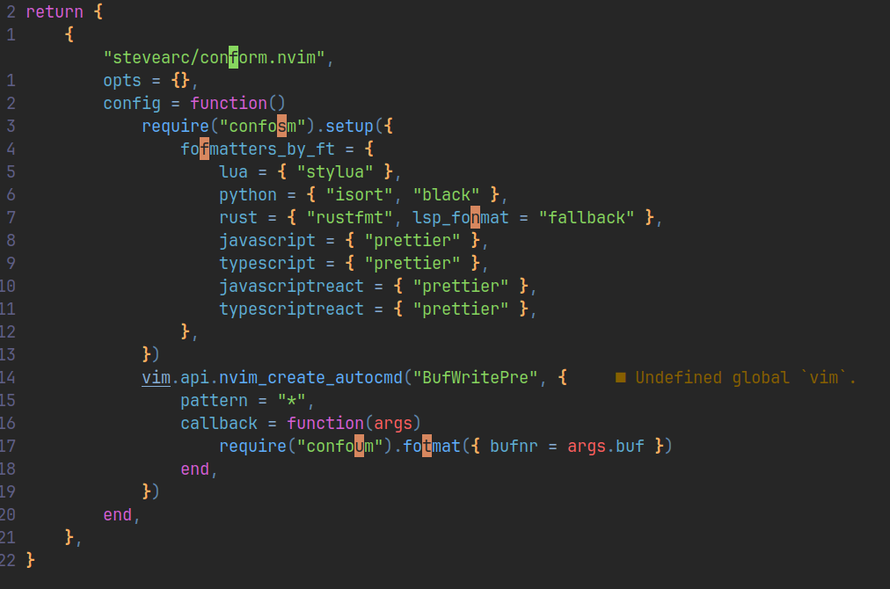

### Which key

Так же, чтобы не теряться в большом количестве сочетаний, которое присутствует в виме и его плагинах может помочь [WhichKey](https://github.com/folke/which-key.nvim), который активируется при нажатии клавиши без определения сочетания и выводит подсказку с доступными действиями по клавише

Просто нажали `leader`:

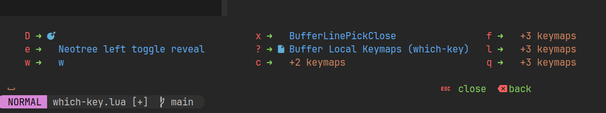

Просто нажали `g`:

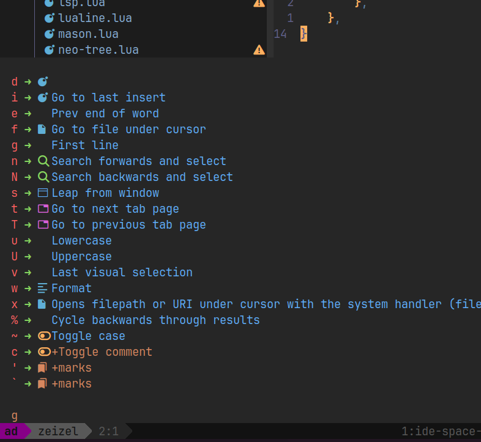

Чтобы добавить описание для сочетания из плагина, мы можем добавить параметр `desc`, в котором опишем его действие

`lua / plugins / lsp.lua`

```lua
vim.keymap.set("n", "<Leader>lr", vim.lsp.buf.rename, { buffer = ev.buf, desc = "Rename Symbol" })
```

### Несколько сборок NVim

Так же ничто не мешает нам использовать сразу несколько сборок NeoVim

Для этого механизма в NeoVim было реализовано открытие определённой папки с конфигурацией по переменной окружения. Например, тут будет открываться папка `nv` в качестве входной точки конфигурации

```bash
NVIM_APPNAME=nv nvim
```

Поэтому в файле конфигурации нашего терминала, мы можем сделать алиас на вызов определённой конфигурации

`.zshrc`

```bash
alias nv="NVIM_APPNAME=nv nvim"
```

А так же мы можем добавить окошко с выбором конфига по команде `nvims`, в котором будут отображены варианты наших сборок (в поле items)

`.zshrc`

```bash
function nvims() {
  items=("default" "nv" "nvlazy" "nvastro" "nvchad")
  config=$(printf "%s\n" "${items[@]}" | fzf --prompt=" Neovim Config  " --height=~50% --layout=reverse --border --exit-0)
  if [[ -z $config ]]; then
    echo "Nothing selected"
    return 0
  elif [[ $config == "default" ]]; then
    config=""
  fi
  NVIM_APPNAME=$config nvim $@
}
```

### Dashboard

Далее для красоты сборки остаётся только добавить startup экран, прям как у взрослых с помощью [dashboard-nvim](https://github.com/nvimdev/dashboard-nvim)

`lua / plugins / dashboard.lua`

```lua
return {
	"nvimdev/dashboard-nvim",
	event = "VimEnter",
	config = function()
		require("dashboard").setup({
			theme = "hyper",
			config = {
				week_header = {
					enable = true,
				},
				shortcut = {
					{ desc = "󰊳 Update", group = "@property", action = "Lazy update", key = "u" },
					{
						icon = " ",
						icon_hl = "@variable",
						desc = "Files",
						group = "Label",
						action = "Telescope find_files",
						key = "f",
					},
					{
						desc = " Menu",
						group = "DiagnosticHint",
						action = "Neotree left toggle reveal",
						key = "e",
					},
				},
			},
		})
	end,
	dependencies = { { "nvim-tree/nvim-web-devicons" } },
}
```

И теперь наш стартапчик будет выглядеть примерно таким образом:

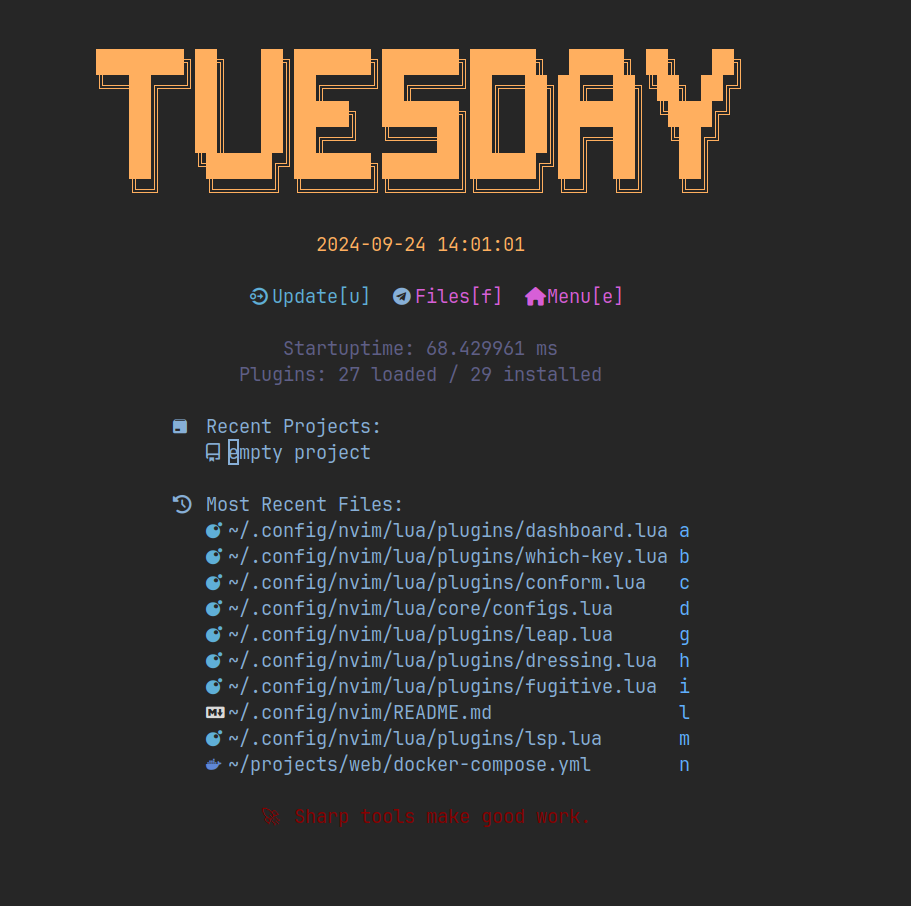

### Описание плагинов

1. Neotest - плагин для удобного запуска тестов в приложении

`leader` + `t` запускает множество команд для прогонки тестов

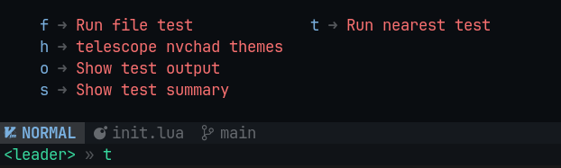

2. DAP - плагин для дебага приложения

Первым делом получаем сокет с активным дебагом от нашего приложения

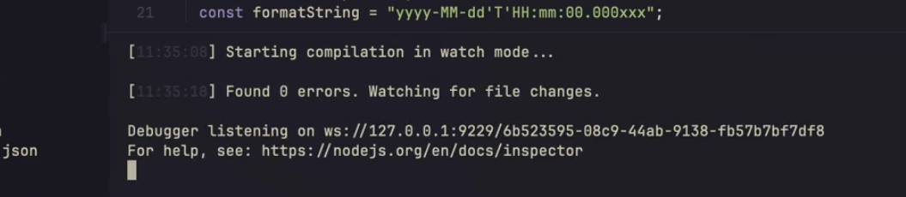

`leader` + `d` + `b` - ставим точку остановы

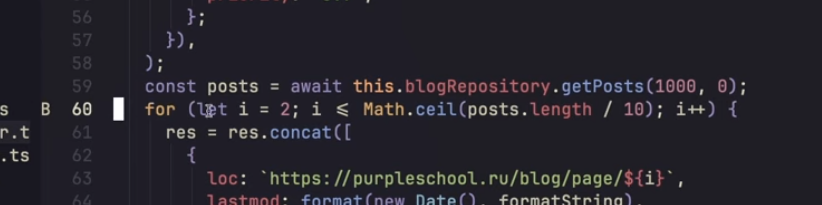

`leader` + `d` + `u` - открытие окна с дебагом
`leader` + `d` + `s` - запуск дебага

И когда выполнение кода дойдёт до точки, то окно заполнится нужными данными

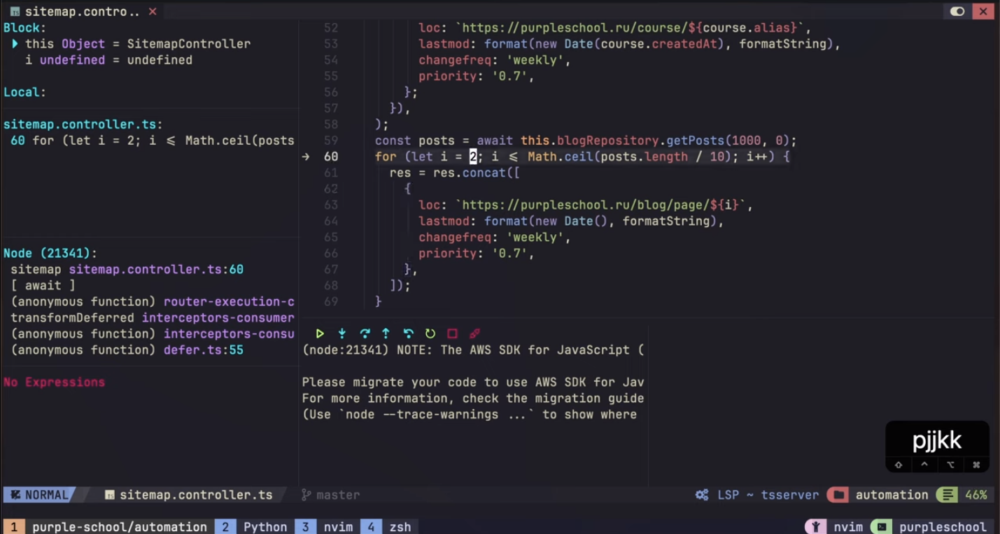

3. Lazydev - подсказка сигнатуры вызова метода и упрощение работы с LSP неовима

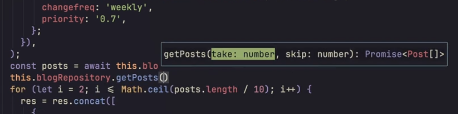

4. Diffview - показывает изменения между файлами для гита

`lead + g + f` - откроет историю изменений файла. Очень удобно смотреть на различные изменения файла в течение времени

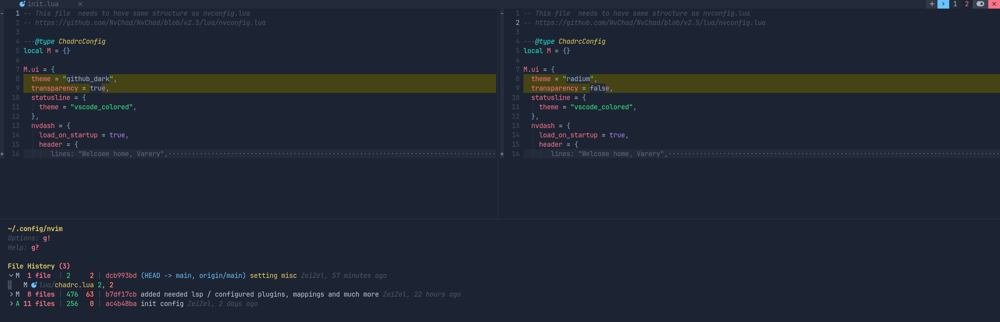

5. better-bqf

`g + f` - позволяет быстро найти все определения функции / метода в коде и удобно предоставляет список внизу с окошком

На `o` можно перейти на нужный референс

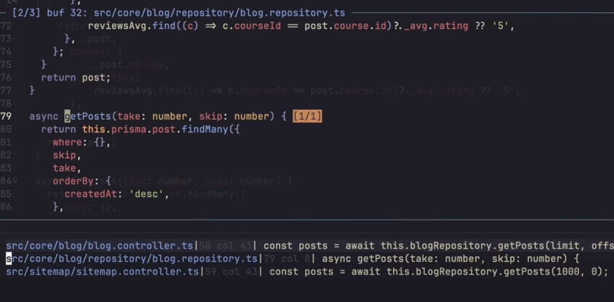

6. Todo Comments

Подсвечивает тудушки и остальные ключевые слова в проекте

`:TodoQuickFix`

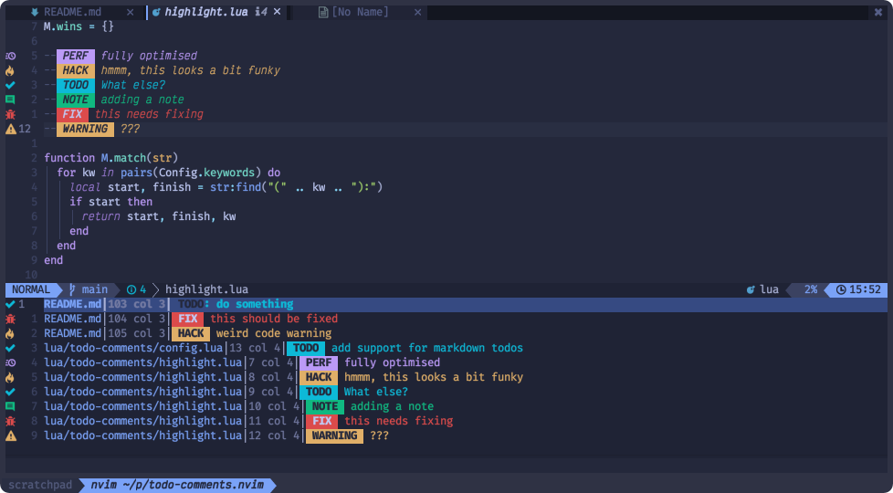


