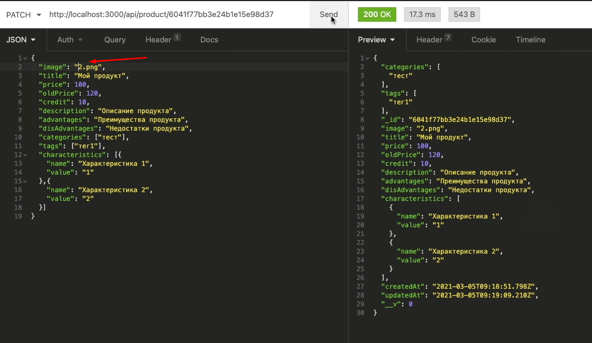
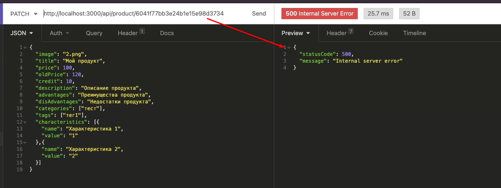
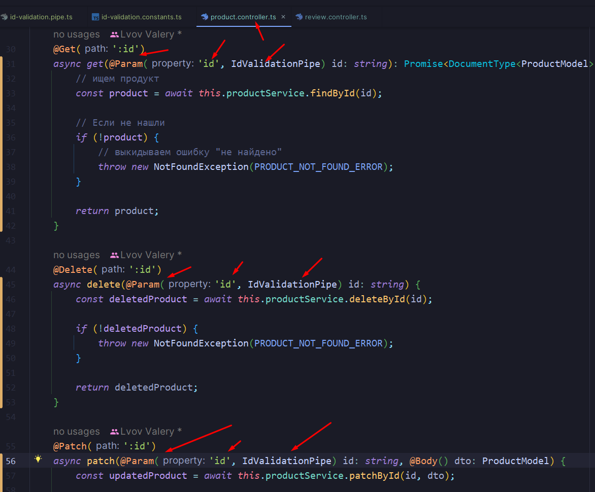
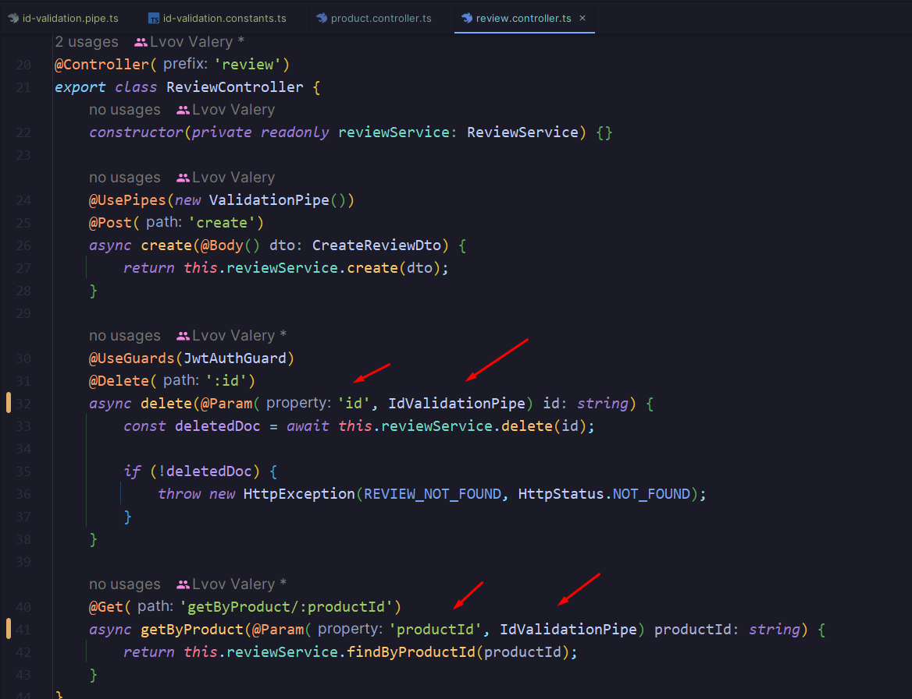
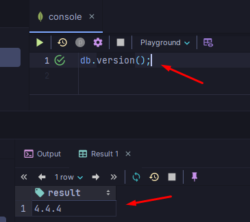
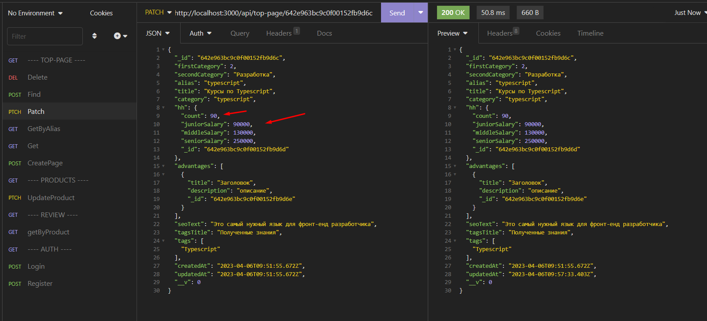
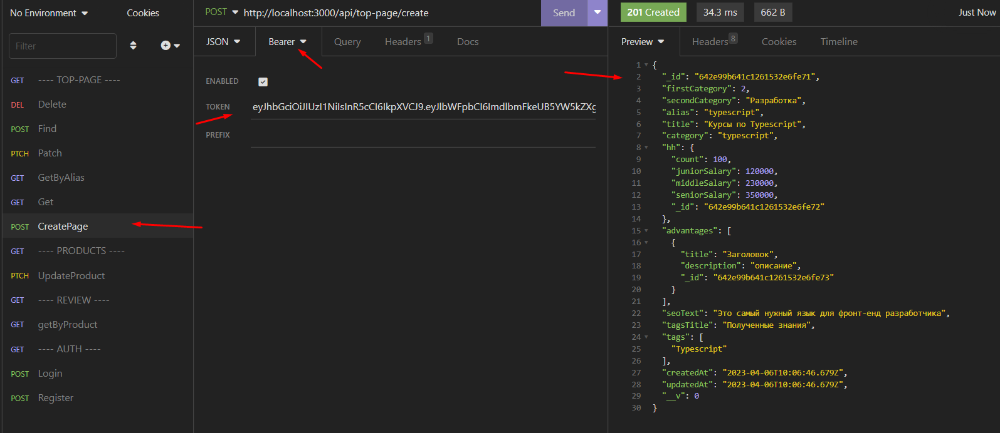

## 001 Агрегации в Mongo

Добавим в модуль продуткта сервис, который будет модифицировать данные в базе

```bash
nest g service product --no-spec
```

Создадим модель, которая опишет создание нового продукта

Тут так же работают декораторы:
- `@IsArray` - проверяет, является ли значение массивом
- `@IsOptional` - обозначает, что поле опциональное и не обязательное
- `@ValidateNested` - говорит, что нужно проводить сдвоенную проверку (самого поля и вложенного в него объекта)

`src > product > dto > create-product.dto.ts`
```TS
import { IsArray, IsNumber, IsOptional, IsString, ValidateNested } from 'class-validator';
import { Type } from 'class-transformer';

class ProductCharacteristicDto {
	@IsString()
	name: string;

	@IsString()
	value: string;
}

export class CreateProductDto {
	@IsString()
	image: string;

	@IsString()
	title: string;

	@IsNumber()
	price: number;

	@IsOptional()
	@IsNumber()
	oldPrice?: number;

	@IsNumber()
	credit: number;

	@IsString()
	description: string;

	@IsString()
	advantages: string;

	@IsString()
	disAdvantages: string;

	@IsArray()
	@IsString({ each: true }) // ожидаем массив, внутри которого каждый элемент является строкой
	categories: string[];

	@IsArray()
	@IsString({ each: true })
	tags: string[];

	@IsArray()
	@ValidateNested() // тут мы указываем, что декоратор должен протипизировать и  объект ProductCharacteristicDto
	@Type(() => ProductCharacteristicDto)
	characteristics: ProductCharacteristicDto[];
}
```

Типизируем модель поиска продукта по категории (категория продукта и лимит выведенных продуктов за раз)

`src > product > dto > find-product.dto.ts`
```TS
import { IsNumber, IsString } from 'class-validator';

export class FindProductDto {
	@IsString()
	category: string;

	@IsNumber()
	limit: number;
}
```

Далее модифицируем модель продукта и указываем, что `oldPrice` является опциональным полем (так как старой цены может и не быть)

`src > product > product.model.ts`
```TS
import { Base, TimeStamps } from '@typegoose/typegoose/lib/defaultClasses';
import { prop } from '@typegoose/typegoose';

class ProductCharacteristicDto {
	@prop()
	name: string;

	@prop()
	value: string;
}

export interface ProductModel extends Base {}

export class ProductModel extends TimeStamps {
	@prop()
	image: string;

	@prop()
	title: string;

	@prop()
	price: number;

	@prop()
	oldPrice?: number;

	@prop()
	credit: number;

	@prop()
	description: string;

	@prop()
	advantages: string;

	@prop()
	disAdvantages: string;

	@prop({ type: () => [String] })
	categories: string[];

	@prop({ type: () => [String] })
	tags: string[];

	@prop({
		type: () => [ProductCharacteristicDto], // типизируем запрос
		_id: false, // отключаем автоматическую генерацию id в массиве
	})
	characteristics: ProductCharacteristicDto[];
}
```

Далее в сервисе реализуем 4 метода:
- `create` - создание нового продукта
- `findById` - найти продукт по `id`
- `deleteById` - удаление продукта по `id`
- `patchById` - обновление продукта по `id`
- `findWithReviews` - найти продукт с обзорами (тут мы пишем агрегатную функцию для вывода продукта вместе с его обзорами)

Агрегация в Mongo нам нужна для тех целей, чтобы вывести сразу нужные нам продукты и обзоры, которые им принадлежат

Агрегация в Mongo представляет из себя пайплайны, которые содержат в себе наборы последовательных шагов для поиска данных 

Функции агрегации:
- `$addFields` - добавляем поля
- `$count` - рассчитываем что-либо
- `$limit` - ограничение поиска агрегации
- `$lookup` - подтягивание из одной коллекции в другую
- `$match` - позволяет ограничить выборку по сравниваемым полям (ищет совпадения)
- `$group` - позволяет сгруппировать поля
- `$project` - позволяет нам перегруппировать данные из одной проекции в другую (когда нам нужно будет поменять все поля)
- `$replaceWith` - замена полей
- `$skip` - позволяет пропустить ненужные данные
- `$sort` - сортировка
- `$sortByCount` - сортировка по числу
- `$unwind` - позволяет разбить массив элементов JSON на отдельные документы

`src > product > product.service.ts`
```TS
import { Injectable } from '@nestjs/common';
import { InjectModel } from 'nestjs-typegoose';
import { ProductModel } from './product.model';
import { ModelType } from '@typegoose/typegoose/lib/types';
import { CreateProductDto } from './dto/create-product.dto';
import { FindProductDto } from './dto/find-product.dto';
import { ReviewModel } from '../review/review.model';

@Injectable()
export class ProductService {
	constructor(
		@InjectModel(ProductModel) private readonly productModel: ModelType<ProductModel>,
	) {}

	async create(dto: CreateProductDto) {
		return this.productModel.create(dto);
	}

	async findById(id: string) {
		return this.productModel.findById(id).exec();
	}

	async deleteById(id: string) {
		return this.productModel.findByIdAndDelete(id).exec();
	}

	async patchById(id: string, dto: CreateProductDto) {
		return this.productModel
			.findByIdAndUpdate(id, dto, {
				new: true, // запрашиваем возврат не нового, а старого документа
			})
			.exec();
	}

	// это функция поиска нескольких продуктов вместе с его обзорами
	async findWithReviews(dto: FindProductDto) {
		return this.productModel
			.aggregate([
				// ищем только по подходящей категории
				{ $match: { categories: dto.category } },
				// устанавливаем стабильную сортировку, чтобы всегда возвращался список в одинаковой последовательности
				{ $sort: { _id: 1 } },
				// ограничиваем выборку товаров определённым лимитом
				{ $limit: dto.limit },
				// дальше нужно подтянуть данные из документа review
				{
					$lookup: {
						// откуда
						from: 'Review',
						// локальное поле для поиска (наш id)
						localField: '_id',
						// поле, в котором и будем искать (связанное поле id с нашим id)
						foreignField: 'productId',
						// псевдоним для поля, который выйдет в результате
						as: 'reviews',
					},
				},
				// далее добавляем недостающие поля
				{
					$addFields: {
						// число обзоров у продукта
						reviewCount: {
							// размер массива
							$size: '$reviews', // ссылаемся на сгенерированное поле через $lookup
						},
						// считаем средний рейтинг
						reviewAvg: {
							// считаем среднее значение
							$avg: '$reviews.rating', // обращаемся к полю, описанному в ReviewModel
						},
					},
				},
			])
			.exec();
	}
}
```

Далее в контроллере вызываем функции из сервиса:
- `get` - получение продукта по `id`
- `create` - создание нового продукта
- `delete` - удаление продукта
- `patch` - обновление продукта
- `find` - поиск продуктов по категориям

`src > product > product.controller.ts`
```TS
import {
	Controller,
	Delete,
	Get,
	NotFoundException,
	Param,
	Patch,
	Post,
	UsePipes,
	ValidationPipe,
} from '@nestjs/common';
import { Body, HttpCode } from '@nestjs/common/decorators';
import { ProductModel } from './product.model';
import { FindProductDto } from './dto/find-product.dto';
import { CreateProductDto } from './dto/create-product.dto';
import { ProductService } from './product.service';
import { PRODUCT_NOT_FOUND_ERROR } from './product.constants';
import { DocumentType } from '@typegoose/typegoose/lib/types';

@Controller('product')
export class ProductController {
	constructor(private readonly productService: ProductService) {}

	@Post('create')
	async create(@Body() dto: CreateProductDto) {
		return this.productService.create(dto);
	}

	@Get(':id')
	async get(@Param('id') id: string): Promise<DocumentType<ProductModel>> {
		// ищем продукт
		const product = await this.productService.findById(id);

		// Если не нашли
		if (!product) {
			// выкидываем ошибку "не найдено"
			throw new NotFoundException(PRODUCT_NOT_FOUND_ERROR);
		}

		return product;
	}

	@Delete(':id')
	async delete(@Param('id') id: string) {
		const deletedProduct = await this.productService.deleteById(id);

		if (!deletedProduct) {
			throw new NotFoundException(PRODUCT_NOT_FOUND_ERROR);
		}

		return deletedProduct;
	}

	@Patch(':id')
	async patch(@Param('id') id: string, @Body() dto: ProductModel) {
		const updatedProduct = await this.productService.patchById(id, dto);

		if (!updatedProduct) {
			throw new NotFoundException(PRODUCT_NOT_FOUND_ERROR);
		}

		return updatedProduct;
	}

	// это функция вывода сразу нескольких продуктов с обзорами
	@UsePipes(new ValidationPipe())
	@HttpCode(200)
	@Post('find')
	async find(@Body() dto: FindProductDto) {
		return this.productService.findWithReviews(dto);
	}
}
```

Константа сообщения ошибок продуктов

`src > product > product.constants.ts`
```TS
export const PRODUCT_NOT_FOUND_ERROR = 'Такого товара нет';
```

Создаём новый продукт


Обновление продукта



Удаление продукта по `id`


Обновление продукта с отсутствующим `id`


Добавление нового обзора


Поиск максимум трёх продуктов по тестовой категории


## 002 Пишем свой Pipe

Изначально, при отправке запроса на изменение данных (`PATCH`), мы получаем ошибку сервера, так как он пытается кастануть фейковую строку под реальный тип данных id монги 



Для исправления данной ситуации напишем Pipe, который будет экстендится от `PipeTransform` и возвращать нам значение только тогда, когда оно будет соответствовать `Types.ObjectId`, который и является типом `id` монги. В противном случае мы должны будем выкинуть ошибку.

Конкретно id в контроллер попадает в виде `@Param` (есть ещё `@Body`, `@Query` и кастомный тип), поэтому запрос мы обрабатываем только в том случае, если данные пришли к нам в `param` 

`id-validation.pipe.ts`
```TS
import { ArgumentMetadata, BadRequestException, Injectable, PipeTransform } from '@nestjs/common';
import { Types } from 'mongoose';
import { ID_VALIDATION_ERROR } from './id-validation.constants';

// создадим класс, который будет экстендится от трансформа пайпа
@Injectable() // для попадения в дерево зависимостей
export class IdValidationPipe implements PipeTransform {
	// далее реализуем метод трансформации
	// 1арг - сами данные, 2 - метаданные о том, где располагаются эти данные
	transform(value: string, metadata: ArgumentMetadata) {
		// данные обязательно должны приходить к нам из param
		if (metadata.type != 'param') {
			return value;
		}

		// далее нужно проверить значения на валидность
		// если значение не подходит под ObjectID
		if (!Types.ObjectId.isValid(value)) {
			throw new BadRequestException(ID_VALIDATION_ERROR);
		}

		return value;
	}
}
```

Тут будет храниться константа с ошибкой

`id-validation.constants.ts`
```TS
export const ID_VALIDATION_ERROR = 'Неверный формат id';
```

Далее нам остаётся просто передать Pipe вторым аргументом в декораторы, которые оборачивают нужный нам параметр

`src > product > product.controller.ts`


И так во всех файлах, где есть `id`, который требуется для передачу в монгу

`src > review > review.controller.ts`


И теперь на неверный формат записи `ObjectId` сервер будет возвращать правильную ошибку 


## 003 Функции в Mongo 4.4

Далее нужно реализовать функцию, которая будет сортировать обзоры внутри продукта

Функции работают в монге 4.4+. Проверить версию можно данной командой:



Напишем функцию, которая будет замещать столбец с продуктами новыми данными, которые будут представлять этот же массив, но отсортированный с помощью функции JS

`src > product > product.service.ts`
```TS
async findWithReviews(dto: FindProductDto) {
	return this.productModel
		.aggregate([
			{ $match: { categories: dto.category } },
			{ $sort: { _id: 1 } },
			{ $limit: dto.limit },
			{
				$lookup: {
					from: 'Review',
					localField: '_id',
					foreignField: 'productId',
					as: 'reviews',
				},
			},
			{
				$addFields: {
					reviewCount: {
						$size: '$reviews',
					},
					reviewAvg: {
						$avg: '$reviews.rating',
					},
					// перезапишем вышеописанное поле обзора
					reviews: {
						// вставим сюда функцию
						$function: {
							// тело функции
							body: `function (reviews) {
								reviews.sort(
									(a, b) => new Date(b.createdAt) - new Date(b.createdAt),
								);
								return reviews;
							}`,
							// описываем массив аргументов функции
							args: ['$reviews'],
							// язык, на котором написана функция
							lang: 'js',
						},
					},
				},
			},
		])
		.exec();
}
```


## 005 Сервис страниц

Типизируем модель, по которой мы будем создавать нашу новую страницу с курсом

`src > top-page > dto > create-top-page.dto.ts`
```TS
import { TopLevelCategory } from '../top-page.model';
import { IsArray, IsEnum, IsNumber, IsOptional, IsString, ValidateNested } from 'class-validator';
import { Type } from 'class-transformer';

export class HhDataDto {
	@IsNumber()
	count: number;

	@IsNumber()
	juniorSalary: number;

	@IsNumber()
	middleSalary: number;

	@IsNumber()
	seniorSalary: number;
}

export class TopPageAdvantagesDto {
	@IsString()
	title: string;

	@IsString()
	description: string;
}

export class CreateTopPageDto {
	@IsEnum(TopLevelCategory)
	firstCategory: TopLevelCategory;

	@IsString()
	secondCategory: string;

	@IsString()
	alias: string;

	@IsString()
	title: string;

	@IsString()
	category: string;

	@IsOptional()
	@ValidateNested()
	@Type(() => HhDataDto)
	hh?: HhDataDto;

	@IsArray()
	@ValidateNested()
	@Type(() => TopPageAdvantagesDto)
	advantages: TopPageAdvantagesDto[];

	@IsString()
	seoText: string;

	@IsString()
	tagsTitle: string;

	@IsArray()
	@IsString({ each: true })
	tags: string[];
}
```

Типизируем модель, по которой мы будем искать наши курсы (будет использоваться для поиска оглавлений курсов по категориям и выводу в менюшке поиска слева)

`src > top-page > dto > find-top-page.dto.ts`
```TS
import { TopLevelCategory } from '../top-page.model';
import { IsEnum } from 'class-validator';

export class FindTopPageDto {
	@IsEnum(TopLevelCategory)
	firstCategory: TopLevelCategory;
}
```

Далее создаём сервис, который будет реализовывать логику взаимодействия с данными из базы данных

`src > top-page > top-page.service.ts`
```TS
import { Injectable } from '@nestjs/common';
import { TopLevelCategory, TopPageModel } from './top-page.model';
import { InjectModel } from 'nestjs-typegoose';
import { ModelType } from '@typegoose/typegoose/lib/types';
import { CreateTopPageDto } from './dto/create-top-page.dto';

@Injectable()
export class TopPageService {
	constructor(
		@InjectModel(TopPageModel) private readonly topPageModel: ModelType<TopPageModel>,
	) {}

	async create(dto: CreateTopPageDto) {
		return this.topPageModel.create(dto);
	}

	async findById(id: string) {
		return this.topPageModel.findById(id).exec();
	}

	async findByAlias(alias: string) {
		return this.topPageModel.findOne({ alias }).exec();
	}

	// тут мы ищем страницы, которые подпадают под нужную категорию
	async findByCategory(firstCategory: TopLevelCategory) {
		return this.topPageModel
			.find(
				// указываем, по какому полю искать
				{ firstCategory },
				// указываем, какие поля хотим достать из базы (1 - это достать)
				{ alias: 1, secondCategory: 1, title: 1 },
			)
			.exec();
	}

	async deleteById(id: string) {
		return this.topPageModel.findByIdAndDelete(id).exec();
	}

	async updateById(id: string, dto: CreateTopPageDto) {
		return this.topPageModel.findByIdAndUpdate(id, dto, { new: true }).exec();
	}
}
```

Тут описываем логику получения данных с клиента и вызываем методы из сервиса

`src > top-page > top-page.controller.ts`
```TS
import {
	Controller,
	Delete,
	Get,
	NotFoundException,
	Param,
	Patch,
	Post,
	UseGuards,
	UsePipes,
	ValidationPipe,
} from '@nestjs/common';
import { Body, HttpCode } from '@nestjs/common/decorators';
import { FindTopPageDto } from './dto/find-top-page.dto';
import { TopPageService } from './top-page.service';
import { CreateTopPageDto } from './dto/create-top-page.dto';
import { IdValidationPipe } from '../pipes/id-validation.pipe';
import { NOT_FOUND_TOP_PAGE_ERROR } from './top-page.constants';
import { JwtAuthGuard } from '../auth/guards/jwt.guard';

@Controller('top-page')
export class TopPageController {
	constructor(private readonly topPageService: TopPageService) {}

	@UseGuards(JwtAuthGuard)
	@Post('create')
	async create(@Body() dto: CreateTopPageDto) {
		return this.topPageService.create(dto);
	}

	@UseGuards(JwtAuthGuard)
	@Get(':id')
	async get(@Param('id', IdValidationPipe) id: string) {
		const page = this.topPageService.findById(id);

		if (!page) {
			throw new NotFoundException(NOT_FOUND_TOP_PAGE_ERROR);
		}

		return page;
	}

	@Get('byAlias/:alias')
	async getByAlias(@Param('alias') alias: string) {
		const page = this.topPageService.findByAlias(alias);

		if (!page) {
			throw new NotFoundException(NOT_FOUND_TOP_PAGE_ERROR);
		}

		return page;
	}

	@UseGuards(JwtAuthGuard)
	@Delete(':id')
	async delete(@Param('id', IdValidationPipe) id: string) {
		const deletedPage = this.topPageService.deleteById(id);

		if (!deletedPage) {
			throw new NotFoundException(NOT_FOUND_TOP_PAGE_ERROR);
		}

		// можно опустить return и тут будет возвращаться просто 200
	}

	@UseGuards(JwtAuthGuard)
	@Patch(':id')
	async patch(@Param('id', IdValidationPipe) id: string, @Body() dto: CreateTopPageDto) {
		const updatedPage = this.topPageService.updateById(id, dto);

		if (!updatedPage) {
			throw new NotFoundException(NOT_FOUND_TOP_PAGE_ERROR);
		}

		return updatedPage;
	}

	@UsePipes(new ValidationPipe())
	@HttpCode(200)
	@Post('find')
	async find(@Body() dto: FindTopPageDto) {
		return this.topPageService.findByCategory(dto.firstCategory);
	}
}
```

Константа с ошибкой при не найденной странице

`src > top-page > top-page.constants.ts`
```TS
export const NOT_FOUND_TOP_PAGE_ERROR = 'Страница с таким id не найдена';
```

Тут мы создаём новый курс


Тут мы получаем курс по `id`


Тут мы получаем курс по его алиасу


Тут мы создаём новый продукт с курсами



При поиске по категории, мы получаем массив с объектами наших страничек (данные для списка меню слева, которые будут вести на страницы с продуктами)


При удалении мы получаем статус ОК


> Обычно после теста работы АПИ уже можно будет и добавить гуард (`@UseGuards(JwtAuthGuard)`) на авторизацию для запросов

И теперь наши запросы на приватные роуты без авторизации недоступны


Поэтому сейчас получаем токен при логине. Далее можно добавить в хедер токен нашего залогиненого пользователя 


А с токеном в запросе доступны


