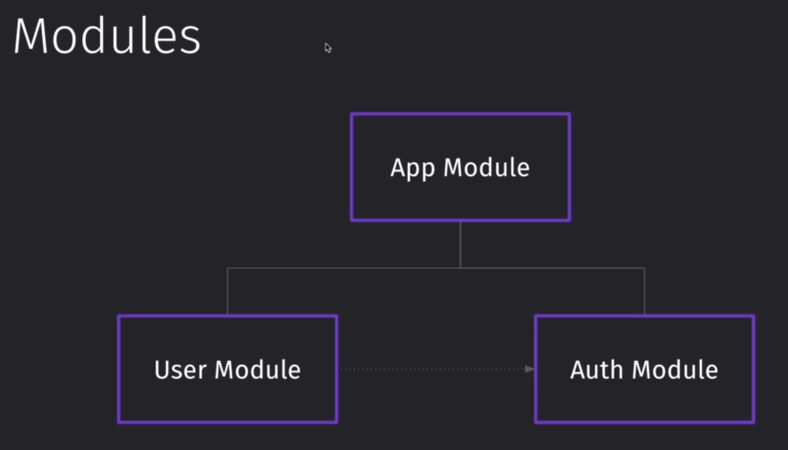
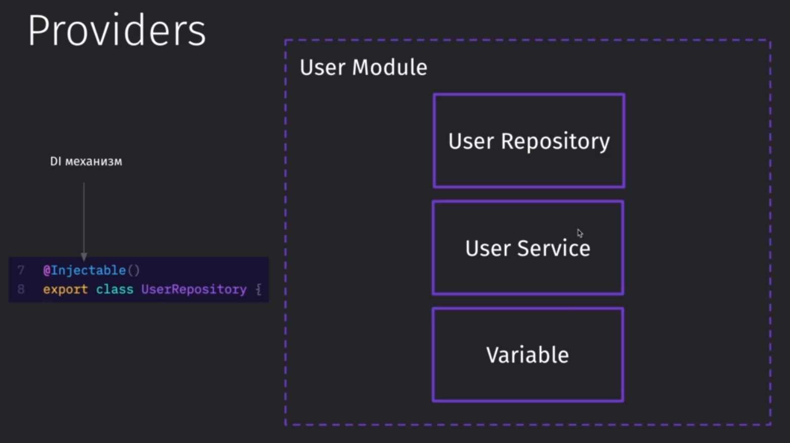
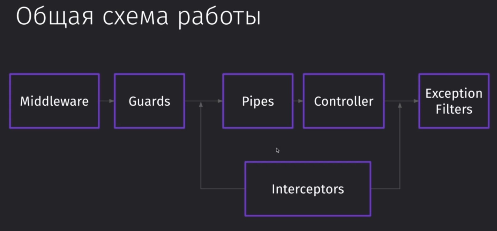
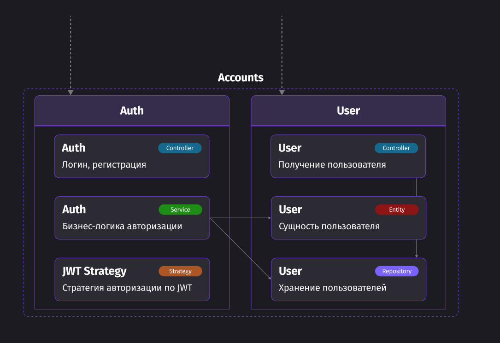
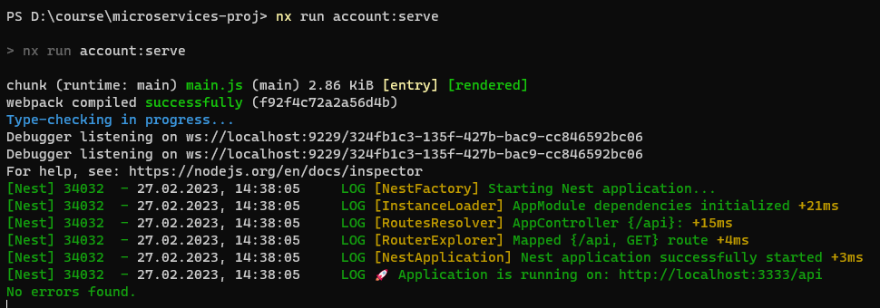
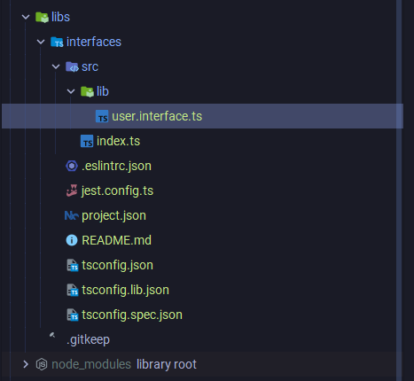
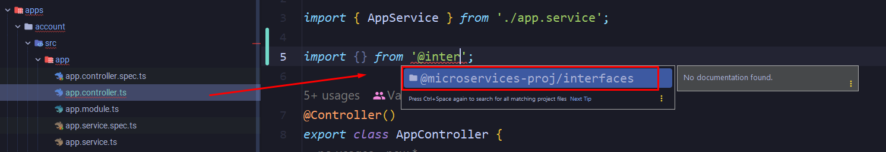
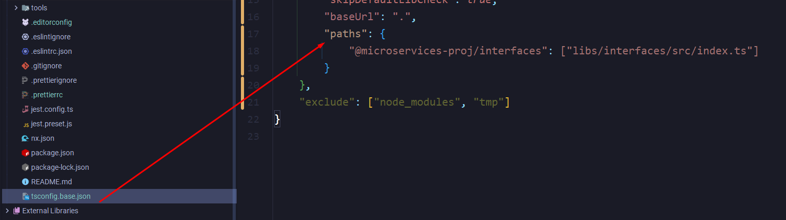
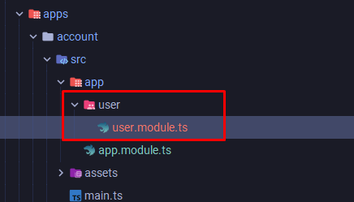
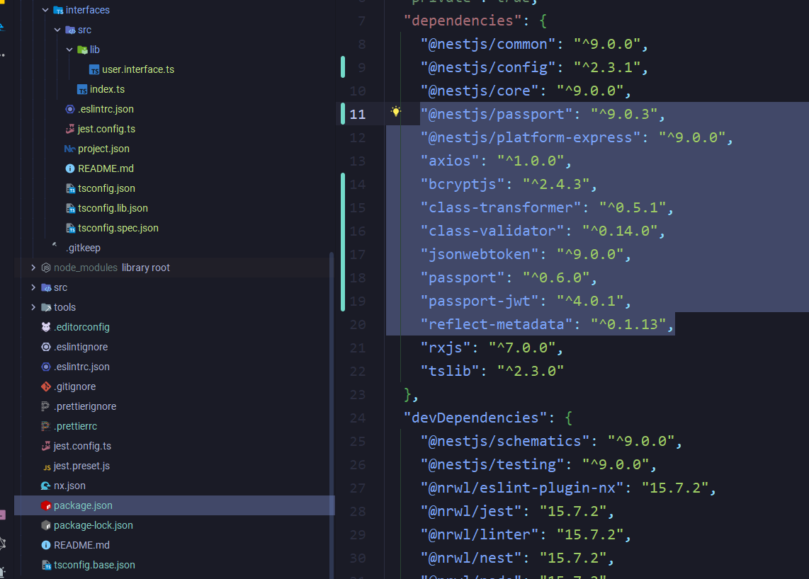

## 19 - Монорепозиторий или нет

Монорепозиторий - это репозиторий сразу для нескольких проектов.
Зачастую, такой подход используется, когда у нас не более 12 микросервисов

Плюсы:
- Переиспользование уже написанного кода, так как все сервисы находятся в одном месте
- Удобная работа с контрактами
- Удобно можно настроить все пайплайны и зависимости сборки проекта (больше плюс для DevOps-инжинера)

Минусы:
- Огромные объёмы проекта, что тормозит работу IDE
- Централизует все зависимости, что при переходе на новую версию того же NextJS или другого модуля создаст проблемы с обновлением
- Ограничение используемых языков

Чтобы получить все преимущества микросервисов, пользоваться монорепозиторием нельзя, но если нужно быстро билдить приложение и проще им управляться, то можно хранить все сервисы в одном репозитории.

Однако монорепозитории хорошо использовать, когда у нас мало сервисов, они написаны на одном языке и у нас много различных контрактов, чтобы использовать их между микросервисами. 


Самые популярные утилиты для работы с монорепозиториями:
- NX
- Lerna
- npm (выбираем по умолчанию, если проект не имеет сложной архитектуры и имеет один фронт)
- turborepo
- rush


`NX`:
- Очень легко с ним работать 
- Очень удобные инструменты, которые позволяют локально запустить сразу несколько сервисов
- Имеет свой взгляд на работу с сервисами (имеет свои определённые модули для сборки определённых фреймворков и свои правила) - ==Webpack==
- Работает сугубо на базе ==TS==

`Lerna`: 
- Позволяет работать с любым сборщиком, с которым мы хотим работать

`NX` не даст нам в монорепозитории использовать несколько разных версий того же `NextJS`. Если нам нужно поменяться на более новую версию, то тут уже нужно будет обновить весь проект. Другими словами, мы должны поддерживать единый скоуп зависимостей и поддерживать чистоту кода.


## 20 - Обзор NestJS

Компоненты, которые мы имеем в несте:
- `Modules` - это строительные блоки в приложении, которые агрегируют в себе определённую логику
- `Controllers` - это обработчики внешних событий
- `Providers` - это компонент, который обеспечивает доступ приложения к внешним источникам данных (БД)
- `Middleware` - это посредник, который внедряется в процесс запроса и обогащает функциональность
- `Exception filters`
- `Pipes`
- `Guards`
- `Interceptors`


Модули могут быть включены в другие модули

Модуль - это класс с декоратором модуля, который позволяет описать внутри этого декоратора все провайдеры, контроллеры, модули и другие зависимости, что он экспортирует



Все точки входа в приложение - это контроллеры, которые триггерят выполнение определённых операций

Так как контроллер - это входная точка в модуль, то его переиспользование в других модулях - невозможно

Декоратор `@Controller()` помечает класс как контроллер, а так же выполняет DI-функцию 


Правильный подход к работе с БД заключается в описании работы с репозиторием через класс и подключение этого класса через декоратор в категорию провайдеров

Так же благодаря тому, что мы работаем с модулями, мы можем использовать репозитории и в других модулях просто экспортируя их

Декоратор `@Injectable()` обеспечит добавление класса в категорию провайдеров



Общая схема работы запроса выглядит подобным образом:
- `Middleware` - первый принимает в себя запрос и он может обрабатывать его, валидировать и так далее
- `Guards` - это ограничитель, который зачастую используется для авторизации всех запросов с клиента (проверка валидности JWT, делать проверку аутентификации и так далее). Так же в гуарде можно произвести проверку на наличие соответствующего доступа у пользователя. По сути они могут ограничивать те или иные роуты для пользователя
- `Interceptors` - внедряются до или после контроллеров, обрабатывая запросы
- `Pipes` - занимаются преобразованием запросов (например, может валидировать по декораторам то, что нам прислали)
- `Controller` - сама наша конечная точка, вокруг которой построена данная архитектура
- `Exception Filters` - обрабатывает все входящие ошибки из контроллера



Так же для реализации общения приложения с БД будет использоваться паттерн репозитория. 

У неста имеется модуль `nestjs-mongoose`, который позволяет описать модели в виде классов с декораторами. Эту схему можно будет с помощью декоратора `@InjectModel` добавить в репозиторий и на выходе мы получим модель, с которой будет работать репозиторий

Паттерн же говорит нам, что для каждой такой модели должен быть свой репозиторий со своей входной точкой, с которой мы будем взаимодействовать. Мы не будем напрямую ходить в модель - мы будем ходить только в репозиторий этой модели


Паттерн `Entity` говорит нам, чтобы мы использовали для общения между контроллером и репозиторием не какой-то конкретный объект по интерфейсу, а отдельную сущность в виде класса. Эта сущность будет повторять модель репозитория и будет содержать в себе определённую бизнес-логику


И примерно так будет выглядеть наш микросервис по работе с аутентификацией:



## 21 - Код Настраиваем nx monorepo

Первым делом нужно установить сам nx и cli неста

```bash
npm i -g nx @nestjs/cli
```

Далее нужно создать проект с микросервисами. Ему сразу можно задать пресет той технологии, что мы будем использовать.

```bash
npx create-nx-workspace microservices-proj --preset=nest
```

И далее мы получаем структуру, где у нас в корне проекта находятся:
- все глобальные файлы стилей / базовый тсконфиг (от него экстендятся все остальные конфиги) / все тесты
- папка `apps`, которая хранит все микросервисы приложения
- папка `libs`, которая хранит переиспользуемые данные для приложения 


Так же имеется плагин NX console, который позволит сразу запускать все команды из `nx.json`


И тут нужно сразу сказать, что при использовании nx'a мы не теряем возможность пользоваться CLI'ками других модулей (тем же нестовским cli) - всё это у нас остаётся


Так выглядит запуск сёрвинга проекта:



Всё, что мы можем переиспользовать должно находиться в библиотеках.

```bash
nx g @nx/nest:lib interfaces
```

`libs / interfaces / src / lib / user.interface.ts`
```TS
export interface IUser {  
 name: string;  
}
```

`libs / interfaces / src / index.ts`
```TS
export * from './lib/user.interface';
```

Так выглядит структура созданной библиотеки:



И теперь мы можем спокойно импортировать из библиотеки любой модуль в любой микросервис нашего приложения



Происходит это потому, что в нашем базовом тсконфиге добавляется автоматически строчка, которая создаёт алиасы для нашего пути



И далее нам нужно создать модули, сервисы и контроллеры для отдельных частей приложения аккаунтов:

```bash
nx g @nx/nest:module --name=user --directory=./apps/account/src/app
nx g @nx/nest:service --name=user --directory=./apps/account/src/app

nx g @nx/nest:module --name=auth --directory=./apps/account/src/app
nx g @nx/nest:controller --name=auth --directory=./apps/account/src/app
nx g @nx/nest:service --name=auth --directory=./apps/account/src/app
```




И установим зависимости для подключения аутентификации в проект и валидации:

```bash
npm i mongoose @nestjs/mongoose bcryptjs jsonwebtoken passport passport-jwt @nestjs/passport @nestjs/config class-transformer class-validator

npm i -D @types/bcryptjs
```

Все те зависимости, что мы указали выше - устанавливаются глобально для всего проекта 



## 22 - Код Создаём модели

Для начала создадим папку с нашими `env` файлами `envs`. В ней нужно будет создать `envs/account.env`. Тут у нас будут храниться данные для подключения к базе.

Далее нам нужно написать конфиг для подключения к базе данных

`apps / account / src / app / configs / mongo.config.ts`
```TS
import { ConfigModule, ConfigService } from '@nestjs/config';  
import { MongooseModuleAsyncOptions } from '@nestjs/mongoose';  

/**
 * Конфигурация для асинхронного подключения монги к несту
 */
export const getMongoConfig = (): MongooseModuleAsyncOptions => {  
    return {  
       useFactory: (configService: ConfigService) => ({  
          uri: getMongoString(configService),  
       }),       inject: [ConfigService],  
       imports: [ConfigModule],  
    };  
};  

/** строка подключения к монге */
const getMongoString = (configService: ConfigService) =>  
    'mongodb://' +  
    configService.get('MONGO_LOGIN') +  
    ':' +    configService.get('MONGO_PASSWORD') +  
    '@' +    configService.get('MONGO_HOST') +  
    ':' +    configService.get('MONGO_PORT') +  
    '/' +    configService.get('MONGO_DATABASE') +  
    '?authSource=' +    configService.get('MONGO_AUTHDATABASE');
```

Тут мы должны подключить наши модули и в частности `ConfigModule`, который должен прокидываться внутрь всех импортов (для доступа модулей к конфигу приложения) и `MongooseModule` для подключения монги

`apps / account / src / app / configs / mongo.config.ts`
```TS
import { Module } from '@nestjs/common';  
  
import { AppController } from './app.controller';  
import { AppService } from './app.service';  
import { UserModule } from './user/user.module';  
import { AuthModule } from './auth/auth.module';  
import { ConfigModule } from '@nestjs/config';  
import { MongooseModule } from '@nestjs/mongoose';  
import { getMongoConfig } from './configs/mongo.config';  
  
@Module({
	imports: [  
       ConfigModule.forRoot({  
          isGlobal: true,  
          envFilePath: 'envs/account.env',  
       }),       
       MongooseModule.forRootAsync(getMongoConfig()),  
       UserModule,  
       AuthModule,  
    ],
    controllers: [AppController],
    providers: [AppService],  
})  
export class AppModule {}
```

Интерфейсы пользователя, которые будут распространены по проекту благодаря их нахождению в папке `lib`

`lib / interfaces / src / lib / user.interface.ts`
```TS
export enum EUserRole {  
    TEACHER = 'teacher',  
    STUDENT = 'student',  
}  
  
export enum EPurchaseState {  
    STARTED = 'started',  
    WAITING_FOR_PAYMENT = 'waiting_for_payment',  
    PURCHASED = 'purchased',  
    CANCELED = 'canceled',  
}  
  
export interface IUser {  
    _id?: string;  
    displayName?: string;  
    email: string;  
    passwordHash: string;  
    role: EUserRole;  
    courses?: IUserCourses[];  
}  
  
export interface IUserCourses {  
    courseId: string;  
    purchaseState: EPurchaseState;  
}
```

Тут находится класс, который представляет собой модель данных пользователя находящегося в базе монги

`apps / account / src / app / user / models / user.model.ts`
```TS
import { Document, Types } from 'mongoose';  
import { Prop, Schema, SchemaFactory } from '@nestjs/mongoose';  
import { IUser, IUserCourses, EPurchaseState, EUserRole } from '@/interfaces';  
  
/**  
 * Курс аккаунта * */
@Schema()  
export class UserCourses extends Document implements IUserCourses {  
    @Prop({ required: true })  
    courseId: string;  
  
    @Prop({ required: true, enum: EPurchaseState, type: String })  
    purchaseState: EPurchaseState;  
}  
  
/**  
 * Сгенерированная модель монгуза * */
export const UserCoursesSchema = SchemaFactory.createForClass(UserCourses);  
  
/**  
 * Модель аккаунта пользователя * */
@Schema()  
export class User extends Document implements IUser {  
    @Prop()  
    displayName?: string;  
  
    @Prop({ required: true })  
    email: string;  
  
    @Prop({ required: true })  
    passwordHash: string;  
  
    @Prop({  
       /** требуется */  
       required: true,  
       /** тип данных */  
       type: String,  
       /** возможные значения */  
       enum: EUserRole,  
       /** дефолтное значение */  
       default: EUserRole.STUDENT,  
    })    role: EUserRole;  
  
    @Prop({ type: [UserCoursesSchema], _id: false })  
    courses: Types.Array<UserCourses>;  
}  
  
/**  
 * Экспортируем схему монгуза * */export const UserSchema = SchemaFactory.createForClass(User);
```

Далее нужно создать сущность пользователя, которая сможет выполнять определённые действия над данными самого этого пользователя. 

Сущность выполняет роль **хранилища основных операций над данными пользователя**

`apps / account / src / app / user / entities / user.entity.ts`
```TS
import { EUserRole, IUser, IUserCourses } from '@/interfaces';  
import { compare, genSalt, hash } from 'bcryptjs';  
  
/**  
 * Класс сущности пользователя, который предоставляет методы манипуляции над аккаунтом * */ 
export class UserEntity implements IUser {  
    _id?: string;  
    displayName?: string;  
    email: string;  
    passwordHash: string;  
    role: EUserRole;  
    courses?: IUserCourses[];  
  
    constructor({ _id, courses, displayName, role, email, passwordHash }: IUser) {  
       this._id = _id;  
       this.displayName = displayName;  
       this.email = email;  
       this.passwordHash = passwordHash;  
       this.role = role;  
       this.courses = courses;  
    }  
  
    public async setPassword(password: string) {  
       const salt = await genSalt(10);  
       this.passwordHash = await hash(password, salt);  
  
       return this;  
    }  
  
    public validatePassword(password: string) {  
       return compare(password, this.passwordHash);  
    }  
}
```

Далее нужно реализовать инжектируемый класс репозитория. Репозиторий работает чисто только с базой данных.

Так как это кастомная сущность, то впоследствии её нужно будет добавить в модуль пользователя.

`apps / account / src / app / user / repositories / user.repository.ts`
```TS
import { InjectModel } from '@nestjs/mongoose';  
import { User } from '../models/user.model';  
import { Model } from 'mongoose';  
import { Injectable } from '@nestjs/common';  
import { UserEntity } from '../entities/user.entity';  
  
/**  
 * Класс для работы с базой данных и манипуляции над пользователями * 
 * */
@Injectable()  
export class UserRepository {  
    constructor(@InjectModel(User.name) private readonly userModel: Model<User>) {}  
  
    async createUser(user: UserEntity) {  
       const newUser = new this.userModel(user);  
       return newUser.save();  
    }  
  
    async updateUser({ _id, ...rest }: UserEntity) {  
       return (  
          this.userModel  
             .updateOne({ _id }, { $set: { ...rest } })  
             /** exec нужен для формирования запроса - без него не всегда может вернуться результат из mongo */  
             .exec()  
       );  
    }  
  
    async findUser(email: string) {  
       return this.userModel.findOne({ email }).exec();  
    }  
  
    async findUserById(id: string) {  
       return this.userModel.findById(id).exec();  
    }  
  
    async deleteUser(email: string) {  
       this.userModel.deleteOne({ email }).exec();  
    }  
}
```

И уже тут финально подключаем все сущности к модулю самого пользователя

`apps / account / src / app / user / user.module.ts`
```TS
import { Module } from '@nestjs/common';  
import { UserService } from './user.service';  
import { MongooseModule } from '@nestjs/mongoose';  
import { User, UserSchema } from './models/user.model';  
import { UserRepository } from './repositories/user.repository';  
  
@Module({  
    /**  
     * Тут мы добавляем модели монги из папки models     * */    imports: [MongooseModule.forFeature([{ name: User.name, schema: UserSchema }])],  
    providers: [UserService, UserRepository],  
})  
export class UserModule {}
```


## 23 - Код Реализуем авторизацию


## 24 - Код Запускаем проект


