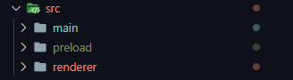
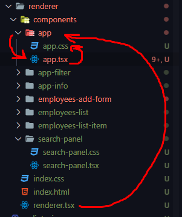
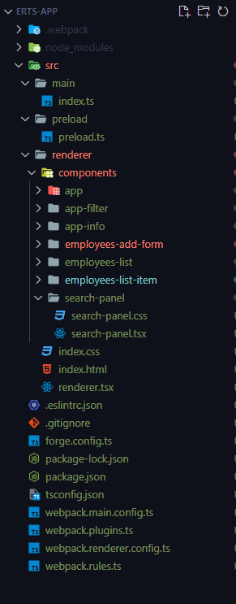

## Создание React + TypeScript приложения

Первым делом нужно установить нужные библиотеки для нашего приложения

```bash
npm init electron-app@latest <имя_проекта> -- --template=webpack-typescript
npm install --save react react-dom
npm install --save-dev @types/react @types/react-dom
```

Тут подключается бутстрап и иконочные стили

```bash
npm install --save bootstrap
npm i font-awesome --save
```

Если мы хотим реализовать такую структуру папок



То нам нужно поменять пути в основном конфиге

`forge.config.ts`
```TS
const config: ForgeConfig = {
	packagerConfig: {},
	rebuildConfig: {},
	makers: [
		new MakerSquirrel({}),
		new MakerZIP({}, ["darwin"]),
		new MakerRpm({}),
		new MakerDeb({}),
	],
	plugins: [
		new WebpackPlugin({
			mainConfig,
			renderer: {
				config: rendererConfig,
				entryPoints: [
					{
						html: "./src/renderer/index.html",
						js: "./src/renderer/renderer.tsx",
						name: "main_window",
						preload: {
							js: "./src/preload/preload.ts",
						},
					},
				],
			},
		}),
	],
};
```

И так же поменять тут входную точку в мэйн процесс

`webpack.main.config.ts`
```TS
export const mainConfig: Configuration = {
	/**
	 * This is the main entry point for your application, it's the first file
	 * that runs in the main process.
	 */
	entry: "./src/main/index.ts",
	// Put your normal webpack config below here
	module: {
		rules,
	},
	resolve: {
		extensions: [".js", ".ts", ".jsx", ".tsx", ".css", ".json"],
	},
};
```

Так выглядит основной документ

`renderer > index.html`
```HTML
<!DOCTYPE html>
<html lang="en">

<head>
	<meta charset="UTF-8">
	<meta http-equiv="X-UA-Compatible" content="IE=edge">
	<meta name="viewport" content="width=device-width, initial-scale=1" />
	<meta name="theme-color" content="#000000" />
	<title>Electron React Typescript App</title>

</head>

<body>
	<noscript>You need to enable JavaScript to run this app.</noscript>
	<div class="root" id="root"></div>
</body>

</html>
```

Это файл стилей, который подключен к основной странице

```CSS
body {
	margin: 50px 0;
	padding: 20px;
	font-family: -apple-system, BlinkMacSystemFont, "Segoe UI", "Roboto",
		"Oxygen", "Ubuntu", "Cantarell", "Fira Sans", "Droid Sans",
		"Helvetica Neue", sans-serif;
	-webkit-font-smoothing: antialiased;
	-moz-osx-font-smoothing: grayscale;
}

code {
	font-family: source-code-pro, Menlo, Monaco, Consolas, "Courier New",
		monospace;
}
```

Так выглядит основной файл ==React==

`renderer > renderer.tsx`
```TSX
import React, { StrictMode } from "react";
import ReactDOM from "react-dom/client";
// тут подключаются стили
import "./index.css";
// тут подключается сторонний компонент реакта
import App from "./components/app/app";
// подключаем нужные файлики из наших библиотек иконочных шрифтов и бутстрапа
import '../../node_modules/bootstrap/dist/css/bootstrap.min.css';
import '../../node_modules/font-awesome/css/font-awesome.css';

const root: ReactDOM.Root = ReactDOM.createRoot(document.getElementById("root"));
root.render(
	<StrictMode>
		<App />
	</StrictMode>
);
```

Примерно такие пути в проекте `renderer`



Так выглядит первый наш подключенный компонент со всем приложением

`renderer > app > app.tsx`
```TSX
import React, {Component} from "react";

import AppInfo from "../app-info/app-info";
import SearchPanel from "../search-panel/search-panel";
import AppFilter from "../app-filter/app-filter";
import EmployeesList from "../employees-list/employees-list";
import EmployeesAddForm from "../employees-add-form/employees-add-form";

import "./app.css";

class App extends Component {
	constructor(props) {
		super(props);
		this.state = {
			data: [
				{name: 'Johnathan', salary: 800, increase: false, liked: true, id: 1},
				{name: "Cloose", salary: 1800, increase: true, liked: false, id: 2},
				{name: "Angela", salary: 300, increase: false, liked: false, id: 3},
			],
			maxId: 4,
			term: '', // Строчка, по которой будет происходить поиск сотрудника
			filter: 'all' // Сюда запишем выбранный фильтр
		}
	};

	// Объединённый метод, который хотим передать вниз
	onToggleProp = (id, prop) => {
		this.setState(({data}) => ({
			data: data.map(item => {
				// Если id айтема равен id искомого объекта, то
				if (item.id === id) {
					// ... мы возвращаем новый объект со свойствами, которые было до и инвертированный increase
					return {...item, [prop]: !item[prop]}
				}
				return item;
			})
		}))
	}

	deleteItem = (id) => {
		this.setState(({data}) => {
			return { data: data.filter(elem => elem.id !== id) };
		});
	}

	addItem = (name, salary) => {
		const newItem = {
			name: name,
			salary: salary,
			increase: false,
			liked: false,
			id: this.maxId++
		}

		this.setState(({data}) => {
			const newArr = [...data, newItem];
			return {
				data: newArr
			}
		});
	}

	searchEmployee = (items, term) => {
		// Если ничего не введено в поиск, то показываем все объекты
		if (term.length === 0) return items;

		return items.filter(item => {
			// indexOf() - поиск подстроки
			// Возвращаем только те элементы, где присутствует term
			return item.name.indexOf(term) > -1;
		});
	}

	// Метод, который будет регистрировать изменения стейта данных
	onUpdateSearch = (term) => {
		// {term: term}
		this.setState({term});
	}

	// Выбор фильтра
	filterPost = (items, filter) => {
		switch (filter) {
			case 'onIncrease':
				return items.filter(item => item.liked);
			case 'moreSalary':
				return items.filter(item => item.salary > 1000);
			default:
				return items;
		}
	}

	onFilterSelect = (filter) => {
		// {filter: filter}
		this.setState({filter});
	}

	render() {
		// Данные для реализации фильтрации на странице
		const {term, data, filter} = this.state;
		// Сразу передаём только те данные, которые подходят по поиску
		const visibleData = this.filterPost(this.searchEmployee(data, term), filter);

		// Считаем количество сотрудников
		const employees = this.state.data.length;
		// Количество сотрудников, идущих на повышение
		const increased = this.state.data.filter(item => item.increase === true).length;

		return (
			<div className="app">
				<AppInfo
					employees={employees}
					increased={increased}
				/>

				<div className="search-panel">
					<SearchPanel onUpdateSearch={this.onUpdateSearch}/>
					{/*Чтобы сделать анимацию кнопки, нужно передать фильтр*/}
					<AppFilter
						onFilterSelect={this.onFilterSelect}
						filter={filter}
					/>
				</div>

				<EmployeesList
					// Это и есть пропсы
					// Сюда передаём отфильтрованные данные
					data={visibleData}
					onDelete={this.deleteItem}
					// А это те методы, которые передадутся в качестве props
					onToggleProp={this.onToggleProp}
				/>
				<EmployeesAddForm
					onAdd={this.addItem}
				/>
			</div>
		);
	}
}

export default App;
```

В конфиге ТСки нужно добавить строчку `"jsx": "react-jsx"`, которая скажет, что мы работаем с библиотекой реакта

`tsconfig.json`
```JSON
{
  "compilerOptions": {
    "target": "ES6",
    "allowJs": true,
    "jsx": "react-jsx",
    "module": "commonjs",
    "skipLibCheck": true,
    "esModuleInterop": true,
    "noImplicitAny": false,
    "sourceMap": true,
    "baseUrl": ".",
    "outDir": "dist",
    "moduleResolution": "node",
    "resolveJsonModule": true,
    "paths": {
      "*": ["node_modules/*"]
    }
  },
  "include": ["src/**/*"]
}

```

Итоговая структура проекта выглядит так:

