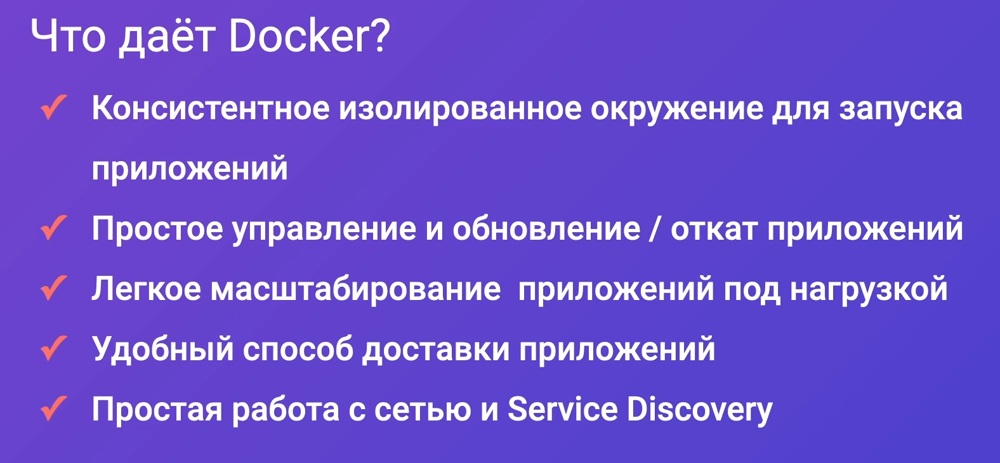
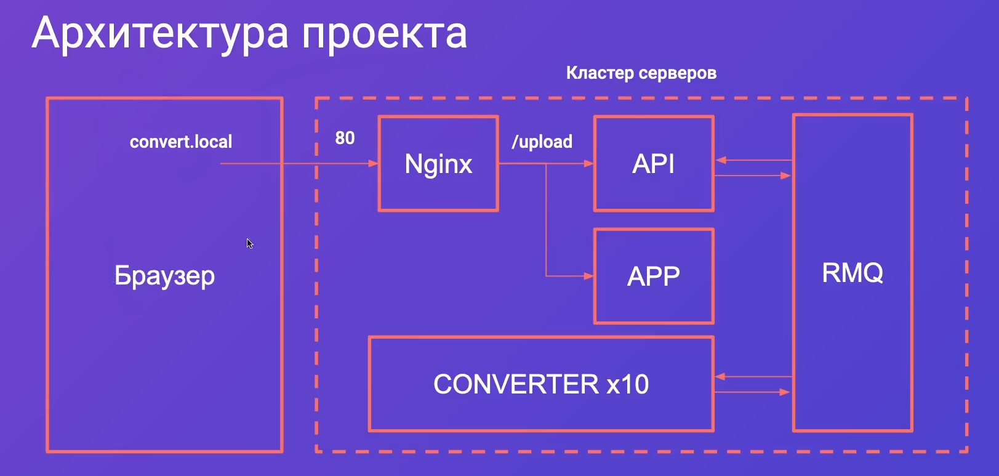

## Введение

Проблемы, которые перед нами встают, когда мы работаем с классической развёрткой приложения:
- загрузка на FTP требует дополнительного времени и сил для обновления (сейчас могут связать подгрузку из гита к серверу)
- конфликтуют версии зависимостей между тем, что использует приложение и тем, что располагается на сервере
- проблемы работы на разных устройствах (на linux одной версии запускается, а на другой уже нет)
- если мы запускаем несколько приложений на одном устройстве, то мы не можем никак гарантировать того, что одно приложение не будет мешать работе другого - отсутствие изоляции
- из вышеописанного пункта идёт ограничение масштабирования

Преимущества ==Docker==:
- Позволяет полностью изолировать приложение в виртуальной машине - изолировать сеть, файловое пространство
- очень просто и быстро можно откатить приложение, если на нём произошла ошибка - мы можем просто откатить image до стабильной версии и приложение будет опять доступно пользователям
- очень легко можно масштабировать приложение на большое количество кластеров, которые не будет конфликтовать портами 
- очень легко доставлять приложение на продакшен благодаря тому, что мы просто собираем приложение, пакуем его в образ, выгружаем на сервер и запускаем (нам не нужно развёртывать приложение на удалённом сервере и переустанавливать зависимости)
- удобная работа с сетью
	- отсутствие конфликтов между портами
	- объединение работы разных машин, которые находятся в разных местах, создавая кластер
	- обращение к приложению не по API, а через Service Discovery, который обращает по его имени, где работает внутри DNS 

Частые проблемы администрирования систем:
- очень много сложных повторяющихся задач
- вместе с поднятием image в докере приходится создавать дополнительную инфраструктуру, что замедляет доставку приложения и кода на продакшен
- отсутствие единой точки конфигурации серверов - мы не всегда можем сразу просмотреть, где установлены состояния серверов, потому что они находятся либо в самих серверах, либо у человека в голове

==Ansible== же позволяет нам автоматизировать все рутинные задачи, которые приходится выполнять при использовании ==Docker== и поднятии их image

## Обзор проекта

Из браузера будет приходить запрос, NGINX будет перенаправлять запросы, API написано на NestJS, APP на React, обмен сообщениями по сервисами реализован через RMQ

