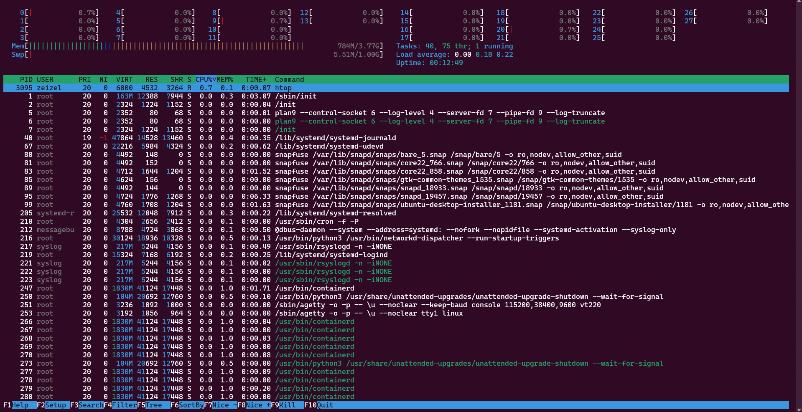
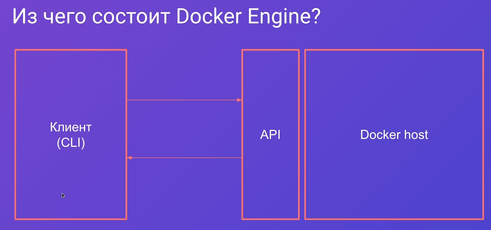
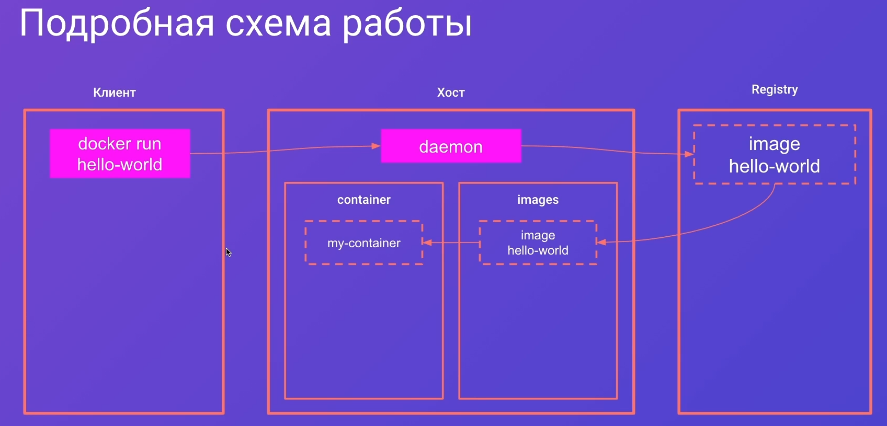
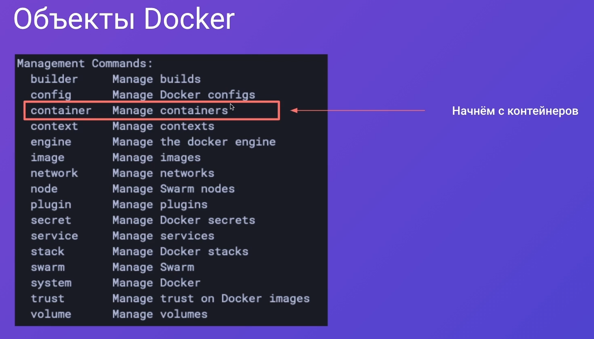
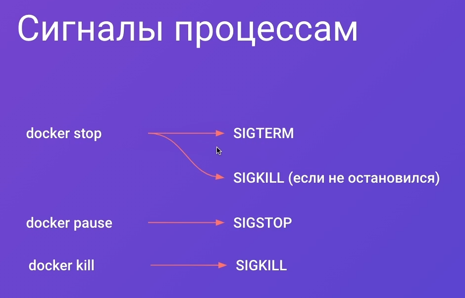
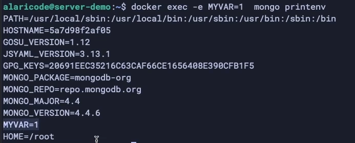
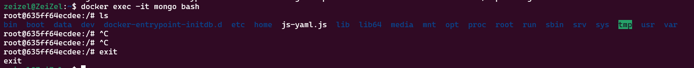
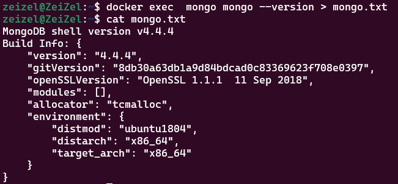

## 002 Архитектура Docker

Докер и виртуальная машина - это две разные вещи. Докер не использует супервизоры и не поднимает полноценную гостевую ОС, чтобы поднять внутри неё контейнезированное приложение.


`htop` позволяет просмотреть процессы в linux и управлять ими



При запуске процесса внутри docker, мы запускаем новый namespace, который в себя включается 
- Cgroups - определяет ограничения по памяти и ресурсам процессора
- IPC - определяет коммуникацию между процессами
- Network
- Mount - определяет доступность директорий
- PID - свои Process ID
- User 
- UTS

Контейнер докера - это изолированный namespace с обвязками докера, который запускается на хостовой машине


>[!info] Docker использует ядро Linux хоста и image содержит только необходимые бинарные файлы, библиотеки и приложения

Докер делится на две части: клиентская часть CLI и хостовая, которая принимает запросы от CLI и выполняет нужные команды



На клиенте мы отправляем команды в докер по API, который отправляет запрос в докер daemon. Daemon проверяет, есть ли нужный образ локально. Если образ отсутствует, то он обращается в общий registry и подтягивает образ оттуда и потом запускает контейнер



## 003 Управление контейнерами

Для упрощения работы с контейнерами их команды были вынесены наверх

вместо
```bash
docker container start
docker container stop
docker container stats
```

мы можем писать
```bash
docker start
docker stop
docker stats
```



У нас есть достаточное количество команд для контроля ЖЦ контейнера:
- `docker run` - создаст контейнер и запустит его
- `docker create` - создаст контейнер в остановленном виде
- `docker kill / stop` - останавливает работу контейнера
- `docker rm` - удалит контейнер (`--force` убьёт и удалит запущенный контейнер)


Первая команда показывает запущенные контейнеры. Ключ `-a` покажет все контейнеры, включая остановленные

```bash
docker ps 
docker ps -a
```


Удаление контейнера

```bash
docker rm имя/id 
```

Создаём контейнер из образа `mongo`, который будет с указанными именем `my-mongo`. Флаг `-d` позволяет отцепить процесс от текущего bash и запустить его в отдельной сессии

```bash
docker run --name my-mongo -d mongo
```

Когда мы пользуемся определённой сменой состояния процесса, мы посылаем сигнал 



Удаляет все остановленные контейнеры

```bash
docker container prune
```

Переименование контейнера

```bash
docker rename имя_контейнера новое_имя
```

## 004 Логи и статистика работы

Показывает всю статистику занимаемого пространства и ресурсов по контейнерам

```bash
docker stats
```

Показывает всю информацию по нужному контейнеру

```bash
docker inspect имя_контейнера

// покажет, включая занимаемое место
docker inspect -s имя_контейнера 

// покажет, одно отдельное свойство
docker inspect -f "{{.Status.State}}" имя_контейнера
```

Позволит вывести логи контейнера

```bash
docker logs контейнер
```

## 005 Команды в контейнере

Докер нам так же предоставляет возможность запускать команды внутри 


позволяет установить и просмотреть локальные переменные

```bash
docker exec -e MYVAR=1 mongo printenv
```



А тут мы уже залезли внутрь контейнера и можем выполнять различные операции над ним

```bash
docker exec -it mongo bash
```



Так же мы можем вывод из консоли вывести в отдельный файл, если нам потребуется

Тут сразу нужно сказать, что команда вывода и сохранения в новый файл происходит вне контейнера



Если нужно запустить команду внутри контейнера, то можно сделать таким образом:

```bash
docker exec mongo bash -c 'mongo --version > mongo.txt'
```
