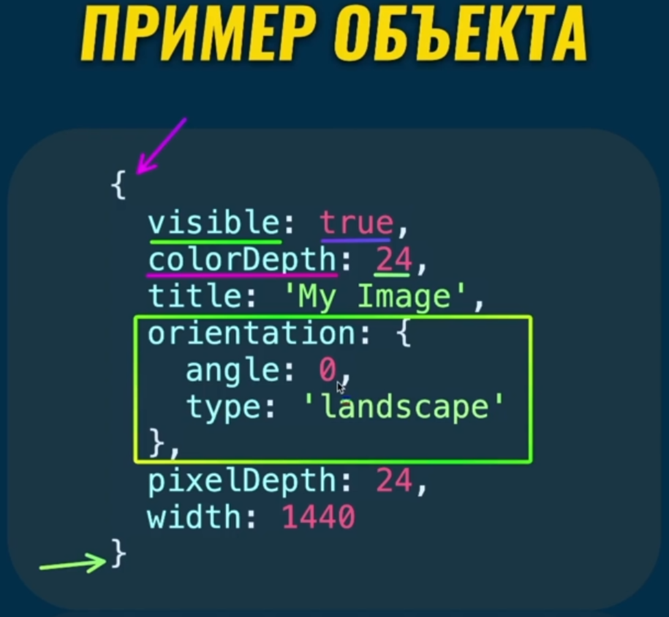
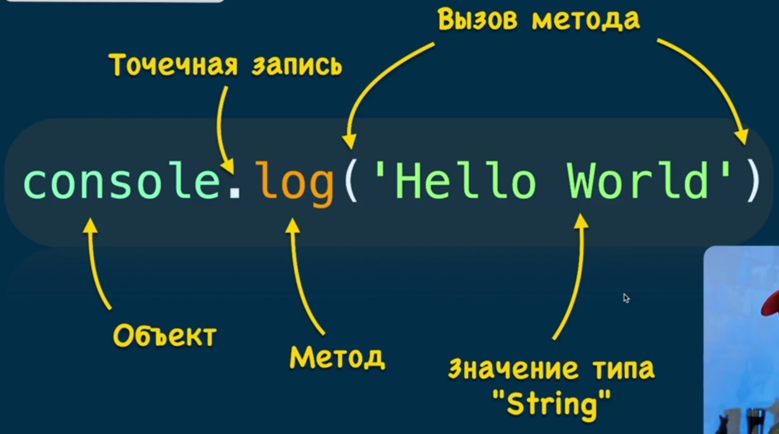
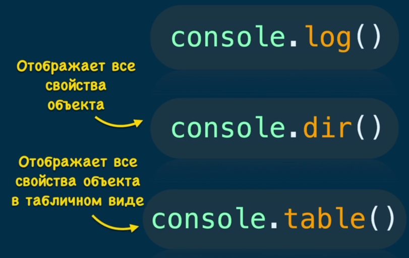
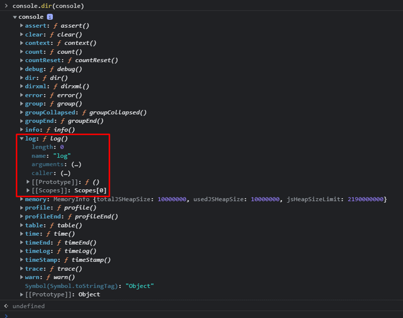
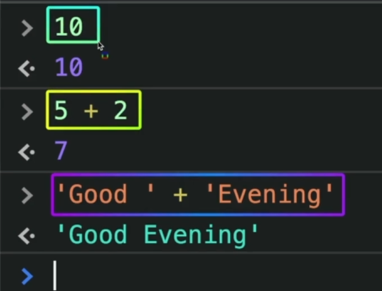
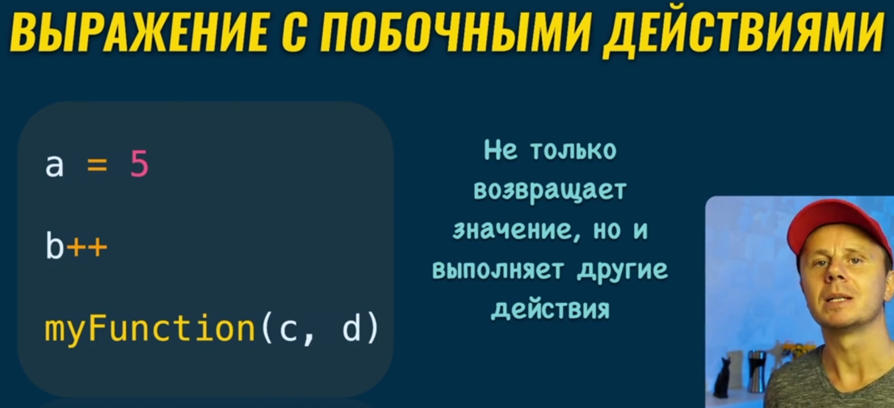

### 001 Самое важное в JavaScript

>[!info] Три главных понятия:
> - Выражения
> - Функции
> - Объекты

- Главная идея JS: «***Почти все сущности – объекты***»
- **Объект** – это набор свойств: «**ключ: значение**»

Тут представлен пример одного объекта. Все его свойства находятся между двумя кавычками.

Так же тут внутри представлено свойство со значением объекта. Такие объекты называются **вложенными объектами**

Массив, функция, число*, строка* – это **объекты**

*ведут себя как объекты

### 002 Что такое выражение console.log

И в первую очередь тут пойдёт объяснение этого выражения.

**Console** – это объект, который как и все объекты хранит в себе свойства. Внутри его свойств располагаются **функции**, которые называются **методами**, а конкретно речь идёт про метод **log**. Через **точечную запись** идёт обращение к одному из имён свойств объекта **Console**. Через скобки «**()**» у нас производится вызов метода. Они не обязательно всегда должны принимать в себя какие-либо параметры, но они обязательны с точки зрения синтаксиса

Так же есть и другие методы объекта `Console`

### 003 Выражения

Примеры выражений:

Выражения всегда возвращают некоторый результат интерпретатором (как в ноде, так и в браузере)

Так же у нас есть выражения с побочными действиями, которые не просто выводят результат, но и выполняют определённое действие под собой. Оператор присвоения «`=`» не только выводит число, но и присваивает её переменной

