### 001 Инструкции

В отдельности существуют выражения, инструкции, выражения-инструкции, но не существует инструкций-выражений

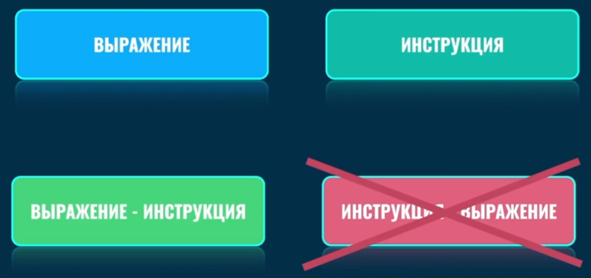

Отличия выражения и инструкции

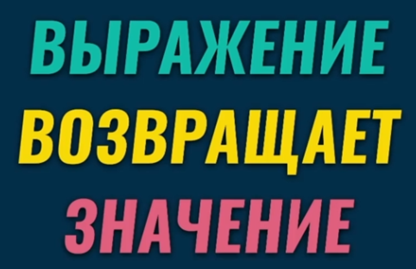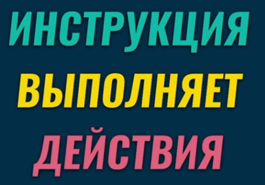

Это всё примеры инструкций

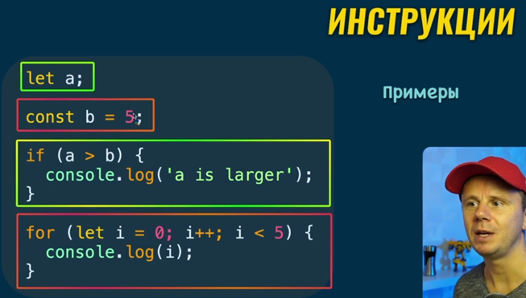

В конце инструкций обычно ставят точку с запятой, но её можно опускать

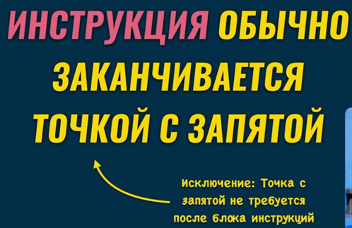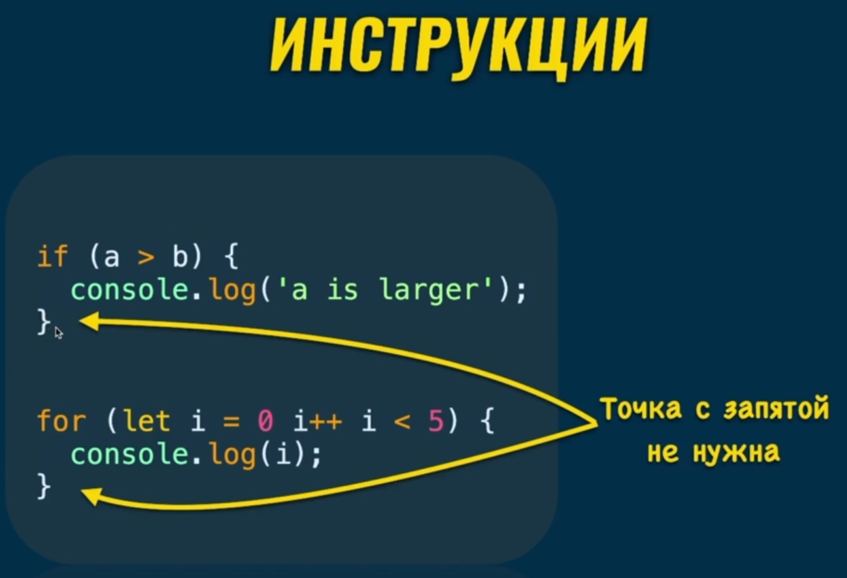
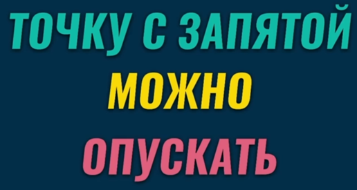

### 002 Выражения-инструкции

Выражение-инструкция – это выражения, зааписанные либо с «`;`», либо на отдельных строках, что добавляем им свойства инструкции

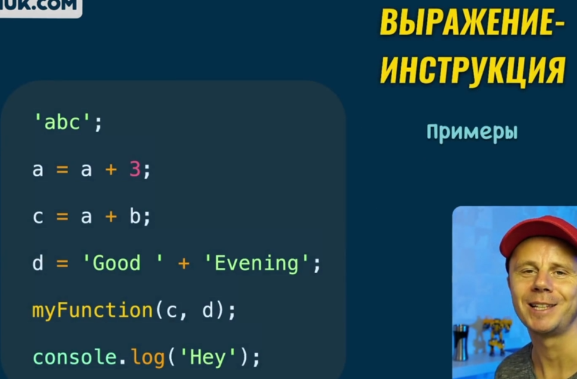

Но трансформировать инструкцию в выражение – невозможно. Инструкция выполняет действие, а не возвращает его

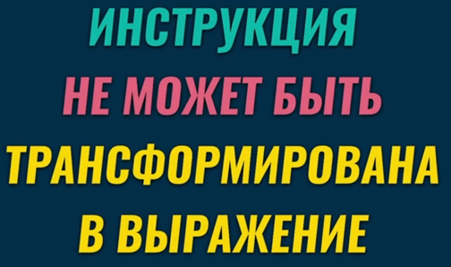

### 003 Как отличить инструкцию от выражения

Чтобы отличить инструкцию от выражения, можно попробовать положить строку кода как аргумент к функции

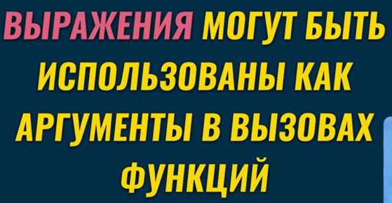

Вот пример, когда функция не выполняется, если расположить в неё инструкцию

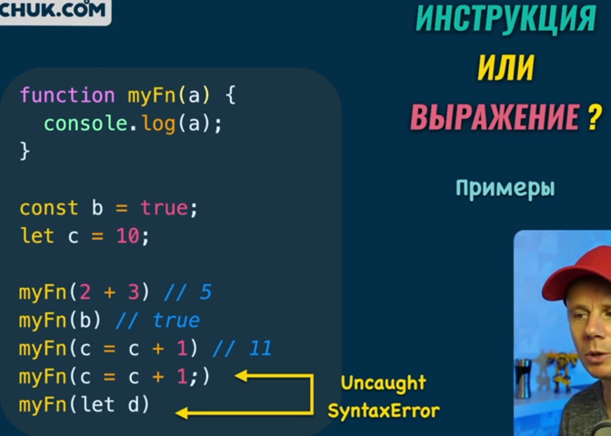