### 001 Массивы

Есть два основных способа записи массивов в JS.

> Сразу нужно упомянуть, что эти массивы не будут равны друг другу, так как будут сравниваться не значения внутри массивов, а ссылки на области памяти, где значения хранятся (то же самое, кстати, при сравнении двух визуально похожих объектов)

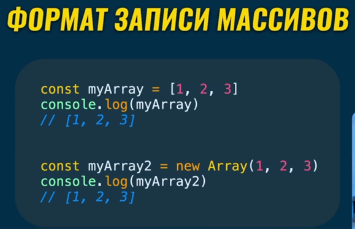

По структуре массивы – это объекты, в качестве свойств которого используются значения этого массива. У массива есть свои методы, но с ним можно работать и как с объектом (но тогда то же свойство `length` не будет обновляться)

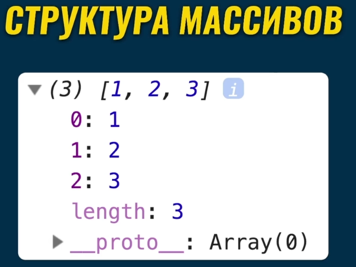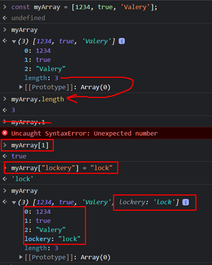

### 002 Оператор сравнения для массивов и объектов

Как и упомяналось ранее, массив ведёт себя точно так же как и объект (потому что массив – это объект с свойствами-индексами). И при присваивании одного массива к другому, мы генерируем в переменной второго массива ссылку на область памяти первого массива

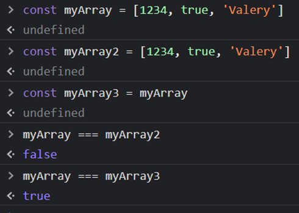

### 003 Массив против Объекта

Если написать внутренности массива внутри объекта и попытаться вывести массив и объект в консоли, то они будут отличаться только выводом на экран

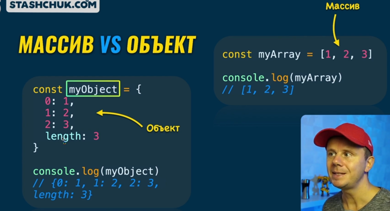

Однако хоть они и похожи внутренностями, но у них различные прототипы, которые и определяют поведение того или иного элемента в ==JS==

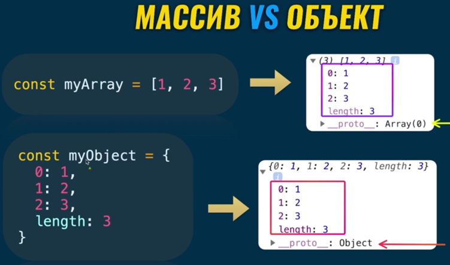

### 004 Как работать с элементами массива

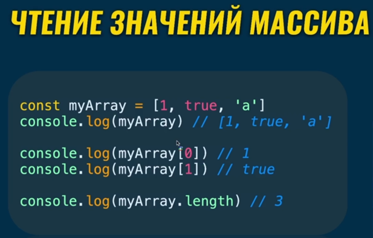

Так же интерпретатор в браузере может отобразить количество пустых элементов массива

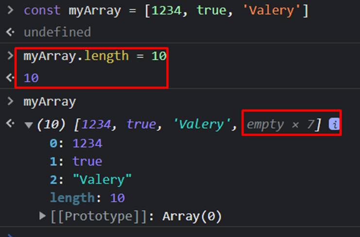

Изменение элемента массива, добавление элемента массива можно указать через квадратные скобочки после названия массива и присвоение

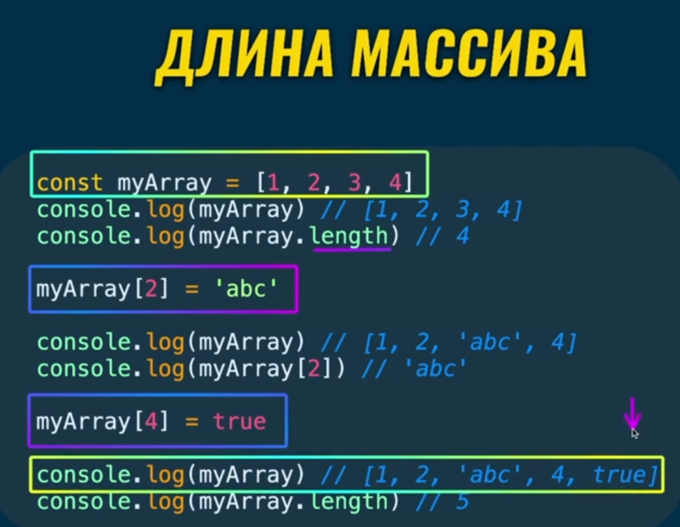

### 005 Методы массивов

Определять самостоятельно индексы массива и менять или добавлять значения в массив – это неудобно, поэтому можно воспользоваться **функциями высшего порядка**, которые встроены в прототип массива для каждого элемента

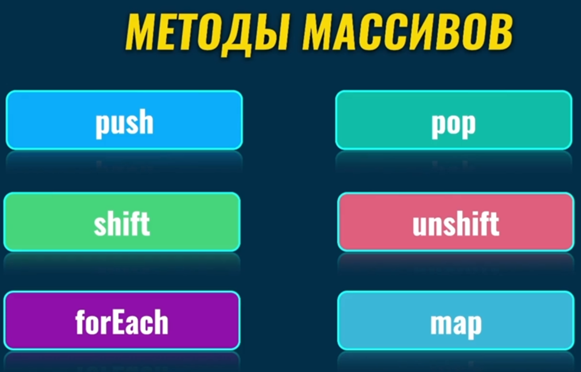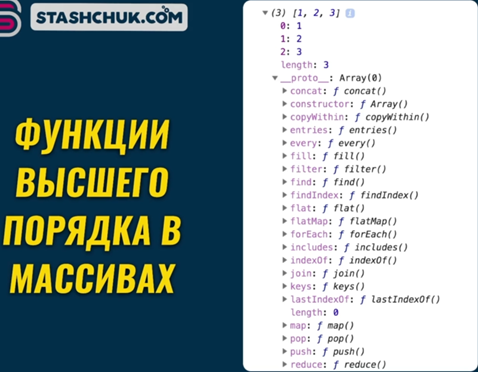

Добавление в конец массива

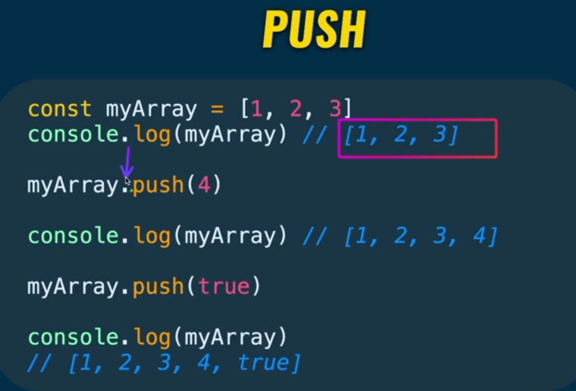

Так же есть и метод, который удаляет элемент из конца массива, который именуется – `pop()`. Так же важно заметить, что `pop()` не только удаляет элемент из конца массива, но так же он и возвращает его, поэтому можно присвоить удаляемый элемент другой переменной

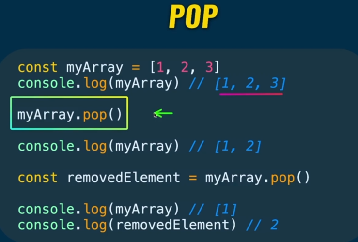

Добавляет элемент в ==начало== массива и сдвигает все элементы массива по индексу на единицу. Так же он возвращает новую длину массива.

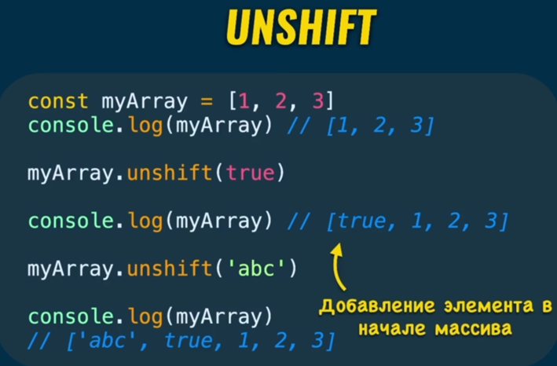

Удаляет ==первый== элемент массива и так же как `pop()` возвращает это значение, поэтому можно присвоить удалённый элемент переменной

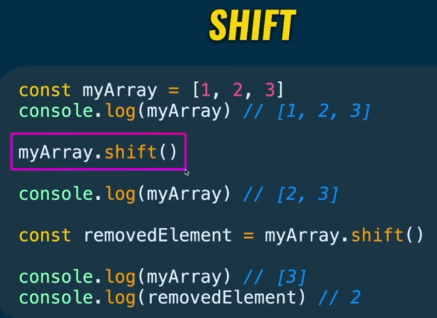

### 006 Метод forEach

Данный метод выполняет определённую, вложенную внутрь него callback-функцию столько раз, сколько элементов в массиве. И это его единственная задача. Просто перебор элементов массива и выполнение вложенной внутри callback-функции

`el` – это аргумент, который представляет из себя элемент массива, который меняется после каждой проходки на следующий элемент из массива

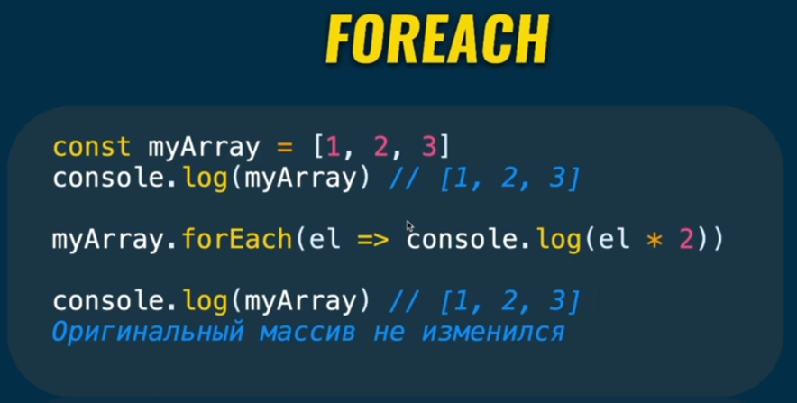

При выполнении кода можно заметить, что сам массив не мутируется. Выполняются только функции, которые над ним проводили

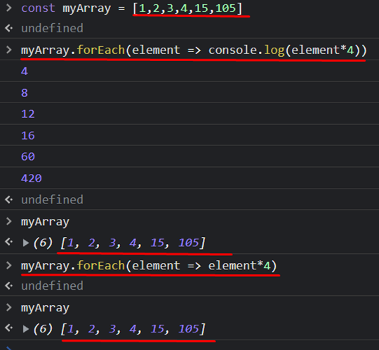

### 007 Метод map

Метод `map()` используется для создания нового массива с результатом вызова указанной функции для каждого элемента массива (данный метод возвращает после каждой итерации значение модифицированного элемента массива). Сам оригинальный массив он не мутирует

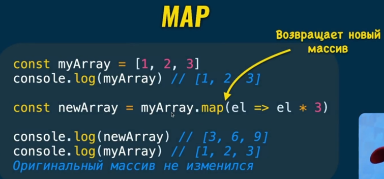

Так же хочется упомянуть, что можно вписать стрелочную функцию с явным возвратом значения и так же анонимную функцию (опять же именованную опускаем, потому что она тут не нужна)

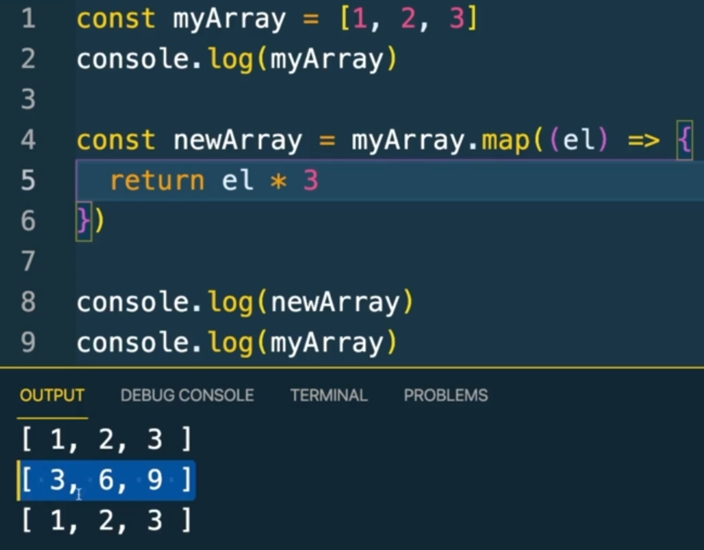
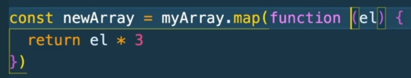