## 2 Иерархия файловой системы (FHS)

Вся иерархия файловой структуры начинается с корневой папки `/`

- `/mnt` - наш сетевой подключенный сетевой диск 
- `/tmp` - папка временных файлов
- `/opt` - папка разархивированных исходников
- `/etc` - настройки программы (хранение файлов конфигураций)
- `/home/<user>` - персональные данные пользователя
- `/var` - хранит изменяемые файлы программ (зачастую логи и кэш)
- `/boot` - файлы загрузки системы
- `/dev` - файлы устройства
- `/lib` - библиотеки исполняемых файлов системы
- `/media` - сюда подключаются USB / CDROM
- `/proc` - процессы, которые исполняются в системе
- `/root` - домашний каталог суперпользователя
- `/run` - запущенные процессы
- `/sbin` - системные утилиты
- `/srv` - службы, которые размещают свои данные
- `/sys` - инф. об устройствах и драйверах
- `/usr` - ещё одна папка для данных пользователя (утилиты многопользовательского режима)

## 3 Об оболочке и командах 

Для каждого пользователя в системе создаётся свой каталог в `/home`. Изначально `/home` отображается в терминале как `~`

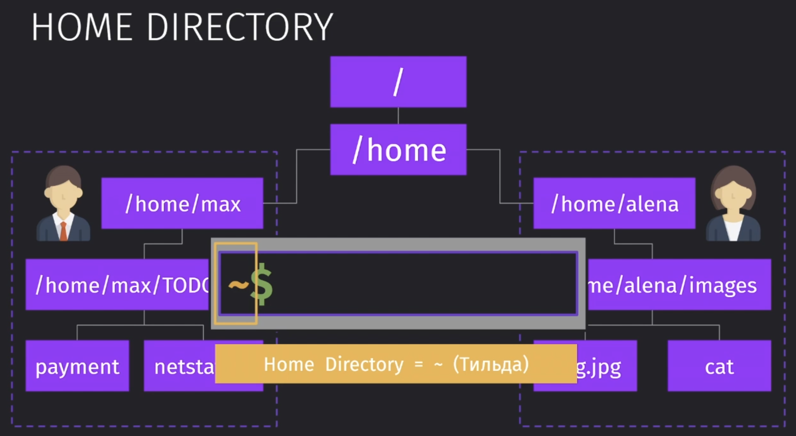

Команды строятся следующим образом: `команда -параметры ...аргументы[]`

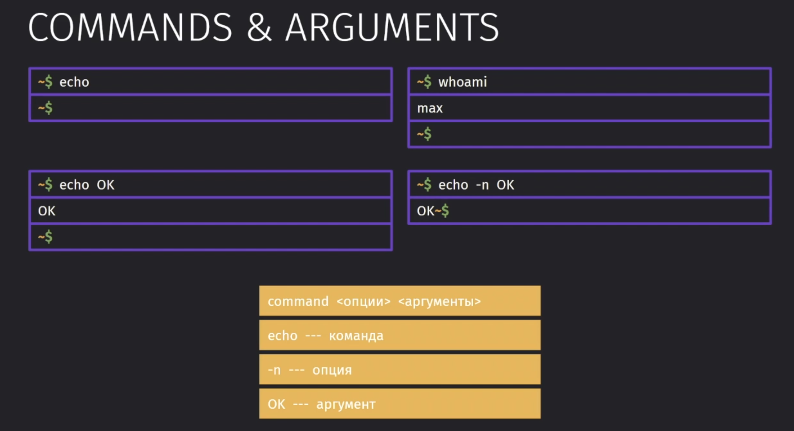

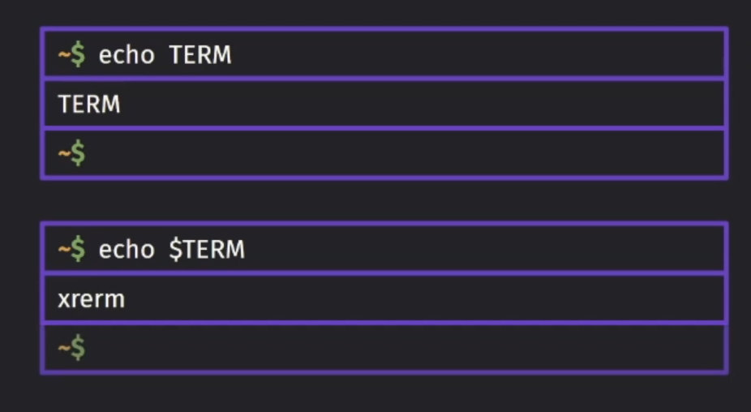

Есть 3 основных типа команд:
- Встроенные, системные
- Алиасы, которые под собой скрывают команду + дополнительные параметры
- Внешние команды, которые идут с оболочкой или из других пакетов

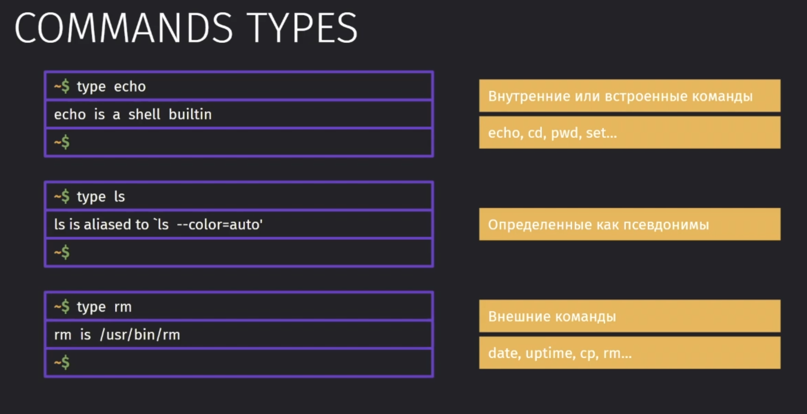

Shell ищет исполняемые команды по записанным путям в переменной `$PATH` 

## 4 Основные команды 

- `pwd` - отображает текущий каталог
- `ls` - отображает содержимое директории
- `mkdir` - создание новой директории. Если нет нужной директории, в которую поместим создаваемый файл, то нужно добавить параметр `-p`. Так же мы можем просто передать сразу несколько аргументов, чтобы создать сразу несколько файлов.

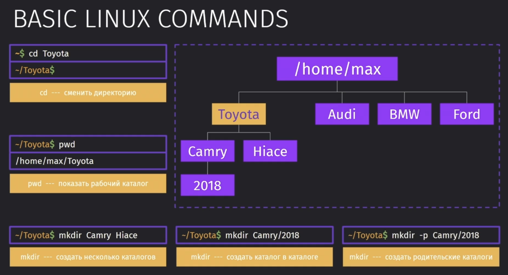

- `cd` - переход в нужную директорию

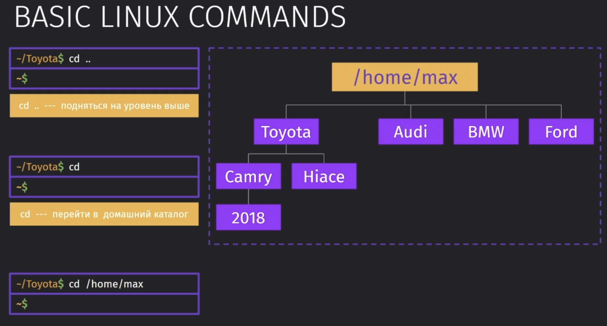

Переход по каталогам с сохранением истории

- `pushd` - переходит каталог и сохраняет в список
- `popd` - возвращается обратно по списку

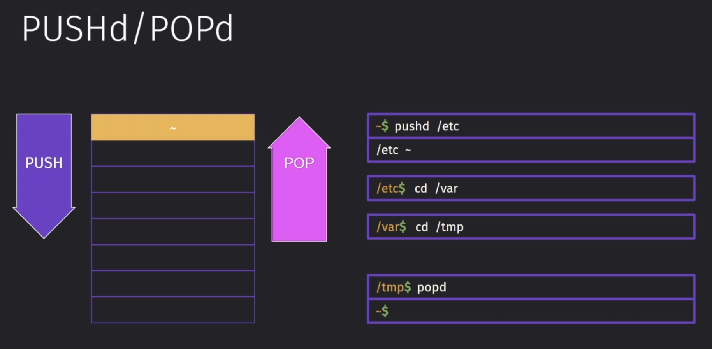

Команда `mv` занимается переименованием либо переносом файлов. Для неё можно использовать как абсолютный, так и относительный путь. Чтобы переименовать файл, достаточно просто написать первым аргументом целевой файл, а вторым аргументом передать конечное наименование.

Команда `cp` даёт нам возможность скопировать файлы из нужной нам директории. Параметр `-r` позволяет нам скопировать файл или папку и все внутрилежащие элементы в другую папку. 

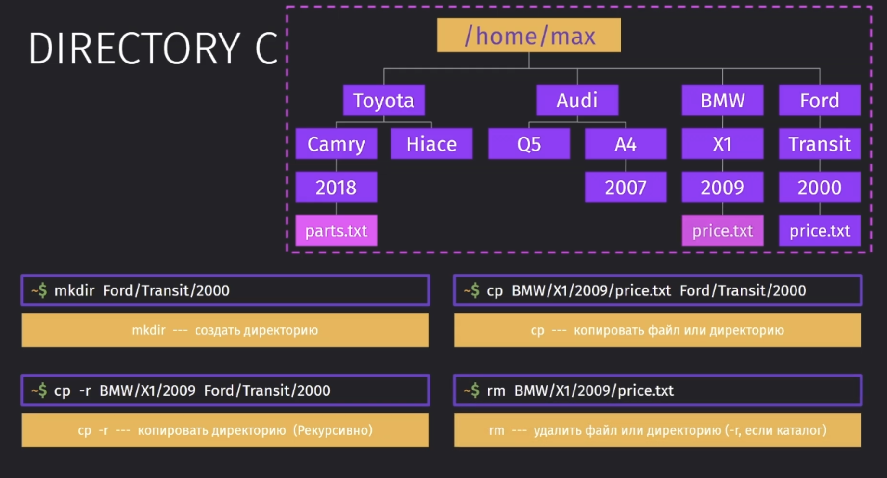

- `touch` - позволяет создать файл
- `cat` - выводит данные из файла, либо если использовать `>`, то создаст файл и даст ввести в него данные. Чтобы выйти из режима ввода, нужно воспользоваться `Ctrl+D`

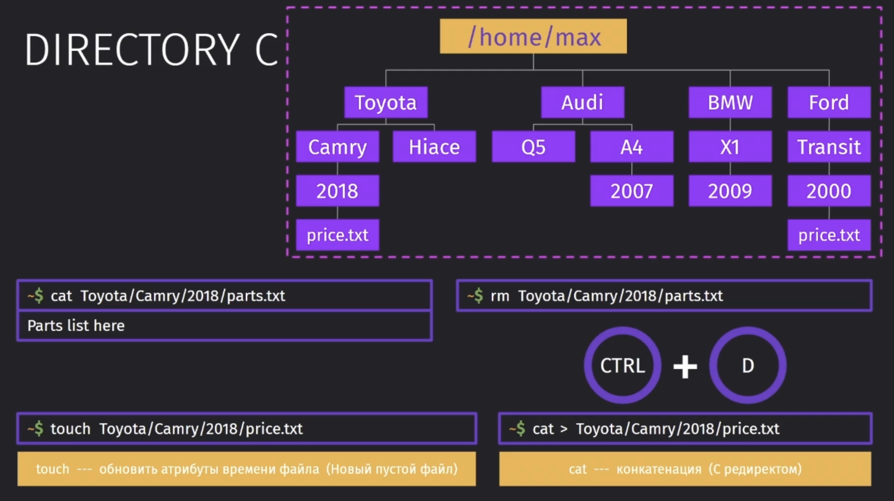

Команды `more` или `less` позволяют просматривать большие файлы, подгружая только необходимые части

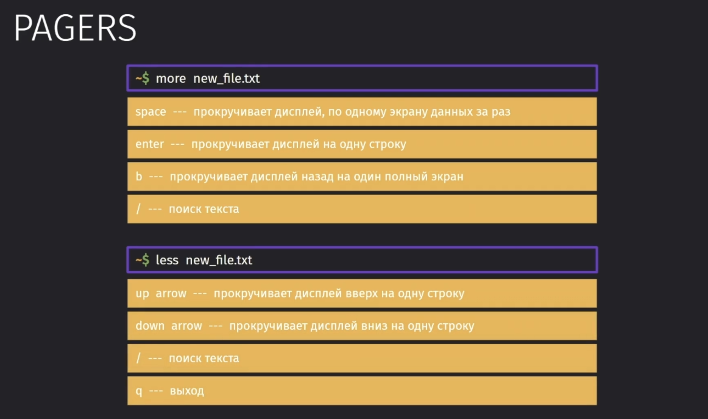

Так же мы можем отображать подробные списки с информацией по нашим файлам

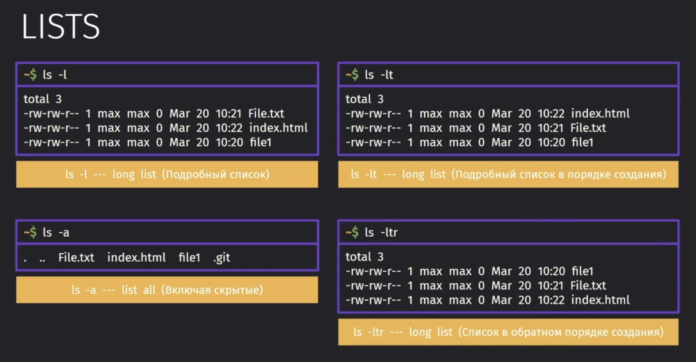

## 10 Об оболочке Bash 

Существует множество различных оболочек для работы с терминалом linux. Самая частоиспользуемая - `bash`

Переменная `$SHELL` хранит текущее положение консоли

Команда `chsh` позволяет поменять системную консоль

`bash` предоставляет фичи для работы с линуксом, которые упрощают нашу жизнь. В нём можно задавать алиасы, просматривать историю и так же он предоставляет автокомплит команд.

Из консоли мы так же можем обратиться к переменным среды, которые хранятся в нашей системе

`env` - отобразит все переменные среды linux
`echo $VAR` - выведет определённую переменную из среды
`export VAR=101` - запишет переменную в среду linux
`VAR=101` - сохранит переменную в текущей сессии консоли, но никуда не запишет

Одной из важнейших переменных является `$PATH`. Она хранит все пути, по которым нужно искать исполняемые файлы, с разделителем `:` между отдельным путём.

Если нам нужно добавить каталог с исполняемым файлом, то нам нужно будет ввести `export PATH=$PATH:/<путь>`

`~` - является указанием на текущую рабочую директорию. Дефолтно этот символ говорит нам о том, что мы находимся в `/home`

`$` - символ приглашения. Его оболочка позволяет поменять с целью того, чтобы различать  

Так же мы можем скастомизировать приглашение пользователя таким образом, чтобы вывести всю нужную информацию сразу на консоль. Хранятся настройки данной строки в переменной `PS1`

## 11 HELP в Командной Строке

Иногда мы можем не помнить некоторых ключей команды или вовсе неумеем пользоваться инструментом, но быстро с ним ознакомиться нужно. В данной ситуации нам помогут встроенные утилиты и стандарты для ведения мануалов в утилитах под linux

`man` (manual) - команда для получения мануалов по консольным командам
`--help` - данный флаг по стандарту во всех командах выводит список доступных опций с их описанием
`whatis` - выведет короткую справку по команде
`apropos` - выведет список наименований доступных команд, которые содержат (в наименовании) данную строку

Примерно так будет выглядеть вывод `apropos` по поиску слова `agent`

