#React #ReactNative

## Введение

Плюсы языка:

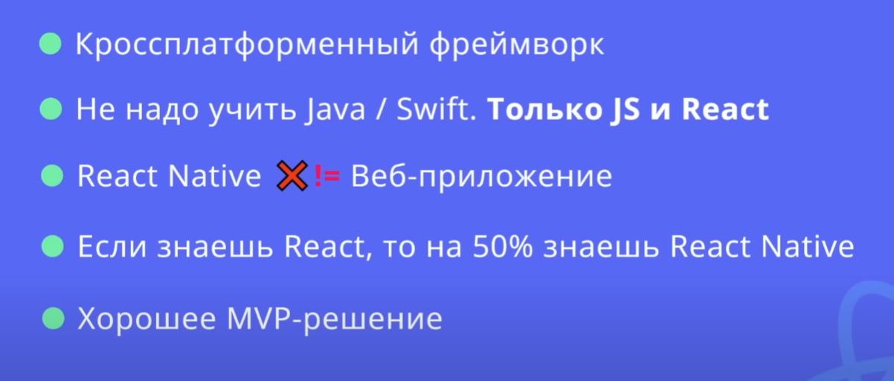

Основные различия в синтаксисе:

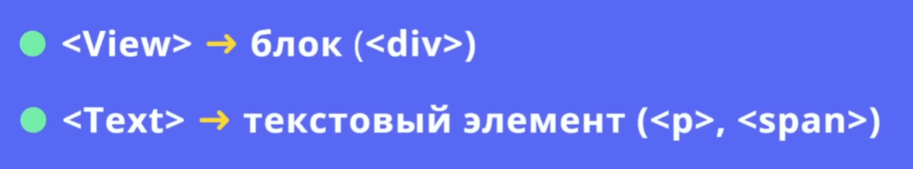

Во что переводится `View`

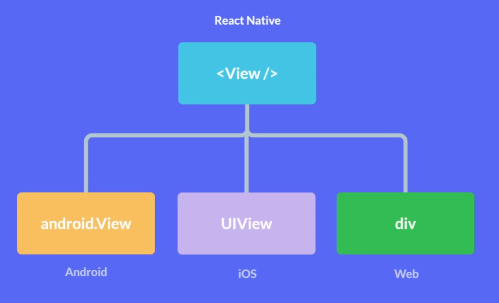

Так выглядит пример нативной и браузерной вёрстки

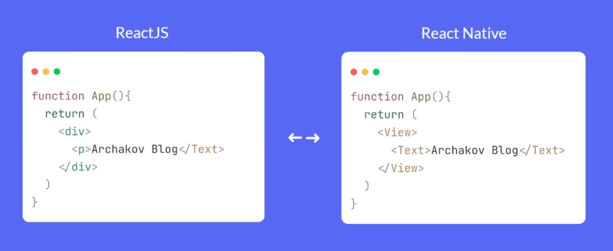

Реакт нэйтив переводится в чистый JS, а затем движок Bridge выполняет операции в нужной ОС по инструкции JS


Для создания первых приложений очень удобно будет использовать Expo CLI для развёртывания приложения на React

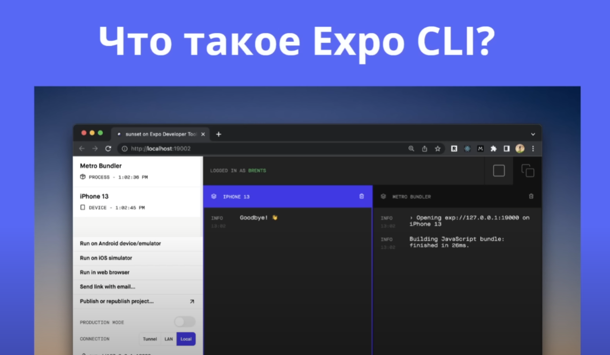

## Создаем проект с помощью expo-cli

Так же можно в наличии шаблоны на ts

```bash
npx create-expo-app .
```

## Изучаем структуру проекта

`app.json` - настройки expo
`app.js` - корневой компонент приложения (вместо `index.js`, как в обычном реакт)

Дальше всё как в обычном веб-приложении

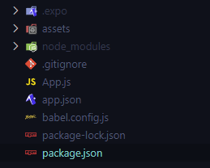

## Запуск проекта

Запускаем приложение классической командой

```bash
npm run start
```

## Про Metro Bundler

Metro Bundler позволяет интерпретировать любой системе (ios/android/pc), что написано на JS и выполнить заданные действия. JS будет выполнять определённое действие и MB будет объяснять всем ОС, что нужно будет сделать, чтобы отобразить данные нативные элементы

## Скачиваем Android Studio и настраиваем

Лучше молить бога, чтобы всё запустилось - смотрим [туториалы](https://www.youtube.com/watch?v=K-aD8ClG1FQ&t=38s)

## Запускаем на реальном устройстве приложение

Устанавливаем Expo Go на своё устройство

Сканируем QR или вставляем ссылку

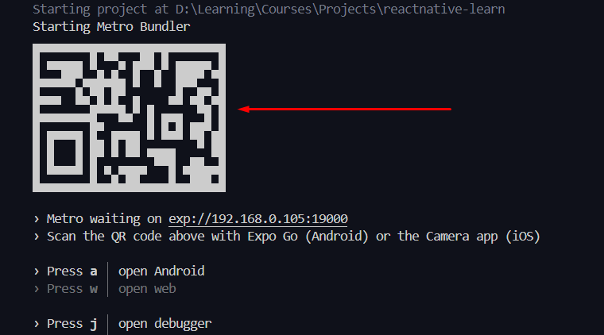

И получаем итоговое приложение на Андроид

## Скачиваем scrcpy для шаринга экрана устройства на ПК

[Тут](https://github.com/Genymobile/scrcpy) находится приложение для шаринга экрана на компьютер. У телефона должен быть включён режим отладки, чтобы получить к нему доступ по кабелю

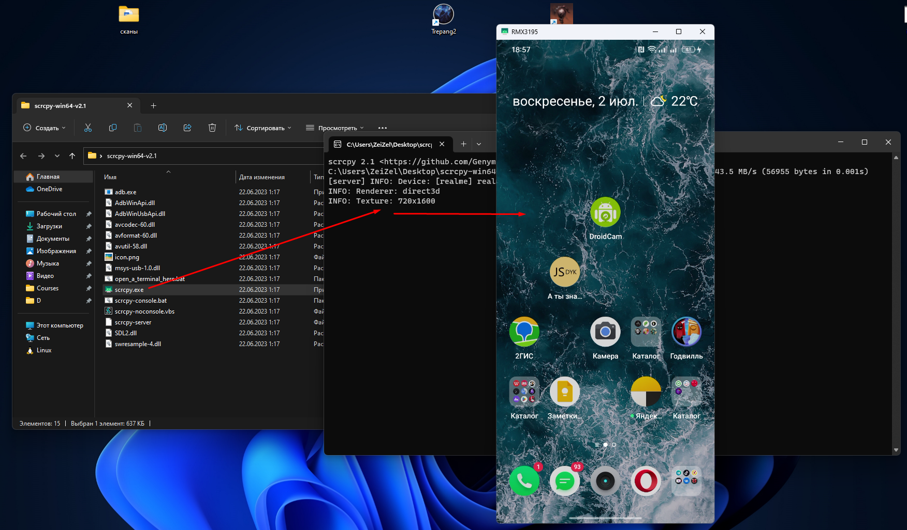

## Запускаем Expo в устройстве и открываем наше приложение

В терминале нужно нажать `m` и в телефоне нужно подключить горячую перезагрузку, чтобы изменения применялись автоматически после сохранения 

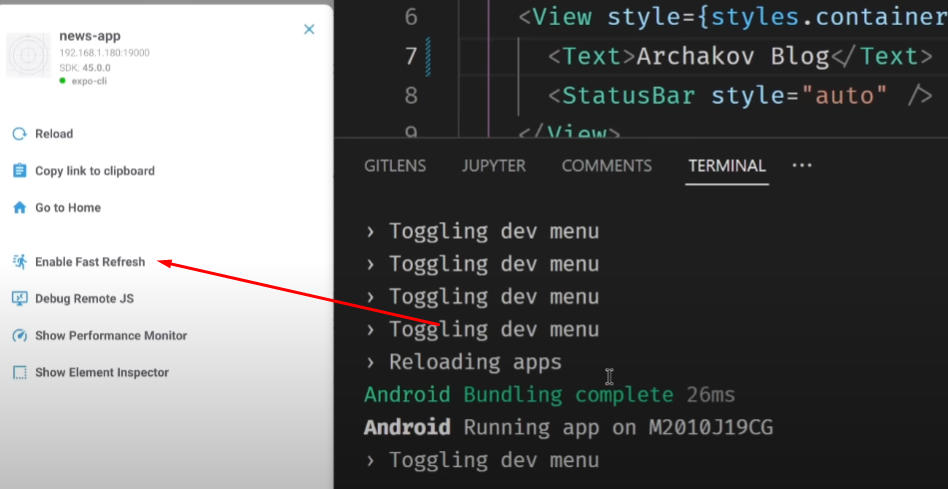

## Начальная разработка приложения и стилизация

Изначально мы имеем два элемента, которые работают аналогично и в браузере:
- `View` - это замена для элемента `div`, который хранит в себе элементы
- `Text` - это замена для элемента `p`, который хранит в себе текст, но с одной оговоркой - мы обязательно должны использовать этот элемент для хранения текста

Если нам нужно будет передать классы или напрямую стили, нам нужно будет использовать атрибут `style`. 

Для генерации стилей мы можем использовать `StyleSheet.create()`, что является аналогом `createStyles` из `materialui`

`App.js`
```JSX
import { StatusBar } from 'expo-status-bar';
import { StyleSheet, Text, View } from 'react-native';
// import './styles.css'

export default function App() {
	return (
		<View style={styles.container}>
			<Text style={styles.textStyles}>Hello</Text>
			<Text
				style={{
					fontSize: 16,
				}}
			>
				world!
			</Text>
			<StatusBar style='auto' />
		</View>
	);
}

const styles = StyleSheet.create({
	container: {
		display: 'flex',
		justifyContent: 'center',
		alignItems: 'center',
		width: '100%',
		height: '100%',
	},
	textStyles: {
		color: 'purple',
		fontSize: 24,
	},
});
```

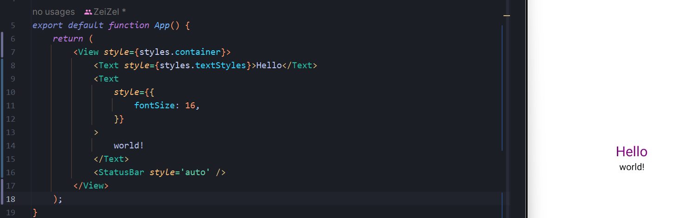

## Устанавливаем styled-components для стилизации компонентов

Устанавливаем стилизованные компоненты

```bash
npm i styled-components
```

И далее можем реализовывать более простым образом компоненты, как на сайтах. Но с одним отличием - импортируем стилевые компоненты из `/native`

```JSX
import { View } from 'react-native';
import styled from 'styled-components/native';

const Post = styled.View`
	padding: 15px;

	width: 100px;
	height: 100px;

	background: red;
	border-radius: 15px;
`;

export default function App() {
	return (
		<View>
			<Post />
		</View>
	);
}
```

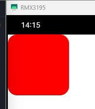

## Начинаем верстать статью

Компонент `StatusBar` отодвигает все элементы от статусбара

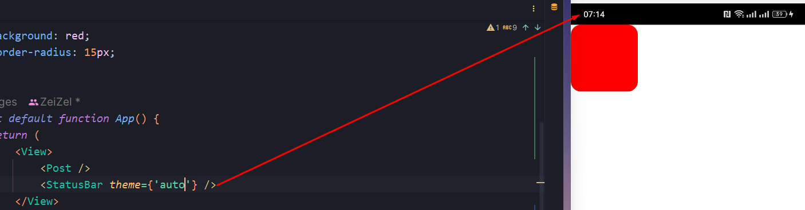

Создаём пост в отдельном файле

Так же тут нужно обратить внимание, что для отображения изображений, нужно использовать компонент `Image`

`components / Post / Post.jsx`
```JSX
import styled from 'styled-components/native';

const PostView = styled.View`
	display: flex;
	flex-direction: row;

	padding: 15px;

	/* border-bottom: 1px solid rgba(0, 0, 0, 0.1); - так написать нельзя в styled-components */
	border-bottom-width: 1px;
	border-bottom-color: rgba(0, 0, 0, 0.1);
	border-bottom-style: solid;
`;

const PostDetails = styled.View`
	justify-content: center;
`;

const PostImage = styled.Image`
	margin-right: 12px;
	width: 100px;
	height: 100px;
	border-radius: 12px;
`;

const PostTitle = styled.Text`
	font-size: 16px;
	font-weight: 700;
`;

const PostDate = styled.Text`
	font-size: 12px;
	color: rgba(0, 0, 0, 0.4);
`;

export const Post = ({ title, imageUri, createdAt }) => {
	return (
		<PostView>
			<PostImage
				source={{
					uri: imageUri,
				}}
			/>
			<PostDetails>
				<PostTitle>{title}</PostTitle>
				<PostDate>{createdAt}</PostDate>
			</PostDetails>
		</PostView>
	);
};
```

И далее используем данный компонент с обычной передачей пропсов

`App.js`
```JSX
import { StatusBar, View } from 'react-native';
import { Post } from './components/Post/Post';

export default function App() {
	return (
		<View>
			<Post
				title={'yes'}
				createdAt={'yes'}
				imageUri={
					'https://media.kg-portal.ru/anime/j/jojosbizarreadventurediamondisunbreakable/images/jojosbizarreadventurediamondisunbreakable_32.jpg'
				}
			/>
			<StatusBar theme={'auto'} />
		</View>
	);
}
```

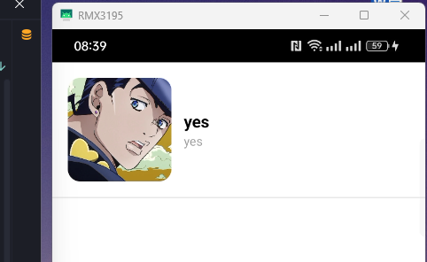

## Устанавливаем Axios и делаем запрос на получение статей

Воспользуемся mockAPI для генерации данных. 

Далее мы просто воспользуемся `useEffect` и `useState`, как в обычном реакте, чтобы получить данные и отобразить их через `map`.

Так же отдельно можно отметить, что мы можем выводить сообщение об ошибке, если воспользуемся `Alert` 

`App.js`
```JSX
import { Alert, StatusBar, View } from 'react-native';
import { Post } from './components/Post/Post';
import { useEffect, useState } from 'react';
import axios from 'axios';

const API = 'https://64db11b4593f57e435b06489.mockapi.io/api/posts/hasles';

export default function App() {
	const [posts, setPosts] = useState([]);

	useEffect(() => {
		axios
			.get(API)
			.then(({ data }) => setPosts(data))
			.catch((e) => Alert.alert('Ошибка', 'Не получается получить статьи!'));

		console.log(posts);
	}, []);

	return (
		<View>
			{posts.map((post) => (
				<Post
					key={post.id}
					title={post.title}
					imageUri={post.imageUrl}
					createdAt={post.createdAt}
				/>
			))}
			<StatusBar theme={'auto'} />
		</View>
	);
}
```

Тут нужно отметить, что без `flex: 1` текст будет уходить за границы экрана

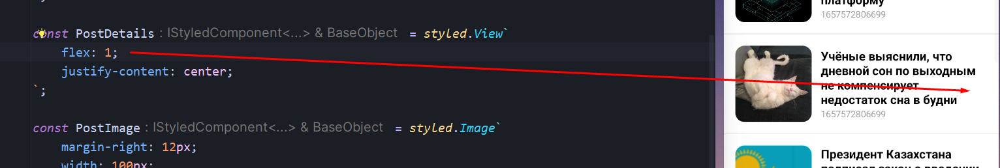

## Как правильно рендерить список с возможностью скролла (FlatList)

Однако для рендера экрана, который будет поддерживать скролл, нужно будет воспользоваться компонентом `FlatList`, который предоставит нам рендер большого списка. 

Атрибут `data` принимает в себя сам массив данных, а атрибут `renderItem` уже принимает в себя объект с полем `item`, в котором и хранятся наши данные. Тут нам для отрисовки не нужно передавать атрибут `key` в компонент, так как `FlatList` делает это автоматически

`App.js`
```JSX
import { Alert, FlatList, StatusBar, View } from 'react-native';
import { Post } from './components/Post/Post';
import { useEffect, useState } from 'react';
import axios from 'axios';

const API = 'https://64db11b4593f57e435b06489.mockapi.io/api/posts/hasles';

export default function App() {
	const [posts, setPosts] = useState([]);

	useEffect(() => {
		axios
			.get(API)
			.then(({ data }) => setPosts(data))
			.catch((e) => Alert.alert('Ошибка', 'Не получается получить статьи!'));
	}, []);

	return (
		<View>
			<FlatList
				data={posts}
				renderItem={({ item }) => (
					<Post title={item.title} imageUri={item.imageUrl} createdAt={item.createdAt} />
				)}
			/>

			<StatusBar theme={'auto'} />
		</View>
	);
}
```

## Делаем рендер иконки загрузки контента (ActivityIndicator)

Сделать иконку загрузки мы можем через использование компонента `ActivityIndicator` и `useState`, который будет хранить статус загрузки изменяемый в `fetchPosts`

`App.js`
```JSX
import { Alert, FlatList, StatusBar, View, Text, ActivityIndicator } from 'react-native';
import { Post } from './components/Post/Post';
import { useEffect, useState } from 'react';
import axios from 'axios';

const API = 'https://64db11b4593f57e435b06489.mockapi.io/api/posts/hasles';

export default function App() {
	const [posts, setPosts] = useState([]);
	const [isLoading, setIsLoading] = useState(true);

	const fetchPosts = () => {
		setIsLoading(true);
		axios
			.get(API)
			.then(({ data }) => setPosts(data))
			.catch((e) => Alert.alert('Ошибка', 'Не получается получить статьи!'))
			.finally(() => setIsLoading(false));
	};

	useEffect(fetchPosts, []);

	if (isLoading) {
		return (
			<View style={{ flex: 1, justifyContent: 'center', alignItems: 'center' }}>
				<ActivityIndicator style={{ marginBottom: 15 }} size={'large'} />
				<Text>Загрузка...</Text>
			</View>
		);
	}

	return (
		<View>
			<FlatList
				data={posts}
				renderItem={({ item }) => (
					<Post title={item.title} imageUri={item.imageUrl} createdAt={item.createdAt} />
				)}
			/>

			<StatusBar theme={'auto'} />
		</View>
	);
}
```

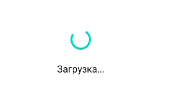

## Перезагрузка контента по свайпу (RefreshController)

Далее нам нужно реализовать функционал, когда по свайпу сверху вниз, мы будем подгружать новые данные пользователя

Для этого уже используется атрибут `refreshControl` внутри `FlatList` и компонент `RefreshControl`

`refreshing` - boolean обновления данных
`onRefresh` - отвечает за действие во время перезагрузки

```JSX
import {  
    Alert,  
    FlatList,  
    StatusBar,  
    View,  
    Text,  
    ActivityIndicator,  
    RefreshControl,  
} from 'react-native';  
import { Post } from './components/Post/Post';  
import { useEffect, useState } from 'react';  
import axios from 'axios';  
  
const API = 'https://64db11b4593f57e435b06489.mockapi.io/api/posts/hasles';  
  
export default function App() {  
    const [posts, setPosts] = useState([]);  
    const [isLoading, setIsLoading] = useState(true);  
  
    const fetchPosts = () => {  
       setIsLoading(true);  
       axios  
          .get(API)  
          .then(({ data }) => setPosts(data))  
          .catch((e) => Alert.alert('Ошибка', 'Не получается получить статьи!'))  
          .finally(() => setIsLoading(false));  
    };  
  
    useEffect(fetchPosts, []);  
  
    if (isLoading) {  
       return (  
          <View style={{ flex: 1, justifyContent: 'center', alignItems: 'center' }}>  
             <ActivityIndicator style={{ marginBottom: 15 }} size={'large'} />  
             <Text>Загрузка...</Text>  
          </View>  
       );  
    }  
  
    return (  
       <View>          
	       <FlatList  
             refreshControl={<RefreshControl refreshing={isLoading} onRefresh={fetchPosts} />}  
             data={posts}  
             renderItem={({ item }) => (  
                <Post title={item.title} imageUri={item.imageUrl} createdAt={item.createdAt} />  
             )}  
          />  
  
          <StatusBar theme={'auto'} />  
       </View>  
    );  
}
```

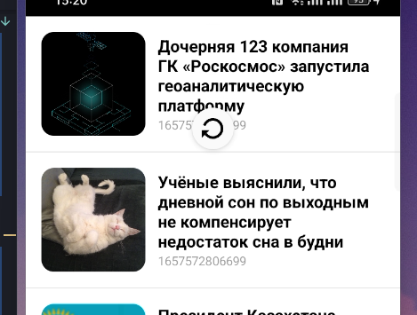

## Делаем статью кликабельной (TouchableOpacity)

Для отслеживания нажатия на элемент и реагирования на это действие, мы можем использовать `TouchableOpacity` - он автоматически будет менять отображение при нажатии на элемент и так же через `onPress` позволит вызывать функционал 

```JSX
<FlatList
	refreshControl={<RefreshControl refreshing={isLoading} onRefresh={fetchPosts} />}
	data={posts}
	renderItem={({ item }) => (
		<TouchableOpacity onPress={/* тут можно поместить действие при клике */}>
			<Post
				title={item.title}
				imageUri={item.imageUrl}
				createdAt={item.createdAt}
			/>
		</TouchableOpacity>
	)}
/>
```

И теперь происходит изменение opacity у активного элемента, на который кликают

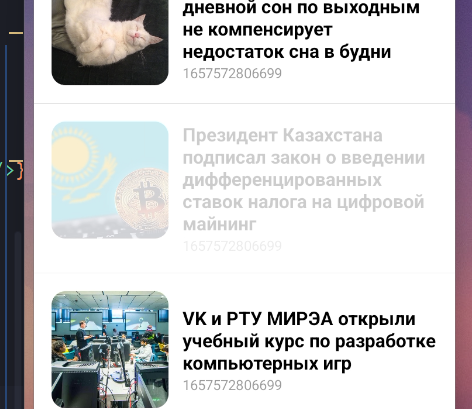

## Создаем экран отображения полной статьи FullPostScreen

Далее стоит разделить приложение на отдельные страницы, которые принято называть скринами и далее реализуем страницу отдельного поста

`screens > PostScreen.jsx`
```JSX
import { ActivityIndicator, Alert, Text, View } from 'react-native';  
import styled from 'styled-components/native';  
import { useEffect, useState } from 'react';  
import axios from 'axios';  
import { Loading } from '../components/Loading/Loading';  
  
const PostImage = styled.Image`  
    width: 100%;    height: 250px;  
    margin-bottom: 20px;  
    border-radius: 15px;`;  
  
const PostText = styled.Text`  
    font-size: 18px;    line-height: 24px;`;  
  
const PostTitle = styled.Text`  
    font-size: 24px;    font-weight: 700;    line-height: 24px;`;  
  
const API = 'https://64db11b4593f57e435b06489.mockapi.io/api/posts/hasles';  
  
export const PostScreen = () => {  
    const [post, setPost] = useState([]);  
    const [isLoading, setIsLoading] = useState(true);  
  
    const fetchPosts = () => {  
       setIsLoading(true);  
       axios  
          .get(API + '/1')  
          .then(({ data }) => setPost(data))  
          .catch((e) => Alert.alert('Ошибка', 'Не получается получить статью!'))  
          .finally(() => setIsLoading(false));  
    };  
  
    useEffect(fetchPosts, []);  
  
    if (isLoading) {  
       return <Loading />;  
    }  
  
    return (  
       <View style={{ padding: 20 }}>  
          <PostTitle>{post.title}</PostTitle>  
          <PostImage             source={{  
                uri: post.imageUrl,  
             }}  
          />  
          <PostText>{post.text}</PostText>  
       </View>  
    );  
};
```

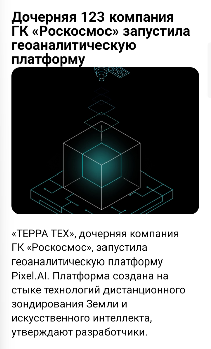

## Подключаем роутинг с помощью React Navigation

Для реализации стандартной навигации потребуются следующие пакеты:

```bash
npm i @react-navigation/native @react-navigation/native-stack react-native-screens react-native-safe-area-context react-native-gesture-handler
```

И уже таким образом реализуется навигация по приложению. Все имена роутов должны быть уникальными. Самый верхний скрин отобразится первым. В `options` мы передаём тот заголовок, который отобразится на странице приложения

`screens > Navigation.jsx`
```JSX
import { createNativeStackNavigator } from '@react-navigation/native-stack';
import { NavigationContainer } from '@react-navigation/native';
import { HomeScreen } from './HomeScreen';
import { PostScreen } from './PostScreen';

const Stack = createNativeStackNavigator();

export const Navigation = () => {
	return (
		/* нужен для корректного отображения скринов */
		<NavigationContainer>
			{/* аналог routes */}
			<Stack.Navigator>
				<Stack.Screen component={HomeScreen} name={'Home'} options={{ title: 'Новости' }} />
				<Stack.Screen component={PostScreen} name={'Post'} options={{ title: 'Пост' }} />
			</Stack.Navigator>
		</NavigationContainer>
	);
};
```

И далее нам нужно в главном компоненте передать чистый навигатор без всяких обёрток и статусбара, так как за нас всё настроить навигационный контейнер

`App.js`
```JSX
import { Navigation } from './screens/Navigation';

export default function App() {
	return <Navigation />;
}
```

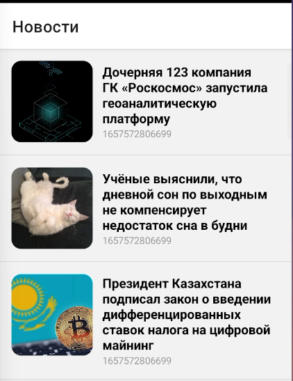

## Делаем переход на экран полной записи при клике на статью

Первым делом нужно получить объект `navigation` из пропсов, который попадает туда из роутера приложения. Этот объект хранит функции для работы с роутингом нашего приложения. Далее нужно на `TouchableOpacity` повесить функцию `navigate` 

`screens > HomeScreen.jsx`
```JSX
import {
	Alert,
	FlatList,
	View,
	Text,
	ActivityIndicator,
	RefreshControl,
	TouchableOpacity,
} from 'react-native';
import { Post } from '../components/Post/Post';
import { useEffect, useState } from 'react';
import axios from 'axios';
import { Loading } from '../components/Loading/Loading';

const API = 'https://64db11b4593f57e435b06489.mockapi.io/api/posts/hasles';

export const HomeScreen = ({ navigation }) => {
	const [posts, setPosts] = useState([]);
	const [isLoading, setIsLoading] = useState(true);

	const fetchPosts = () => {
		setIsLoading(true);
		axios
			.get(API)
			.then(({ data }) => setPosts(data))
			.catch((e) => Alert.alert('Ошибка', 'Не получается получить статьи!'))
			.finally(() => setIsLoading(false));
	};

	useEffect(fetchPosts, []);

	if (isLoading) {
		return <Loading />;
	}

	return (
		<View>
			<FlatList
				refreshControl={<RefreshControl refreshing={isLoading} onRefresh={fetchPosts} />}
				data={posts}
				renderItem={({ item }) => (
					<TouchableOpacity onPress={() => navigation.navigate('Post', { id: item.id })}>
						<Post
							title={item.title}
							imageUri={item.imageUrl}
							createdAt={item.createdAt}
						/>
					</TouchableOpacity>
				)}
			/>
		</View>
	);
};
```


`screens > PostScreen.jsx`
```JSX
import { ActivityIndicator, Alert, Text, View } from 'react-native';
import styled from 'styled-components/native';
import { useEffect, useState } from 'react';
import axios from 'axios';
import { Loading } from '../components/Loading/Loading';

const PostImage = styled.Image`
	width: 100%;
	height: 250px;

	margin-bottom: 20px;

	border-radius: 15px;
`;

const PostText = styled.Text`
	font-size: 18px;
	line-height: 24px;
`;

const PostTitle = styled.Text`
	font-size: 24px;
	font-weight: 700;
	line-height: 24px;

	margin-bottom: 20px;
`;

const API = 'https://64db11b4593f57e435b06489.mockapi.io/api/posts/hasles';

export const PostScreen = ({ route, navigation }) => {
	const [post, setPost] = useState([]);
	const [isLoading, setIsLoading] = useState(true);

	// достаём те параметры, которые сюда передал родитель
	const { id } = route.params;

	const fetchPosts = () => {
		setIsLoading(true);
		axios
			.get(API + `/${id}`)
			.then(({ data }) => setPost(data))
			.catch((e) => Alert.alert('Ошибка', 'Не получается получить статью!'))
			.finally(() => setIsLoading(false));

		// тут мы можем указать тот же объект options, что и в роутере
		navigation.setOptions({
			title: post.title,
		});
	};

	useEffect(fetchPosts, []);

	if (isLoading) {
		return <Loading />;
	}

	return (
		<View style={{ padding: 20 }}>
			<PostTitle>{post.title}</PostTitle>
			<PostImage
				source={{
					uri: post.imageUrl,
				}}
			/>
			<PostText>{post.text}</PostText>
		</View>
	);
};
```

И теперь мы можем с родительского экрана перейти в дочерний и имеем возможность выйти из нужного нам места


