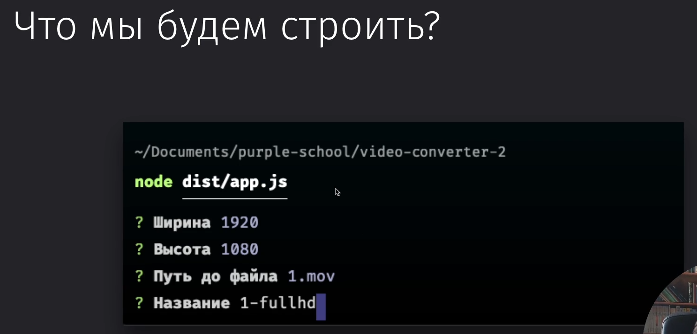
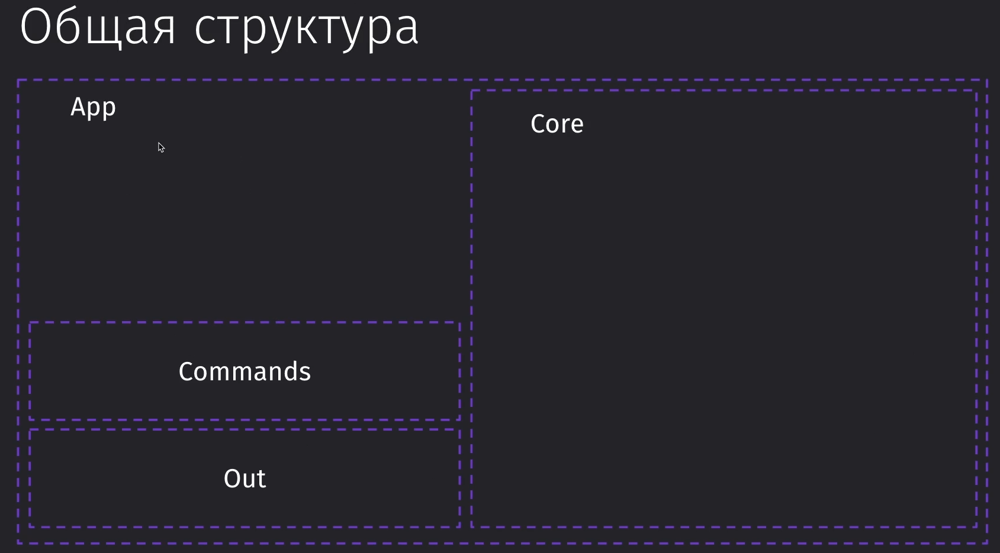
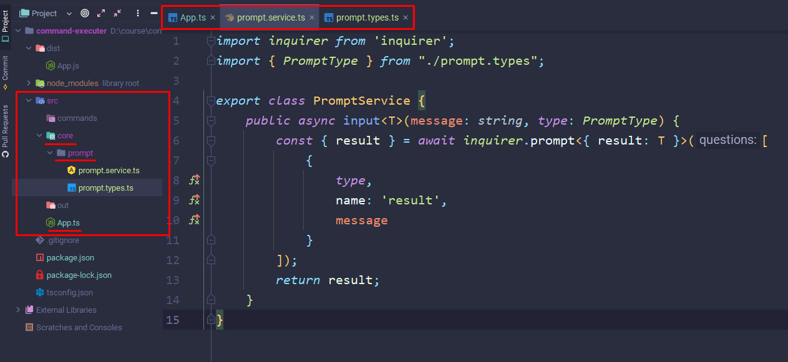
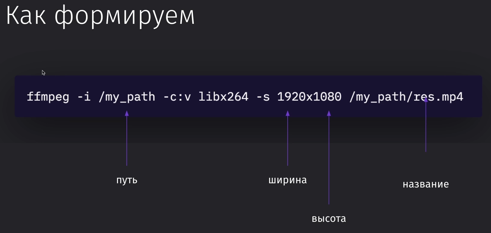
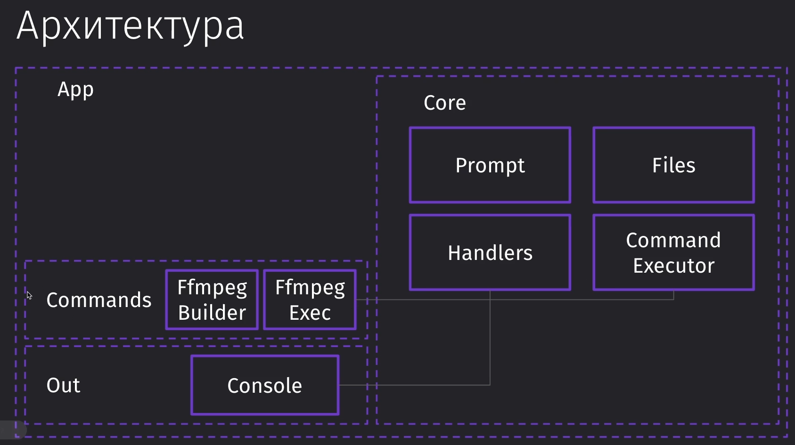

### 120 Вводное видео

С помощью [FFmpeg](https://ffmpeg.org/) будет реализована утилита для конвертирования видео в нужный формат

### 121 Обзор проекта

Основная проблема: чтобы написать конфиг для рендера видео в нужный нам формат, нужно потратить крайне много времени и сил


Поэтому хочется сделать простой интерфейс, в который мы зададим только основные параметры и получим на выходе нужное нам видео



И так же в самом перспективном варианте нужно будет сделать так, чтобы приложение под капотом выполняло и другие задачи пользователя по выбору (от других инструментов)


### 122 Наивная реализация

Первым делом нужно добавить библиотеку, которая позволит реализовать вывод нужных нам вопросов в консоль и получить эти данные

```bash
npm i inquirer
npm i @types/inquirer
```

И вот представлен пример реализации программы в 43 строчки кода. Это функция, которая принимает в себя в первой части ввод пользовательских данных, во второй выполняет саму внутреннюю логику, а в третьей выдаёт логи о результатах выполнения. 

Однако нужно ещё и сказать про большое количество неудобств, вызыванных такой быстрой реализацией:
1) У нас ограниченный набор настроек . В `res` мы задали их только под один конкретный случай - выбор разрешения у видео (без возможностей добавить то же сжатие)
2) Разделение зависимостей прямо внутри программы. У нас она состоит из получения данных от пользователя, обработки этих данных и логов
3) Изменение этих зависимостей. Если нам нужно изменить или дополнить логику для них (например, добавить уведомление в телеграм)

```TS
import { spawn } from 'child_process';  
import inquirer from 'inquirer';  
  
(async function convert() {  
    // ! Первая часть - пользовательский ввод  
    // Спросит про ввод ширины  
    const { result: width } = await inquirer.prompt([{  
        type: 'number',  
        name: 'result',  
        message: 'Ширина'  
    }]);  
    // Спросит про ввод высоты  
    const { result: height } = await inquirer.prompt([{  
        type: 'number',  
        name: 'result',  
        message: 'Высота'  
    }]);  
    // Вводим путь  
    const { result: path } = await inquirer.prompt([{  
        type: 'input',  
        name: 'result',  
        message: 'Путь'  
    }]);  
    // Спросит про название выходного файла  
    const { result: name } = await inquirer.prompt([{  
        type: 'input',  
        name: 'result',  
        message: 'Название'  
    }]);  
  
    // ! Вторая часть - логика программы  
    // Генерация самой команды для ffmpeg  
    // Spawn - нод-утилита для генерации процесса  
    const res = spawn('ffmpeg', [  
        '-i', path,  
        '-c:v', 'libx264',  
        '-s', `${width}x${height}`,  
        path + name + '.mp4'  
    ]);  

	// ! Третья часть - обработка параметров
    // Получаем чанк данных и выводим их в консоль  
    res.stdout.on('data', (data: any) => {  
        console.log(data.toString());  
    });  
    // Выводит сообщение об ошибке  
    res.stderr.on('data', (data: any) => {  
        console.log(data.toString());  
    });  
    // Выводит сообщение об окончании процесса  
    res.on('close', () => {  
        console.log('Готово');  
    });  
}());
```

>[!warning] Однако, если посмотреть на эту программу с точки зрения микросервиса, то нам будет просто необходимым добавление абстракций, потому что расширять проект будет просто невозможно без них

### 123 Старт приложения

>[!note] Если в голову сразу не приходит архитектура приложения, то сначала можно написать наивную реализацию этого приложения 

Будем использовать Template Method для реализации однотипных задач - работа с Ansible, FFmpeg и т.д.
Построение команды - builder


И на изображении показана структура проекта и его разделения. Всё будет собираться под одной оболочкой - App.



Создаём проект
```bash
mkdir command-executer // создаём папку
cd command-executer // переходим в неё

npm init // инициализируем проект в ноде

npm i -g typescript // устанавливаем ТС
tsc --init // инициализируем ТС

git init // Инициализируем гит
```
Добавляем гитигнор
```gitignore
/build  
/node_modules
```
Настраиваем пути компиляции
```json
//tsconfig
"rootDir": "./src",
"outDir": "./dist",
```
Устанавливаем пакет для работы с запросами
```bash
npm i inquirer
npm i -D @types/inquirer
```
Примерно так выглядит пакет


### 124 Обработка ввода

Примерно так выглядит проект на данном этапе реализации программы



И вот внутренний код

```TS
// prompt.types.ts
// Тут мы храним типы, которые будут использоваться в наших сервисах
export type PromptType = 'input' | 'number' | 'password';

// prompt.service.ts
// Тут мы будем реализовывать логику сервиса ввода данных 
import inquirer from 'inquirer';  
import { PromptType } from "./prompt.types";  
  
export class PromptService {  
	// Инпут делаем дженериком, чтобы мы могли точно сразу определить тип того значения, которое мы передаём в данную функцию
    public async input<T>(message: string, type: PromptType) {  
        const { result } = await inquirer.prompt<{ result: T }>([  
            {  
                type,  
                name: 'result',  
                message  
            }  
        ]);  
        return result;  
    }  
}


// App.ts
// Конкретно тут мы собираем всю нашу логику приложения и запускаем его
import { PromptService } from "./core/prompt/prompt.service";  
  
export class App {  
    async run() {  
        const result = await (new PromptService()).input<number>('Число', 'number');  
        console.log(result);  
    }  
}  
  
const app = new App();  
app.run();
```

### 125 Обработка вывода

Нам нужны типы ==node.js==

```bash
npm i -D @types/node
```

Код самого ввода:

```TS

// stream-logger.interface.ts
// Хранит интерфейс логгера потоков
export interface IStreamLogger {  
    log(...args: any[]): void;  
    error(...args: any[]): void;  
    end(): void;  
}

// stream.handler.ts
// Реализация ввода данных через node.js

import { IStreamLogger } from "./stream-logger.interface";  
import {ChildProcessWithoutNullStreams} from "child_process";  
  
export class StreamHandler {  
    constructor(private logger: IStreamLogger) {  }  

	// Конкретно тут поток имеет тип из ноды, а именно поток без отсутствующих значений
    processOutput(stream: ChildProcessWithoutNullStreams) {  
        stream.stdout.on('data', (data: any) => {  
            this.logger.log(data);  
        })  
  
        stream.stdout.on('data', (data: any) => {  
            this.logger.error(data);  
        })  
  
        stream.on('close', () => {  
            this.logger.end();  
        });  
    }  
}
```

### 126 Упражнение - Консольный вывод

Реализация консольного вывода в приложении. Тут так же можно дорасширить его, добавив вывод в телеграмме

```TS
import { IStreamLogger } from "../../core/handlers/stream-logger.interface";  
  
// Реализация вывода в приложении - реализован через синглтон  
export class ConsoleLogger implements IStreamLogger {  
    // Хранит инстанс класса  
    private static logger: ConsoleLogger;  
    // Возвращает инстанс класса  
    public static getInstance(): ConsoleLogger {  
        // Если его нет, то создаёт  
        if (!ConsoleLogger.logger) {  
            ConsoleLogger.logger = new ConsoleLogger();  
        }        // Если есть, то вернёт имеющийся  
        return ConsoleLogger.logger;  
    }  
  
    // Выводы результатов запросов:  
    end(): void {  
        console.log('Готово');  
    }  
  
    error(...args: any[]): void {  
        console.log(...args);  
    }  
  
    log(...args: any[]): void {  
        console.log(...args);  
    }  
  
}
```

### 127 Упражнение - Шаблонный метод исполнителя

Нам нужно реализовать абстрактный ==Command Executor==, который последовательно должен представлять выполнение четырёх действий: ввод, построение команды, запуск потока, обработка потока 

```TS
// command.types.ts
// Интерфейс комманд
export interface ICommandExec {  
    command: string;  
    args: string[];  
}

// command.executer.ts

import {IStreamLogger} from "../handlers/stream-logger.interface";  
import {ChildProcessWithoutNullStreams} from "child_process";  
import {ICommandExec} from "./command.types";  
  
export abstract class CommandExecutor<Input> {  
    constructor(private logger: IStreamLogger) {  
    }  
    public async execute() {  
        const input = await this.prompt();  
        const command = this.build(input);  
        const stream = this.spawn(command);  
        this.processStream(stream, this.logger);  
    }  
  
    protected abstract prompt(): Promise<Input>;  
  
    protected abstract build(input: Input): ICommandExec;  
  
    protected abstract spawn(command: ICommandExec): ChildProcessWithoutNullStreams;  
  
    protected abstract processStream(stream: ChildProcessWithoutNullStreams, logger: IStreamLogger): void;  
}

```

### 128 Упражнение - Builder для ffmpeg

Конкретно тут мы должны будем реализовать команду, которая будет содержать финализированный набор наших опций для отдельного элемента - ffmpeg-рендера

Конкретно нам нужно построить команду, которая будет хранить статичное значение и вводимые нами данные 



В конфиге тайпскрипта нам нужно отключить необходимость инициализировать значения через конструктор (для использования паттерна билдер)

```JSON
// typescript.config
"strictPropertyInitialization": false,
```

Этот класс будет отвечать за создание билдера запроса в ffmpeg на рендер видео

```TS
// ffmpeg.builder.ts
export class FfmpegBuilder {  
    private inputPath: string;  
    private options: Map<string, string> = new Map();  
  
    constructor() {  
        this.options.set('-c:v', 'libx264');  
    }  
  
    input(inputPath: string): this {  
        this.inputPath = inputPath;  
        return this;  
    }  
  
    setVideoSize(width: number, height: number): this {  
        this.options.set('-s', `${1920}x${1080}`);  
        return this;  
    }  
  
    output(outputPath: string): string[] {  
        if (!this.inputPath) {  
            throw new Error('Не задан input');  
        }        const args: string[] = ['-i', this.inputPath];  
        this.options.forEach((value, key) => {  
            args.push(key);  
            args.push(value);  
        });  
        args.push(outputPath);  
        return args;  
    }  
}
```

И в теории можно вызвать этот код так:

```TS
new FfmpegBuilder()  
    .input('')  
    .setVideoSize(1920, 1080)  
    .output('///');
```

### 129 Работа с файлами

Дальше нам нужно реализовать код, который будет выполнять сбор путей, их билд и спавн. 
Дальше мы сможем окончательно дореализовать ffmpeg

```TS
// file.service.ts

import { join, dirname, isAbsolute } from "path";  
import {promises} from "fs";  
  
export class FileService {  
    private async isExist(path: string): Promise<boolean> {  
        try{  
            await promises.stat(path);  
            return true;  
        } catch {  
            return false;  
        }    
    }  
  
    public getFilePath(path: string, name: string, extension: string): string {  
        if (!isAbsolute(path)) {  
            path = join(__dirname + '/' + path);  
        }        return join(dirname(path) + '/' + name + '.' + extension);  
    }  
  
    async deleteFileIfExists(path: string, name: string) {  
        if (await this.isExist(path)) {  
            promises.unlink(path);  
        }    
    }  
}
```

### 130 Упражнение - Ffmpeg executor

И дальше нам нужно реализовать executer, который будет исполнять наши логи

```TS
// ffmpeg-types.ts
import {ICommandExec} from "../../core/executor/command.types";  
  
export interface IFfmpegInput {  
    width: number;  
    height: number;  
    path: string;  
    name: string;  
}  
  
export interface ICommandExecFfmpeg extends ICommandExec {  
    output: string;  
}


// ffmpeg.executer.ts

import {CommandExecutor} from "../../core/executor/command.executor";  
import {IFfmpegInput, ICommandExecFfmpeg} from "./ffmpeg-types";  
import {IStreamLogger} from "../../core/handlers/stream-logger.interface";  
import {FileService} from "../../core/files/file.service";  
import {PromptService} from "../../core/prompt/prompt.service";  
import {ChildProcessWithoutNullStreams, spawn} from "child_process";  
import {FfmpegBuilder} from "./ffmpeg.builder";  
import {StreamHandler} from "../../core/handlers/stream.handler";  
  
export class FfmpegExecutor extends CommandExecutor<IFfmpegInput> {  
    private fileService: FileService = new FileService();  
    private promptService: PromptService = new PromptService();  
  
    constructor(logger: IStreamLogger) {  
        super(logger);  
    }  
  
    // Вызов ввода  
    protected async prompt(): Promise<any> {  
        const width = await this.promptService.input<number>('Ширина', 'number');  
        const height = await this.promptService.input<number>('Высота', 'number');  
        const path = await this.promptService.input<string>('Путь до файла', 'input');  
        const name = await this.promptService.input<string>('Имя файла', 'input');  
  
        return {width, height, path, name};  
    }  
  
    protected build({ width, height, path, name }: IFfmpegInput): ICommandExecFfmpeg {  
        const output = this.fileService.getFilePath(path, name, 'mp4');  
        const args = (new FfmpegBuilder())  
            .input(path)  
            .setVideoSize(width, height)  
            .output(output);  
        return { command: 'ffmpeg', args, output }  
    }  
    protected spawn({ output, command, args}: ICommandExecFfmpeg): ChildProcessWithoutNullStreams {  
        this.fileService.deleteFileIfExists(output);  
        return spawn(command, args);  
    }  
  
    protected processStream(stream: ChildProcessWithoutNullStreams, logger: IStreamLogger): void {  
        const handler = new StreamHandler(logger);  
        handler.processOutput(stream);  
    }  
}
```

### 131 Финал проекта

Вот так в конечном итоге выглядит архитектура проекта:



Это структура нашего проекта:
- Все вызываемые команды (ffmpeg, dir) находятся в commands
- Вся основная реализация проекта (идентичная для всех команд) находится в папке ==core== 
- В ==out== располагается инструмент вывода у программы
- Через ==App.ts== у нас идёт запуск проекта (==App.js== нужно врубать в консоли)


Вот так выглядит ==App.ts==, через который вызывается весь наш проект:

```TS
// App.ts
import {FfmpegExecutor} from "./commands/ffmpeg/ffmpeg.executor";  
import {ConsoleLogger} from "./out/console-logger/console-logger";
  
  
export class App {  
    async run() {  
        await new FfmpegExecutor(ConsoleLogger.getInstance()).execute(); 
        }  
}  
  
const app = new App();  
app.run();
```


Так же очень легко можно дописать дополнительную реализацию Dir-утилиты

```TS
// dir.types.ts

export interface DirInput {  
    path: string;  
}

// dir.builder.ts

export class DirBuilder {  
    private options: Map<string, string> = new Map();  
  
    detailOutput() {  
        this.options.set('-l', '');  
        return this;  
    }  
  
    output(): string[] {  
        const args: string[] = [];  
        this.options.forEach((value, key) => {  
            args.push(key);  
            args.push(value);  
        });  
        return args;  
    }  
}

// dir.executor.ts

import {CommandExecutor} from "../../core/executor/command.executor";  
import {DirInput} from "./dir.types";  
import {PromptService} from "../../core/prompt/prompt.service";  
import {IStreamLogger} from "../../core/handlers/stream-logger.interface";  
import {ICommandExec} from "../../core/executor/command.types";  
import {ChildProcessWithoutNullStreams, spawn} from "child_process";  
import {DirBuilder} from "./dir.builder";  
import {StreamHandler} from "../../core/handlers/stream.handler";  
  
export class DirExecutor extends CommandExecutor<DirInput> {  
    private promptService: PromptService = new PromptService();  
  
    constructor(logger: IStreamLogger) {  
        super(logger);  
    }  
  
    protected build({path}: DirInput): ICommandExec {  
        const args = (new DirBuilder()).detailOutput().output();  
        return { command: 'ls', args: args.concat(path) };  
    }  
  
    protected processStream(stream: ChildProcessWithoutNullStreams, output: IStreamLogger): void {  
        const handler = new StreamHandler(output);  
        handler.processOutput(stream);  
    }  
  
    protected async prompt(): Promise<DirInput> {  
        let path = await this.promptService.input<string>('Путь', 'input');  
        return { path };  
    }  
  
    protected spawn({command: command, args}: ICommandExec): ChildProcessWithoutNullStreams {  
        return spawn(command, args);  
    }  
}
```

Вот так выглядит изменённый ==App.ts==, в котором находится вызов теперь не FFmpeg, а Dir-утилиты

```TS
// App.ts
import {ConsoleLogger} from "./out/console-logger/console-logger";  
import {DirExecutor} from "./commands/dir/dir.executor";  
  
  
export class App {  
    async run() {  
        // Либо мы можем подставить реализацию другой логики при первой необходимости  
        await new DirExecutor(ConsoleLogger.getInstance()).execute();  
    }  
}  
  
const app = new App();  
app.run();
```

И вот так коротко выглядят эти различные команды:

