# From Elementary to Intermediate

## **1** **Урок** **-** **глаголы** **Have and Be**

- be имеет три основные формы: am (I), is (единственное число), are (множественное число)

You – в грамматических конструкциях всегда является множественным числом (даже при обращении к одному человеку)

В самом низу представлены полные ответы на вопросы, которые являются частью вежливого тона\

Для построения вопросительного предложения меняют местами You are(be)! на Are you?

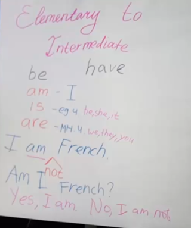
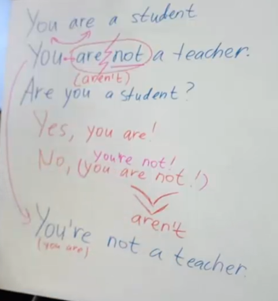
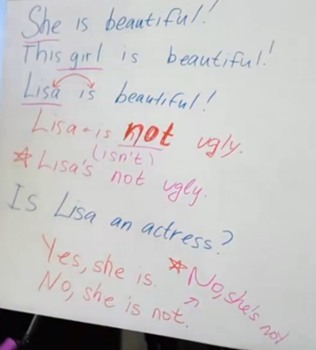

Выбираем, что использовать по числу, которое обозначает be

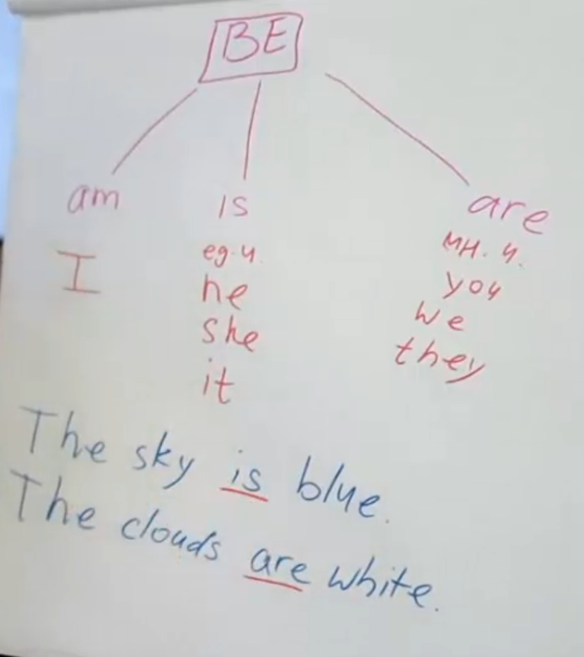

Дальше у нас идёт Have

Он подразделяется на Have (I и мн.ч.) и Has (ед. ч.)

Have дружит с do, а has находится в одной лодке с does, но не употребляется вместе с ним

Has не может находиться в одном предложении с does (они не любят друг друга). Поэтому всё влияние на себя обычно забирает does, когда нужно использовать глагол и вместе с does идёт have (так как ему не нужно теперь трансформироваться)

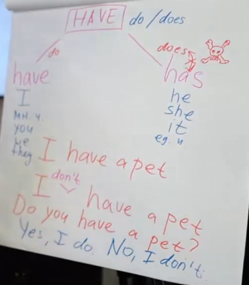
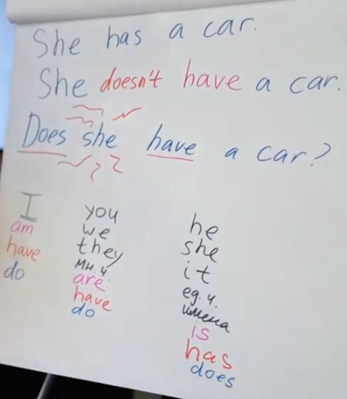

1 - A. Форма в 1 лице. ед числа глагола TO BE = AM (I am).

2 - C. Форма 2 лица и ед., и мн числа глагола TO BE = ARE (You are).

3 - B. Форма 3 лица. ед числа (he, she, it) глагола TO BE = IS (He/She/ It is).

4 - B. Форма 3 лица ед. числа  (he, she, it) глагола TO BE = IS (He/She/ It is).

5 - C. Форма 3 лица мн. числа (they) глагола TO BE = ARE (They are).

6 - B. Форма 3 лица мн. числа (they) глагола TO BE = ARE (They are).

7 - A. Форма 2 лица ед. и мн. числа (you) глагола TO BE = ARE (You are). Мы ставим глагол TO BE перед подлежащим в вопросительных предложениях.

8 - B. Форма 3 лица ед. числа глагола TO BE = IS. Мы ставим глагол TO BE перед подлежащим в вопросительных предложениях.

9 - A. Форма 1 лица ед. числа глагола TO BE = AM (I am).  Отрицание глагола TO BE = I am not/ I’m not.

10 - A. Форма 1 лица мн. числа (we) глагола TO BE = ARE (They are). Мы ставим глагол TO BE перед подлежащим в вопросительных предложениях.

11 - B. Форма 1 лица ед. числа (I) глагола TO HAVE = HAVE/ HAVE GOT (British version).

12 - B. Структура предложений с отрицанием = Подлежащее + DO/DOES + NOT + HAVE (Подлеж. + HAVE/ HAS + NOT + GOT British). Форма глагола TO HAVE 3 лица ед. числа = HAS (DOESN’T/ HASN’T GOT).

13 - A. Форма 3 лица мн. числа (they) глагола TO HAVE = HAVE/ HAVE GOT (British version).

14 - B. Структура вопроса = DO/DOES + подлежащее +  HAVE (HAVE/HAS + подлеж. + GOT British). Форма глагола TO HAVE для 1 лица мн. числа = HAVE (Do we have/ Have we got).

15 - C. Структура вопроса = DO/DOES + подлежащее+ HAVE (HAVE/HAS + подлеж. + GOT British). Форма глагола TO HAVE для 3 лица ед. числа = HAS (DOES HE HAVE/ HAS HE GOT).

16 - B. Структура вопроса = DO/DOES + подлежащее + HAVE (HAVE/HAS + подлеж. + GOT British). Форма глагола TO HAVE для 2 лица мн. и ед. числа= HAVE (Do you have/ Have you got). Форма 3 лица ед. числа глагола TO BE = IS.

17 - A. Структура вопросительного предложения = DO/DOES + subject + HAVE (HAVE/HAS + subject + GOT British). Глагол TO HAVE  для 2 лица ед. и мн. числа  = HAVE (Do you have/ Have you got).  Форма глагола TO BE  для 1 лица ед. числа = AM (I am).

18 - B. Структура негативного предложения = Subject + DO/DOES + NOT + HAVE (Subject + HAVE/ HAS + NOT + GOT British).  Глагол TO HAVE для 3 лица ед. числа = HAS (DOESN’T/ HASN’T GOT). Форма 3 лица ед. числа глагола TO BE = IS.

19 - B. Форма глагола TO HAVE для второго лица мн. и ед. числа= HAVE (Do you have/ Have you got). Форма 3 лица ед. числа глагола TO BE = IS.

20 - A. Структура вопроса = DO/DOES + субъект + HAVE (HAVE/HAS + subject + GOT British).  Форма глагола TO HAVE в 3 лице ед. числа = HAS (DOES HE HAVE/ HAS HE GOT).

## **2 Урок – артикли**

## **3 Урок - новые слова**

## **4 Урок - описываем внешность**

## **5 Урок - present simple**

## **6 Урок – повседневность**

## **7 Урок - present progressive**

## **8 Урок - хобби, спрорт, досуг**

## **9 Урок - произношение**

## **10 Урок - что ещё за There is**

## **11 Урок - порядок слов в предложении**

## **12** **Урок** **–** **интонация**

## **13** **Урок** **- future Simple, To Be Going To**

## **14 Урок - Past Simple**

## **15 Урок - Неправильные глаголы**

## **16** **Урок** **- Past Progressive**

## **17** **Урок** **- Present Perfect**

## **18 Урок - Как учиться**

## **19 Урок - Модальные глаголы**

## **20 Урок - Предлоги места**

## **21 Урок - Предлоги времени**

## **22 Урок - Фразовые глаголы**

## **23 Урок - Что делать в непонятной ситуации**

## **24 Урок - Степени сравнения прилагательных**

## **25 Урок - Used toget used tobe used to**

## **26 Урок - Языковой барьер**

## **27 Урок - Условные наклонения**

## **28 Урок - Страдательный залог**

## **29 Урок - ТОП 10 идиом**

## **30 Урок  - Заключительное занятие**

## **Стрим 2. Elementary2Intermediate. Заключительная трансляция**

## **памятки + трекер**

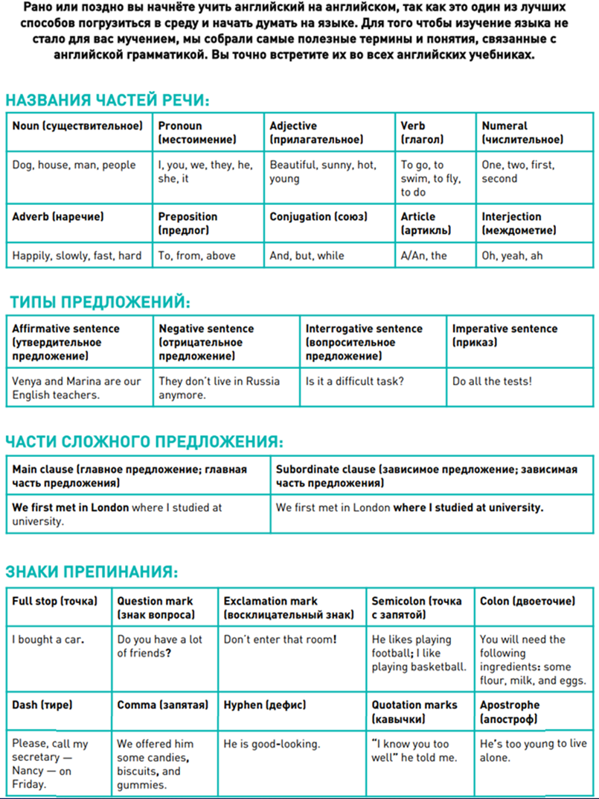

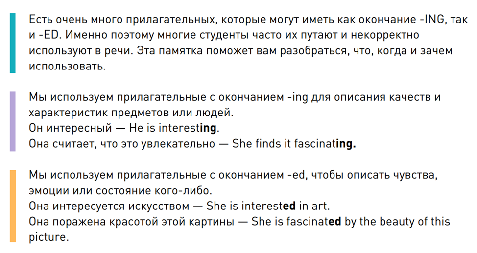

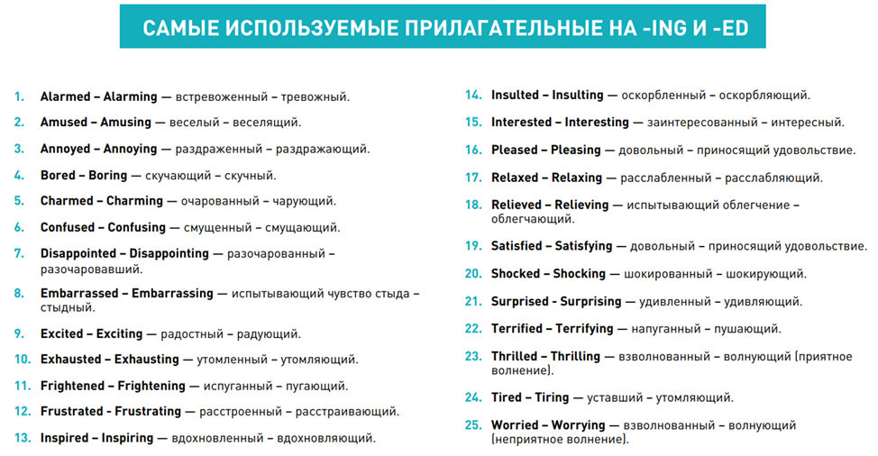

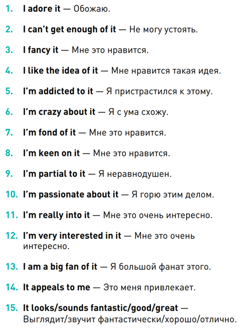

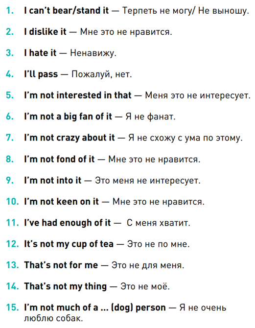