#Patterns #SOLID 

### Введение

Паттерны, принципы, архитектура - это инструменты, которые позволяют разработчикам общаться на одном и том же языке. Определённая архитектура позволяет быстрее въехать разработчику в проект, так как она диктует общие принципы и правила, по которым мы пишем приложение. 
Все эти парадигмы позволяют нам строить системы примерно похоже. Очень многие ошибки начинают сходиться и повторяться, отчего их проще находить и исправлять

Мир без паттернов можно представить так: мы каждый раз выводим формулу для решения определённой задачи, вместо того, чтобы использовать определённый алгоритм решения собственно этой задачи

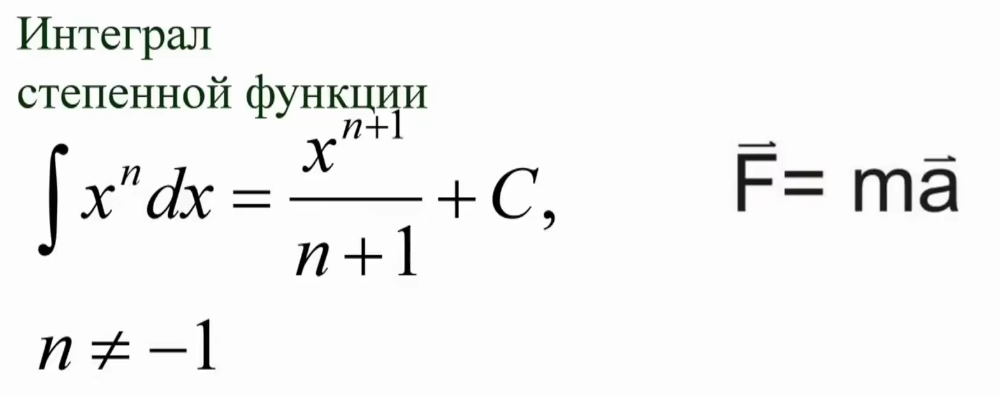


Однако за нас эти формулы уже вывели и нам не нужно этого делать. Мы просто открываем формулы и используем их для решения задачи


Паттерны помогают нам творить хороший и чистый код

Кодовая база будет считаться хорошей, если она:
1) Масштабируема и в неё легко вносить изменения
2) Легко вникаема другими людьми
3) Имеет простой код

Принципы SOLID:


### SRP (Single Resposibility Principle)

> Это принцип, при котором мы назначаем одной сущности (классу, функции) ровно одну задачу 

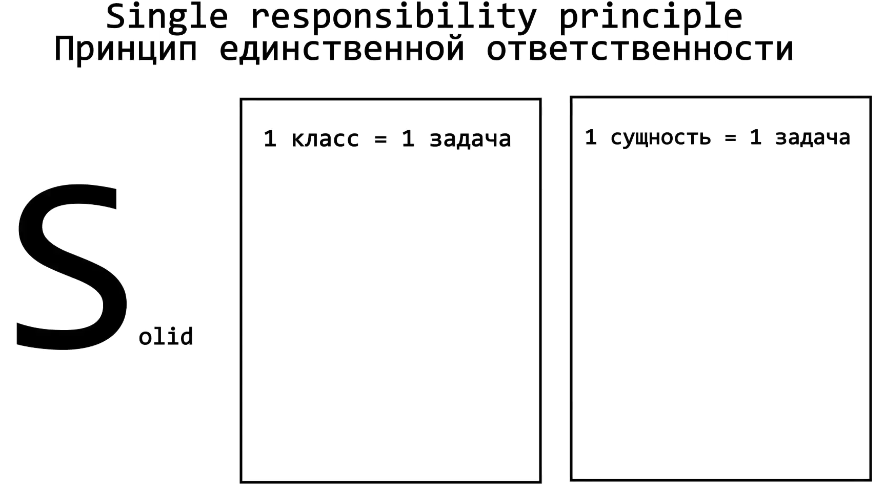

Представим, что у нас есть система, которая имеет свои данные и она должна уметь сохранять себя, отправлять свои данные, печатать их, логировать и так далее. Если писать всё в одном классе, то дополнять систему в будущем и править её не будет представляться возможным - система станет кашей, которую невозможно будет править и поддерживать, а нововведения от заказчика станут недобавляемы

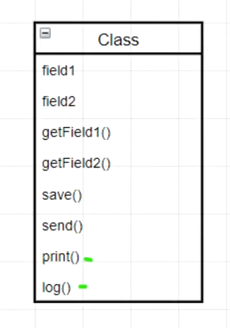

Поэтому нам нужно будет делить модель данных и поведение сущности

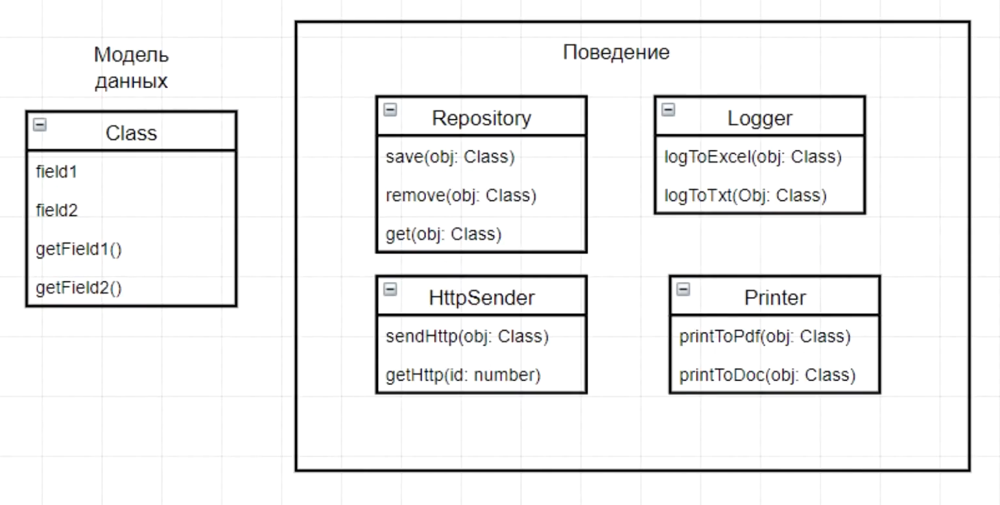

И вот самый простой пример: в первом случае, весь функционал пользователя находится в нём самом, а во втором мы вынесли логику в другие классы

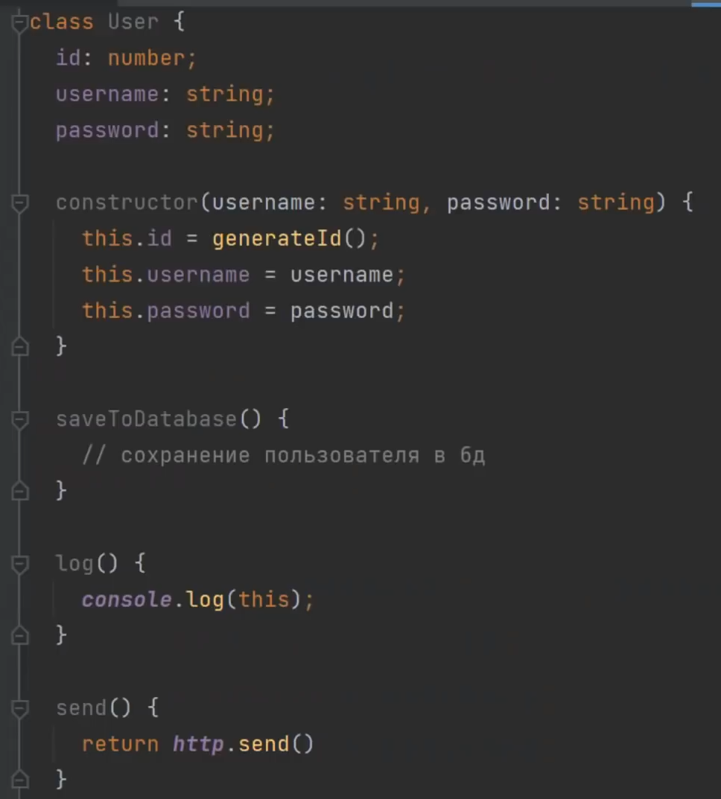

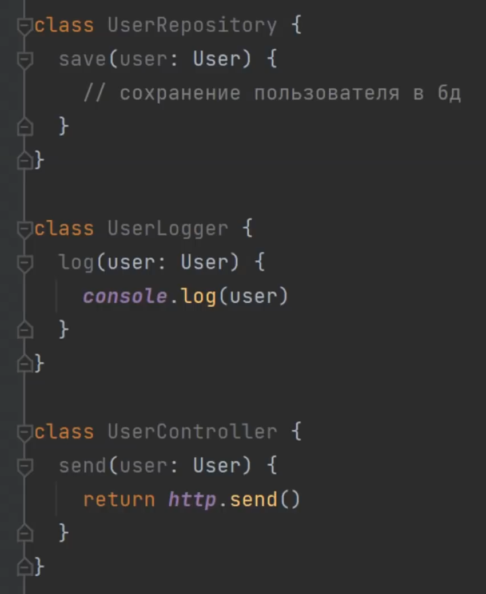

Весь код:

```TS
const http = {send: () => ({})};

const generateId = () => Date.now() * Math.random();

class User {
  id: number;
  username: string;
  password: string;

  constructor(username: string, password: string) {
    this.id = generateId();
    this.username = username;
    this.password = password;
  }
}

class UserRepository {
  save(user: User) {
    // сохранение пользователя в бд
  }
}

class UserLogger {
  log(user: User) {
    console.log(user)
  }
}

class UserController {
  send(user: User) {
    return http.send()
  }
}
```

Либо вот пример с `DataFetcher`, который реализует в себе использование большого числа отдельных методов

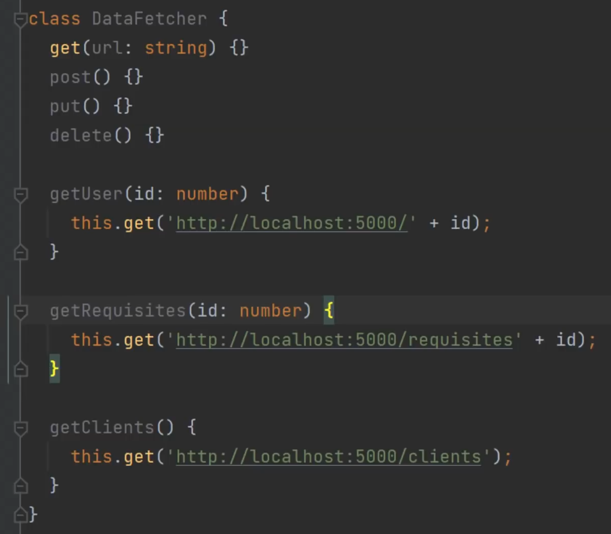

В идеальном варианте, стоит сделать отдельный класс, который будет выполнять всю избыточную логику класса

```TS
class HttpClient {
  get(url: string) {}
  post() {}
  put() {}
  delete() {}
}

class UserService {
  client: HttpClient;
  constructor(client) {
      this.client = client;
  }
  getOneUser(id: number) {}
  getAllUsers() {}
}

class RequisitesService {
  createRequisites() {}
  getRequisites() {}
  updateRequisites() {}
}
```

###### Примеры на фронте

Мы имеем компонент, который отвечает за отрисовку формы отправки реквизитов

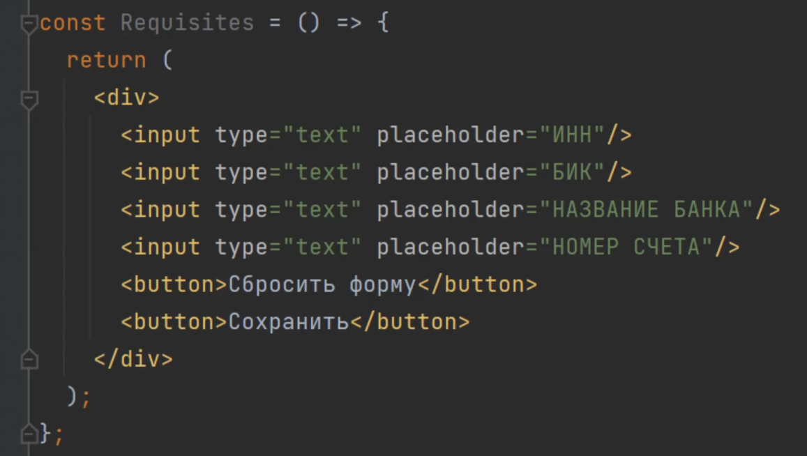

Далее в него мы добавляем функционал по отправке реквизитов, обнулению формы и валидации данных.
Пока всё нормально, так как вся вложенная логика относится к одной форме

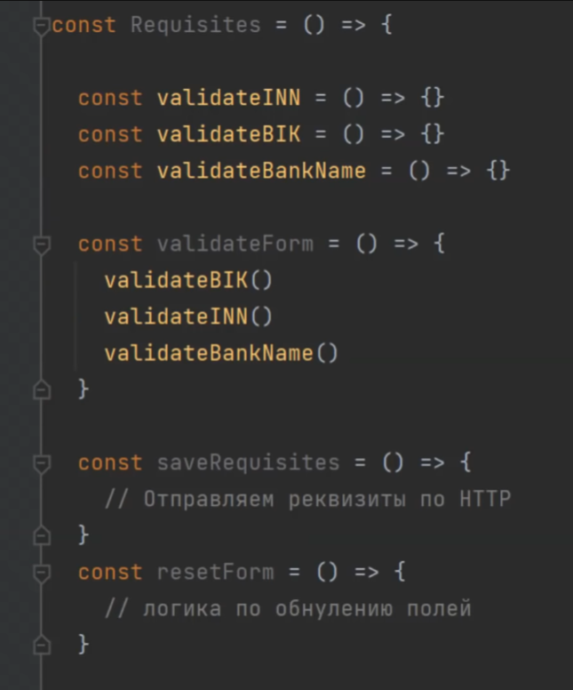

И далее нам приходит задача обрабатывать одним способом русские реквизиты и иностранные, что требует от нас проверку компонента на разные локали

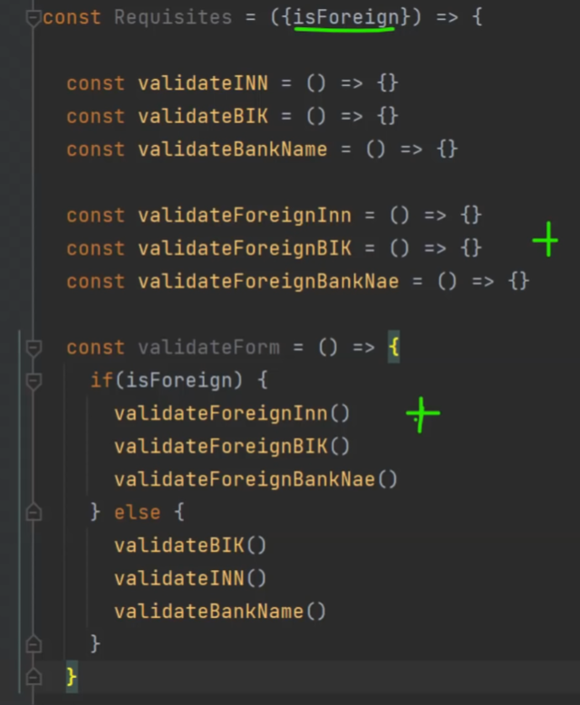

Для более правильной реализации данной задачи нужно вынести логику функций в отдельные модули

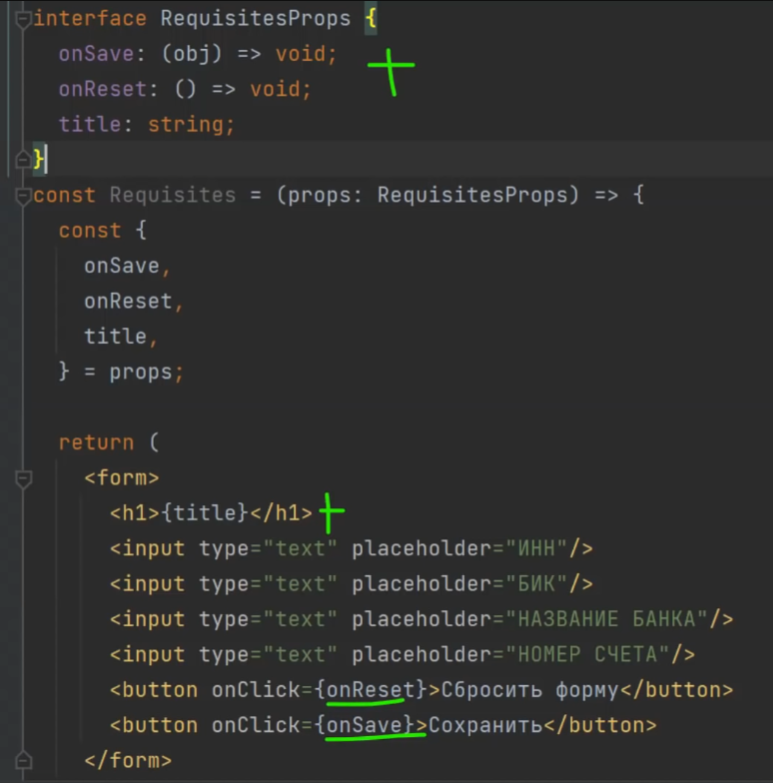

И уже из этих модулей вызывать нашу форму с подходящими функциями

Такой способ позволит сохранить подход единственной ответственности в приложении

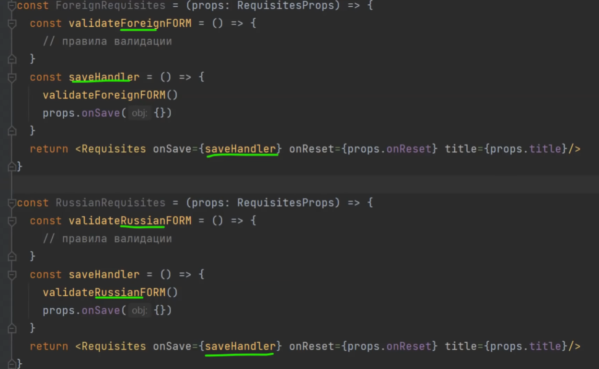

А сюда мы выносим отдельное создание реквизитов под разные локали

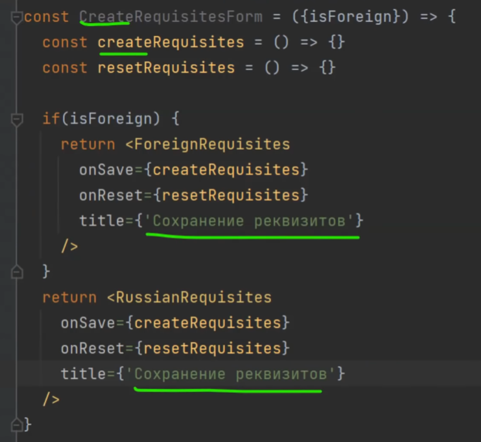

Полный код:

```TSX
import React from 'react';

interface RequisitesProps {
  onSave: (obj) => void;
  onReset: () => void;
  title: string;
}
const Requisites = (props: RequisitesProps) => {
  const {
    onSave,
    onReset,
    title,
  } = props;

  return (
    <form>
      <h1>{title}</h1>
      <input type="text" placeholder="ИНН"/>
      <input type="text" placeholder="БИК"/>
      <input type="text" placeholder="НАЗВАНИЕ БАНКА"/>
      <input type="text" placeholder="НОМЕР СЧЕТА"/>
      <button onClick={onReset}>Сбросить форму</button>
      <button onClick={onSave}>Сохранить</button>
    </form>
  );
};

const ForeignRequisites = (props: RequisitesProps) => {
  const validateForeignFORM = () => {
    // правила валидации
  }
  const saveHandler = () => {
    validateForeignFORM()
    props.onSave({})
  }
  return <Requisites onSave={saveHandler} onReset={props.onReset} title={props.title}/>
}

const RussianRequisites = (props: RequisitesProps) => {
  const validateRussianFORM = () => {
    // правила валидации
  }
  const saveHandler = () => {
    validateRussianFORM()
    props.onSave({})
  }
  return <Requisites onSave={saveHandler} onReset={props.onReset} title={props.title}/>
}

const CreateRequisitesForm = ({isForeign}) => {
  const createRequisites = () => {}
  const resetRequisites = () => {}

  if(isForeign) {
    return <ForeignRequisites
      onSave={createRequisites}
      onReset={resetRequisites}
      title={'Сохранение реквизитов'}
    />
  }
  return <RussianRequisites
    onSave={createRequisites}
    onReset={resetRequisites}
    title={'Сохранение реквизитов'}
  />
}

const updateRequisitesForm = ({isForeign}) => {
  const updateRequisites = () => {}
  const resetRequisites = () => {}

  if(isForeign) {
    return <ForeignRequisites
      onSave={updateRequisites}
      onReset={resetRequisites}
      title={'Обновление реквизитов'}
    />
  }
  return <RussianRequisites
    onSave={updateRequisites}
    onReset={resetRequisites}
    title={'Обновление реквизитов'}
  />
}
```

> [!success] Преимущества подхода:
> - Избавление от антипаттерна GodObject
> - Приложение разбивается на отдельные модули (декомпозиция), что приводит к лучшей читабельности
> - Логика выполнения определённых операций инкапсулируется в определённых функциях, что так же упрощает написание тестов
> - Становится легче вносить изменения в проект

### OCP (Opened-Closed Principle)

> Все программные сущности (классы, компоненты, модули, сущности) должны быть открыты для расширения, но закрыты для изменения

Мы должны добавлять новый функционал за счёт добавления новой сущности, которая будет посредством определённой логики связана с другой сущностью

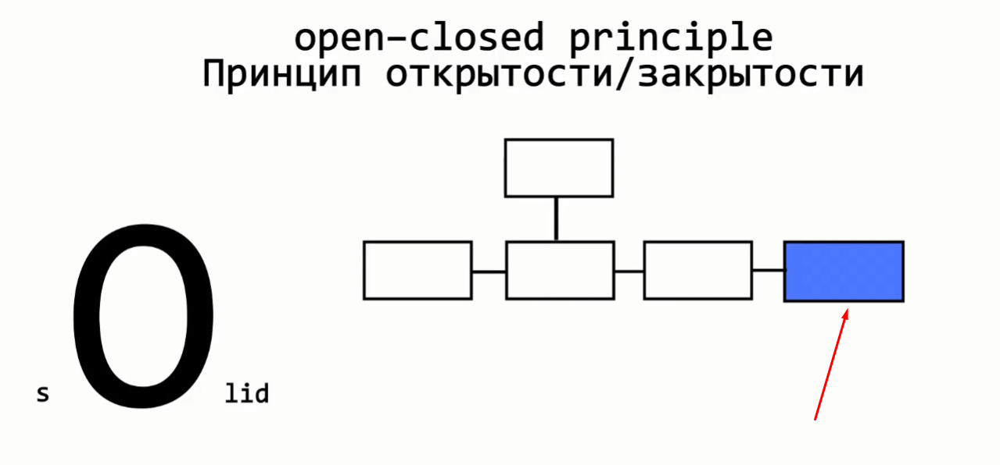

###### Первый пример

У нас есть персонаж, который принимает в себя имя и оружие, а так же вызывает функцию из оружия 

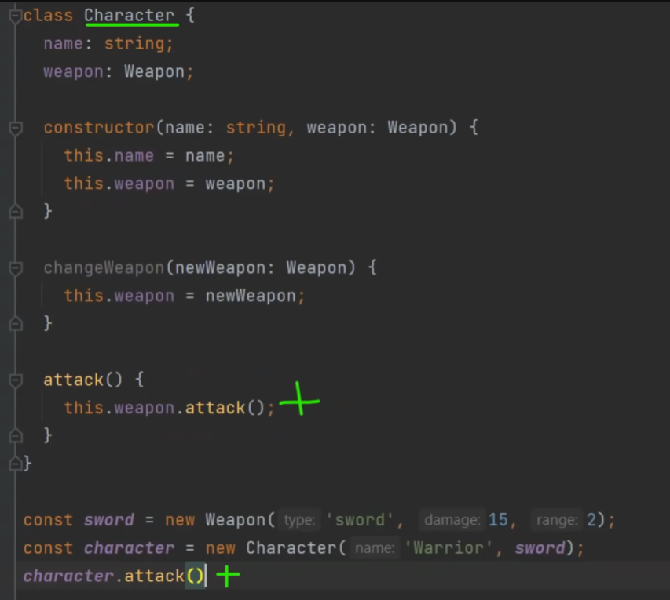

Само оружие хранит в себе характеристики и атаку 

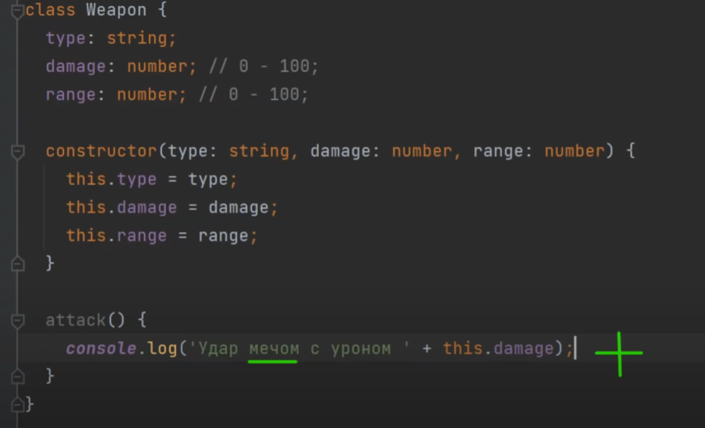

Вывод:

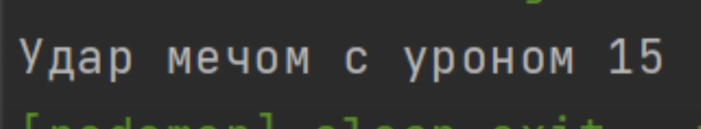

Однако, если мы столкнёмся с тем, что нам нужно будет добавить несколько оружий, то уже придётся городить разные условия

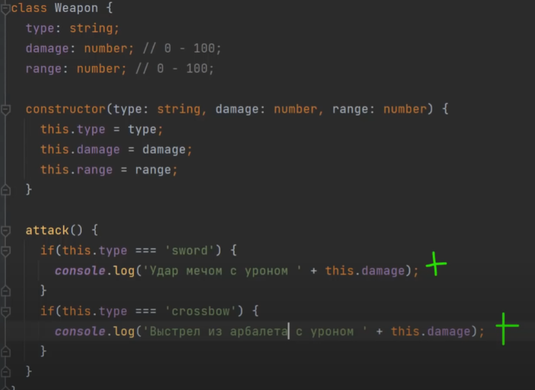

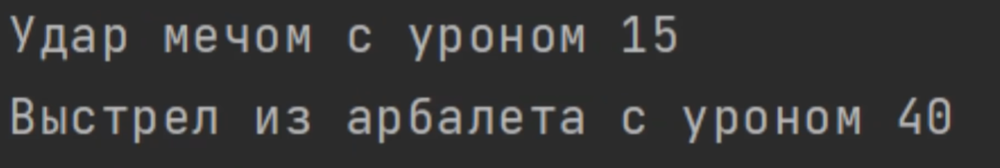

Чтобы вынести логику отдельного метода, можно имплементировать нужные методы через интерфейс

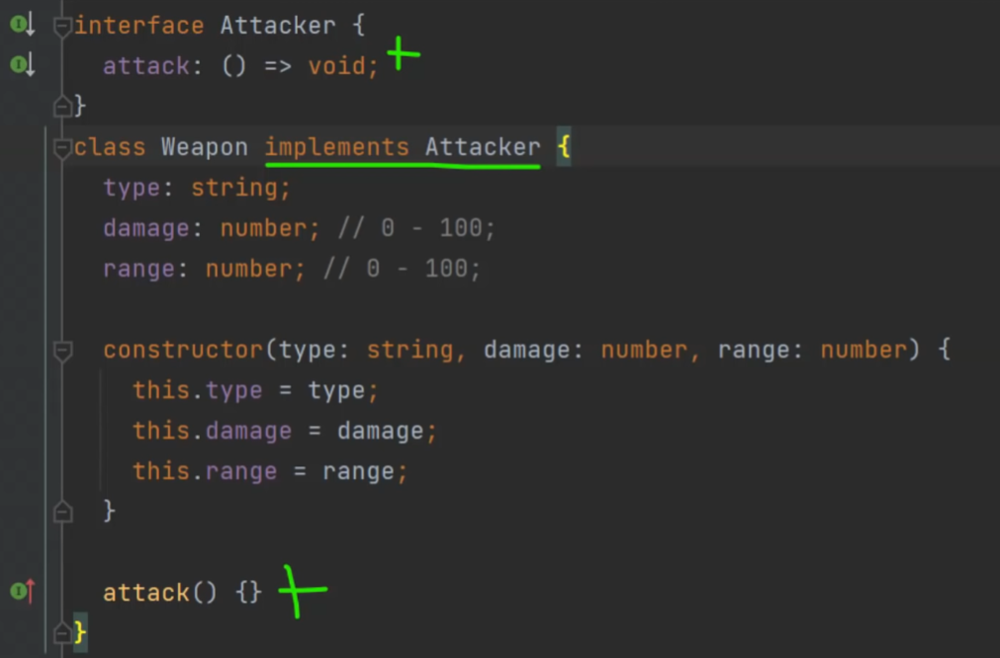

И экстендить исходящие классы оружия от родительского, чтобы наследовать функционал

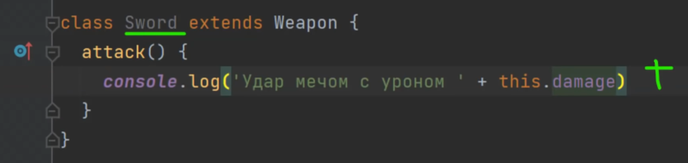

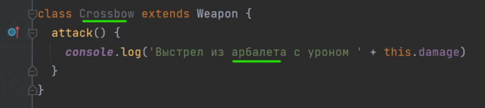

Теперь можно удалить выбор типа из конструктора

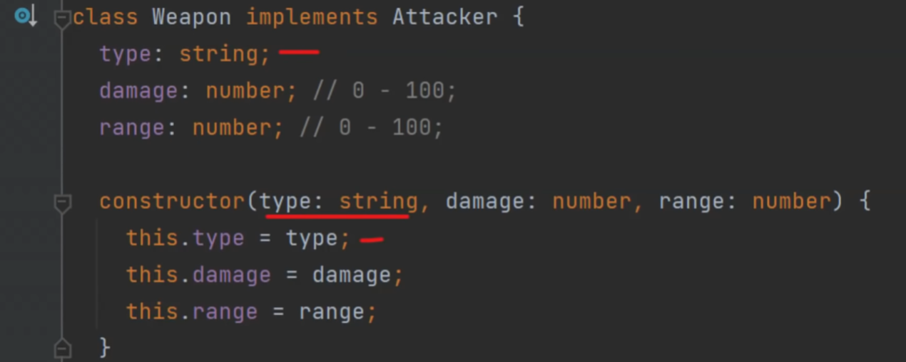

И создаём новое оружие через отдельный класс 

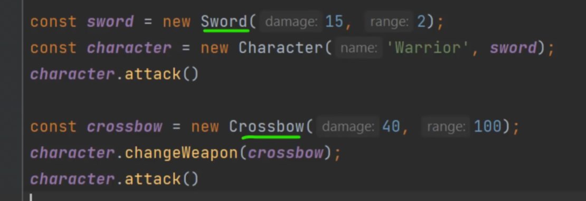

Полный код:

```TS
interface Attacker {
  attack: () => void;
}
class Weapon implements Attacker {
  damage: number; // 0 - 100;
  range: number; // 0 - 100;

  constructor( damage: number, range: number) {
    this.damage = damage;
    this.range = range;
  }

  attack() {}
}

class Sword extends Weapon {
  attack() {
    console.log('Удар мечом с уроном ' + this.damage)
  }
}

class Crossbow extends Weapon {
  attack() {
    console.log('Выстрел из арбалета с уроном ' + this.damage)
  }
}

class Knife extends Weapon {
  attack() {
    console.log('Удар ножом с уроном ' + this.damage)
  }
}

class Character {
  name: string;
  weapon: Weapon;

  constructor(name: string, weapon: Weapon) {
    this.name = name;
    this.weapon = weapon;
  }

  changeWeapon(newWeapon: Weapon) {
    this.weapon = newWeapon;
  }

  attack() {
    this.weapon.attack();
  }
}

const sword = new Sword(15, 2);
const character = new Character('Warrior', sword);
character.attack()

const crossbow = new Crossbow(40, 100);
character.changeWeapon(crossbow);
character.attack()
```

###### Второй пример

Мы имеем два класса: персонаж и список персонажей

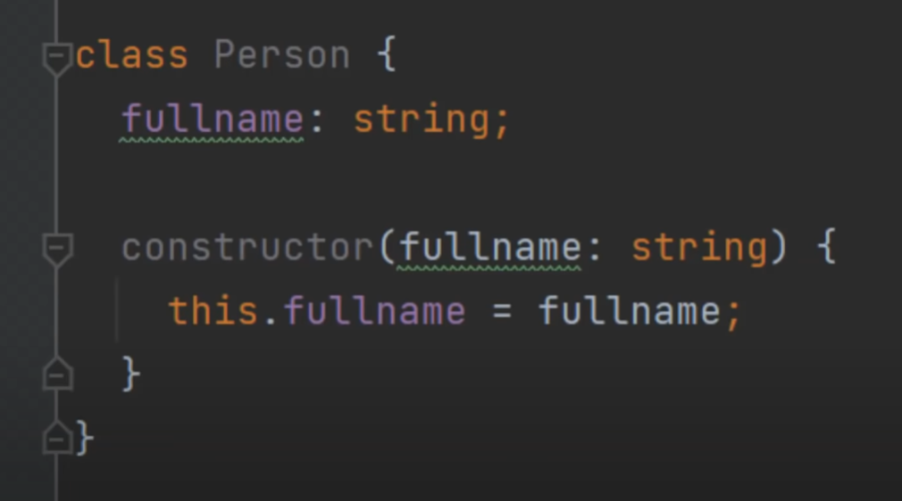

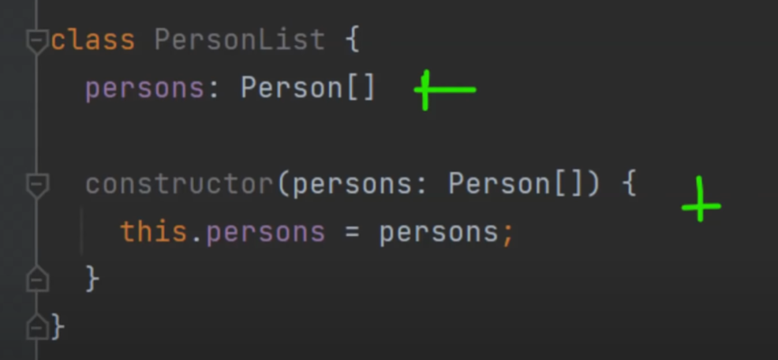

А так же имеем три типа сортировок списков

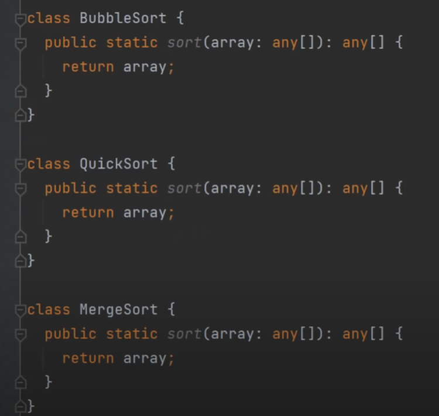

Данные методы сортировки мы применяем в разных случаях, чтобы оптимизировать работу кода

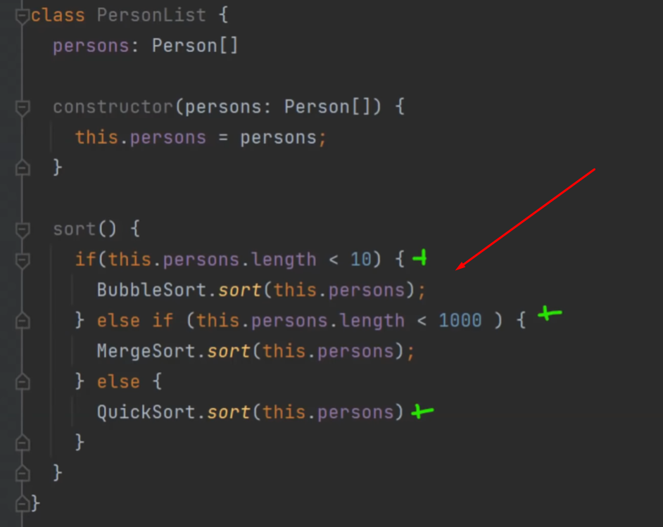

Так же у нас имеется список музыки, который так же сортируется в зависимости от размера массива

Тут мы сталкиваемся с такой проблемой, что мы дублируем код условия

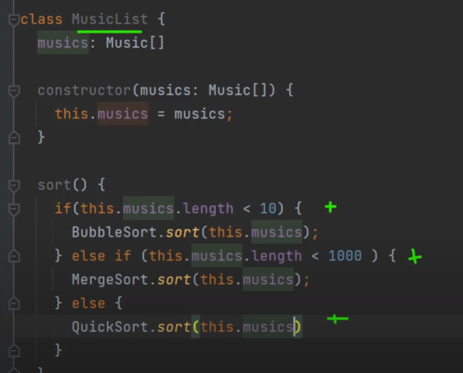

Первое, что мы должны сделать, чтобы привести все связанные классы к одному родителю - это создать базовый класс

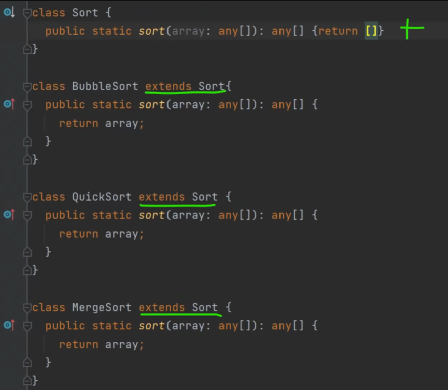

Далее мы создаём клиент, который будет сам определять, какую сортировку от массива применять

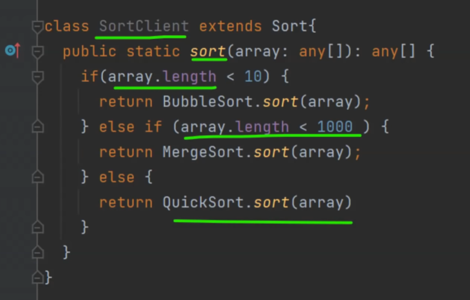

И теперь сортировку за нас выполняет отдельный клиент, который инкапсулировал в себе логику выполнения

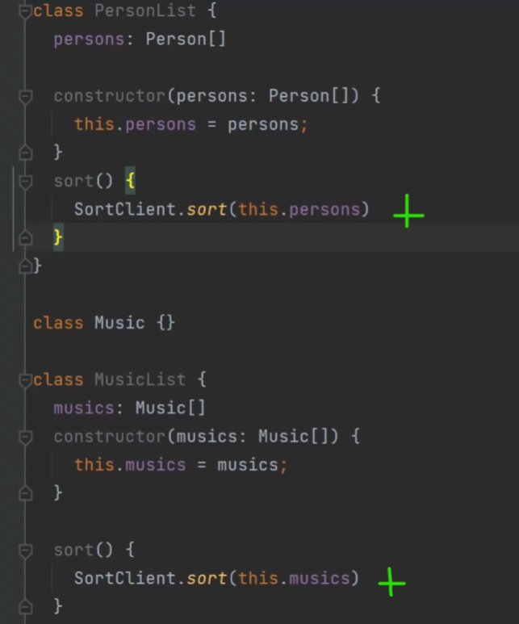

Полный код:

```TS
class Sort {
  public static sort(array: any[]): any[] {return []}
}

class BubbleSort extends Sort{
  public static sort(array: any[]): any[] {
    return array;
  }
}

class QuickSort extends Sort {
  public static sort(array: any[]): any[] {
    return array;
  }
}

class MergeSort extends Sort {
  public static sort(array: any[]): any[] {
    return array;
  }
}

class SortClient extends Sort{
  public static sort(array: any[]): any[] {
    if(array.length < 10) {
      return BubbleSort.sort(array);
    } else if (array.length < 1000 ) {
      return MergeSort.sort(array);
    } else {
      return QuickSort.sort(array)
    }
  }
}

class Person {
  fullname: string;

  constructor(fullname: string) {
    this.fullname = fullname;
  }
}

class PersonList {
  persons: Person[]

  constructor(persons: Person[]) {
    this.persons = persons;
  }
  sort() {
    SortClient.sort(this.persons)
  }
}

class Music {}

class MusicList {
  musics: Music[]
  constructor(musics: Music[]) {
    this.musics = musics;
  }

  sort() {
    SortClient.sort(this.musics)
  }
}
```

Либо приведём подобный пример на фронте:

```TSX
import React from "react";

interface RequisitesProps {
  onSave: (obj) => void;
  onReset: () => void;
  title: string;
}
const Requisites = (props: RequisitesProps) => {
  const {
    onSave,
    onReset,
    title,
  } = props;

  return (
    <form>
      <h1>{title}</h1>
      <input type="text" placeholder="ИНН"/>
      <input type="text" placeholder="БИК"/>
      <input type="text" placeholder="НАЗВАНИЕ БАНКА"/>
      <input type="text" placeholder="НОМЕР СЧЕТА"/>
      <button onClick={onReset}>Сбросить форму</button>
      <button onClick={onSave}>Сохранить</button>
    </form>
  );
};

const ForeignRequisites = (props: RequisitesProps) => {

  return (
    <div>
      <input type="text" placeholder="SWIFT"/>
      <input type="text" placeholder="KPP"/>
      <input type="text" placeholder=""/>
      <Requisites
        onSave={}
        onReset={}
        title={}
      />
    </div>
  )
}
```

> [!success] Основные плюсы данного подхода:
>  - Отпадает потребность в регрессионном тестировании (e2e)
>  - Падает вероятность ошибок

### LSP (Liskov Substitution Principle)

> Функции и сущности, которые используют родительский тип должны точно так же работать и с дочерними классами, т.е. наследуемый класс должен дополнять поведение базового класса, а не замещать

Представим такую ситуацию, что у нас имеется базовый класс. Далее мы создаём функцию, которая принимает в себя класс, который подходит по интерфейсу к базовому классу. Если мы заэкстендим другой класс от базового, то у нас **должна остаться возможность** передать его в ту функцию.

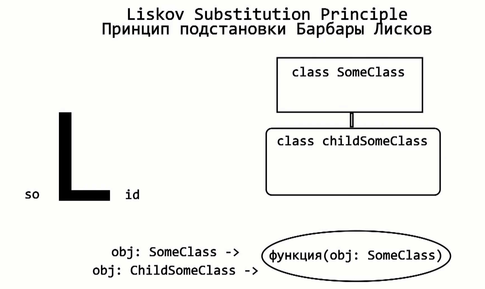

Мы имеем базовый класс персонажа. Он умеет есть и думать. Далее идёт разработчик. Он ко всему прочему умеет ещё писать код. Далее несколько базовых классов наследуются от разработчика, но один из этих классов не умеет кодить, что может приводить к ошибкам

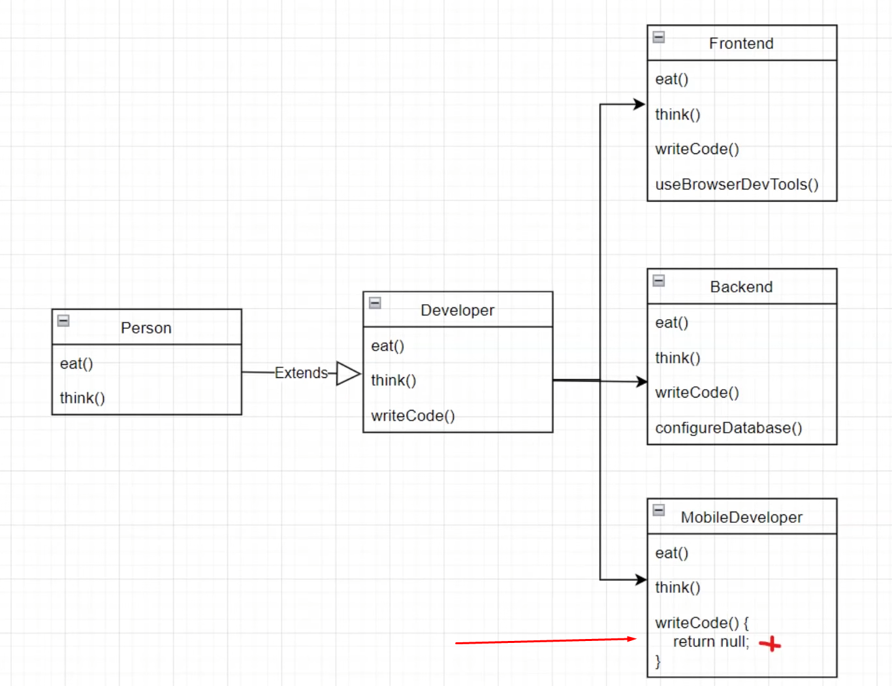

Мы имеем базовый класс базы данных, имеющий три базовых операции для всех БД, в который мы так же добавили специфический метод объединения таблиц 

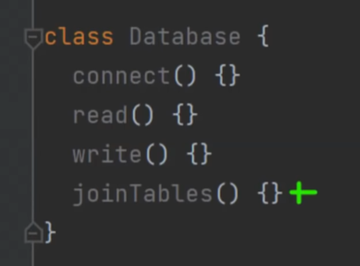

Если первая БД нормально заэкстендилась, так как она реляционная 

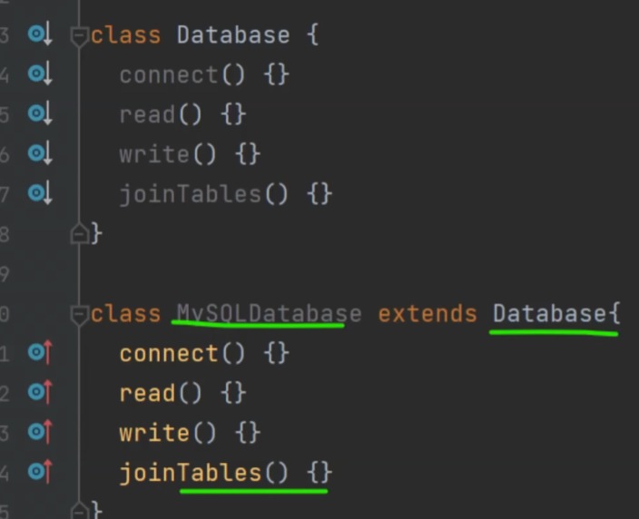

То уже вторая база (документоориентированная) не может иметь такой метод объединения таблиц

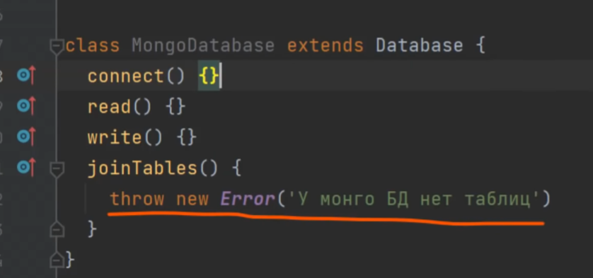

Более правильным вариантом было бы создать от базового класса ещё два разветвлённых класса, которые имеют отношение к разным видам БД 

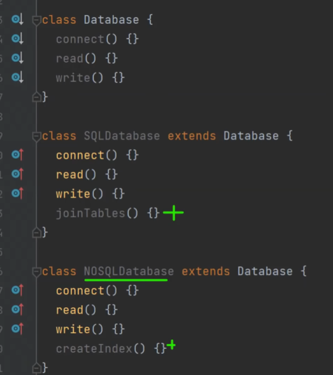

И уже конкретные БД экстендить от обобщённых  

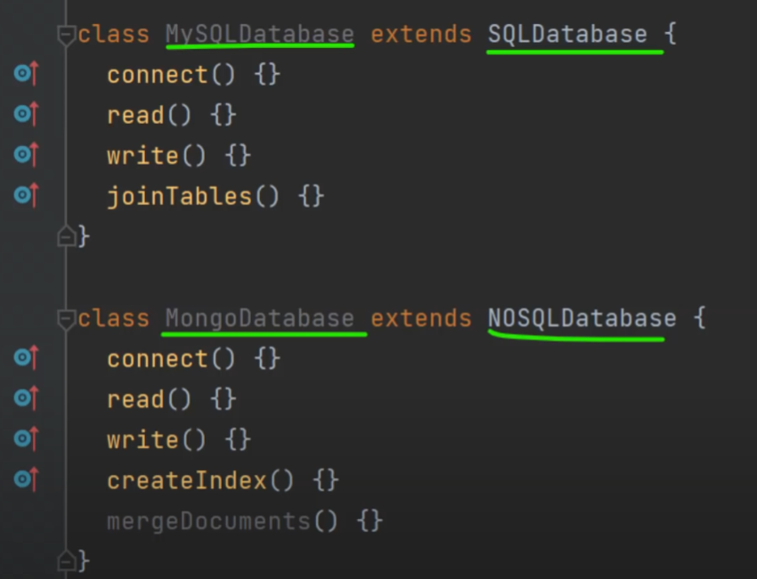

Это позволит нормально работать с разными БД под один базовый тип - `Database`

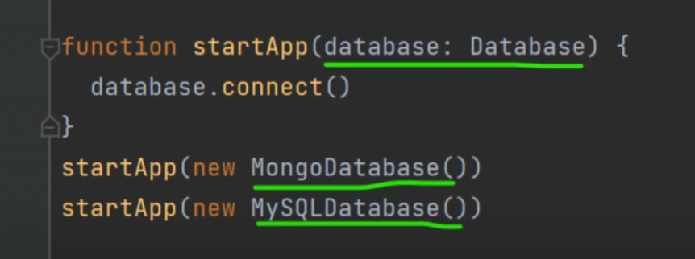

Полный код:

```TS
class Database {
  connect() {}
  read() {}
  write() {}
}

class SQLDatabase extends Database {
  connect() {}
  read() {}
  write() {}
  joinTables() {}
}

class NOSQLDatabase extends Database {
  connect() {}
  read() {}
  write() {}
  createIndex() {}
}

class MySQLDatabase extends SQLDatabase {
  connect() {}
  read() {}
  write() {}
  joinTables() {}
}

class MongoDatabase extends NOSQLDatabase {
  connect() {}
  read() {}
  write() {}
  createIndex() {}
  mergeDocuments() {}
}


function startApp(database: Database) {
  database.connect()
}
startApp(new MongoDatabase())
startApp(new MySQLDatabase())
```

Пример использования подхода на фронте:

```TSX
import React from "react";

interface RequisitesProps {
  onSave?: (obj) => void;
  onReset?: () => void;
  title?: string;
}
const Requisites = (props: RequisitesProps) => {
  const {
    onSave,
    onReset,
    title,
  } = props;

  return (
    <form>

        <div>
          <input type="text" placeholder="SWIFT"/>
          <input type="text" placeholder="KPP"/>
          <input type="text" placeholder=""/>
        </div>
      <h1>{title}</h1>
      <input type="text" placeholder="ИНН"/>
      <input type="text" placeholder="БИК"/>
      <input type="text" placeholder="НАЗВАНИЕ БАНКА"/>
      <input type="text" placeholder="НОМЕР СЧЕТА"/>
      <button onClick={onReset}>Сбросить форму</button>
      <button onClick={onSave}>Сохранить</button>
    </form>
  );
};

const ForeignRequisites = () => {

  return (
    <div>
      <input type="text" placeholder="SWIFT"/>
      <input type="text" placeholder="KPP"/>
      <input type="text" placeholder=""/>
      <Requisites
      />
    </div>
  )
}

const PassportData = () => {
  return (
    <div>
      <input type="number" placeholder="Серия паспорта"/>
      <input type="number" placeholder="Номер паспорта"/>
    </div>
  )
}

const FullRequisitesForm = () => {
  return (
    <div>
      <PassportData />
      <Requisites />
    </div>
  )
}

const FullForeignRequisitesForm = () => {
  return (
    <div>
      <PassportData />
      <ForeignRequisites />
    </div>
  )
}
```

### ISP (Interface Segragation Principle)

> Программные сущности не должны зависеть от методов, которые они не используют

Все наши большие интерфейсы нужно разбивать на более мелкие, которые должны решать только одну задачу 

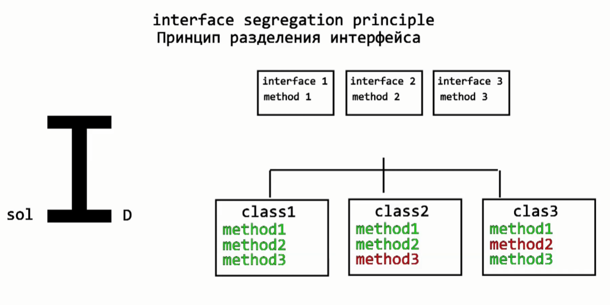

Самый простой пример нарушения принципа: мы используем один и тот же интерфейс для нескольких классов, где только один класс использует всю функциональность интерфейса - остальные либо возвращают null, либо выкидывают ошибку при использовании метода
*Такая практика является плохой*

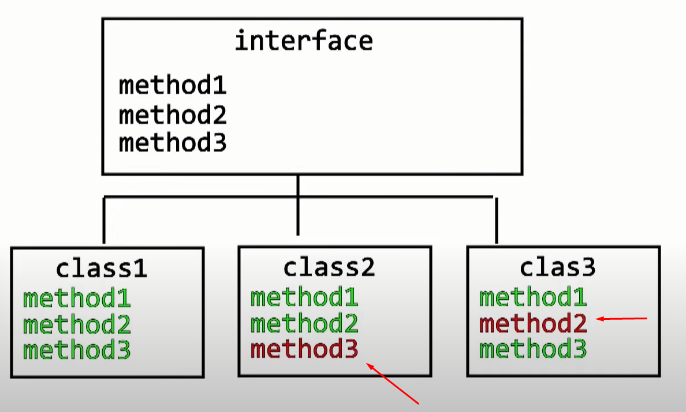


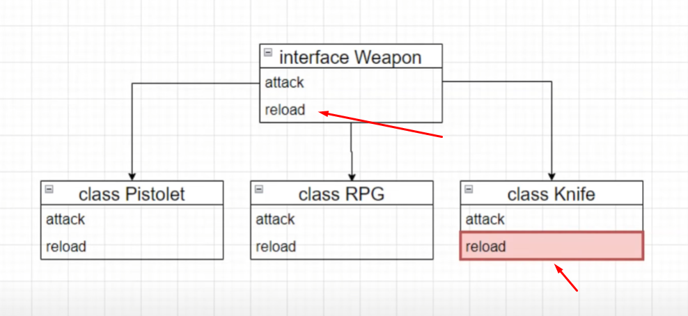


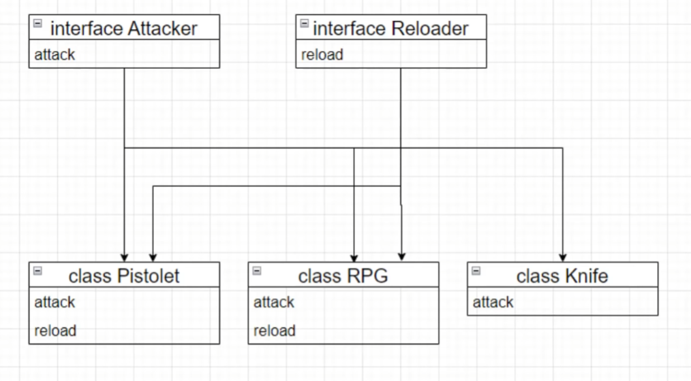

Тут мы разбили приложение, которое предоставляет SSR. Конкретно тут реализуется роутинг на сервере и на клиенте. 

Серверный роутер должен принимать подготовитель ссылок и парсер ссылок. На фронте же нужно получить роут и отрендерить его - сам роутер (для навигации) и парсер ссылок

```TS
enum Route {
  ABOUT='about_page',
  HOME='home_page',
}

interface UrlParser {
  parseUrl: (url) => void;
  addQueryParams: (params: Record<string, string>) => void;
}

interface Router {
  navigate: (route: Route) => void;
  attachEventListeners: () => void;
}

interface UrlPreparer {
  prepareUrlForClient: (url: string) => void;
}

class ServerRouter implements UrlParser, UrlPreparer {
  parseUrl(url): void {}
  addQueryParams(params: Record<string, string>): void {}
  prepareUrlForClient(url: string): void {}
}

class ClientRouter implements Router, UrlParser {
  addQueryParams(params: Record<string, string>): void {}
  parseUrl(url): void {}
  attachEventListeners(): void {}
  navigate(route: Route): void {}
}
```

Далее у нас идёт ещё один пример, когда мы отправляем запросы внтури сервера и с клиента на сервер. Интерфейс их запросов похож, однако он может различаться тем, что на фронте нам может потребоваться токен. 
Тут мы отделяем работу с токенами в отдельный интерфейс `TokenStorage` и сам запрос, который находится в `HttpRequest`. Второй интерфейс используется на сервере для запросов.

```TS
interface Router {
  parseUrl: (url) => void;
  addQueryParams: (params: Record<string, string>) => void;
}

interface HttpRequest {
  get: () => void;
  post: () => void;
  put: () => void;
  delete: () => void;
}

interface TokenStorage {
  addToken: () => void;
  getToken: () => void;
}

// Внутри используем axios или http module
class ServerHttp implements HttpRequest {
  delete(): void {}
  get(): void {}
  post(): void {}
  put(): void {}
}

// Внутри используем fetch
class ClientHttp implements HttpRequest, TokenStorage {
  delete(): void {}
  get(): void {}
  post(): void {}
  put(): void {}

  addToken(): void {
    return localStorage.get('token')
  }
  getToken(): void {}
}

const createDependencyContainer = (router: Router, store, httpRequest: HttpRequest) => {
  return {
    getRouter: () => router,
    getStore: () => store,
    getRequest: () => httpRequest,
  }
}
```

> [!success] Основные плюсы данного подхода:
>  - Мы избавляем программные сущности от методов, которые они не используют
>  - Получаем более предсказуемую работу кода
>  - Код становится менее связанным между друг другом

### DIP (Dependency Invertion Principle)

> Модули высокого уровня не должны зависеть от модулей более низкого уровня - все они должны зависеть от абстракций, а абстракции в это время не должны зависеть от деталей, так как детали должны зависеть от абстракций

Самый простой пример для объяснения данного прицнипа:
- на нашем заводе присутствуют работники, станки и электричество
- все они связаны: работник работает за станком, станок работает от электричества
- и тут в станке ломается одна деталь
- после замены детали мы замечаем, что логика работы станка меняется и нам требуются новые рабочие, так же для станка требуется большее напряжение, что требует замены как рабочих рук, так и системы электропитания

*Это явный пример нарушения данного принципа*

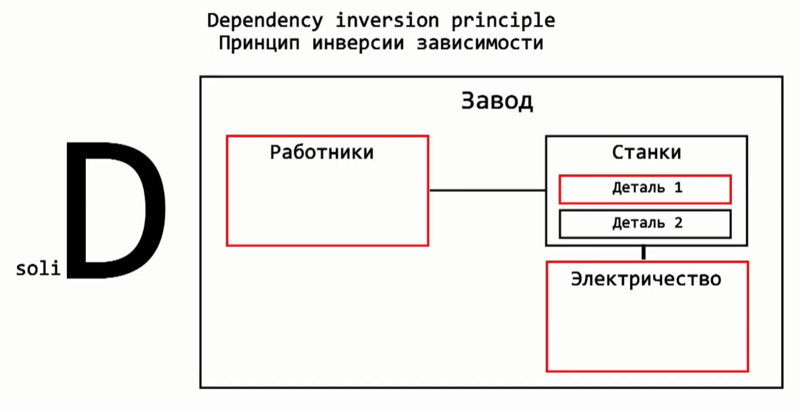

Чтобы решить проблему со станками можно:
- предоставить работникам пульт, который будет сам регулировать работу станка, что позволит нам менять целые станки
- поставить трансформатор, чтобы контролировать поток электричества к станку

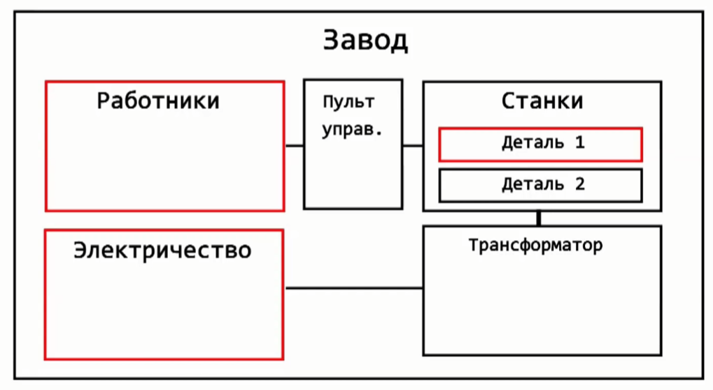

Тут представлена работа сразу с несколькими сервисами. Представленная реализация работы с несколькими клиентами позволяет нам не писать логику работы под один определённый сервис - мы можем начать работать с любым из них. 

```TS
// базовый интерфейс для всех музыкальных сервисов
interface MusicApi {
  getTracks: () => void;
}

// первый музыкальный сервис
class YandexMusicApi implements MusicApi {
  getTracks(): void {}
}

// второй музыкальный сервис
class SpotifyApi implements MusicApi {
  getTracks(): void {}
}

// третий музыкальный сервис
class VKMusicApi implements MusicApi {
  getTracks(): void {}
}

// класс музыкального клиента, который вызвает нужный клиент - это определённая абстракция / звено между АПИ клиента и музыкального сервиса
class MusicClient implements MusicApi {
  client: MusicApi;

  constructor(client: MusicApi) {
    this.client = client;
  }

  getTracks() {
    this.client.getTracks();
  }
}

// входная точка в приложение
const MusicApp = () => {
  // тут мы определяем, с каким клиентом сейчас мы хотим работать 
  const API = new MusicClient(new SpotifyApi())

  API.getTracks()
}
```
