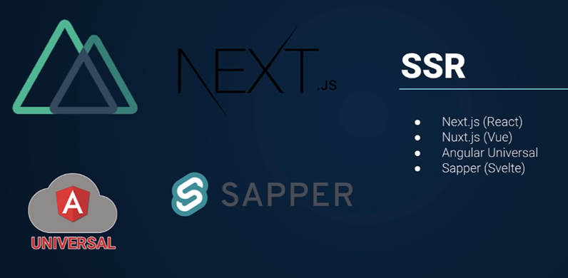

## **SSR**
#NextJS #NuxtJS #AngularUniversal #Sapper

**Server-***side** **rendering** – эта технология позволяет изначально генерировать определённую структуру страницы на сервере. Дело в том, что SPA сайты не парсятся роботом поисковиков, поэтому отпадает СЕО-оптимизация. Для исправления этой ситуации используют ССР технологии, чтобы генерировался HTML-код на сервере и выдавался пользователю

Материалы:
[React + Next.js - с нуля](../../Development/FrontEnd/React%20+%20Next.js%20-%20с%20нуля.%20TypeScript,%20Hooks,%20SSR%20и%20CSS%20Grid%20(2021)/React%20+%20Next.js%20-%20с%20нуля.md)