Внизу программы есть возможность выбрать режим отображения

Вверху можно включить режим только отображения готовой разметки

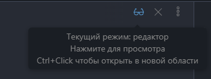

Очень удобная штука - разделение окна по нужной оси

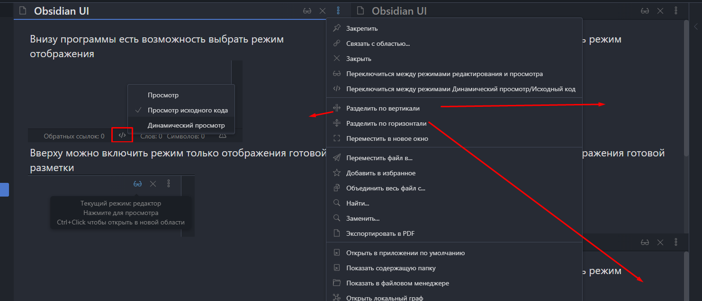

Эта палитра позволяет открыть заметку, если она есть или создать, если её нет

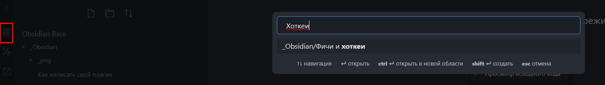

Тут можно открыть новую базу

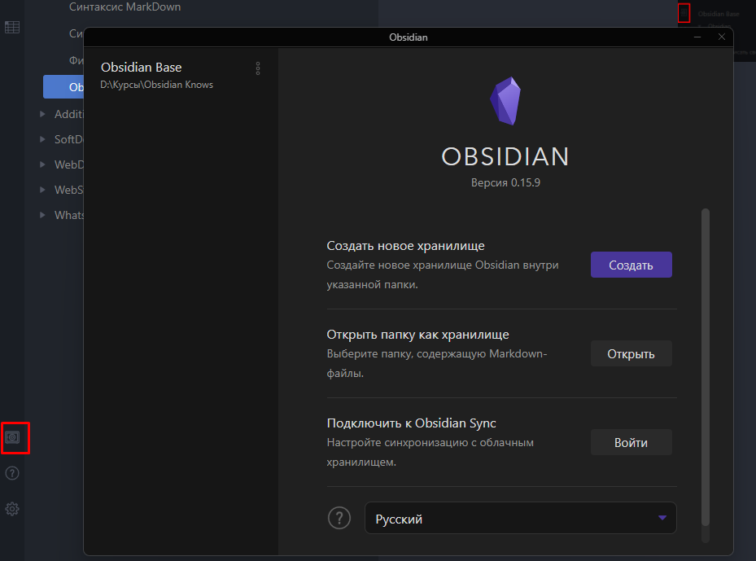

Палитра команд хранит в себе все команды, которые есть в обсидиане и которые могут появится за счёт плагинов

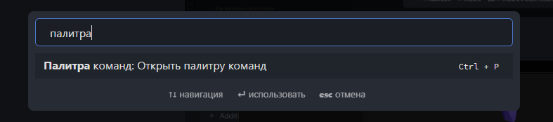

Эта настройка позволяет включить данную боковую панель, в которой уже можно шастать по заголовкам и искать ссылки

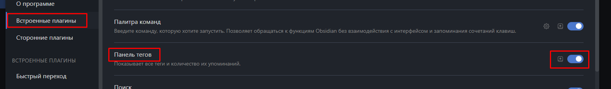
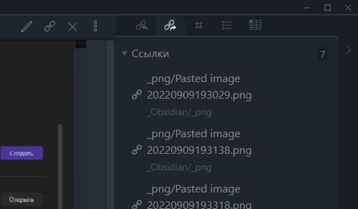

Ставим эти настройки для спокойной жизни

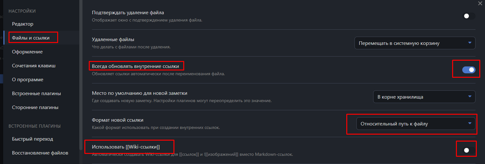

- Сторонние плагины, которые будут автоматически перераспределять ссылки (при перемещении будут они исправляться для совместимости с другими редакторами) и для уникализации аттачментов (повторяющиеся будут подчищаться). 
Всё безопасно и можно использовать!

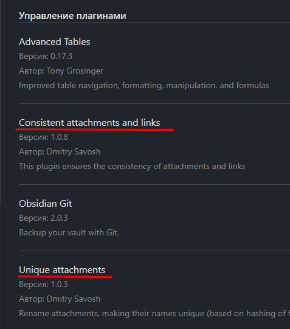
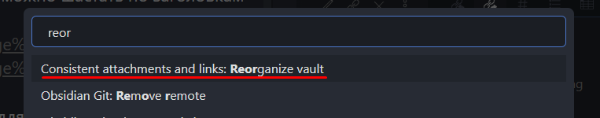
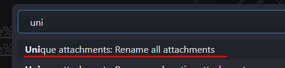

Основная фишка философии обсидиана - это его ссылочная система, которая и позволяет реализовать связи внутри графа 

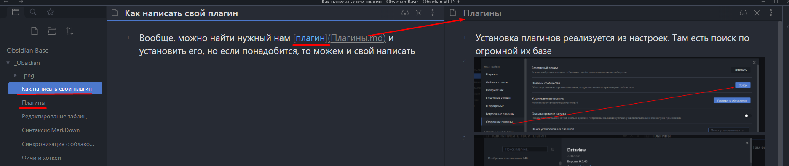
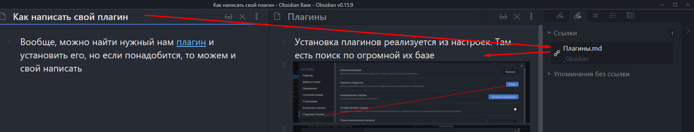

Тут находится отображение ссылок из внешних источников на эту заметку

#тег_который_удобно_использовать - он отображается в панели тегов заметки  

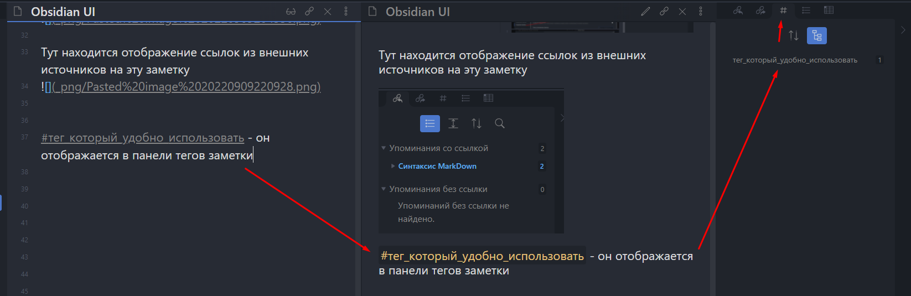

Так же тут фичёво устроены подтеги для тегов

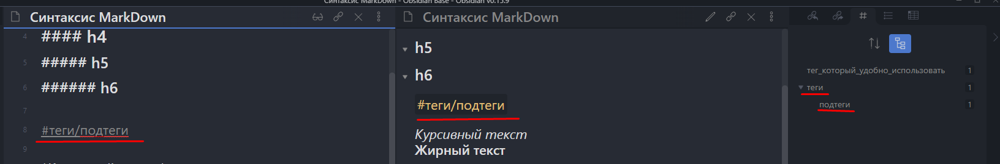

Какие варианты поиска есть:

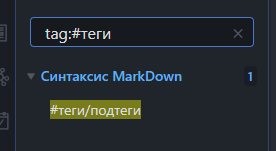
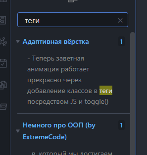
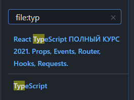

Так же стоит упомянуть, что можно прописывать целые группы запросов для поиска

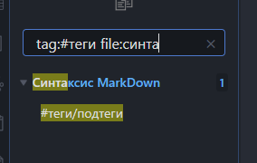

Минус исключает из списка поиска выбранные теги

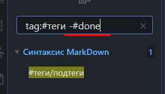

Отображение файла в менеджере

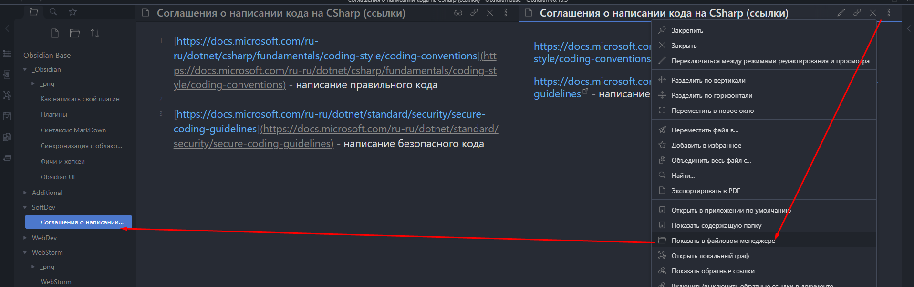